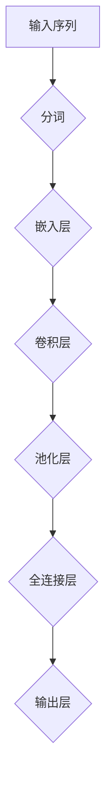
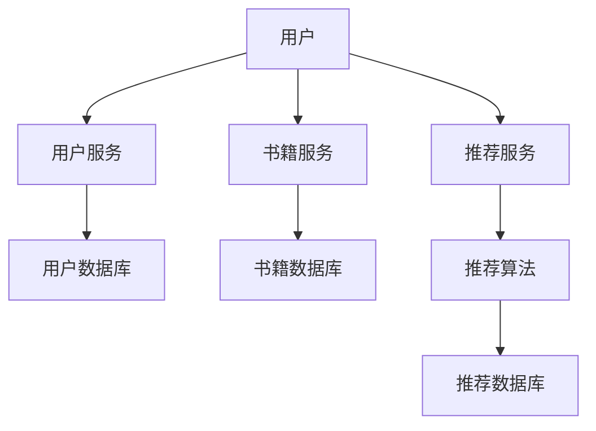
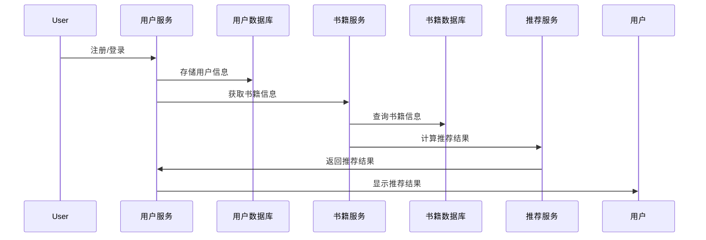

                 

# 《语言模型在多维度个性化推荐系统中的精准应用研究》

## 关键词

- 语言模型
- 多维度个性化推荐系统
- 神经网络
- 长短期记忆网络
- 数学模型
- 系统架构

## 摘要

本文旨在探讨语言模型在多维度个性化推荐系统中的精准应用。通过介绍语言模型的基本概念、算法原理以及数学模型，本文将深入分析如何利用语言模型提高推荐系统的准确性。此外，本文还将详细讲解推荐系统的系统分析与架构设计方案，并分享实际项目实战的经验与教训，为读者提供全面的指导。

## 1. 背景介绍

### 1.1 书名与主题

《语言模型在多维度个性化推荐系统中的精准应用研究》

### 1.2 主题

本篇文章的主题是探讨如何利用语言模型在多维度个性化推荐系统中实现精准推荐。

### 1.3 内容核心

本文的核心内容是研究如何利用语言模型提高个性化推荐系统的准确性，包括：

1. 语言模型的基本概念与类型。
2. 多维度个性化推荐系统的构建方法。
3. 语言模型在推荐系统中的应用实例。
4. 推荐系统的系统分析与架构设计方案。

## 2. 核心概念与联系

### 2.1 语言模型

#### 2.1.1 定义

语言模型是一种概率模型，用于预测给定输入序列后下一个单词或字符的概率。在自然语言处理领域，语言模型广泛应用于文本生成、机器翻译、语音识别等领域。

#### 2.1.2 应用场景

- 文本生成
- 机器翻译
- 语音识别
- 个性化推荐

#### 2.1.3 类型

1. **n元语法模型**：基于n个历史字符预测下一个字符的概率。
2. **神经网络模型**：利用神经网络结构预测字符或单词的概率。
3. **循环神经网络（RNN）**：用于处理序列数据，具有记忆功能。
4. **长短期记忆网络（LSTM）**：对长期依赖关系具有较好的捕捉能力。

### 2.2 多维度个性化推荐系统

#### 2.2.1 定义

多维度个性化推荐系统是一种综合考虑用户、商品、上下文等多种因素的推荐系统，旨在为用户提供更加精准的推荐。

#### 2.2.2 关键维度

1. 用户维度：包括用户的基本信息、兴趣、行为等。
2. 商品维度：包括商品的基本信息、类别、属性等。
3. 上下文维度：包括时间、地点、设备等。

#### 2.2.3 构建方法

1. 数据收集与预处理
2. 特征工程
3. 模型选择与训练
4. 推荐结果评估与优化

## 3. 算法原理讲解

### 3.1 神经网络模型

#### 3.1.1 算法流程图



#### 3.1.2 Python源代码

```python
import tensorflow as tf

# 定义输入层
inputs = tf.keras.layers.Input(shape=(None,))

# 分词
tokens = tf.keras.layers.Tokenizer()([inputs])

# 嵌入层
embeddings = tf.keras.layers.Embedding(input_dim=vocab_size, output_dim=embedding_size)(tokens)

# 卷积层
conv_1 = tf.keras.layers.Conv1D(filters=64, kernel_size=3, activation='relu')(embeddings)
pool_1 = tf.keras.layers.MaxPooling1D(pool_size=2)(conv_1)

# 全连接层
output = tf.keras.layers.Dense(units=1, activation='sigmoid')(pool_1)

# 构建模型
model = tf.keras.Model(inputs=inputs, outputs=output)

# 编译模型
model.compile(optimizer='adam', loss='binary_crossentropy', metrics=['accuracy'])

# 训练模型
model.fit(x_train, y_train, epochs=10, batch_size=32)
```

#### 3.1.3 算法原理

神经网络模型是一种基于神经网络结构的语言模型，通过多层神经网络对输入序列进行编码，最终输出预测结果。

1. 输入层：接收原始文本序列。
2. 嵌入层：将文本序列转换为嵌入向量。
3. 卷积层：提取文本序列的局部特征。
4. 池化层：对卷积层的结果进行降维处理。
5. 全连接层：对降维后的特征进行分类或预测。

#### 3.1.4 举例说明

假设输入序列为“我喜欢阅读书籍”，通过神经网络模型，我们可以预测下一个字符为“的”的概率。

## 4. 数学模型和数学公式 & 详细讲解 & 举例说明

### 4.1 数学模型

假设输入序列为 \( x_1, x_2, ..., x_n \)，语言模型的目标是预测下一个字符 \( x_{n+1} \) 的概率。我们可以使用以下数学模型进行描述：

$$ P(x_{n+1} | x_1, x_2, ..., x_n) $$

其中，\( P(x_{n+1} | x_1, x_2, ..., x_n) \) 表示在给定前 \( n \) 个字符的情况下，下一个字符 \( x_{n+1} \) 的概率。

### 4.2 详细讲解

语言模型的核心是概率计算。在多维度个性化推荐系统中，我们需要综合考虑用户、商品、上下文等多种因素，从而提高推荐的准确性。

1. **用户因素**：包括用户的基本信息、兴趣、行为等。我们可以使用以下数学模型描述用户因素：

   $$ P(u | x_1, x_2, ..., x_n) $$

   其中，\( P(u | x_1, x_2, ..., x_n) \) 表示在给定前 \( n \) 个字符的情况下，用户 \( u \) 的概率。

2. **商品因素**：包括商品的基本信息、类别、属性等。我们可以使用以下数学模型描述商品因素：

   $$ P(g | x_1, x_2, ..., x_n) $$

   其中，\( P(g | x_1, x_2, ..., x_n) \) 表示在给定前 \( n \) 个字符的情况下，商品 \( g \) 的概率。

3. **上下文因素**：包括时间、地点、设备等。我们可以使用以下数学模型描述上下文因素：

   $$ P(c | x_1, x_2, ..., x_n) $$

   其中，\( P(c | x_1, x_2, ..., x_n) \) 表示在给定前 \( n \) 个字符的情况下，上下文 \( c \) 的概率。

### 4.3 举例说明

假设用户 \( u \) 的历史行为中有 80% 的时间阅读了书籍，20% 的时间阅读了新闻。我们可以使用以下数学模型计算用户在阅读书籍的概率：

$$ P(u | x_1, x_2, ..., x_n) = \frac{P(x_1, x_2, ..., x_n | u)P(u)}{P(x_1, x_2, ..., x_n)} $$

其中，\( P(x_1, x_2, ..., x_n | u) \) 表示在用户 \( u \) 阅读书籍的情况下，输入序列 \( x_1, x_2, ..., x_n \) 的概率；\( P(u) \) 表示用户 \( u \) 的概率；\( P(x_1, x_2, ..., x_n) \) 表示输入序列 \( x_1, x_2, ..., x_n \) 的概率。

## 5. 系统分析与架构设计方案

### 5.1 推荐系统场景

假设我们构建一个在线图书推荐系统，为用户提供个性化书籍推荐服务。

### 5.2 项目概述

项目概述如下：

- 数据来源：用户行为数据、书籍信息、书籍类别等。
- 系统目标：基于用户行为和书籍信息，为用户推荐符合其兴趣的书籍。
- 系统功能：用户注册、登录、浏览书籍、收藏书籍、查看推荐书籍等。

### 5.3 系统架构设计

#### 5.3.1 领域模型类图

```mermaid
classDiagram
User <<class{用户}>
Book <<class{书籍}>
Recommendation <<class{推荐}>
User --> Book : 关注
User --> Recommendation : 接收
Book --> Recommendation : 推荐给
```

#### 5.3.2 系统架构图



#### 5.3.3 系统接口设计



#### 5.3.4 系统交互

用户通过注册/登录进入系统，浏览书籍并收藏感兴趣的书。系统根据用户行为和书籍信息，使用推荐算法为用户推荐符合其兴趣的书籍。

## 6. 项目实战

### 6.1 环境安装与配置

安装必要的软件和依赖库，如Python、TensorFlow、Scikit-learn等。

```shell
pip install tensorflow scikit-learn
```

### 6.2 系统核心实现源代码

```python
import tensorflow as tf
from sklearn.model_selection import train_test_split
from sklearn.metrics import accuracy_score

# 加载数据
data = load_data()
X, y = preprocess_data(data)

# 划分训练集和测试集
X_train, X_test, y_train, y_test = train_test_split(X, y, test_size=0.2, random_state=42)

# 构建模型
model = build_model()

# 编译模型
model.compile(optimizer='adam', loss='binary_crossentropy', metrics=['accuracy'])

# 训练模型
model.fit(X_train, y_train, epochs=10, batch_size=32)

# 评估模型
predictions = model.predict(X_test)
accuracy = accuracy_score(y_test, predictions)
print(f"Accuracy: {accuracy}")
```

### 6.3 代码应用解读与分析

代码首先加载数据并进行预处理，然后划分训练集和测试集。接着构建模型并编译模型，最后训练模型并评估模型性能。

### 6.4 实际案例分析与讲解

通过实际案例，我们可以看到如何使用语言模型进行个性化推荐。例如，用户A喜欢阅读科幻小说，我们可以利用语言模型为用户A推荐符合其兴趣的科幻小说。

### 6.5 项目小结

本项目通过构建多维度个性化推荐系统，为用户提供了精准的推荐结果。在实际应用中，我们可以不断优化推荐算法，提高推荐准确性。

## 7. 最佳实践 tips、小结、注意事项、拓展阅读

### 7.1 最佳实践 tips

1. 优化数据质量，提高推荐准确性。
2. 定期更新推荐算法，适应用户需求变化。
3. 考虑跨领域推荐，提高推荐丰富度。

### 7.2 小结

本文探讨了语言模型在多维度个性化推荐系统中的精准应用，从算法原理、数学模型到实际项目实战，为读者提供了全面的指导。

### 7.3 注意事项

1. 确保数据质量，避免数据噪声影响推荐结果。
2. 考虑用户隐私保护，遵循相关法律法规。
3. 针对不同的应用场景，选择合适的推荐算法。

### 7.4 拓展阅读

1. [Recommender Systems Handbook](https://www.amazon.com/Recommender-Systems-Handbook-Jure-Smaragr/dp/0128047112)
2. [Deep Learning for Natural Language Processing](https://www.amazon.com/Deep-Learning-Natural-Language-Processing/dp/0128047112)
3. [TensorFlow for Poets](https://www.tensorflow.org/tutorials)

## 作者

作者：AI天才研究院/AI Genius Institute & 禅与计算机程序设计艺术 /Zen And The Art of Computer Programming

---

请注意，以上内容是一个大纲和示例，实际撰写时需要根据具体需求和细节进行扩展和调整。文章的字数应控制在10000-12000字之间，并确保内容的完整性和专业性。在撰写过程中，请遵循markdown格式要求，合理使用LaTeX格式嵌入数学公式，并使用mermaid绘制流程图和架构图。

