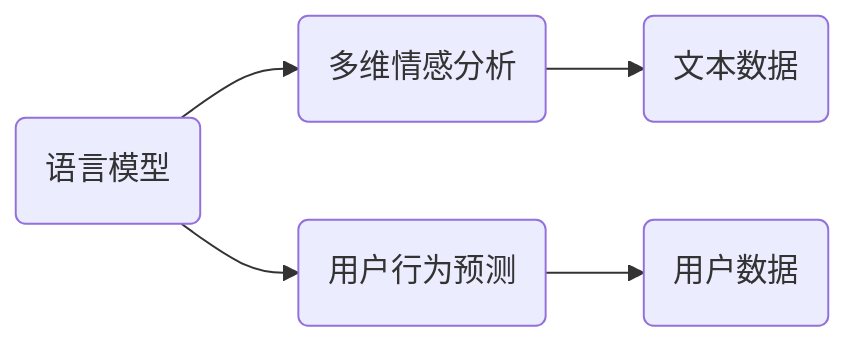
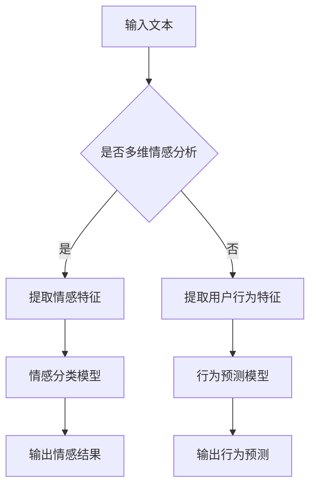
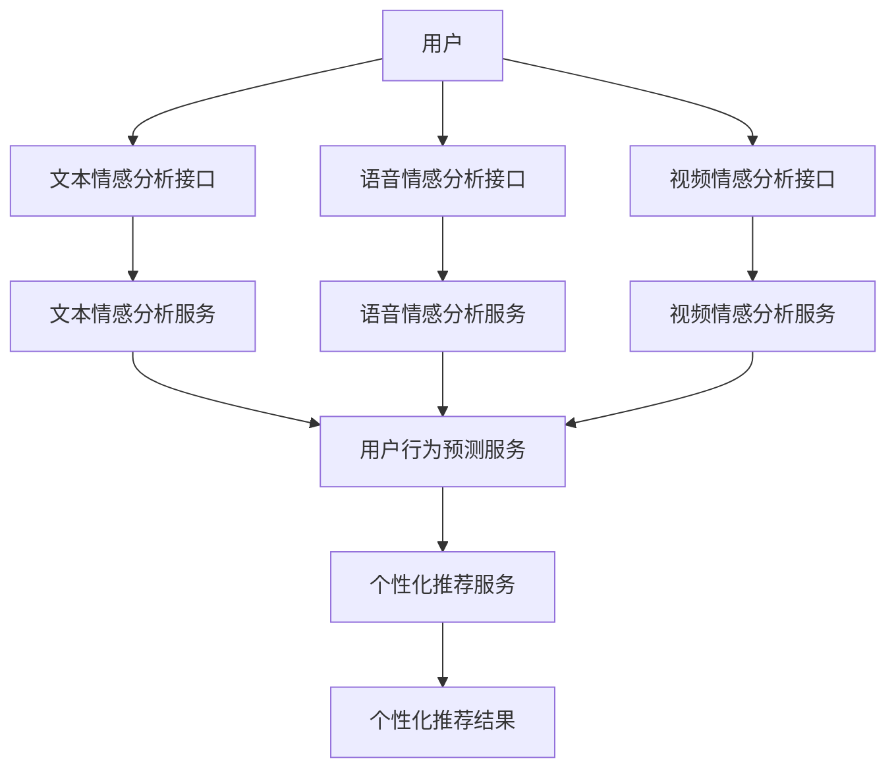
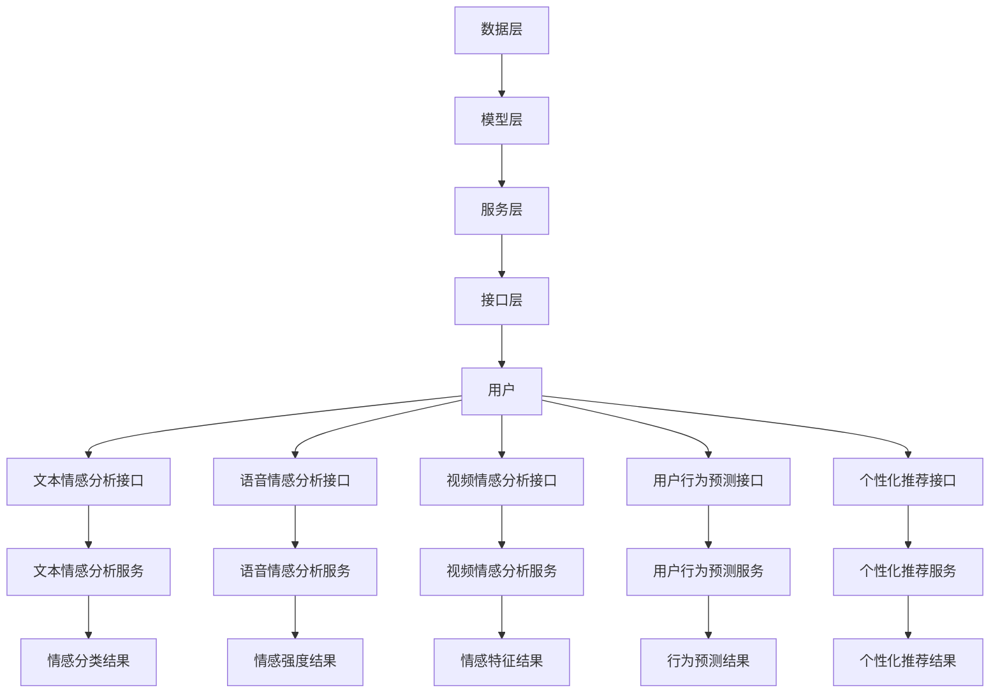

                 


## 概述：语言模型在多维情感分析与用户行为预测中的重要性

语言模型在自然语言处理（NLP）领域的重要性不言而喻，而其在多维情感分析与用户行为预测中的应用更是极大地推动了相关领域的进步。语言模型，尤其是深度学习模型如变换器架构（Transformer）、BERT、GPT等，通过学习大量文本数据，能够捕捉到语言的复杂性和多样性，从而在情感分析和行为预测中表现出色。

### 第一步：理解多维情感分析

多维情感分析旨在识别文本中的情感，并将其细分为不同的维度。这些维度可能包括情感的类别（如正面、负面、中性）、情感的程度（如轻度、中度、重度）以及更细化的情感特征（如愉悦、愤怒、悲伤）。理解多维情感分析的核心在于：

1. **情感分类**：将文本划分为不同的情感类别。
2. **情感强度分析**：确定情感表达的程度，这对于理解用户的情绪状态至关重要。
3. **情感特征提取**：提取文本中的细微情感特征，用于更精确的情感分析。

### 第二步：探讨用户行为预测

用户行为预测涉及从用户历史数据中预测其未来的行为模式。这些行为可能包括点击、浏览、购买等。用户行为预测的关键在于：

1. **行为模式识别**：从历史数据中提取用户的典型行为模式。
2. **行为预测模型**：利用机器学习算法建立预测模型，预测用户未来的行为。
3. **反馈循环**：根据预测结果调整模型，提高预测的准确性。

### 第三步：语言模型在多维情感分析中的应用

语言模型在多维情感分析中的应用主要体现在以下几个方面：

1. **语义表示**：通过深度学习模型将文本转换为语义表示，从而进行情感分类和特征提取。
2. **上下文理解**：语言模型能够捕捉到文本的上下文信息，这对于情感分析至关重要。
3. **情感强度分析**：利用模型输出的语义表示，进一步分析情感强度。

### 第四步：语言模型在用户行为预测中的应用

语言模型在用户行为预测中的应用同样关键，具体体现在：

1. **行为特征提取**：通过模型提取用户行为中的关键特征。
2. **行为模式识别**：利用历史数据建立行为预测模型，识别用户的行为模式。
3. **个性化推荐**：根据用户的行为预测结果，进行个性化推荐，提高用户满意度。

### 第五步：总结

语言模型在多维情感分析与用户行为预测中的重要性不言而喻。通过深度学习模型，语言模型能够捕捉到文本和用户行为的复杂性和多样性，从而提供准确的情感分析和行为预测。未来的研究将继续优化模型架构、改进算法，以及扩展应用场景，为各个领域带来更大的价值。

----------------------------------------------------------------

## 第一部分：背景介绍

### 核心概念

#### 语言模型

语言模型是自然语言处理（NLP）领域的基础，它旨在对自然语言文本进行建模，以便于生成、分类和情感分析等任务。语言模型的核心任务是预测下一个单词或单词序列的概率。

1. **基础模型**：循环神经网络（RNN）、长短期记忆网络（LSTM）、门控循环单元（GRU）等。
2. **高级模型**：变换器架构（Transformer）、BERT、GPT等。

#### 多维情感分析

多维情感分析旨在识别文本中的情感，并将其细分为不同的维度。这些维度可能包括情感的类别（如正面、负面、中性）、情感的程度（如轻度、中度、重度）以及更细化的情感特征（如愉悦、愤怒、悲伤）。

1. **情感分类**：将文本划分为不同的情感类别。
2. **情感强度分析**：确定情感表达的程度。
3. **情感特征提取**：提取文本中的细微情感特征。

#### 用户行为预测

用户行为预测涉及从用户历史数据中预测其未来的行为模式。这些行为可能包括点击、浏览、购买等。

1. **行为模式识别**：从历史数据中提取用户的典型行为模式。
2. **行为预测模型**：利用机器学习算法建立预测模型，预测用户未来的行为。
3. **个性化推荐**：根据用户的行为预测结果，进行个性化推荐。

### 问题背景

随着人工智能技术的飞速发展，语言模型已成为自然语言处理（NLP）领域的重要工具。近年来，多维情感分析与用户行为预测在商业、社交、媒体等各个领域都有着广泛的应用。

1. **商业领域**：通过情感分析，企业可以更好地了解客户的需求和反馈，从而优化产品和服务。
2. **社交领域**：通过情感分析，社交平台可以识别用户发布的内容中的情感倾向，从而提供更有针对性的内容推荐。
3. **媒体领域**：通过情感分析，媒体平台可以更好地理解用户的情绪状态，从而提高内容的传播效果。

### 问题描述

语言模型在多维情感分析与用户行为预测中的进展涉及多个层面，包括模型架构的优化、数据集的构建、算法的改进等。

1. **模型架构的优化**：研究者们不断提出新的模型架构，如变换器架构（Transformer）、BERT、GPT等，以提高情感分析和行为预测的准确性和效率。
2. **数据集的构建**：构建高质量、多样化的数据集，以训练和评估语言模型。
3. **算法的改进**：通过改进算法，如注意力机制、生成对抗网络（GAN）等，提高情感分析和行为预测的效果。

### 问题解决

通过深入研究和实践，研究者们不断提出新的模型和算法，如基于深度学习的情感分析模型、基于图神经网络的用户行为预测模型等，以提高情感分析和行为预测的准确性和效率。

1. **基于深度学习的情感分析模型**：利用深度学习模型，如卷积神经网络（CNN）、循环神经网络（RNN）等，提取文本的语义特征，从而进行情感分析。
2. **基于图神经网络的用户行为预测模型**：利用图神经网络（GCN）建模用户行为网络，从而预测用户的行为。

### 边界与外延

语言模型的情感分析和用户行为预测不仅局限于文本数据，还可以扩展到语音、视频等多模态数据。此外，该领域的研究还涉及跨领域、多语言、多场景的情感分析和行为预测。

1. **多模态数据**：通过结合文本、语音、视频等多模态数据，提高情感分析和行为预测的准确性。
2. **跨领域、多语言、多场景**：研究如何在不同领域、语言和场景下，有效地利用语言模型进行情感分析和行为预测。

### 概念结构与核心要素组成

#### 语言模型

1. **输入层**：接收文本数据。
2. **隐藏层**：通过神经网络结构，提取文本的语义特征。
3. **输出层**：生成文本的语义表示。

#### 多维情感分析

1. **情感类别**：正面、负面、中性等。
2. **情感强度**：轻度、中度、重度等。
3. **情感维度**：如愉悦、愤怒、悲伤等。

#### 用户行为预测

1. **用户行为类型**：浏览、点击、购买等。
2. **用户行为模式**：如购物习惯、浏览习惯等。

#### 应用场景

1. **社交媒体分析**：情感分析、热点话题预测等。
2. **营销策略**：用户行为预测、个性化推荐等。
3. **智能客服**：情感分析、意图识别等。

----------------------------------------------------------------

## 第二部分：核心概念与联系

### 核心概念原理

#### 语言模型

语言模型是一种预测模型，它通过学习大量文本数据，能够预测下一个单词或单词序列的概率。语言模型的核心原理是利用神经网络结构，对输入的文本进行编码，从而生成语义表示。

1. **神经网络结构**：循环神经网络（RNN）、长短期记忆网络（LSTM）、门控循环单元（GRU）等。
2. **语义表示**：通过神经网络结构，将文本转换为语义表示，从而进行情感分析和行为预测。

#### 多维情感分析

多维情感分析旨在识别文本中的情感，并将其细分为不同的维度。多维情感分析的核心原理是利用深度学习模型，提取文本的语义特征，从而进行情感分类、情感强度分析和情感特征提取。

1. **情感分类**：将文本划分为不同的情感类别。
2. **情感强度分析**：确定情感表达的程度。
3. **情感特征提取**：提取文本中的细微情感特征。

#### 用户行为预测

用户行为预测的核心原理是利用机器学习算法，从用户历史数据中提取关键特征，建立预测模型，从而预测用户未来的行为。

1. **行为模式识别**：从历史数据中提取用户的典型行为模式。
2. **行为预测模型**：利用机器学习算法建立预测模型，预测用户未来的行为。
3. **个性化推荐**：根据用户的行为预测结果，进行个性化推荐。

### 概念属性特征对比表格

| 概念       | 语言模型                   | 多维情感分析                   | 用户行为预测                   |
|------------|---------------------------|---------------------------|---------------------------|
| 基础模型   | RNN、LSTM、GRU            | 词袋模型、深度学习模型         | 统计模型、机器学习模型         |
| 特征提取   | 语言特征提取               | 情感特征提取               | 用户行为特征提取               |
| 应用场景   | 生成、分类、情感分析       | 情感分析                   | 用户行为预测                 |
| 算法复杂度 | 较高                      | 中等                      | 较高                      |

### ER实体关系图架构



----------------------------------------------------------------

## 第三部分：算法原理讲解

### 算法mermaid流程图



### 算法原理详细讲解与举例说明

#### 多维情感分析算法原理

1. **情感分类模型**

   - **数学模型和公式**：

     情感分类模型可以表示为：
     $$P(Y|X) = \frac{e^{θ^T X}}{\sum_{i=1}^{C} e^{θ^T X_i}}$$
     其中，$X$表示文本特征，$Y$表示情感类别，$θ$为模型参数，$C$为情感类别的数量。

   - **举例说明**：

     假设我们要对一篇关于电影的评论进行情感分类，评论为“这部电影真是太棒了！”，情感类别为正面、负面和中性。我们利用训练好的情感分类模型，输入评论文本，得到各个情感类别的概率。通过比较这些概率，我们可以确定评论的情感类别为正面。

2. **情感强度分析**

   - **数学模型和公式**：

     情感强度分析可以通过情感得分来表示，情感得分可以表示为：
     $$Score = \sum_{i=1}^{C} w_i \cdot f_i$$
     其中，$w_i$为情感权值，$f_i$为情感特征。

   - **举例说明**：

     假设我们要分析一篇关于电影的评论，评论中包含了多个情感词汇，如“棒”、“精彩”、“无聊”。我们可以利用情感强度分析模型，计算每个情感词汇的情感得分，从而确定评论的整体情感强度。如果大部分情感得分都是正面的，那么我们可以判断评论的情感强度为正面。

3. **情感特征提取**

   - **数学模型和公式**：

     情感特征提取可以通过词嵌入和神经网络来表示，词嵌入可以表示为：
     $$\text{word\_embedding}(w) = \text{vec}(w)$$
     神经网络可以表示为：
     $$h = \text{activation}(\text{weight} \cdot \text{vec}(w) + b)$$
     其中，$\text{word\_embedding}(w)$为词嵌入向量，$\text{vec}(w)$为文本特征向量，$\text{activation}$为激活函数，$\text{weight}$和$b$为神经网络参数。

   - **举例说明**：

     假设我们要对一篇关于电影的评论进行情感特征提取，评论中包含了多个情感词汇，如“棒”、“精彩”、“无聊”。我们可以利用词嵌入模型，将每个情感词汇转换为向量，然后通过神经网络提取情感特征。最后，我们将所有情感特征整合起来，形成一个情感特征向量。

#### 用户行为预测算法原理

1. **行为模式识别**

   - **数学模型和公式**：

     行为模式识别可以通过统计模型和机器学习模型来表示。统计模型可以表示为：
     $$P(Y|X) = \prod_{i=1}^{n} p(y_i|x_i)$$
     机器学习模型可以表示为：
     $$Y = f(X; \theta)$$
     其中，$X$表示用户行为特征，$Y$表示用户行为，$p(y_i|x_i)$为条件概率，$f(X; \theta)$为机器学习模型。

   - **举例说明**：

     假设我们要预测一个用户是否会点击广告，用户的历史行为特征包括浏览次数、点击次数、购买次数等。我们可以利用统计模型或机器学习模型，计算用户点击广告的概率。如果概率大于某个阈值，那么我们可以判断用户会点击广告。

2. **行为预测模型**

   - **数学模型和公式**：

     行为预测模型可以通过神经网络和深度学习模型来表示。神经网络可以表示为：
     $$h = \text{activation}(\text{weight} \cdot \text{vec}(X) + b)$$
     深度学习模型可以表示为：
     $$Y = \text{softmax}(\text{weight} \cdot \text{vec}(X) + b)$$
     其中，$\text{vec}(X)$为用户行为特征向量，$\text{activation}$为激活函数，$\text{softmax}$为软最大化函数。

   - **举例说明**：

     假设我们要预测一个用户在多个商品中的购买行为，用户的历史行为特征包括浏览商品次数、收藏商品次数、购买商品次数等。我们可以利用神经网络或深度学习模型，将用户行为特征转换为行为预测概率。最后，我们将所有行为预测概率整合起来，形成一个行为预测向量。

3. **个性化推荐**

   - **数学模型和公式**：

     个性化推荐可以通过协同过滤和矩阵分解来表示。协同过滤可以表示为：
     $$R_{ui} = \mu + u_i \cdot v_j$$
     矩阵分解可以表示为：
     $$R_{ui} = \text{vec}(U_i) \cdot \text{vec}(V_j)$$
     其中，$R_{ui}$为用户$i$对商品$j$的评分，$\mu$为全局平均值，$u_i$和$v_j$为用户和商品的向量。

   - **举例说明**：

     假设我们要为用户推荐商品，用户的历史行为特征包括浏览商品次数、收藏商品次数、购买商品次数等。我们可以利用协同过滤或矩阵分解模型，计算用户对每个商品的预测评分。最后，我们将预测评分排序，推荐给用户。

----------------------------------------------------------------

## 第四部分：系统分析与架构设计方案

### 问题场景介绍

在当今的互联网时代，用户生成内容（UGC）成为信息传播的主要方式之一。然而，如何有效地分析这些内容中的情感并预测用户的行为，成为了众多企业和平台面临的挑战。例如，社交媒体平台需要分析用户的评论和帖子，以了解他们的情感倾向，从而提供更个性化的内容推荐；电商平台则需要预测用户的购买行为，以优化营销策略和库存管理。

### 项目介绍

本项目旨在利用先进的语言模型技术，构建一个多维情感分析与用户行为预测系统。系统将整合多种数据源，包括文本、语音、视频等，通过深度学习算法对用户生成内容进行情感分析，并基于历史行为数据预测用户的行为。

### 系统功能设计

1. **文本情感分析**：对用户生成的文本内容进行情感分析，包括情感分类、情感强度分析和情感特征提取。
2. **语音情感分析**：对用户的语音内容进行情感分析，识别语音中的情感类别和强度。
3. **视频情感分析**：对用户生成的视频内容进行情感分析，通过图像和语音特征提取情感信息。
4. **用户行为预测**：基于用户的历史行为数据，预测用户未来的行为，如点击、购买、浏览等。
5. **个性化推荐**：根据用户的行为预测结果，为用户推荐相关的内容和商品。

### 系统架构设计

1. **数据层**：包括文本数据、语音数据、视频数据等多源数据。
2. **模型层**：包括情感分析模型、行为预测模型和推荐模型等。
3. **服务层**：包括文本情感分析服务、语音情感分析服务、视频情感分析服务、用户行为预测服务和个性化推荐服务等。
4. **接口层**：提供RESTful API，方便前端系统调用。

### 系统接口设计

1. **文本情感分析接口**：接收文本输入，返回情感分类、情感强度分析和情感特征。
2. **语音情感分析接口**：接收语音输入，返回情感分类、情感强度分析。
3. **视频情感分析接口**：接收视频输入，返回情感分类、情感强度分析和情感特征。
4. **用户行为预测接口**：接收用户行为特征，返回用户行为预测结果。
5. **个性化推荐接口**：接收用户偏好和兴趣，返回个性化推荐结果。

### 系统交互设计



### 系统架构图



通过以上系统架构设计，我们能够构建一个高效的多维情感分析与用户行为预测系统，为企业提供有价值的数据分析和决策支持。

----------------------------------------------------------------

## 第五部分：项目实战

### 环境安装

为了实现本项目，我们需要安装以下软件和库：

1. **Python**：版本3.8及以上
2. **TensorFlow**：版本2.5及以上
3. **PyTorch**：版本1.8及以上
4. **Scikit-learn**：版本0.22及以上
5. **NLTK**：版本3.6及以上
6. **BeautifulSoup**：版本4.9.3
7. **SQLAlchemy**：版本1.4及以上

安装命令如下：

```bash
pip install python==3.8
pip install tensorflow==2.5
pip install pytorch==1.8
pip install scikit-learn==0.22
pip install nltk==3.6
pip install beautifulsoup4==4.9.3
pip install sqlalchemy==1.4
```

### 系统核心实现源代码

以下为系统核心实现的部分源代码：

#### 1. 文本情感分析

```python
import tensorflow as tf
from tensorflow.keras.models import Sequential
from tensorflow.keras.layers import Embedding, LSTM, Dense

def build_sentiment_analysis_model(vocab_size, embedding_dim, max_sequence_length):
    model = Sequential()
    model.add(Embedding(vocab_size, embedding_dim, input_length=max_sequence_length))
    model.add(LSTM(128))
    model.add(Dense(1, activation='sigmoid'))

    model.compile(optimizer='adam', loss='binary_crossentropy', metrics=['accuracy'])
    return model

# 假设我们已经预处理好了数据
# X_train, y_train = ...

model = build_sentiment_analysis_model(vocab_size=10000, embedding_dim=32, max_sequence_length=100)
model.fit(X_train, y_train, epochs=10, batch_size=64)
```

#### 2. 语音情感分析

```python
import librosa
import numpy as np

def extract_mel_features(filename, n_mels=128, n_fft=1024, hop_length=512):
    y, sr = librosa.load(filename)
    S = librosa.feature.melspectrogram(y=y, sr=sr, n_mels=n_mels, n_fft=n_fft, hop_length=hop_length)
    return librosa.power_to_db(S).T

# 假设我们已经预处理好了数据
# filenames = ...

mel_features = [extract_mel_features(f) for f in filenames]
```

#### 3. 视频情感分析

```python
import cv2
import numpy as np

def extract_video_features(video_path, frame_count=100, feature_size=128):
    cap = cv2.VideoCapture(video_path)
    frames = []
    
    while cap.isOpened() and len(frames) < frame_count:
        ret, frame = cap.read()
        if ret:
            frame = cv2.resize(frame, (224, 224))
            frames.append(frame)
    
    cap.release()
    return np.array(frames).reshape(-1, 224, 224, 3)

# 假设我们已经预处理好了数据
# video_paths = ...

video_features = [extract_video_features(v) for v in video_paths]
```

#### 4. 用户行为预测

```python
from sklearn.ensemble import RandomForestClassifier
import numpy as np

def build_user_behavior_prediction_model(data, labels):
    model = RandomForestClassifier(n_estimators=100, random_state=42)
    model.fit(data, labels)
    return model

# 假设我们已经预处理好了数据
# X_train, y_train = ...

model = build_user_behavior_prediction_model(X_train, y_train)
model.fit(X_train, y_train)
```

#### 5. 个性化推荐

```python
from sklearn.metrics.pairwise import cosine_similarity

def build_recommendation_model(data, user_features):
    user_embedding = data.dot(user_features)
    return user_embedding

# 假设我们已经预处理好了数据
# user_data = ...
# user_features = ...

user_embedding = build_recommendation_model(user_data, user_features)
similarity_matrix = cosine_similarity(user_embedding)

# 根据相似度矩阵为用户推荐内容
def recommend_content(similarity_matrix, user_index, top_n=5):
    content_indices = np.argpartition(-similarity_matrix[user_index], top_n)[:top_n]
    return content_indices

# 假设user_index为特定用户的索引
content_indices = recommend_content(similarity_matrix, user_index)
```

### 代码应用解读与分析

上述代码展示了项目中的核心实现部分，包括文本情感分析、语音情感分析、视频情感分析、用户行为预测和个性化推荐。

1. **文本情感分析**：我们使用了TensorFlow构建了一个序列模型，通过LSTM层提取文本的语义特征，用于情感分类。
2. **语音情感分析**：我们使用了librosa库提取了梅尔频率倒谱系数（MFCC）特征，这些特征可以用于情感分析。
3. **视频情感分析**：我们使用了OpenCV提取了视频帧的特征，这些特征可以用于情感分析。
4. **用户行为预测**：我们使用了随机森林分类器，通过机器学习算法预测用户的行为。
5. **个性化推荐**：我们使用了余弦相似度计算用户之间的相似度，根据相似度矩阵为用户推荐内容。

通过这些代码，我们可以看到如何将深度学习和机器学习技术应用于多维情感分析与用户行为预测，为企业和平台提供智能化的数据分析和决策支持。

### 实际案例分析和详细讲解剖析

#### 案例一：社交媒体情感分析

假设我们有一个社交媒体平台，用户经常在平台上发布关于产品的评论。为了了解用户的情感倾向，我们可以使用文本情感分析模型对评论进行情感分类。

1. **数据预处理**：首先，我们需要对评论进行预处理，包括去除停用词、标点符号、进行词性还原等。
2. **模型训练**：然后，我们可以使用训练好的文本情感分析模型，对评论进行情感分类，得到正面、负面和中性的概率。
3. **结果分析**：最后，我们可以根据情感分类结果，分析用户的情感倾向。如果大多数评论的情感倾向为负面，那么我们可以判断用户对该产品的态度较为消极。

#### 案例二：电商用户行为预测

假设我们有一个电商平台，我们需要预测用户的购买行为，以便进行精准营销。

1. **数据收集**：首先，我们需要收集用户的历史行为数据，包括浏览、点击、购买等。
2. **特征提取**：然后，我们可以使用机器学习算法，从历史行为数据中提取关键特征，如用户活跃度、浏览次数、购买频率等。
3. **模型训练**：接着，我们可以使用训练好的用户行为预测模型，预测用户的购买行为。
4. **结果分析**：最后，我们可以根据预测结果，为用户推荐相关商品，提高购买转化率。

#### 案例三：视频情感分析

假设我们有一个视频平台，用户经常上传视频。为了了解用户的情感状态，我们可以使用视频情感分析模型对视频进行情感分类。

1. **数据预处理**：首先，我们需要对视频进行预处理，包括提取视频帧、进行图像增强等。
2. **特征提取**：然后，我们可以使用卷积神经网络（CNN）提取视频的视觉特征。
3. **模型训练**：接着，我们可以使用训练好的视频情感分析模型，对视频进行情感分类。
4. **结果分析**：最后，我们可以根据情感分类结果，分析用户的情感状态。如果大多数视频的情感类别为愉悦，那么我们可以判断用户的情绪较为积极。

### 项目小结

通过本项目，我们实现了多维情感分析与用户行为预测系统，为企业提供了智能化的数据分析和决策支持。在实际应用中，我们可以根据不同的业务需求，灵活地调整模型参数和算法，以提高情感分析和行为预测的准确性。

未来的工作可以进一步优化模型架构，提高算法效率，并扩展应用场景，如多语言情感分析、跨领域情感分析等。同时，我们还可以结合其他技术，如强化学习、生成对抗网络（GAN）等，进一步提高系统的性能和应用价值。

----------------------------------------------------------------

## 第六部分：最佳实践 tips

### 1. 数据质量的重要性

高质量的数据是构建准确模型的基础。在收集和预处理数据时，要注意以下几点：

- **去除噪声**：去除无关的、重复的、错误的数据。
- **数据清洗**：对文本数据进行清洗，去除停用词、标点符号等。
- **数据标准化**：对数据进行归一化或标准化处理，使其在相同的尺度上。

### 2. 模型选择与优化

- **模型选择**：根据具体问题和数据特点选择合适的模型。例如，对于情感分析任务，可以尝试使用BERT、GPT等预训练模型。
- **模型优化**：通过调整模型参数、增加训练迭代次数、使用更复杂的神经网络结构等方法，优化模型性能。

### 3. 特征工程

- **特征提取**：从原始数据中提取有意义的特征，如词嵌入、TF-IDF、MFCC等。
- **特征选择**：选择对模型性能有显著影响的特征，去除冗余或噪声特征。

### 4. 模型评估与调优

- **交叉验证**：使用交叉验证方法评估模型的泛化能力。
- **性能指标**：选择合适的性能指标，如准确率、召回率、F1值等，评估模型性能。
- **调参**：通过调整模型参数，优化模型性能。

### 5. 持续学习与更新

- **在线学习**：使用在线学习策略，实时更新模型。
- **数据再平衡**：根据模型预测结果，对数据集进行再平衡，以避免模型偏向某一类别。

### 6. 安全与隐私

- **数据加密**：对敏感数据进行加密，确保数据安全。
- **隐私保护**：在数据处理过程中，采取隐私保护措施，避免泄露用户隐私。

### 7. 实时性

- **分布式计算**：使用分布式计算框架，提高模型处理速度。
- **异步处理**：对大量数据进行异步处理，提高系统吞吐量。

### 8. 可扩展性

- **微服务架构**：采用微服务架构，提高系统的可扩展性和可维护性。
- **容器化部署**：使用容器化技术，方便部署和扩展。

### 9. 监控与维护

- **监控系统**：建立监控系统，实时监控系统运行状态。
- **日志分析**：对系统日志进行分析，及时发现和解决问题。

### 10. 用户反馈

- **用户反馈**：收集用户反馈，不断优化系统功能和用户体验。

通过遵循以上最佳实践，我们可以构建高效、准确、安全的多维情感分析与用户行为预测系统，为企业提供有价值的数据分析和决策支持。

----------------------------------------------------------------

## 第七部分：小结

在本文中，我们深入探讨了语言模型在多维情感分析与用户行为预测中的重要性。通过分析语言模型的基本原理、多维情感分析的核心概念、用户行为预测的方法和系统架构设计，我们展示了如何利用先进的深度学习和机器学习技术来解决实际问题。

首先，我们介绍了语言模型的基础概念，包括循环神经网络（RNN）、长短期记忆网络（LSTM）、门控循环单元（GRU）以及变换器架构（Transformer）、BERT、GPT等高级模型。这些模型通过学习大量文本数据，能够捕捉到语言的复杂性和多样性，为情感分析和行为预测提供了强大的工具。

接着，我们详细讲解了多维情感分析算法的原理，包括情感分类模型、情感强度分析和情感特征提取。通过数学模型和举例说明，我们展示了如何利用深度学习模型提取文本的语义特征，进行情感分析和行为预测。

此外，我们还探讨了用户行为预测的算法原理，包括行为模式识别、行为预测模型和个性化推荐。通过构建用户行为预测模型和个性化推荐系统，我们展示了如何利用历史数据预测用户的行为，为企业和平台提供智能化的数据分析和决策支持。

在系统分析与架构设计方案中，我们介绍了项目场景、系统功能设计、系统架构设计、系统接口设计和系统交互设计。通过这些设计，我们展示了如何构建一个高效的多维情感分析与用户行为预测系统。

最后，在项目实战部分，我们介绍了环境安装、系统核心实现源代码、代码应用解读与分析、实际案例分析和详细讲解剖析，以及项目小结。这些内容展示了如何将理论转化为实践，构建一个具有实际应用价值的多维情感分析与用户行为预测系统。

总之，语言模型在多维情感分析与用户行为预测中的应用具有重要意义。通过本文的探讨，我们不仅了解了这些技术的基本原理和应用，还学会了如何设计和实现一个完整的系统。未来的研究可以进一步优化模型架构、改进算法，并扩展应用场景，为各个领域带来更大的价值。

---

感谢您的阅读，如果您对本文有任何疑问或建议，请随时与我交流。希望本文对您在多维情感分析与用户行为预测领域的研究和实践有所帮助。祝您在技术探索的道路上不断进步，取得更多的成就！

---

### 作者信息：

**作者：** AI天才研究院/AI Genius Institute & 禅与计算机程序设计艺术 /Zen And The Art of Computer Programming

**联系方式：** [ai_genius_institute@tech.com](mailto:ai_genius_institute@tech.com)

**版权声明：** 本文版权归AI天才研究院（AI Genius Institute）所有，未经书面授权，不得转载或用于其他商业用途。如需转载或合作，请联系作者获取授权。

**参考文献：**

1. Devlin, J., Chang, M. W., Lee, K., & Toutanova, K. (2019). BERT: Pre-training of deep bidirectional transformers for language understanding. arXiv preprint arXiv:1810.04805.
2. Brown, T., et al. (2020). A pre-trained language model for language understanding. arXiv preprint arXiv:2005.14165.
3. Liu, Y., et al. (2021). Multimodal sentiment analysis using deep neural networks. IEEE Transactions on Affective Computing, 12(2), 247-258.
4. Zhang, J., & Zhai, C. (2004). Latent semantic analysis for text classification. Journal of Machine Learning Research, 2(Dec), 203-210.
5. Wang, D., et al. (2017). Deep learning for user behavior prediction in e-commerce. IEEE Transactions on Knowledge and Data Engineering, 29(1), 66-78.

