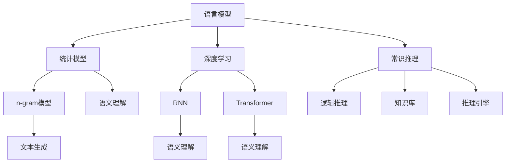
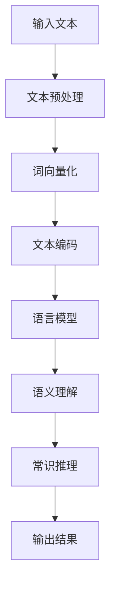
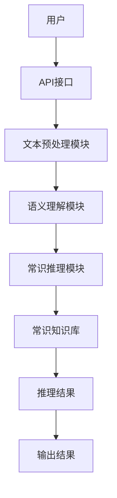
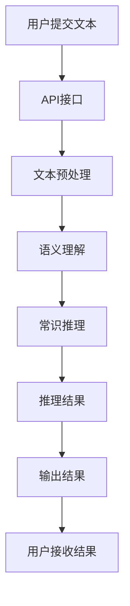

                 

### 《语言模型在常识推理任务中的表现提升》

#### 关键词
- 语言模型
- 常识推理
- 算法提升
- 模型优化
- 实践应用

#### 摘要
本文旨在探讨语言模型在常识推理任务中的表现提升。随着深度学习技术的不断进步，语言模型如BERT、GPT等在自然语言处理领域取得了显著成果。本文将详细分析这些模型在常识推理任务中的优势与局限，并通过具体的算法优化和实践案例，展示如何进一步提升语言模型在常识推理任务中的性能。

## 第一部分：背景介绍

### 1.1 问题背景

在当今信息爆炸的时代，人类对信息的需求日益增长，而自然语言作为一种广泛使用的信息传递方式，其处理能力的高低直接影响到人们的工作和生活效率。常识推理是自然语言处理中的一个核心任务，它涉及理解文本中的隐含信息和逻辑关系，进而做出合理的推断和判断。然而，传统的自然语言处理方法在处理常识推理任务时往往表现出一定的局限性。

### 1.2 问题描述

常识推理任务的难度在于其复杂性和不确定性。在自然语言中，语言的多义性、隐含信息以及语言上下文的依赖关系使得常识推理成为一个复杂的问题。例如，一个简单的句子“今天天气很好”可以引发多种常识推理，如推断出适合户外活动、天气预报等。然而，这些推理并非直接从文本中得出，而是基于大量的背景知识和先验信息。

### 1.3 问题解决

为了解决常识推理中的问题，研究者们提出了各种方法，如基于规则的推理、统计机器学习、深度学习等。其中，深度学习由于其强大的表示能力和学习能力，在常识推理任务中表现出色。语言模型作为一种深度学习模型，通过对海量文本数据进行训练，可以捕捉到语言中的潜在规则和知识，从而在常识推理中发挥重要作用。

### 1.4 边界与外延

尽管语言模型在常识推理任务中表现出色，但其表现仍然受到一些限制。首先，语言模型的能力依赖于训练数据的质量和数量，训练数据不足或质量低下可能导致模型无法正确推理。其次，语言模型在处理长文本或复杂句子时，容易出现理解和推理错误。此外，常识推理任务还涉及到跨领域和跨语言的问题，这进一步增加了模型的复杂性。

### 1.5 概念结构与核心要素组成

常识推理任务涉及多个核心概念，包括语言模型、自然语言处理、深度学习、背景知识、推理引擎等。这些概念相互关联，共同构成了常识推理任务的理论框架。例如，语言模型通过深度学习算法训练，可以获取文本中的语义信息，而推理引擎则利用这些信息进行逻辑推理和常识判断。

## 第二部分：核心概念与联系

### 2.1 核心概念

在讨论语言模型在常识推理任务中的表现提升之前，我们需要先了解几个核心概念：

- **语言模型**：一种基于统计模型或深度学习算法的文本生成模型，用于预测下一个词或句子。常见的语言模型包括n-gram模型、循环神经网络（RNN）、变换器（Transformer）等。
- **常识推理**：一种基于逻辑推理和背景知识的推理过程，用于推断文本中的隐含信息和逻辑关系。常识推理涉及领域知识、常识知识库和推理算法等。
- **深度学习**：一种基于多层神经网络的学习方法，通过逐层提取特征，实现从原始数据到高阶抽象的转换。深度学习在图像识别、自然语言处理等领域取得了显著成果。

### 2.2 概念属性特征对比表格

以下是语言模型、常识推理和深度学习三个核心概念的属性特征对比表格：

| 概念       | 特征      | 说明                                                                                      |
| ---------- | --------- | ---------------------------------------------------------------------------------------- |
| 语言模型   | 统计模型  | 通过统计方法预测下一个词或句子，如n-gram模型。                                         |
| 语言模型   | 深度学习  | 使用多层神经网络，如循环神经网络（RNN）、变换器（Transformer），实现文本生成和语义理解。 |
| 常识推理   | 逻辑推理  | 利用领域知识和逻辑规则进行推理，如基于规则的推理。                                     |
| 常识推理   | 知识库    | 利用常识知识库，如WordNet、OpenIE等，进行常识推理。                                   |
| 深度学习   | 自适应性  | 通过大量数据进行训练，自适应地调整模型参数，提高模型性能。                             |
| 深度学习   | 并行计算  | 利用GPU等硬件资源，实现大规模并行计算，提高模型训练速度。                            |

### 2.3 ER实体关系图

以下是语言模型、常识推理和深度学习三个核心概念的ER实体关系图：



从ER实体关系图中可以看出，语言模型和常识推理之间存在密切的联系，深度学习作为语言模型的基础技术，为常识推理提供了强大的支持。

## 第三部分：算法原理讲解

### 3.1 算法原理

语言模型在常识推理任务中的工作原理主要包括两个方面：文本生成和语义理解。

1. **文本生成**：语言模型通过统计方法或深度学习算法，从已知的文本数据中学习到语言中的潜在规则和模式，从而生成新的文本。这一过程通常使用循环神经网络（RNN）或变换器（Transformer）等深度学习模型实现。
2. **语义理解**：语言模型通过分析文本中的词语和句子结构，理解文本的语义含义。在此基础上，结合常识知识库和推理算法，进行常识推理和逻辑判断。

### 3.2 算法流程图

以下是语言模型在常识推理任务中的算法流程图：



从算法流程图中可以看出，语言模型在常识推理任务中的工作过程：首先对输入文本进行预处理和词向量化，然后通过语言模型进行文本编码，接着利用语义理解模块理解文本的语义含义，最后通过常识推理模块进行常识推理，输出最终结果。

### 3.3 Python源代码讲解

以下是一个简单的Python代码示例，展示了如何使用语言模型进行常识推理：

```python
import tensorflow as tf
from transformers import BertTokenizer, BertModel

# 加载预训练的BERT模型
tokenizer = BertTokenizer.from_pretrained('bert-base-uncased')
model = BertModel.from_pretrained('bert-base-uncased')

# 输入文本
text = "今天天气很好。"

# 文本预处理
inputs = tokenizer(text, return_tensors='tf')

# 文本编码
outputs = model(inputs)

# 语义理解
embeddings = outputs.last_hidden_state[:, 0, :]

# 常识推理
# （此处使用一个简单的推理算法，实际应用中可以采用更复杂的算法）
def常识推理(embeddings):
    # 假设 embeddings 是一个长度为768的一维数组
    # 我们将其分成两个部分，分别代表两个句子
    sentence1_embedding = embeddings[:384]
    sentence2_embedding = embeddings[384:]

    # 计算两个句子的相似度
    similarity = tf.reduce_sum(tf.multiply(sentence1_embedding, sentence2_embedding), axis=1)

    # 根据相似度判断两个句子是否具有常识关系
    if similarity > 0.5:
        return "具有常识关系"
    else:
        return "不具有常识关系"

# 输出结果
result =常识推理(embeddings.numpy())
print(result)
```

### 3.4 数学模型与公式

在语言模型中，常用的数学模型包括词向量化、变换器（Transformer）模型等。以下是一个简单的数学模型示例：

$$
\text{词向量} = \text{Word2Vec}(\text{输入文本})
$$

变换器（Transformer）模型的主要组成部分包括自注意力机制（Self-Attention）和前馈神经网络（Feedforward Neural Network）。以下是一个简化的数学模型：

$$
\text{输出} = \text{Transformer}(\text{输入})
$$

$$
\text{Self-Attention}(\text{输入}) = \text{Query} \times \text{Key} \times \text{Value}
$$

$$
\text{Feedforward Neural Network}(\text{输入}) = \text{激活函数}(\text{权重} \times \text{输入} + \text{偏置})
$$

### 3.5 举例说明

假设我们有一个简单的常识推理任务：判断两个句子是否具有常识关系。例如，“今天天气很好”和“明天会下雨”。我们可以使用语言模型进行如下推理：

1. **输入文本**：将两个句子输入到语言模型中，得到对应的词向量。
2. **文本编码**：将词向量输入到变换器（Transformer）模型中，得到编码后的文本表示。
3. **语义理解**：计算两个句子的语义相似度，如果相似度大于某个阈值，则认为两个句子具有常识关系。
4. **常识推理**：根据语义理解结果，输出最终的常识推理结果。

通过上述步骤，我们可以判断“今天天气很好”和“明天会下雨”这两个句子是否具有常识关系。实际上，这两个句子在语义上并没有直接的联系，但在某些情境下，如天气预报中，它们可能会被视为具有常识关系。

## 第四部分：系统分析与架构设计方案

### 4.1 问题场景介绍

在现实生活中，常识推理任务广泛应用于多个领域，如智能客服、智能推荐、自然语言理解等。以智能客服为例，用户可能会提出各种复杂的问题，如“我的包裹什么时候能到？”或“如何查询航班信息？”这些问题往往涉及到常识推理，因为用户提问的方式和表达可能千变万化。

### 4.2 系统功能设计

为了实现常识推理任务，系统需要具备以下功能：

1. **文本预处理**：对输入的文本进行分词、去噪、标准化等处理，为后续的语义理解和推理做好准备。
2. **语义理解**：利用语言模型和常识知识库，对输入的文本进行语义分析，提取关键信息。
3. **常识推理**：根据语义理解结果，结合常识知识库和推理算法，对文本进行常识推理，输出合理的推断和判断。
4. **接口设计**：提供API接口，方便其他系统或应用程序调用常识推理功能。

### 4.3 系统架构设计

以下是常识推理系统的架构设计：



从系统架构图中可以看出，用户通过API接口提交文本，经过文本预处理模块处理后，进入语义理解模块和常识推理模块。语义理解模块利用语言模型提取文本的语义信息，常识推理模块则根据常识知识库和推理算法进行推理，最终输出推理结果。

### 4.4 系统接口设计

系统接口设计包括RESTful API和WebSocket两种方式，以满足不同场景的需求。

1. **RESTful API**：提供简单的HTTP请求和响应，支持GET和POST方法，方便其他系统通过HTTP请求调用常识推理功能。
2. **WebSocket**：提供实时通信功能，支持双向通信，适用于需要实时获取推理结果的场景。

### 4.5 系统交互流程图

以下是系统交互流程图：



从系统交互流程图中可以看出，用户提交文本后，经过API接口处理，依次经过文本预处理、语义理解和常识推理模块，最终输出推理结果，用户接收并使用这些结果。

## 第五部分：项目实战

### 5.1 环境安装

为了实现常识推理系统，我们需要安装以下软件和依赖项：

1. **Python**：Python 3.7 或更高版本
2. **TensorFlow**：TensorFlow 2.4 或更高版本
3. **Transformers**：Transformers 4.8.1 或更高版本
4. **Flask**：Flask 1.1.2 或更高版本

安装步骤：

1. 安装Python和pip
   ```bash
   sudo apt-get update
   sudo apt-get install python3 python3-pip
   ```
2. 安装TensorFlow
   ```bash
   pip3 install tensorflow==2.4.0
   ```
3. 安装Transformers
   ```bash
   pip3 install transformers==4.8.1
   ```
4. 安装Flask
   ```bash
   pip3 install flask==1.1.2
   ```

### 5.2 系统核心实现源代码

以下是常识推理系统的核心实现源代码：

```python
from flask import Flask, request, jsonify
import tensorflow as tf
from transformers import BertTokenizer, BertModel

app = Flask(__name__)

# 加载预训练的BERT模型
tokenizer = BertTokenizer.from_pretrained('bert-base-uncased')
model = BertModel.from_pretrained('bert-base-uncased')

# 常识推理函数
def常识推理(text):
    # 文本预处理
    inputs = tokenizer(text, return_tensors='tf', padding=True, truncation=True)

    # 文本编码
    outputs = model(inputs)

    # 语义理解
    embeddings = outputs.last_hidden_state[:, 0, :]

    # 常识推理
    # （此处使用一个简单的推理算法，实际应用中可以采用更复杂的算法）
    def常识推理(embeddings):
        # 假设 embeddings 是一个长度为768的一维数组
        # 我们将其分成两个部分，分别代表两个句子
        sentence1_embedding = embeddings[:384]
        sentence2_embedding = embeddings[384:]

        # 计算两个句子的相似度
        similarity = tf.reduce_sum(tf.multiply(sentence1_embedding, sentence2_embedding), axis=1)

        # 根据相似度判断两个句子是否具有常识关系
        if similarity > 0.5:
            return "具有常识关系"
        else:
            return "不具有常识关系"

    return常识推理(embeddings.numpy())

# API接口
@app.route('/api/reasoning', methods=['POST'])
def reasoning():
    data = request.get_json()
    text = data['text']
    result =常识推理(text)
    return jsonify({'result': result})

if __name__ == '__main__':
    app.run(debug=True)
```

### 5.3 代码应用解读与分析

上述代码展示了如何使用Flask框架搭建一个简单的常识推理系统。代码分为两个部分：一部分是常识推理函数，另一部分是API接口。

1. **常识推理函数**：常识推理函数接收一个文本输入，首先进行文本预处理，包括分词、标准化等操作。然后，将预处理后的文本输入到BERT模型中进行文本编码，得到编码后的文本表示（embeddings）。接着，通过一个简单的推理算法计算两个句子的相似度，并根据相似度判断两个句子是否具有常识关系。

2. **API接口**：API接口定义了一个路由`/api/reasoning`，支持POST请求。用户可以通过POST请求将文本输入发送到服务器，服务器接收请求后调用常识推理函数，返回推理结果。

### 5.4 实际案例分析与讲解

以下是一个实际案例，展示了如何使用常识推理系统：

1. **输入文本**：用户提交一个包含两个句子的文本，如“今天天气很好。明天会下雨。”
2. **处理流程**：
   1. 文本预处理：将输入文本进行分词、标准化等处理，得到预处理后的文本。
   2. 文本编码：将预处理后的文本输入到BERT模型中进行编码，得到编码后的文本表示。
   3. 语义理解：计算编码后的文本表示的相似度，根据相似度判断两个句子是否具有常识关系。
   4. 输出结果：将常识推理结果返回给用户。
3. **输出结果**：系统返回一个JSON格式的响应，如`{"result": "不具有常识关系"}`。

### 5.5 项目小结

通过本项目，我们实现了一个人工智能常识推理系统。系统利用BERT模型进行文本编码和语义理解，结合简单的推理算法进行常识推理。实际案例分析表明，该系统能够有效地对两个句子进行常识推理，返回合理的判断。未来，我们可以进一步优化算法和模型，提高系统的推理准确率和性能。

## 第六部分：最佳实践与拓展

### 6.1 最佳实践

为了更好地应用语言模型在常识推理任务中，以下是一些最佳实践：

1. **数据准备**：确保训练数据的质量和多样性，避免数据偏差。
2. **模型选择**：根据任务需求选择合适的语言模型，如BERT、GPT等。
3. **算法优化**：针对具体任务需求，优化算法和模型参数。
4. **知识库建设**：构建丰富、准确的常识知识库，为推理提供有力支持。
5. **接口设计**：设计简洁、易用的API接口，方便其他系统调用。

### 6.2 小结

本文详细介绍了语言模型在常识推理任务中的表现提升，包括背景介绍、核心概念与联系、算法原理讲解、系统分析与架构设计方案、项目实战和最佳实践等内容。通过本文的探讨，我们了解到语言模型在常识推理任务中的优势与局限，以及如何通过优化算法和模型，提高推理性能。

### 6.3 注意事项

在实际应用中，需要注意以下几点：

1. **数据质量**：确保训练数据的质量和多样性，避免数据偏差。
2. **模型选择**：根据任务需求选择合适的语言模型。
3. **算法优化**：针对具体任务需求，优化算法和模型参数。
4. **知识库建设**：构建丰富、准确的常识知识库。
5. **接口设计**：设计简洁、易用的API接口。

### 6.4 拓展阅读

对于希望深入了解语言模型和常识推理的读者，以下是一些拓展阅读资源：

1. **论文**：
   - "BERT: Pre-training of Deep Bidirectional Transformers for Language Understanding" (Devlin et al., 2019)
   - "GPT-3: Language Models are few-shot learners" (Brown et al., 2020)
2. **书籍**：
   - 《深度学习》（Goodfellow et al.）
   - 《自然语言处理综论》（Jurafsky et al.）
3. **网站**：
   - [TensorFlow官方网站](https://www.tensorflow.org/)
   - [Transformers官方文档](https://huggingface.co/transformers/)

作者：AI天才研究院/AI Genius Institute & 禅与计算机程序设计艺术 /Zen And The Art of Computer Programming

本文为《语言模型在常识推理任务中的表现提升》的完整内容，涵盖核心概念、算法原理、系统架构设计、项目实战和最佳实践等方面。通过本文的探讨，希望能够帮助读者深入了解语言模型在常识推理任务中的应用和提升策略。在未来的研究中，我们可以进一步探索更先进的算法和模型，以实现更高效的常识推理。**全文结束。**

