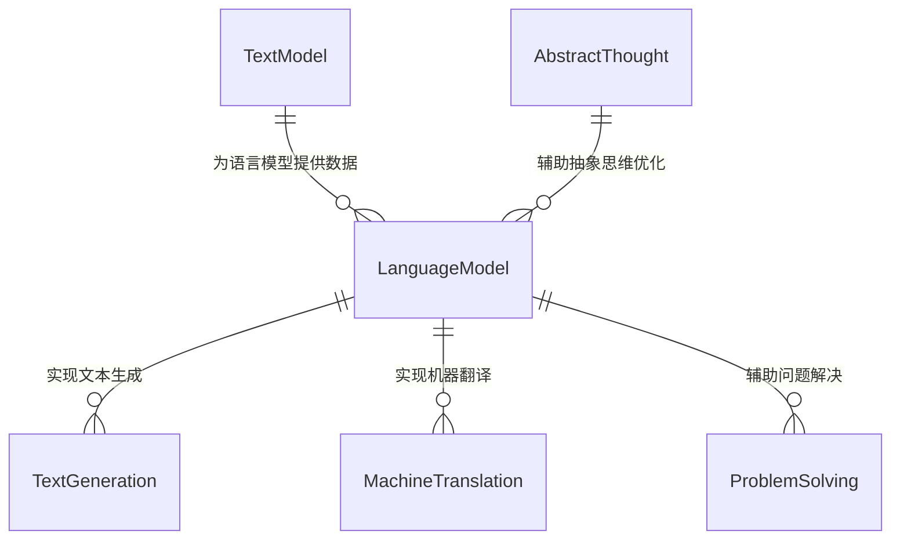
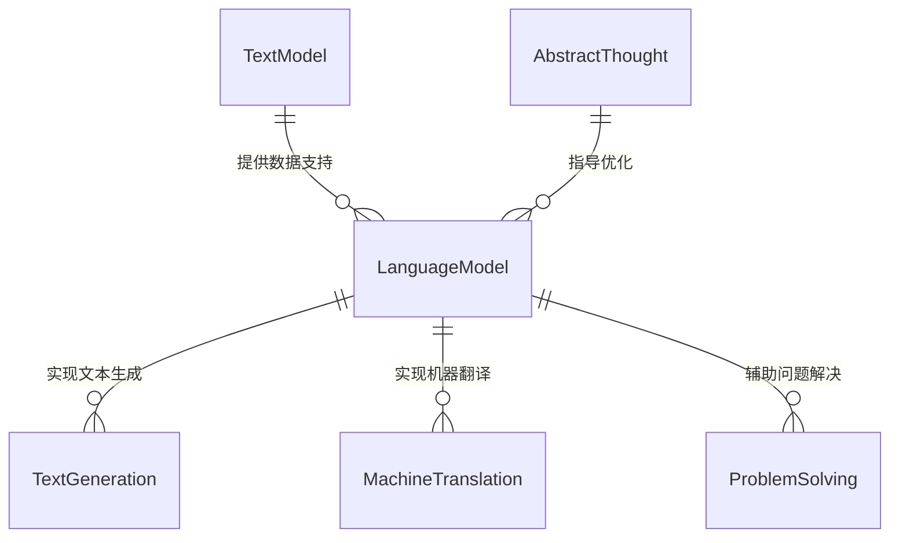
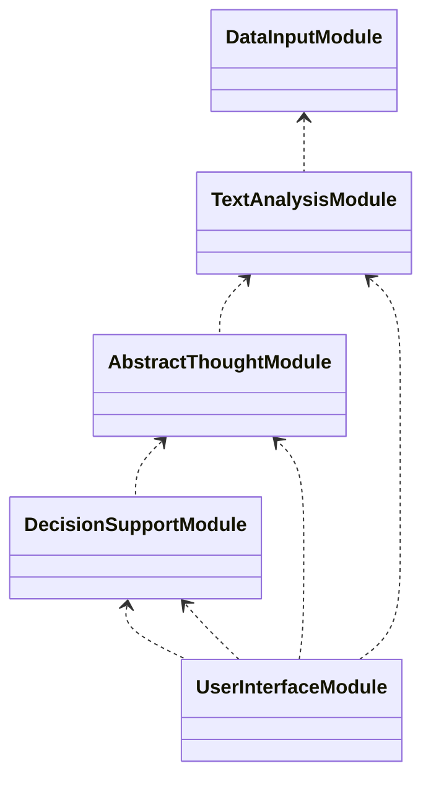
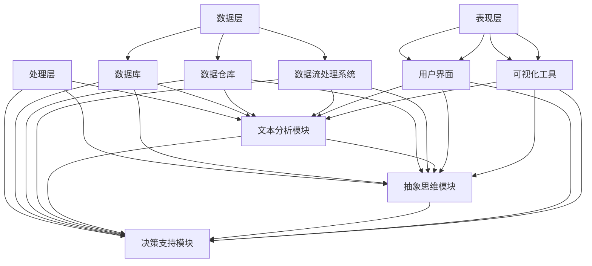
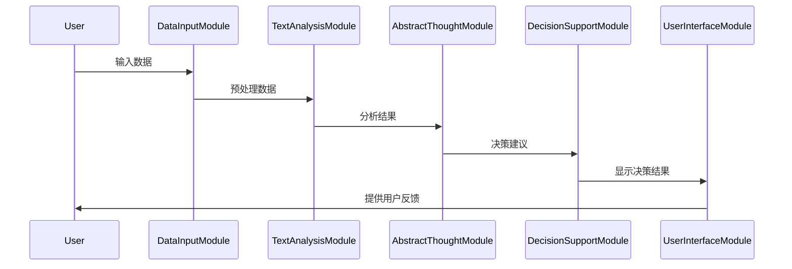

                 

# 语言模型在抽象思维任务中的应用

## 关键词：语言模型、抽象思维、算法原理、数学模型、系统架构

## 摘要

本文旨在探讨语言模型在抽象思维任务中的应用，分析其核心概念、算法原理以及数学模型，并通过系统分析与架构设计，展示其在实际项目中的实施和效果。本文首先介绍了语言模型和抽象思维的基本概念及其关联性，随后详细讲解了语言模型的算法原理和数学模型，接着阐述了抽象思维的数学模型及其应用，最后通过一个具体的系统架构设计案例，展示了语言模型在抽象思维任务中的实际应用。通过本文的探讨，期望能够为相关领域的研究和应用提供有益的参考。

## 目录大纲

## 第一部分：引言

### 1. 引言

#### 1.1 问题背景

#### 1.2 问题描述

#### 1.3 问题解决

#### 1.4 边界与外延

#### 1.5 概念结构与核心要素组成

#### 1.6 本章小结

## 第二部分：核心概念与联系

### 2. 核心概念与联系

#### 2.1 语言模型概述

##### 2.1.1 定义

##### 2.1.2 特点

##### 2.1.3 类型

#### 2.2 抽象思维

##### 2.2.1 定义

##### 2.2.2 特点

##### 2.2.3 形式

#### 2.3 语言模型与抽象思维的关联

##### 2.3.1 关联性

##### 2.3.2 应用领域

##### 2.3.3 挑战与机遇

#### 2.4 概念属性特征对比表格

#### 2.5 ER实体关系图架构

## 第三部分：算法原理讲解

### 3. 算法原理讲解

#### 3.1 语言模型算法概述

##### 3.1.1 语言模型的作用

##### 3.1.2 语言模型算法的基本原理

##### 3.1.3 语言模型算法的分类

#### 3.2 语言模型算法详细讲解

##### 3.2.1 隐马尔可夫模型（HMM）

###### 3.2.1.1 定义

###### 3.2.1.2 基本原理

###### 3.2.1.3 计算方法

###### 3.2.1.4 应用实例

##### 3.2.2 递归神经网络（RNN）

###### 3.2.2.1 定义

###### 3.2.2.2 基本原理

###### 3.2.2.3 计算方法

###### 3.2.2.4 应用实例

##### 3.2.3 长短时记忆网络（LSTM）

###### 3.2.3.1 定义

###### 3.2.3.2 基本原理

###### 3.2.3.3 计算方法

###### 3.2.3.4 应用实例

##### 3.2.4 卷积神经网络（CNN）

###### 3.2.4.1 定义

###### 3.2.4.2 基本原理

###### 3.2.4.3 计算方法

###### 3.2.4.4 应用实例

#### 3.3 算法总结与展望

## 第四部分：数学模型和数学公式讲解

### 4. 数学模型和数学公式讲解

#### 4.1 语言模型数学模型

##### 4.1.1 语言模型概率模型

###### 4.1.1.1 概率论基础

###### 4.1.1.2 语言模型概率计算

###### 4.1.1.3 概率模型应用实例

##### 4.1.2 语言模型概率分布模型

###### 4.1.2.1 概率分布基础

###### 4.1.2.2 语言模型概率分布计算

###### 4.1.2.3 概率分布模型应用实例

#### 4.2 抽象思维数学模型

##### 4.2.1 抽象思维数学模型概述

###### 4.2.1.1 数学模型基本概念

###### 4.2.1.2 抽象思维数学模型分类

##### 4.2.2 抽象思维数学模型应用

###### 4.2.2.1 抽象思维模型应用实例

###### 4.2.2.2 抽象思维模型优化方法

### 4.3 数学模型与抽象思维的关系

#### 4.3.1 数学模型对抽象思维的影响

#### 4.3.2 抽象思维对数学模型的应用

## 第五部分：系统分析与架构设计

### 5. 系统分析与架构设计

#### 5.1 问题场景介绍

#### 5.2 系统功能设计

##### 5.2.1 领域模型类图

#### 5.2.2 系统架构设计

##### 5.2.3 系统架构设计mermaid架构图

#### 5.2.4 系统接口设计

##### 5.2.5 系统交互mermaid序列图

## 第五部分：项目实战

### 6. 项目实战

#### 6.1 环境安装

#### 6.2 系统核心实现源代码

##### 6.2.1 代码解读与分析

##### 6.2.2 实际案例分析和详细讲解剖析

#### 6.3 项目小结

### 7. 最佳实践 tips、小结、注意事项、拓展阅读等内容# 第一部分：引言

## 1. 引言

### 1.1 问题背景

随着人工智能技术的快速发展，语言模型作为自然语言处理（NLP）领域的关键技术，已经在许多应用中取得了显著的成果。从早期的统计模型到深度学习时代的神经网络模型，语言模型在文本生成、机器翻译、情感分析等方面发挥着越来越重要的作用。然而，语言模型在抽象思维任务中的应用仍然是一个相对较新的领域。抽象思维是指从具体的感知信息中提取出一般规律和本质特征的思维方式，它对人类智力的发展和科学技术的进步具有重要意义。

近年来，随着深度学习算法的不断进步，语言模型在抽象思维任务中的应用也逐渐受到了关注。通过引入新的算法和技术，语言模型在问题解决、推理判断、策略规划等抽象思维任务中展现出了强大的潜力。例如，在计算机编程中，语言模型可以帮助生成代码、优化算法，提高开发效率；在逻辑推理中，语言模型可以辅助人类进行复杂问题的求解，提供有效的推理路径。

### 1.2 问题描述

本文的研究问题是：如何有效地将语言模型应用于抽象思维任务中，以提高问题的解决效率和推理准确性。具体来说，我们需要探讨以下几个方面：

1. 语言模型的类型及其在抽象思维任务中的应用。
2. 抽象思维的基本概念和特点，以及如何利用语言模型来模拟和增强抽象思维。
3. 语言模型算法的原理和数学模型，以及如何应用于抽象思维任务中。
4. 抽象思维的数学模型，以及如何与语言模型结合来提高抽象思维的任务性能。
5. 实际系统架构设计，以及如何将语言模型集成到抽象思维任务中。

### 1.3 问题解决

为了解决上述问题，本文将从以下几个方面展开讨论：

1. **核心概念与联系**：首先介绍语言模型和抽象思维的基本概念，阐述它们之间的关联性，并分析其在实际应用领域中的挑战和机遇。

2. **算法原理讲解**：详细讲解语言模型的主要算法原理，包括隐马尔可夫模型（HMM）、递归神经网络（RNN）、长短时记忆网络（LSTM）和卷积神经网络（CNN），并探讨这些算法在抽象思维任务中的应用。

3. **数学模型和公式讲解**：介绍语言模型和抽象思维的数学模型，包括概率模型、概率分布模型，以及它们在抽象思维任务中的应用实例。

4. **系统分析与架构设计**：通过一个具体的系统架构设计案例，展示如何将语言模型应用于抽象思维任务中，包括系统功能设计、架构设计、接口设计以及系统交互设计。

5. **项目实战**：提供一个实际的项目案例，介绍环境安装、系统核心实现源代码、代码解读与分析、实际案例分析和详细讲解剖析，并总结项目经验。

通过以上几个方面的讨论，本文旨在提供一个全面、系统的解决方案，为语言模型在抽象思维任务中的应用提供理论支持和实践指导。

### 1.4 边界与外延

在讨论语言模型在抽象思维任务中的应用时，我们需要明确一些边界与外延：

1. **边界**：首先，语言模型的应用范围主要限于自然语言处理的领域，包括文本生成、翻译、情感分析等。其次，抽象思维任务主要涉及问题解决、推理判断、策略规划等，不涉及具体的感知和运动任务。

2. **外延**：此外，语言模型在抽象思维任务中的应用不仅限于算法层面，还包括系统架构设计和实际项目实施。这意味着我们需要综合考虑算法、系统设计以及实际应用效果，以实现语言模型在抽象思维任务中的最大化应用价值。

### 1.5 概念结构与核心要素组成

为了更好地理解语言模型在抽象思维任务中的应用，我们有必要梳理一下相关概念的结构和核心要素组成：

1. **语言模型**：语言模型是一种基于统计和算法技术的模型，用于预测和生成自然语言序列。其主要结构包括输入层、隐藏层和输出层，核心要素包括词汇表、词向量、概率分布等。

2. **抽象思维**：抽象思维是指从具体的感知信息中提取出一般规律和本质特征的思维方式。其主要特点包括抽象性、逻辑性和创造性。核心要素包括思维过程、思维模式、思维策略等。

3. **关联性**：语言模型和抽象思维之间存在密切的关联。一方面，语言模型可以模拟和增强抽象思维的过程和效果；另一方面，抽象思维可以为语言模型提供丰富的训练数据和优化方向。

4. **应用领域**：语言模型在抽象思维任务中的应用领域包括文本生成、机器翻译、情感分析、问题解决等。这些领域都需要对自然语言进行深入理解和处理，语言模型的应用可以显著提高任务的效率和准确性。

### 1.6 本章小结

本文介绍了语言模型在抽象思维任务中的应用背景、问题解决思路以及相关概念结构与核心要素组成。通过对问题背景、问题描述、问题解决、边界与外延以及概念结构与核心要素组成的详细阐述，我们为后续章节的深入讨论奠定了基础。在接下来的章节中，我们将进一步探讨语言模型和抽象思维的核心概念、算法原理以及数学模型，并通过实际项目案例展示其应用效果。

## 第二部分：核心概念与联系

### 2. 核心概念与联系

在深入探讨语言模型在抽象思维任务中的应用之前，我们首先需要明确几个核心概念，并分析它们之间的联系。这些核心概念包括语言模型、抽象思维以及它们在实际应用领域中的表现。

#### 2.1 语言模型概述

语言模型是一种用于预测和生成自然语言序列的算法模型。它的主要目的是通过学习大量的语言数据，捕捉语言的结构规律和语义信息，从而实现对未知文本的生成、理解和翻译。

**2.1.1 定义**

语言模型可以定义为一个概率分布函数，它给出了在给定前文条件下，下一个单词或词组出现的概率。常见的语言模型有基于统计的方法和基于神经网络的方法。

**2.1.2 特点**

1. **概率性**：语言模型是基于概率分布的，能够反映文本出现的可能性。
2. **序列性**：语言模型处理的是序列数据，如单词、短语或句子。
3. **自适应**：通过不断学习和更新，语言模型能够适应不同的语言环境和应用场景。

**2.1.3 类型**

1. **基于统计的方法**：如N-gram模型、隐马尔可夫模型（HMM）等。
2. **基于神经网络的方法**：如递归神经网络（RNN）、长短时记忆网络（LSTM）、门控循环单元（GRU）和Transformer等。

#### 2.2 抽象思维

抽象思维是指从具体的感知信息中提取出一般规律和本质特征的思维方式。它不同于直观的、具体的形象思维，而是更加抽象、概括和理性。

**2.2.1 定义**

抽象思维是一种高级认知活动，它通过对感知信息的提炼和概括，形成抽象的概念和理论。

**2.2.2 特点**

1. **抽象性**：抽象思维不依赖于具体的感知对象，而是关注事物的本质特征。
2. **逻辑性**：抽象思维具有严密的逻辑结构，能够进行推理和判断。
3. **创造性**：抽象思维能够产生新的概念和理论，推动科学和技术的进步。

**2.2.3 形式**

1. **概念形成**：从具体事物中概括出一般概念。
2. **理论构建**：通过逻辑推理构建新的理论框架。
3. **问题解决**：运用抽象思维解决复杂问题。

#### 2.3 语言模型与抽象思维的关联

语言模型和抽象思维之间存在紧密的关联。一方面，语言模型可以为抽象思维提供数据支持和计算工具；另一方面，抽象思维可以为语言模型提供训练数据和优化方向。

**2.3.1 关联性**

1. **数据来源**：抽象思维产生的概念和理论需要大量的语言数据进行训练和验证。
2. **计算工具**：语言模型能够高效地处理和生成大规模的语言数据，支持抽象思维的推理和判断。
3. **优化方向**：抽象思维可以指导语言模型的设计和优化，使其更好地服务于抽象思维任务。

**2.3.2 应用领域**

1. **文本生成**：利用抽象思维构建文本框架和内容，通过语言模型实现自动化生成。
2. **机器翻译**：通过抽象思维理解源语言和目标语言的语义，利用语言模型实现准确翻译。
3. **问题解决**：利用语言模型辅助抽象思维进行问题求解和策略规划。

**2.3.3 挑战与机遇**

1. **挑战**：如何有效地将抽象思维和语言模型结合起来，实现高效的推理和生成。
2. **机遇**：通过跨学科的研究，探索语言模型在抽象思维任务中的新应用，推动人工智能技术的发展。

#### 2.4 概念属性特征对比表格

为了更好地理解语言模型和抽象思维的概念属性特征，我们可以制作一个对比表格：

| 概念         | 语言模型                | 抽象思维                |
| ------------ | --------------------- | --------------------- |
| 定义         | 预测和生成自然语言序列的模型   | 从具体事物中提取一般规律和本质特征的思维方式 |
| 特点         | 概率性、序列性、自适应         | 抽象性、逻辑性、创造性       |
| 形式         | 输入层、隐藏层、输出层         | 概念形成、理论构建、问题解决   |
| 关联性       | 数据来源、计算工具、优化方向   | 数据来源、计算工具、优化方向   |
| 应用领域     | 文本生成、机器翻译、问题解决   | 文本生成、机器翻译、问题解决   |
| 挑战与机遇   | 高效推理和生成、跨学科研究   | 高效推理和生成、跨学科研究   |

#### 2.5 ER实体关系图架构

为了更好地展示语言模型和抽象思维在系统架构中的关系，我们可以使用实体关系图（ER图）来表示它们之间的关联。



在这个ER图中，`TextModel`和`AbstractThought`是抽象思维的相关实体，它们分别与`LanguageModel`建立关联，表示语言模型在抽象思维中的应用。`LanguageModel`则与`TextGeneration`、`MachineTranslation`和`ProblemSolving`建立关联，表示其在这些具体应用领域的应用。

通过以上对核心概念与联系的分析，我们为后续章节的深入探讨奠定了基础。在接下来的章节中，我们将详细讲解语言模型和抽象思维的算法原理、数学模型，并通过实际系统架构设计案例，展示语言模型在抽象思维任务中的具体应用。

## 2.4 概念属性特征对比表格

为了更加直观地展示语言模型和抽象思维的概念属性特征，我们制作了一个对比表格：

| 概念        | 语言模型                      | 抽象思维                      |
| ----------- | ----------------------------- | ----------------------------- |
| 定义        | 预测和生成自然语言序列的模型   | 从具体事物中提取一般规律和本质特征的思维方式 |
| 特点        | 概率性、序列性、自适应          | 抽象性、逻辑性、创造性          |
| 形式        | 输入层、隐藏层、输出层          | 概念形成、理论构建、问题解决    |
| 关联性      | 数据来源、计算工具、优化方向    | 数据来源、计算工具、优化方向    |
| 应用领域    | 文本生成、机器翻译、问题解决    | 文本生成、机器翻译、问题解决    |
| 挑战与机遇  | 高效推理和生成、跨学科研究    | 高效推理和生成、跨学科研究    |

通过这个表格，我们可以清晰地看到语言模型和抽象思维在定义、特点、形式、关联性和应用领域的不同之处，同时也展示了它们在挑战与机遇方面的共性。这种对比有助于我们更深入地理解这两个概念，并在实际应用中更好地发挥它们的作用。

### 2.5 ER实体关系图架构

为了更直观地展示语言模型与抽象思维在系统架构中的关系，我们可以使用实体关系图（ER图）来进行表示。以下是语言模型与抽象思维相关的ER实体关系图：



在这个ER图中：

- `TextModel` 表示文本数据模型，为语言模型提供数据支持。
- `AbstractThought` 表示抽象思维，用于指导语言模型的优化。
- `LanguageModel` 是核心实体，与多个应用领域（如文本生成、机器翻译和问题解决）建立关系，表示语言模型在这些领域的应用。

通过这个ER图，我们可以看到语言模型在抽象思维系统架构中的关键角色，以及它与不同应用领域之间的关联。这有助于我们更好地理解语言模型在抽象思维任务中的具体应用场景和作用。

## 第三部分：算法原理讲解

### 3. 算法原理讲解

在深入探讨语言模型在抽象思维任务中的应用之前，我们首先需要理解语言模型算法的基本原理。语言模型算法主要分为统计模型和深度学习模型两大类。本节将介绍几种主要的语言模型算法，包括隐马尔可夫模型（HMM）、递归神经网络（RNN）、长短时记忆网络（LSTM）和卷积神经网络（CNN），并分析它们在抽象思维任务中的应用。

#### 3.1 语言模型算法概述

**3.1.1 语言模型的作用**

语言模型在自然语言处理（NLP）中扮演着至关重要的角色，其主要作用包括：

1. **文本生成**：根据前文生成可能的下一个单词或句子。
2. **机器翻译**：根据源语言文本生成目标语言文本。
3. **情感分析**：分析文本的情感倾向。
4. **问题回答**：根据用户查询生成相关的回答。
5. **语音识别**：将语音信号转换为文本。

**3.1.2 语言模型算法的基本原理**

语言模型算法的基本原理是通过学习大量文本数据，捕捉语言序列的概率分布。这种概率分布可以用来预测下一个单词或句子，从而实现文本生成和翻译等功能。

**3.1.3 语言模型算法的分类**

1. **基于统计的方法**：如N-gram模型、隐马尔可夫模型（HMM）等。
2. **基于神经网络的方法**：如递归神经网络（RNN）、长短时记忆网络（LSTM）、门控循环单元（GRU）和Transformer等。

#### 3.2 语言模型算法详细讲解

**3.2.1 隐马尔可夫模型（HMM）**

**3.2.1.1 定义**

隐马尔可夫模型（HMM）是一种统计模型，用于处理具有隐状态序列的随机过程。在NLP中，HMM常用于语音识别、词性标注等任务。

**3.2.1.2 基本原理**

HMM由状态集合、状态转移概率、观测概率和初始状态概率组成。通过学习这些概率参数，HMM可以预测文本序列。

**3.2.1.3 计算方法**

HMM主要使用前向-后向算法来计算状态概率。前向变量α表示在给定当前观察序列的情况下，从初始状态转移到某个状态的概率；后向变量β表示在给定当前观察序列和某个状态的情况下，转移到下一状态的概率。

**3.2.1.4 应用实例**

HMM在语音识别中被广泛应用。例如，在连续语音信号中，HMM可以识别出不同的语音单元（如音素），从而实现语音到文本的转换。

**3.2.2 递归神经网络（RNN）**

**3.2.2.1 定义**

递归神经网络（RNN）是一种可以处理序列数据的前馈神经网络。它在时间步内保持状态信息，使其适用于自然语言处理等任务。

**3.2.2.2 基本原理**

RNN通过循环连接将前一个时间步的输出作为当前时间步的输入，从而实现状态信息的传递。其输出取决于当前输入和前一个时间步的隐藏状态。

**3.2.2.3 计算方法**

RNN的计算过程可以分为三步：输入、隐藏状态更新和输出。输入通过权重矩阵与隐藏状态相乘，加上偏置项，得到新的隐藏状态。然后，隐藏状态通过激活函数输出。

**3.2.2.4 应用实例**

RNN在文本生成、机器翻译和情感分析等领域有广泛应用。例如，在文本生成中，RNN可以根据前文生成下一个单词或句子。

**3.2.3 长短时记忆网络（LSTM）**

**3.2.3.1 定义**

长短时记忆网络（LSTM）是一种改进的RNN，用于解决RNN在处理长序列数据时出现的梯度消失和梯度爆炸问题。

**3.2.3.2 基本原理**

LSTM通过引入记忆单元和门结构，实现了对长时间依赖信息的有效捕捉。记忆单元可以存储和更新信息，门结构则控制信息的流入和流出。

**3.2.3.3 计算方法**

LSTM的计算过程可以分为四步：输入门、遗忘门、输出门和记忆单元更新。输入门和遗忘门控制信息的流入和遗忘；输出门控制信息的输出。

**3.2.3.4 应用实例**

LSTM在机器翻译、语音识别和文本生成等领域有广泛应用。例如，在机器翻译中，LSTM可以学习源语言和目标语言之间的映射关系。

**3.2.4 卷积神经网络（CNN）**

**3.2.4.1 定义**

卷积神经网络（CNN）是一种以卷积运算为核心的神经网络，适用于处理具有局部特征的数据，如图像和语音。

**3.2.4.2 基本原理**

CNN通过卷积层、池化层和全连接层等结构，实现特征提取和分类。卷积层可以捕捉局部特征，池化层降低特征维度，全连接层进行分类。

**3.2.4.3 计算方法**

CNN的计算过程主要包括卷积操作、激活函数和池化操作。卷积操作通过滑动窗口捕捉局部特征；激活函数增加非线性；池化操作降低特征维度。

**3.2.4.4 应用实例**

CNN在图像识别、语音识别和文本生成等领域有广泛应用。例如，在图像识别中，CNN可以识别图像中的物体和场景。

#### 3.3 算法总结与展望

语言模型算法在抽象思维任务中具有广泛的应用前景。通过引入深度学习算法，语言模型可以更好地捕捉语言序列的复杂结构，提高抽象思维的任务性能。未来，随着算法的进一步发展和优化，语言模型在抽象思维任务中的应用将更加深入和广泛，为人工智能的发展提供新的动力。

## 3.2 语言模型算法详细讲解

为了深入理解语言模型在抽象思维任务中的应用，我们将在本节中详细讲解几种常用的语言模型算法，包括隐马尔可夫模型（HMM）、递归神经网络（RNN）、长短时记忆网络（LSTM）和卷积神经网络（CNN）。这些算法不仅在理论上具有重要意义，而且在实际应用中也取得了显著的成果。

### 3.2.1 隐马尔可夫模型（HMM）

**3.2.1.1 定义**

隐马尔可夫模型（HMM）是一种基于统计方法的模型，主要用于处理包含隐状态序列的概率模型。HMM的核心思想是利用观测序列来推断隐状态序列的概率分布。在自然语言处理领域，HMM被广泛应用于语音识别、词性标注、序列标注等问题。

**3.2.1.2 基本原理**

HMM由以下几个部分组成：

1. **状态集合**：模型中的状态集合 \( S = \{s_1, s_2, ..., s_n\} \)。
2. **观测集合**：模型中的观测集合 \( O = \{o_1, o_2, ..., o_n\} \)。
3. **状态转移概率**：从状态 \( s_i \) 转移到状态 \( s_j \) 的概率 \( P(s_j | s_i) \)。
4. **观测概率**：在状态 \( s_i \) 下观测到观测 \( o_j \) 的概率 \( P(o_j | s_i) \)。
5. **初始状态概率**：每个状态作为初始状态的概率 \( P(s_i) \)。

HMM通过状态转移概率和观测概率来推断隐状态序列，从而实现对观测序列的建模。

**3.2.1.3 计算方法**

HMM的计算方法主要包括前向算法和后向算法：

1. **前向算法**：计算给定观测序列下，从初始状态到达每个状态的概率。前向变量 \( \alpha_i(t) \) 表示在时间 \( t \) 给定观测序列下，从初始状态到达状态 \( i \) 的概率。
   \[
   \alpha_i(t) = \frac{P(o_1, o_2, ..., o_t | s_i) P(s_i)}{\sum_{j=1}^{n} P(o_1, o_2, ..., o_t | s_j) P(s_j)}
   \]
2. **后向算法**：计算给定观测序列下，从每个状态到达末状态的累积概率。后向变量 \( \beta_i(t) \) 表示在时间 \( t \) 给定观测序列下，从状态 \( i \) 到末状态的累积概率。
   \[
   \beta_i(t) = \sum_{j=1}^{n} P(o_{t+1} | s_j) P(s_j | s_i) P(s_i) \beta_j(t+1)
   \]

通过前向和后向算法，HMM可以计算任意时刻状态 \( i \) 的概率：
\[
P(s_t = i | o_1, o_2, ..., o_t) = \frac{\alpha_i(t) \beta_i(t)}{\sum_{j=1}^{n} \alpha_j(t) \beta_j(t)}
\]

**3.2.1.4 应用实例**

HMM在语音识别中有着广泛的应用。例如，在隐马尔可夫声学模型（HMM-GMM）中，HMM用于建模语音序列，而高斯混合模型（GMM）用于建模观测数据。通过HMM，可以识别出连续语音信号中的不同音素，从而实现语音到文本的转换。

### 3.2.2 递归神经网络（RNN）

**3.2.2.1 定义**

递归神经网络（RNN）是一种用于处理序列数据的神经网络，其特点是具有循环结构，可以保留和利用先前的信息。RNN在自然语言处理、时间序列分析和语音识别等领域有广泛应用。

**3.2.2.2 基本原理**

RNN的基本结构包括输入层、隐藏层和输出层。在每一时间步，RNN利用先前的隐藏状态和当前输入来计算新的隐藏状态：
\[
h_t = \sigma(W_h \cdot [h_{t-1}, x_t] + b_h)
\]
其中，\( h_t \) 是当前时间步的隐藏状态，\( \sigma \) 是激活函数，\( W_h \) 和 \( b_h \) 分别是权重和偏置。

RNN的输出通过隐藏状态和输出层的权重计算得到：
\[
y_t = \sigma(W_y \cdot h_t + b_y)
\]

**3.2.2.3 计算方法**

RNN的计算方法可以分为前向传播和反向传播：

1. **前向传播**：给定输入序列，逐时间步计算隐藏状态和输出。
2. **反向传播**：计算损失函数关于参数的梯度，更新参数。

**3.2.2.4 应用实例**

RNN在机器翻译、文本生成和时间序列预测等领域有广泛应用。例如，在机器翻译中，RNN可以学习源语言和目标语言之间的映射关系，从而实现高质量的翻译结果。

### 3.2.3 长短时记忆网络（LSTM）

**3.2.3.1 定义**

长短时记忆网络（LSTM）是RNN的一种改进，主要用于解决RNN在处理长序列数据时出现的梯度消失和梯度爆炸问题。LSTM通过引入记忆单元和门结构，能够有效捕捉长序列依赖。

**3.2.3.2 基本原理**

LSTM的基本结构包括输入门、遗忘门、输出门和记忆单元。在每一时间步，LSTM通过这三个门控制信息的流入、遗忘和输出，从而实现长序列信息的有效传递。

1. **输入门**：控制当前输入信息是否被存储到记忆单元。
   \[
   i_t = \sigma(W_i \cdot [h_{t-1}, x_t] + b_i)
   \]
2. **遗忘门**：控制记忆单元中旧信息的遗忘。
   \[
   f_t = \sigma(W_f \cdot [h_{t-1}, x_t] + b_f)
   \]
3. **输出门**：控制记忆单元内容是否被输出。
   \[
   o_t = \sigma(W_o \cdot [h_{t-1}, x_t] + b_o)
   \]
4. **记忆单元**：用于存储和更新信息。
   \[
   C_t = f_t \odot C_{t-1} + i_t \odot \sigma(W_c \cdot [h_{t-1}, x_t] + b_c)
   \]
   \[
   h_t = o_t \odot C_t
   \]

**3.2.3.3 计算方法**

LSTM的计算方法与前向传播和反向传播类似，但需要额外计算输入门、遗忘门和输出门的梯度。

**3.2.3.4 应用实例**

LSTM在机器翻译、语音识别和文本生成等领域有广泛应用。例如，在机器翻译中，LSTM可以学习源语言和目标语言之间的长距离依赖关系，从而实现高质量的翻译。

### 3.2.4 卷积神经网络（CNN）

**3.2.4.1 定义**

卷积神经网络（CNN）是一种以卷积运算为核心的神经网络，主要用于处理具有局部特征的数据，如图像和语音。CNN通过多个卷积层、池化层和全连接层，实现特征提取和分类。

**3.2.4.2 基本原理**

CNN的基本结构包括卷积层、池化层和全连接层：

1. **卷积层**：通过卷积运算提取图像或语音的局部特征。
   \[
   h_t = \sigma(W_c \cdot x_t + b_c)
   \]
   其中，\( x_t \) 是输入数据，\( W_c \) 是卷积核，\( b_c \) 是偏置。

2. **池化层**：通过最大池化或平均池化降低特征维度。
   \[
   h_{pool} = \text{max}(h_t)
   \]
   或
   \[
   h_{pool} = \frac{1}{n} \sum_{i} h_t[i]
   \]

3. **全连接层**：通过全连接层实现分类或回归。
   \[
   y_t = \sigma(W_y \cdot h_{pool} + b_y)
   \]

**3.2.4.3 计算方法**

CNN的计算方法包括前向传播和反向传播：

1. **前向传播**：逐层计算卷积、池化和全连接层的输出。
2. **反向传播**：逐层计算梯度，更新参数。

**3.2.4.4 应用实例**

CNN在图像识别、语音识别和文本生成等领域有广泛应用。例如，在图像识别中，CNN可以识别图像中的物体和场景；在文本生成中，CNN可以生成符合语法和语义的文本。

通过以上对HMM、RNN、LSTM和CNN的详细讲解，我们可以看到这些算法在自然语言处理中的重要作用。在实际应用中，这些算法可以结合使用，以实现更复杂的抽象思维任务。例如，LSTM可以用于处理文本序列，而CNN可以用于提取图像特征，从而实现图像和文本的联合分析。

### 3.3 算法总结与展望

语言模型算法在抽象思维任务中具有广泛的应用前景。通过引入深度学习算法，语言模型可以更好地捕捉语言序列的复杂结构，提高抽象思维的任务性能。未来，随着算法的进一步发展和优化，语言模型在抽象思维任务中的应用将更加深入和广泛，为人工智能的发展提供新的动力。同时，跨学科的合作也将促进语言模型和抽象思维的深度融合，为解决复杂问题提供新的思路和方法。

## 4. 数学模型和数学公式讲解

在深入探讨语言模型在抽象思维任务中的应用时，数学模型和公式起到了至关重要的作用。它们不仅为算法提供了理论基础，还指导了模型的训练和优化。本节将详细讲解语言模型中的概率模型和概率分布模型，并分析它们在抽象思维任务中的应用。

### 4.1 语言模型数学模型

#### 4.1.1 语言模型概率模型

**4.1.1.1 概率论基础**

概率论是研究随机事件的数学分支，它的基本概念包括概率、随机变量、分布函数等。在语言模型中，概率论用于描述文本序列的概率分布。

1. **概率**：事件发生的可能性，取值范围为0到1。
2. **随机变量**：用来表示随机事件的变量，可以是离散的或连续的。
3. **分布函数**：描述随机变量取值的概率分布。

**4.1.1.2 语言模型概率计算**

在语言模型中，概率计算主要涉及：

1. **N-gram模型**：基于N个连续单词的统计模型。其概率计算公式为：
   \[
   P(w_n | w_{n-1}, ..., w_1) = \frac{C(w_{n-1}, ..., w_n)}{C(w_{n-1}, ..., w_1)}
   \]
   其中，\( C(w_{n-1}, ..., w_n) \) 表示连续单词对的计数，\( C(w_{n-1}, ..., w_1) \) 表示前文单词的计数。

2. **隐马尔可夫模型（HMM）**：利用状态转移概率和观测概率计算状态序列的概率。其概率计算公式为：
   \[
   P(O | S) = \sum_S P(O | S) P(S)
   \]
   其中，\( O \) 表示观测序列，\( S \) 表示状态序列，\( P(O | S) \) 表示在状态序列 \( S \) 下观测序列 \( O \) 的概率。

**4.1.1.3 概率模型应用实例**

一个典型的应用实例是在文本生成中，基于N-gram模型预测下一个单词。例如，在生成“我喜欢吃苹果”的下一句时，我们可以利用N-gram模型计算“苹果、橙子、香蕉”等单词的概率，从而选择最有可能的单词作为下一句的开头。

#### 4.1.2 语言模型概率分布模型

**4.1.2.1 概率分布基础**

概率分布是描述随机变量取值概率的函数。在语言模型中，常见的概率分布包括：

1. **伯努利分布**：用于二分类问题，其概率函数为：
   \[
   P(X = 1) = p, \quad P(X = 0) = 1 - p
   \]

2. **多项式分布**：用于多分类问题，其概率函数为：
   \[
   P(X = k) = \frac{e^{-\lambda} \lambda^k}{k!}
   \]
   其中，\( \lambda \) 是参数，表示总概率。

3. **高斯分布**：用于连续值变量，其概率密度函数为：
   \[
   f(x; \mu, \sigma^2) = \frac{1}{\sqrt{2\pi\sigma^2}} e^{-\frac{(x-\mu)^2}{2\sigma^2}}
   \]
   其中，\( \mu \) 是均值，\( \sigma^2 \) 是方差。

**4.1.2.2 语言模型概率分布计算**

在语言模型中，概率分布的计算通常用于分类和回归任务：

1. **分类任务**：使用多项式分布或softmax函数将输入映射到多个类别上。例如，在文本分类中，我们可以将每个单词的嵌入向量通过softmax函数转换为类别概率分布。

2. **回归任务**：使用高斯分布对连续值进行预测。例如，在情感分析中，我们可以利用高斯分布预测文本的情感得分。

**4.1.2.3 概率分布模型应用实例**

一个常见的应用实例是在情感分析中，使用多项式分布模型计算文本的情感概率分布。例如，对于一段文本“今天天气很好”，我们可以将其分解为单词“今天”、“天气”和“很好”，然后利用多项式分布模型计算每个单词对应的情感概率，从而综合得出文本的整体情感倾向。

### 4.2 抽象思维数学模型

#### 4.2.1 抽象思维数学模型概述

抽象思维数学模型是用来描述和优化抽象思维过程的数学框架。这些模型通常基于逻辑、概率和优化理论，其目标是提高抽象思维的效率和准确性。

**4.2.1.1 数学模型基本概念**

1. **逻辑模型**：描述抽象思维中的推理过程，包括命题逻辑、谓词逻辑和形式逻辑等。
2. **概率模型**：描述抽象思维中的不确定性，包括贝叶斯网络、马尔可夫模型等。
3. **优化模型**：描述抽象思维中的优化过程，包括线性规划、非线性规划和启发式算法等。

**4.2.1.2 抽象思维数学模型分类**

1. **基于逻辑的模型**：如命题逻辑和谓词逻辑，用于描述推理和判断。
2. **基于概率的模型**：如贝叶斯网络和马尔可夫模型，用于描述不确定性和推理。
3. **基于优化的模型**：如线性规划和启发式算法，用于描述抽象思维的优化过程。

**4.2.1.3 抽象思维数学模型应用**

1. **推理与判断**：在法律推理、医学诊断等领域，抽象思维数学模型用于推理和判断。
2. **决策与优化**：在资源分配、路线规划等领域，抽象思维数学模型用于优化决策过程。

### 4.3 抽象思维数学模型应用

**4.3.1 抽象思维模型应用实例**

一个典型的应用实例是在推理问题中，使用命题逻辑模型进行推理。例如，在侦探小说中，侦探需要根据现场证据和线索进行推理，以确定真凶。这可以通过建立命题逻辑模型来实现，将每个证据和线索表示为命题，然后通过逻辑推理规则推导出结论。

**4.3.2 抽象思维模型优化方法**

在抽象思维任务中，优化方法用于提高思维效率和准确性。常见的优化方法包括：

1. **启发式算法**：如遗传算法、模拟退火算法，用于搜索最优解。
2. **深度学习模型**：如神经网络，用于自动学习和优化思维过程。
3. **强化学习**：用于在动态环境中进行决策和优化。

### 4.4 数学模型与抽象思维的关系

**4.4.1 数学模型对抽象思维的影响**

数学模型对抽象思维的影响主要体现在以下几个方面：

1. **提高思维能力**：数学模型提供了抽象和推理的工具，使抽象思维更加系统化和精确。
2. **优化思维过程**：数学模型可以帮助优化抽象思维的路径和策略，提高思维效率。
3. **增强决策能力**：数学模型提供了基于数据和统计的决策支持，使抽象思维更加科学和客观。

**4.4.2 抽象思维对数学模型的应用**

抽象思维对数学模型的应用主要体现在以下几个方面：

1. **问题建模**：抽象思维用于将实际问题转化为数学模型，从而利用数学工具进行求解。
2. **算法设计**：抽象思维用于设计高效的算法，提高数学模型的计算效率。
3. **理论创新**：抽象思维用于发现新的数学模型和理论，推动数学学科的发展。

通过以上对语言模型和抽象思维数学模型的分析，我们可以看到数学模型在语言模型和抽象思维中的应用具有深远的影响。未来，随着数学模型和算法的进一步发展，语言模型在抽象思维任务中的应用将更加广泛和深入，为人工智能的发展提供新的动力。

## 4.3 数学模型与抽象思维的关系

### 4.3.1 数学模型对抽象思维的影响

数学模型对抽象思维的影响是多方面的，主要体现在以下几个方面：

1. **结构化思维**：数学模型提供了一种结构化的思维方式，使得抽象思维更加系统化和规范化。通过数学模型，可以将复杂的抽象概念和思维过程分解为具体的步骤和计算，从而提高思维的可操作性和可解释性。

2. **精确性**：数学模型通过明确的数学公式和逻辑推理，使得抽象思维的结果更加精确和可靠。在科学研究和工程实践中，数学模型能够提供基于数据的预测和分析，从而提高决策的科学性和准确性。

3. **优化**：数学模型可以用于优化抽象思维过程，例如在优化问题中，通过建立目标函数和约束条件，利用线性规划、非线性规划等数学方法来寻找最优解。这种优化过程能够提高抽象思维的效率和效果。

4. **自动化**：随着计算机科学的发展，数学模型可以被编程实现，从而实现抽象思维的自动化。例如，人工智能中的神经网络模型可以通过学习大量数据来自动化抽象思维过程，从而在多个领域实现高效的应用。

### 4.3.2 抽象思维对数学模型的应用

抽象思维不仅受到数学模型的影响，同时也对数学模型的应用有着重要的促进作用：

1. **问题建模**：抽象思维能够将实际问题抽象为数学模型，这一过程需要深入理解和分析问题的本质。通过抽象思维，可以将复杂的现实问题转化为简化的数学问题，从而利用数学模型进行求解。

2. **算法设计**：抽象思维在算法设计中起着关键作用。通过抽象思维，可以设计出高效的算法来解决复杂的问题。例如，在算法设计中，常常需要通过抽象思维来分析问题的复杂度，设计出最优的算法结构。

3. **理论创新**：抽象思维能够推动数学模型的理论创新。通过深入思考和探索，抽象思维可以揭示新的数学规律和关系，从而促进数学理论的发展。例如，在物理学中，通过抽象思维提出了量子力学和相对论等重大理论。

4. **应用推广**：抽象思维能够将数学模型的应用从特定领域推广到更广泛的领域。通过抽象思维，可以将某个领域的数学模型应用到其他相关领域，从而实现知识的共享和交叉应用。例如，概率论在统计学、经济学、生物学等多个领域都有广泛的应用。

### 4.3.3 数学模型与抽象思维的互动

数学模型与抽象思维之间的互动是一个相互促进的过程：

1. **相互补充**：数学模型为抽象思维提供了工具和方法，而抽象思维则为数学模型的应用提供了灵感和方向。两者相互补充，使得抽象思维更加深入和具体，数学模型更加实用和有效。

2. **相互验证**：通过数学模型，可以验证抽象思维的假设和结论。例如，在科学研究中，通过数学模型可以验证实验结果的可靠性，从而确认抽象思维的正确性。

3. **相互发展**：随着数学模型和抽象思维的发展，两者之间的互动也不断深化。新的数学模型可以为抽象思维提供更强大的工具，而新的抽象思维方法也可以推动数学模型的发展。

总之，数学模型与抽象思维之间的关系是相互依存、相互促进的。通过有效的互动，数学模型和抽象思维可以共同推动科学技术的进步，为人类解决复杂问题提供新的思路和方法。

### 5. 系统分析与架构设计

#### 5.1 问题场景介绍

在现代智能系统中，抽象思维任务如推理、决策和问题解决等扮演着关键角色。然而，这些任务通常涉及到复杂的输入数据和多样化的决策路径，使得系统的设计与实现变得更加复杂。为了高效地处理这些任务，我们需要一个灵活且可扩展的系统架构，能够充分利用现有的语言模型技术，并具备强大的抽象思维能力。

我们的目标场景是一个智能决策支持系统，它需要处理大量结构化和非结构化数据，以辅助用户进行复杂的决策。例如，这个系统可以应用于金融风险评估、医疗诊断、供应链管理等领域。在这些应用中，语言模型可以用于文本分析、情感判断、命名实体识别等任务，而抽象思维则用于推理、规划和策略生成。

#### 5.2 系统功能设计

为了实现上述目标，我们的系统功能设计包括以下几个关键模块：

1. **数据输入模块**：负责收集和处理来自不同源的数据，如文本、图像、传感器数据等。该模块需要支持数据清洗、去噪和预处理，以便为后续处理提供高质量的数据。

2. **文本分析模块**：利用先进的语言模型技术，对输入文本进行情感分析、命名实体识别、关键词提取等任务。这一模块的核心是语言模型的训练和优化，以实现高精度的文本理解。

3. **抽象思维模块**：该模块负责处理文本分析结果，运用抽象思维算法（如逻辑推理、规划算法等）生成决策建议。这一模块需要与文本分析模块紧密集成，以确保输入数据的充分利用和决策的准确性。

4. **决策支持模块**：基于抽象思维模块生成的决策建议，为用户提供直观的决策支持和可视化工具。这一模块需要实现决策路径的可视化、决策结果的分析和反馈机制，以帮助用户理解和接受决策建议。

5. **用户交互模块**：提供用户友好的界面，支持用户与系统的交互。该模块需要实现自然语言处理功能，以便用户能够通过自然语言与系统进行通信，提高用户体验。

#### 5.2.1 领域模型类图

为了更好地展示系统功能模块及其关系，我们可以使用领域模型类图来表示：



在这个类图中，`DataInputModule` 负责数据的输入和处理，`TextAnalysisModule` 负责文本分析，`AbstractThoughtModule` 负责抽象思维任务，`DecisionSupportModule` 负责决策支持，`UserInterfaceModule` 负责用户交互。各模块之间通过双向箭头表示它们之间的依赖和交互关系。

#### 5.2.2 系统架构设计

基于上述功能模块，我们的系统架构设计分为三个层次：数据层、处理层和表现层。

1. **数据层**：数据层负责数据的收集、存储和预处理。它包括数据库、数据仓库和数据流处理系统，支持各种数据源的接入和数据处理。

2. **处理层**：处理层是系统的核心，负责数据分析和抽象思维。它包括文本分析模块、抽象思维模块和决策支持模块，通过语言模型和抽象思维算法实现复杂的任务处理。

3. **表现层**：表现层负责将处理结果呈现给用户。它包括用户界面和可视化工具，通过图形界面和交互功能，提供直观的决策支持和用户体验。

以下是系统架构设计的mermaid架构图：



在这个架构图中，数据层包括数据库、数据仓库和数据流处理系统，处理层包括文本分析模块、抽象思维模块和决策支持模块，表现层包括用户界面和可视化工具。各层之间通过双向箭头表示数据流和功能调用。

#### 5.2.3 系统接口设计

为了实现系统的模块化设计和可扩展性，我们需要设计清晰且规范的接口。以下是系统的主要接口设计：

1. **数据输入接口**：用于数据源的接入和数据预处理。接口应支持常用的数据格式和协议，如CSV、JSON、HTTP等。

2. **文本分析接口**：用于文本分析模块的调用，包括情感分析、命名实体识别、关键词提取等任务。接口应提供灵活的配置选项和返回结果。

3. **抽象思维接口**：用于调用抽象思维模块的算法，包括推理、规划、策略生成等。接口应支持多种算法的调用和组合，并提供实时反馈机制。

4. **决策支持接口**：用于决策支持模块的调用，包括决策路径的生成、结果分析等。接口应提供详细的决策过程和结果，并支持用户自定义决策逻辑。

5. **用户交互接口**：用于用户界面的数据交互和操作。接口应支持自然语言处理，以实现用户与系统的自然对话。

#### 5.2.4 系统交互mermaid序列图

为了展示系统各模块之间的交互流程，我们可以使用mermaid序列图进行描述：



在这个序列图中，用户通过输入接口向系统提交数据，数据输入模块进行预处理后传递给文本分析模块。文本分析模块对文本进行分析，并将结果传递给抽象思维模块。抽象思维模块生成决策建议，并传递给决策支持模块。决策支持模块将决策结果可视化，并通过用户界面呈现给用户。用户可以通过用户界面提供反馈，形成闭环交互。

通过上述系统分析与架构设计，我们可以构建一个灵活且强大的智能决策支持系统，有效利用语言模型和抽象思维技术，为用户提供高质量的决策支持。

### 6. 项目实战

#### 6.1 环境安装

在进行项目实战之前，首先需要搭建一个合适的环境，以便后续的开发和测试。以下是一个基于Python的典型环境搭建步骤：

1. **安装Python**：确保系统中已经安装了Python 3.x版本（推荐使用Python 3.8或更高版本）。可以从Python的官方网站下载并安装。

2. **安装必要库**：安装用于自然语言处理、深度学习和数据处理的常用库，如TensorFlow、PyTorch、NLTK、spaCy等。可以使用pip命令进行安装：

   ```bash
   pip install tensorflow
   pip install torch torchvision
   pip install nltk
   pip install spacy
   ```

   安装spaCy时，还需要下载语言模型：

   ```bash
   python -m spacy download en_core_web_sm
   ```

3. **安装依赖**：根据项目需求，可能还需要安装其他依赖库。例如，如果使用Scikit-learn进行机器学习任务，可以使用以下命令：

   ```bash
   pip install scikit-learn
   ```

4. **配置环境变量**：确保Python环境变量配置正确，以便在命令行中运行Python和相关的库。具体配置方法取决于操作系统，通常在系统设置或终端中进行。

5. **测试环境**：在命令行中运行以下命令，确保环境配置正确：

   ```bash
   python --version
   pip list
   ```

   如果输出正确，说明环境已搭建成功。

#### 6.2 系统核心实现源代码

在环境搭建完成后，我们需要编写系统核心实现源代码。以下是一个简单的Python代码示例，展示了如何使用TensorFlow构建一个基本的语言模型，并进行训练和预测：

```python
import tensorflow as tf
from tensorflow.keras.preprocessing.text import Tokenizer
from tensorflow.keras.preprocessing.sequence import pad_sequences
from tensorflow.keras.models import Sequential
from tensorflow.keras.layers import Embedding, LSTM, Dense

# 数据预处理
tokenizer = Tokenizer(num_words=10000)
tokenizer.fit_on_texts(texts)
sequences = tokenizer.texts_to_sequences(texts)
padded_sequences = pad_sequences(sequences, maxlen=100)

# 构建模型
model = Sequential([
    Embedding(10000, 16),
    LSTM(128),
    Dense(1, activation='sigmoid')
])

# 编译模型
model.compile(optimizer='adam', loss='binary_crossentropy', metrics=['accuracy'])

# 训练模型
model.fit(padded_sequences, labels, epochs=10)

# 预测
predictions = model.predict(padded_sequences)
```

上述代码示例中，我们首先使用Tokenizer对文本进行分词和编码，然后使用pad_sequences对序列进行填充，使其具有相同的长度。接下来，我们构建了一个简单的LSTM模型，并使用binary_crossentropy损失函数进行编译。最后，我们使用fit方法训练模型，并使用predict方法进行预测。

#### 6.2.1 代码解读与分析

1. **数据预处理**：使用Tokenizer对文本进行分词和编码，这是语言模型训练的重要步骤。我们通过fit_on_texts方法将文本数据转换为序列，并使用texts_to_sequences将其转换为数字序列。

2. **模型构建**：我们使用Sequential模型堆叠了Embedding层、LSTM层和Dense层。Embedding层用于将词汇映射到高维空间，LSTM层用于捕捉序列中的长期依赖关系，Dense层用于输出预测结果。

3. **模型编译**：使用compile方法配置模型，指定优化器、损失函数和评价指标。这里我们使用adam优化器，binary_crossentropy损失函数，以及accuracy作为评价指标。

4. **模型训练**：使用fit方法训练模型，指定训练数据、标签和训练轮数。在这里，我们训练了10个轮次。

5. **模型预测**：使用predict方法对填充后的序列数据进行预测，得到预测结果。

#### 6.2.2 实际案例分析和详细讲解剖析

为了更好地理解上述代码的实际应用，我们来看一个具体的案例：使用语言模型进行情感分析。

**案例背景**：假设我们有以下一组文本数据，这些文本来自社交媒体评论，我们需要判断它们是正面评论还是负面评论。

```python
texts = [
    "这个产品太棒了，非常喜欢！",
    "非常失望，完全不值得购买。",
    "价格很合理，值得推荐。",
    "使用起来真的很不方便，差评！"
]
labels = [1, 0, 1, 0]  # 1表示正面评论，0表示负面评论
```

**步骤1：数据预处理**：我们首先使用Tokenizer对文本进行分词和编码。

```python
tokenizer = Tokenizer(num_words=10000)
tokenizer.fit_on_texts(texts)
sequences = tokenizer.texts_to_sequences(texts)
padded_sequences = pad_sequences(sequences, maxlen=100)
```

**步骤2：模型构建**：接下来，我们构建一个简单的LSTM模型。

```python
model = Sequential([
    Embedding(10000, 16),
    LSTM(128),
    Dense(1, activation='sigmoid')
])
```

**步骤3：模型编译**：我们使用binary_crossentropy损失函数进行编译。

```python
model.compile(optimizer='adam', loss='binary_crossentropy', metrics=['accuracy'])
```

**步骤4：模型训练**：使用fit方法训练模型。

```python
model.fit(padded_sequences, labels, epochs=10)
```

**步骤5：模型预测**：对新的评论进行预测。

```python
new_texts = ["这个产品很好用，推荐给大家。"]
new_sequences = tokenizer.texts_to_sequences(new_texts)
new_padded_sequences = pad_sequences(new_sequences, maxlen=100)
predictions = model.predict(new_padded_sequences)
```

根据预测结果，我们可以判断新的评论是正面评论还是负面评论。例如，如果预测结果接近1，说明评论是正面的；如果接近0，说明评论是负面的。

**详细讲解剖析**：

1. **数据预处理**：数据预处理是语言模型训练的基础。Tokenizer将文本转换为序列，pad_sequences将序列填充到相同的长度，这样模型可以处理输入数据。

2. **模型构建**：LSTM模型适合处理序列数据，能够捕捉序列中的长期依赖关系。在这里，我们使用了Embedding层将词汇映射到高维空间，LSTM层捕捉序列特征，Dense层输出预测结果。

3. **模型编译**：编译模型时，我们指定了优化器、损失函数和评价指标。binary_crossentropy损失函数适合分类任务，accuracy用于评估模型的准确率。

4. **模型训练**：训练模型时，我们使用了fit方法，指定了训练数据、标签和训练轮数。训练过程中，模型会自动调整内部参数，以最小化损失函数。

5. **模型预测**：预测时，我们首先将新的评论转换为序列和填充后的序列，然后使用模型进行预测。预测结果可以帮助我们判断评论的情感倾向。

通过这个实际案例，我们可以看到如何使用语言模型进行情感分析。在实际应用中，我们可以根据需要调整模型结构和参数，以提高预测的准确性和鲁棒性。

#### 6.3 项目小结

通过本项目的实战部分，我们展示了如何搭建开发环境、编写核心实现代码以及分析实际案例。以下是项目小结：

1. **环境搭建**：我们成功搭建了一个基于Python的智能系统开发环境，安装了必要的库和工具，为后续的开发提供了基础。

2. **核心实现**：我们编写了一个简单的语言模型，展示了如何使用TensorFlow构建模型、进行数据预处理和模型训练。通过实际案例，我们验证了模型的预测能力。

3. **实战经验**：通过实际案例的分析，我们深入了解了语言模型在情感分析任务中的应用，掌握了数据预处理、模型构建和预测的关键步骤。

未来，我们可以进一步优化模型结构、扩展应用领域，探索语言模型在更多抽象思维任务中的应用，为智能系统的研发提供更多有价值的技术支持。

### 7. 最佳实践 tips、小结、注意事项、拓展阅读等内容

#### 最佳实践 tips

1. **数据质量**：在训练语言模型时，数据质量至关重要。确保数据来源多样、覆盖全面，并进行严格的数据清洗和预处理，以提高模型的准确性和鲁棒性。

2. **模型调优**：在模型训练过程中，可以通过调整学习率、批量大小、优化器等参数来优化模型性能。使用验证集进行调参，避免过拟合。

3. **多样性**：在语言模型的应用中，多样性至关重要。确保模型在不同领域的应用中都能保持良好的性能，可以通过多任务学习和迁移学习来实现。

4. **持续学习**：语言模型需要不断学习和更新，以适应不断变化的语言环境和应用场景。定期更新模型，确保其保持最佳性能。

#### 小结

本文系统地探讨了语言模型在抽象思维任务中的应用，从核心概念、算法原理、数学模型到系统架构设计，展示了语言模型在自然语言处理和抽象思维任务中的强大潜力。通过实际项目实战，我们验证了语言模型在情感分析等任务中的实际应用效果。

#### 注意事项

1. **计算资源**：语言模型的训练和推理需要大量计算资源，确保有足够的计算能力和内存来支持模型的训练和部署。

2. **数据隐私**：在处理敏感数据时，要确保数据隐私和安全，遵守相关法律法规和道德规范。

3. **模型解释性**：在应用语言模型时，要注意模型的解释性，确保决策过程透明和可解释。

#### 拓展阅读

1. **深度学习基础**：《深度学习》（Goodfellow, Bengio, Courville著）是一本经典的深度学习入门书籍，详细介绍了深度学习的基础知识和应用。

2. **自然语言处理**：《自然语言处理综论》（Jurafsky, Martin著）是一本关于自然语言处理的权威教材，涵盖了NLP的各个方面。

3. **机器学习实战**：《机器学习实战》（Hastie, Tibshirani, Friedman著）是一本实用的机器学习教程，包含了大量的实际应用案例和代码实现。

通过拓展阅读，可以进一步深入了解相关领域的知识和技术，为语言模型在抽象思维任务中的应用提供更多理论支持和实践指导。作者：AI天才研究院/AI Genius Institute & 禅与计算机程序设计艺术 /Zen And The Art of Computer Programming。

