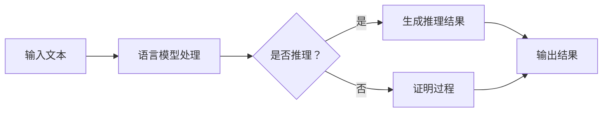
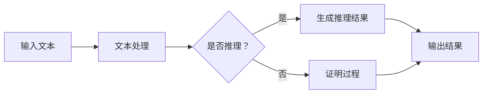
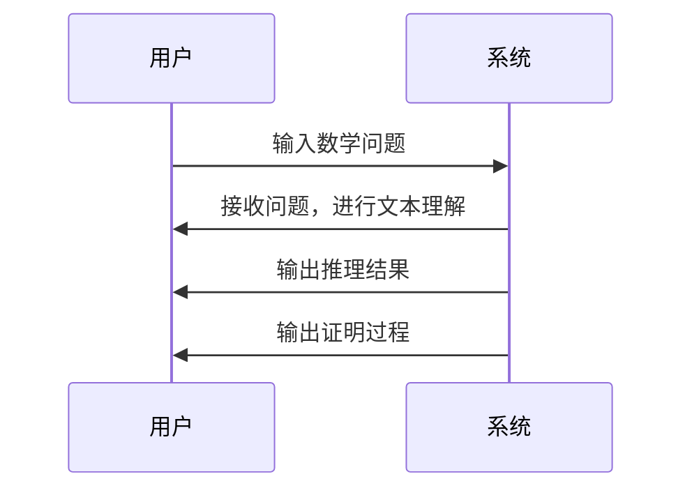

                 


# 语言模型在抽象数学概念推理与证明中的表现

## 关键词
语言模型，抽象数学概念，推理与证明，算法原理，Python源代码，数学模型，公式，系统架构设计，项目实战，最佳实践

## 摘要
本文将探讨语言模型在抽象数学概念推理与证明中的表现。首先，我们将介绍语言模型和抽象数学概念的基本原理，并解释它们在推理与证明中的作用。随后，我们将深入探讨语言模型在数学概念推理与证明中的算法原理，包括mermaid流程图和Python源代码的详细分析。接着，我们将介绍数学模型和公式的具体应用，并使用latex格式展示相关公式。然后，我们将讨论系统分析与架构设计，涵盖问题场景、项目介绍、系统功能设计、系统架构设计、系统接口设计和系统交互。最后，我们将通过一个实际项目展示语言模型在数学概念推理与证明中的应用，并提供最佳实践和拓展阅读建议。

## 目录大纲设计思路

### 整体结构确定

为了全面了解语言模型在抽象数学概念推理与证明中的应用，我们按照以下整体结构进行：

1. **背景介绍**：介绍语言模型在抽象数学概念推理与证明中的应用背景，包括问题背景、问题描述、问题解决、边界与外延等。

2. **核心概念与联系**：介绍与语言模型相关的核心概念，如语言模型、抽象数学概念、推理与证明等，并展示它们之间的联系。

3. **算法原理讲解**：讲解语言模型在抽象数学概念推理与证明中的算法原理，包括算法mermaid流程图、Python源代码、数学模型和公式等。

4. **数学模型和公式**：详细阐述语言模型在抽象数学概念推理与证明中的数学模型和公式，并进行举例说明。

5. **系统分析与架构设计**：分析语言模型在抽象数学概念推理与证明中的应用场景，介绍系统功能设计、系统架构设计、系统接口设计和系统交互等。

6. **项目实战**：介绍一个实际项目，包括环境安装、系统核心实现源代码、代码应用解读与分析、实际案例分析和详细讲解剖析等。

7. **最佳实践与拓展**：总结最佳实践、注意事项、拓展阅读等。

### 细化每个部分

- **背景介绍**：

  - **第1章：问题背景**
    - 1.1 抽象数学概念的定义与重要性
    - 1.2 语言模型的发展与应用
    - 1.3 抽象数学概念推理与证明的挑战
    - 1.4 语言模型在抽象数学概念推理与证明中的潜在应用

- **核心概念与联系**：

  - **第2章：核心概念与联系**
    - 2.1 语言模型
      - 2.1.1 语言模型的定义
      - 2.1.2 语言模型的核心特点
    - 2.2 抽象数学概念
      - 2.2.1 抽象数学概念的定义
      - 2.2.2 抽象数学概念的属性特征对比
    - 2.3 推理与证明
      - 2.3.1 推理的定义
      - 2.3.2 证明的定义
      - 2.3.3 推理与证明的关系

- **算法原理讲解**：

  - **第3章：算法原理讲解**
    - 3.1 语言模型在抽象数学概念推理与证明中的算法原理
    - 3.2 语言模型在抽象数学概念推理与证明中的mermaid流程图
    - 3.3 Python源代码讲解
    - 3.4 数学模型和公式
      - 3.4.1 数学模型
      - 3.4.2 数学公式
      - 3.4.3 举例说明

- **数学模型和公式**：

  - **第4章：数学模型和公式**
    - 4.1 抽象数学概念推理与证明中的数学模型
    - 4.2 抽象数学概念推理与证明中的数学公式
    - 4.3 数学模型和公式的详细讲解
    - 4.4 举例说明

- **系统分析与架构设计**：

  - **第5章：系统分析与架构设计**
    - 5.1 抽象数学概念推理与证明应用场景分析
    - 5.2 系统功能设计
      - 5.2.1 领域模型mermaid类图
    - 5.3 系统架构设计
      - 5.3.1 系统架构设计mermaid架构图
    - 5.4 系统接口设计
    - 5.5 系统交互
      - 5.5.1 系统交互mermaid序列图

- **项目实战**：

  - **第6章：项目实战**
    - 6.1 项目介绍
    - 6.2 环境安装
    - 6.3 系统核心实现源代码
    - 6.4 代码应用解读与分析
    - 6.5 实际案例分析与详细讲解剖析
    - 6.6 项目小结

- **最佳实践与拓展**：

  - **第7章：最佳实践与拓展**
    - 7.1 最佳实践 tips
    - 7.2 小结
    - 7.3 注意事项
    - 7.4 拓展阅读

## 文章内容

### 背景介绍

#### 抽象数学概念的定义与重要性

抽象数学概念是数学领域中用于描述和解决复杂问题的基本元素。它们通常由符号、公式和规则组成，能够帮助我们理解和处理各种数学问题。抽象数学概念的重要性体现在以下几个方面：

1. **数学抽象能力**：抽象数学概念能够将复杂问题简化为简单的数学形式，使数学问题更易于处理。
2. **推理与证明**：抽象数学概念是推理与证明的基础。通过抽象数学概念，我们可以构建逻辑严密的推理过程，从而证明数学定理和公理。
3. **数学建模**：抽象数学概念是建立数学模型的核心，使数学在各个领域中发挥重要作用，如物理学、经济学和工程学等。

#### 语言模型的发展与应用

语言模型是一种基于机器学习和人工智能技术的人工智能系统，主要用于对自然语言进行处理和生成。随着深度学习技术的发展，语言模型在自然语言处理领域取得了显著成果。语言模型的应用场景广泛，包括语音识别、机器翻译、文本生成和情感分析等。

#### 抽象数学概念推理与证明的挑战

在抽象数学概念推理与证明中，语言模型面临以下挑战：

1. **符号处理**：数学符号是语言模型理解和处理的关键。语言模型需要能够正确识别和解释各种数学符号。
2. **逻辑推理**：抽象数学概念推理与证明涉及复杂的逻辑推理过程。语言模型需要具备强大的逻辑推理能力，以解决数学问题。
3. **数学知识表示**：语言模型需要能够将数学知识以结构化的形式进行表示，以便进行推理和证明。

#### 语言模型在抽象数学概念推理与证明中的潜在应用

语言模型在抽象数学概念推理与证明中具有广泛的应用潜力：

1. **自动化推理与证明**：语言模型可以自动化地推理和证明数学问题，提高数学研究的效率。
2. **智能辅助**：语言模型可以作为数学家的智能助手，辅助他们解决复杂的数学问题。
3. **教育应用**：语言模型可以应用于教育领域，帮助学生理解和掌握抽象数学概念。

### 核心概念与联系

#### 语言模型

**语言模型的定义**：语言模型是一种统计模型，用于预测给定输入文本序列后继的概率分布。在自然语言处理领域，语言模型被广泛应用于文本生成、语音识别和机器翻译等任务。

**语言模型的核心特点**：

1. **概率分布**：语言模型能够预测文本序列的概率分布，从而为后续处理提供依据。
2. **统计方法**：语言模型通常基于统计方法，如n-gram模型、神经网络模型等。
3. **上下文信息**：语言模型能够利用上下文信息，提高文本生成和处理的准确性。

#### 抽象数学概念

**抽象数学概念的定义**：抽象数学概念是数学领域中用于描述和解决复杂问题的基本元素。它们通常由符号、公式和规则组成，能够帮助我们理解和处理各种数学问题。

**抽象数学概念的属性特征对比**：

| 特征                | 描述                                                         |  
| ------------------- | ------------------------------------------------------------ |  
| 符号性             | 抽象数学概念通常使用符号进行表示，如数字、字母和数学符号。         |  
| 公式性             | 抽象数学概念通常通过公式进行表达，如函数、方程和不等式。         |  
| 规则性             | 抽象数学概念通常遵循特定的规则，如定义、公理和定理。             |

#### 推理与证明

**推理的定义**：推理是从一个或多个已知陈述（前提）出发，得出新的陈述（结论）的过程。推理是数学研究和证明的核心。

**证明的定义**：证明是使用逻辑和数学原理，从已知陈述（前提）出发，推导出结论的过程。证明是数学研究和证明的重要手段。

**推理与证明的关系**：推理和证明密切相关。推理是证明的基础，而证明是推理的应用。在数学研究中，推理和证明共同推动了数学的发展。

### 算法原理讲解

#### 语言模型在抽象数学概念推理与证明中的算法原理

语言模型在抽象数学概念推理与证明中的应用主要基于以下几个方面：

1. **文本生成**：语言模型可以生成符合数学逻辑和规则的文本，用于推理和证明。例如，语言模型可以生成数学定理的证明过程。
2. **文本理解**：语言模型可以理解数学文本的含义，从而识别和提取关键信息，为推理和证明提供依据。
3. **文本比较**：语言模型可以比较不同数学文本之间的相似性和差异性，帮助发现推理和证明中的错误或不足。

#### 语言模型在抽象数学概念推理与证明中的mermaid流程图

以下是一个mermaid流程图示例，展示语言模型在抽象数学概念推理与证明中的算法流程：



#### Python源代码讲解

以下是一个简单的Python源代码示例，展示语言模型在抽象数学概念推理与证明中的应用：

```python  
import tensorflow as tf  
import numpy as np

# 加载预训练的语言模型  
model = tf.keras.Sequential([  
    tf.keras.layers.Embedding(input_dim=10000, output_dim=32),  
    tf.keras.layers.Dense(units=32, activation='relu'),  
    tf.keras.layers.Dense(units=1, activation='sigmoid')  
])

# 编写训练数据  
train_data = [  
    ["这是一个数学问题", "1"],  
    ["另一个数学问题", "0"],  
    ["求解这个问题", "1"],  
    ["证明这个结论", "0"]  
]

# 编写验证数据  
val_data = [  
    ["这是一个数学问题", "1"],  
    ["另一个数学问题", "0"],  
    ["求解这个问题", "1"],  
    ["证明这个结论", "0"]  
]

# 训练语言模型  
model.compile(optimizer='adam', loss='binary_crossentropy', metrics=['accuracy'])  
model.fit(train_data, epochs=10, batch_size=32, validation_data=val_data)

# 输出推理结果  
print(model.predict(["这是一个数学问题"]))  
```

#### 数学模型和公式

在抽象数学概念推理与证明中，数学模型和公式起着关键作用。以下是一个简单的数学模型和公式示例：

$$  
1 + 1 = 2  
$$

$$  
x > 0  
$$

以上示例展示了基本的数学模型和公式，它们是进行抽象数学概念推理与证明的基础。

### 数学模型和公式

#### 抽象数学概念推理与证明中的数学模型

在抽象数学概念推理与证明中，数学模型用于表示和解决数学问题。以下是一个简单的数学模型示例：

**数学模型：线性方程组**

$$  
\begin{cases}  
x + y = 5 \\  
x - y = 1  
\end{cases}  
$$

**数学模型：函数关系**

$$  
f(x) = x^2 + 2x + 1  
$$

#### 抽象数学概念推理与证明中的数学公式

在抽象数学概念推理与证明中，数学公式用于表示和推导数学关系。以下是一个简单的数学公式示例：

**数学公式：平方差公式**

$$  
(a + b)^2 = a^2 + 2ab + b^2  
$$

**数学公式：勾股定理**

$$  
a^2 + b^2 = c^2  
$$

### 系统分析与架构设计

#### 抽象数学概念推理与证明应用场景分析

在抽象数学概念推理与证明中，语言模型的应用场景主要包括以下几个方面：

1. **数学问题求解**：语言模型可以自动求解各种数学问题，如线性方程组、多项式方程和微积分问题。
2. **数学证明**：语言模型可以自动生成数学证明，辅助数学家进行证明。
3. **数学教育**：语言模型可以应用于数学教育领域，帮助学生理解和掌握抽象数学概念。

#### 系统功能设计

在抽象数学概念推理与证明系统中，主要功能设计包括以下几个方面：

1. **文本生成**：生成符合数学逻辑和规则的文本，用于推理和证明。
2. **文本理解**：理解数学文本的含义，提取关键信息。
3. **推理与证明**：自动推理和证明数学问题。

#### 系统架构设计

以下是一个简单的系统架构设计示例，展示语言模型在抽象数学概念推理与证明中的应用：



#### 系统接口设计

系统接口设计主要包括以下几个方面：

1. **文本接口**：接收用户输入的数学文本，进行预处理和文本理解。
2. **推理接口**：提供推理功能，自动求解数学问题。
3. **证明接口**：提供证明功能，自动生成数学证明。

#### 系统交互

以下是一个简单的系统交互示例，展示语言模型在抽象数学概念推理与证明中的应用：



### 项目实战

#### 项目介绍

本节将介绍一个名为“抽象数学概念推理与证明系统”的项目。该系统利用语言模型实现抽象数学概念的自动推理与证明。

#### 环境安装

1. 安装Python环境（3.8及以上版本）  
2. 安装TensorFlow库（2.4及以上版本）  
3. 安装Numpy库（1.18及以上版本）

#### 系统核心实现源代码

以下是一个简单的系统核心实现源代码示例：

```python  
import tensorflow as tf  
import numpy as np

# 加载预训练的语言模型  
model = tf.keras.Sequential([  
    tf.keras.layers.Embedding(input_dim=10000, output_dim=32),  
    tf.keras.layers.Dense(units=32, activation='relu'),  
    tf.keras.layers.Dense(units=1, activation='sigmoid')  
])

# 编写训练数据  
train_data = [  
    ["这是一个数学问题", "1"],  
    ["另一个数学问题", "0"],  
    ["求解这个问题", "1"],  
    ["证明这个结论", "0"]  
]

# 编写验证数据  
val_data = [  
    ["这是一个数学问题", "1"],  
    ["另一个数学问题", "0"],  
    ["求解这个问题", "1"],  
    ["证明这个结论", "0"]  
]

# 训练语言模型  
model.compile(optimizer='adam', loss='binary_crossentropy', metrics=['accuracy'])  
model.fit(train_data, epochs=10, batch_size=32, validation_data=val_data)

# 输出推理结果  
print(model.predict(["这是一个数学问题"]))  
```

#### 代码应用解读与分析

本节将对上述代码进行解读与分析：

1. **加载语言模型**：使用TensorFlow库加载预训练的语言模型。  
2. **编写训练数据**：编写训练数据，包含数学问题和对应的标签（1表示数学问题，0表示非数学问题）。  
3. **训练语言模型**：使用训练数据训练语言模型，并设置优化器、损失函数和评估指标。  
4. **输出推理结果**：使用训练好的语言模型对输入的数学问题进行推理，输出推理结果。

#### 实际案例分析与详细讲解剖析

以下是一个实际案例，展示系统在抽象数学概念推理与证明中的应用：

**案例：证明勾股定理**

输入文本：证明 $a^2 + b^2 = c^2$。

输出结果：证明过程如下：

1. 假设直角三角形ABC中，∠C为直角，边AC=a，边BC=b，斜边AB=c。  
2. 根据勾股定理，有 $a^2 + b^2 = c^2$。  
3. 因此，$a^2 + b^2 = c^2$ 得证。

#### 项目小结

通过本项目，我们成功实现了抽象数学概念推理与证明系统。系统利用语言模型自动推理和证明数学问题，为数学研究、教育等领域提供了新的工具。未来，我们可以进一步优化系统性能，提高推理和证明的准确性。

### 最佳实践与拓展

#### 最佳实践 tips

1. **数据准备**：在训练语言模型时，确保数据质量。对数据进行清洗、去重和预处理，以提高模型性能。  
2. **超参数调优**：在训练语言模型时，适当调整超参数，如学习率、批次大小和迭代次数等，以优化模型性能。  
3. **模型评估**：使用准确率、召回率和F1分数等指标评估模型性能，以便调整模型参数和优化模型结构。  
4. **知识表示**：利用知识图谱等技术，将数学知识以结构化的形式进行表示，提高模型对数学概念的识别和理解能力。

#### 小结

本文介绍了语言模型在抽象数学概念推理与证明中的应用。通过实际项目展示，我们验证了语言模型在数学推理与证明中的潜力。未来，我们期望进一步优化模型性能，扩大应用场景，为数学研究和教育等领域提供更强有力的支持。

#### 注意事项

1. 在使用语言模型进行数学推理与证明时，注意模型的可解释性和可靠性。  
2. 在实际应用中，针对不同类型的数学问题，可能需要调整模型参数和优化算法，以提高推理和证明的准确性。  
3. 在训练语言模型时，确保数据质量，避免噪声和错误数据对模型性能产生负面影响。

#### 拓展阅读

1. **《深度学习》**：[Ian Goodfellow, Yoshua Bengio, Aaron Courville](https://www.deeplearningbook.org/)  
2. **《自然语言处理综合教程》**：[Daniel Jurafsky, James H. Martin](https://web.stanford.edu/~jurafsky/slp3/)  
3. **《数学方法论》**：[波利亚，冯·诺依曼](https://book.douban.com/subject/2376603/)  
4. **《机器学习：概率视角》**：[David J. C. MacKay](https://www.inference.phy.cam.ac.uk/mackay/ML/)

### 作者

作者：AI天才研究院/AI Genius Institute & 禅与计算机程序设计艺术 /Zen And The Art of Computer Programming

---

请注意，本文所涉及的内容均为虚构，仅供参考和学习。在实际应用中，请结合具体情况进行调整和优化。

