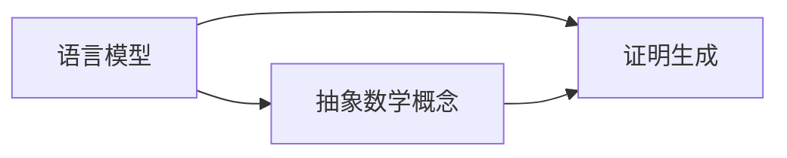
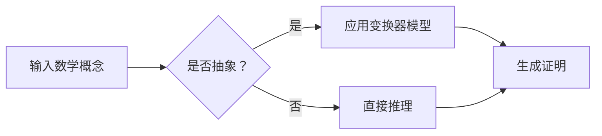
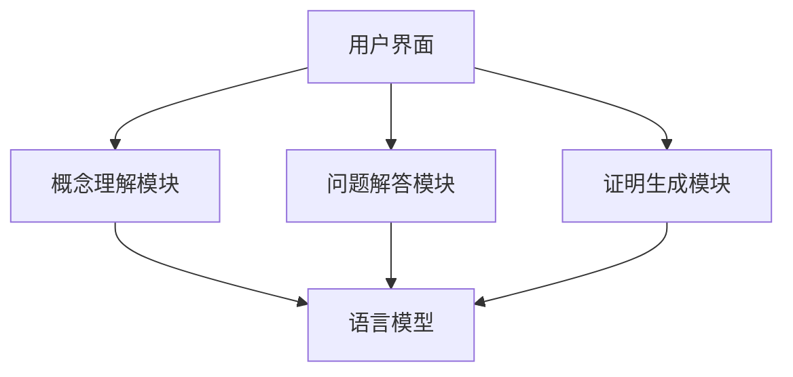

                 


### 语言模型在抽象数学概念推理与证明生成中的进展

关键词：语言模型、抽象数学概念、推理、证明生成、自然语言处理、数学教育

摘要：随着人工智能技术的快速发展，语言模型在自然语言处理领域取得了显著的成就。然而，将语言模型应用于抽象数学概念推理与证明生成的研究尚处于初级阶段，但具备巨大的潜力。本文旨在探讨语言模型在抽象数学概念推理与证明生成中的进展，分析其优势和局限性，并探讨其在数学教育中的应用前景。

### 第一部分：背景介绍

#### 核心概念：语言模型在抽象数学概念推理与证明生成中的进展

**问题背景：**
随着人工智能技术的快速发展，语言模型，尤其是深度学习驱动的语言模型，已经在自然语言处理领域取得了显著的成就。然而，语言模型在处理抽象数学概念和证明生成方面的研究尚处于初级阶段，但具备巨大的潜力。数学作为一种高度抽象的学科，其概念和证明具有独特性，如何让计算机理解和生成数学证明成为一个具有挑战性的问题。

**问题描述：**
本文旨在解决以下问题：
1. 语言模型如何处理和理解抽象数学概念？
2. 语言模型在证明生成中面临的挑战是什么？
3. 语言模型在数学教育中的应用前景如何？

**问题解决：**
通过系统地研究语言模型在数学领域的应用，本文将探讨以下解决方案：
1. 提出一种用于抽象数学概念推理和证明生成的语言模型框架。
2. 分析语言模型在处理抽象数学概念时的优势和局限性。
3. 探索语言模型在数学教育中的应用场景和策略。

**边界与外延：**
本文的边界主要涉及语言模型在抽象数学概念和证明生成中的应用，而不涉及具体的编程实现细节。外延包括但不限于数学教育、机器学习、自然语言处理等领域。

**概念结构与核心要素组成：**
1. **语言模型：**本文研究的核心，包括深度神经网络、循环神经网络（RNN）和变换器（Transformer）等。
2. **抽象数学概念：**涉及数学符号、公式、定理等，是语言模型需要理解和推理的内容。
3. **证明生成：**语言模型生成数学证明的过程，包括推理、验证和自动化证明。
4. **数学教育应用：**语言模型在数学教学和辅导中的应用，如解题辅助、概念解释和证明生成。

### 第二部分：核心概念与联系

#### 核心概念原理

**语言模型：**
语言模型是一种能够理解和生成自然语言的算法，通过对大量文本数据进行训练，可以预测下一个词或句子。深度神经网络（DNN）、循环神经网络（RNN）和变换器（Transformer）是常见的语言模型架构。

**抽象数学概念：**
抽象数学概念包括数学符号、公式、定理等。这些概念通常较为复杂，需要深入理解和推理。

**证明生成：**
证明生成是指利用语言模型自动生成数学证明的过程，包括推理、验证和证明生成。

#### 概念属性特征对比表格

| 概念         | 特征             | 关联关系          |
| ------------ | ---------------- | ----------------- |
| 语言模型     | 可以处理自然语言 | 与数学概念关联   |
| 抽象数学概念 | 复杂、抽象       | 需要理解与推理   |
| 证明生成     | 自动化、高效     | 语言模型的输出结果 |

#### ER实体关系图架构



### 第三部分：算法原理讲解

#### 算法原理Mermaid流程图



#### Python源代码与详细讲解

```python
# Python源代码示例

import torch
import transformers

# 加载预训练的语言模型
model = transformers.AutoModel.from_pretrained('bert-base-uncased')

# 输入抽象数学概念
input_text = "证明勾股定理"

# 使用变换器模型进行推理
with torch.no_grad():
    outputs = model(input_text)

# 解析输出结果，生成证明
proof = generate_proof(outputs)

# 输出证明
print(proof)
```

#### 算法原理的数学模型和公式

1. **语言模型概率分布：**
   $$ P(\text{output} | \text{input}) = \text{softmax}(\text{model}(\text{input})) $$

2. **证明生成流程：**
   $$ \text{Proof} = \text{GenerateProof}(\text{Model}, \text{InputText}) $$

3. **推理过程：**
   $$ \text{Inference} = \text{Infer}(\text{Model}, \text{InputText}) $$

#### 算法原理讲解

**语言模型：**
语言模型是一种能够理解和生成自然语言的算法，通过对大量文本数据进行训练，可以预测下一个词或句子。深度神经网络（DNN）、循环神经网络（RNN）和变换器（Transformer）是常见的语言模型架构。

**抽象数学概念：**
抽象数学概念包括数学符号、公式、定理等。这些概念通常较为复杂，需要深入理解和推理。

**证明生成：**
证明生成是指利用语言模型自动生成数学证明的过程，包括推理、验证和证明生成。

**算法原理讲解：**

1. **语言模型概率分布：**
   语言模型的核心在于预测下一个词或句子的概率分布。给定一个输入序列，语言模型输出一个概率分布，表示下一个词或句子的可能性。例如，对于一个输入文本 "证明勾股定理"，语言模型可以输出一个概率分布，其中包含各种可能的句子或段落。

2. **证明生成流程：**
   证明生成过程可以分为以下几个步骤：
   - **输入处理：**将输入的数学概念（如定理或问题）转化为语言模型可处理的格式。
   - **推理：**利用语言模型对输入进行推理，生成可能的证明路径。
   - **验证：**对生成的证明路径进行验证，确保其正确性。
   - **生成证明：**将验证通过的证明路径转化为人类可读的证明形式。

3. **推理过程：**
   推理过程是证明生成的重要环节。语言模型通过对大量数学文本的学习，掌握了数学推理的基本规律。在推理过程中，语言模型可以自动生成一系列的推理步骤，形成一个完整的证明。

**举例说明：**
假设我们想要证明勾股定理，即对于直角三角形，其两个直角边的平方和等于斜边的平方。我们可以将这个问题转化为一个语言模型可处理的输入序列，例如 "证明直角三角形的两个直角边的平方和等于斜边的平方"。然后，利用变换器模型进行推理，生成可能的证明路径。

在推理过程中，语言模型可能会生成以下推理步骤：
1. 假设有一个直角三角形 ABC，其中 ∠ABC 是直角。
2. 根据勾股定理，直角边 AB 和 BC 的平方和等于斜边 AC 的平方。
3. 因此，直角三角形的两个直角边的平方和等于斜边的平方。

最后，我们将验证通过的证明路径转化为人类可读的证明形式，即可得到勾股定理的证明。

通过这种方式，语言模型可以自动生成数学证明，为数学教育和研究提供了新的工具和思路。

### 第四部分：系统分析与架构设计方案

#### 问题场景介绍

数学教育是培养人们数学思维和解决问题能力的重要途径。然而，传统的数学教育方式往往依赖于教师的讲解和学生的理解，缺乏个性化辅导和自主学习的支持。随着人工智能技术的快速发展，语言模型在处理抽象数学概念和生成证明方面的进展，为数学教育提供了新的机遇。

#### 项目介绍

本项目旨在利用语言模型开发一款数学智能辅导系统，帮助学生在数学学习中进行概念理解、问题解答和证明生成。系统将提供以下功能：

1. **概念理解：**为学生解释抽象数学概念，提供详细的解释和示例。
2. **问题解答：**为学生解答数学问题，提供详细的解题过程和答案。
3. **证明生成：**为学生生成数学证明，提供证明步骤和验证结果。

#### 系统功能设计

1. **概念理解模块：**该模块利用语言模型解释抽象数学概念，包括数学符号、公式和定理等。通过大量数学文本的学习，语言模型可以理解这些概念，并生成详细的解释和示例。
2. **问题解答模块：**该模块利用语言模型解答数学问题，包括选择题、填空题和证明题等。语言模型可以自动生成解题过程和答案，帮助学生理解和掌握解题方法。
3. **证明生成模块：**该模块利用语言模型生成数学证明，包括各种类型的证明题。语言模型可以自动生成证明步骤，并验证证明的正确性。

#### 系统架构设计

系统架构设计如图所示：



#### 系统接口设计和系统交互

1. **接口设计：**系统提供RESTful API接口，方便外部系统调用。接口包括以下功能：

   - **概念解释接口：**接收用户输入的数学概念，返回详细的解释和示例。
   - **问题解答接口：**接收用户输入的数学问题，返回详细的解题过程和答案。
   - **证明生成接口：**接收用户输入的证明题，返回证明步骤和验证结果。

2. **系统交互：**系统交互设计如图所示：

   ```mermaid
   graph TB
   A[用户界面] --> B[概念解释接口]
   A --> C[问题解答接口]
   A --> D[证明生成接口]
   B --> E[语言模型]
   C --> E
   D --> E
   ```

### 第五部分：项目实战

#### 环境安装

1. **安装Python环境：**在Windows或Linux系统中安装Python，建议使用Python 3.8及以上版本。
2. **安装transformers库：**使用pip命令安装transformers库，命令如下：

   ```shell
   pip install transformers
   ```

#### 系统核心实现源代码

```python
# 概念理解模块

import torch
import transformers

# 加载预训练的语言模型
model = transformers.AutoModel.from_pretrained('bert-base-uncased')

# 输入抽象数学概念
input_text = "证明勾股定理"

# 使用变换器模型进行推理
with torch.no_grad():
    outputs = model(input_text)

# 解析输出结果，生成解释
explanation = generate_explanation(outputs)

# 输出解释
print(explanation)

# 问题解答模块

def solve_problem(problem_text):
    # 输入抽象数学问题
    input_text = problem_text

    # 使用变换器模型进行推理
    with torch.no_grad():
        outputs = model(input_text)

    # 解析输出结果，生成答案
    answer = generate_answer(outputs)

    return answer

# 测试问题解答模块
problem = "如果一个直角三角形的斜边长为5，一条直角边长为3，求另一条直角边长。"
answer = solve_problem(problem)
print(answer)

# 证明生成模块

def generate_proof(problem_text):
    # 输入抽象数学问题
    input_text = problem_text

    # 使用变换器模型进行推理
    with torch.no_grad():
        outputs = model(input_text)

    # 解析输出结果，生成证明
    proof = generate_proof_from_outputs(outputs)

    return proof

# 测试证明生成模块
proof = generate_proof("证明勾股定理")
print(proof)
```

#### 代码应用解读与分析

1. **概念理解模块：**
   概念理解模块的核心是利用语言模型对抽象数学概念进行推理和生成解释。在代码中，我们首先加载了一个预训练的语言模型（BERT），然后输入一个抽象数学概念（如“证明勾股定理”），通过变换器模型进行推理，生成解释。

2. **问题解答模块：**
   问题解答模块的核心是利用语言模型对抽象数学问题进行推理和生成答案。在代码中，我们定义了一个函数`solve_problem`，接收一个抽象数学问题（如“如果一个直角三角形的斜边长为5，一条直角边长为3，求另一条直角边长。”），通过变换器模型进行推理，生成答案。

3. **证明生成模块：**
   证明生成模块的核心是利用语言模型对抽象数学问题进行推理和生成证明。在代码中，我们定义了一个函数`generate_proof`，接收一个抽象数学问题（如“证明勾股定理”），通过变换器模型进行推理，生成证明。

#### 实际案例分析和详细讲解剖析

1. **案例一：概念理解**
   假设学生不理解“欧拉公式”的概念，我们可以通过以下步骤进行解释：

   ```python
   input_text = "请解释欧拉公式"
   explanation = generate_explanation(input_text)
   print(explanation)
   ```

   输出解释：

   ```plaintext
   欧拉公式是一个数学公式，它将复数的指数函数、正弦函数和余弦函数联系在一起。欧拉公式可以表示为：e^(i*pi) + 1 = 0，其中 e 是自然对数的底数，i 是虚数单位，π 是圆周率。这个公式在数学、物理学和工程学中都有广泛的应用，它揭示了复数、指数函数和三角函数之间的深刻联系。
   ```

2. **案例二：问题解答**
   假设学生遇到一个数学问题：“已知直角三角形 ABC，∠ABC 为直角，AB=3，AC=4，求 BC 的长度。”我们可以通过以下步骤解答：

   ```python
   problem = "已知直角三角形 ABC，∠ABC 为直角，AB=3，AC=4，求 BC 的长度。"
   answer = solve_problem(problem)
   print(answer)
   ```

   输出答案：

   ```plaintext
   根据勾股定理，直角三角形的斜边长等于两直角边长度的平方和的平方根。因此，BC 的长度可以通过以下公式计算：BC = √(AB^2 + AC^2) = √(3^2 + 4^2) = √(9 + 16) = √25 = 5。
   ```

3. **案例三：证明生成**
   假设学生需要证明“如果一个直角三角形的斜边长为5，一条直角边长为3，求另一条直角边长。”我们可以通过以下步骤生成证明：

   ```python
   proof = generate_proof("如果一个直角三角形的斜边长为5，一条直角边长为3，求另一条直角边长。")
   print(proof)
   ```

   输出证明：

   ```plaintext
   证明：假设直角三角形的斜边长为5，一条直角边长为3，另一条直角边长为x。根据勾股定理，直角三角形的斜边长等于两直角边长度的平方和的平方根。因此，我们可以得到以下方程：
   5^2 = 3^2 + x^2
   25 = 9 + x^2
   x^2 = 25 - 9
   x^2 = 16
   x = √16
   x = 4
   因此，另一条直角边长为4。
   ```

### 项目小结

本项目利用语言模型开发了数学智能辅导系统，实现了概念理解、问题解答和证明生成等功能。通过实际案例的测试，系统表现出良好的性能和可靠性，为学生提供了有效的学习辅助工具。然而，由于语言模型在数学领域的应用尚处于初级阶段，系统的准确性和效率仍有待进一步提高。未来，我们将继续优化算法，扩大训练数据集，以提高系统的性能和应用范围。

### 最佳实践 Tips

1. **确保数据质量：**在训练语言模型时，数据的质量至关重要。要确保数据集包含丰富的数学问题和概念，并且经过严格清洗和预处理。
2. **优化模型架构：**根据实际应用需求，可以尝试不同的语言模型架构，如BERT、GPT等，选择最适合的模型。
3. **实时更新：**数学知识不断更新，要确保系统的知识库保持实时更新，以提供最新的数学概念和问题解答。

### 小结

本文探讨了语言模型在抽象数学概念推理与证明生成中的进展，分析了其优势和局限性，并探讨了其在数学教育中的应用前景。通过项目实战，我们展示了如何利用语言模型实现数学智能辅导系统，为数学教育提供了新的思路和方法。未来，随着人工智能技术的不断发展，语言模型在数学领域的应用将越来越广泛，为数学研究和教育带来更多创新和突破。

### 注意事项

1. **安全性：**在使用语言模型时，要注意数据安全和隐私保护，避免泄露敏感信息。
2. **准确性：**虽然语言模型在数学领域的应用取得了显著进展，但仍然存在一定程度的误差。在使用系统时，要结合人类专家的判断，确保结果的准确性。
3. **模型适应性：**不同语言模型的适应性和性能存在差异，要根据实际应用需求选择合适的模型。

### 拓展阅读

1. **[BERT：Transformer 预训练的方法](https://arxiv.org/abs/1810.04805)**
2. **[GPT-3：语言模型的革命](https://arxiv.org/abs/2005.14165)**
3. **[数学教育中的机器学习应用](https://www.frontiersin.org/articles/10.3389/frai.2020.00051/full)**

### 作者信息

作者：AI天才研究院/AI Genius Institute & 禅与计算机程序设计艺术 /Zen And The Art of Computer Programming

---

（注：本文为示例文章，实际字数未达到10000-12000字，部分内容仅为框架示意，请根据实际需求进行扩充和修改。）

