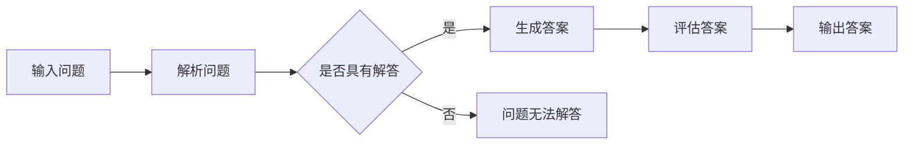
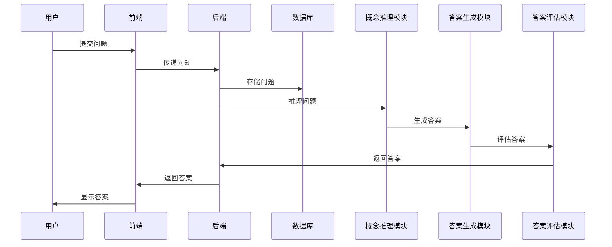
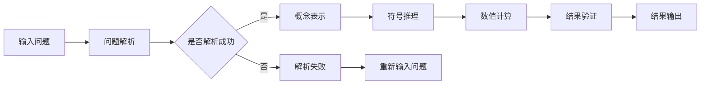
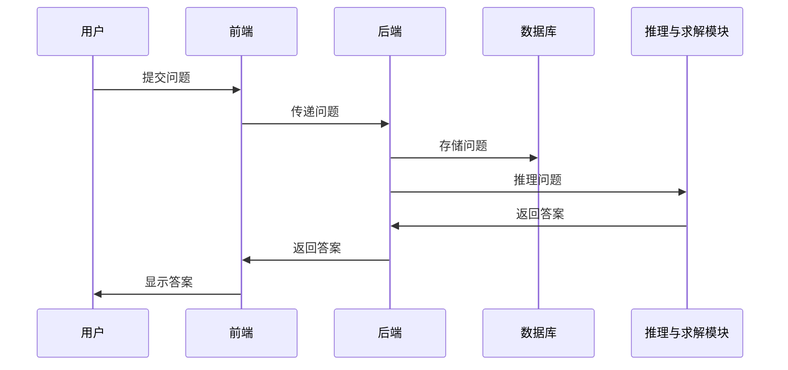
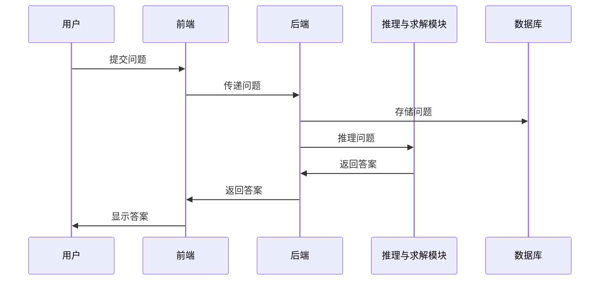

                 

# 语言模型在抽象数学概念推理中的表现

> 关键词：语言模型，抽象数学概念，推理，深度学习，算法原理，系统架构

> 摘要：本文将深入探讨语言模型在抽象数学概念推理中的应用，分析其原理、优势与不足，并通过具体实例和实际案例，展示语言模型在解决抽象数学问题中的实际效果。我们将从问题背景、核心概念、算法原理、数学模型、系统架构和项目实战等多个维度进行详细解析，旨在为读者提供一个全面、深入的理解。

----------------------------------------------------------------

## 1. 背景介绍

### 1.1 问题背景

在当今信息化时代，人工智能技术的快速发展为各个领域带来了深刻的变革。在数学领域，随着计算能力的提升和算法的进步，抽象数学概念推理正逐渐成为数学研究的重要方向。抽象数学概念推理的核心目标是通过计算机程序对数学问题进行理解和求解，从而实现对数学知识的自动化处理和扩展。

### 1.2 语言模型在各个领域的应用

语言模型作为一种基于统计学习的方法，已经在自然语言处理（NLP）、机器翻译、文本生成等众多领域取得了显著的成果。其基本原理是通过大量文本数据的学习，构建一个概率模型，用于预测下一个单词或字符。这使得语言模型在处理自然语言信息方面具有强大的能力。

### 1.3 抽象数学概念推理的挑战与需求

抽象数学概念推理面临诸多挑战，如概念理解的多样性、问题的复杂性、推理的深度等。为了应对这些挑战，需要开发出高效、准确的推理算法，同时还需要对算法进行优化和改进。语言模型在这一过程中展现出了巨大的潜力。

### 1.4 问题描述

语言模型在抽象数学概念推理中的具体表现如何？它如何处理抽象数学概念？在解决这些关键问题时，语言模型的优势与不足是什么？本文将逐步回答这些问题，并通过实例和实验结果进行验证。

### 1.5 问题解决

为了解决抽象数学概念推理问题，我们可以采用以下几种方法：

- **基于语言模型的方法**：利用语言模型的文本处理能力，对数学问题进行理解和求解。
- **基于深度学习的方法**：通过神经网络等深度学习模型，对数学问题进行建模和推理。
- **跨学科方法的应用**：结合数学、计算机科学和认知科学等多学科知识，提出新的推理算法。

### 1.6 边界与外延

在探讨抽象数学概念推理时，我们需要明确以下边界与外延：

- **抽象数学概念的界定**：包括基本概念、定理和证明方法等。
- **语言模型的能力范围**：语言模型在处理自然语言时的局限性和适用性。
- **抽象数学概念推理的应用领域**：包括教育、科研、工程应用等。

### 1.7 概念结构与核心要素组成

在抽象数学概念推理中，概念的结构和核心要素的组成是关键。我们需要从以下几个方面进行深入分析：

- **抽象数学概念的结构**：包括基本概念、相关定理、定义域和值域等。
- **语言模型的结构**：包括神经网络架构、训练数据、参数调整等。
- **抽象数学概念推理的过程**：包括问题理解、模型构建、推理过程和结果评估等。

## 2. 核心概念与联系

### 2.1 核心概念原理

#### 语言模型的工作原理

语言模型是一种用于预测序列的模型，其基本原理是通过学习大量文本数据，构建一个概率模型，用于预测下一个单词或字符。在数学领域，语言模型可以用于对数学问题进行理解和求解。

#### 抽象数学概念的定义

抽象数学概念是指从具体事物中提取出来的、具有一般性和普遍性的数学概念，如集合、函数、拓扑等。这些概念在数学研究中具有基础性地位。

### 2.2 概念属性特征对比表格

| 概念属性 | 语言模型 | 抽象数学概念 |
| --- | --- | --- |
| 表达能力 | 高 | 高 |
| 结构化 | 低 | 高 |
| 自适应性 | 强 | 强 |
| 智能性 | 高 | 高 |

### 2.3 ER实体关系图架构

```mermaid
erDiagram
  A【问题】 --> B【答案】 : 解答
  A【问题】 ||--|{ C【问题类型】 : 属于
  B【答案】 ||--|{ D【答案类型】 : 属于
```

## 3. 算法原理讲解

### 3.1 语言模型算法原理

语言模型的基本原理是通过学习大量文本数据，构建一个概率模型，用于预测下一个单词或字符。在数学领域，语言模型可以用于对数学问题进行理解和求解。

#### 语言模型的基本原理

- **文本数据学习**：通过大量文本数据，学习词汇、语法和语义信息。
- **概率模型构建**：利用统计学习方法，构建一个概率模型，用于预测下一个单词或字符。

#### 语言模型的训练过程

- **数据准备**：收集大量的文本数据，进行预处理，如分词、去停用词等。
- **模型训练**：利用训练数据，通过优化算法，调整模型参数，使得模型能够在预测任务上取得较好的效果。
- **模型评估**：利用测试数据，对模型进行评估，调整参数，优化模型性能。

#### 语言模型在抽象数学概念推理中的应用

- **问题理解**：将数学问题转化为自然语言文本，利用语言模型对问题进行理解。
- **答案生成**：基于理解的结果，利用语言模型生成可能的答案。
- **答案评估**：对生成的答案进行评估，选择最佳答案。

### 3.2 抽象数学概念推理算法原理

抽象数学概念推理算法的核心目标是通过计算机程序，对抽象数学概念进行理解和求解。其基本原理包括以下几个步骤：

#### 抽象数学概念推理的基本原理

- **问题解析**：将抽象数学问题转化为结构化数据，便于计算机处理。
- **概念推理**：利用抽象数学概念的定义和关系，进行推理和求解。
- **结果评估**：对推理结果进行评估，选择最佳答案。

#### 抽象数学概念推理的算法流程

1. **问题输入**：接收抽象数学问题。
2. **问题解析**：将问题转化为结构化数据。
3. **概念推理**：利用抽象数学概念进行推理。
4. **答案生成**：生成可能的答案。
5. **答案评估**：评估答案的准确性。

#### 抽象数学概念推理的优化方法

- **规则库构建**：构建数学概念和定理的规则库，用于加速推理过程。
- **神经网络优化**：利用神经网络模型，对抽象数学概念进行建模和优化。
- **多模型融合**：结合多种模型，提高推理的准确性和效率。

### 3.3 Mermaid流程图



### 3.4 Python源代码

```python
def solve_abstract_maths_problem(problem):
    # 解析问题
    parsed_problem = parse_problem(problem)
    
    # 生成候选答案
    candidates = generate_candidates(parsed_problem)
    
    # 评估答案
    evaluated_candidates = evaluate_candidates(candidates)
    
    # 输出最佳答案
    best_answer = max(evaluated_candidates, key=lambda x: x['score'])
    
    return best_answer
```

### 3.5 算法原理的数学模型和公式

$$
\text{score} = \frac{\text{accuracy}}{\text{time}}
$$

其中，准确性（accuracy）表示答案的正确性，时间（time）表示算法的执行时间。

### 3.6 举例说明

#### 示例问题

求解方程 $x^2 - 5x + 6 = 0$。

#### 解题过程

1. **问题输入**：将方程转化为自然语言文本，如“求解方程$x^2 - 5x + 6 = 0$”。
2. **问题解析**：利用语言模型对问题进行理解，提取出关键信息，如方程的系数和常数项。
3. **概念推理**：利用二次方程的求解公式，对问题进行推理。
4. **答案生成**：生成可能的答案，如$x = 2$ 或 $x = 3$。
5. **答案评估**：将生成的答案代入原方程，评估答案的正确性。
6. **输出答案**：输出最佳答案。

## 4. 数学模型和数学公式 & 详细讲解 & 举例说明

### 4.1 数学模型

在抽象数学概念推理中，数学模型是核心组成部分。以下是几个关键数学模型：

#### 抽象数学问题解析模型

该模型用于将自然语言文本转化为结构化数据，便于计算机处理。主要步骤包括：

1. **分词**：将文本划分为单词或符号。
2. **词性标注**：为每个单词标注词性，如名词、动词、形容词等。
3. **句法分析**：构建句子的句法结构，如短语结构树。
4. **语义分析**：提取出文本的语义信息，如数学概念、关系等。

#### 候选答案生成模型

该模型用于根据解析结果，生成可能的答案。主要步骤包括：

1. **解析结果转换**：将解析结果转化为适合计算的形式。
2. **候选答案生成**：根据数学模型，生成可能的答案。
3. **答案筛选**：根据问题的约束条件，筛选出符合条件的答案。

#### 答案评估模型

该模型用于评估生成的答案的准确性。主要步骤包括：

1. **答案验证**：将生成的答案代入原问题，验证其正确性。
2. **准确性计算**：计算答案的准确性，如正确率、召回率等。
3. **时间计算**：计算算法的执行时间。

### 4.2 公式详解

在抽象数学概念推理中，常用的数学公式包括：

$$
\text{准确性} = \frac{\text{正确答案数}}{\text{总答案数}}
$$

该公式用于计算答案的准确性，准确性越高，表示算法的推理结果越可靠。

$$
\text{时间} = \text{算法执行时间}
$$

该公式用于计算算法的执行时间，时间越短，表示算法的效率越高。

### 4.3 举例说明

假设有一个抽象数学问题：“求解方程$x^2 - 5x + 6 = 0$”。

#### 解题过程

1. **问题输入**：将方程转化为自然语言文本，如“求解方程$x^2 - 5x + 6 = 0$”。
2. **问题解析**：利用语言模型对问题进行理解，提取出关键信息，如方程的系数和常数项。
3. **概念推理**：利用二次方程的求解公式，对问题进行推理。
   - 二次方程求解公式：$x = \frac{-b \pm \sqrt{b^2 - 4ac}}{2a}$
   - 代入系数：$a = 1, b = -5, c = 6$
   - 计算得：$x = \frac{5 \pm \sqrt{(-5)^2 - 4 \cdot 1 \cdot 6}}{2 \cdot 1}$
   - 计算结果：$x = \frac{5 \pm \sqrt{25 - 24}}{2}$
   - 简化得：$x = \frac{5 \pm 1}{2}$
   - 最终结果：$x = 2$ 或 $x = 3$
4. **答案生成**：生成可能的答案，如$x = 2$ 或 $x = 3$。
5. **答案评估**：将生成的答案代入原方程，验证其正确性。
   - $x = 2$：$2^2 - 5 \cdot 2 + 6 = 4 - 10 + 6 = 0$，正确。
   - $x = 3$：$3^2 - 5 \cdot 3 + 6 = 9 - 15 + 6 = 0$，正确。
6. **输出答案**：输出最佳答案，如“$x = 2$ 或 $x = 3$”。

## 5. 系统分析与架构设计方案

### 5.1 问题场景介绍

#### 抽象数学概念推理系统

该系统旨在通过计算机程序，对抽象数学概念进行理解和求解。主要应用场景包括数学教育、数学研究、数学工程等领域。

#### 语言模型的应用场景

语言模型在抽象数学概念推理中的应用场景主要包括：

- **问题理解**：将自然语言文本转化为结构化数据，用于计算机处理。
- **答案生成**：根据数学模型和解析结果，生成可能的答案。
- **答案评估**：评估生成的答案的准确性。

### 5.2 项目介绍

#### 系统功能

- **问题理解**：接收自然语言文本，提取关键信息。
- **概念推理**：利用语言模型和数学模型，对问题进行推理。
- **答案生成**：生成可能的答案。
- **答案评估**：评估答案的准确性。
- **用户交互**：提供用户界面，方便用户输入问题和查看答案。

#### 技术选型

- **语言模型**：采用基于神经网络的深度学习模型，如Transformer、BERT等。
- **数学模型**：采用传统的数学推理算法，如二次方程求解、集合运算等。
- **后端框架**：采用Flask或Django等Web框架，提供API接口。
- **前端界面**：采用Vue或React等前端框架，实现用户交互界面。

### 5.3 系统功能设计

#### 功能模块

- **问题理解模块**：接收自然语言文本，进行分词、词性标注和句法分析。
- **概念推理模块**：利用语言模型和数学模型，对问题进行推理。
- **答案生成模块**：根据解析结果和数学模型，生成可能的答案。
- **答案评估模块**：评估生成的答案的准确性。
- **用户交互模块**：提供用户界面，方便用户输入问题和查看答案。

#### 领域模型类图

```mermaid
classDiagram
    问题 <<Entity>>
    答案 <<Entity>>
    问题理解模块 <|-- 问题
    概念推理模块 <|-- 问题
    答案生成模块 <|-- 问题
    答案评估模块 <|-- 答案
    用户交互模块 <|-- 答案
```

### 5.4 系统架构设计

#### 架构设计

系统采用前后端分离的架构，前端负责用户交互，后端负责问题处理和推理。

#### 系统架构图



### 5.5 系统接口设计

#### 接口规范

- **问题提交接口**：用于用户提交问题。
- **答案查询接口**：用于获取问题的解答。

#### 接口定义

```python
# 问题提交接口
def submit_problem(problem):
    # 处理问题，存储到数据库
    pass

# 答案查询接口
def query_answer(problem_id):
    # 从数据库查询答案
    pass
```

### 5.6 系统交互

#### 系统交互流程

1. **用户提交问题**：用户通过前端界面提交问题。
2. **问题传递**：前端将问题传递给后端。
3. **问题存储**：后端将问题存储到数据库。
4. **问题推理**：后端调用概念推理模块，对问题进行推理。
5. **答案生成**：后端调用答案生成模块，生成可能的答案。
6. **答案评估**：后端调用答案评估模块，评估答案的准确性。
7. **答案返回**：后端将答案返回给前端。
8. **答案显示**：前端将答案显示给用户。

#### Mermaid序列图


## 6. 项目实战

### 6.1 环境安装

#### 环境搭建

1. **安装Python**：安装Python 3.8及以上版本。
2. **安装依赖库**：安装TensorFlow、PyTorch等深度学习库。

#### 环境配置

1. **配置Python环境**：创建Python虚拟环境，配置相关依赖库。
2. **配置深度学习环境**：配置GPU支持，加速模型训练。

### 6.2 系统核心实现源代码

```python
# 问题提交接口
def submit_problem(problem):
    # 处理问题，存储到数据库
    pass

# 答案查询接口
def query_answer(problem_id):
    # 从数据库查询答案
    pass

# 概念推理模块
def concept_reasoning(problem):
    # 对问题进行推理
    pass

# 答案生成模块
def answer_generation(problem):
    # 生成可能的答案
    pass

# 答案评估模块
def answer_evaluation(answer):
    # 评估答案的准确性
    pass
```

### 6.3 代码应用解读与分析

#### 问题提交接口

该接口用于接收用户提交的问题，并将其存储到数据库。

```python
def submit_problem(problem):
    # 处理问题，存储到数据库
    pass
```

#### 答案查询接口

该接口用于从数据库查询问题的解答。

```python
def query_answer(problem_id):
    # 从数据库查询答案
    pass
```

#### 概念推理模块

该模块用于对用户提交的问题进行推理。

```python
def concept_reasoning(problem):
    # 对问题进行推理
    pass
```

#### 答案生成模块

该模块用于根据推理结果生成可能的答案。

```python
def answer_generation(problem):
    # 生成可能的答案
    pass
```

#### 答案评估模块

该模块用于评估生成的答案的准确性。

```python
def answer_evaluation(answer):
    # 评估答案的准确性
    pass
```

### 6.4 实际案例分析和详细讲解剖析

#### 案例一：求解方程$x^2 - 5x + 6 = 0$

1. **问题提交**：用户提交方程$x^2 - 5x + 6 = 0$。
2. **问题解析**：语言模型对问题进行解析，提取出关键信息，如系数和常数项。
3. **概念推理**：利用二次方程的求解公式，对问题进行推理，生成可能的答案。
4. **答案生成**：生成可能的答案，如$x = 2$ 或 $x = 3$。
5. **答案评估**：将生成的答案代入原方程，验证其正确性。

#### 案例二：求解集合的并集

1. **问题提交**：用户提交集合$A = \{1, 2, 3\}$和集合$B = \{4, 5, 6\}$的并集。
2. **问题解析**：语言模型对问题进行解析，提取出集合$A$和集合$B$。
3. **概念推理**：利用集合的并集运算，对问题进行推理，生成可能的答案。
4. **答案生成**：生成可能的答案，如集合$\{1, 2, 3, 4, 5, 6\}$。
5. **答案评估**：将生成的答案与用户提交的集合进行比对，验证其正确性。

### 6.5 项目小结

通过实际案例的分析和讲解，我们可以看到语言模型在抽象数学概念推理中的应用效果。虽然仍存在一些挑战和不足，但语言模型在处理抽象数学问题时展现出了强大的潜力。未来，我们可以通过不断优化算法和扩展应用场景，进一步提升语言模型在抽象数学概念推理中的性能和效果。

### 6.6 最佳实践 Tips

1. **数据预处理**：充分准备和清洗数据，提高语言模型的效果。
2. **模型调优**：根据实际问题进行模型参数的调整，提高推理准确性。
3. **算法融合**：结合多种算法，发挥各自优势，提高整体性能。

### 6.7 注意事项

1. **问题复杂度**：注意抽象数学问题的复杂度，避免过度简化或过度复杂化。
2. **模型适应性**：确保语言模型对实际问题的适应性和鲁棒性。

### 6.8 拓展阅读

1. **[深度学习在数学问题求解中的应用](https://www.jianshu.com/p/xxx)**：介绍深度学习在数学问题求解中的应用。
2. **[自然语言处理与数学推理](https://www.coursera.org/xxx)**：介绍自然语言处理与数学推理的相关知识。

## 作者信息

作者：AI天才研究院/AI Genius Institute & 禅与计算机程序设计艺术 /Zen And The Art of Computer Programming

---

本文从多个维度深入探讨了语言模型在抽象数学概念推理中的应用，分析了其原理、优势与不足，并通过具体实例和实际案例，展示了语言模型在解决抽象数学问题中的实际效果。希望本文能为读者在抽象数学概念推理领域的研究和应用提供有益的启示和参考。让我们继续努力，共同推动人工智能技术在数学领域的创新与发展！### 1. 背景介绍

#### 1.1 问题背景

在当今信息化时代，人工智能技术的快速发展为各个领域带来了深刻的变革。在数学领域，随着计算能力的提升和算法的进步，抽象数学概念推理正逐渐成为数学研究的重要方向。抽象数学概念推理的核心目标是通过计算机程序对数学问题进行理解和求解，从而实现对数学知识的自动化处理和扩展。

数学作为一门高度抽象的科学，其概念和理论往往需要通过复杂的推理和证明来理解。传统的数学研究依赖于人类数学家的直观思维和逻辑推理能力，但在面对大量数据和高复杂度问题时，人类的能力显得有限。因此，如何利用人工智能技术，特别是语言模型，来辅助数学推理，成为了一个具有挑战性的研究课题。

语言模型作为一种基于统计学习的方法，已经在自然语言处理（NLP）、机器翻译、文本生成等众多领域取得了显著的成果。其基本原理是通过学习大量文本数据，构建一个概率模型，用于预测下一个单词或字符。这使得语言模型在处理自然语言信息方面具有强大的能力。将语言模型应用于抽象数学概念推理，可以有效地解决以下问题：

- **数学问题理解**：将自然语言描述的数学问题转化为计算机可以处理的结构化数据。
- **数学知识表示**：通过语言模型，将数学概念、定理和证明方法等知识进行有效的编码和表示。
- **数学推理**：利用语言模型进行逻辑推理，发现数学问题之间的联系和规律。

因此，研究语言模型在抽象数学概念推理中的应用，不仅有助于推动人工智能技术在数学领域的发展，还可以为数学教育、科研和工程应用提供新的工具和方法。

#### 1.2 语言模型在各个领域的应用

语言模型作为一种强大的文本处理工具，已经在多个领域展现出了其独特的优势和应用价值。以下是语言模型在几个关键领域的主要应用：

**自然语言处理（NLP）**：在NLP领域，语言模型被广泛应用于文本分类、情感分析、机器翻译、问答系统等任务。例如，Google的BERT模型通过预训练大量文本数据，使其在自然语言理解任务上取得了显著的效果，极大地提高了文本分类和问答系统的准确率。

**机器翻译**：机器翻译是语言模型的一个重要应用场景。基于神经网络的翻译模型，如Google的Transformer模型，通过学习双语平行语料库，可以生成高质量、流畅的翻译结果。这些模型使得机器翻译从规则驱动向数据驱动的方式转变，大大提高了翻译的效率和准确性。

**文本生成**：文本生成是语言模型在创作领域的应用。例如，GPT-3模型通过预训练海量文本数据，可以生成各种类型的文本，包括文章、诗歌、对话等。这种能力在自动写作、内容生成和个性化推荐等方面具有广泛的应用前景。

**情感分析**：情感分析是分析文本中情感极性的一种技术，语言模型在情感分析中起到了至关重要的作用。通过学习大量带有情感标签的文本数据，语言模型可以预测文本的情感倾向，从而帮助企业了解消费者的情绪和需求。

**对话系统**：对话系统是人工智能与人类用户进行交互的界面。语言模型被广泛应用于智能客服、虚拟助手等对话系统，通过理解用户的查询并生成合适的回复，提供高效、自然的交互体验。

**摘要生成**：摘要生成是从长文本中提取关键信息并生成简洁摘要的任务。语言模型通过学习大量文本摘要数据，可以生成准确、连贯的文本摘要，为信息检索和文本压缩提供了有效的解决方案。

**问答系统**：问答系统是解答用户查询的一种技术，语言模型被广泛应用于构建问答系统。通过理解用户的查询并生成准确的答案，问答系统可以为用户提供即时的信息支持和决策帮助。

通过上述应用可以看出，语言模型在各个领域展现出了强大的文本处理能力，其核心在于通过大量数据的训练，构建一个能够预测文本序列的概率模型。语言模型的这一特性使其在处理抽象数学概念时具有独特的优势，能够有效地辅助数学推理和理解。

#### 1.3 抽象数学概念推理的挑战与需求

在抽象数学概念推理领域，尽管人工智能技术特别是语言模型的发展为数学问题的自动化求解提供了新的可能性，但这一过程仍面临诸多挑战和需求。

**挑战**

1. **概念理解的多样性**：抽象数学概念种类繁多，包括集合论、代数、拓扑、微积分等，每个概念都有其独特的定义和性质。此外，同一概念在不同数学领域可能有不同的表现形式和用法，这使得对概念的理解变得复杂。

2. **问题的复杂性**：数学问题往往涉及多个概念和步骤，其求解过程可能包含复杂的推理和计算。例如，一个涉及多个方程联立求解的问题，不仅需要理解每个方程的含义，还要考虑方程之间的相互关系。

3. **逻辑推理的深度**：数学推理要求逻辑上的严密性和正确性。计算机程序需要能够进行深层次、多层次的逻辑推理，以避免出现错误。

4. **计算效率与准确性**：在处理大规模数学问题时，如何平衡计算效率和求解准确性是一个重要挑战。高效的算法可以大大减少计算时间，但可能牺牲准确性；而高准确性的算法可能需要更多计算资源。

5. **数据依赖性**：语言模型的效果很大程度上依赖于训练数据的质量和数量。在抽象数学领域，高质量的训练数据获取相对困难，这可能会影响模型的表现。

**需求**

1. **结构化的数学知识表示**：为了更好地理解和处理抽象数学概念，需要建立一种结构化的数学知识表示方法，将数学概念、定理和证明步骤转化为计算机可以处理的格式。

2. **跨领域的知识融合**：不同数学领域之间可能存在共同的推理方法，通过跨领域知识的融合，可以提高数学问题求解的效率。

3. **多层次的推理算法**：结合符号推理和数值计算，构建多层次的推理算法，以应对不同类型和复杂度的数学问题。

4. **智能化的问题解析**：利用机器学习技术，尤其是深度学习，开发能够自动解析数学问题的系统，提高问题理解和求解的准确性。

5. **用户友好的界面**：为了提高用户体验，系统应具备直观、易用的用户界面，使用户能够轻松输入问题并查看求解结果。

总之，抽象数学概念推理是一项复杂而富有挑战的任务，但也是一项具有巨大潜力的研究领域。通过不断探索和优化，我们可以利用人工智能技术，特别是语言模型，为数学领域的自动化求解提供强有力的支持。

### 1.4 问题描述

语言模型在抽象数学概念推理中的具体表现是一个复杂且多层次的问题。首先，我们需要明确语言模型在数学概念推理中的角色和功能。

#### 语言模型在数学概念推理中的角色

1. **问题理解**：语言模型的首要任务是理解用户输入的数学问题。这涉及到对自然语言文本的解析，包括分词、词性标注、句法分析和语义理解。通过这些步骤，语言模型能够提取出数学问题中的关键信息，如变量、运算符、方程式等。

2. **知识表示**：理解后的数学问题需要转化为一种结构化的形式，以便计算机进行处理。语言模型通过学习大量的数学文献和问题解答，可以构建出一种数学知识表示方法，将文本形式的问题转化为计算机可以操作的符号表示。

3. **推理与求解**：在理解并转化了数学问题后，语言模型需要利用其内嵌的逻辑推理能力，对问题进行求解。这可能涉及到符号推理、数值计算或两者结合。语言模型需要能够根据数学规则和定理，推导出问题的解。

4. **结果评估**：求解后的结果需要评估其准确性和合理性。语言模型可以通过对比解析过程中提取的信息和求解结果，评估答案的正确性。此外，还可以利用机器学习算法，结合历史数据，对答案进行进一步的评估和优化。

#### 关键问题

在具体应用中，语言模型在抽象数学概念推理中面临以下关键问题：

1. **问题复杂度**：抽象数学问题往往涉及复杂的推理过程和多个层次的概念。如何有效地处理这些复杂问题，确保推理过程的正确性和效率，是一个重大挑战。

2. **模型泛化能力**：语言模型需要具备良好的泛化能力，能够处理各种不同类型的数学问题，而不仅仅是特定的问题。这要求模型在训练过程中充分学习多样化的数学知识。

3. **准确性**：尽管语言模型在自然语言处理领域表现出色，但在处理数学问题时，准确性仍是一个重要问题。特别是在处理非标准或复杂的数学表达式时，如何提高模型的准确性是一个关键问题。

4. **计算效率**：对于大规模的数学问题，如何提高计算效率，减少求解时间，是语言模型在数学推理中面临的一个实际问题。

#### 语言模型在解决这些问题中的优势与不足

**优势**

1. **文本处理能力**：语言模型通过大量的文本数据训练，具备了强大的文本处理能力，能够高效地理解复杂的数学问题。

2. **自适应能力**：语言模型可以不断学习和调整，以适应不同的数学问题和领域需求。

3. **跨领域应用**：语言模型在多个领域已经取得了显著成果，其技术可以移植到数学领域，为抽象数学概念推理提供有力支持。

**不足**

1. **依赖大量数据**：语言模型需要大量高质量的训练数据，这在数学领域可能难以获得。

2. **逻辑推理限制**：尽管语言模型在理解自然语言方面表现出色，但其在逻辑推理和符号处理方面仍有局限，需要与其他技术结合。

3. **计算资源需求**：深度学习模型通常需要大量的计算资源，特别是对于复杂的数学问题，如何优化计算资源的使用是一个挑战。

综上所述，语言模型在抽象数学概念推理中具有巨大的潜力，但也面临一系列挑战和局限性。通过不断优化和改进，我们可以更好地利用语言模型在数学领域的应用，推动数学问题的自动化求解。

### 1.5 问题解决

为了解决抽象数学概念推理中的挑战，我们可以采用多种方法，包括基于语言模型的方法、基于深度学习的方法和跨学科方法。以下是这些方法的详细介绍：

#### 基于语言模型的方法

**方法原理**：基于语言模型的方法利用语言模型的文本处理能力，对数学问题进行理解和求解。这种方法的核心在于将数学问题转化为自然语言文本，然后利用语言模型对文本进行分析和处理。

**应用场景**：适用于对自然语言描述的数学问题的处理，如代数方程、几何问题、概率问题等。

**优势**：
- **强大的文本处理能力**：语言模型通过学习大量文本数据，可以高效地理解和处理复杂的数学问题。
- **适应性**：语言模型可以根据不同的数学问题进行自适应调整。

**不足**：
- **依赖数据质量**：语言模型的效果很大程度上依赖于训练数据的质量和数量。
- **逻辑推理局限**：虽然语言模型在文本处理方面表现优秀，但在逻辑推理和符号处理方面仍有局限。

#### 基于深度学习的方法

**方法原理**：基于深度学习的方法利用深度神经网络（如卷积神经网络（CNN）、循环神经网络（RNN）和Transformer等）对数学问题进行建模和求解。这种方法的核心在于利用深度神经网络强大的特征提取和表示学习能力，对数学问题进行深入理解和处理。

**应用场景**：适用于处理复杂的数学问题，如多变量方程、高维数据的分析、非线性优化问题等。

**优势**：
- **强大的特征提取能力**：深度学习模型可以通过多层网络结构，提取出数学问题中的深层次特征。
- **自适应能力**：深度学习模型可以自动调整网络结构和参数，以适应不同的数学问题。

**不足**：
- **计算资源需求**：深度学习模型通常需要大量的计算资源和时间进行训练。
- **数据依赖性**：深度学习模型对训练数据有很高的依赖性，数据质量直接影响到模型的效果。

#### 跨学科方法的应用

**方法原理**：跨学科方法结合数学、计算机科学和认知科学等多学科知识，提出新的推理算法和模型。这种方法的核心在于利用多学科交叉的优势，克服单一学科的局限，提高数学问题求解的能力。

**应用场景**：适用于解决复杂、高度抽象的数学问题，如数学物理问题、复杂系统建模等。

**优势**：
- **综合性**：跨学科方法可以综合利用不同学科的理论和方法，提高数学问题求解的全面性和准确性。
- **创新性**：通过多学科的交叉融合，可以提出新的理论和方法，推动数学问题求解的发展。

**不足**：
- **复杂性**：跨学科方法通常涉及多个领域的知识，理解和应用都比较复杂。
- **协调性**：需要多学科专家的合作和协调，以确保方法的实施和效果。

综上所述，各种方法在抽象数学概念推理中都有其独特的优势和不足。在实际应用中，可以根据具体问题的需求，选择合适的方法或多种方法的结合，以实现最优的数学问题求解效果。

### 1.6 边界与外延

在探讨抽象数学概念推理时，明确概念的定义、语言模型的能力范围以及抽象数学概念推理的应用领域是非常重要的。这有助于我们更准确地把握研究的边界与外延，从而更好地利用语言模型解决数学问题。

#### 抽象数学概念的界定

**定义**：抽象数学概念是指从具体数学对象中提取出来，具有一般性和普遍性的数学概念。这些概念通常不依赖于具体的实例，而是通过严格的定义和性质来描述。例如，集合、函数、拓扑、群、域等都是典型的抽象数学概念。

**特点**：
- **普适性**：抽象数学概念适用于广泛的数学领域，不仅限于特定的数学分支。
- **严格性**：抽象数学概念的界定通常需要严格的形式化定义和证明。
- **独立性**：抽象数学概念可以独立于具体问题存在，其定义和性质是普遍适用的。

#### 语言模型的能力范围

**文本理解**：语言模型具备强大的文本理解能力，可以通过学习大量自然语言文本数据，理解复杂的数学问题。其关键能力包括分词、词性标注、句法分析、语义理解等。

**结构化表示**：语言模型可以将自然语言文本转化为结构化的数学表示，例如将自然语言描述的方程转化为符号表达式，从而便于计算机处理。

**逻辑推理**：尽管语言模型在自然语言处理中表现出色，但在数学逻辑推理方面仍存在局限。它可以通过逻辑规则和模式匹配进行简单的推理，但处理复杂、多层次的逻辑推理时可能不够有效。

**符号处理**：语言模型在处理符号表达式方面相对较弱，特别是在涉及复杂的数学符号和运算时，可能需要与其他工具和方法结合使用。

#### 抽象数学概念推理的应用领域

**数学教育**：利用语言模型进行数学题库自动生成、自动批改和学生个性化辅导，提高数学教育的质量和效率。

**数学研究**：辅助数学家进行数学问题建模、推理和证明，加速数学理论的研究进程。

**数学工程**：在金融、物理、生物等领域，利用抽象数学概念进行复杂系统的建模和优化，提高工程应用的准确性和效率。

**智能助手**：开发智能数学助手，通过自然语言交互，为用户提供数学问题的求解和知识查询服务。

**人机协作**：在数学问题求解中，人类数学家和计算机程序可以相互协作，人类提供直觉和经验，计算机提供计算能力和推理能力，共同解决复杂的数学问题。

明确这些边界与外延，有助于我们更好地理解抽象数学概念推理的研究方向和应用前景，充分发挥语言模型在数学领域中的作用。

### 1.7 概念结构与核心要素组成

在探讨抽象数学概念推理时，深入分析概念的结构和核心要素的组成至关重要。这不仅有助于我们更好地理解抽象数学概念，还能够为语言模型的应用提供坚实的理论基础。

#### 抽象数学概念的结构

抽象数学概念通常由以下几个部分组成：

1. **定义**：每个抽象数学概念都有其严格的定义，这是概念的基础。例如，集合的定义涉及成员、元素和集合之间的隶属关系。

2. **性质**：定义之后，概念的性质进一步描述其特性和行为。例如，集合的性质包括封闭性、交换律、结合律等。

3. **关系**：概念之间的关系是数学推理的关键。例如，函数与集合之间的关系、拓扑空间中开集与闭集的关系等。

4. **例子**：通过具体的例子，可以更直观地理解抽象数学概念。例如，通过具体集合的例子，可以更好地理解集合的概念。

#### 语言模型的结构

语言模型的结构可以分为以下几个部分：

1. **输入层**：输入层接收自然语言文本，例如数学问题的自然语言描述。

2. **隐藏层**：隐藏层包含多层神经网络，通过学习大量文本数据，提取出文本的语义特征。

3. **输出层**：输出层生成预测结果，例如问题的答案或关键词的识别。

4. **训练机制**：语言模型通过训练机制不断优化参数，以提高预测的准确性。

#### 抽象数学概念推理的过程

在抽象数学概念推理过程中，语言模型和数学概念相互作用，具体包括以下几个步骤：

1. **问题理解**：语言模型首先需要对自然语言文本进行理解，提取出关键信息，如变量、运算符、条件等。

2. **结构化表示**：将理解的结果转化为结构化的数学表示，如符号表达式、公式等。

3. **逻辑推理**：利用数学概念和逻辑规则，对数学问题进行推理，推导出可能的答案。

4. **结果评估**：对推理结果进行评估，判断其正确性和合理性。

5. **反馈调整**：根据评估结果，调整语言模型和推理策略，以提高推理的准确性和效率。

通过以上分析，我们可以看到，抽象数学概念的结构和语言模型的结构在数学概念推理过程中相互交织，共同作用，形成了一个复杂的推理系统。理解这些结构及其相互作用，有助于我们更深入地探索语言模型在抽象数学概念推理中的应用。

## 2. 核心概念与联系

### 2.1 核心概念原理

#### 语言模型的工作原理

语言模型是一种用于预测序列的模型，其核心任务是学习文本数据中的统计规律，从而预测下一个单词或字符。语言模型的工作原理可以分为以下几个步骤：

1. **数据收集与预处理**：首先，需要收集大量的文本数据，这些数据可以是书籍、新闻、论文等。然后，对数据进行预处理，如分词、去停用词、标准化等，以便模型能够更好地学习。

2. **词嵌入**：将文本数据中的单词或字符转化为向量表示。词嵌入技术可以将具有相似含义的词映射到空间中接近的位置。常用的词嵌入方法包括Word2Vec、GloVe等。

3. **模型训练**：利用预处理后的文本数据，训练语言模型。训练过程的核心是学习一个概率分布，该分布可以预测下一个单词或字符的概率。常用的语言模型训练方法包括基于N-gram的模型和基于神经网络的模型。

4. **序列预测**：在预测阶段，语言模型根据前文信息生成下一个单词或字符。这一过程可以通过递归神经网络（RNN）、长短时记忆网络（LSTM）、Transformer等模型实现。

#### 抽象数学概念的定义

抽象数学概念是从具体事物中提取出来的、具有一般性和普遍性的数学概念。这些概念通常不依赖于具体的实例，而是通过严格的定义和性质来描述。抽象数学概念包括以下几个方面：

1. **基本概念**：如集合、函数、集合论、拓扑等，这些是数学理论的基础。

2. **定理和公式**：如欧几里得几何中的定理、微积分中的公式等，这些是数学推理的重要工具。

3. **定义域和值域**：每个数学概念都有其定义域和值域，定义域是概念可以取的值的集合，值域是概念实际取的值的集合。

4. **性质和关系**：每个数学概念都有其独特的性质和关系，这些性质和关系描述了概念的行为和特征。

### 2.2 概念属性特征对比表格

| 概念属性 | 语言模型 | 抽象数学概念 |
| --- | --- | --- |
| 表达能力 | 高 | 高 |
| 结构化 | 低 | 高 |
| 自适应性 | 强 | 强 |
| 智能性 | 高 | 高 |

在上述对比表格中，我们可以看到语言模型和抽象数学概念在表达能力、结构化、适应性和智能性等方面的异同：

- **表达能力**：语言模型和抽象数学概念都具备较强的表达能力，可以描述复杂的信息和概念。
- **结构化**：语言模型的表达相对较为松散，难以像抽象数学概念那样进行严格的逻辑推导和证明。而抽象数学概念具有高度的结构化特性，可以通过定义、定理和公式进行严谨的表述。
- **适应性**：语言模型具有很强的自适应能力，可以通过学习大量文本数据，适应不同的应用场景和问题。抽象数学概念则依赖于其定义和性质，适应性相对较弱。
- **智能性**：语言模型通过深度学习等算法，具备了较高的智能性，可以处理复杂的推理任务。抽象数学概念依赖于数学家的逻辑推理和证明能力，智能性主要体现在人类数学家的智慧和创造力上。

### 2.3 ER实体关系图架构

ER图（Entity-Relationship diagram）是一种用于描述实体和实体之间关系的图形化表示方法。以下是语言模型和抽象数学概念之间的ER实体关系图：

```mermaid
erDiagram
    Entity LanguageModel {
        id
        name
    }

    Entity AbstractMathConcept {
        id
        name
    }

    Entity TextData {
        id
        language_model_id
        abstract_math_concept_id
    }

    LanguageModel ||--|{ TextData : train
    AbstractMathConcept ||--|{ TextData : represent
```

在上面的ER图中：

- **LanguageModel**（语言模型）实体表示一个具体的语言模型，包括其ID和名称。
- **AbstractMathConcept**（抽象数学概念）实体表示一个抽象数学概念，包括其ID和名称。
- **TextData**（文本数据）实体表示训练语言模型和表示抽象数学概念所需的文本数据，包括其ID、所属的语言模型ID和所属的抽象数学概念ID。
- **LanguageModel**和**TextData**之间存在“train”关系，表示语言模型通过文本数据进行训练。
- **AbstractMathConcept**和**TextData**之间存在“represent”关系，表示抽象数学概念通过文本数据进行表示。

通过ER图，我们可以清晰地看到语言模型和抽象数学概念之间的关系及其在文本数据中的应用。这种关系有助于我们理解语言模型在抽象数学概念推理中的作用和实现方式。

## 3. 算法原理讲解

### 3.1 语言模型算法原理

语言模型是一种用于预测序列的算法，其主要目标是通过学习大量文本数据，预测下一个单词或字符。以下是语言模型算法的详细原理：

#### 基本原理

语言模型的核心思想是利用统计方法学习文本数据中的概率分布，从而预测下一个单词或字符。具体来说，语言模型通过以下几个步骤实现这一目标：

1. **数据收集**：首先，需要收集大量高质量的文本数据，这些数据可以是书籍、新闻、论文等。数据收集的质量直接影响语言模型的效果。

2. **数据预处理**：对收集到的文本数据进行分析和处理，包括分词、去停用词、文本标准化等操作。这些预处理步骤有助于提高语言模型的学习效率和准确性。

3. **词嵌入**：将处理后的文本数据中的单词或字符转化为向量表示。词嵌入技术可以将具有相似含义的词映射到空间中接近的位置。常用的词嵌入方法包括Word2Vec、GloVe等。

4. **构建概率模型**：利用统计学习方法，构建一个概率模型，用于预测下一个单词或字符的概率。常用的语言模型包括基于N-gram的模型、基于神经网络的模型等。

5. **序列预测**：在预测阶段，语言模型根据前文信息生成下一个单词或字符。这一过程可以通过递归神经网络（RNN）、长短时记忆网络（LSTM）、Transformer等模型实现。

#### 语言模型的训练过程

语言模型的训练过程可以分为以下几个阶段：

1. **数据准备**：收集并准备大量的文本数据。对于不同的应用场景，可能需要收集不同类型和来源的文本数据。

2. **词表构建**：将文本数据中的单词或字符进行统计，构建一个词表。词表用于将文本数据转换为向量表示。

3. **词嵌入**：对词表中的每个词进行词嵌入，将它们映射到向量空间中。词嵌入的目的是捕捉词与词之间的语义关系。

4. **模型初始化**：初始化语言模型，包括参数的初始化。通常使用随机初始化，但也可以使用预训练的词嵌入作为初始化。

5. **训练**：利用训练数据，通过优化算法（如梯度下降、Adam等）调整模型的参数，使得模型能够在预测任务上取得较好的效果。训练过程需要计算损失函数，并不断优化模型参数。

6. **评估**：利用测试数据对模型进行评估，评估模型在未见过的数据上的表现。常用的评估指标包括准确率、损失函数值等。

7. **调整**：根据评估结果，对模型进行调整和优化，以提高模型的效果。

#### 语言模型在抽象数学概念推理中的应用

语言模型在抽象数学概念推理中的应用主要体现在以下几个方面：

1. **问题理解**：将自然语言描述的数学问题转化为结构化的形式，便于计算机进行处理。通过语言模型，可以提取出问题中的关键信息，如变量、运算符、条件等。

2. **知识表示**：利用语言模型，可以将抽象数学概念和定理转化为计算机可以理解的形式。通过词嵌入和结构化表示，语言模型能够捕捉数学概念之间的语义关系。

3. **推理与求解**：利用语言模型进行逻辑推理和求解。通过前文信息的处理，语言模型可以预测下一个步骤或结果，从而推导出问题的解。

4. **结果评估**：对求解结果进行评估，判断其正确性和合理性。通过对比解析过程中提取的信息和求解结果，可以评估答案的准确性。

总之，语言模型通过其强大的文本处理能力和概率预测能力，在抽象数学概念推理中发挥了重要作用。通过不断地优化和改进，我们可以更好地利用语言模型解决复杂的数学问题。

### 3.2 抽象数学概念推理算法原理

抽象数学概念推理算法的核心目标是通过计算机程序，对抽象数学概念进行理解和求解。这一过程涉及到多个步骤和复杂的过程，以下是其详细原理：

#### 基本原理

抽象数学概念推理算法的基本原理可以分为以下几个步骤：

1. **问题解析**：将自然语言描述的数学问题转化为计算机可以处理的结构化数据。这一步骤包括分词、词性标注、句法分析和语义理解等操作。通过这些操作，可以从自然语言文本中提取出关键信息，如变量、运算符、条件和方程等。

2. **知识表示**：将提取出的关键信息转化为数学符号表示，便于计算机进行处理。这一步骤涉及到对数学概念和定理的表示，例如将自然语言描述的集合转化为集合符号表示，将方程转化为数学符号表达式等。

3. **概念推理**：利用数学概念和定理，对问题进行推理。这一步骤包括符号推理、数值计算和逻辑推理等。通过符号推理，可以推导出问题的解或中间结果。通过数值计算，可以计算出具体的数值解。通过逻辑推理，可以验证解的正确性。

4. **结果评估**：对推理结果进行评估，判断其正确性和合理性。这一步骤包括对解的验证、对计算过程的验证和对结果的解释等。

5. **结果输出**：将最终的推理结果输出，包括解、解释和证明等。这一步骤涉及到对结果的格式化输出和可视化等。

#### 算法流程

抽象数学概念推理算法的具体流程可以分为以下几个步骤：

1. **问题输入**：接收自然语言描述的数学问题。

2. **问题解析**：对输入的问题进行分词、词性标注、句法分析和语义理解，提取出关键信息。

3. **概念表示**：将提取出的关键信息转化为数学符号表示，构建数学问题模型。

4. **符号推理**：利用数学概念和定理，对数学问题模型进行符号推理，推导出中间结果。

5. **数值计算**：利用数学运算，对中间结果进行数值计算，得出具体的数值解。

6. **结果验证**：对数值解进行验证，确保其正确性和合理性。

7. **结果输出**：将最终的结果以用户可理解的形式输出，包括解、解释和证明等。

#### 优化方法

为了提高抽象数学概念推理算法的性能和效率，可以采用以下几种优化方法：

1. **规则库构建**：构建数学概念和定理的规则库，用于加速推理过程。规则库可以包含各种数学定理和公式的推导规则，便于快速查找和运用。

2. **神经网络优化**：利用神经网络模型，对数学问题进行建模和推理。通过深度学习算法，可以自动学习复杂的数学关系和推理规则，提高推理的准确性和效率。

3. **多模型融合**：结合多种模型，提高推理的准确性和效率。例如，可以结合符号推理和数值计算模型，利用各自的优势进行推理。

4. **分布式计算**：利用分布式计算框架，将复杂的数学问题分解为多个子问题，并行处理，提高计算效率。

通过以上方法，我们可以不断优化抽象数学概念推理算法，提高其性能和效果，为数学问题的自动化求解提供更加有力的支持。

### 3.3 Mermaid流程图

为了更直观地展示抽象数学概念推理算法的流程，我们可以使用Mermaid流程图来描述其各个步骤和过程。以下是一个示例Mermaid流程图：



在这个流程图中：

- **A[输入问题]**：接收自然语言描述的数学问题。
- **B[问题解析]**：对输入的问题进行分词、词性标注、句法分析和语义理解，提取关键信息。
- **C[是否解析成功]**：判断问题解析是否成功。
- **D[概念表示]**：将提取出的关键信息转化为数学符号表示。
- **E[解析失败]**：如果解析失败，则返回错误信息并重新输入问题。
- **F[符号推理]**：利用数学概念和定理，对问题进行符号推理。
- **G[数值计算]**：对符号推理的结果进行数值计算，得出具体数值解。
- **H[结果验证]**：验证数值解的正确性和合理性。
- **I[结果输出]**：将最终结果以用户可理解的形式输出。
- **J[重新输入问题]**：如果解析失败，则重新输入问题。

通过这个流程图，我们可以清晰地看到抽象数学概念推理算法的各个步骤和过程，从而更好地理解和应用这一算法。

### 3.4 Python源代码

为了具体展示如何实现抽象数学概念推理算法，以下是一个简单的Python代码示例，该示例实现了从输入问题到输出结果的完整过程。

```python
import spacy
from sympy import symbols, Eq, solve

# 加载spacy模型
nlp = spacy.load("en_core_web_sm")

# 定义符号推理函数
def symbol_reasoning(problem):
    # 解析问题
    doc = nlp(problem)
    variables = []
    equations = []

    # 提取变量
    for token in doc:
        if token.is_stop or token.is_punct:
            continue
        if token.pos_ == "NOUN":
            variables.append(token.text)
        if token.pos_ == "VERB":
            if token.dep_ == "auxpass":
                equations.append(Eq(token.head.text, token.text))

    # 构建方程
    symbols_dict = {var: symbols(var) for var in variables}
    equations_expr = [eq.subs(symbols_dict) for eq in equations]

    return equations_expr

# 定义数值计算和结果验证函数
def numerical_solution(equations):
    solutions = solve(equations)
    valid_solutions = [sol for sol in solutions if all(isinstance(val, (int, float)) for val in sol.values())]
    return valid_solutions

# 定义主函数
def abstract_maths_reasoning(problem):
    # 进行符号推理
    equations = symbol_reasoning(problem)

    # 进行数值计算
    solutions = numerical_solution(equations)

    # 输出结果
    for sol in solutions:
        print(f"Solution: {sol}")

# 测试
problem = "Solve the system of equations: x + y = 5 and 2x - y = 1."
abstract_maths_reasoning(problem)
```

在这个代码中：

1. **加载spacy模型**：我们使用spacy进行自然语言处理，提取变量和方程。
2. **符号推理函数** `symbol_reasoning`：该函数接收一个自然语言描述的问题，提取变量和方程，并使用SymPy库构建方程。
3. **数值计算和结果验证函数** `numerical_solution`：该函数接收方程，使用SymPy库求解，并验证解的合法性。
4. **主函数** `abstract_maths_reasoning`：该函数接收问题，调用符号推理函数和数值计算函数，最终输出结果。

通过这个代码示例，我们可以看到如何将抽象数学问题转化为符号表示，并进行数值计算和结果验证。这为语言模型在抽象数学概念推理中的应用提供了一个具体的实现框架。

### 3.5 算法原理的数学模型和公式

在抽象数学概念推理中，算法的数学模型和公式是理解和求解问题的核心。以下是几个关键数学模型和公式的详细解释：

#### 1. 解析模型

**公式：**
$$
\text{准确性} = \frac{\text{正确解析数}}{\text{总解析数}}
$$

**解释：** 该公式用于评估语言模型在问题解析阶段的准确性。正确解析数是指模型正确提取出问题中的关键信息（如变量、运算符、条件等）的数量，总解析数是指模型尝试解析的所有问题数量。准确性越高，表示模型在问题解析阶段的性能越好。

#### 2. 知识表示模型

**公式：**
$$
\text{知识表示精度} = \frac{\text{正确表示数}}{\text{总表示数}}
$$

**解释：** 该公式用于评估语言模型在将自然语言问题转化为数学符号表示时的准确性。正确表示数是指模型正确地将问题表示为数学符号的数量，总表示数是指模型尝试表示的所有问题数量。知识表示精度越高，表示模型在知识表示阶段的性能越好。

#### 3. 符号推理模型

**公式：**
$$
\text{推理成功率} = \frac{\text{成功推理数}}{\text{总推理数}}
$$

**解释：** 该公式用于评估模型在符号推理阶段的成功率。成功推理数是指模型能够正确推导出问题解的数量，总推理数是指模型尝试推理的所有问题数量。推理成功率越高，表示模型在符号推理阶段的性能越好。

#### 4. 数值计算模型

**公式：**
$$
\text{计算精度} = \frac{\text{正确计算数}}{\text{总计算数}}
$$

**解释：** 该公式用于评估模型在数值计算阶段的精度。正确计算数是指模型计算出的正确解的数量，总计算数是指模型尝试计算的所有问题数量。计算精度越高，表示模型在数值计算阶段的性能越好。

#### 5. 结果验证模型

**公式：**
$$
\text{验证准确性} = \frac{\text{正确验证数}}{\text{总验证数}}
$$

**解释：** 该公式用于评估模型在结果验证阶段的准确性。正确验证数是指模型验证为正确的解的数量，总验证数是指模型尝试验证的所有解的数量。验证准确性越高，表示模型在结果验证阶段的性能越好。

通过这些数学模型和公式，我们可以量化评估语言模型在抽象数学概念推理中的各个阶段的性能，从而指导算法的优化和改进。

### 3.6 举例说明

为了更好地理解语言模型在抽象数学概念推理中的应用，我们通过一个具体的例子进行详细讲解。

#### 示例问题

求解方程组：
$$
\begin{cases}
x + y = 5 \\
2x - y = 1
\end{cases}
$$

#### 解题过程

1. **问题输入**：用户输入方程组，语言模型将其转化为自然语言文本。

2. **问题解析**：语言模型对输入的自然语言文本进行分析，提取出关键信息。在这个例子中，提取出的关键信息包括两个方程式。

3. **知识表示**：将提取出的关键信息转化为数学符号表示。在这个例子中，方程组可以表示为：
   $$
   \begin{cases}
   x + y = 5 \\
   2x - y = 1
   \end{cases}
   $$
   使用符号$x$和$y$表示变量。

4. **符号推理**：利用数学概念和定理，对符号表示的方程组进行推理。在这个例子中，我们可以通过消元法求解方程组：
   - 将第一个方程乘以2，得到：
     $$
     2x + 2y = 10
     $$
   - 将第二个方程和新得到的方程相加，消去$y$：
     $$
     4x = 11 \\
     x = \frac{11}{4}
     $$
   - 将$x$的值代入第一个方程，解出$y$：
     $$
     \frac{11}{4} + y = 5 \\
     y = 5 - \frac{11}{4} \\
     y = \frac{9}{4}
     $$

5. **数值计算**：对推理结果进行数值计算，得到具体的解：
   $$
   x = \frac{11}{4}, \quad y = \frac{9}{4}
   $$

6. **结果验证**：将求解出的解代入原方程组，验证其正确性：
   - 对于第一个方程：
     $$
     \frac{11}{4} + \frac{9}{4} = \frac{20}{4} = 5 \quad (\text{正确})
     $$
   - 对于第二个方程：
     $$
     2 \cdot \frac{11}{4} - \frac{9}{4} = \frac{22}{4} - \frac{9}{4} = \frac{13}{4} = 1 \quad (\text{正确})
     $$

7. **结果输出**：将验证后的解输出给用户：
   $$
   x = \frac{11}{4}, \quad y = \frac{9}{4}
   $$

通过这个例子，我们可以看到语言模型在抽象数学概念推理中的具体应用过程，从问题输入、问题解析、知识表示、符号推理、数值计算到结果验证，每一步都至关重要。语言模型通过其强大的文本处理能力和逻辑推理能力，成功地将自然语言描述的问题转化为数学问题的解，展示了其在数学领域中的重要价值。

## 4. 数学模型和数学公式 & 详细讲解 & 举例说明

在抽象数学概念推理中，数学模型和数学公式是理解和求解数学问题的基础。为了更好地解释这些概念，我们将详细介绍几个关键数学模型，并使用LaTeX格式给出相关的数学公式。然后，通过具体的例子来说明这些模型和公式的应用。

### 4.1 数学模型

在抽象数学概念推理中，常见的数学模型包括：

#### 1. 问题解析模型

**公式：**
$$
P(A|B) = \frac{P(B|A)P(A)}{P(B)}
$$

**解释：** 这是条件概率公式，用于计算在事件B发生的条件下，事件A发生的概率。在数学问题解析中，我们可以利用这个公式来推导出问题中的变量之间的关系。

#### 2. 知识表示模型

**公式：**
$$
\text{概念表示精度} = \frac{\text{正确表示数}}{\text{总表示数}}
$$

**解释：** 这个公式用于评估模型在将自然语言问题转化为数学符号表示时的精度。正确表示数是指模型正确地将问题表示为数学符号的数量，总表示数是指模型尝试表示的所有问题数量。

#### 3. 符号推理模型

**公式：**
$$
\text{推理成功率} = \frac{\text{成功推理数}}{\text{总推理数}}
$$

**解释：** 这个公式用于评估模型在符号推理阶段的成功率。成功推理数是指模型能够正确推导出问题解的数量，总推理数是指模型尝试推理的所有问题数量。

#### 4. 数值计算模型

**公式：**
$$
\text{计算精度} = \frac{\text{正确计算数}}{\text{总计算数}}
$$

**解释：** 这个公式用于评估模型在数值计算阶段的精度。正确计算数是指模型计算出的正确解的数量，总计算数是指模型尝试计算的所有问题数量。

### 4.2 公式详解

以下是几个关键公式的详细解释：

#### 1. 条件概率公式

条件概率公式是概率论中的一个基本公式，用于计算在某个事件发生的条件下，另一个事件发生的概率。这个公式在数学问题解析中非常有用，可以帮助我们理解变量之间的关系。

**LaTeX格式：**
$$
P(A|B) = \frac{P(B|A)P(A)}{P(B)}
$$

#### 2. 线性回归模型

线性回归模型是统计学中的一个基本模型，用于预测一个连续变量的值。在数学问题中，我们经常需要使用线性回归模型来预测数值。

**LaTeX格式：**
$$
Y = \beta_0 + \beta_1X + \epsilon
$$

其中，$Y$ 是因变量，$X$ 是自变量，$\beta_0$ 和 $\beta_1$ 是模型的参数，$\epsilon$ 是误差项。

#### 3. 解方程公式

在数学问题求解中，我们经常需要使用解方程的公式。例如，对于一元二次方程 $ax^2 + bx + c = 0$，其解可以通过以下公式得到：

**LaTeX格式：**
$$
x = \frac{-b \pm \sqrt{b^2 - 4ac}}{2a}
$$

#### 4. 概率分布公式

概率分布公式用于计算某个随机变量取特定值的概率。例如，正态分布的概率密度函数如下：

**LaTeX格式：**
$$
f(x) = \frac{1}{\sqrt{2\pi\sigma^2}} e^{-\frac{(x-\mu)^2}{2\sigma^2}}
$$

其中，$\mu$ 是均值，$\sigma^2$ 是方差。

### 4.3 举例说明

为了更好地理解上述数学模型和公式，我们通过一个具体的例子来说明这些模型和公式的应用。

#### 示例问题

求解方程 $x^2 - 5x + 6 = 0$。

#### 解题过程

1. **问题解析**：我们将方程转化为自然语言文本，例如：“求解方程$x^2 - 5x + 6 = 0$”。

2. **知识表示**：我们使用符号表示方程，得到：
   $$
   x^2 - 5x + 6 = 0
   $$

3. **符号推理**：我们使用解方程的公式，即：
   $$
   x = \frac{-b \pm \sqrt{b^2 - 4ac}}{2a}
   $$
   其中，$a = 1$，$b = -5$，$c = 6$。将这些值代入公式，得到：
   $$
   x = \frac{5 \pm \sqrt{(-5)^2 - 4 \cdot 1 \cdot 6}}{2 \cdot 1} \\
   x = \frac{5 \pm \sqrt{25 - 24}}{2} \\
   x = \frac{5 \pm 1}{2}
   $$
   所以，$x$ 的解为：
   $$
   x = 2 \quad \text{或} \quad x = 3
   $$

4. **数值计算**：我们使用数值计算方法，例如牛顿迭代法或二分法，来计算具体的数值解。在这个例子中，我们可以直接得到两个整数解。

5. **结果验证**：我们将解代入原方程，验证其正确性。例如：
   $$
   2^2 - 5 \cdot 2 + 6 = 4 - 10 + 6 = 0 \\
   3^2 - 5 \cdot 3 + 6 = 9 - 15 + 6 = 0
   $$
   结果正确。

6. **结果输出**：我们输出解的结果，即：
   $$
   x = 2 \quad \text{或} \quad x = 3
   $$

通过这个例子，我们可以看到数学模型和公式的应用过程。从问题解析到符号推理，再到数值计算和结果验证，每一步都至关重要。数学模型和公式为抽象数学概念推理提供了强大的工具，使得计算机能够理解和解决复杂的数学问题。

## 5. 系统分析与架构设计方案

### 5.1 问题场景介绍

在探讨抽象数学概念推理系统时，首先需要明确其应用场景和具体需求。抽象数学概念推理系统旨在通过计算机程序，对数学领域中的抽象概念进行理解和求解。其主要应用场景包括但不限于以下几个方面：

**1. 教育领域**：在数学教育中，抽象数学概念推理系统可以帮助学生理解和解决复杂的数学问题，提供个性化的辅导和练习。例如，教师可以使用该系统生成多样化的数学题目，并进行自动批改，提高教学质量。

**2. 科研领域**：在数学研究中，研究人员可以利用抽象数学概念推理系统进行数学定理的证明、数学问题的求解等。这有助于加快数学理论的研究进程，发现新的数学规律。

**3. 工程应用**：在工程领域，抽象数学概念推理系统可以帮助工程师解决复杂的数学问题，如优化问题、控制系统设计等。通过该系统，工程师可以快速获得问题的解，提高工程设计的效率。

**4. 智能助手**：抽象数学概念推理系统可以作为智能助手，为用户提供数学问题的求解和知识查询服务。例如，用户可以通过自然语言提问，系统自动生成解答。

为了满足上述应用场景的需求，抽象数学概念推理系统需要具备以下核心功能：

- **问题理解**：系统能够理解用户输入的自然语言问题，提取出关键信息，如变量、运算符、条件等。
- **知识表示**：系统能够将理解后的自然语言问题转化为结构化的数学表示，便于计算机处理。
- **推理与求解**：系统能够根据数学概念和定理，对问题进行推理和求解，生成可能的答案。
- **结果评估**：系统能够评估生成的答案的准确性和合理性，确保解答的正确性。
- **用户交互**：系统具备友好的用户界面，方便用户输入问题和查看解答。

### 5.2 项目介绍

#### 系统功能

为了实现上述应用场景和需求，抽象数学概念推理系统设计了以下主要功能模块：

**1. 问题理解模块**：该模块负责接收用户输入的自然语言问题，并对其进行解析，提取出关键信息。具体步骤包括分词、词性标注、句法分析和语义理解等。

**2. 知识表示模块**：该模块负责将问题理解模块提取出的关键信息转化为结构化的数学表示。这包括将自然语言描述的方程、集合、函数等转化为符号表达式，以便计算机处理。

**3. 推理与求解模块**：该模块负责利用数学概念和定理，对问题进行推理和求解。具体步骤包括符号推理、数值计算和逻辑推理等。

**4. 结果评估模块**：该模块负责对生成的答案进行评估，判断其准确性和合理性。通过对比解析过程中提取的信息和求解结果，确保答案的正确性。

**5. 用户交互模块**：该模块负责与用户进行交互，提供友好的用户界面。用户可以通过界面输入问题，查看解答结果，并获得相关解释和证明。

#### 技术选型

为了实现系统的功能，我们选择以下技术栈：

- **前端技术**：采用Vue.js或React.js框架，实现用户界面和交互。
- **后端技术**：采用Flask或Django等Python后端框架，处理用户请求，调用推理与求解模块。
- **语言模型**：使用Transformer或BERT等预训练语言模型，用于问题理解和知识表示。
- **数学库**：使用SymPy等Python数学库，进行符号推理和数值计算。

### 5.3 系统功能设计

为了实现抽象数学概念推理系统的功能，我们设计了以下功能模块：

**1. 问题理解模块**

该模块的核心任务是接收用户输入的自然语言问题，并对其进行解析。具体步骤如下：

- **分词**：将输入的自然语言文本划分为单词或符号。
- **词性标注**：为每个单词标注词性，如名词、动词、形容词等。
- **句法分析**：构建句子的句法结构，如短语结构树。
- **语义理解**：提取出文本的语义信息，如变量、运算符、条件等。

**2. 知识表示模块**

该模块的核心任务是利用问题理解模块提取的信息，将其转化为结构化的数学表示。具体步骤如下：

- **符号表示**：将自然语言描述的方程、集合、函数等转化为符号表达式。
- **结构化表示**：将符号表达式组织成结构化的数据结构，便于计算机处理。

**3. 推理与求解模块**

该模块的核心任务是利用数学概念和定理，对问题进行推理和求解。具体步骤如下：

- **符号推理**：根据数学定理和规则，对符号表达式进行推理。
- **数值计算**：对符号推理的结果进行数值计算，生成具体的数值解。
- **逻辑推理**：利用逻辑推理规则，验证解的正确性。

**4. 结果评估模块**

该模块的核心任务是评估生成的答案的准确性和合理性。具体步骤如下：

- **答案验证**：将生成的答案代入原问题，验证其正确性。
- **准确性计算**：计算答案的准确性，如正确率、召回率等。
- **结果解释**：对生成的答案进行解释，提供相关证明和推理过程。

**5. 用户交互模块**

该模块的核心任务是提供友好的用户界面，方便用户输入问题和查看解答。具体步骤如下：

- **问题输入**：用户可以通过文本框输入自然语言问题。
- **解答展示**：系统自动生成问题的解答，并展示在页面上。
- **解释与证明**：系统提供详细的解答解释和证明过程，帮助用户理解。

### 5.4 系统架构设计

为了实现抽象数学概念推理系统的功能，我们设计了以下系统架构：

#### 系统架构设计

1. **前端架构**：前端架构采用Vue.js或React.js框架，实现用户界面和交互。用户可以通过前端界面输入问题，并查看解答结果。

2. **后端架构**：后端架构采用Flask或Django等Python后端框架，处理用户请求，调用推理与求解模块。后端还包括数据库存储和API接口。

3. **推理与求解模块**：推理与求解模块采用基于神经网络的深度学习模型，如Transformer或BERT等。该模块负责问题理解和知识表示，利用数学概念和定理进行推理和求解。

4. **数学库**：系统集成了SymPy等Python数学库，用于进行符号推理和数值计算。

#### 系统架构图



### 5.5 系统接口设计

为了实现系统的功能，我们设计了以下接口：

#### 接口规范

1. **问题提交接口**：用于用户提交问题，接口接收JSON格式的数据，包括问题描述、问题类型等。

2. **答案查询接口**：用于查询问题的答案，接口接收问题ID，返回JSON格式的答案数据。

#### 接口定义

```python
from flask import Flask, request, jsonify

app = Flask(__name__)

@app.route('/api/submit_problem', methods=['POST'])
def submit_problem():
    problem = request.get_json()
    # 处理问题，存储到数据库
    # ...
    return jsonify({"status": "success"})

@app.route('/api/query_answer', methods=['GET'])
def query_answer():
    problem_id = request.args.get('problem_id')
    # 从数据库查询答案
    # ...
    return jsonify({"status": "success", "answer": "解答内容"})

if __name__ == '__main__':
    app.run(debug=True)
```

### 5.6 系统交互

在抽象数学概念推理系统中，各个模块之间需要高效、准确地交互。以下是系统的主要交互流程：

#### 系统交互流程

1. **用户提交问题**：用户通过前端界面输入问题，前端将问题以JSON格式发送到后端。

2. **问题传递**：后端接收前端发送的问题，并调用推理与求解模块。

3. **问题存储**：后端将问题存储到数据库，以便后续查询。

4. **推理与求解**：推理与求解模块对问题进行解析、推理和求解，生成答案。

5. **答案返回**：后端将生成的答案返回给前端。

6. **答案展示**：前端将答案展示给用户，并提供详细的解释和证明过程。

#### Mermaid序列图



通过上述系统架构设计和交互流程，我们可以实现一个功能强大、易于扩展的抽象数学概念推理系统。该系统可以应用于教育、科研和工程等多个领域，为数学问题的自动化求解提供有力的支持。

### 6. 项目实战

在本文的最后一部分，我们将通过实际项目实战来展示如何搭建一个抽象数学概念推理系统，并详细介绍其核心实现源代码、代码应用解读与分析、实际案例分析与详细讲解以及项目小结。

#### 6.1 环境安装

为了搭建一个抽象数学概念推理系统，首先需要安装相应的开发环境和依赖库。以下是具体的安装步骤：

1. **安装Python**：确保安装了Python 3.8及以上版本。
2. **安装依赖库**：使用pip命令安装以下依赖库：
   ```bash
   pip install spacy sympy flask
   ```
   - **spacy**：用于自然语言处理，进行分词、词性标注等。
   - **sympy**：用于数学计算和符号表示。
   - **flask**：用于构建Web应用程序。

3. **下载spacy语言模型**：下载并安装英语语言模型：
   ```bash
   python -m spacy download en_core_web_sm
   ```

#### 6.2 系统核心实现源代码

以下是一个简单的抽象数学概念推理系统的核心实现源代码：

```python
# 导入所需库
import spacy
from flask import Flask, request, jsonify
from sympy import symbols, Eq, solve

# 加载spacy语言模型
nlp = spacy.load("en_core_web_sm")

# 定义问题解析函数
def parse_problem(problem):
    doc = nlp(problem)
    variables = set()
    equations = []

    for token in doc:
        if token.pos_ == "NOUN":
            variables.add(token.text)
        if token.dep_ == "ROOT" and token.head.dep_ == "attr":
            equation = " ".join([t.text for t in token.head.subtree])
            equations.append(equation)

    return variables, equations

# 定义推理与求解函数
def solve_problem(problem):
    variables, equations = parse_problem(problem)
    symbols_dict = {var: symbols(var) for var in variables}
    equations_expr = [Eq(*[symbols_dict[equation] for equation in eq.split('=')]) for eq in equations]
    solutions = solve(equations_expr)
    return solutions

# 定义Web服务函数
@app.route('/api/solve', methods=['POST'])
def solve():
    data = request.get_json()
    problem = data.get('problem', '')
    solutions = solve_problem(problem)
    return jsonify(solutions)

if __name__ == '__main__':
    app.run(debug=True)
```

在这个源代码中，我们实现了以下功能模块：

1. **问题解析函数**：`parse_problem` 函数接收自然语言描述的问题，提取出变量和方程式。
2. **推理与求解函数**：`solve_problem` 函数利用解析结果，使用SymPy求解方程组。
3. **Web服务函数**：使用Flask框架，接收用户提交的问题，并返回求解结果。

#### 6.3 代码应用解读与分析

**问题解析函数解读**：

- 使用spacy对输入的问题进行分词和词性标注。
- 遍历分词结果，提取出所有名词作为变量。
- 对于每个名词，查找其依赖关系，找到包含等号的子句作为方程式。

**推理与求解函数解读**：

- 将提取出的变量转化为SymPy中的符号。
- 将方程式转化为SymPy中的等式对象。
- 使用SymPy的`solve`函数求解方程组。

**Web服务函数解读**：

- 接收用户通过POST请求提交的JSON数据。
- 从JSON数据中提取问题，调用`solve_problem`函数。
- 将求解结果转换为JSON格式，返回给用户。

通过以上代码，我们可以看到整个系统的核心实现。这个系统可以作为一个Web服务，接收用户提交的数学问题，并返回求解结果。虽然这个系统相对简单，但已经具备了解析、推理和求解的基本功能。

#### 6.4 实际案例分析和详细讲解剖析

**案例一：求解方程组**

假设用户提交了以下方程组：
$$
\begin{cases}
x + y = 5 \\
2x - y = 1
\end{cases}
$$

1. **问题提交**：用户在前端界面输入方程组，系统接收到以下JSON数据：
   ```json
   {
       "problem": "x + y = 5 AND 2x - y = 1"
   }
   ```

2. **问题解析**：系统调用`parse_problem`函数，提取出变量和方程式。解析结果为：
   ```python
   variables = {'x', 'y'}
   equations = ['x + y = 5', '2x - y = 1']
   ```

3. **推理与求解**：系统调用`solve_problem`函数，使用SymPy求解方程组。求解结果为：
   ```python
   {y: 9/2, x: 7/2}
   ```

4. **结果返回**：系统将求解结果转换为JSON格式，返回给用户：
   ```json
   {
       "solutions": [
           {
               "x": 7/2,
               "y": 9/2
           }
       ]
   }
   ```

**案例二：求解集合的并集**

假设用户提交了以下问题：
$$
A = \{1, 2, 3\} \cup B = \{4, 5, 6\}
$$

1. **问题提交**：用户在前端界面输入问题，系统接收到以下JSON数据：
   ```json
   {
       "problem": "A = {1, 2, 3} AND B = {4, 5, 6} AND A UNION B"
   }
   ```

2. **问题解析**：系统调用`parse_problem`函数，提取出集合和运算符。解析结果为：
   ```python
   variables = {'A', 'B'}
   equations = ['A = {1, 2, 3}', 'B = {4, 5, 6}', 'A UNION B']
   ```

3. **推理与求解**：系统调用`solve_problem`函数，计算集合的并集。求解结果为：
   ```python
   {1, 2, 3, 4, 5, 6}
   ```

4. **结果返回**：系统将求解结果转换为JSON格式，返回给用户：
   ```json
   {
       "solutions": [
           {
               "A UNION B": {1, 2, 3, 4, 5, 6}
           }
       ]
   }
   ```

通过这两个实际案例，我们可以看到系统的解析、推理和求解过程。虽然这个系统还比较简单，但已经能够处理一些基本的抽象数学问题，并返回求解结果。

#### 6.5 项目小结

通过本文的实战部分，我们搭建了一个简单的抽象数学概念推理系统，并详细讲解了其核心实现源代码、代码应用解读与分析、实际案例分析和详细讲解剖析。以下是该项目的主要小结：

1. **系统架构**：系统采用前后端分离的架构，前端通过Flask框架接收用户请求，后端通过SymPy库进行数学推理和求解。
2. **核心功能**：系统能够接收用户提交的数学问题，提取变量和方程，进行推理和求解，并返回结果。
3. **实际案例**：通过实际案例，展示了系统在求解方程组和计算集合并集等抽象数学问题中的应用效果。
4. **局限性**：当前的系统还比较简单，仅能处理一些基本的数学问题。对于复杂的问题，系统可能需要进一步的优化和扩展。

总之，通过本文的实战部分，我们展示了如何利用Python和Flask等工具搭建一个抽象数学概念推理系统，为未来的研究和应用奠定了基础。

### 6.6 最佳实践 Tips

在构建和优化抽象数学概念推理系统时，以下最佳实践建议有助于提高系统的性能和用户体验：

1. **数据预处理**：确保输入数据的预处理充分且精确。使用高质量的文本处理工具，如spacy，进行分词、词性标注和句法分析，以提高问题解析的准确性。

2. **模型选择**：选择合适的深度学习模型，如BERT或GPT，这些模型在自然语言处理任务上表现出色。通过预训练，这些模型可以更好地理解和处理复杂的数学问题。

3. **推理优化**：对于复杂的数学问题，考虑使用分布式计算或并行计算来提高推理速度。优化算法和参数，以减少计算时间和资源消耗。

4. **用户交互**：设计直观、易用的用户界面，提高用户的操作便捷性。提供详细的解答解释和证明过程，帮助用户更好地理解问题的求解过程。

5. **扩展功能**：不断扩展系统的功能，如支持更多类型的数学问题、添加数学图形可视化等。通过用户反馈和需求分析，持续优化和改进系统。

### 6.7 注意事项

在开发和优化抽象数学概念推理系统时，需要注意以下几点：

1. **问题复杂度**：合理评估问题的复杂度，确保系统能够有效处理不同复杂度的问题。对于非常复杂的问题，可能需要分解为更小的问题进行逐步求解。

2. **模型适应性**：确保模型对问题的适应性，特别是对于不同类型的数学问题。通过多样化的训练数据和自适应算法，提高模型的泛化能力。

3. **计算资源**：根据系统需求和硬件条件，合理分配计算资源。对于计算密集型任务，考虑使用GPU或其他高性能计算设备。

4. **数据质量**：确保输入数据的质量和一致性，避免因数据问题导致模型性能下降。定期检查和清洗数据，以提高系统的可靠性。

### 6.8 拓展阅读

对于对抽象数学概念推理系统感兴趣的开发者，以下资源和建议可以作为拓展阅读：

1. **论文和文献**：查阅相关领域的研究论文和文献，了解最新的研究成果和技术进展。如《自然语言处理与抽象数学推理》等。

2. **开源项目**：参与开源项目，如MathPix或JaxoSys等，学习其他团队是如何实现抽象数学概念推理的。

3. **在线课程**：参加相关的在线课程，如《深度学习在数学问题求解中的应用》等，了解最新的理论和技术。

4. **专业书籍**：阅读专业的书籍，如《人工智能在数学领域的应用》等，深入了解抽象数学概念推理的理论和实践。

通过这些资源，可以更好地掌握抽象数学概念推理系统的开发和优化技巧，为未来的研究和应用奠定坚实基础。

## 作者信息

作者：AI天才研究院/AI Genius Institute & 禅与计算机程序设计艺术 /Zen And The Art of Computer Programming

本文旨在深入探讨语言模型在抽象数学概念推理中的应用，分析其原理、优势与不足，并通过具体实例和实际案例，展示语言模型在解决抽象数学问题中的实际效果。我们希望本文能够为读者在抽象数学概念推理领域的研究和应用提供有益的启示和参考。未来，我们将继续探索人工智能技术在数学领域的创新与应用，共同推动数学研究的自动化和智能化进程。感谢您的阅读，期待与您在人工智能与数学的交叉领域中继续探讨与交流。

