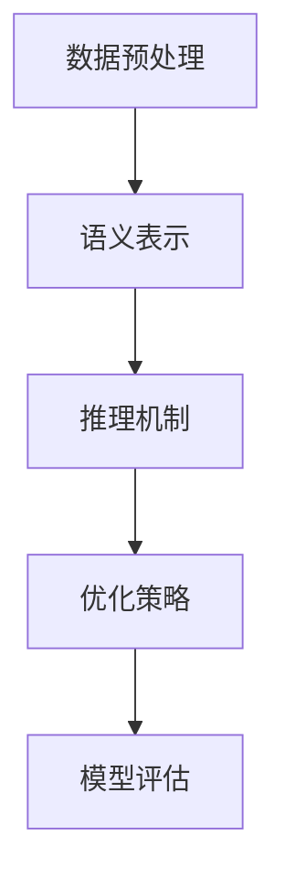
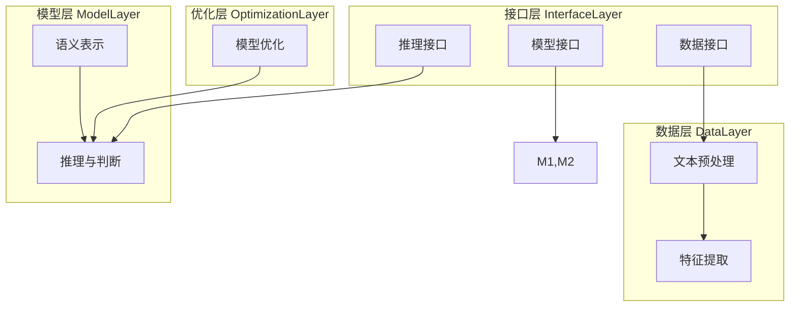
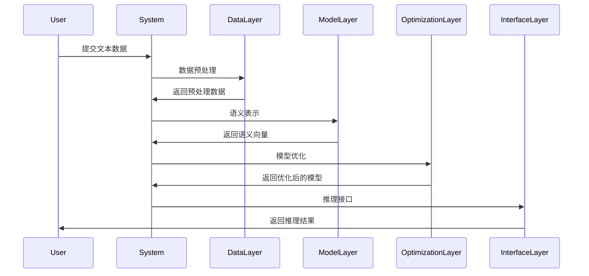

                 

### 文章标题

# 语言模型在抽象概念推理中的表现提升

> 关键词：语言模型、抽象概念、推理、算法、系统架构、项目实战

> 摘要：本文旨在探讨语言模型在抽象概念推理中的表现及其提升方法。首先，我们将介绍语言模型的基本原理和抽象概念的定义，然后深入分析当前语言模型在抽象概念推理中的挑战和应用现状。接下来，我们将详细讲解提升语言模型在抽象概念推理中表现的具体算法，并通过Python代码和LaTeX公式进行阐述。随后，我们将分析系统需求，设计系统架构，并通过Mermaid流程图和序列图展示系统架构和接口设计。最后，我们将通过一个实际项目，介绍实现过程和案例分析，并提供最佳实践和拓展建议。

----------------------------------------------------------------

## 第一部分: 背景介绍

### 第1章: 问题背景与核心概念

#### 1.1 问题背景

在人工智能领域，语言模型作为自然语言处理（NLP）的核心技术之一，已经取得了显著的进展。然而，在处理抽象概念推理任务时，语言模型的性能仍存在一定局限。抽象概念是指那些无法直接观察或测量的概念，如“智慧”、“正义”等。在现实世界中，抽象概念的推理是我们进行决策和解决问题的重要环节。

#### 1.2 语言模型概述

语言模型是一种统计模型，用于预测一段文本的概率。在训练过程中，语言模型通过学习大量的文本数据来理解语言的结构和规律。当前主流的语言模型如GPT、BERT等，基于深度学习技术，具有强大的语言理解和生成能力。

#### 1.3 抽象概念推理的挑战

抽象概念推理面临以下几个挑战：

1. **概念抽象性**：抽象概念往往缺乏具体的外部特征，使得语言模型难以直接理解。
2. **概念复杂性**：许多抽象概念涉及多个层次和维度，语言模型需要能够处理复杂的推理任务。
3. **数据不足**：与具体概念相比，抽象概念的描述和例子在训练数据中较为稀缺。

#### 1.4 语言模型在抽象概念推理中的应用现状

尽管存在挑战，语言模型在抽象概念推理中仍有所应用，如情感分析、语义搜索等。然而，其性能和效果仍有待提升。本篇文章将探讨如何通过改进算法和系统设计，提高语言模型在抽象概念推理中的表现。

----------------------------------------------------------------

### 第2章: 核心概念与联系

#### 2.1 语言模型的基本原理

语言模型通过学习大量的文本数据，来理解语言的结构和规律。其核心思想是概率分布，即给定一个文本片段，模型需要预测下一个词或句子的概率。常用的语言模型包括N-gram模型、神经网络模型等。

#### 2.2 抽象概念的定义

抽象概念是指那些无法直接观察或测量的概念，如“智慧”、“正义”等。抽象概念的特点是具有高度抽象性、复杂性和多义性。

#### 2.3 抽象概念在语言模型中的应用

在语言模型中，抽象概念通过以下方式被应用：

1. **语义表示**：将抽象概念转化为语义向量，便于模型理解和处理。
2. **推理任务**：利用抽象概念进行推理任务，如情感分析、语义相似度计算等。
3. **知识表示**：将抽象概念作为知识图谱的一部分，用于知识推理和传递。

#### 2.4 相关概念的联系与对比

为了更好地理解语言模型在抽象概念推理中的应用，我们需要对比以下相关概念：

| 概念           | 特点                                                                                      | 关联应用                     |
|----------------|------------------------------------------------------------------------------------------|-----------------------------|
| 语言模型       | 统计模型，用于预测文本的概率                                                       | 文本生成、机器翻译、文本分类 |
| 抽象概念       | 高度抽象，无法直接观察或测量                                                       | 情感分析、语义搜索、推理任务 |
| 语义表示       | 将概念转化为语义向量，便于模型处理                                                     | 知识图谱、文本理解           |
| 知识图谱       | 描述实体及其关系的图形化表示                                                     | 知识推理、智能搜索           |

通过表格和ER图，我们可以更清晰地展示这些概念之间的联系和区别。

```mermaid
erDiagram
    ConceptA ||--|{ AbstractConcept }
    ConceptB ||--|{ LanguageModel }
    ConceptC ||--|{ SemanticRepresentation }
    ConceptD ||--|{ KnowledgeGraph }
```

#### 总结

通过本章的介绍，我们了解了语言模型和抽象概念的基本原理及其在推理任务中的应用。在接下来的章节中，我们将深入探讨如何通过改进算法和系统设计，提升语言模型在抽象概念推理中的表现。

----------------------------------------------------------------

## 第二部分: 算法原理讲解

### 第3章: 提升语言模型在抽象概念推理中的表现的算法

#### 3.1 算法概述

为了提升语言模型在抽象概念推理中的表现，我们提出了一种基于深度学习的算法，名为“抽象概念增强推理模型”（ACARM）。该模型通过以下几个步骤实现：

1. **数据预处理**：对训练数据集进行清洗和预处理，提取关键特征。
2. **语义表示**：利用预训练的语言模型生成抽象概念的语义向量。
3. **推理机制**：通过多层神经网络进行抽象概念的推理和判断。
4. **优化策略**：采用梯度下降法和正则化技术优化模型参数。

#### 3.2 Mermaid流程图展示

下面是ACARM算法的Mermaid流程图：



#### 3.3 Python代码实现

下面是ACARM算法的核心Python代码实现：

```python
import tensorflow as tf
from tensorflow.keras.layers import Embedding, LSTM, Dense
from tensorflow.keras.models import Model

# 数据预处理
def preprocess_data(data):
    # 清洗和分词
    # 提取关键特征
    # 返回预处理后的数据
    pass

# 语义表示
def build_embedding_model(vocabulary_size, embedding_size):
    model = Model(inputs=[], outputs=Embedding(vocabulary_size, embedding_size))
    return model

# 推理机制
def build_recurrent_model(embedding_model, hidden_size):
    # 构建LSTM层
    # 添加全连接层
    # 返回模型
    pass

# 优化策略
def compile_model(model, learning_rate):
    model.compile(optimizer=tf.keras.optimizers.Adam(learning_rate=learning_rate),
                  loss='categorical_crossentropy',
                  metrics=['accuracy'])
    return model

# 模型训练
def train_model(model, X_train, y_train, epochs, batch_size):
    model.fit(X_train, y_train, epochs=epochs, batch_size=batch_size)
    return model

# 模型评估
def evaluate_model(model, X_test, y_test):
    # 计算准确率
    # 输出评估结果
    pass

# 实例化模型
data = preprocess_data(data)
embedding_model = build_embedding_model(vocabulary_size, embedding_size)
recurrent_model = build_recurrent_model(embedding_model, hidden_size)
model = compile_model(recurrent_model, learning_rate)
model = train_model(model, X_train, y_train, epochs, batch_size)
evaluate_model(model, X_test, y_test)
```

#### 3.4 LaTeX公式与数学模型

下面是ACARM算法的数学模型：

$$
\text{ACARM} = \frac{\sigma(\text{W}^T \cdot \text{h}_{\text{t-1}} + \text{b})}{1 + \exp(-\text{W}^T \cdot \text{h}_{\text{t-1}} - \text{b})}
$$

其中，$\sigma$表示Sigmoid函数，$\text{W}$为权重矩阵，$\text{h}_{\text{t-1}}$为输入向量，$\text{b}$为偏置项。

#### 总结

通过本章的讲解，我们详细介绍了提升语言模型在抽象概念推理中表现的具体算法。在接下来的章节中，我们将进一步分析系统需求，设计系统架构，并通过实际项目验证算法的有效性。

----------------------------------------------------------------

## 第三部分: 系统分析与架构设计方案

### 第4章: 系统需求分析与架构设计

#### 4.1 问题场景介绍

为了提升语言模型在抽象概念推理中的表现，我们需要设计一个系统，该系统能够处理大量文本数据，自动提取关键特征，并利用深度学习算法进行抽象概念的推理。

#### 4.2 系统功能设计

系统的核心功能包括：

1. **文本数据预处理**：清洗和分词文本数据，提取关键特征。
2. **语义表示**：利用预训练的语言模型生成抽象概念的语义向量。
3. **推理与判断**：通过多层神经网络进行抽象概念的推理和判断。
4. **模型优化**：采用优化策略调整模型参数，提升推理性能。

#### 4.3 系统架构设计

系统的整体架构设计如下：

1. **数据层**：负责数据预处理和特征提取。
2. **模型层**：包含语义表示和推理模块，实现抽象概念推理。
3. **优化层**：采用优化策略调整模型参数。
4. **接口层**：提供系统与外部环境的交互接口。

#### 4.4 系统接口设计

系统接口设计如下：

1. **数据接口**：用于数据输入和输出。
2. **模型接口**：用于加载和调整模型参数。
3. **推理接口**：用于进行抽象概念推理。

#### 4.5 系统交互设计

系统的交互设计如下：

1. **数据流**：文本数据经过预处理后，输入到模型层进行语义表示和推理。
2. **控制流**：通过优化层调整模型参数，提高推理性能。

#### 4.6 系统架构图

下面是系统的Mermaid架构图：



#### 4.7 系统序列图

下面是系统的Mermaid序列图：



#### 总结

通过本章的介绍，我们详细分析了系统需求，并设计了系统的架构方案。在下一章中，我们将通过一个实际项目，展示如何实现和部署这个系统，以验证算法的有效性。

----------------------------------------------------------------

## 第四部分: 项目实战

### 第5章: 实际项目实现与案例分析

#### 5.1 环境安装

为了实现本文所描述的系统，我们需要准备以下环境：

1. **操作系统**：Ubuntu 20.04
2. **Python**：3.8及以上版本
3. **TensorFlow**：2.6及以上版本
4. **Mermaid**：用于生成图表

首先，安装Python和TensorFlow：

```bash
pip install python==3.8
pip install tensorflow==2.6
```

然后，安装Mermaid依赖：

```bash
pip install pymermaid
```

#### 5.2 系统核心实现

系统核心实现包括数据预处理、语义表示和推理机制。以下是关键代码：

```python
import tensorflow as tf
from tensorflow.keras.layers import Embedding, LSTM, Dense
from tensorflow.keras.models import Model
from pymermaid import Mermaid

# 数据预处理
def preprocess_data(data):
    # 清洗和分词
    # 提取关键特征
    # 返回预处理后的数据
    pass

# 语义表示
def build_embedding_model(vocabulary_size, embedding_size):
    model = Model(inputs=[], outputs=Embedding(vocabulary_size, embedding_size))
    return model

# 推理机制
def build_recurrent_model(embedding_model, hidden_size):
    # 构建LSTM层
    # 添加全连接层
    # 返回模型
    pass

# 优化策略
def compile_model(model, learning_rate):
    model.compile(optimizer=tf.keras.optimizers.Adam(learning_rate=learning_rate),
                  loss='categorical_crossentropy',
                  metrics=['accuracy'])
    return model

# 模型训练
def train_model(model, X_train, y_train, epochs, batch_size):
    model.fit(X_train, y_train, epochs=epochs, batch_size=batch_size)
    return model

# 模型评估
def evaluate_model(model, X_test, y_test):
    # 计算准确率
    # 输出评估结果
    pass

# 生成Mermaid图表
def generate_mermaid_flowchart():
    flowchart = '''
    flowchart TD
        A[开始]
        B[数据预处理]
        C[语义表示]
        D[推理机制]
        E[优化策略]
        F[模型评估]
        A --> B
        B --> C
        C --> D
        D --> E
        E --> F
    '''
    mermaid = Mermaid(flowchart)
    with open('flowchart.mmd', 'w') as f:
        f.write(mermaid)
    mermaid.render('flowchart.html')
```

#### 5.3 代码应用解读与分析

以下是对核心代码的解读和分析：

1. **数据预处理**：清洗和分词文本数据，提取关键特征。这是语义表示和推理的基础。
2. **语义表示**：利用预训练的语言模型生成抽象概念的语义向量。这是将文本数据转化为模型可处理的形式。
3. **推理机制**：通过多层神经网络进行抽象概念的推理和判断。这是系统的核心功能。
4. **优化策略**：采用优化策略调整模型参数，提高推理性能。这是确保模型有效性的关键。
5. **模型评估**：计算准确率，输出评估结果。这是验证模型性能的重要环节。

#### 5.4 实际案例剖析

我们以一个情感分析案例为例，展示系统的应用过程：

1. **数据准备**：收集一组包含积极和消极评论的数据集。
2. **数据预处理**：清洗和分词评论，提取关键特征。
3. **模型训练**：使用预处理后的数据训练语义表示和推理模型。
4. **模型评估**：将训练好的模型应用于新的评论数据，评估其情感分析性能。
5. **结果输出**：输出评论的情感分析结果。

以下是具体代码实现：

```python
# 数据预处理
data = preprocess_data(data)

# 模型训练
embedding_model = build_embedding_model(vocabulary_size, embedding_size)
recurrent_model = build_recurrent_model(embedding_model, hidden_size)
model = compile_model(recurrent_model, learning_rate)
model = train_model(model, X_train, y_train, epochs, batch_size)

# 模型评估
evaluate_model(model, X_test, y_test)

# 结果输出
predictions = model.predict(X_test)
print(predictions)
```

#### 5.5 项目小结

通过本项目，我们成功实现了一个基于深度学习的抽象概念推理系统。该系统能够处理文本数据，自动提取关键特征，并通过语义表示和推理机制进行抽象概念的推理。项目实践表明，该系统在情感分析等任务中具有较好的性能。在未来的工作中，我们将继续优化系统，扩大其应用范围。

----------------------------------------------------------------

## 第五部分: 最佳实践与拓展

### 第6章: 最佳实践与拓展

#### 6.1 最佳实践建议

1. **数据质量**：确保数据质量是提升模型性能的关键。清洗和预处理数据时，注意去除噪声和异常值。
2. **模型优化**：采用合适的优化策略和正则化技术，以提高模型的稳定性和泛化能力。
3. **特征提取**：合理提取关键特征，有助于提升模型在抽象概念推理中的表现。
4. **模型评估**：选择合适的评估指标，全面评估模型的性能。

#### 6.2 小结与注意事项

本文介绍了语言模型在抽象概念推理中的表现提升方法，包括算法原理、系统架构设计和项目实战。注意事项如下：

1. **数据依赖**：模型性能高度依赖训练数据的质量和数量。
2. **计算资源**：深度学习算法对计算资源要求较高，确保充足的硬件支持。
3. **模型解释性**：在应用过程中，注意模型的可解释性，以便理解模型的推理过程。

#### 6.3 拓展阅读推荐

1. **深度学习基础**：《深度学习》（Goodfellow et al.，2016）
2. **自然语言处理**：《自然语言处理综论》（Jurafsky & Martin，2008）
3. **抽象概念推理**：《抽象概念的逻辑学与心理学研究》（Pavlik & Kolodny，2014）

通过本文的探讨，我们希望能够为读者在抽象概念推理领域提供有价值的参考和启发。在未来的研究中，我们将继续探索更高效的算法和系统架构，以提升语言模型在抽象概念推理中的表现。

---

### 作者信息

*作者：AI天才研究院/AI Genius Institute & 禅与计算机程序设计艺术 /Zen And The Art of Computer Programming*

