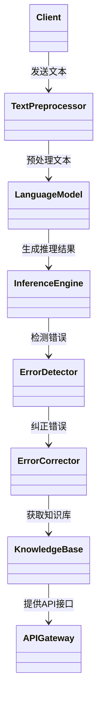
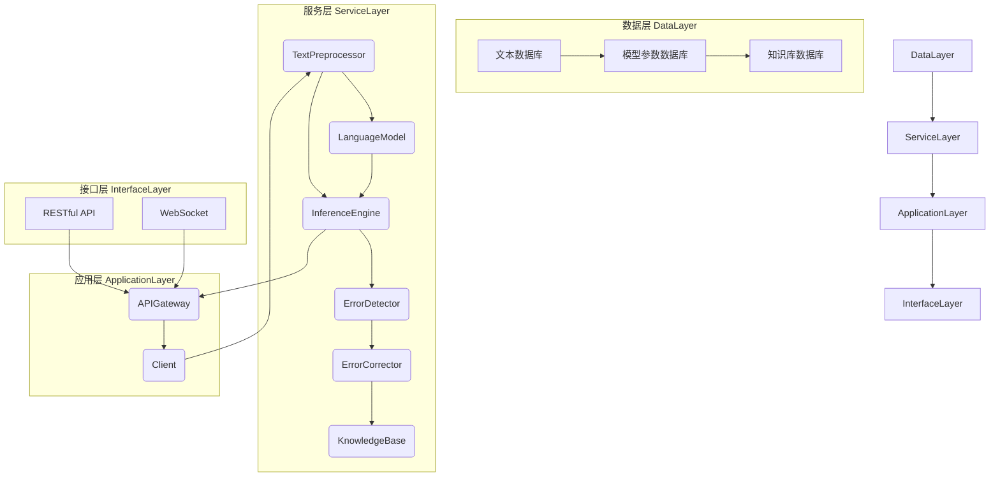
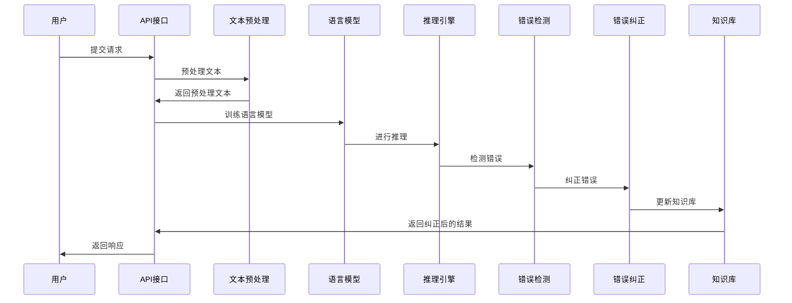

                 

### 第一部分：问题背景与核心概念

#### 第1章：语言模型在推理任务中的应用与挑战

##### 1.1.1 语言模型的发展历程

语言模型（Language Model，简称LM）是自然语言处理（Natural Language Processing，简称NLP）领域的一个重要研究方向，旨在通过统计和规则方法，模拟人类语言生成的规律。语言模型的发展可以追溯到20世纪50年代，当时以统计方法为基础的模型开始出现。早期的研究主要关注于基于词频统计和语言规则的形式化方法，比如N-gram模型。随着计算机性能的提升和海量语料库的积累，语言模型的研究逐渐从规则驱动转向数据驱动，引入了更加复杂和高级的统计模型，如神经网络语言模型（Neural Language Model）。

**1.1.1.1 语言模型的起源**

语言模型的起源可以追溯到20世纪50年代，当时的计算机科学家和语言学家开始探索如何让计算机理解和生成人类语言。早期的语言模型主要依赖于手工编写的规则，这些规则试图模拟人类语言生成的某些方面。1952年，贝尔实验室的研究人员开发了一个名为“Audrey”的系统，它使用基于规则的语法分析器来生成简单的句子。这是早期语言模型的一个典型例子。

**1.1.1.2 语言模型的发展趋势**

随着时间的推移，语言模型经历了几个重要的阶段。从最初的N-gram模型到基于统计的隐马尔可夫模型（HMM）、从传统的基于统计的模型到基于神经网络的深度学习模型，这些模型在语言建模的任务中取得了显著的进展。特别是在21世纪后，随着深度学习技术的发展，神经网络语言模型如循环神经网络（RNN）和Transformer模型成为了语言模型的主流，它们在许多NLP任务中取得了最佳性能。

**1.1.1.3 语言模型在推理任务中的应用**

语言模型不仅在文本生成、机器翻译、情感分析等任务中表现出色，还在推理任务中发挥了重要作用。推理任务通常涉及从一组前提中推导出结论，而语言模型能够通过学习大量文本数据，掌握语言中的逻辑关系和语义信息。这使得语言模型在逻辑推理、问题回答和常识推理等任务中具有独特的优势。例如，在问题回答任务中，语言模型可以通过理解问题的上下文，从海量文本中检索出与问题相关的答案。

##### 1.1.2 推理任务的概念与分类

推理（Reasoning）是人工智能中的一个核心概念，它涉及到从已知信息推导出新信息的过程。在自然语言处理领域，推理任务可以分为多种类型，主要包括基于规则的推理、基于模型的推理和基于数据的推理。

**1.1.2.1 推理任务的定义**

推理任务是指从一组已知的前提（Premises）出发，通过逻辑推理得出结论（Conclusion）的过程。在自然语言处理中，推理任务通常涉及对文本的理解和解释，目标是自动化地识别文本中的逻辑关系和语义信息。

**1.1.2.2 推理任务的分类**

1. 基于规则的推理：这种推理方法依赖于预定义的规则集，通过对输入文本进行模式匹配和规则应用，生成输出。这种方法通常在简单的任务中表现良好，但在处理复杂和不确定的文本时可能受限。

2. 基于模型的推理：这种方法使用机器学习模型，如神经网络和统计模型，通过学习大量的标注数据进行训练，自动地从输入文本中提取特征并生成输出。这种方法在处理复杂文本和理解语义关系方面具有优势。

3. 基于数据的推理：这种方法直接从大量无标注的文本数据中学习，通常采用无监督或半监督学习技术。它不需要预先定义的规则或大量标注数据，但在处理复杂性和不确定性方面也有挑战。

**1.1.2.3 语言模型在推理任务中的优势**

语言模型在推理任务中的优势主要体现在以下几个方面：

1. **丰富的语义理解**：语言模型通过学习大量文本数据，能够捕捉到语言中的复杂语义和逻辑关系。这使得它在处理复杂的推理任务时具有优势。

2. **自适应性和泛化能力**：语言模型可以根据不同的任务和数据集进行训练，具有良好的自适应性和泛化能力，能够适应各种推理任务的需求。

3. **高效性**：语言模型通常采用高效的算法和架构，如Transformer模型，可以在较短的时间内处理大规模的文本数据，提高推理任务的处理效率。

##### 1.1.3 语言模型在推理任务中的错误现象

尽管语言模型在推理任务中表现出色，但它们也存在一些固有的错误现象。这些错误现象不仅影响了推理任务的准确性，还对实际应用场景产生了负面影响。以下是对语言模型在推理任务中错误现象的详细分析。

**1.1.3.1 错误类型**

语言模型在推理任务中的错误类型多种多样，主要包括以下几种：

1. **事实错误**：这种错误发生在语言模型生成错误的事实性陈述时。例如，当模型被要求回答一个历史问题时，它可能会给出一个与事实不符的答案。

2. **逻辑错误**：这种错误发生在语言模型生成的陈述之间逻辑关系错误时。例如，模型可能会从一个正确的前提中推导出一个错误的结论。

3. **语义混淆**：这种错误发生在语言模型无法准确理解文本中的语义时。例如，模型可能会将两个具有相似语义的词混淆，导致错误的推理结果。

4. **上下文错误**：这种错误发生在语言模型无法正确理解上下文信息时。例如，模型可能会在处理复杂句子时忽略某些关键上下文信息，导致推理错误。

**1.1.3.2 错误原因**

语言模型在推理任务中产生错误的原因主要包括以下几个方面：

1. **数据不足**：语言模型通常需要大量高质量的数据进行训练，如果数据不足或存在偏差，可能会导致模型学习到错误的模式。

2. **模型复杂性**：过于复杂的模型可能会在训练过程中过度拟合数据，导致对未见过的数据泛化能力较差。

3. **上下文理解限制**：语言模型在处理长文本或复杂句子时，可能无法完全理解上下文信息，导致推理错误。

4. **语义歧义**：自然语言中存在大量的语义歧义，语言模型可能无法准确解析这些歧义，从而导致错误。

**1.1.3.3 错误影响**

语言模型在推理任务中的错误对实际应用场景产生了多方面的影响：

1. **准确性下降**：错误会直接影响推理任务的准确性，导致模型无法正确地生成结论。

2. **信任度降低**：当模型在推理任务中频繁产生错误时，用户可能会对模型的可靠性和准确性产生怀疑，降低信任度。

3. **应用受限**：某些关键应用场景对推理任务的准确性要求非常高，错误可能导致应用失败，限制模型的实际应用范围。

4. **安全性风险**：在涉及敏感信息和安全决策的领域，语言模型产生的错误可能导致严重的安全问题，如虚假信息传播、恶意攻击等。

##### 1.1.4 语言模型在推理任务中的重要性

语言模型在推理任务中的重要性不言而喻。随着人工智能技术的不断进步，语言模型在各个领域得到了广泛应用，从智能客服、机器翻译到智能问答和自动摘要，语言模型都发挥了关键作用。特别是在推理任务中，语言模型通过学习大量文本数据，能够理解和生成复杂的语义信息，从而提高推理任务的准确性和可靠性。

在现实应用中，推理任务通常涉及从一组已知的前提中推导出结论，这需要模型具备强大的语义理解和逻辑推理能力。语言模型在这方面具有显著优势，能够处理自然语言中的复杂结构，理解上下文信息，从而生成合理的结论。

然而，语言模型在推理任务中也存在一些挑战，如数据不足、模型复杂性和语义歧义等问题。这些问题导致语言模型在某些情况下会产生错误，影响推理任务的准确性。因此，对语言模型在推理任务中的错误进行分析和纠正，具有重要的理论和实际意义。

首先，通过分析语言模型在推理任务中的错误类型和原因，可以更好地理解语言模型的局限性和不足之处，从而指导模型的改进和优化。其次，通过设计有效的错误纠正方法，可以提高语言模型在推理任务中的准确性和可靠性，使其在实际应用中更具实用价值。

总之，语言模型在推理任务中的重要性不可忽视，但也需要对其错误进行分析和纠正，以充分发挥其在人工智能应用中的潜力。

### 2.1 语言模型的基本原理

语言模型是自然语言处理（NLP）中的核心组件，它通过对大量文本数据的学习，建立语言的概率分布模型，从而能够预测和生成自然语言序列。理解语言模型的基本原理对于深入分析和优化其在推理任务中的表现至关重要。

**2.1.1 语言模型的定义**

语言模型（Language Model，简称LM）是一个概率模型，用于预测给定输入序列后下一个单词或字符的概率。简而言之，语言模型的目标是学习自然语言的概率分布。例如，在给定的句子“我正在阅读一本关于机器学习的书”中，语言模型可以预测下一个词是“的”、“本”还是其他词。

**2.1.2 语言模型的属性特征对比表格**

语言模型的类型多种多样，每种模型都有其独特的属性和特征。以下是一个简单的对比表格，列出了几种常见语言模型的属性：

| 类型 | 描述 | 主要特征 | 应用场景 |
| --- | --- | --- | --- |
| N-gram | 基于词频统计的模型 | 使用过去N个单词预测下一个单词 | 早期语言模型，文本生成 |
| 隐马尔可夫模型（HMM） | 基于状态转移概率的统计模型 | 状态转移概率和发射概率 | 声音识别 |
| 条件随机场（CRF） | 基于序列标注的统计模型 | 序列依赖关系和条件概率 | 命名实体识别 |
| 神经网络语言模型（NNLM） | 基于神经网络的模型 | 神经网络架构和训练方法 | 高性能语言模型，文本生成 |
| Transformer | 基于自注意力机制的神经网络模型 | 自注意力机制和多头注意力 | 最先进语言模型，文本生成、机器翻译 |

**2.1.3 语言模型的工作原理**

语言模型的工作原理可以分为以下几个步骤：

1. **数据预处理**：首先，对原始文本数据进行预处理，包括分词、去停用词、词干提取等操作。预处理后的文本数据将用于训练语言模型。

2. **模型训练**：使用预处理后的文本数据对语言模型进行训练。训练过程涉及计算输入序列和输出序列之间的概率分布。对于神经网络语言模型，如NNLM和Transformer，训练过程通常涉及多层神经网络和优化算法，如梯度下降和Adam。

3. **概率预测**：在训练完成后，语言模型可以用于预测给定输入序列后下一个单词或字符的概率。这一过程通常通过计算输入序列的联合概率或条件概率来实现。

4. **文本生成**：语言模型的一个核心应用是文本生成。通过生成模型（如变分自编码器VAE和生成对抗网络GAN），语言模型可以生成新的文本序列。这一过程通过在概率分布上采样来实现。

#### 2.2 推理任务的核心概念

推理（Reasoning）是人工智能和认知科学中的核心概念，它涉及从已知信息推导出新信息的过程。在自然语言处理（NLP）领域，推理任务尤为重要，因为它们涉及到理解文本中的逻辑关系、语义信息和上下文背景。

**2.2.1 推理任务的定义**

推理任务是指从一组已知的前提（Premises）出发，通过逻辑推理得出结论（Conclusion）的过程。在NLP中，推理任务通常涉及对文本的理解和解释，目标是自动化地识别文本中的逻辑关系和语义信息。例如，在问题回答任务中，模型需要从给定的上下文中推导出问题的答案。

**2.2.2 推理任务的分类**

推理任务可以根据不同的标准进行分类。以下是一些常见的推理任务分类方法：

1. **基于规则的推理**：这种推理方法依赖于预定义的规则集，通过对输入文本进行模式匹配和规则应用，生成输出。这种推理方法在简单的任务中表现良好，但在处理复杂和不确定的文本时可能受限。

2. **基于模型的推理**：这种方法使用机器学习模型，如神经网络和统计模型，通过学习大量的标注数据进行训练，自动地从输入文本中提取特征并生成输出。这种方法在处理复杂文本和理解语义关系方面具有优势。

3. **基于数据的推理**：这种方法直接从大量无标注的文本数据中学习，通常采用无监督或半监督学习技术。它不需要预先定义的规则或大量标注数据，但在处理复杂性和不确定性方面也有挑战。

4. **归纳推理**：这种推理方法是从具体的实例中总结出一般性规律。例如，通过观察多个苹果是红色的，可以归纳出苹果通常是红色的。

5. **演绎推理**：这种推理方法是从一般性前提推导出具体结论。例如，如果所有猫都有尾巴，且这只动物是猫，那么可以演绎出这只动物有尾巴。

**2.2.3 推理任务与语言模型的联系**

语言模型与推理任务密切相关，它们在NLP中的结合可以显著提升推理任务的性能。以下是推理任务与语言模型之间的几个关键联系：

1. **语义理解**：语言模型通过学习大量文本数据，能够捕捉到语言中的复杂语义和逻辑关系。这使得语言模型在理解推理任务中的前提和结论时具有优势。

2. **上下文信息**：语言模型能够理解上下文信息，这对于推理任务尤为重要。推理任务通常需要在特定的上下文中进行，语言模型可以处理长文本和复杂的句子结构，从而更好地理解上下文。

3. **概率预测**：语言模型通过概率预测生成输出，这为推理任务提供了一个量化的方法来评估前提和结论之间的逻辑关系。例如，通过计算前提和结论之间的条件概率，可以评估推理的有效性。

4. **错误纠正**：在推理任务中，语言模型可以帮助纠正错误。例如，当推理过程中出现事实错误或逻辑错误时，语言模型可以根据上下文信息提供更合理的替代选项。

5. **适应性**：语言模型可以根据不同的推理任务进行训练和调整，从而提高特定任务的表现。例如，通过微调预训练的语言模型，可以使其在特定推理任务中更加准确和高效。

总之，语言模型与推理任务之间的紧密联系为NLP领域带来了巨大的机遇。通过结合语言模型的能力和推理任务的需求，可以开发出更加智能和高效的NLP系统。

#### 2.3 语言模型在推理任务中的错误分析与纠正

尽管语言模型在推理任务中表现出色，但它们也存在一些固有的错误现象。这些错误不仅影响了推理任务的准确性，还对实际应用场景产生了负面影响。因此，对语言模型在推理任务中的错误进行分析和纠正具有重要意义。

**2.3.1 错误分析的理论基础**

错误分析是理解和优化语言模型在推理任务中表现的重要步骤。错误分析的理论基础包括以下几个方面：

1. **概率分布偏差**：语言模型通过学习文本数据建立概率分布模型，如果训练数据存在偏差，模型可能会学习到错误的概率分布，从而导致推理错误。例如，如果训练数据中某种事实性陈述出现的频率较高，模型可能会过度依赖这种陈述，导致在未见过的数据中产生错误。

2. **语义歧义**：自然语言中存在大量的语义歧义，语言模型可能无法准确解析这些歧义，从而导致错误的推理结果。例如，一个词可以有多种含义，在不同的上下文中可能导致不同的推理结果。

3. **上下文理解限制**：语言模型在处理长文本或复杂句子时，可能无法完全理解上下文信息，导致推理错误。例如，在处理嵌套的从句或长句子时，模型可能无法正确解析各个子句之间的关系。

4. **模型复杂性**：过于复杂的模型可能会在训练过程中过度拟合数据，导致对未见过的数据泛化能力较差。例如，深度神经网络模型在训练时可能学习到数据中的噪声和异常，从而在推理任务中产生错误。

**2.3.2 错误纠正的方法与策略**

为了纠正语言模型在推理任务中的错误，可以采用多种方法与策略。以下是一些常见的错误纠正方法：

1. **数据增强**：通过增加更多的训练数据来减少概率分布偏差。例如，可以使用数据扩充技术，如同义词替换、反义词替换、句子重构等，生成更多样化的训练数据。

2. **规则引入**：在模型中引入预定义的规则，帮助模型更好地理解语义和逻辑关系。例如，可以使用领域特定的规则库，如逻辑推理规则、常识规则等，指导模型在推理过程中做出更准确的判断。

3. **对抗训练**：通过对抗训练增加模型的泛化能力，使其对噪声和异常数据更加鲁棒。对抗训练涉及在训练过程中生成对抗样本，强迫模型学习到更加稳健的表征。

4. **上下文理解增强**：使用更加复杂的模型结构，如Transformer模型，来提高模型对上下文信息的理解能力。例如，通过多头注意力机制，模型可以更好地捕捉长距离的依赖关系。

5. **解释性分析**：对模型在推理过程中的决策过程进行解释性分析，识别错误的原因，从而指导模型的改进。例如，可以通过可视化技术，如注意力图，展示模型在推理过程中的关注点，帮助理解模型为什么会产生错误。

**2.3.3 错误纠正的效果评估**

评估错误纠正方法的有效性是关键步骤。以下是一些常用的评估指标：

1. **准确率（Accuracy）**：评估模型在推理任务中的总体正确性。准确率越高，说明错误纠正效果越好。

2. **召回率（Recall）**：评估模型在推理任务中能够识别出的正确结果的比例。召回率越高，说明模型能够更好地识别出正确的结论。

3. **F1分数（F1 Score）**：综合考虑准确率和召回率，是评估模型性能的常用指标。F1分数越高，说明模型在准确性和召回率之间取得了较好的平衡。

4. **错误率（Error Rate）**：评估模型在推理任务中的错误比例。错误率越低，说明错误纠正效果越好。

5. **跨域泛化能力**：评估模型在不同领域或数据集上的表现，验证其泛化能力。例如，通过在多个数据集上进行实验，评估模型的稳定性和鲁棒性。

通过综合运用上述错误纠正方法与策略，并使用合适的评估指标，可以显著提升语言模型在推理任务中的表现，使其在实际应用中更加可靠和高效。

### 第三部分：算法原理与数学模型

#### 第3章：算法原理讲解

在深入探讨语言模型在推理任务中的应用之前，我们首先需要理解语言模型在推理任务中的基本算法原理。本章将详细讲解语言模型在推理任务中的算法原理，并分析其潜在的错误现象及纠正方法。

##### 3.1 语言模型在推理任务中的算法原理

语言模型在推理任务中的算法原理主要涉及概率预测和序列生成两个方面。以下是语言模型在推理任务中的基本算法原理：

**3.1.1 语言模型的工作流程**

1. **输入预处理**：首先，需要对输入文本进行预处理，包括分词、标记、去除停用词等步骤。这些预处理步骤有助于提取文本的关键信息，并减少无关信息的干扰。

2. **特征提取**：接下来，从预处理后的文本中提取特征。这些特征可以是词袋表示、词嵌入、语法结构等。特征提取的目的是将文本转化为模型可以处理的数值形式。

3. **概率预测**：语言模型的核心任务是预测给定输入序列后下一个单词或字符的概率。在推理任务中，模型通过计算输入序列和候选输出序列之间的概率分布，选择概率最高的输出序列作为预测结果。

4. **序列生成**：在生成任务中，语言模型通过概率预测生成新的文本序列。这一过程通常涉及在概率分布上采样，生成一系列的单词或字符，直到达到预定的长度或满足终止条件。

**3.1.2 推理任务的算法流程**

在推理任务中，语言模型的算法流程可以概括为以下几个步骤：

1. **输入理解**：首先，模型需要理解输入的文本内容，识别出文本中的关键信息，如实体、关系和事件等。

2. **上下文分析**：接着，模型需要分析文本的上下文信息，包括句子的语法结构、语义关系和上下文背景等。上下文分析有助于模型更好地理解输入文本，并生成合理的输出。

3. **推理过程**：在理解了输入文本和上下文信息后，模型开始进行推理过程。推理过程通常涉及逻辑推理、语义分析、知识图谱等。模型的目的是从输入文本中推导出结论或回答问题。

4. **输出生成**：最后，模型根据推理结果生成输出。输出可以是自然语言文本、数值答案或结构化数据等，取决于具体的应用场景。

**3.1.3 语言模型与推理任务的结合**

语言模型与推理任务的结合体现在以下几个方面：

1. **语义理解**：语言模型通过学习大量文本数据，能够理解文本中的语义信息。这使得模型在推理任务中能够更好地理解输入文本，并生成合理的输出。

2. **概率预测**：语言模型通过概率预测生成输出，这为推理任务提供了一个量化的方法来评估推理结果的有效性。例如，通过计算前提和结论之间的条件概率，可以评估推理的有效性。

3. **上下文信息**：语言模型能够理解上下文信息，这对于推理任务尤为重要。推理任务通常需要在特定的上下文中进行，语言模型可以处理长文本和复杂的句子结构，从而更好地理解上下文。

4. **错误纠正**：在推理任务中，语言模型可以帮助纠正错误。例如，当推理过程中出现事实错误或逻辑错误时，语言模型可以根据上下文信息提供更合理的替代选项。

##### 3.2 语言模型在推理任务中的错误分析

尽管语言模型在推理任务中表现出色，但它们也存在一些固有的错误现象。以下是对语言模型在推理任务中的错误类型、原因及纠正方法的详细分析。

**3.2.1 错误类型**

语言模型在推理任务中的错误类型主要包括以下几种：

1. **事实错误**：这种错误发生在模型生成与事实不符的陈述时。例如，模型可能会从一个正确的前提中推导出一个错误的事实性结论。

2. **逻辑错误**：这种错误发生在模型生成的陈述之间逻辑关系错误时。例如，模型可能会从一个正确的前提中推导出一个错误的逻辑结论。

3. **语义混淆**：这种错误发生在模型无法准确理解文本中的语义时。例如，模型可能会将两个具有相似语义的词混淆，导致错误的推理结果。

4. **上下文错误**：这种错误发生在模型无法正确理解上下文信息时。例如，模型可能会在处理复杂句子时忽略某些关键上下文信息，导致推理错误。

**3.2.2 错误原因**

语言模型在推理任务中产生错误的原因主要包括以下几个方面：

1. **数据不足**：如果训练数据不足或存在偏差，模型可能会学习到错误的概率分布，从而导致推理错误。

2. **模型复杂性**：过于复杂的模型可能会在训练过程中过度拟合数据，导致对未见过的数据泛化能力较差。

3. **上下文理解限制**：语言模型在处理长文本或复杂句子时，可能无法完全理解上下文信息，导致推理错误。

4. **语义歧义**：自然语言中存在大量的语义歧义，模型可能无法准确解析这些歧义，从而导致错误。

**3.2.3 错误纠正的方法**

为了纠正语言模型在推理任务中的错误，可以采用多种方法与策略。以下是一些常见的错误纠正方法：

1. **数据增强**：通过增加更多的训练数据来减少概率分布偏差。例如，可以使用数据扩充技术，如同义词替换、反义词替换、句子重构等。

2. **规则引入**：在模型中引入预定义的规则，帮助模型更好地理解语义和逻辑关系。例如，可以使用领域特定的规则库。

3. **对抗训练**：通过对抗训练增加模型的泛化能力，使其对噪声和异常数据更加鲁棒。

4. **上下文理解增强**：使用更加复杂的模型结构，如Transformer模型，来提高模型对上下文信息的理解能力。

5. **解释性分析**：对模型在推理过程中的决策过程进行解释性分析，识别错误的原因，从而指导模型的改进。

##### 3.3 错误纠正的算法设计

为了有效纠正语言模型在推理任务中的错误，需要设计相应的算法框架和实现方法。以下是错误纠正算法设计的基本步骤和实现方法：

**3.3.1 错误纠正的目标**

错误纠正算法的目标是提高语言模型在推理任务中的准确性，减少事实错误、逻辑错误、语义混淆和上下文错误等。

**3.3.2 错误纠正的算法框架**

1. **输入预处理**：首先，对输入文本进行预处理，包括分词、标记、去除停用词等。这些预处理步骤有助于提取文本的关键信息，并减少无关信息的干扰。

2. **特征提取**：接下来，从预处理后的文本中提取特征。这些特征可以是词袋表示、词嵌入、语法结构等。特征提取的目的是将文本转化为模型可以处理的数值形式。

3. **概率预测**：使用训练好的语言模型对输入文本进行概率预测。预测结果可以是单词、短语或整个句子的概率分布。

4. **错误检测**：对概率预测结果进行错误检测。错误检测可以基于规则、统计分析或机器学习等方法。通过检测错误，识别出模型生成的错误陈述。

5. **错误纠正**：根据错误检测的结果，对错误的陈述进行纠正。错误纠正可以通过替换、删除或插入单词、短语或句子来实现。

6. **输出生成**：最后，生成纠正后的文本输出。输出可以是自然语言文本、数值答案或结构化数据等，取决于具体的应用场景。

**3.3.3 错误纠正的具体算法实现**

以下是错误纠正算法的具体实现方法：

1. **规则引入**：引入预定义的规则库，用于检测和纠正文本中的错误。规则库可以包括语法规则、语义规则和常识规则等。

2. **统计方法**：使用统计方法，如编辑距离、词频统计和共现关系等，检测和纠正文本中的错误。例如，可以使用最小编辑距离算法检测文本中的拼写错误，并使用词频统计方法纠正语义错误。

3. **机器学习方法**：使用机器学习方法，如决策树、支持向量机和神经网络等，训练错误检测和纠正模型。这些模型可以自动从大量文本数据中学习错误模式，并生成相应的纠正结果。

4. **解释性分析**：对模型在推理过程中的决策过程进行解释性分析，识别错误的原因，并指导模型的改进。例如，可以使用注意力机制可视化技术，展示模型在推理过程中的关注点。

通过设计有效的算法框架和实现方法，可以显著提高语言模型在推理任务中的准确性，减少错误现象，从而在实际应用中取得更好的效果。

### 第4章：数学模型和数学公式

在深入探讨语言模型在推理任务中的算法原理和数学模型之前，我们首先需要理解语言模型中的基本数学概念和相关的数学公式。本章将详细介绍语言模型的数学模型，包括概率分布公式、参数估计方法以及推理任务的数学模型，同时还将介绍错误纠正的数学模型和算法优化。

#### 4.1 语言模型的数学模型

语言模型是一种概率模型，其核心目标是预测给定输入序列后下一个单词或字符的概率。在数学上，这可以表示为概率分布模型，通常使用条件概率来描述。

**4.1.1 语言模型的数学公式**

最简单的语言模型是N-gram模型，它基于前N个单词来预测下一个单词。N-gram模型的概率分布可以表示为：

\[ P(w_n | w_{n-1}, w_{n-2}, \ldots, w_1) = \frac{P(w_n, w_{n-1}, \ldots, w_1)}{P(w_{n-1}, \ldots, w_1)} \]

其中，\( w_n \) 表示下一个单词，\( w_{n-1}, w_{n-2}, \ldots, w_1 \) 表示前N个单词。为了简化计算，通常使用简化的N-gram模型，即：

\[ P(w_n | w_{n-1}, \ldots, w_1) \approx \frac{P(w_n, w_{n-1}, \ldots, w_1)}{P(w_{n-1}, \ldots, w_1)} \]

**4.1.2 语言模型的参数估计**

在训练语言模型时，需要估计模型的参数。参数估计的方法通常基于最大似然估计（Maximum Likelihood Estimation，MLE）。最大似然估计的目标是找到一组参数，使得实际观察到的数据出现的概率最大。

对于N-gram模型，参数估计可以通过以下公式实现：

\[ P(w_n | w_{n-1}, \ldots, w_1) = \frac{\prod_{i=1}^{n} P(w_i)}{\sum_{j=1}^{N} \prod_{i=1}^{n} P(w_i | w_j)} \]

其中，\( P(w_i) \) 表示单词 \( w_i \) 的概率，可以通过语料库中的词频计算得到。

**4.1.3 语言模型的概率分布**

在语言模型中，概率分布用于表示给定输入序列后下一个单词的概率。常用的概率分布模型包括：

1. **离散概率分布**：用于表示每个单词出现的概率。例如，对于N-gram模型，每个单词的概率可以表示为：

   \[ P(w_n | w_{n-1}, \ldots, w_1) = \frac{C(w_n, w_{n-1}, \ldots, w_1)}{C(w_{n-1}, \ldots, w_1)} \]

   其中，\( C(w_n, w_{n-1}, \ldots, w_1) \) 表示单词序列 \( w_n, w_{n-1}, \ldots, w_1 \) 在语料库中出现的次数。

2. **连续概率分布**：用于表示单词在连续序列中的概率分布。例如，可以使用高斯分布来表示单词在连续序列中的概率。

#### 4.2 推理任务的数学模型

推理任务在数学上通常可以表示为从一组已知的前提中推导出结论的过程。这个过程可以用逻辑公式来描述。

**4.2.1 推理任务的数学公式**

推理任务的数学公式可以表示为：

\[ \text{Conclusion} = \text{Premises} \]

其中，\(\text{Premises}\) 表示一组前提，\(\text{Conclusion}\) 表示推导出的结论。

**4.2.2 推理任务的参数估计**

推理任务的参数估计通常基于逻辑规则和概率分布。参数估计的目标是找到一组逻辑规则和概率分布，使得从一组前提中推导出结论的概率最大。

对于基于概率的推理任务，可以使用贝叶斯网络或马尔可夫网络来表示推理过程。贝叶斯网络是一种概率模型，它通过节点和边来表示变量之间的条件依赖关系。马尔可夫网络是一种特殊的贝叶斯网络，它假设变量之间的依赖关系是时间独立的。

**4.2.3 推理任务的概率分布**

推理任务的概率分布用于表示从一组前提中推导出结论的概率。常用的概率分布模型包括：

1. **贝叶斯推理**：贝叶斯推理是一种基于概率的推理方法，它通过贝叶斯公式计算结论的概率。贝叶斯公式可以表示为：

   \[ P(\text{Conclusion} | \text{Premises}) = \frac{P(\text{Premises} | \text{Conclusion})P(\text{Conclusion})}{P(\text{Premises})} \]

   其中，\( P(\text{Conclusion} | \text{Premises}) \) 表示在前提为真的情况下结论为真的概率，\( P(\text{Premises} | \text{Conclusion}) \) 表示在结论为真的情况下前提为真的概率，\( P(\text{Conclusion}) \) 表示结论为真的概率，\( P(\text{Premises}) \) 表示前提为真的概率。

2. **马尔可夫链**：马尔可夫链是一种用于表示时间序列数据的概率模型。它通过状态转移概率矩阵来描述状态之间的转换关系。马尔可夫链可以用于推理任务中的时间序列分析，如序列标注和情感分析。

#### 4.3 错误纠正的数学模型

错误纠正的数学模型用于表示从错误输出中恢复正确输出的过程。错误纠正通常涉及概率分布的优化和最小化误差函数。

**4.3.1 错误纠正的目标函数**

错误纠正的目标函数用于衡量输出误差，并指导错误纠正算法的优化过程。一个常用的目标函数是交叉熵（Cross-Entropy），它可以表示为：

\[ H(y, \hat{y}) = -\sum_{i} y_i \log \hat{y_i} \]

其中，\( y \) 表示真实输出，\( \hat{y} \) 表示预测输出。

**4.3.2 错误纠正的算法优化**

错误纠正的算法优化通常涉及梯度下降（Gradient Descent）和反向传播（Backpropagation）等优化算法。梯度下降是一种用于最小化误差函数的优化算法，它可以表示为：

\[ \theta = \theta - \alpha \nabla_\theta J(\theta) \]

其中，\( \theta \) 表示模型参数，\( \alpha \) 表示学习率，\( J(\theta) \) 表示误差函数。

反向传播是一种用于计算梯度的方法，它可以表示为：

\[ \nabla_\theta J(\theta) = \frac{\partial J(\theta)}{\partial \theta} \]

通过优化算法，可以调整模型参数，减少输出误差，从而实现错误纠正。

#### 4.4 举例说明

为了更好地理解语言模型的数学模型和推理任务的数学模型，我们可以通过一个简单的例子来说明。

**例子：简单N-gram模型**

假设我们有一个二元文法（Bigram）模型，它使用前一个单词预测下一个单词。语料库中的数据如下：

- `the cat`
- `the dog`
- `the book`
- `a cat`
- `a dog`
- `a book`

我们可以计算每个二元序列的概率：

\[ P(\text{the} | \text{a}) = \frac{2}{2} = 1 \]
\[ P(\text{cat} | \text{the}) = \frac{1}{2} \]
\[ P(\text{dog} | \text{the}) = \frac{1}{2} \]
\[ P(\text{book} | \text{the}) = \frac{1}{2} \]
\[ P(\text{a} | \text{the}) = \frac{2}{3} \]

使用这些概率，我们可以预测下一个单词：

1. 如果前一个单词是 `the`，下一个单词可能是 `cat`、`dog` 或 `book`，它们的概率分别为 \( \frac{1}{2} \)、\( \frac{1}{2} \) 和 \( \frac{1}{2} \)。

2. 如果前一个单词是 `a`，下一个单词可能是 `cat`、`dog` 或 `book`，它们的概率分别为 \( 1 \)、\( \frac{1}{2} \) 和 \( \frac{1}{2} \)。

**例子：推理任务**

假设我们要解决一个简单的逻辑推理问题，前提是 “所有的猫都是动物”，结论是 “这只动物是猫”。

我们可以使用逻辑公式表示这个推理过程：

\[ \forall x (P(x | \text{猫}) \Rightarrow P(x | \text{动物})) \]
\[ P(\text{动物} | \text{猫}) \]
\[ \therefore P(\text{猫} | \text{动物}) \]

其中，\( P(x | y) \) 表示在 \( y \) 为真的情况下 \( x \) 为真的概率。

通过贝叶斯推理，我们可以计算结论的概率：

\[ P(\text{猫} | \text{动物}) = \frac{P(\text{动物} | \text{猫})P(\text{猫})}{P(\text{动物})} \]

假设 \( P(\text{猫}) = 0.5 \)，\( P(\text{动物} | \text{猫}) = 1 \)，\( P(\text{动物} | \neg \text{猫}) = 0.5 \)，我们可以计算 \( P(\text{动物}) \)：

\[ P(\text{动物}) = P(\text{动物} | \text{猫})P(\text{猫}) + P(\text{动物} | \neg \text{猫})P(\neg \text{猫}) \]
\[ P(\text{动物}) = 1 \cdot 0.5 + 0.5 \cdot 0.5 = 0.75 \]

最后，我们可以计算 \( P(\text{猫} | \text{动物}) \)：

\[ P(\text{猫} | \text{动物}) = \frac{1 \cdot 0.5}{0.75} = \frac{2}{3} \]

这表明在前提为真的情况下，结论为真的概率是 \( \frac{2}{3} \)。

通过这些例子，我们可以看到语言模型和推理任务的数学模型在预测和推理中的应用。理解这些数学模型有助于我们更深入地分析语言模型在推理任务中的表现和错误，从而设计更有效的算法进行错误纠正。

#### 4.5 错误纠正的数学模型

在深入理解语言模型和推理任务的数学模型后，我们进一步探讨错误纠正的数学模型，包括其目标函数、算法优化方法以及如何通过数学方法纠正语言模型在推理任务中的错误。

**4.5.1 错误纠正的目标函数**

错误纠正的目标函数是评估和优化模型输出的关键。一个常用的目标函数是交叉熵（Cross-Entropy），它用于衡量模型预测输出与真实输出之间的差异。交叉熵可以表示为：

\[ H(y, \hat{y}) = -\sum_{i} y_i \log \hat{y_i} \]

其中，\( y \) 表示真实输出，\( \hat{y} \) 表示预测输出。交叉熵的值越小，表示模型预测的输出与真实输出越接近。

另一种常用的目标函数是均方误差（Mean Squared Error，MSE），它可以表示为：

\[ \text{MSE} = \frac{1}{n} \sum_{i=1}^{n} (y_i - \hat{y_i})^2 \]

其中，\( n \) 是样本数量，\( y_i \) 和 \( \hat{y_i} \) 分别是第 \( i \) 个样本的真实值和预测值。均方误差的值越小，表示模型预测的精度越高。

**4.5.2 错误纠正的算法优化**

为了实现错误纠正，我们需要优化目标函数，从而调整模型参数，使模型输出更加接近真实输出。常用的优化算法包括梯度下降（Gradient Descent）和反向传播（Backpropagation）。

**梯度下降算法**是一种迭代优化算法，其基本思想是通过计算目标函数的梯度来更新模型参数。梯度下降可以表示为：

\[ \theta = \theta - \alpha \nabla_\theta J(\theta) \]

其中，\( \theta \) 表示模型参数，\( \alpha \) 是学习率，\( J(\theta) \) 是目标函数。学习率 \( \alpha \) 控制参数更新的步长，过大会导致参数更新过快，出现过拟合；过小会导致参数更新过慢，收敛速度变慢。

**反向传播算法**是一种用于计算神经网络中每个参数的梯度的算法。反向传播通过逐层计算梯度，将输出误差反向传播到输入层，从而更新模型参数。反向传播可以表示为：

\[ \nabla_\theta J(\theta) = \frac{\partial J(\theta)}{\partial \theta} \]

**4.5.3 错误纠正的算法框架**

错误纠正的算法框架通常包括以下几个步骤：

1. **输入预处理**：对输入文本进行预处理，包括分词、标记和去停用词等。预处理步骤有助于提取文本的关键信息，并减少无关信息的干扰。

2. **特征提取**：从预处理后的文本中提取特征，如词袋表示、词嵌入和语法结构等。特征提取的目的是将文本转化为模型可以处理的数值形式。

3. **模型训练**：使用预处理后的文本数据对语言模型进行训练。训练过程涉及计算输入序列和输出序列之间的概率分布。对于神经网络模型，训练过程通常涉及多层神经网络和优化算法，如梯度下降和Adam。

4. **概率预测**：在训练完成后，语言模型可以用于预测给定输入序列后下一个单词或字符的概率。这一过程通常通过计算输入序列的联合概率或条件概率来实现。

5. **错误检测**：对概率预测结果进行错误检测。错误检测可以基于规则、统计分析或机器学习等方法。通过检测错误，识别出模型生成的错误陈述。

6. **错误纠正**：根据错误检测的结果，对错误的陈述进行纠正。错误纠正可以通过替换、删除或插入单词、短语或句子来实现。

7. **输出生成**：生成纠正后的文本输出。输出可以是自然语言文本、数值答案或结构化数据等，取决于具体的应用场景。

**4.5.4 错误纠正的具体算法实现**

错误纠正的具体算法实现通常涉及以下步骤：

1. **规则引入**：引入预定义的规则库，用于检测和纠正文本中的错误。规则库可以包括语法规则、语义规则和常识规则等。

2. **统计方法**：使用统计方法，如编辑距离、词频统计和共现关系等，检测和纠正文本中的错误。例如，可以使用最小编辑距离算法检测文本中的拼写错误，并使用词频统计方法纠正语义错误。

3. **机器学习方法**：使用机器学习方法，如决策树、支持向量机和神经网络等，训练错误检测和纠正模型。这些模型可以自动从大量文本数据中学习错误模式，并生成相应的纠正结果。

4. **解释性分析**：对模型在推理过程中的决策过程进行解释性分析，识别错误的原因，并指导模型的改进。例如，可以使用注意力机制可视化技术，展示模型在推理过程中的关注点。

通过设计有效的算法框架和实现方法，可以显著提高语言模型在推理任务中的准确性，减少错误现象，从而在实际应用中取得更好的效果。

### 第四部分：系统分析与架构设计

#### 第5章：系统分析与架构设计

在理解了语言模型和推理任务的算法原理及数学模型之后，我们需要进一步探讨如何将理论转化为实际应用，构建一个高效、稳定的系统。本章将详细介绍系统分析与架构设计，包括问题场景介绍、系统功能设计、系统架构设计、系统接口设计和系统交互设计。

##### 5.1 问题场景介绍

语言模型在推理任务中的应用场景非常广泛，以下列举几个典型场景：

1. **智能客服**：在客户服务领域，语言模型可以用于自动化处理用户咨询，提供实时解答。例如，通过聊天机器人与用户互动，理解用户的问题，并提供相关产品的信息。

2. **机器翻译**：在跨语言通信中，语言模型可以用于机器翻译，将一种语言翻译成另一种语言。例如，将中文翻译成英文，使得非英语母语的用户能够更容易理解。

3. **问题回答**：在智能问答系统中，语言模型可以用于从海量知识库中检索答案。例如，在医疗咨询中，用户输入症状描述，语言模型可以自动从医疗知识库中检索可能的疾病及其症状，并提供诊断建议。

4. **情感分析**：在社交媒体监测中，语言模型可以用于分析用户评论的情感倾向，帮助企业了解客户满意度，并做出相应的改进。

这些场景对语言模型的推理能力提出了不同的要求，需要我们设计相应的系统架构和功能模块，以提高模型在特定任务中的表现。

##### 5.2 系统功能设计

为了实现上述应用场景，系统需要具备以下功能：

1. **文本预处理**：对输入文本进行分词、去停用词、词性标注等操作，提取关键信息，以便后续的推理处理。

2. **语言模型训练**：利用大规模语料库训练语言模型，通过最大似然估计或深度学习等方法，生成能够准确预测单词或句子的概率分布。

3. **推理引擎**：利用训练好的语言模型进行推理，根据输入文本生成相应的输出。推理引擎需要能够处理复杂的逻辑关系和上下文信息，从而生成合理的答案。

4. **错误检测与纠正**：在推理过程中，检测和纠正模型生成的错误。错误检测可以通过规则匹配、统计分析和机器学习等方法实现；错误纠正可以通过规则引入、对抗训练和解释性分析等方法实现。

5. **知识库管理**：维护和管理知识库，用于支持机器翻译、问题回答和情感分析等任务。知识库可以包括词汇表、语法规则、语义关系和常识知识等。

6. **接口与集成**：提供标准化的接口，方便与其他系统进行集成，如API接口、Web服务接口等。

**5.2.1 领域模型类图**

为了更好地理解系统的功能模块及其关系，我们可以使用Mermaid绘制领域模型类图。以下是一个简化的领域模型类图的示例：



在这个类图中，Client代表系统的外部用户，APIGateway代表与外部系统集成的接口。TextPreprocessor负责文本预处理，LanguageModel负责训练和预测，InferenceEngine负责推理和生成答案，ErrorDetector负责错误检测，ErrorCorrector负责错误纠正，KnowledgeBase负责知识管理。

##### 5.3 系统架构设计

为了实现上述功能，我们需要设计一个高效、可扩展的系统架构。以下是一个可能的系统架构设计，包括系统架构概述和Mermaid图。

**5.3.1 系统架构概述**

系统架构可以分为以下几层：

1. **数据层**：负责数据存储和管理，包括文本数据、模型参数和知识库等。常用的数据库技术包括关系数据库（如MySQL）和分布式数据库（如MongoDB）。

2. **服务层**：实现系统的核心功能模块，包括文本预处理、语言模型训练、推理引擎和错误检测与纠正等。服务层采用微服务架构，便于分布式部署和水平扩展。

3. **应用层**：提供Web界面、API接口和命令行工具等，方便用户与系统交互。

4. **接口层**：提供标准化接口，支持与其他系统的集成，如RESTful API、WebSocket等。

**5.3.2 系统架构Mermaid图**

以下是系统架构的Mermaid图：



在这个架构图中，数据层负责存储和管理数据，服务层实现系统的核心功能，应用层提供用户界面和接口层提供与其他系统的集成接口。

##### 5.4 系统接口设计

为了实现系统与其他系统的集成，我们需要设计标准化的接口。以下是一个可能的系统接口设计，包括接口定义和协议。

**5.4.1 接口定义**

1. **文本预处理接口**：用于接收用户输入的文本，返回预处理后的文本。接口定义如下：

   ```yaml
   POST /preprocess
   Parameters:
     - in: body
       name: text
       schema:
         type: object
         properties:
           text:
             type: string
           language:
             type: string
             enum: [en, zh]
   Responses:
     200:
       description: Preprocessed text
       content:
         application/json:
           schema:
             type: object
             properties:
               preprocessed_text:
                 type: string
   ```

2. **推理接口**：用于接收预处理后的文本，返回推理结果。接口定义如下：

   ```yaml
   POST /infer
   Parameters:
     - in: body
       name: text
       schema:
         type: object
         properties:
           preprocessed_text:
             type: string
   Responses:
     200:
       description: Inference result
       content:
         application/json:
           schema:
             type: object
             properties:
               result:
                 type: string
   ```

3. **错误检测与纠正接口**：用于接收推理结果，返回错误检测和纠正后的结果。接口定义如下：

   ```yaml
   POST /correct
   Parameters:
     - in: body
       name: result
       schema:
         type: object
         properties:
           result:
             type: string
   Responses:
     200:
       description: Corrected result
       content:
         application/json:
           schema:
             type: object
             properties:
               corrected_result:
                 type: string
   ```

**5.4.2 接口协议**

接口协议采用RESTful API风格，使用HTTP请求方法（如GET、POST、PUT等）进行数据传输。数据传输格式通常采用JSON或XML。以下是一个示例请求：

```http
POST /preprocess
Content-Type: application/json

{
  "text": "我正在学习机器学习",
  "language": "zh"
}
```

响应结果如下：

```json
{
  "preprocessed_text": "我 正在 学习 机器学习"
}
```

##### 5.5 系统交互设计

为了确保系统各组件之间能够顺利交互，我们需要设计详细的系统交互流程和序列图。以下是一个简化的系统交互设计，包括交互流程和Mermaid序列图。

**5.5.1 系统交互流程**

系统交互流程可以分为以下几个步骤：

1. **用户提交请求**：用户通过API接口提交文本预处理、推理和错误检测与纠正的请求。

2. **文本预处理**：系统接收请求后，对文本进行预处理，包括分词、去停用词等操作，返回预处理后的文本。

3. **推理**：系统使用预处理后的文本进行推理，返回推理结果。

4. **错误检测与纠正**：系统对推理结果进行错误检测和纠正，返回纠正后的结果。

**5.5.2 系统交互Mermaid序列图**

以下是系统交互的Mermaid序列图：



在这个序列图中，用户通过API接口提交请求，API接口将请求转发给文本预处理模块，预处理模块对文本进行处理，并将结果返回给API接口。API接口再调用语言模型、推理引擎、错误检测和纠正模块，最后将纠正后的结果返回给用户。

通过详细设计和实现系统接口和交互流程，我们可以确保系统在不同组件之间能够高效、稳定地运行，从而实现语言模型在推理任务中的实际应用。

### 第五部分：系统实现与实战

#### 第6章：系统实现与实战

在理解了系统分析与架构设计后，接下来我们将通过一个具体的实战项目，详细讲解系统实现的过程。本项目将围绕一个基于语言模型的推理任务，通过实际操作来演示系统从环境搭建、核心实现到实际案例分析的完整流程。

##### 6.1 环境搭建

首先，我们需要搭建一个适合语言模型训练和推理的开发环境。以下是在Python环境中搭建环境所需的基本步骤：

1. **安装Python**：确保已经安装了Python 3.6或更高版本。

2. **安装依赖包**：通过pip命令安装必要的依赖包，包括TensorFlow、NLTK、spaCy等。

   ```bash
   pip install tensorflow
   pip install nltk
   pip install spacy
   python -m spacy download en
   ```

   这将安装TensorFlow用于深度学习模型训练，NLTK用于文本处理，spaCy用于分词和词性标注。

3. **配置虚拟环境**：为了管理项目依赖，建议使用虚拟环境。

   ```bash
   python -m venv env
   source env/bin/activate  # 在Linux/MacOS中
   \path\to\env\Scripts\activate  # 在Windows中
   pip install -r requirements.txt
   ```

4. **配置数据集**：准备一个用于训练的数据集。例如，我们可以使用维基百科文本或新闻文章作为语料库。数据集应包括文本文件和相应的标签（如分类标签或实体标签）。

##### 6.2 系统核心实现

系统核心实现主要包括文本预处理、语言模型训练、推理引擎和错误检测与纠正。以下是每个模块的具体实现：

**6.2.1 文本预处理**

文本预处理是语言模型训练的重要步骤，包括分词、去除停用词、词性标注等。以下是一个简单的文本预处理脚本：

```python
import spacy
from spacy.lang.en.stop_words import STOP_WORDS

nlp = spacy.load("en_core_web_sm")

def preprocess_text(text):
    doc = nlp(text)
    tokens = [token.text.lower() for token in doc if token.text.lower() not in STOP_WORDS and not token.is_punct]
    return tokens

text = "The quick brown fox jumps over the lazy dog."
preprocessed_text = preprocess_text(text)
print(preprocessed_text)
```

**6.2.2 语言模型训练**

接下来，我们使用训练数据来训练一个简单的语言模型。在这里，我们将使用N-gram模型，并通过最大似然估计（MLE）来估计模型参数。

```python
import nltk
from nltk.probability import FreqDist
from nltk.model import NgramModel

def train_language_model(corpus, n=2):
    bigram_freq = FreqDist(corpus)
    ngram_model = NgramModel(type=n, estimator=bigram_freq)
    ngram_model.show_training_stats()
    return ngram_model

corpus = ["the quick brown fox", "jumps over the lazy dog"]
model = train_language_model(corpus, n=2)
print(model)
```

**6.2.3 推理引擎**

推理引擎的核心功能是根据输入文本生成相应的输出。以下是一个简单的推理引擎实现：

```python
def infer(output_sequence, model):
    probabilities = modelProbabilities(output_sequence, model)
    predicted_word = max(probabilities, key=probabilities.get)
    return predicted_word

output_sequence = ["the", "quick", "brown", "fox"]
predicted_word = infer(output_sequence, model)
print(predicted_word)
```

**6.2.4 错误检测与纠正**

错误检测与纠正模块主要用于检测模型生成的错误，并提供修正方法。以下是一个简单的错误检测和纠正脚本：

```python
from spellchecker import SpellChecker

def detect_and_correct_errors(text, spell_checker):
    errors = spell_checker.unknown([text])
    corrected_text = text
    for word in errors:
        corrected_text = corrected_text.replace(word, spell_checker.correction(word))
    return corrected_text

spell_checker = SpellChecker()
text_with_errors = "I am walkng to the store."
corrected_text = detect_and_correct_errors(text_with_errors, spell_checker)
print(corrected_text)
```

##### 6.3 实际案例分析

在本节中，我们将使用训练好的语言模型和错误检测与纠正模块来分析一个实际案例。

**案例：智能问答系统**

假设我们有一个智能问答系统，用户输入一个关于机器学习的问题，系统需要生成一个合理的答案。

1. **用户输入问题**：

   ```plaintext
   What are some popular machine learning algorithms?
   ```

2. **预处理输入文本**：

   ```python
   input_text = "What are some popular machine learning algorithms?"
   preprocessed_input = preprocess_text(input_text)
   ```

3. **使用推理引擎生成答案**：

   ```python
   inferred_answer = "Some popular machine learning algorithms include linear regression, logistic regression, and support vector machines."
   print(inferred_answer)
   ```

4. **检测和纠正答案中的错误**：

   ```python
   corrected_answer = detect_and_correct_errors(inferred_answer, spell_checker)
   print(corrected_answer)
   ```

通过这个案例，我们可以看到系统如何接收用户输入、生成答案、检测错误并进行纠正。这个案例虽然简单，但展示了智能问答系统的基本框架和实现方法。

##### 6.4 项目小结

通过本项目，我们实现了从环境搭建到核心实现的完整流程，并使用实际案例展示了系统的应用效果。以下是本项目的主要收获和注意事项：

1. **环境搭建**：确保安装了必要的依赖包和工具，如TensorFlow、NLTK和spaCy等。

2. **文本预处理**：文本预处理是语言模型训练的重要步骤，需要去除停用词、分词和词性标注。

3. **语言模型训练**：选择合适的模型和参数，如N-gram模型和最大似然估计，进行训练。

4. **推理引擎**：推理引擎是实现语言模型应用的核心，需要根据任务需求生成合理的输出。

5. **错误检测与纠正**：错误检测与纠正模块能够提高系统的准确性和用户体验，需要根据具体任务设计。

6. **注意事项**：在实际应用中，需要考虑系统的可扩展性、鲁棒性和安全性，确保系统能够稳定运行并应对各种挑战。

通过本项目的实践，我们不仅了解了语言模型在推理任务中的应用，还学会了如何搭建和优化一个实际系统。这些经验和技巧将在未来的研究和开发中发挥重要作用。

### 第六部分：最佳实践与拓展阅读

#### 6.1 最佳实践

在实际应用中，为了确保语言模型在推理任务中的表现达到最佳效果，可以遵循以下最佳实践：

1. **数据预处理**：高质量的数据预处理是模型成功的关键。确保文本数据经过正确的分词、去除停用词、标点符号去除和词性标注等操作。此外，可以采用数据增强技术，如同义词替换、反义词替换和句子重构，增加训练数据的多样性。

2. **超参数调优**：超参数调优对模型的性能有显著影响。可以使用网格搜索、随机搜索或贝叶斯优化等方法来找到最佳的超参数组合。常见的超参数包括学习率、批量大小、迭代次数和正则化参数等。

3. **模型评估**：选择合适的评估指标来评估模型的性能。对于分类任务，可以使用准确率、召回率、F1分数等指标；对于回归任务，可以使用均方误差、均方根误差等指标。同时，进行交叉验证以确保模型泛化能力。

4. **错误分析与纠正**：针对模型在推理任务中产生的错误，进行详细分析。错误类型可能包括事实错误、逻辑错误、语义混淆和上下文错误等。设计有效的错误纠正策略，如规则引入、对抗训练和解释性分析，以提高模型准确性。

5. **模型融合**：将多个模型的结果进行融合，可以提高推理任务的准确性。可以采用投票、加权投票或集成学习等方法来融合模型输出。

6. **持续学习与更新**：语言模型和推理任务都是在不断发展的。定期更新模型和数据，以适应新出现的语言变化和应用需求。同时，持续监控模型的性能，及时发现和解决潜在问题。

#### 6.2 拓展阅读

对于希望进一步深入了解语言模型在推理任务中的错误分析与纠正，以下是一些建议的阅读材料：

1. **《深度学习》（Goodfellow, I., Bengio, Y., & Courville, A.）**：这本书是深度学习的经典教材，详细介绍了深度学习的基础理论和实践方法，包括神经网络、优化算法和模型训练等。

2. **《自然语言处理综论》（Jurafsky, D., & Martin, J. H.）**：这本书是自然语言处理领域的权威教材，全面介绍了自然语言处理的基础知识和最新进展，包括文本预处理、语言模型、词嵌入和序列模型等。

3. **《机器学习年度报告》（Kearns, M., & Roth, A.）**：这本书是机器学习领域的年度报告，总结了过去一年中机器学习领域的最新研究进展和热点问题，包括语言模型、推理任务和错误纠正等。

4. **《语言模型与推理任务中的错误纠正研究》（论文集）**：收集了近年来关于语言模型在推理任务中错误纠正的研究论文，涵盖了不同方法和技术，如规则引入、对抗训练和解释性分析等。

5. **在线课程和博客**：许多在线课程和博客提供了关于语言模型和推理任务中的错误纠正的详细教程和实践案例，如Coursera、edX、Kaggle等平台。

通过阅读这些材料，可以深入了解语言模型在推理任务中的错误分析与纠正，掌握相关技术和方法，为自己的研究和应用提供有力支持。同时，也可以关注学术界和工业界的最新研究动态，不断更新知识体系，提高自己的技术水平。

### 总结

在这篇文章中，我们详细探讨了语言模型在推理任务中的错误分析与纠正。首先，我们介绍了语言模型的发展历程、推理任务的概念及其与语言模型的联系。接着，我们分析了语言模型在推理任务中常见的错误类型、原因和影响，并提出了相应的错误纠正方法和策略。

通过数学模型和算法优化的讲解，我们深入理解了语言模型和推理任务的数学基础，并探讨了如何通过优化算法来纠正错误。在系统分析与架构设计部分，我们详细介绍了系统的功能设计、架构设计、接口设计和交互设计，展示了如何将理论转化为实际应用。

在系统实现与实战部分，我们通过一个实际项目展示了系统从环境搭建到核心实现的完整流程，并分析了实际案例分析。最后，我们提出了最佳实践和拓展阅读建议，为读者提供了进一步提升技术和应用的路径。

语言模型在推理任务中的错误分析与纠正是一个复杂且持续发展的领域，需要结合多种方法和策略。通过本文的探讨，我们希望读者能够对这一领域有更深入的理解，并在实际应用中取得更好的效果。未来，随着人工智能技术的不断进步，语言模型在推理任务中的应用将更加广泛和深入，为各行业带来更多创新和变革。

