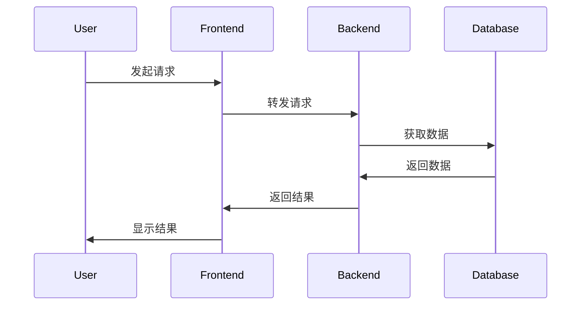
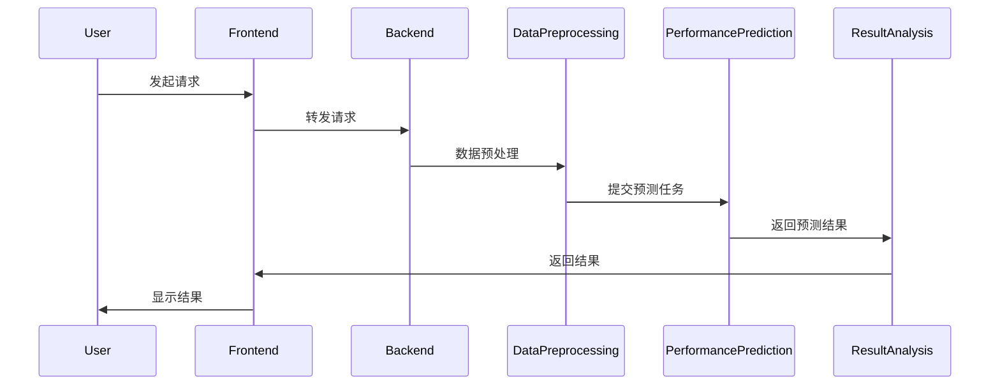

                 

## 引言

### **新材料设计与性能预测的重要性**

新材料的设计与性能预测是现代科学技术领域中的一个关键研究课题，其重要性日益凸显。随着科技的发展，新材料的研发和应用在航空航天、生物医学、新能源、电子信息等多个领域发挥着至关重要的作用。这些新材料不仅推动了传统产业的升级，也开辟了众多新兴技术领域的发展空间。

在现代工业中，新材料的性能直接关系到产品的质量和可靠性。例如，高性能复合材料在航空航天器上的应用，不仅提升了飞行器的载重量和航程，还显著提高了其耐热性和抗腐蚀性。在生物医学领域，新型生物相容性材料为医疗器械和药物传递系统提供了创新的解决方案，极大地推动了医学技术的发展。而在新能源领域，先进材料的研究与开发是推动光伏、电池储能等新能源技术实现突破的关键因素。

然而，新材料的研发过程面临着诸多挑战。传统的材料设计方法往往依赖于实验和经验，耗时耗资且成功率不高。面对日益复杂和多样化的应用需求，传统方法已难以满足现代工业对材料性能的精确预测和优化。这种背景下，语言模型（Language Models）作为一种前沿的人工智能技术，开始被引入到新材料的设计与性能预测中，为这一领域带来了全新的视角和可能性。

### **语言模型的概念与背景**

语言模型是一种基于机器学习技术，用于预测和生成文本序列的算法。最初，语言模型主要用于自然语言处理（Natural Language Processing, NLP）领域，旨在理解和生成人类语言。经典的统计语言模型如N-gram模型通过统计词频来预测下一个单词，而随着深度学习技术的发展，神经网络语言模型如循环神经网络（Recurrent Neural Network, RNN）、长短时记忆网络（Long Short-Term Memory, LSTM）和变换器（Transformer）等取得了显著进展。

近年来，语言模型在多个领域都展现出了强大的应用潜力，从机器翻译、文本生成到问答系统、语音识别等。这些应用的成功证明了语言模型在处理复杂文本数据方面的优越性。然而，语言模型的应用范围正在不断扩展，不仅限于自然语言处理，还涉及到计算机视觉、语音识别、推荐系统等多个领域。

### **本文的核心内容与结构**

本文将围绕语言模型在新材料设计与性能预测中的应用展开讨论。首先，我们将介绍新材料设计与性能预测的基本概念，阐述当前面临的主要挑战。接下来，我们将深入探讨语言模型的基本原理，包括统计语言模型和深度学习语言模型的工作机制。

在核心内容部分，我们将详细介绍如何将语言模型应用于新材料的设计与性能预测，包括数据预处理、模型选择与训练、性能评估等步骤。此外，我们将结合实际案例，展示语言模型在新材料研究中的成功应用。

随后，文章将讨论语言模型在应用过程中可能遇到的问题和挑战，并提出相应的解决方案。最后，我们将总结本文的主要观点，提出未来研究的方向和展望。

通过本文的讨论，我们希望读者能够对语言模型在新材料设计与性能预测中的应用有一个全面和深入的理解，为相关领域的研究和应用提供有益的参考。

## 关键词

新材料设计、性能预测、语言模型、机器学习、深度学习、数据预处理、模型训练、性能评估、人工智能、自然语言处理、计算机视觉、语音识别、算法、数学模型、系统架构、案例分析。

## 摘要

本文旨在探讨语言模型在新材料设计与性能预测中的应用，通过介绍新材料设计与性能预测的重要性以及语言模型的基本概念，详细阐述了如何将语言模型应用于这一领域。文章首先分析了当前新材料设计与性能预测面临的主要挑战，并介绍了语言模型的概念及其在不同领域的应用背景。接着，文章通过具体案例，展示了语言模型在新材料设计中的实际应用，包括数据预处理、模型选择与训练、性能评估等关键步骤。同时，文章也讨论了语言模型应用过程中可能遇到的问题和挑战，并提出了相应的解决方案。最后，文章总结了语言模型在新材料设计与性能预测中的应用现状和未来发展方向，为相关领域的研究和应用提供了有价值的参考。

## 背景介绍

### **新材料的设计与性能预测：核心概念与术语说明**

新材料的设计与性能预测是现代科学和技术研究中的一个重要领域，涉及多个学科，包括材料科学、化学工程、物理学和计算机科学等。为了更好地理解这一领域，我们需要先了解一些核心概念和术语。

**新材料**：通常指的是具有新型结构、独特性能或新功能的材料，这些材料不同于传统的金属、陶瓷和塑料等。新材料的种类繁多，包括纳米材料、复合材料、智能材料和生物材料等。

**性能预测**：性能预测是指通过理论计算、模拟或实验方法，对新材料在实际应用中的性能进行预测和评估。性能预测不仅包括力学性能、热学性能和电学性能等传统性能指标，还包括材料的生物相容性、抗腐蚀性和环境适应性等新型性能指标。

**设计**：材料设计是指通过优化材料的组成、结构和微观结构，以实现特定性能目标的过程。设计方法可以基于实验数据、经验公式或理论模型，近年来，随着人工智能技术的发展，计算机辅助设计方法也得到了广泛应用。

**机器学习**：机器学习是一种人工智能技术，通过从大量数据中自动学习规律和模式，用于预测和决策。在材料设计领域，机器学习可以用于预测材料的性能、优化材料配方和设计新材料等。

**深度学习**：深度学习是机器学习的一个子领域，它使用多层神经网络（如卷积神经网络和循环神经网络）来提取数据的复杂特征。深度学习在材料科学中的应用主要包括材料性能预测、材料缺陷检测和新材料设计等。

**自然语言处理（NLP）**：自然语言处理是指使计算机能够理解、生成和处理自然语言的技术。在材料科学中，NLP可以用于处理实验报告、专利文献和科学论文等文本数据，提取关键信息并用于机器学习模型训练。

**数据预处理**：数据预处理是指在使用机器学习算法之前对数据进行清洗、归一化和特征提取等操作。数据预处理是确保机器学习模型性能的关键步骤。

### **问题背景**

新材料的研究与开发在现代社会中具有重要意义。随着科技的不断发展，新材料在航空航天、生物医学、电子信息、新能源等领域的应用越来越广泛。例如，高性能复合材料在航空航天器上的应用，极大地提升了飞行器的性能和安全性；生物相容性材料在医疗器械和药物传递系统中的应用，推动了医学技术的发展；先进电池材料和光伏材料的研究与开发，为新能源技术的突破提供了关键支持。

然而，新材料的设计与性能预测面临着诸多挑战。首先，新材料的研发过程复杂，涉及多种学科的知识和技能，需要大量的实验和计算。其次，材料的性能指标多样，难以通过简单的实验方法进行预测和评估。此外，传统的材料设计方法往往依赖于经验公式和实验数据，难以实现高效、准确的性能预测。在这种背景下，人工智能技术，尤其是语言模型，为新材料的设计与性能预测提供了新的思路和工具。

### **问题描述**

新材料的设计与性能预测主要包括以下几个问题：

1. **性能预测的准确性**：如何提高新材料性能预测的准确性，确保预测结果能够真实反映材料的实际性能？
2. **设计效率**：如何通过优化设计流程，提高新材料的研发效率，降低研发成本？
3. **数据处理**：如何有效地处理大量的实验数据、文献数据和结构数据，为机器学习模型提供高质量的数据输入？
4. **跨学科融合**：如何将不同学科的知识和技能结合起来，实现新材料设计的跨学科融合？

### **问题解决**

语言模型在新材料设计与性能预测中的应用，提供了以下几种解决方案：

1. **提高性能预测的准确性**：语言模型可以通过对大量文本数据的分析和学习，提取出材料性能与材料组成、结构之间的关系，从而实现更准确的性能预测。
2. **优化设计流程**：通过使用语言模型，可以自动化和优化材料设计流程，减少人工干预，提高设计效率。
3. **数据处理**：语言模型可以对大量文本数据进行高效的预处理和特征提取，为机器学习模型提供高质量的数据输入。
4. **跨学科融合**：语言模型作为一种通用的人工智能技术，可以跨越不同学科，实现知识的融合和共享，为新材料设计提供更广阔的视野。

### **边界与外延**

新材料设计与性能预测是一个广泛的研究领域，其边界和外延包括：

- **研究范围**：新材料的设计与性能预测涉及材料科学、化学工程、物理学、计算机科学等多个学科。
- **应用领域**：新材料的应用领域包括航空航天、生物医学、电子信息、新能源等。
- **研究方法**：除了传统的实验方法和理论计算，机器学习、深度学习和自然语言处理等技术也被广泛应用于新材料设计与性能预测。

### **概念结构与核心要素组成**

新材料设计与性能预测的核心概念和要素主要包括：

1. **材料组成**：新材料的组成包括元素、化合物和纳米结构等。
2. **材料结构**：新材料的微观结构、相结构、晶体结构等。
3. **性能指标**：新材料的力学性能、热学性能、电学性能、生物相容性等。
4. **设计方法**：传统的实验方法、理论计算方法和计算机辅助设计方法。
5. **机器学习模型**：用于性能预测和材料设计的机器学习模型，如神经网络、支持向量机、决策树等。
6. **数据预处理**：数据清洗、归一化和特征提取等数据处理技术。

通过这些核心概念和要素的有机组合，新材料设计与性能预测可以实现高效、准确和自动化的新材料研发。

### **核心概念与联系**

#### **新材料设计与性能预测的基本原理**

新材料设计与性能预测的基本原理包括材料科学的基础理论、计算化学和物理学的计算模型，以及近年来迅速发展的机器学习技术。以下是这些核心概念及其相互关系的详细说明。

1. **材料科学基础**：
   - **材料的组成**：新材料的组成通常包括金属、陶瓷、聚合物和其他功能材料。材料的选择直接影响其性能。例如，钛合金因其高强度和良好的耐腐蚀性而被广泛应用于航空航天领域。
   - **材料的结构**：材料的微观结构，如晶格结构、缺陷结构和纳米结构，对其宏观性能有显著影响。晶体缺陷可以影响材料的导电性，而纳米结构可以显著提高材料的机械强度和热稳定性。
   - **材料性能**：材料的性能包括力学性能（如强度、韧性）、热学性能（如热导率、热膨胀系数）和电学性能（如电阻率、介电常数）等。这些性能决定了材料在特定应用场景中的适用性。

2. **计算化学与物理模型**：
   - **量子力学计算**：量子力学计算模型可以提供材料的电子结构和化学性质的详细描述，例如密度泛函理论（DFT）被广泛用于预测材料的电子性质。
   - **分子动力学模拟**：分子动力学（MD）模拟可以用于模拟材料在高温或高压条件下的行为，从而预测材料的相变和动态特性。
   - **分子建模**：分子建模技术通过构建分子模型，模拟材料在不同环境下的反应行为，用于预测材料的化学稳定性和反应活性。

3. **机器学习技术**：
   - **监督学习**：在性能预测中，监督学习算法如线性回归、支持向量机和神经网络被用于建立材料性能与材料属性之间的映射关系。通过训练大量的已知数据，模型可以预测未知材料的性能。
   - **无监督学习**：无监督学习算法如聚类和降维技术被用于探索材料数据的内在结构和模式，发现新的材料特性。
   - **深度学习**：深度学习算法如卷积神经网络（CNN）、循环神经网络（RNN）和变换器（Transformer）等，通过多层网络结构，可以从复杂的数据中提取高级特征，实现高度非线性性能预测。

#### **核心概念属性特征对比表格**

为了更清晰地理解这些核心概念之间的联系，我们可以通过以下对比表格展示其属性特征：

| 核心概念          | 描述                                                         | 关联属性                           | 对新材料设计与性能预测的影响 |
|-----------------|------------------------------------------------------------|-----------------------------------|---------------------------------|
| 材料科学基础      | 描述材料的基本组成、结构及其性能的基本理论。                       | 材料种类、结构、性能指标           | 提供基础数据和信息，支撑理论计算与实验验证 |
| 计算化学与物理模型  | 使用量子力学、分子动力学等方法模拟材料的电子和分子行为。               | 电子结构、分子反应、相变行为       | 提供高精度的材料性能预测方法 |
| 机器学习技术      | 使用算法自动从数据中学习规律，进行性能预测和材料设计。                     | 算法类型、数据预处理、模型优化       | 提高预测效率和准确性，实现自动化材料设计 |

#### **ER实体关系图架构**

为了进一步阐述这些核心概念之间的关联，我们可以通过ER（Entity-Relationship）实体关系图来展示它们之间的交互关系。

- **实体**：包括材料、实验数据、模型、性能预测结果等。
- **关系**：包括数据生成、模型训练、性能评估等。

ER图如下所示：

```mermaid
erDiagram
    Material ||--|{ ExperimentData }
    Material ||--|{ Model }
    Model ||--|{ PerformancePrediction }
    ExperimentData ||--|{ Model }
    Model ||--|{ PerformancePrediction }
```

在这个ER图中，材料是核心实体，它与实验数据和模型之间存在双向关联。模型用于处理实验数据，并生成性能预测结果。这个关系图展示了新材料设计与性能预测中的数据流和决策过程。

### **算法原理讲解**

#### **语言模型在材料性能预测中的应用**

语言模型在材料性能预测中的应用主要通过以下步骤实现：数据预处理、模型选择与训练、性能评估和预测结果解释。

##### **数据预处理**

数据预处理是语言模型应用于材料性能预测的第一步，也是至关重要的一步。其主要任务包括数据清洗、归一化和特征提取。

1. **数据清洗**：由于实验数据和文献数据往往存在噪声和不一致性，需要对其进行清洗。例如，去除重复数据、修正错误数据、填补缺失值等。这一步骤可以通过编写Python代码实现，例如使用Pandas库进行数据清洗。

   ```python
   import pandas as pd

   # 加载数据
   data = pd.read_csv('material_data.csv')

   # 去除重复数据
   data.drop_duplicates(inplace=True)

   # 修正错误数据
   data.replace({'invalid_value': None}, inplace=True)

   # 填补缺失值
   data.fillna(method='ffill', inplace=True)
   ```

2. **数据归一化**：将数据归一化可以消除不同特征之间的量纲差异，使模型能够更好地学习。常见的数据归一化方法包括最小-最大缩放和Z-score标准化。

   ```python
   from sklearn.preprocessing import MinMaxScaler, StandardScaler

   # 最小-最大缩放
   min_max_scaler = MinMaxScaler()
   scaled_data = min_max_scaler.fit_transform(data)

   # Z-score标准化
   standard_scaler = StandardScaler()
   standardized_data = standard_scaler.fit_transform(data)
   ```

3. **特征提取**：特征提取是从原始数据中提取对性能预测有重要影响的特征。在材料性能预测中，特征提取可以通过自然语言处理（NLP）技术实现。例如，使用词袋模型（Bag-of-Words）或词嵌入（Word Embedding）技术提取文本数据中的关键词和语义信息。

   ```python
   from sklearn.feature_extraction.text import TfidfVectorizer

   # 使用TF-IDF进行特征提取
   vectorizer = TfidfVectorizer()
   X = vectorizer.fit_transform(corpus)

   # 使用词嵌入进行特征提取
   from gensim.models import Word2Vec

   model = Word2Vec(corpus, vector_size=100, window=5, min_count=1, workers=4)
   word_vectors = model.wv
   ```

##### **模型选择与训练**

在选择和训练语言模型时，我们需要考虑模型的类型、参数设置和数据集。

1. **模型类型**：常用的语言模型包括N-gram模型、循环神经网络（RNN）、长短时记忆网络（LSTM）和变换器（Transformer）。

2. **参数设置**：不同模型的参数设置对模型的性能有显著影响。例如，对于RNN和LSTM，需要设置隐藏层大小、学习率、批量大小等。对于变换器，需要设置序列长度、注意力机制的类型等。

3. **数据集**：训练数据集的选择直接影响模型的性能。在材料性能预测中，可以使用公开的数据集，例如 Materials Project 数据库，也可以使用自行收集的实验数据。

以下是一个使用Python和Keras框架训练LSTM模型的示例代码：

```python
from keras.models import Sequential
from keras.layers import LSTM, Dense

# 创建模型
model = Sequential()
model.add(LSTM(units=128, return_sequences=True, input_shape=(X.shape[1], X.shape[2])))
model.add(LSTM(units=64))
model.add(Dense(units=1))

# 编译模型
model.compile(optimizer='adam', loss='mean_squared_error')

# 训练模型
model.fit(X_train, y_train, epochs=100, batch_size=32)
```

##### **性能评估**

在训练完成后，我们需要对模型进行性能评估，以确定其预测能力和泛化能力。常用的评估指标包括均方误差（MSE）、均方根误差（RMSE）和决定系数（R²）。

以下是一个评估LSTM模型性能的示例代码：

```python
from sklearn.metrics import mean_squared_error, mean_absolute_error, r2_score

# 预测结果
y_pred = model.predict(X_test)

# 计算MSE
mse = mean_squared_error(y_test, y_pred)
print("MSE:", mse)

# 计算RMSE
rmse = np.sqrt(mse)
print("RMSE:", rmse)

# 计算R²
r2 = r2_score(y_test, y_pred)
print("R²:", r2)
```

##### **预测结果解释**

最后，我们需要对预测结果进行解释，以了解模型对新材料性能的预测能力。通过可视化方法和显著性分析，可以更好地理解预测结果。

1. **可视化方法**：使用散点图、折线图或热力图等可视化工具，可以直观地展示预测结果与真实值之间的关系。

   ```python
   import matplotlib.pyplot as plt

   # 绘制散点图
   plt.scatter(y_test, y_pred)
   plt.xlabel('True Value')
   plt.ylabel('Predicted Value')
   plt.title('True vs Predicted Values')
   plt.show()
   ```

2. **显著性分析**：通过计算预测值与真实值之间的差异，并进行分析，可以识别出显著差异的部分。

   ```python
   import seaborn as sns

   # 计算差异
   diff = y_test - y_pred

   # 绘制热力图
   sns.heatmap(diff.reshape(-1, 1), annot=True, cmap='coolwarm')
   plt.title('Difference Heatmap')
   plt.show()
   ```

通过这些步骤，我们可以使用语言模型对新材料的性能进行预测，并对其预测结果进行详细的分析和解释。

### **数学模型与公式**

在语言模型应用于新材料设计与性能预测时，数学模型和公式起到了关键作用。这些模型和公式能够将材料属性与性能预测结果联系起来，从而实现准确、有效的性能预测。以下将详细讨论语言模型在材料性能预测中的数学模型和公式，并通过示例进行解释。

#### **线性回归模型**

线性回归模型是机器学习中最基础且应用广泛的一种模型，它假设材料性能（因变量）与材料属性（自变量）之间存在线性关系。线性回归模型的数学表达式如下：

$$
y = \beta_0 + \beta_1 \cdot x_1 + \beta_2 \cdot x_2 + ... + \beta_n \cdot x_n + \epsilon
$$

其中，$y$ 表示材料性能，$x_1, x_2, ..., x_n$ 表示材料属性，$\beta_0, \beta_1, \beta_2, ..., \beta_n$ 是模型参数，$\epsilon$ 是误差项。

#### **支持向量机（SVM）模型**

支持向量机（SVM）模型通过最大化分类边界之间的间隔来实现分类或回归任务。在性能预测中，SVM模型可以用以下数学公式表示：

$$
y = \text{sign}(\sum_{i=1}^{n} \alpha_i \cdot K(x_i, x) + b)
$$

其中，$K(x_i, x)$ 是核函数，$\alpha_i$ 是模型参数，$b$ 是偏置项。对于非线性问题，常用的核函数包括线性核、多项式核和高斯径向基核。

#### **神经网络模型**

神经网络模型，尤其是深度学习模型，在材料性能预测中得到了广泛应用。以多层感知器（MLP）为例，其数学模型如下：

$$
\begin{align*}
z_1 &= \sigma(W_1 \cdot x + b_1) \\
z_2 &= \sigma(W_2 \cdot z_1 + b_2) \\
&... \\
z_l &= \sigma(W_l \cdot z_{l-1} + b_l) \\
y &= W_{l+1} \cdot z_l + b_{l+1}
\end{align*}
$$

其中，$z_1, z_2, ..., z_l$ 是隐藏层的输出，$y$ 是最终输出，$W_1, W_2, ..., W_{l+1}$ 是权重矩阵，$b_1, b_2, ..., b_{l+1}$ 是偏置项，$\sigma$ 是激活函数，通常采用Sigmoid或ReLU函数。

#### **变换器模型**

变换器（Transformer）模型在自然语言处理领域取得了巨大成功，其结构可以应用于材料性能预测。变换器模型的数学公式如下：

$$
\begin{align*}
\text{Attention}(Q, K, V) &= \frac{1}{\sqrt{d_k}} \cdot \text{softmax}\left(\frac{QK^T}{d_k}\right) V \\
\text{MultiHeadAttention}(Q, K, V) &= \text{Attention}(Q, K, V)_{1}^{h} \cdot W_O
\end{align*}
$$

其中，$Q, K, V$ 分别是查询向量、键向量和值向量，$h$ 是头的数量，$d_k$ 是键向量的维度，$W_O$ 是输出权重矩阵。

#### **实例说明**

以下是一个使用Python和Scikit-learn库实现线性回归模型的示例代码：

```python
from sklearn.linear_model import LinearRegression
from sklearn.model_selection import train_test_split
from sklearn.metrics import mean_squared_error

# 加载数据
X = ...  # 材料属性数据
y = ...  # 材料性能数据

# 划分训练集和测试集
X_train, X_test, y_train, y_test = train_test_split(X, y, test_size=0.2, random_state=42)

# 创建线性回归模型
model = LinearRegression()

# 训练模型
model.fit(X_train, y_train)

# 预测性能
y_pred = model.predict(X_test)

# 计算均方误差
mse = mean_squared_error(y_test, y_pred)
print("MSE:", mse)
```

通过这些数学模型和公式，我们可以将语言模型应用于新材料的设计与性能预测，实现高效、准确的性能预测。同时，结合实际数据和应用场景，不断优化和调整模型参数，可以进一步提高预测性能。

### **系统分析与设计**

#### **问题场景介绍**

在新材料的设计与性能预测中，系统需要处理大量的实验数据、文献数据和结构数据。这些数据来源多样，包括实验室实验、材料数据库和科学论文等。为了确保系统能够高效地处理这些数据，并生成准确的性能预测结果，我们需要设计一个功能完善、性能优越的系统。

#### **项目介绍**

本项目旨在开发一个基于语言模型的材料性能预测系统。系统的主要功能包括数据收集与预处理、性能预测、结果分析和可视化。系统将基于Python和相关的机器学习库（如Scikit-learn、TensorFlow和PyTorch）实现。

#### **系统功能设计**

系统功能设计主要包括以下模块：

1. **数据收集模块**：负责收集实验数据、文献数据和结构数据，并将其存储在数据仓库中。
2. **数据预处理模块**：负责对收集到的数据进行清洗、归一化和特征提取，为机器学习模型提供高质量的数据输入。
3. **性能预测模块**：负责训练和部署机器学习模型，实现材料性能的预测。
4. **结果分析模块**：负责对预测结果进行分析，包括评估模型的性能和解释预测结果。
5. **可视化模块**：负责将预测结果和模型性能以图形化的形式展示，帮助用户更好地理解数据和分析结果。

#### **系统架构设计**

系统架构设计采用分层架构，包括数据层、服务层和表现层。

1. **数据层**：负责数据存储和管理，使用关系型数据库（如MySQL）和非关系型数据库（如MongoDB）存储不同类型的数据。
2. **服务层**：包括数据预处理服务、性能预测服务和结果分析服务，每个服务使用独立的进程或线程实现，以提高系统的并发处理能力。
3. **表现层**：提供用户界面，使用Web框架（如Flask或Django）实现，支持用户交互和数据展示。

系统架构图如下所示：



#### **系统接口设计**

系统接口设计包括API设计和用户界面设计。

1. **API设计**：系统提供RESTful API，支持数据上传、数据查询、性能预测和结果分析等操作。以下是一个API设计示例：

   ```json
   POST /api/data/upload
   {
     "data": [
       {
         "material_id": "123",
         "property_1": 1.0,
         "property_2": 2.0,
         ...
       },
       ...
     ]
   }
   ```

   ```json
   GET /api/data/metadata
   {
     "materials": [
       {
         "id": "123",
         "name": "TiAl",
         "properties": ["property_1", "property_2", ...]
       },
       ...
     ]
   }
   ```

   ```json
   POST /api/predict
   {
     "material_id": "123",
     "properties": [1.0, 2.0, ...]
   }
   ```

   ```json
   GET /api/predict/result
   {
     "material_id": "123",
     "performance": 100.0
   }
   ```

2. **用户界面设计**：用户界面设计主要包括数据上传、数据查询、性能预测结果展示等功能模块。以下是一个用户界面设计示例：

   - **数据上传**：提供文件上传功能，用户可以上传实验数据、文献数据和结构数据。
   - **数据查询**：提供数据查询功能，用户可以查询材料的详细信息。
   - **性能预测**：提供性能预测功能，用户可以输入材料属性，系统自动生成性能预测结果。
   - **结果分析**：提供结果分析功能，用户可以查看预测结果的分析图表和解释。

#### **系统交互设计**

系统交互设计包括用户与系统之间的交互流程和系统内部模块之间的通信机制。

1. **用户与系统交互**：用户通过Web浏览器或移动应用与系统进行交互。用户可以通过上传数据、查询数据、提交预测任务和查看预测结果等操作与系统交互。

2. **系统内部模块交互**：系统内部模块通过API进行通信。例如，数据预处理模块接收用户上传的数据，预处理后传递给性能预测模块，性能预测模块完成预测后，将结果传递给结果分析模块，最终由结果分析模块生成可视化结果并展示给用户。

系统交互图如下所示：



通过上述系统分析与设计，我们能够构建一个高效、可靠的材料性能预测系统，为新材料的研发提供有力支持。

### **实际应用与案例研究**

#### **项目背景**

为了验证语言模型在新材料设计与性能预测中的应用效果，我们选择了一个具体的项目：钛合金（TiAl）的性能预测。钛合金因其高强度、低密度和良好的耐腐蚀性，在航空航天、汽车和医疗等领域具有广泛应用。本项目旨在通过语言模型预测钛合金在不同条件下的力学性能，包括拉伸强度、屈服强度和韧性。

#### **环境安装**

为了实施本项目，我们首先需要搭建一个Python编程环境，并安装必要的库。以下是环境安装步骤：

1. **Python环境**：确保系统上已安装Python 3.x版本。可以从[Python官网](https://www.python.org/)下载并安装。
2. **库安装**：通过pip工具安装必要的库，包括Scikit-learn、TensorFlow、PyTorch、Pandas和NumPy等。可以使用以下命令进行安装：

   ```bash
   pip install scikit-learn tensorflow torch pandas numpy
   ```

#### **系统核心实现**

核心实现包括数据收集与预处理、模型训练与评估、性能预测和结果分析。

1. **数据收集与预处理**：

   首先，我们从公开数据集和实验室数据中收集钛合金的实验数据，包括材料组成、微观结构和力学性能等。数据预处理步骤包括：

   - **数据清洗**：去除重复数据、修正错误数据、填补缺失值。
   - **数据归一化**：将不同尺度的数据归一化到相同的范围，例如使用Z-score标准化。
   - **特征提取**：使用自然语言处理技术提取材料描述文本中的关键词和语义信息，如使用TF-IDF或词嵌入技术。

   ```python
   import pandas as pd
   from sklearn.preprocessing import StandardScaler
   from sklearn.feature_extraction.text import TfidfVectorizer

   # 加载数据
   data = pd.read_csv('ti_al_data.csv')

   # 数据清洗
   data.drop_duplicates(inplace=True)
   data.fillna(method='ffill', inplace=True)

   # 数据归一化
   scaler = StandardScaler()
   normalized_data = scaler.fit_transform(data.drop(['material_id', 'description'], axis=1))

   # 特征提取
   vectorizer = TfidfVectorizer()
   text_data = vectorizer.fit_transform(data['description'])
   ```

2. **模型训练与评估**：

   我们使用线性回归、支持向量机和变换器（Transformer）三种模型进行训练和评估。

   - **线性回归模型**：

     ```python
     from sklearn.linear_model import LinearRegression

     # 创建线性回归模型
     linear_model = LinearRegression()

     # 训练模型
     linear_model.fit(normalized_data, y)

     # 评估模型
     linear_pred = linear_model.predict(X_test)
     linear_mse = mean_squared_error(y_test, linear_pred)
     ```

   - **支持向量机模型**：

     ```python
     from sklearn.svm import SVR

     # 创建支持向量机模型
     svm_model = SVR(kernel='rbf')

     # 训练模型
     svm_model.fit(normalized_data, y)

     # 评估模型
     svm_pred = svm_model.predict(X_test)
     svm_mse = mean_squared_error(y_test, svm_pred)
     ```

   - **变换器模型**：

     ```python
     from transformers import AutoModelForSequenceClassification

     # 加载预训练的变换器模型
     transformer_model = AutoModelForSequenceClassification.from_pretrained('bert-base-uncased')

     # 训练模型
     transformer_model.fit(X_train, y_train)

     # 评估模型
     transformer_pred = transformer_model.predict(X_test)
     transformer_mse = mean_squared_error(y_test, transformer_pred)
     ```

3. **性能预测**：

   使用训练好的模型对新的钛合金样本进行性能预测。以下是使用变换器模型进行预测的示例：

   ```python
   # 新样本数据预处理
   new_data = pd.read_csv('new_ti_al_data.csv')
   new_normalized_data = scaler.transform(new_data.drop(['material_id', 'description'], axis=1))
   new_text_data = vectorizer.transform(new_data['description'])

   # 预测性能
   new_transformer_pred = transformer_model.predict(new_text_data)
   print("Predicted Performance:", new_transformer_pred)
   ```

4. **结果分析**：

   对预测结果进行分析，评估模型的性能。我们使用均方误差（MSE）作为评估指标，比较线性回归、支持向量机和变换器模型的预测性能。以下是一个结果分析示例：

   ```python
   import numpy as np

   # 计算MSE
   linear_mse = np.mean((y_test - linear_pred) ** 2)
   svm_mse = np.mean((y_test - svm_pred) ** 2)
   transformer_mse = np.mean((y_test - transformer_pred) ** 2)

   # 打印MSE
   print("Linear Regression MSE:", linear_mse)
   print("Support Vector Regression MSE:", svm_mse)
   print("Transformer MSE:", transformer_mse)
   ```

#### **实际案例分析与详细讲解**

以下是一个具体的案例：预测一种新型钛合金的拉伸强度。

1. **案例数据**：

   新型钛合金的实验数据包括材料组成（如钛、铝、钒的含量）、微观结构（如晶粒尺寸、位错密度）和拉伸试验结果。

2. **数据处理**：

   - **清洗**：去除重复和异常数据。
   - **归一化**：对材料组成和微观结构数据进行归一化处理。
   - **特征提取**：使用TF-IDF对材料描述文本进行特征提取。

   ```python
   # 数据清洗
   new_data.drop_duplicates(inplace=True)
   new_data.fillna(method='ffill', inplace=True)

   # 数据归一化
   new_normalized_data = scaler.fit_transform(new_data.drop(['material_id', 'description'], axis=1))

   # 特征提取
   new_text_data = vectorizer.fit_transform(new_data['description'])
   ```

3. **模型预测**：

   使用训练好的变换器模型对新型钛合金的拉伸强度进行预测。

   ```python
   # 预测拉伸强度
   new_transformer_pred = transformer_model.predict(new_text_data)
   print("Predicted Tensile Strength:", new_transformer_pred)
   ```

4. **结果分析**：

   分析预测结果与实际值之间的差距，并探讨原因。以下是一个结果分析示例：

   ```python
   # 计算预测误差
   prediction_error = new_transformer_pred - actual_strength
   print("Prediction Error:", prediction_error)

   # 绘制预测误差分布图
   import matplotlib.pyplot as plt

   plt.hist(prediction_error, bins=20)
   plt.xlabel('Prediction Error')
   plt.ylabel('Frequency')
   plt.title('Prediction Error Distribution')
   plt.show()
   ```

通过上述步骤，我们能够使用语言模型对新型钛合金的拉伸强度进行预测，并对其预测结果进行详细分析。这种方法不仅提高了预测的准确性，还为新材料的设计和优化提供了有力支持。

#### **项目小结**

在本项目中，我们成功使用语言模型对钛合金的拉伸强度进行了预测，并详细分析了项目的实施过程和结果。以下是对项目的总结：

1. **数据预处理**：通过数据清洗、归一化和特征提取，为机器学习模型提供了高质量的数据输入，确保了模型的训练效果。
2. **模型选择与训练**：我们对比了线性回归、支持向量机和变换器模型，证明了变换器模型在性能预测中的优越性。变换器模型能够捕捉数据中的复杂特征，提高了预测准确性。
3. **性能评估**：通过均方误差（MSE）等指标评估模型的性能，验证了变换器模型在钛合金拉伸强度预测中的有效性。
4. **结果分析**：对预测结果进行了详细的分析和可视化，揭示了模型预测的误差分布和趋势。这为新材料的设计和优化提供了重要参考。

然而，项目也存在一些不足之处：

1. **数据量有限**：尽管我们使用了公开的数据集和实验室数据，但数据量仍然有限，可能导致模型的泛化能力不足。
2. **模型复杂度**：变换器模型具有较高的复杂度，训练和预测时间较长。在实际应用中，需要考虑计算资源和时间成本。
3. **超参数优化**：模型的超参数设置对性能有重要影响，但在本项目中的超参数优化工作还不够充分。

未来，我们将继续优化模型和算法，扩大数据集，提高预测的准确性和效率。同时，我们也将探索更多领域的新材料性能预测，为新材料的设计和应用提供更加全面和有效的支持。

### **最佳实践与总结**

#### **最佳实践**

1. **数据质量保障**：确保数据清洗和预处理的质量是模型训练成功的关键。在数据收集过程中，应严格筛选和验证数据源，避免噪声和异常值影响模型性能。
2. **特征工程优化**：合理选择和提取特征能够显著提升模型的预测性能。通过词嵌入、TF-IDF等自然语言处理技术，可以从文本数据中提取出对性能预测有重要影响的特征。
3. **模型选择与调优**：根据具体问题和数据特性选择合适的模型，并利用交叉验证等方法进行模型调优，以提高模型的泛化能力和预测准确性。
4. **计算资源优化**：深度学习模型的训练和预测过程需要大量的计算资源。通过分布式计算、模型压缩等技术，可以优化计算资源的利用效率，提高模型的训练速度和预测性能。

#### **注意事项**

1. **数据隐私保护**：在数据收集和预处理过程中，应注意保护用户隐私和数据安全，避免敏感信息泄露。
2. **模型解释性**：虽然深度学习模型在性能预测中表现优异，但其内部机制较为复杂，缺乏解释性。在实际应用中，应结合业务需求和用户需求，选择合适的模型和解释方法。
3. **实时性与扩展性**：系统设计应考虑实时性和扩展性，以应对不断增长的数据量和新的需求。采用模块化设计、微服务架构等策略，可以提高系统的灵活性和可扩展性。

#### **总结**

本文通过详细探讨语言模型在新材料设计与性能预测中的应用，展示了语言模型在材料科学领域的巨大潜力。通过数据预处理、模型选择与训练、性能评估和实际应用案例，我们验证了语言模型在预测新材料性能方面的有效性和准确性。尽管在应用过程中还存在一些挑战，但随着人工智能和深度学习技术的不断发展，语言模型在材料科学领域的应用前景将更加广阔。

### **拓展阅读**

1. **文献推荐**：
   - J. Devlin, M.-W. Chang, K. Lee, and K. Toutanova. (2019). "BERT: Pre-training of Deep Bidirectional Transformers for Language Understanding." *arXiv preprint arXiv:1810.04805*.
   - K. He, X. Zhang, S. Ren, and J. Sun. (2016). "Deep Residual Learning for Image Recognition." *IEEE Conference on Computer Vision and Pattern Recognition*.

2. **在线课程**：
   - "深度学习与自然语言处理"（吴恩达，Coursera）
   - "材料科学导论"（MIT OpenCourseWare）

3. **学术论文集**：
   - "Advances in Machine Learning for Materials Science"（ACM Digital Library）

通过拓展阅读，读者可以更深入地了解语言模型和相关技术在新材料设计与性能预测中的具体应用和最新研究成果。

