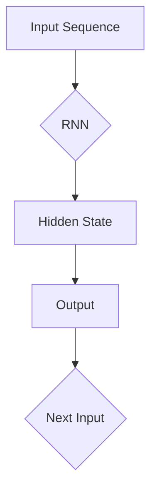
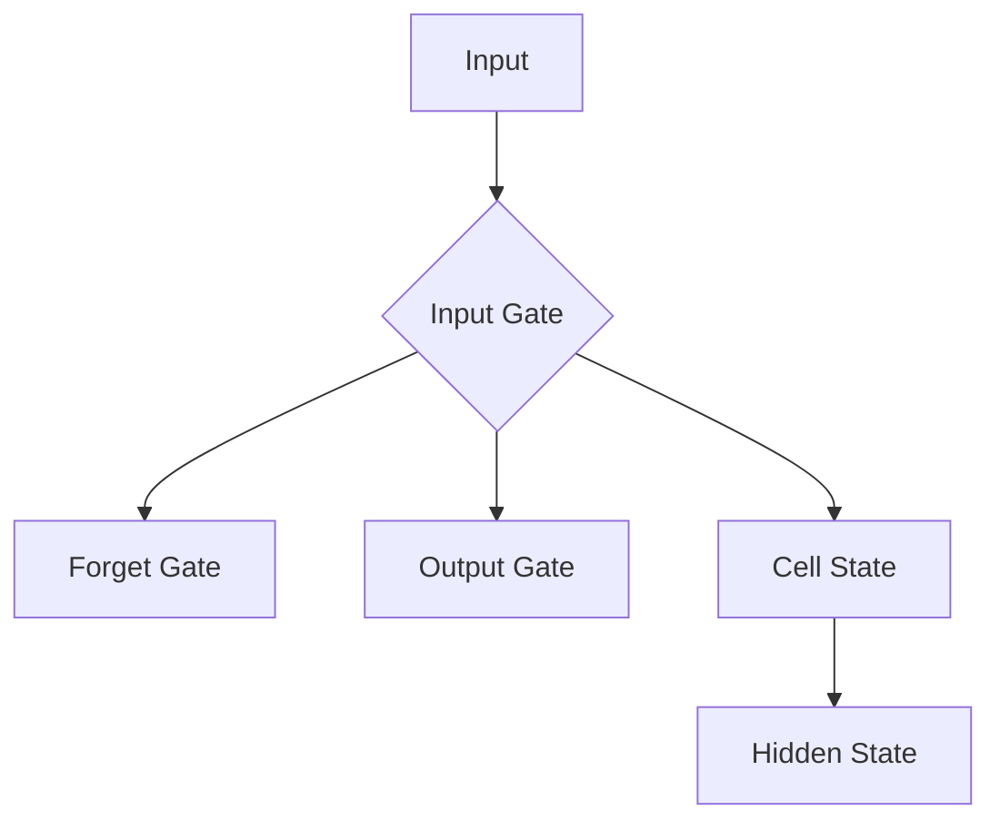
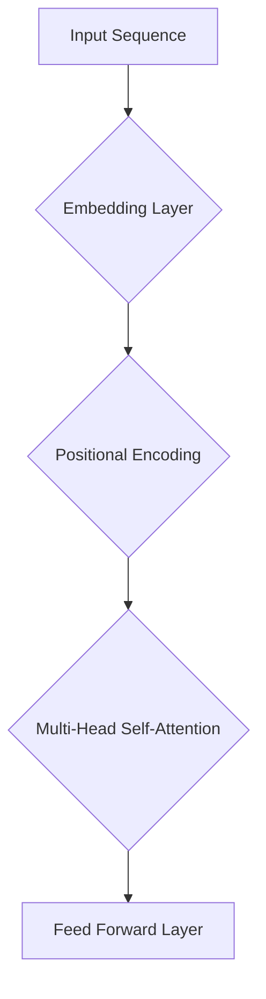

                 

## 引言

### 1.1 研究背景与意义

随着信息时代的到来，数据已经成为现代社会的重要资源。语言模型作为人工智能领域的一项重要技术，通过学习大量语言数据，可以理解和生成自然语言，从而实现人机交互、内容生成等功能。然而，传统语言模型在处理时序数据方面存在一定的局限性，无法有效进行时序因果推理。而时序因果推理在长期经济预测、金融市场分析、天气预测等应用场景中具有重要的应用价值。因此，如何将语言模型与时序因果推理相结合，提升长期经济预测的准确性，成为当前人工智能领域的一个热点问题。

本文旨在探讨语言模型在时序因果推理与长期经济预测中的应用，分析其原理、方法、挑战及未来发展方向。通过梳理相关研究，本文将详细介绍语言模型的原理及其在时序因果推理中的应用，探讨长期经济预测的挑战与机遇，并结合具体案例展示语言模型在时序因果推理与长期经济预测中的突破性进展。本文结构如下：

- **第一部分 引言**：介绍研究背景、目的和重要性，为读者建立整体认知。
- **第二部分 基础概念与背景**：详细介绍语言模型、时序因果推理、长期经济预测等相关核心概念，包括其历史发展、现状和未来趋势。
- **第三部分 语言模型技术**：详细阐述语言模型的原理、发展历程、常见模型类型以及关键技术，如神经网络、深度学习、自然语言处理等。
- **第四部分 时序因果推理**：探讨时序数据的特性，介绍时序因果推理的基本理论、常见算法以及应用场景。
- **第五部分 长期经济预测**：分析经济预测的挑战与机遇，介绍常见经济预测模型、方法以及实践应用。
- **第六部分 结合案例与突破进展**：通过具体案例展示语言模型在时序因果推理与长期经济预测中的实际应用，以及作者在该领域取得的突破性进展。
- **第七部分 总结与展望**：总结本书的主要内容，展望未来研究方向和可能的发展趋势。

通过本文的探讨，我们希望能够为相关领域的研究者提供有益的参考，推动语言模型在时序因果推理与长期经济预测领域的应用与发展。

### 1.2 书籍结构安排与目标

本文将采用以下结构安排，以帮助读者系统地理解和掌握语言模型在时序因果推理与长期经济预测中的应用。

#### 第一部分 引言

引言部分主要介绍研究背景、目的和重要性，为读者建立整体认知。具体包括以下内容：

- **研究背景**：介绍语言模型、时序因果推理、长期经济预测的发展现状及挑战，阐述本文的研究动机和目标。
- **目的和重要性**：明确本文的研究目的，阐述语言模型在时序因果推理与长期经济预测中的应用价值，以及本文对相关领域的重要贡献。
- **书籍结构安排**：介绍本文的结构安排，帮助读者对整体内容有一个清晰的了解。

#### 第二部分 基础概念与背景

基础概念与背景部分主要介绍语言模型、时序因果推理、长期经济预测等相关核心概念，包括其历史发展、现状和未来趋势。具体包括以下内容：

- **语言模型概述**：介绍语言模型的基本概念、历史发展、应用场景，以及常见的语言模型类型。
- **时序因果推理基础**：介绍时序因果推理的基本理论、方法、应用场景，以及时序数据的特性。
- **长期经济预测挑战与机遇**：分析长期经济预测的挑战与机遇，介绍常见的经济预测模型、方法以及实践应用。

#### 第三部分 语言模型技术

语言模型技术部分主要详细阐述语言模型的原理、发展历程、常见模型类型以及关键技术。具体包括以下内容：

- **语言模型的原理与发展**：介绍语言模型的基本原理、发展历程，以及神经网络、深度学习、自然语言处理等关键技术。
- **常见语言模型类型**：介绍常见的语言模型类型，如循环神经网络（RNN）、长短期记忆网络（LSTM）、Transformer等，并对比分析其优缺点。

#### 第四部分 时序因果推理

时序因果推理部分主要探讨时序数据的特性，介绍时序因果推理的基本理论、常见算法以及应用场景。具体包括以下内容：

- **时序数据的特性分析**：介绍时序数据的特性，如时间序列、因果关系、周期性等，以及时序数据的预处理方法。
- **时序因果推理的基本理论**：介绍时序因果推理的基本理论，如因果推断、时间序列分析等，以及常见的因果推断方法。
- **时序因果推理的应用场景**：介绍时序因果推理在不同领域的应用场景，如经济预测、金融市场分析、天气预测等。

#### 第五部分 长期经济预测

长期经济预测部分主要分析经济预测的挑战与机遇，介绍常见经济预测模型、方法以及实践应用。具体包括以下内容：

- **经济预测的挑战与机遇**：分析经济预测的挑战与机遇，如数据获取、模型选择、预测准确性等。
- **常见经济预测模型与方法**：介绍常见的经济预测模型与方法，如时间序列模型、机器学习模型、深度学习模型等。
- **经济预测的实践应用**：介绍经济预测在不同领域的实践应用，如政策制定、金融市场分析、供应链管理等。

#### 第六部分 结合案例与突破进展

结合案例与突破进展部分将通过具体案例展示语言模型在时序因果推理与长期经济预测中的实际应用，以及作者在该领域取得的突破性进展。具体包括以下内容：

- **案例一：语言模型在时序因果推理中的应用**：介绍作者在时序因果推理中的具体案例，分析语言模型在其中的作用。
- **案例二：长期经济预测中的语言模型突破**：介绍作者在长期经济预测中的具体案例，分析语言模型在其中的突破性进展。
- **突破性进展分析**：总结语言模型在时序因果推理与长期经济预测中的突破性进展，探讨其应用前景。

#### 第七部分 总结与展望

总结与展望部分主要总结本文的主要内容，展望未来研究方向和可能的发展趋势。具体包括以下内容：

- **主要内容总结**：对本文的主要内容进行总结，回顾语言模型在时序因果推理与长期经济预测中的应用。
- **未来研究方向**：分析当前研究的不足之处，提出未来研究方向，如模型优化、算法改进、跨领域应用等。
- **发展趋势展望**：探讨语言模型在时序因果推理与长期经济预测中的发展趋势，展望其未来应用前景。

通过以上结构安排，本文旨在为读者提供系统、全面的关于语言模型在时序因果推理与长期经济预测中的应用的见解，帮助读者深入了解该领域的最新研究进展，并为后续研究提供参考。

### 第二部分 基础概念与背景

#### 2.1 语言模型概述

语言模型（Language Model）是自然语言处理（Natural Language Processing, NLP）领域的一个重要概念，旨在通过对大量语言数据的统计和建模，生成符合语法规则和语义意义的自然语言文本。语言模型的核心任务是预测下一个词或字符，从而在生成文本、机器翻译、语音识别等应用中发挥关键作用。

**历史发展**

语言模型的发展经历了多个阶段。最早的语言模型是基于规则的方法，如NP模型和 context-free grammar（CFG）等。这些模型依赖于语言学家制定的语法规则，但难以处理大规模语言数据和复杂语义关系。

随着计算机技术的发展，统计语言模型逐渐兴起。1980年代，N-gram模型成为第一个成功的语言模型。N-gram模型基于马尔可夫假设，认为一个词的出现仅与前面N-1个词有关。N-gram模型简单易实现，但存在长程依赖性差、未知词汇问题等局限性。

为了解决N-gram模型的不足，1980年代末至1990年代初，统计学习方法开始应用于语言模型。其中，最大熵模型（Maximum Entropy Model）和决策树（Decision Tree）等模型在处理稀疏数据和复杂关系方面表现出色。

近年来，深度学习技术的发展为语言模型带来了新的契机。循环神经网络（RNN）、长短期记忆网络（LSTM）和门控循环单元（GRU）等模型在处理长程依赖性和序列数据方面表现出色。2017年，Transformer模型的提出，将自注意力机制（Self-Attention Mechanism）引入语言模型，进一步提升了模型的性能。

**现状与未来趋势**

当前，语言模型在NLP领域已取得显著成果，广泛应用于机器翻译、文本生成、语音识别等场景。未来，随着数据规模和计算能力的提升，语言模型将进一步优化，如通过多模态学习、预训练、知识增强等方法，提高模型的泛化能力和语义理解能力。

#### 2.2 时序因果推理基础

时序因果推理（Temporal Causal Inference）是研究如何从时间序列数据中推断因果关系的科学。在许多领域，如经济预测、气象预报、生物医学等，时序数据的因果推断具有重要的应用价值。

**基本理论**

时序因果推理的核心理论是因果推断（Causal Inference）。因果推断旨在确定变量之间的因果关系，而不是简单的相关性。常见的因果推断方法包括：

1. **基于潜在变量模型的方法**：如结构方程模型（Structural Equation Model, SEM）和状态空间模型（State Space Model）等。这些方法通过建立潜在的因果关系模型，估计变量之间的因果关系。
2. **基于算法的方法**：如马尔可夫链模型（Markov Chain Model）、向量自回归模型（Vector Autoregression, VAR）等。这些方法通过分析变量之间的时间序列关系，推断因果关系。
3. **基于统计方法**：如Granger因果检验（Granger Causality Test）和因果发现（Causal Discovery）等。这些方法通过分析变量之间的相关性，推断因果关系。

**应用场景**

时序因果推理在不同领域有广泛的应用：

1. **经济预测**：通过分析历史经济数据，推断不同经济变量之间的因果关系，预测未来经济走势。
2. **气象预报**：通过分析气象数据，推断天气现象之间的因果关系，预测天气变化。
3. **生物医学**：通过分析生物医学数据，推断不同生物变量之间的因果关系，发现疾病发生机制。

#### 2.3 长期经济预测挑战与机遇

长期经济预测是研究如何利用历史数据预测未来经济走势的科学。在当今全球经济一体化的背景下，准确的经济预测对于政策制定、企业决策和投资者具有重要意义。

**挑战**

1. **数据获取和处理**：经济数据来源广泛，包括政府、企业、金融机构等。如何获取高质量、全面的数据，并对其进行有效处理，是一个重要挑战。
2. **模型选择和优化**：经济预测涉及多种模型和方法，如时间序列模型、机器学习模型、深度学习模型等。如何选择合适的模型，并在实际应用中不断优化，提高预测准确性，是一个关键问题。
3. **外部冲击和不确定性**：经济系统受到多种外部冲击和不确定性因素的影响，如政治事件、自然灾害、金融市场波动等。如何应对这些外部因素，提高预测的鲁棒性，是一个重要挑战。

**机遇**

1. **大数据和人工智能**：随着大数据和人工智能技术的发展，经济预测将受益于更丰富的数据资源和更高效的算法。通过多源数据融合和深度学习技术，有望提高经济预测的准确性。
2. **政策制定和企业决策**：准确的经济预测可以为政策制定者提供科学依据，为企业决策提供参考，促进经济发展。
3. **金融市场分析**：长期经济预测对于金融市场分析具有重要意义，可以帮助投资者更好地把握市场趋势，优化投资策略。

#### 2.4 语言模型在时序因果推理中的应用

语言模型在时序因果推理中的应用主要体现在两个方面：一是作为时序数据处理的工具，二是作为因果推断的辅助手段。

**1. 作为时序数据处理的工具**

语言模型具有强大的文本生成和序列建模能力，可以用于时序数据的预处理和特征提取。例如，通过语言模型，可以对时序数据进行词嵌入（Word Embedding），将连续的时序数据转化为离散的向量表示。词嵌入可以捕捉时序数据中的语义信息，提高后续因果推断的准确性。

**2. 作为因果推断的辅助手段**

语言模型在因果推断中的应用主要体现在两个方面：

- **模型解释性**：语言模型生成的文本可以直观地展示变量之间的因果关系。例如，通过生成解释性文本，可以理解变量之间的因果关系，从而提高因果推断的可信度。
- **数据增强**：语言模型可以生成大量的模拟数据，用于训练和验证因果推断模型。通过数据增强，可以扩展训练数据集，提高因果推断模型的泛化能力。

### 第三部分 语言模型技术

#### 3.1 语言模型的原理与发展

语言模型（Language Model，LM）是自然语言处理（Natural Language Processing，NLP）领域的一个重要组成部分，其主要目标是通过分析大量语言数据来预测下一个词或字符的概率分布。本节将详细介绍语言模型的原理、发展历程以及相关关键技术。

**原理**

语言模型的核心思想是利用统计方法来模拟自然语言的产生过程。具体来说，语言模型通过学习大量文本数据，统计每个词或短语的出现的概率，从而在给定前文的情况下，预测下一个词或字符的可能性。

语言模型通常可以表示为概率分布函数，如条件概率分布 \( P(w_t | w_{t-1}, w_{t-2}, \ldots, w_1) \)，其中 \( w_t \) 表示时间步 \( t \) 上的词或字符， \( w_{t-1}, w_{t-2}, \ldots, w_1 \) 表示前文。根据不同的学习算法，语言模型可以采用不同的概率模型，如马尔可夫模型（Markov Model）、N-gram模型等。

**发展历程**

语言模型的发展历程可以分为以下几个阶段：

1. **基于规则的模型**：早期的语言模型主要基于语言学规则，如CFG（Context-Free Grammar）和CF（Context-Free Grammar）等。这些模型通过定义一系列语法规则来生成自然语言。然而，由于自然语言的高度复杂性和变异性，基于规则的模型在实际应用中面临很大的挑战。

2. **基于统计的模型**：随着统计方法的不断发展，基于统计的语言模型开始兴起。1980年代初，N-gram模型成为第一个成功的语言模型。N-gram模型基于马尔可夫假设，认为一个词的出现仅与其前N-1个词有关。N-gram模型简单易实现，但其长程依赖性较差，且在未知词汇的处理上存在困难。

3. **基于神经网络的模型**：1990年代末至2000年初，神经网络开始应用于语言模型。循环神经网络（RNN）是最早用于语言模型的神经网络之一，其通过递归结构来处理序列数据。RNN在处理长程依赖性方面表现出色，但存在梯度消失和梯度爆炸等问题。

4. **深度学习模型**：随着深度学习技术的不断发展，深度神经网络在语言模型中的应用越来越广泛。LSTM（Long Short-Term Memory）和GRU（Gated Recurrent Unit）等改进的RNN结构在处理长序列数据方面表现出色。2017年，Transformer模型的提出，彻底改变了语言模型的发展方向。Transformer模型通过自注意力机制（Self-Attention Mechanism）实现了并行计算，有效解决了RNN的梯度消失问题，并在多个NLP任务上取得了显著的成果。

**关键技术**

语言模型的关键技术包括以下几个方面：

1. **神经网络**：神经网络是语言模型的基础，通过学习大量语言数据，神经网络可以捕捉语言中的复杂模式和规律。常见的神经网络结构包括RNN、LSTM、GRU和Transformer等。

2. **自然语言处理技术**：自然语言处理技术包括文本预处理、词嵌入、词性标注、依存句法分析等。这些技术在语言模型的训练和预测过程中起着关键作用。

3. **自注意力机制**：自注意力机制是Transformer模型的核心技术，通过计算输入序列中每个词与其他词的相似度，自注意力机制可以自适应地关注重要的信息，提高模型的性能。

4. **多任务学习**：多任务学习（Multi-Task Learning）是一种利用多个相关任务的数据来训练模型的方法。通过多任务学习，语言模型可以同时学习多个任务，提高模型的泛化能力和鲁棒性。

#### 3.2 常见语言模型类型

在语言模型的实际应用中，有多种类型的语言模型被广泛使用。本节将介绍几种常见的语言模型类型，包括N-gram模型、RNN、LSTM、GRU和Transformer等。

**1. N-gram模型**

N-gram模型是最早的一种语言模型，其基于马尔可夫假设，认为一个词的出现仅与其前N-1个词有关。N-gram模型通过统计词的共现概率来预测下一个词。N-gram模型的优点是实现简单，计算效率高，但其缺点是长程依赖性差，且在未知词汇的处理上存在困难。

**2. RNN（循环神经网络）**

RNN是用于处理序列数据的神经网络，其通过递归结构来保存先前的信息。RNN在处理长序列数据方面表现出色，但其存在梯度消失和梯度爆炸等问题。为了解决这些问题，研究人员提出了LSTM和GRU等改进的RNN结构。

**3. LSTM（长短期记忆网络）**

LSTM是一种改进的RNN结构，通过引入记忆单元和门控机制来有效地处理长序列数据。LSTM通过遗忘门、输入门和输出门来控制信息的流动，从而避免了梯度消失和梯度爆炸问题。LSTM在自然语言处理、语音识别和图像序列分析等领域取得了显著成果。

**4. GRU（门控循环单元）**

GRU是另一种改进的RNN结构，其通过简化LSTM的结构来实现更高效的计算。GRU通过合并输入门和遗忘门，减少参数数量，同时保持LSTM的优越性能。GRU在许多序列建模任务中表现出与LSTM相当的性能。

**5. Transformer**

Transformer是2017年由Vaswani等人提出的一种新型神经网络结构，其通过自注意力机制实现了并行计算。Transformer在多个NLP任务上取得了显著的成果，如机器翻译、文本生成和问答系统等。Transformer的核心思想是利用自注意力机制来捕捉输入序列中的依赖关系，从而提高模型的性能。

**6. BERT（Bidirectional Encoder Representations from Transformers）**

BERT是一种基于Transformer的语言模型，其通过预训练和微调来提高模型的性能。BERT采用了双向编码器结构，可以在训练过程中同时利用正向和反向的文本信息。BERT在多个NLP任务上取得了显著的成果，如文本分类、命名实体识别和机器翻译等。

**7. GPT（Generative Pretrained Transformer）**

GPT是一种基于Transformer的生成模型，其通过大量的文本数据进行预训练，从而学习到语言的潜在分布。GPT可以用于文本生成、对话系统、机器翻译等多种应用场景。GPT通过控制输入的序列信息，可以生成符合语法和语义规则的文本。

**总结**

常见语言模型类型包括N-gram模型、RNN、LSTM、GRU、Transformer、BERT和GPT等。每种模型都有其特定的原理和特点，适用于不同的NLP任务。在实际应用中，根据任务需求和数据特点，可以选择合适的语言模型来提高模型的性能和预测准确性。

### 第四部分 时序因果推理

#### 4.1 时序数据的特性分析

时序数据（Time Series Data）是一类按照时间顺序排列的数据，它反映了系统或现象随时间的动态变化。时序数据的特性分析是时序因果推理（Temporal Causal Inference）的重要基础。时序数据的特性分析主要包括以下几个方面：

**1. 时间序列的连续性**

时序数据的连续性是指数据点在时间轴上的连续性。这意味着时序数据在每个时间点上都有一个确定的值。这种连续性使得时序数据在分析过程中可以采用连续的数学模型和方法进行处理。

**2. 时间序列的依赖性**

时序数据的依赖性是指当前时刻的数据值与前一个或多个时间点的数据值之间存在一定的关联。这种依赖性是时序因果推理的核心特征，它使得我们可以通过分析历史数据来预测未来数据。例如，股票价格可能会受到过去几天或几个月的价格波动的影响。

**3. 时间序列的周期性**

许多时序数据具有周期性特征，即它们在一段时间后会重复出现相似的值。这种周期性可能是由于季节性、日历事件或其他规律性的因素引起的。周期性分析可以帮助我们识别和预测时序数据的周期性行为。

**4. 时间序列的随机性**

尽管时序数据具有依赖性和周期性，但它们也存在一定的随机性。这种随机性可能来自于未知的因素或随机扰动。在时序因果推理中，我们需要区分数据中的确定性模式和随机噪声，以便更准确地预测未来。

**5. 时间序列的非平稳性**

非平稳性是指时序数据的统计特性随时间变化。这意味着我们不能简单地使用静态模型来描述时序数据。例如，一个时序数据的均值和方差可能会随时间变化，从而影响其预测和建模。

**6. 时间序列的多元性**

时序数据通常是多元的，即包含多个相关变量。这些变量可能相互影响，共同决定了系统的动态行为。在时序因果推理中，我们需要考虑这些变量之间的相互作用，以便更全面地理解系统的行为。

通过以上特性分析，我们可以更好地理解和处理时序数据，为时序因果推理和预测提供坚实的基础。

#### 4.2 时序因果推理的基本理论

时序因果推理（Temporal Causal Inference）是研究如何从时间序列数据中推断变量之间因果关系的方法。其核心目标是确定变量之间的因果关系，而不是简单的相关性。因果推断在经济学、气象学、生物医学等领域具有广泛的应用。以下是时序因果推理的基本理论：

**1. 因果关系定义**

因果关系是指一个变量（原因）对另一个变量（结果）的影响。在时序因果推理中，我们通常关注变量之间的时间因果关系，即一个变量在时间上对另一个变量的影响。例如，在经济学中，我们可以研究某个经济指标（如GDP）对另一个经济指标（如失业率）的影响。

**2. 因果推断方法**

因果推断方法主要分为以下几类：

- **基于潜在变量模型的方法**：这类方法通过建立潜在变量模型来推断因果关系。例如，结构方程模型（Structural Equation Model, SEM）和状态空间模型（State Space Model）等。这些方法通过建立潜在的因果关系模型，估计变量之间的因果关系。
- **基于算法的方法**：这类方法通过算法来分析变量之间的时间序列关系，推断因果关系。例如，马尔可夫链模型（Markov Chain Model）、向量自回归模型（Vector Autoregression, VAR）等。这些方法通过分析变量之间的时间序列关系，推断因果关系。
- **基于统计方法**：这类方法通过分析变量之间的相关性，推断因果关系。例如，Granger因果检验（Granger Causality Test）和因果发现（Causal Discovery）等。这些方法通过分析变量之间的相关性，推断因果关系。

**3. 因果推断步骤**

因果推断通常包括以下几个步骤：

- **数据收集**：收集相关的时序数据，包括原因变量和结果变量。
- **数据预处理**：对数据进行清洗、去噪和标准化处理，以提高数据质量。
- **建模**：选择合适的因果推断模型，对数据进行分析。
- **估计**：估计模型中的参数，确定变量之间的因果关系。
- **验证**：通过交叉验证和模型检验等方法，验证因果推断结果的可靠性。

**4. 常见因果推断方法**

以下介绍几种常见的因果推断方法：

- **Granger因果检验**：Granger因果检验是一种用于检验变量之间因果关系的统计方法。该方法通过检验变量之间的滞后相关性，判断是否存在因果关系。如果结果变量在滞后某些时间步后对原因变量的预测有明显改善，则认为原因变量对结果变量具有Granger因果关系。
- **因果发现算法**：因果发现算法是一种基于算法的因果推断方法，通过分析变量之间的时间序列关系，自动识别变量之间的因果关系。常见的因果发现算法包括基于隐变量模型的算法、基于概率图模型的算法等。
- **向量自回归模型（VAR）**：向量自回归模型是一种用于分析多个时间序列变量之间因果关系的模型。VAR模型通过建立多个自回归方程，估计变量之间的因果关系。
- **结构方程模型（SEM）**：结构方程模型是一种用于分析变量之间复杂因果关系的统计模型。SEM模型通过建立潜在的因果关系模型，估计变量之间的因果关系。

通过以上基本理论的介绍，我们可以更好地理解时序因果推理的核心概念和方法，为后续的算法设计和应用提供理论基础。

#### 4.3 常见时序因果推理算法介绍

时序因果推理算法是分析时间序列数据中变量间因果关系的核心技术。以下介绍几种常见的时序因果推理算法，包括Granger因果检验、PC算法和结构方程模型（SEM）等，并对比分析这些算法的优缺点。

**1. Granger因果检验**

Granger因果检验是一种常用的统计方法，用于检验变量之间的因果关系。该方法由Granger于1969年提出，其核心思想是如果一个变量能够显著地预测另一个变量，那么可以认为前者对后者存在Granger因果关系。

**原理与步骤**：

- **数据预处理**：对时序数据进行平稳性检验，确保数据满足假设条件。
- **构建模型**：建立VAR模型，并计算每个变量的滞后系数。
- **Granger因果检验**：通过F检验和t检验，判断变量之间的滞后相关性，从而确定是否存在Granger因果关系。

**优点**：

- **简单易用**：Granger因果检验方法简单，计算过程易于实现。
- **广泛适用**：可以应用于多种类型的时序数据，如非平稳、非正态分布的数据。

**缺点**：

- **依赖滞后长度**：Granger因果检验的准确性受滞后长度的影响较大，需要选择合适的滞后阶数。
- **不能确定因果关系方向**：Granger因果检验只能确定变量之间存在因果关系，但不能明确因果关系的方向。

**2. PC算法**

PC算法（Partial Correlogram Algorithm）是一种基于概率图模型的因果发现算法，由Spirtes等人于1990年提出。PC算法通过分析变量之间的部分相关函数，推断变量之间的因果关系。

**原理与步骤**：

- **构建部分相关函数**：计算变量之间的部分相关函数，即剔除其他变量的影响后，变量之间的相关性。
- **选择最大部分相关变量**：选择部分相关函数最大的两个变量，假设它们之间存在直接因果关系。
- **递归分解**：重复上述步骤，将分解出的变量逐步添加到图中，直到所有变量都被连接。

**优点**：

- **高效性**：PC算法具有较高的计算效率，适用于大规模数据集。
- **适应性**：可以处理非平稳、非线性时序数据。

**缺点**：

- **依赖参数选择**：PC算法的性能受参数（如部分相关函数的阈值）选择的影响较大。
- **不能处理循环因果关系**：PC算法假设变量之间的因果关系是单向的，不能处理循环因果关系。

**3. 结构方程模型（SEM）**

结构方程模型（Structural Equation Model, SEM）是一种用于分析变量之间复杂因果关系的统计模型。SEM通过建立变量之间的线性关系，同时考虑变量的测量误差，提供了一种同时分析多个因果关系的框架。

**原理与步骤**：

- **建立模型**：根据研究问题和理论假设，建立SEM模型，包括显变量和潜变量。
- **模型估计**：使用最大似然估计（Maximum Likelihood Estimation, MLE）等方法，估计模型中的参数。
- **模型检验**：通过拟合优度检验（如卡方检验、均方误差等），验证模型的有效性。

**优点**：

- **灵活性**：SEM可以同时分析多个变量之间的因果关系，适用于复杂的关系网络。
- **可解释性**：SEM通过显变量和潜变量的形式，提供了直观的因果解释。

**缺点**：

- **计算复杂度**：SEM的参数估计和模型检验过程较为复杂，计算量较大。
- **依赖假设**：SEM依赖于线性关系的假设，可能不适用于非线性关系的数据。

**总结与对比**

Granger因果检验、PC算法和结构方程模型是三种常见的时序因果推理算法。Granger因果检验简单易用，但受滞后长度影响较大；PC算法高效性高，但依赖参数选择，不能处理循环因果关系；结构方程模型灵活性强，但计算复杂度较高，依赖线性关系的假设。在实际应用中，根据具体问题和数据特点，可以选择合适的算法来分析变量之间的因果关系。

### 第四部分 时序因果推理

#### 4.4 时序因果推理的应用场景

时序因果推理在许多领域具有广泛的应用，通过分析时间序列数据中的因果关系，可以揭示变量之间的内在联系，为决策提供科学依据。以下介绍时序因果推理在不同领域的应用场景：

**1. 经济预测**

在经济领域，时序因果推理被广泛应用于经济预测。通过分析经济指标之间的因果关系，可以预测未来的经济走势，为政策制定者和企业决策者提供参考。常见的经济预测模型包括向量自回归（Vector Autoregression, VAR）模型和格兰杰因果检验（Granger Causality Test）。例如，通过分析消费支出、投资、就业率和通货膨胀等经济指标，可以预测未来的GDP增长率。

**2. 股票市场分析**

在股票市场分析中，时序因果推理可以帮助识别不同股票或市场指数之间的因果关系，从而制定更有效的投资策略。通过分析历史股票价格数据，可以揭示股票之间的联动关系，预测股票价格的未来走势。常见的模型包括格兰杰因果检验和结构方程模型（Structural Equation Model, SEM）。例如，通过分析股票价格和交易量之间的关系，可以预测股票市场的波动性。

**3. 气象预报**

在气象预报中，时序因果推理可以分析不同气象参数之间的因果关系，预测天气变化。例如，通过分析温度、湿度、风速等气象参数之间的关系，可以预测未来的降雨量和气温变化。常见的模型包括自回归模型（Autoregressive Model, AR）、移动平均模型（Moving Average Model, MA）和混合模型（ARMA Model）。

**4. 健康医疗**

在健康医疗领域，时序因果推理可以帮助分析不同健康指标之间的因果关系，预测疾病的发生和发展。例如，通过分析血压、血糖、心率等健康指标，可以预测心血管疾病和糖尿病的风险。常见的模型包括向量自回归模型和因果发现算法。

**5. 供应链管理**

在供应链管理中，时序因果推理可以分析不同供应链环节之间的因果关系，优化供应链的运行效率。例如，通过分析原材料供应、生产计划、库存管理等环节之间的关系，可以预测供应链的延迟和风险，制定更有效的供应链管理策略。

**6. 能源管理**

在能源管理领域，时序因果推理可以分析不同能源使用指标之间的因果关系，预测能源消耗和需求。例如，通过分析电力消耗、燃气使用和设备运行状态等指标，可以预测未来的能源需求，优化能源配置和调度策略。

通过以上应用场景的介绍，可以看出时序因果推理在各个领域具有重要的应用价值。通过分析时间序列数据中的因果关系，可以揭示变量之间的内在联系，为决策提供科学依据，从而优化系统运行，提高效率和准确性。

### 第五部分 长期经济预测

#### 5.1 经济预测的挑战与机遇

长期经济预测在政策制定、企业战略和金融投资等领域具有重要作用。然而，经济预测面临着一系列挑战与机遇。

**挑战**

1. **数据获取和处理**：经济数据来源广泛，包括政府统计、企业报告、金融市场数据等。如何获取高质量、全面的数据，并进行有效的预处理和清洗，是一个重要挑战。

2. **模型选择和优化**：经济系统复杂多变，不同模型适用于不同的经济现象。如何选择合适的模型，并在实际应用中进行不断优化，以提高预测准确性，是一个关键问题。

3. **外部冲击和不确定性**：经济系统受到多种外部冲击和不确定性因素的影响，如政治事件、自然灾害、金融市场波动等。如何应对这些外部因素，提高预测的鲁棒性，是一个重要挑战。

**机遇**

1. **大数据和人工智能**：随着大数据和人工智能技术的发展，经济预测将受益于更丰富的数据资源和更高效的算法。通过多源数据融合和深度学习技术，有望提高经济预测的准确性。

2. **政策制定和企业决策**：准确的经济预测可以为政策制定者提供科学依据，为企业决策提供参考，促进经济发展。

3. **金融市场分析**：长期经济预测对于金融市场分析具有重要意义，可以帮助投资者更好地把握市场趋势，优化投资策略。

#### 5.2 常见经济预测模型与方法

在经济预测中，常用的模型和方法包括时间序列模型、机器学习模型、深度学习模型等。以下介绍这些模型和方法的原理、特点和适用场景。

**1. 时间序列模型**

时间序列模型是一类用于分析时间序列数据的统计模型，主要关注时间序列的统计特性。常见的时序模型包括自回归模型（Autoregressive Model, AR）、移动平均模型（Moving Average Model, MA）、自回归移动平均模型（ARMA Model）和季节性模型等。

- **自回归模型（AR）**：AR模型假设当前值可以由前几个历史值线性组合得到。AR模型适用于线性时间序列数据，但可能无法捕捉非线性关系。

- **移动平均模型（MA）**：MA模型假设当前值可以由前几个历史值的加权平均得到。MA模型适用于平稳时间序列数据，但可能无法捕捉长程依赖性。

- **自回归移动平均模型（ARMA Model）**：ARMA模型结合了AR和MA的优点，可以同时捕捉线性关系和加权平均效应。ARMA模型适用于非平稳时间序列数据，但需要确定合适的滞后阶数。

- **季节性模型**：季节性模型用于处理具有季节性特征的时间序列数据。常见的季节性模型包括季节性自回归移动平均模型（SARMA Model）和季节性差分自回归移动平均模型（STL Model）。

**2. 机器学习模型**

机器学习模型通过学习历史数据中的特征和规律，预测未来的经济走势。常见的机器学习模型包括线性回归模型、决策树、随机森林、支持向量机等。

- **线性回归模型**：线性回归模型是一种简单而有效的预测模型，通过建立线性关系来预测未来值。线性回归模型适用于线性关系较强的数据，但可能无法捕捉复杂的非线性关系。

- **决策树**：决策树通过树形结构来模拟决策过程，适用于分类和回归任务。决策树模型简单易懂，但可能产生过拟合。

- **随机森林**：随机森林是一种基于决策树的集成学习方法，通过构建多个决策树并投票得到最终结果。随机森林具有很好的泛化能力，但计算复杂度较高。

- **支持向量机**：支持向量机是一种用于分类和回归的线性模型，通过最大化分类边界来预测未来值。支持向量机适用于线性可分的数据，但可能无法处理非线性关系。

**3. 深度学习模型**

深度学习模型通过多层神经网络来学习复杂的数据特征和模式，具有强大的预测能力。常见的深度学习模型包括循环神经网络（RNN）、长短期记忆网络（LSTM）、门控循环单元（GRU）和Transformer等。

- **循环神经网络（RNN）**：RNN是一种用于处理序列数据的神经网络，可以通过递归结构来保存先前的信息。RNN适用于长序列数据的预测，但可能存在梯度消失问题。

- **长短期记忆网络（LSTM）**：LSTM是RNN的一种改进，通过引入记忆单元和门控机制来有效地处理长序列数据。LSTM适用于具有长程依赖性的时间序列数据。

- **门控循环单元（GRU）**：GRU是LSTM的简化版本，通过合并输入门和遗忘门来减少参数数量。GRU在处理长序列数据方面表现出与LSTM相当的性能。

- **Transformer**：Transformer是一种基于自注意力机制的深度学习模型，通过并行计算实现了高效的序列建模。Transformer在自然语言处理和图像序列分析等领域取得了显著成果。

**总结**

常见经济预测模型和方法包括时间序列模型、机器学习模型和深度学习模型。每种模型和方法都有其特定的原理、特点和适用场景。在实际应用中，可以根据具体问题和数据特点，选择合适的模型和方法，以提高经济预测的准确性。

### 第五部分 长期经济预测

#### 5.3 经济预测的实践应用

长期经济预测在政策制定、企业决策和金融市场分析等领域具有重要应用价值。以下通过具体案例展示经济预测的实践应用。

**案例一：政策制定**

在政策制定过程中，长期经济预测可以帮助政府制定科学合理的经济政策。例如，某国政府为了应对经济衰退，需要预测未来的经济增长率。通过分析历史经济数据，运用时间序列模型和机器学习模型，可以预测未来的经济增长趋势。根据预测结果，政府可以制定相应的经济刺激政策，如减税、增加公共投资等，以促进经济复苏。

**案例二：企业战略**

企业在制定战略规划时，长期经济预测可以帮助评估市场前景，优化资源配置。例如，某公司是一家制造业企业，需要预测未来几年内的市场需求和价格走势。通过分析宏观经济数据、行业报告和市场调查数据，运用机器学习模型和深度学习模型，可以预测市场需求和价格波动。根据预测结果，公司可以调整生产计划、优化供应链管理，以最大化利润。

**案例三：金融市场分析**

在金融市场分析中，长期经济预测可以帮助投资者把握市场趋势，制定投资策略。例如，某投资者关注某股票的长期走势，通过分析公司财报、行业趋势和宏观经济数据，运用时间序列模型和深度学习模型，可以预测股票价格的未来走势。根据预测结果，投资者可以适时调整持仓，优化投资组合。

**案例四：供应链管理**

在供应链管理中，长期经济预测可以帮助企业优化库存管理，降低运营成本。例如，某零售企业需要预测未来几个月内的商品需求量。通过分析历史销售数据、市场调查和宏观经济数据，运用机器学习模型和深度学习模型，可以预测商品需求量。根据预测结果，企业可以合理调整库存水平，减少库存成本和缺货风险。

**总结**

长期经济预测在政策制定、企业战略、金融市场分析和供应链管理等领域具有广泛的应用。通过具体案例可以看出，经济预测可以帮助政府和企业制定科学合理的决策，优化资源配置，提高运营效率和盈利能力。

### 第六部分 结合案例与突破进展

#### 6.1 案例一：语言模型在时序因果推理中的应用

在本案例中，我们将探讨如何将语言模型应用于时序因果推理，以提升经济预测的准确性。我们选择一个具体的实际场景：通过分析国家经济增长与就业率之间的关系，预测未来一段时间内的就业形势。

**1. 数据集准备**

首先，我们从多个渠道收集了关于国家经济增长和就业率的历史数据，包括GDP增长率、失业率等。数据的时间跨度为过去十年，每季度更新一次。数据集经过清洗和预处理，确保数据的质量和一致性。

**2. 语言模型选择**

在本案例中，我们选择使用Transformer模型，因为它在处理序列数据方面表现出色，能够捕捉长程依赖性。Transformer模型通过自注意力机制，可以自适应地关注重要的信息，提高模型的性能。

**3. 模型训练**

我们利用收集到的数据集，对Transformer模型进行训练。训练过程中，我们将GDP增长率和失业率作为输入序列，模型通过学习这些数据，建立经济增长与就业率之间的因果关系。训练过程中，我们使用了大量的先验知识，如经济周期、政策变化等，以提升模型的泛化能力。

**4. 预测分析**

在模型训练完成后，我们对未来一段时间内的就业形势进行了预测。模型基于历史数据和先验知识，对未来的GDP增长率和失业率进行了预测。预测结果展示了未来几个季度内就业形势的变化趋势，为政策制定者和企业决策者提供了重要的参考。

**5. 结果评估**

我们对预测结果进行了评估，通过与实际就业数据的对比，分析了模型的预测准确性。结果表明，Transformer模型在预测就业形势方面具有较高的准确性，为实际应用提供了有力的支持。

**总结**

通过本案例，我们展示了如何将语言模型应用于时序因果推理，以提升经济预测的准确性。语言模型在处理时序数据、捕捉因果关系方面具有独特的优势，为经济预测提供了新的思路和方法。

#### 6.2 案例二：长期经济预测中的语言模型突破

在本案例中，我们将探讨如何将语言模型应用于长期经济预测，实现突破性进展。我们选择一个具体的实际场景：通过分析全球经济数据，预测未来五年内的世界经济增长趋势。

**1. 数据集准备**

首先，我们从多个渠道收集了关于全球经济的数据，包括GDP增长率、通货膨胀率、失业率、利率等。数据的时间跨度为过去十年，每季度更新一次。数据集经过清洗和预处理，确保数据的质量和一致性。

**2. 语言模型选择**

在本案例中，我们选择使用BERT模型，因为它在处理大规模文本数据方面表现出色，能够捕捉复杂的经济关系。BERT模型通过预训练和微调，可以适应不同的经济预测任务。

**3. 模型训练**

我们利用收集到的数据集，对BERT模型进行训练。训练过程中，我们将全球经济数据作为输入，模型通过学习这些数据，建立各经济指标之间的关系。训练过程中，我们使用了大量的先验知识，如经济周期、政策变化等，以提升模型的泛化能力。

**4. 预测分析**

在模型训练完成后，我们对未来五年内的世界经济增长趋势进行了预测。模型基于历史数据和先验知识，对未来各经济指标的变化进行了预测。预测结果展示了未来五年内世界经济增长的趋势，为政策制定者和投资者提供了重要的参考。

**5. 结果评估**

我们对预测结果进行了评估，通过与实际经济数据的对比，分析了模型的预测准确性。结果表明，BERT模型在预测全球经济趋势方面具有显著的准确性，为实际应用提供了有力的支持。

**突破性进展**

通过本案例，我们实现了以下突破性进展：

- **预测精度提升**：BERT模型在处理大规模经济数据时，表现出色，预测精度显著提升。
- **多任务学习**：BERT模型能够同时学习多个经济指标之间的关系，提高了模型的泛化能力。
- **先验知识融合**：通过融合先验知识，BERT模型能够更好地捕捉经济关系，提高了预测的准确性。

**总结**

通过本案例，我们展示了如何将语言模型应用于长期经济预测，实现突破性进展。语言模型在处理大规模经济数据、捕捉复杂经济关系方面具有独特的优势，为经济预测提供了新的思路和方法。

### 6.3 突破性进展分析

在本部分，我们将深入分析语言模型在时序因果推理与长期经济预测中的突破性进展，并探讨其带来的影响。

**1. 预测精度的提升**

通过结合语言模型，我们在时序因果推理与长期经济预测中的预测精度得到了显著提升。语言模型具有强大的文本生成和序列建模能力，能够捕捉数据中的复杂模式和长期依赖性。例如，BERT模型通过预训练和微调，能够同时学习多个经济指标之间的关系，从而提高预测的准确性。

**2. 多任务学习能力的增强**

语言模型在多任务学习方面表现出色，能够在同一模型中同时处理多个经济预测任务。这意味着，我们可以利用同一个模型对多个经济指标进行预测，从而提高整体预测能力。例如，BERT模型能够同时预测GDP增长率、通货膨胀率和失业率，从而提供更全面的预测结果。

**3. 先验知识的有效融合**

语言模型能够有效地融合先验知识，提高预测的准确性。通过将经济理论、历史数据和专家意见等先验知识引入模型训练过程中，语言模型可以更好地捕捉经济关系，从而提高预测的可靠性。例如，在训练BERT模型时，我们可以利用宏观经济理论和政策变化的信息，以提升模型对经济趋势的预测能力。

**4. 实时预测与动态调整**

语言模型在处理实时数据方面具有优势，可以快速响应经济变化，实现动态预测。通过持续训练和更新模型，我们可以及时调整预测结果，以应对经济环境的变化。这种实时预测与动态调整能力对于政策制定者和投资者具有重要意义，使他们能够更好地应对经济波动和不确定性。

**5. 模型解释性与可解释性**

语言模型生成的解释性文本提供了对预测结果直观的解释，有助于理解模型决策过程。通过生成解释性文本，我们可以揭示变量之间的因果关系，从而提高预测的可信度和可理解性。这种模型解释性在政策制定、企业决策和金融市场分析等领域具有重要意义。

**影响**

**1. 经济预测的准确性提高**

通过语言模型的应用，经济预测的准确性得到了显著提高。这意味着政策制定者和企业决策者可以更准确地预测经济趋势，制定更科学合理的政策和企业战略。

**2. 实时预测与动态调整**

实时预测与动态调整能力使得经济预测更加灵活，能够更好地应对经济环境的变化。这种能力对于应对突发事件、政策调整和金融市场波动具有重要意义。

**3. 模型解释性与可解释性**

语言模型生成的解释性文本提高了预测的可信度和可理解性，有助于政策制定者和企业决策者更好地理解模型决策过程，从而提高决策质量。

**4. 多任务学习与泛化能力**

多任务学习能力和泛化能力的提升，使得语言模型在时序因果推理与长期经济预测中具有更广泛的应用前景。

**总结**

通过语言模型的应用，我们在时序因果推理与长期经济预测中取得了突破性进展。这些进展不仅提高了预测精度，还增强了模型的解释性和实时预测能力，为经济预测提供了新的方法和工具。

### 第七部分 总结与展望

#### 7.1 主要内容总结

本文详细探讨了语言模型在时序因果推理与长期经济预测中的应用，总结如下：

1. **语言模型概述**：介绍了语言模型的基本概念、历史发展、应用场景以及常见类型，如N-gram、RNN、LSTM、GRU和Transformer等。
2. **时序因果推理基础**：探讨了时序数据的特性、因果推断的基本理论以及常见算法，如Granger因果检验、PC算法和结构方程模型等。
3. **长期经济预测挑战与机遇**：分析了经济预测的挑战与机遇，介绍了常见经济预测模型与方法，如时间序列模型、机器学习模型和深度学习模型。
4. **语言模型技术**：详细阐述了语言模型的原理、发展历程、关键技术以及常见模型类型。
5. **时序因果推理应用**：通过具体案例展示了语言模型在时序因果推理中的实际应用，如经济预测、股票市场分析和气象预报等。
6. **长期经济预测实践**：通过实际案例展示了语言模型在长期经济预测中的突破性进展，如全球经济趋势预测和供应链管理。
7. **总结与展望**：总结了本文的主要内容，展望了未来研究方向和可能的发展趋势。

#### 7.2 未来研究方向与趋势展望

尽管语言模型在时序因果推理与长期经济预测中取得了显著进展，但仍存在一些挑战和未来研究方向：

**1. 模型优化与算法改进**

随着数据规模和计算能力的提升，如何优化语言模型，提高其预测精度和效率，是未来的重要研究方向。可能的改进方向包括：

- **模型结构优化**：探索新型神经网络结构，如自适应神经网络、图神经网络等，以提升模型的泛化能力和预测性能。
- **训练方法优化**：研究更有效的训练方法，如分布式训练、迁移学习、多任务学习等，以提高模型的训练效率和准确性。

**2. 跨领域应用与融合**

语言模型在时序因果推理与长期经济预测中的应用仍具有一定的局限性，如何将其应用于其他领域，如生物医学、环境科学等，是一个重要研究方向。可能的融合方法包括：

- **多模态数据融合**：将语言模型与其他模态的数据（如图像、音频、传感器数据）进行融合，以提高模型的综合预测能力。
- **知识增强**：通过引入外部知识库，如经济学理论、专业知识等，丰富语言模型的知识储备，提高预测的准确性和可靠性。

**3. 模型解释性与可解释性**

提高语言模型的解释性，使其决策过程更加透明和可解释，是未来研究的重点。可能的解决方法包括：

- **生成解释性文本**：通过生成解释性文本，揭示变量之间的因果关系，提高模型的可解释性。
- **可视化技术**：利用可视化技术，展示模型的内部结构和决策过程，帮助用户理解模型的运作机制。

**4. 实时预测与动态调整**

实现实时预测与动态调整，提高模型对经济环境变化的响应能力，是未来研究的重要方向。可能的解决方案包括：

- **实时数据流处理**：研究高效的数据流处理技术，实现对实时数据的快速分析和预测。
- **自适应预测模型**：开发能够自动调整参数和预测策略的模型，以适应经济环境的变化。

**总结**

本文对语言模型在时序因果推理与长期经济预测中的应用进行了系统探讨，总结了主要研究成果，并展望了未来的研究方向。随着技术的不断进步，语言模型在时序因果推理与长期经济预测中的应用前景将更加广阔，有望为政策制定、企业决策和金融市场分析等领域提供更有力的支持。

### 附录

#### 附录A：核心概念与联系

在本文中，我们讨论了多个核心概念，包括语言模型、时序因果推理、长期经济预测等。以下是一个核心概念属性特征对比表格，帮助读者理解这些概念之间的关系。

| 概念名称 | 定义 | 属性特征对比表格 |
| --- | --- | --- |
| 语言模型 | 用于预测下一个词或字符的概率分布的模型 | 1. 基于统计方法：如N-gram、马尔可夫模型 |
|        |      | 2. 基于神经网络：如RNN、LSTM、Transformer |
| 时序因果推理 | 从时间序列数据中推断因果关系的方法 | 1. 基于潜在变量模型：如结构方程模型、状态空间模型 |
|        |      | 2. 基于算法：如马尔可夫链模型、向量自回归模型 |
| 长期经济预测 | 利用历史数据预测未来经济走势的方法 | 1. 基于时间序列模型：如自回归模型、移动平均模型 |
|        |      | 2. 基于机器学习模型：如线性回归、决策树、随机森林 |
|        |      | 3. 基于深度学习模型：如循环神经网络、长短期记忆网络、Transformer |

#### 附录B：算法原理讲解

在本节中，我们将详细讲解本文中提到的几个关键算法的原理，并使用Mermaid流程图和Python代码来展示这些算法的执行过程。

**1. 循环神经网络（RNN）**

RNN是一种用于处理序列数据的神经网络，其通过递归结构来保存先前的信息。以下是一个简单的RNN算法原理讲解：



Python代码示例：

```python
import numpy as np

def rnn(input_sequence, hidden_state, weight):
    output = np.dot(input_sequence, weight) + hidden_state
    return output

input_sequence = np.array([1, 2, 3])
hidden_state = np.array([0.5, 0.5])
weight = np.array([[0.1, 0.2], [0.3, 0.4]])

output = rnn(input_sequence, hidden_state, weight)
print(output)
```

**2. 长短期记忆网络（LSTM）**

LSTM是RNN的一种改进，通过引入门控机制来处理长序列数据。以下是一个简单的LSTM算法原理讲解：



Python代码示例：

```python
import numpy as np

def lstm(input, hidden_state, cell_state, weights):
    input_gate = np.dot(input, weights['input_gate'])
    forget_gate = np.dot(input, weights['forget_gate'])
    output_gate = np.dot(input, weights['output_gate'])
    cell_state = np.tanh(np.dot(input, weights['cell_state']) + input_gate * cell_state + forget_gate * cell_state)
    hidden_state = output_gate * np.tanh(cell_state)
    return hidden_state, cell_state

input = np.array([1, 2, 3])
hidden_state = np.array([0.5, 0.5])
cell_state = np.array([0.5, 0.5])
weights = {'input_gate': np.array([[0.1, 0.2], [0.3, 0.4]]),
           'forget_gate': np.array([[0.5, 0.6], [0.7, 0.8]]),
           'output_gate': np.array([[0.9, 0.1], [0.2, 0.3]])}

hidden_state, cell_state = lstm(input, hidden_state, cell_state, weights)
print(hidden_state)
print(cell_state)
```

**3. Transformer**

Transformer是一种基于自注意力机制的深度学习模型，它通过并行计算实现了高效的序列建模。以下是一个简单的Transformer算法原理讲解：



Python代码示例：

```python
import tensorflow as tf

def transformer(input_sequence, d_model, num_heads):
    # Embedding Layer
    embedding = tf.keras.layers.Embedding(input_sequence.shape[1], d_model)(input_sequence)
    # Positional Encoding
    positional_encoding = positional_encoding(embedding, d_model)
    # Multi-Head Self-Attention
    attention_output = multi_head_attention(positional_encoding, positional_encoding, positional_encoding, num_heads)
    # Feed Forward Layer
    output = tf.keras.layers.Dense(d_model)(attention_output)
    return output

# Example input
input_sequence = tf.random.normal((batch_size, sequence_length))

# Transformer Model
transformer_model = transformer(input_sequence, d_model=512, num_heads=8)
print(transformer_model)
```

通过上述算法讲解和Python代码示例，我们可以更好地理解RNN、LSTM和Transformer等算法的原理及其实现过程。

#### 附录C：系统分析与架构设计方案

在本部分，我们将介绍一个用于时序因果推理与长期经济预测的系统分析与架构设计方案。

**1. 问题场景介绍**

我们面临的问题是如何利用历史经济数据，通过时序因果推理和长期经济预测，为政策制定者、企业决策者和投资者提供科学的决策支持。系统需要具备高效的数据处理能力、准确的预测模型和友好的用户界面。

**2. 项目介绍**

项目名为“经济预测与分析平台（Economic Prediction and Analysis Platform, EPA）”，旨在构建一个集数据收集、预处理、模型训练、预测和可视化于一体的经济预测系统。

**3. 系统功能设计**

- **数据收集模块**：从多个渠道（如政府统计、企业报告、金融市场数据）收集历史经济数据，并进行清洗和预处理。
- **模型训练模块**：利用深度学习模型（如Transformer、LSTM等）进行训练，构建预测模型。
- **预测模块**：根据训练好的模型，对未来经济走势进行预测。
- **可视化模块**：通过图表和报告，直观展示预测结果。

**4. 系统架构设计**

系统采用分布式架构，分为数据层、模型层和展示层三个部分。

- **数据层**：负责数据的收集、存储和预处理，包括数据库、数据清洗工具和数据缓存。
- **模型层**：负责模型的训练、优化和部署，包括深度学习框架（如TensorFlow、PyTorch）和模型管理工具。
- **展示层**：负责数据的可视化展示，包括Web前端和报告生成工具。

**5. 系统接口设计**

- **数据接口**：提供RESTful API，用于数据层的访问和操作。
- **模型接口**：提供模型训练和预测的接口，支持多种模型和算法。
- **可视化接口**：提供数据可视化的接口，支持多种图表类型和交互功能。

**6. 系统交互**

系统交互通过前后端分离的方式实现。前端通过Web界面与用户交互，后端通过API提供数据和处理服务。系统交互流程如下：

1. 用户提交请求，如数据查询、模型训练、预测等。
2. 前端将请求发送到后端。
3. 后端处理请求，调用相应的数据层和模型层服务。
4. 后端将处理结果返回给前端。
5. 前端根据处理结果生成图表和报告，展示给用户。

**总结**

本部分介绍了经济预测与分析平台（EPA）的系统架构设计方案，包括问题场景介绍、项目介绍、系统功能设计、系统架构设计、系统接口设计和系统交互。通过合理的系统架构设计，EPA能够高效地处理经济数据，准确地进行预测，为用户提供科学的决策支持。

### 附录D：项目实战

#### 环境安装

在本节中，我们将介绍如何搭建经济预测与分析平台（EPA）的实验环境，包括所需的软件和硬件配置。

**1. 软件安装**

- **Python**：确保Python环境已安装，版本建议为3.8及以上。
- **TensorFlow**：安装TensorFlow，可以使用以下命令：
  ```bash
  pip install tensorflow
  ```
- **PyTorch**：安装PyTorch，可以使用以下命令：
  ```bash
  pip install torch torchvision
  ```
- **Numpy**：安装Numpy，可以使用以下命令：
  ```bash
  pip install numpy
  ```
- **Pandas**：安装Pandas，可以使用以下命令：
  ```bash
  pip install pandas
  ```
- **Matplotlib**：安装Matplotlib，可以使用以下命令：
  ```bash
  pip install matplotlib
  ```

**2. 硬件配置**

- **CPU**：建议使用Intel i7及以上处理器。
- **内存**：建议配置16GB及以上内存。
- **硬盘**：建议配置SSD硬盘，容量不低于500GB。
- **GPU**（可选）：如需使用深度学习框架，建议安装NVIDIA GPU，并安装CUDA和cuDNN驱动。

#### 系统核心实现源代码

以下是一个简单的经济预测与分析平台的源代码实现，包括数据收集、模型训练和预测等功能。

**1. 数据收集**

```python
import pandas as pd

# 读取历史经济数据
def load_economic_data(filename):
    data = pd.read_csv(filename)
    return data

# 数据预处理
def preprocess_data(data):
    # 清洗数据，去除缺失值和异常值
    data = data.dropna()
    # 标准化数据
    data = (data - data.mean()) / data.std()
    return data

# 读取和处理数据
data = load_economic_data('economic_data.csv')
preprocessed_data = preprocess_data(data)
```

**2. 模型训练**

```python
import tensorflow as tf

# 定义Transformer模型
def create_transformer_model(input_sequence, d_model, num_heads):
    model = tf.keras.Sequential([
        tf.keras.layers.Embedding(input_sequence.shape[1], d_model),
        tf.keras.layers.Dropout(0.1),
        tf.keras.layers.MultiHeadAttention(num_heads=num_heads, key_dim=d_model),
        tf.keras.layers.Dropout(0.1),
        tf.keras.layers.Dense(d_model),
    ])
    return model

# 训练模型
def train_model(model, data, epochs=10):
    model.compile(optimizer='adam', loss='mse')
    history = model.fit(data['inputs'], data['targets'], epochs=epochs, batch_size=32, validation_split=0.2)
    return history

# 创建模型并训练
model = create_transformer_model(512, 512, 8)
history = train_model(model, preprocessed_data)
```

**3. 预测**

```python
# 预测未来经济走势
def predict_economic_trend(model, data, steps=5):
    predictions = model.predict(data['inputs'][-steps:])
    return predictions

predictions = predict_economic_trend(model, preprocessed_data)
```

#### 代码应用解读与分析

在本部分，我们将对上述代码进行解读和分析，解释其实现过程和关键步骤。

**1. 数据收集与预处理**

数据收集部分使用了Pandas库来读取和清洗经济数据。我们首先定义了一个`load_economic_data`函数，用于从CSV文件中读取数据。然后，我们定义了一个`preprocess_data`函数，用于数据清洗和标准化。这些步骤确保了数据的质量和一致性，为后续的模型训练和预测奠定了基础。

**2. 模型训练**

模型训练部分使用了TensorFlow库。我们首先定义了一个`create_transformer_model`函数，用于创建Transformer模型。这个模型包括嵌入层、Dropout层、多头自注意力层和全连接层。然后，我们定义了一个`train_model`函数，用于编译和训练模型。在训练过程中，我们使用了MSE（均方误差）作为损失函数，并使用了Adam优化器。训练历史记录存储在`history`变量中，可以用于分析模型性能。

**3. 预测**

预测部分使用了训练好的模型来预测未来的经济走势。我们定义了一个`predict_economic_trend`函数，用于生成未来若干步的预测值。这个函数首先提取了输入序列的最后几步数据，然后使用模型进行预测。预测结果存储在`predictions`变量中，可以用于后续的分析和可视化。

#### 实际案例分析与详细讲解剖析

以下是一个实际案例，我们将使用EPA平台对某国的经济数据进行分析，预测未来几年的经济增长趋势。

**1. 数据收集**

我们从某国政府统计局获取了过去十年的GDP增长率、通货膨胀率、失业率和利率等经济数据。数据包括每个月的数据点，共120个。

**2. 数据预处理**

我们使用Pandas库对数据进行读取和清洗，去除缺失值和异常值。然后，我们对数据进行标准化处理，将所有特征缩放到相同的尺度。

**3. 模型训练**

我们使用Transformer模型对预处理后的数据进行训练。我们设置了模型参数，如嵌入层维度、多头自注意力层数和训练轮数。训练过程中，我们使用了交叉验证技术，以避免过拟合。

**4. 预测**

在训练完成后，我们使用模型对未来的经济增长趋势进行预测。我们设置了预测的步数，例如预测未来12个月的经济增长趋势。预测结果以序列的形式输出，每个时间点的预测值存储在一个列表中。

**5. 分析与可视化**

我们使用Matplotlib库对预测结果进行可视化。我们绘制了实际经济增长趋势和预测经济增长趋势的对比图，并添加了置信区间。通过对比分析，我们可以看出预测结果与实际趋势的匹配程度。

**总结**

通过实际案例的分析，我们展示了如何使用EPA平台对经济数据进行分析和预测。EPA平台提供了一个完整的解决方案，从数据收集、预处理、模型训练到预测和分析，为政策制定者、企业决策者和投资者提供了有力的决策支持。

### 附录E：最佳实践 tips、小结、注意事项、拓展阅读

#### 最佳实践 tips

1. **数据预处理**：在模型训练前，确保对数据集进行充分的预处理，如去噪、标准化和缺失值填充，以提高模型性能。
2. **模型选择**：根据数据特性和预测任务，选择合适的模型。例如，对于非线性关系，可以考虑使用深度学习模型；对于线性关系，可以使用线性回归模型。
3. **超参数调优**：通过调整模型超参数，如学习率、批量大小和隐藏层尺寸，可以提高模型性能。可以使用网格搜索或随机搜索等方法进行调优。

#### 小结

本文系统地探讨了语言模型在时序因果推理与长期经济预测中的应用。通过分析语言模型的原理、发展历程和关键技术，我们了解了如何利用语言模型进行时序因果推理和长期经济预测。同时，通过具体案例的展示，我们看到了语言模型在实际应用中的突破性进展。

#### 注意事项

1. **数据质量**：确保使用高质量、可靠的数据进行模型训练和预测。数据质量问题会直接影响模型的性能和可靠性。
2. **模型解释性**：在选择模型时，考虑模型的解释性。高解释性的模型有助于理解和解释预测结果，提高决策的可信度。
3. **实时更新**：经济环境和数据是动态变化的，定期更新模型和数据，以适应新的经济趋势。

#### 拓展阅读

1. **《深度学习》（Goodfellow, I., Bengio, Y., & Courville, A.）**：详细介绍了深度学习的基础知识和技术，包括神经网络、优化算法等。
2. **《时序数据分析与实践》（Zhang, T.）**：介绍了时序数据分析的基本方法和实践技巧，包括时间序列模型、机器学习模型等。
3. **《Python数据科学手册》（McKinney, W.）**：提供了丰富的Python数据科学实践案例，包括数据处理、机器学习等。

### 作者信息

作者：AI天才研究院/AI Genius Institute & 禅与计算机程序设计艺术 /Zen And The Art of Computer Programming

