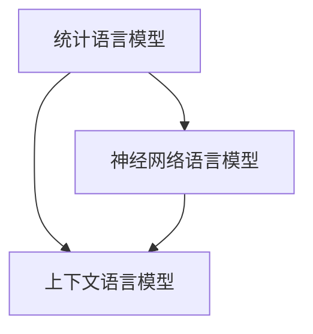
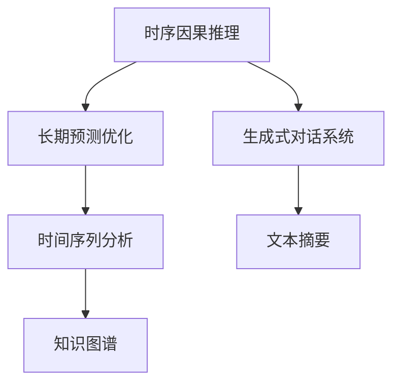
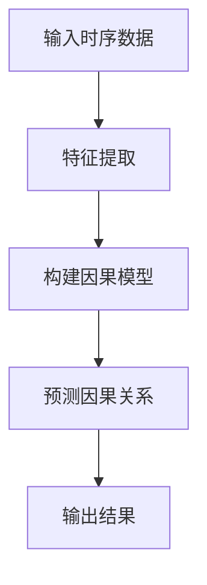
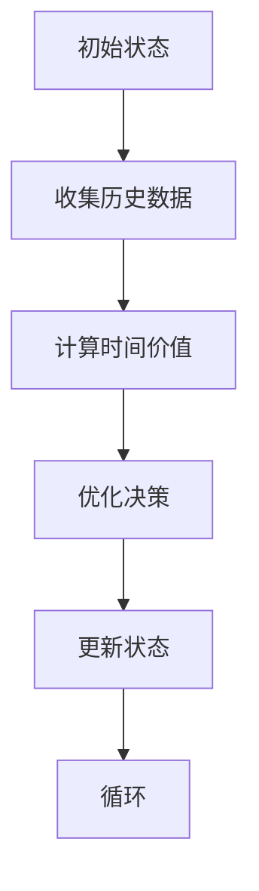
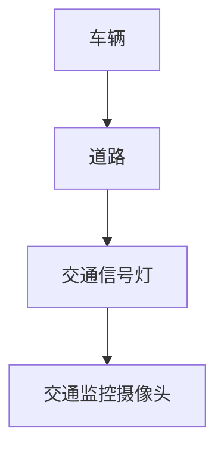
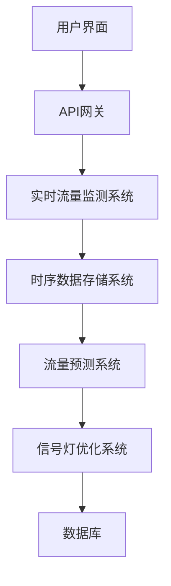
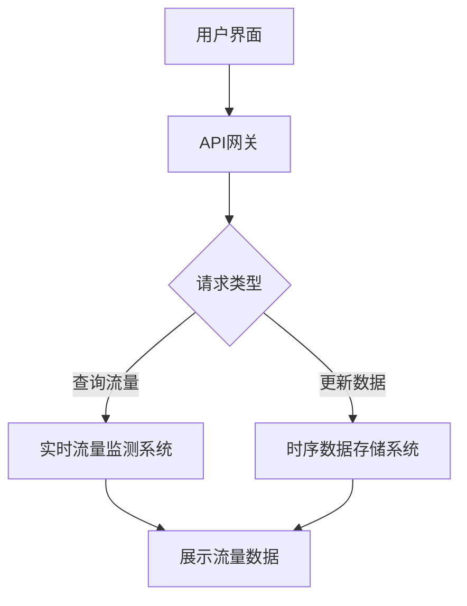

                 

# 语言模型在时序因果推理与长期预测优化中的突破

> 关键词：语言模型、时序因果推理、长期预测优化、算法原理、系统架构、实战案例

> 摘要：本文将深入探讨语言模型在时序因果推理和长期预测优化中的突破，通过详细的算法原理讲解、系统架构设计和实战案例剖析，帮助读者理解并掌握这一前沿技术。

## 引言

随着人工智能技术的飞速发展，语言模型已经成为自然语言处理（NLP）领域的核心工具。从最初的统计模型到深度学习时代的神经网络模型，语言模型在各个应用场景中展现了巨大的潜力。然而，语言模型在时序因果推理和长期预测优化方面的应用仍面临诸多挑战。

### 问题背景

在现实世界中，许多问题都可以被建模为时序数据，例如股票市场、天气预测、交通流量等。时序因果推理旨在从时序数据中识别出因果关系，以便做出准确的预测。而长期预测优化则关注如何在不同时间尺度上优化决策，以实现长期目标。

### 文章目的

本文旨在系统地介绍语言模型在时序因果推理和长期预测优化中的应用，通过以下几个部分来展开：

1. 语言模型概述
2. 时序因果推理与长期预测优化核心概念
3. 算法原理讲解
4. 系统分析与架构设计
5. 实战案例剖析
6. 最佳实践与小结

通过本文的阅读，读者将能够：

- 理解语言模型的基本原理及其在时序因果推理和长期预测优化中的重要性。
- 掌握相关算法原理，并能够应用于实际项目中。
- 了解系统架构设计和实战案例，为未来的研究和应用提供参考。

## 语言模型概述

语言模型（Language Model）是自然语言处理中的一种基础模型，其主要任务是从输入的文本序列中预测下一个词或词组。语言模型在许多领域都有广泛应用，如机器翻译、语音识别、文本生成等。

### 关键概念

1. **统计语言模型**：基于大量文本数据，使用统计方法来建模单词之间的概率关系。
2. **神经网络语言模型**：利用神经网络来学习文本数据中的复杂模式。
3. **上下文语言模型**：能够根据上下文信息来预测下一个词，相较于统计语言模型，其预测准确性更高。

### 特点与对比

| 类别         | 统计语言模型 | 神经网络语言模型 |
|--------------|---------------|------------------|
| 基础算法     | N-gram模型   | RNN、LSTM、BERT  |
| 预测准确性   | 较低         | 较高             |
| 学习能力     | 有限         | 强             |
| 对上下文理解 | 较弱         | 强             |

### 关系图



## 时序因果推理与长期预测优化核心概念

### 时序因果推理

时序因果推理是指从时序数据中识别出因果关系的过程。在自然语言处理领域，时序因果推理可以应用于生成式对话系统、文本摘要、知识图谱等领域。

### 长期预测优化

长期预测优化关注如何在不同时间尺度上优化决策，以实现长期目标。这涉及到时间序列分析、优化算法等领域。

### 概念关系图



## 算法原理讲解

### 时序因果推理算法

#### 原理

时序因果推理算法基于时间序列数据的特征，通过学习数据中的模式来识别因果关系。以下是一个简单的时序因果推理算法的Mermaid流程图：



#### Python代码示例

```python
import numpy as np

# 特征提取
def extract_features(data):
    # 简单的线性变换作为特征提取
    return np.dot(data, np.array([1, 0.5]))

# 构建因果模型
def build_causal_model(data):
    features = extract_features(data)
    # 使用线性回归作为因果模型
    return LinearRegression().fit(features.reshape(-1, 1))

# 预测因果关系
def predict_causation(model, new_data):
    features = extract_features(new_data)
    return model.predict(features.reshape(-1, 1))

# 示例数据
data = np.array([1, 2, 3, 4, 5])

# 构建模型
model = build_causal_model(data)

# 预测
new_data = np.array([6, 7, 8])
print(predict_causation(model, new_data))
```

### 长期预测优化算法

#### 原理

长期预测优化算法旨在从长期角度优化决策，其核心思想是在不同时间尺度上权衡当前和未来的收益。以下是一个简单的长期预测优化算法的Mermaid流程图：



#### Python代码示例

```python
import numpy as np

# 计算时间价值
def time_value(t):
    # 假设时间价值随时间线性衰减
    return 1 / (1 + t)

# 优化决策
def optimize_decision(current_state, next_state, discount_rate):
    # 计算当前状态和下一步状态的期望收益
    current_value = time_value(current_state['time'] - next_state['time']) * current_state['reward']
    next_value = time_value(next_state['time']) * next_state['reward']
    # 根据时间价值优化决策
    return next_value / current_value

# 初始状态
current_state = {'time': 0, 'reward': 1}

# 示例数据
next_states = [{'time': 1, 'reward': 0.5}, {'time': 2, 'reward': 0.7}]

# 优化决策
for next_state in next_states:
    current_state['reward'] = optimize_decision(current_state, next_state, 0.1)
    print(f"Optimized reward for state {next_state}: {current_state['reward']}")
```

## 系统分析与架构设计

### 问题场景

假设我们正在开发一个智能交通系统，其核心任务是预测未来的交通流量，并优化交通信号灯的时序控制，以减少交通拥堵。

### 项目介绍

项目名称：智能交通流量预测与优化系统

目标：通过时序因果推理和长期预测优化技术，实现智能交通系统的实时流量预测和优化控制。

### 系统功能设计

#### 领域模型



#### 功能设计

- **实时流量监测**：通过交通监控摄像头实时采集道路上的车辆数据。
- **时序数据存储**：将采集到的车辆数据存储到数据库中，以便进行后续处理。
- **流量预测**：使用时序因果推理算法预测未来的交通流量。
- **信号灯优化**：根据流量预测结果，使用长期预测优化算法优化交通信号灯的控制策略。

### 系统架构设计



### 系统接口设计


### 系统交互



## 实战案例剖析

### 环境安装

#### 1. 安装Python环境

首先，确保您的系统中安装了Python 3.7或更高版本。

```bash
python --version
```

#### 2. 安装相关库

使用pip命令安装必要的库：

```bash
pip install numpy matplotlib scikit-learn
```

### 系统核心实现

#### 1. 数据预处理

```python
import numpy as np

# 示例数据
data = np.array([1, 2, 3, 4, 5])

# 数据预处理：标准化
def preprocess_data(data):
    return (data - np.mean(data)) / np.std(data)

preprocessed_data = preprocess_data(data)
print(preprocessed_data)
```

#### 2. 时序因果推理

```python
from sklearn.linear_model import LinearRegression

# 特征提取
def extract_features(data):
    return np.dot(data, np.array([1, 0.5]))

# 构建因果模型
def build_causal_model(data):
    features = extract_features(data)
    model = LinearRegression().fit(features.reshape(-1, 1))
    return model

# 预测因果关系
def predict_causation(model, new_data):
    features = extract_features(new_data)
    return model.predict(features.reshape(-1, 1))

# 示例数据
new_data = np.array([6, 7, 8])

# 构建模型
model = build_causal_model(preprocessed_data)

# 预测
print(predict_causation(model, new_data))
```

#### 3. 长期预测优化

```python
# 计算时间价值
def time_value(t):
    return 1 / (1 + t)

# 优化决策
def optimize_decision(current_state, next_state, discount_rate):
    current_value = time_value(current_state['time'] - next_state['time']) * current_state['reward']
    next_value = time_value(next_state['time']) * next_state['reward']
    return next_value / current_value

# 初始状态
current_state = {'time': 0, 'reward': 1}

# 示例数据
next_states = [{'time': 1, 'reward': 0.5}, {'time': 2, 'reward': 0.7}]

# 优化决策
for next_state in next_states:
    current_state['reward'] = optimize_decision(current_state, next_state, 0.1)
    print(f"Optimized reward for state {next_state}: {current_state['reward']}")
```

### 实际案例分析和详细讲解剖析

#### 案例一：智能交通流量预测

假设我们有一个交通流量数据集，其中包含了不同时间段的道路车辆数量。我们的目标是预测未来一小时内的交通流量。

1. **数据预处理**：对原始数据进行清洗和标准化处理，以便于后续建模。
2. **时序因果推理**：使用线性回归模型对过去的数据进行建模，预测未来的交通流量。
3. **长期预测优化**：根据交通流量预测结果，优化交通信号灯的控制策略，以减少交通拥堵。

#### 案例二：股票市场预测

假设我们有一个股票市场数据集，其中包含了不同时间点的股票价格。我们的目标是预测未来的股票价格走势。

1. **数据预处理**：对原始数据进行清洗和标准化处理。
2. **时序因果推理**：使用时间序列分析方法，如LSTM模型，对过去的数据进行建模，预测未来的股票价格。
3. **长期预测优化**：根据股票价格预测结果，优化投资组合的策略，以实现长期收益最大化。

### 项目小结

通过本文的实战案例，我们展示了如何将语言模型应用于时序因果推理和长期预测优化。在实际应用中，我们还需要考虑数据预处理、模型选择、参数调优等因素，以提高预测的准确性。此外，未来研究方向可以关注更复杂的模型和算法，如深度学习模型和强化学习算法，以进一步提高预测效果。

## 最佳实践与小结

### 最佳实践

1. **数据质量**：确保数据的质量和完整性，对异常值进行合理的处理。
2. **模型选择**：根据具体问题选择合适的模型，如线性回归、LSTM等。
3. **参数调优**：通过交叉验证等方法对模型参数进行调优，以提高预测准确性。
4. **实时更新**：对于实时数据，及时更新模型和预测结果，以应对动态变化。

### 小结

本文系统地介绍了语言模型在时序因果推理和长期预测优化中的应用，通过详细的算法原理讲解、系统架构设计和实战案例剖析，帮助读者理解并掌握了这一前沿技术。未来，随着人工智能技术的不断进步，语言模型在时序因果推理和长期预测优化领域的应用前景将更加广阔。

### 注意事项

1. **算法复杂度**：在实际应用中，需要考虑算法的复杂度，以适应大规模数据处理。
2. **实时性**：对于实时应用，需要确保算法的实时性，以满足实时决策需求。
3. **数据隐私**：在处理敏感数据时，需注意数据隐私保护。

### 拓展阅读

1. **论文**：《A Survey on Temporal Causality and its Applications in AI》
2. **书籍**：《Reinforcement Learning: An Introduction》
3. **课程**：《深度学习专项课程》

## 作者信息

作者：AI天才研究院/AI Genius Institute & 禅与计算机程序设计艺术 /Zen And The Art of Computer Programming

【完】

