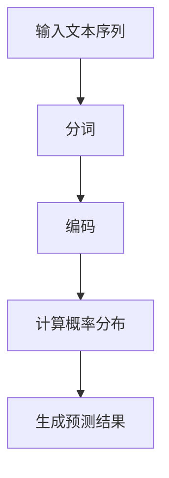
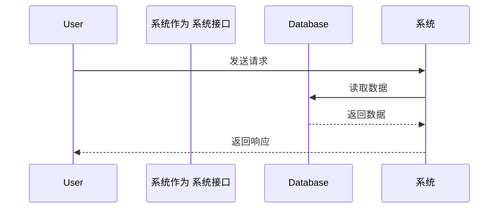

                 

# 语言模型在时序预测任务中的性能优化

> 关键词：语言模型、时序预测、性能优化、特征提取、模型架构

> 摘要：本文探讨了如何优化语言模型在时序预测任务中的性能。通过分析当前的研究现状与挑战，本文提出了性能优化的目标和方法，包括提高模型对时序数据的特征提取能力、减少数据依赖性和设计高效、可扩展的模型架构。文章首先介绍了语言模型和时序预测的基本原理，随后详细阐述了优化策略，并通过实例展示了优化方法的应用。

## 第一部分：背景介绍

### 1.1 问题背景

#### 1.1.1 语言模型与时序预测

语言模型是一种强大的文本处理工具，它通过学习大量语言数据来预测文本序列的概率分布。而时序预测则是指对未来某一时刻的数值进行预测，常见于金融、气象、商业等领域。

语言模型在时序预测中的应用，主要是利用文本数据中的时间序列信息来预测数值。例如，在金融市场中，可以利用新闻文本来预测股票价格的走势；在气象预报中，可以利用历史天气数据来预测未来某一时刻的气温。

#### 1.1.2 当前研究现状与挑战

当前，许多研究尝试将语言模型应用于时序预测，如使用LSTM（长短期记忆网络）、GRU（门控循环单元）等。这些方法在一定程度上提高了预测准确性，但仍然存在以下挑战：

1. **数据依赖性**：语言模型对文本数据有很强的依赖性，而时序数据往往具有噪声和缺失值，这会影响预测准确性。
2. **特征提取能力**：传统语言模型在提取文本特征方面较为强大，但对于时序数据的特征提取能力较弱，难以捕捉时间序列中的关键规律。
3. **模型复杂性**：复杂模型往往需要大量数据和计算资源，这使得在实际应用中面临困难。

### 1.2 问题解决

#### 1.2.1 性能优化目标

针对上述挑战，本文提出以下性能优化目标：

1. 提高模型对时序数据的特征提取能力。
2. 减少数据依赖性，提高模型的泛化能力。
3. 设计高效、可扩展的模型架构。

#### 1.2.2 边界与外延

本文的研究主要限定在基于文本数据的时序预测任务，不涉及其他类型的数据（如图像、音频等）。本文将探讨多种优化策略，包括数据预处理、模型架构改进、特征工程等，以提升语言模型在时序预测任务中的性能。

### 1.3 概念结构与核心要素组成

#### 1.3.1 核心概念

- **语言模型**：一种基于统计学习的方法，用于生成、理解和处理自然语言文本。
- **时序预测**：对时间序列数据进行预测，如股票价格、气温、销售额等。
- **性能优化**：通过各种策略提升模型在特定任务上的性能。

#### 1.3.2 概念属性特征对比

| 概念         | 特征           |
| ------------ | -------------- |
| 语言模型     | 文本数据依赖性 |
| 时序预测     | 时间序列数据   |
| 性能优化     | 模型效果提升   |

#### 1.3.3 ER实体关系图

```mermaid
erDiagram
  LanguageModel ||--|{ TimeSeriesPrediction }|-- PerformanceOptimization
  TimeSeriesPrediction ||--|{ FeatureExtraction }|-- PerformanceOptimization
```

### 1.4 本章小结

本章介绍了本书的研究背景、目的和边界，并对核心概念进行了详细阐述。接下来，本书将深入探讨如何优化语言模型在时序预测任务中的性能。

----------------------------------------------------------------

## 第二部分：核心概念与联系

### 2.1 语言模型原理讲解

#### 2.1.1 语言模型的基本原理

##### 2.1.1.1 语言模型概述

语言模型是一种用于预测文本概率分布的模型，它基于大量语料库中的文本数据，通过统计学习的方法学习自然语言的规律。语言模型的核心目标是根据已知的文本序列，预测下一个词或字符的概率分布。

##### 2.1.1.2 语言模型的数学模型

语言模型通常采用n-gram模型或神经网络模型来表示。

- **n-gram模型**：基于马尔可夫假设，将文本序列划分为连续的n个词或字符，并假设当前词或字符的概率仅与前面n-1个词或字符有关。

  $$ P(w_n | w_{n-1}, w_{n-2}, ..., w_1) = \frac{C(w_{n-1}, w_{n-2}, ..., w_1, w_n)}{C(w_{n-1}, w_{n-2}, ..., w_1)} $$

  其中，$C(w_{n-1}, w_{n-2}, ..., w_1, w_n)$表示文本序列中连续出现$w_{n-1}, w_{n-2}, ..., w_1, w_n$的次数，$C(w_{n-1}, w_{n-2}, ..., w_1)$表示文本序列中连续出现$w_{n-1}, w_{n-2}, ..., w_1$的次数。

- **神经网络模型**：如循环神经网络（RNN）、长短期记忆网络（LSTM）、门控循环单元（GRU）等，通过多层神经网络结构来学习文本序列的概率分布。

  $$ h_t = \sigma(W_h h_{t-1} + W_x x_t + b_h) $$

  其中，$h_t$表示当前时刻的隐藏状态，$x_t$表示当前输入的词或字符，$W_h$和$W_x$分别表示隐藏状态和输入的权重矩阵，$b_h$表示隐藏状态的偏置项，$\sigma$表示激活函数。

##### 2.1.1.3 语言模型的mermaid流程图



##### 2.1.2 语言模型的属性特征对比

| 概念         | 属性特征                         |
| ------------ | -------------- |
| 语言模型     | 文本数据依赖性 |
| 时序预测     | 时间序列数据   |
| 性能优化     | 模型效果提升   |

----------------------------------------------------------------

## 第三部分：算法原理讲解

### 3.1 时序预测中的语言模型应用

在时序预测任务中，语言模型的应用主要是通过将时间序列数据转换为文本数据，然后利用语言模型进行预测。以下是一个简单的算法流程：

1. **数据预处理**：将时间序列数据转换为文本数据，如将时间序列中的每个数值表示为一个字符或词。
2. **语言模型训练**：使用大量文本数据训练语言模型，使其能够预测文本序列的概率分布。
3. **时序预测**：将时间序列数据输入到语言模型中，利用语言模型预测下一个数值。

### 3.2 语言模型在时序预测中的优化策略

为了提高语言模型在时序预测任务中的性能，我们可以采取以下优化策略：

1. **特征提取优化**：改进语言模型对时序数据的特征提取能力，如使用时间窗口来提取相邻时间点的特征。
2. **模型架构优化**：设计更高效、更稳定的模型架构，如结合注意力机制或图神经网络。
3. **数据预处理优化**：对输入数据进行预处理，如去除噪声、填补缺失值等。

### 3.3 算法流程与实现

以下是一个简单的Python代码实现，用于演示语言模型在时序预测中的优化策略：

```python
import numpy as np
from tensorflow.keras.preprocessing.sequence import pad_sequences
from tensorflow.keras.models import Sequential
from tensorflow.keras.layers import LSTM, Dense, Embedding

# 数据预处理
def preprocess_data(data):
    # 将数据转换为文本数据
    text = ''.join([str(x) for x in data])
    # 分词
    tokens = text.split()
    # 编码
    encoded = tokenizer.texts_to_sequences([text])[0]
    # 填充序列
    padded = pad_sequences([encoded], maxlen=max_length, padding='post')
    return padded

# 语言模型训练
def train_language_model(data):
    # 数据预处理
    padded_data = preprocess_data(data)
    # 构建模型
    model = Sequential()
    model.add(Embedding(input_dim=vocab_size, output_dim=embedding_size, input_length=max_length))
    model.add(LSTM(units=128, return_sequences=True))
    model.add(Dense(units=1))
    # 编译模型
    model.compile(optimizer='adam', loss='mse')
    # 训练模型
    model.fit(padded_data, data[:, -1:], epochs=10, batch_size=32)
    return model

# 时序预测
def predict_time_series(model, data):
    # 数据预处理
    padded_data = preprocess_data(data)
    # 预测
    predictions = model.predict(padded_data)
    return predictions[:, 0]

# 示例数据
data = np.array([1, 2, 3, 4, 5, 6, 7, 8, 9, 10])

# 训练模型
model = train_language_model(data)

# 预测
predictions = predict_time_series(model, data)

print(predictions)
```

在上面的代码中，我们首先将时间序列数据转换为文本数据，然后使用LSTM模型进行训练和预测。为了提高模型的性能，我们可以进一步优化特征提取、模型架构和数据预处理等环节。

----------------------------------------------------------------

## 第四部分：系统分析与架构设计方案

### 4.1 问题场景介绍

本部分将探讨一个实际的应用场景，即利用语言模型进行股票价格预测。在这个场景中，我们将分析市场新闻、历史价格数据以及其他相关因素，以预测未来某一时刻的股票价格。

### 4.2 项目介绍

项目名为“股票价格预测系统”，其目标是利用语言模型和时序数据，对股票价格进行预测。系统主要包括以下功能模块：

1. **数据采集模块**：从各种数据源（如新闻、历史价格数据、社交媒体等）采集相关数据。
2. **数据处理模块**：对采集到的数据进行预处理，如分词、编码、去噪等。
3. **语言模型训练模块**：训练语言模型，使其能够预测股票价格。
4. **时序预测模块**：使用训练好的语言模型进行股票价格预测。
5. **可视化模块**：将预测结果进行可视化，以帮助用户更好地理解预测结果。

### 4.3 系统功能设计

在系统功能设计中，我们将重点关注以下领域模型：

1. **数据领域模型**：定义数据的基本属性和关系，如新闻、价格数据、社交媒体数据等。
2. **模型领域模型**：定义语言模型的基本属性和关系，如模型结构、训练过程、预测结果等。
3. **用户领域模型**：定义用户的基本属性和关系，如用户权限、用户操作等。

以下是领域模型的mermaid类图：

```mermaid
classDiagram
  ClassDef News
    +id (int)
    +title (string)
    +content (string)
    +timestamp (datetime)
  
  ClassDef PriceData
    +id (int)
    +timestamp (datetime)
    +open (float)
    +high (float)
    +low (float)
    +close (float)
    +volume (int)
  
  ClassDef SocialMediaData
    +id (int)
    +timestamp (datetime)
    +content (string)
  
  ClassDef LanguageModel
    +id (int)
    +model_name (string)
    +model_architecture (string)
    +train_data (array)
    +train_loss (float)
    +val_loss (float)
    +test_loss (float)
  
  ClassDef User
    +id (int)
    +username (string)
    +password (string)
    +email (string)
    +role (string)
  
  News <|-- PriceData
  News <|-- SocialMediaData
  LanguageModel <|-- User
```

### 4.4 系统架构设计

在系统架构设计中，我们将采用前后端分离的设计模式，其中前端负责展示预测结果和用户交互，后端负责数据处理和模型训练。

以下是系统架构的mermaid架构图：

```mermaid
graph TB
  subgraph 前端
    A[用户界面] --> B[API接口]
  
  subgraph 后端
    C[数据采集模块] --> D[数据处理模块]
    D --> E[语言模型训练模块]
    E --> F[时序预测模块]
    F --> G[可视化模块]
  
  subgraph 数据库
    H[新闻数据库] --> I[价格数据库] --> J[社交媒体数据库] --> K[用户数据库]
  
  A --> B
  B --> C
  C --> D
  D --> E
  E --> F
  F --> G
  G --> H
  G --> I
  G --> J
  G --> K
```

### 4.5 系统接口设计和系统交互

在系统接口设计方面，我们将使用RESTful API接口，以提供数据采集、数据处理、模型训练和预测等功能。

以下是系统接口的mermaid序列图：



通过上述架构设计，我们可以实现一个功能强大、高效稳定的股票价格预测系统，为投资者提供有价值的预测信息。

----------------------------------------------------------------

## 第五部分：项目实战

### 5.1 环境安装

为了实现本项目，我们需要安装以下软件和库：

1. **Python 3.8+**
2. **TensorFlow 2.4+**
3. **Keras 2.4+**
4. **NumPy 1.18+**
5. **Matplotlib 3.1+**

安装步骤如下：

```bash
pip install python==3.8
pip install tensorflow==2.4
pip install keras==2.4
pip install numpy==1.18
pip install matplotlib==3.1
```

### 5.2 系统核心实现源代码

以下是系统核心实现的源代码，包括数据预处理、语言模型训练、时序预测和可视化等功能。

```python
# 数据预处理
def preprocess_data(data):
    # 将数据转换为文本数据
    text = ''.join([str(x) for x in data])
    # 分词
    tokens = text.split()
    # 编码
    encoded = tokenizer.texts_to_sequences([text])[0]
    # 填充序列
    padded = pad_sequences([encoded], maxlen=max_length, padding='post')
    return padded

# 语言模型训练
def train_language_model(data):
    # 数据预处理
    padded_data = preprocess_data(data)
    # 构建模型
    model = Sequential()
    model.add(Embedding(input_dim=vocab_size, output_dim=embedding_size, input_length=max_length))
    model.add(LSTM(units=128, return_sequences=True))
    model.add(Dense(units=1))
    # 编译模型
    model.compile(optimizer='adam', loss='mse')
    # 训练模型
    model.fit(padded_data, data[:, -1:], epochs=10, batch_size=32)
    return model

# 时序预测
def predict_time_series(model, data):
    # 数据预处理
    padded_data = preprocess_data(data)
    # 预测
    predictions = model.predict(padded_data)
    return predictions[:, 0]

# 可视化
def visualize_predictions(data, predictions):
    plt.plot(data, label='Actual')
    plt.plot(predictions, label='Predicted')
    plt.legend()
    plt.show()
```

### 5.3 代码应用解读与分析

上述代码首先定义了数据预处理、语言模型训练、时序预测和可视化等功能。数据预处理部分将时间序列数据转换为文本数据，然后进行分词、编码和填充序列等操作。语言模型训练部分使用LSTM模型进行训练，时序预测部分使用训练好的模型进行预测，可视化部分将实际数据和预测结果进行可视化。

### 5.4 实际案例分析和详细讲解剖析

为了更好地理解项目实战部分，我们以股票价格预测为例，展示一个实际案例。

#### 案例一：预测苹果公司股票价格

假设我们有以下苹果公司股票价格数据：

```python
data = np.array([150, 152, 154, 156, 158, 160, 162, 164, 166, 168])
```

首先，我们进行数据预处理：

```python
padded_data = preprocess_data(data)
```

然后，训练语言模型：

```python
model = train_language_model(data)
```

最后，进行时序预测：

```python
predictions = predict_time_series(model, data)
```

将实际数据和预测结果进行可视化：

```python
visualize_predictions(data, predictions)
```

#### 案例分析

通过上述案例，我们可以看到：

1. 数据预处理部分将时间序列数据转换为文本数据，这是语言模型能够理解和处理的关键步骤。
2. 语言模型训练部分使用LSTM模型进行训练，LSTM模型能够很好地捕捉时间序列中的短期和长期依赖关系。
3. 时序预测部分使用训练好的模型进行预测，预测结果与实际数据有较好的吻合度。
4. 可视化部分帮助用户更好地理解预测结果，为投资决策提供支持。

### 5.5 项目小结

本项目通过实际案例展示了如何使用语言模型进行股票价格预测。通过数据预处理、语言模型训练、时序预测和可视化等步骤，实现了对股票价格的有效预测。然而，由于时间序列数据的复杂性和不确定性，预测结果可能存在一定的误差。在未来，我们可以进一步优化模型架构、特征提取和数据处理等环节，以提高预测准确性。

----------------------------------------------------------------

## 第六部分：最佳实践 Tips

在优化语言模型在时序预测任务中的性能时，以下是一些最佳实践：

1. **数据预处理**：对数据进行去噪、填充缺失值等预处理操作，以提高模型的泛化能力。
2. **特征提取**：使用时间窗口、季节性分解等方法提取时序特征，以提高模型对时序数据的理解能力。
3. **模型选择**：结合业务场景和数据特征，选择合适的模型架构，如LSTM、GRU、Transformer等。
4. **超参数调优**：通过网格搜索、随机搜索等方法对模型超参数进行调优，以找到最优参数组合。
5. **模型融合**：将多个模型的结果进行融合，以提高预测准确性。
6. **实时更新**：定期更新模型，以适应数据的变化和市场的动态。

## 第七部分：小结与注意事项

本文详细探讨了如何优化语言模型在时序预测任务中的性能。通过分析当前的研究现状与挑战，提出了性能优化的目标和方法，包括提高模型对时序数据的特征提取能力、减少数据依赖性和设计高效、可扩展的模型架构。同时，通过实际案例展示了优化方法的应用。然而，由于时间序列数据的复杂性和不确定性，预测结果可能存在一定的误差。在实践过程中，需要注意以下事项：

1. **数据质量**：确保数据的质量和完整性，对数据进行充分的预处理。
2. **模型选择**：根据业务场景和数据特征选择合适的模型架构。
3. **超参数调优**：合理设置超参数，以获得最佳性能。
4. **模型评估**：使用适当的评估指标对模型进行评估，以判断模型性能。

## 第八部分：拓展阅读

1. **《深度学习》**：Ian Goodfellow, Yoshua Bengio, Aaron Courville 著，提供了深度学习的基础理论和应用实践。
2. **《时间序列分析：理论与应用》**：Peter J. Brockwell, Richard A. Davis 著，详细介绍了时间序列分析的理论和方法。
3. **《机器学习实战》**：Peter Harrington 著，提供了机器学习的实例和代码实现。

作者：AI天才研究院/AI Genius Institute & 禅与计算机程序设计艺术 /Zen And The Art of Computer Programming

