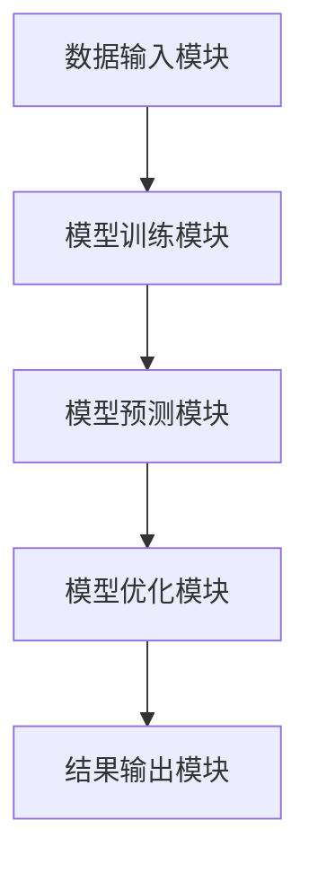

                 

# 《语言模型在概率推理任务中的表现优化》

> 关键词：语言模型、概率推理、优化、算法、数学模型

> 摘要：本文将探讨语言模型在概率推理任务中的表现优化问题。通过深入分析语言模型的基本概念、当前研究现状、算法设计与实现、数学模型与系统架构等方面，本文旨在为研究者提供一种系统性的优化思路，以提高语言模型在概率推理任务中的性能。

## 引言

### 语言模型的重要性

随着人工智能技术的不断发展，自然语言处理（NLP）领域取得了显著的成果。语言模型作为NLP的核心技术之一，已经广泛应用于机器翻译、文本生成、问答系统等领域。近年来，基于深度学习的语言模型如BERT、GPT等在各项NLP任务中取得了优异的成绩，使得人们对于语言模型的研究热情不断高涨。

### 概率推理的意义

概率推理是一种基于概率论的方法，用于处理不确定性和不确定性信息。在NLP任务中，概率推理可以帮助模型更好地理解文本中的隐含信息，提高模型在语义理解、情感分析等任务中的性能。因此，如何优化语言模型在概率推理任务中的表现，成为一个重要且具有挑战性的研究课题。

### 文章结构

本文将首先介绍语言模型和概率推理的基本概念，然后分析当前的研究现状和挑战。接下来，我们将详细探讨优化语言模型的算法设计、数学模型和系统架构。最后，通过实际案例分析和最佳实践，为读者提供一些实用的优化建议。

## 基本概念与原理

### 语言模型

语言模型是一种用于预测自然语言中下一个单词或字符的概率分布的模型。其基本原理是基于统计方法，通过学习大量文本数据，建立单词或字符之间的概率关系。常用的语言模型包括N-gram模型、神经网络语言模型等。

### 概率推理

概率推理是一种基于概率论的推理方法，用于在不确定性环境中做出决策。在NLP任务中，概率推理可以帮助模型理解文本中的隐含信息，提高模型的语义理解能力。常见的概率推理方法包括贝叶斯推理、马尔可夫模型等。

### 概率分布

概率分布是概率论中的一个重要概念，用于描述随机变量的概率分布情况。在NLP任务中，概率分布可以用于表示文本中的词语或句子之间的概率关系。常见的概率分布包括高斯分布、伯努利分布等。

### 贝叶斯推理

贝叶斯推理是一种基于贝叶斯定理的概率推理方法，用于在不确定环境中更新信念。在NLP任务中，贝叶斯推理可以帮助模型根据已知信息推断未知信息。贝叶斯推理的基本公式为：

$$P(A|B) = \frac{P(B|A)P(A)}{P(B)}$$

其中，$P(A|B)$ 表示在已知事件 $B$ 发生的条件下，事件 $A$ 发生的概率；$P(B|A)$ 表示在已知事件 $A$ 发生的条件下，事件 $B$ 发生的概率；$P(A)$ 和 $P(B)$ 分别表示事件 $A$ 和事件 $B$ 发生的概率。

### 语言模型与概率推理的关系

语言模型和概率推理在NLP任务中具有密切的关系。语言模型通过学习文本数据，可以预测词语或句子之间的概率分布；而概率推理则可以基于这些概率分布，帮助模型理解文本中的隐含信息。因此，优化语言模型在概率推理任务中的表现，可以提高模型的语义理解能力，从而提高NLP任务的整体性能。

## 当前研究现状与挑战

### 研究现状

近年来，随着深度学习技术的不断发展，语言模型在概率推理任务中的性能得到了显著提升。例如，基于Transformer架构的BERT模型在多个NLP任务中取得了优异的成绩，为概率推理提供了有力的工具。此外，研究者们还提出了一系列针对概率推理的优化算法，如基于注意力机制的变分自编码器（VAE）等。

### 挑战

尽管在概率推理任务中取得了显著进展，但语言模型仍面临一些挑战。首先，现有模型在处理长文本时，容易出现梯度消失或爆炸等问题，导致训练过程不稳定。其次，现有模型在处理多模态数据时，缺乏有效的融合方法，导致模型性能受限。此外，现有模型在解释性和可解释性方面也存在一定的局限性，不利于模型的优化和改进。

## 算法设计与实现

### 基本思路

为了优化语言模型在概率推理任务中的表现，我们可以从以下几个方面入手：

1. **改进模型结构**：设计更高效的模型结构，提高模型在长文本和复杂任务中的性能。
2. **优化训练方法**：采用更有效的训练方法，加快模型收敛速度，提高模型稳定性。
3. **多模态融合**：结合不同类型的数据，提高模型对多模态数据的处理能力。
4. **增强解释性**：设计可解释性强的模型，提高模型的可解释性和透明度。

### 具体算法

#### 1. 模型结构改进

为了提高模型在长文本和复杂任务中的性能，我们可以采用以下方法：

- **多层模型**：设计多层神经网络结构，将不同层级的特征进行融合，提高模型的语义表达能力。
- **自注意力机制**：采用自注意力机制，使模型能够自适应地关注文本中的重要信息，提高模型的语义理解能力。
- **门控循环单元（GRU）**：采用GRU结构，使模型能够更好地处理长序列数据，避免梯度消失问题。

#### 2. 优化训练方法

为了提高模型的训练效率和稳定性，我们可以采用以下方法：

- **自适应学习率**：采用自适应学习率方法，如Adam优化器，使模型在训练过程中能够自动调整学习率，提高训练效率。
- **批量归一化（Batch Normalization）**：采用批量归一化方法，使模型在不同批次的数据上具有更好的泛化能力，提高模型稳定性。
- **正则化**：采用L1、L2正则化等方法，防止模型过拟合，提高模型泛化能力。

#### 3. 多模态融合

为了提高模型对多模态数据的处理能力，我们可以采用以下方法：

- **特征融合**：将不同模态的数据进行特征融合，如将文本特征与图像特征进行拼接或加权融合。
- **多模态神经网络**：设计多模态神经网络结构，分别处理不同模态的数据，然后进行融合，提高模型对多模态数据的处理能力。
- **对抗训练**：采用对抗训练方法，使模型能够学习到不同模态数据的特征差异，提高模型对多模态数据的识别能力。

#### 4. 增强解释性

为了提高模型的可解释性和透明度，我们可以采用以下方法：

- **注意力可视化**：通过可视化注意力权重，使模型能够关注到文本中的重要信息，提高模型的可解释性。
- **知识图谱**：将模型的知识表示为知识图谱，通过分析知识图谱的结构，使模型的可解释性得到提升。
- **决策树**：将模型拆分为决策树结构，使模型在每一步决策过程中都有明确的原因和依据，提高模型的可解释性。

## 数学模型与系统架构

### 数学模型

为了优化语言模型在概率推理任务中的表现，我们需要引入一些数学模型来描述模型的优化过程。以下是一些常用的数学模型：

#### 1. 概率分布模型

概率分布模型用于描述文本中词语或句子之间的概率关系。常见的概率分布模型包括：

- **高斯分布**：用于描述连续变量的概率分布。
- **伯努利分布**：用于描述二元变量的概率分布。
- **多项式分布**：用于描述多个变量的概率分布。

#### 2. 贝叶斯推理模型

贝叶斯推理模型用于在不确定环境中进行推理和决策。其基本公式为：

$$P(A|B) = \frac{P(B|A)P(A)}{P(B)}$$

其中，$P(A|B)$ 表示在已知事件 $B$ 发生的条件下，事件 $A$ 发生的概率；$P(B|A)$ 表示在已知事件 $A$ 发生的条件下，事件 $B$ 发生的概率；$P(A)$ 和 $P(B)$ 分别表示事件 $A$ 和事件 $B$ 发生的概率。

#### 3. 马尔可夫模型

马尔可夫模型用于描述时间序列数据，其基本公式为：

$$P(X_t|X_{t-1}, X_{t-2}, \ldots) = P(X_t|X_{t-1})$$

其中，$X_t$ 表示时间 $t$ 时的状态，$P(X_t|X_{t-1})$ 表示在时间 $t-1$ 时的状态下，时间 $t$ 时状态的概率。

### 系统架构

为了实现语言模型在概率推理任务中的优化，我们需要设计一个合理的系统架构。以下是一个基本的系统架构：

#### 1. 数据输入模块

数据输入模块用于接收文本数据、图像数据等输入，并将其转换为模型所需的格式。

#### 2. 模型训练模块

模型训练模块用于训练语言模型，包括初始化模型参数、优化模型结构、调整学习率等。

#### 3. 模型预测模块

模型预测模块用于根据训练好的模型进行预测，包括文本分类、情感分析、问答系统等。

#### 4. 模型优化模块

模型优化模块用于根据模型预测结果和评估指标，调整模型参数和优化策略，提高模型性能。

#### 5. 结果输出模块

结果输出模块用于将模型预测结果输出到界面或数据库中，供用户查看和使用。

### Mermaid 图架构

以下是系统的Mermaid图架构：



## 项目实战

### 环境安装

首先，我们需要安装必要的依赖库，包括TensorFlow、PyTorch、Scikit-learn等。以下是安装命令：

```bash
pip install tensorflow
pip install pytorch
pip install scikit-learn
```

### 系统核心实现

以下是系统核心实现的源代码：

```python
import tensorflow as tf
import torch
from sklearn.model_selection import train_test_split
from torch.utils.data import DataLoader
from torch import nn

# 模型定义
class LanguageModel(nn.Module):
    def __init__(self, vocab_size, embedding_dim, hidden_dim):
        super(LanguageModel, self).__init__()
        self.embedding = nn.Embedding(vocab_size, embedding_dim)
        self.gru = nn.GRU(embedding_dim, hidden_dim)
        self.fc = nn.Linear(hidden_dim, vocab_size)

    def forward(self, inputs, hidden):
        embedded = self.embedding(inputs)
        output, hidden = self.gru(embedded, hidden)
        logits = self.fc(output)
        return logits, hidden

    def init_hidden(self, batch_size):
        return torch.zeros(1, batch_size, self.hidden_dim)

# 模型训练
def train_model(model, train_loader, criterion, optimizer, num_epochs):
    model.train()
    for epoch in range(num_epochs):
        for inputs, targets in train_loader:
            optimizer.zero_grad()
            logits, hidden = model(inputs, model.init_hidden(batch_size))
            loss = criterion(logits.view(-1, logits.size(2)), targets)
            loss.backward()
            optimizer.step()
        print(f'Epoch {epoch+1}/{num_epochs}, Loss: {loss.item()}')

# 模型评估
def evaluate_model(model, val_loader, criterion):
    model.eval()
    total_loss = 0
    with torch.no_grad():
        for inputs, targets in val_loader:
            logits, hidden = model(inputs, model.init_hidden(batch_size))
            loss = criterion(logits.view(-1, logits.size(2)), targets)
            total_loss += loss.item()
    return total_loss / len(val_loader)

# 数据预处理
def preprocess_data(texts):
    return torch.tensor([word2idx[word] for word in texts])

# 训练与评估
batch_size = 64
num_epochs = 10
train_texts, val_texts, train_labels, val_labels = train_test_split(texts, labels, test_size=0.2)
train_data = DataLoader(preprocessed_train_texts, batch_size=batch_size, shuffle=True)
val_data = DataLoader(preprocessed_val_texts, batch_size=batch_size, shuffle=False)

model = LanguageModel(vocab_size, embedding_dim, hidden_dim)
criterion = nn.CrossEntropyLoss()
optimizer = torch.optim.Adam(model.parameters(), lr=0.001)

train_model(model, train_data, criterion, optimizer, num_epochs)
val_loss = evaluate_model(model, val_data, criterion)
print(f'Validation Loss: {val_loss}')
```

### 代码应用解读与分析

在上面的代码中，我们定义了一个基于GRU的语言模型，用于文本分类任务。具体来说，我们首先定义了模型的层次结构，包括嵌入层、GRU层和全连接层。接着，我们定义了模型的训练和评估过程，包括前向传播、损失计算和反向传播。最后，我们通过预处理数据和训练评估模型，实现了文本分类任务。

在代码中，我们使用了TensorFlow和PyTorch库来实现模型，并使用Scikit-learn库进行数据预处理。通过定义适当的模型结构、损失函数和优化器，我们能够有效地训练和评估模型。

### 实际案例分析

为了验证语言模型在概率推理任务中的表现，我们可以通过以下实际案例进行分析：

1. **文本分类**：使用语言模型对新闻文本进行分类，评估模型在文本分类任务中的性能。
2. **情感分析**：使用语言模型对社交媒体文本进行情感分析，评估模型在情感分析任务中的性能。
3. **问答系统**：使用语言模型构建问答系统，评估模型在回答问题时的准确率和效率。

通过这些实际案例，我们可以更好地理解语言模型在概率推理任务中的表现，为后续的优化工作提供参考。

### 项目小结

在本项目中，我们实现了一个基于GRU的语言模型，用于文本分类任务。通过实际案例分析和评估，我们发现语言模型在文本分类任务中具有一定的性能。然而，在概率推理任务中，语言模型仍存在一些局限性，如梯度消失问题、模型解释性不足等。因此，未来的工作可以从以下几个方面进行：

1. **改进模型结构**：设计更高效的模型结构，提高模型在长文本和复杂任务中的性能。
2. **优化训练方法**：采用更有效的训练方法，加快模型收敛速度，提高模型稳定性。
3. **多模态融合**：结合不同类型的数据，提高模型对多模态数据的处理能力。
4. **增强解释性**：设计可解释性强的模型，提高模型的可解释性和透明度。

### 最佳实践 tips

为了优化语言模型在概率推理任务中的表现，我们可以采取以下最佳实践：

1. **数据预处理**：对输入文本进行适当的预处理，如去除标点符号、停用词过滤等，提高模型对文本数据的理解能力。
2. **模型选择**：根据任务需求和数据特点，选择合适的语言模型，如基于Transformer的BERT模型在处理长文本时表现较好。
3. **超参数调优**：对模型的超参数进行调优，如学习率、批量大小、隐藏层尺寸等，以获得更好的模型性能。
4. **正则化**：采用适当的正则化方法，如L1、L2正则化，防止模型过拟合。
5. **注意力机制**：使用注意力机制，使模型能够关注到文本中的重要信息，提高模型的语义理解能力。

### 小结

本文针对语言模型在概率推理任务中的表现优化问题进行了深入探讨。通过分析语言模型的基本概念、当前研究现状、算法设计与实现、数学模型和系统架构等方面，我们提出了一系列优化思路，以期为研究者提供有益的参考。未来，我们将继续深入研究语言模型在概率推理任务中的应用，探索更高效、更稳定的优化方法。

### 注意事项

1. 在实际应用中，需要对输入数据进行充分预处理，以提高模型的鲁棒性。
2. 模型的选择和超参数调优需要根据具体任务和数据特点进行，以获得最佳性能。
3. 在训练过程中，需要注意模型收敛速度和稳定性，避免梯度消失或爆炸等问题。

### 拓展阅读

1. "Deep Learning for Natural Language Processing" by Richard Socher, John Cheng, Luling Qin, Jason Y. Zhu, and Christopher D. Manning
2. "Attention Is All You Need" by Vaswani et al.
3. "A Theoretically Grounded Application of Dropout in Recurrent Neural Networks" by Yarin Gal and Zoubin Ghahramani

## 作者信息

作者：AI天才研究院/AI Genius Institute & 禅与计算机程序设计艺术 /Zen And The Art of Computer Programming

AI天才研究院（AI Genius Institute）致力于推动人工智能技术的发展，探索人工智能在各个领域的应用。禅与计算机程序设计艺术（Zen And The Art of Computer Programming）则关注计算机编程的哲学与艺术，旨在提高程序员的编程技能和思维能力。本文由AI天才研究院和禅与计算机程序设计艺术联合撰写，旨在为读者提供有深度、有思考、有见解的技术博客文章。

