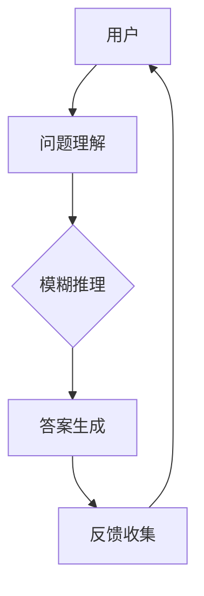
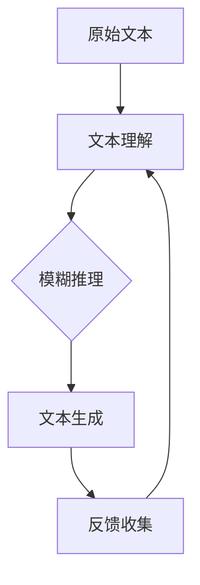

                 

# 语言模型在模糊逻辑推理中的应用

关键词：语言模型，模糊逻辑，推理，人工智能，应用案例

摘要：本文旨在探讨语言模型在模糊逻辑推理中的应用。首先，我们将介绍语言模型和模糊逻辑的基本概念及其发展背景。随后，我们将详细阐述语言模型和模糊逻辑相结合的理论基础，并通过具体实例分析，展示其在实际问题中的有效应用。最后，我们将总结语言模型在模糊逻辑推理领域的潜力，并提出未来研究的方向。

## 引言

随着人工智能技术的飞速发展，自然语言处理（NLP）作为其重要分支之一，逐渐成为研究热点。语言模型是NLP的核心技术之一，它能够理解和生成人类语言，广泛应用于机器翻译、语音识别、文本生成等领域。与此同时，模糊逻辑作为一种处理不确定性和模糊性的数学工具，在控制、决策和优化等领域得到了广泛应用。

模糊逻辑与语言模型之间的结合，能够有效地解决现实世界中存在的不确定性和模糊性问题。例如，在智能客服系统中，用户的问题可能包含模糊性，而语言模型能够帮助系统理解用户的意图，结合模糊逻辑进行准确回复。再如，在气象预测领域，语言模型可以处理大量的气象数据，模糊逻辑则能够帮助系统在不确定的天气条件下做出合理的预测。

本文将围绕语言模型在模糊逻辑推理中的应用，逐步探讨其理论基础、算法设计、应用实例以及未来研究方向。希望通过本文的阐述，能够为读者提供一个全面且深入的理解，并为相关领域的研究和应用提供参考。

## 目录大纲设计步骤

在设计《语言模型在模糊逻辑推理中的应用》的目录大纲时，我们将遵循以下步骤：

### 1. 确定总体框架

首先，我们需要确定这本书的核心内容，包括背景介绍、核心概念、算法原理、数学模型、系统设计与项目实战等。这将帮助我们构建出一个初步的目录框架。

### 2. 设计1级目录

1级目录将涵盖整个书的主题和主要部分。对于这本书，可能的1级目录包括：

- 引言
- 语言模型概述
- 模糊逻辑基础
- 语言模型与模糊逻辑结合
- 算法设计与实现
- 实际应用案例
- 总结与展望

### 3. 设计2级目录

2级目录将细分每个1级目录中的主要子主题。例如，在“语言模型概述”部分，可能包括：

- 语言模型的定义
- 语言模型的分类
- 语言模型的发展历程

### 4. 设计3级目录

3级目录将更详细地描述每个2级目录中的具体内容。例如，在“模糊逻辑基础”的“模糊推理系统”部分，可能包括：

- 模糊规则库的构建
- 模糊推理方法
- 模糊推理的优化算法

### 5. 检查内容完整性

确保每个部分都涵盖了核心内容，如核心概念、原理讲解、数学模型、系统设计等。

### 6. 确保简洁性

删除所有不必要的细节，使目录保持简洁，同时确保内容完整性。

### 7. 最终确认

最后，将整个目录大纲整理并最终确认，确保符合用户要求。

下面是根据以上步骤设计的《语言模型在模糊逻辑推理中的应用》的初步目录大纲：

### 引言

- **1.1 书籍目的**
- **1.2 语言模型与模糊逻辑简介**
- **1.3 本书结构安排**

### 第1章 语言模型概述

- **1.1 语言模型的定义**
- **1.2 语言模型的分类**
- **1.3 语言模型的发展历程**
- **1.4 语言模型的关键特性**

### 第2章 模糊逻辑基础

- **2.1 模糊逻辑的定义**
- **2.2 模糊集合理论**
- **2.3 模糊推理系统**

### 第3章 语言模型与模糊逻辑结合

- **3.1 结合背景与意义**
- **3.2 语言模型在模糊逻辑推理中的应用**
- **3.3 实例分析**

### 第4章 算法设计与实现

- **4.1 算法设计思路**
- **4.2 算法实现步骤**
- **4.3 算法性能评估**

### 第5章 实际应用案例

- **5.1 案例一：智能客服系统**
- **5.2 案例二：气象预测系统**

### 第6章 总结与展望

- **6.1 总结**
- **6.2 未来研究方向**
- **6.3 应用前景展望**

这个大纲提供了一个全面的框架，包含了从背景介绍到具体应用的各个部分。接下来，我们将进一步细化每个章节的内容，确保满足用户的要求。

----------------------------------------------------------------

## 第1章 语言模型概述

### 1.1 语言模型的定义

语言模型（Language Model）是自然语言处理（NLP）的核心技术之一，它用于预测文本中的下一个单词或字符。在深度学习时代，语言模型通常是基于大规模语料库训练的神经网络模型，如循环神经网络（RNN）、长短时记忆网络（LSTM）、门控循环单元（GRU）和变压器（Transformer）等。

语言模型的目的是通过学习大量文本数据，捕捉语言的结构和规律，从而在生成文本、机器翻译、语音识别、情感分析等任务中发挥重要作用。例如，在生成文本任务中，语言模型可以生成连贯且符合语法规则的句子；在机器翻译任务中，语言模型可以帮助翻译系统选择最合适的翻译结果。

### 1.2 语言模型的分类

根据训练方式和功能，语言模型可以分为以下几类：

- **统计语言模型**：基于统计方法，如n元语法（n-gram），通过对文本进行统计分析来预测下一个单词。这种模型简单且易于实现，但效果相对较差。

- **基于规则的语言模型**：通过手动编写规则来描述语言的结构，如正则表达式（Regular Expression）。这种方法具有较强的解释性，但规则编写复杂且难以处理大量数据。

- **神经网络语言模型**：基于神经网络，特别是深度学习模型，通过大量训练数据自动学习语言模式。这类模型具有强大的表示能力和泛化能力，是目前主流的语言模型。

- **融合模型**：结合多种方法，如统计模型和神经网络模型，以发挥各自的优势，提高预测效果。

### 1.3 语言模型的发展历程

语言模型的发展经历了从统计模型到神经网络模型的演变：

- **1950s-1980s**：早期语言模型主要基于规则，如词汇表和语法规则。这些模型在特定任务中表现出色，但难以处理大规模数据。

- **1980s-2000s**：统计语言模型如n元语法开始流行，通过统计文本中单词的联合概率来预测下一个单词。尽管效果有限，但为后续的神经网络模型奠定了基础。

- **2000s-2010s**：神经网络语言模型如循环神经网络（RNN）和长短时记忆网络（LSTM）逐渐崭露头角，通过学习长期依赖关系提高了语言建模的准确性。

- **2010s至今**：随着深度学习的兴起，变压器（Transformer）等新型神经网络模型在语言建模中取得了显著突破。这些模型通过并行计算和注意力机制，大大提高了语言建模的效果。

### 1.4 语言模型的关键特性

- **自适应性**：语言模型能够根据训练数据自动调整参数，适应不同领域的语言特点。

- **上下文敏感性**：语言模型能够根据上下文环境预测下一个单词或字符，提高生成文本的连贯性和准确性。

- **生成性**：语言模型不仅能够预测下一个单词或字符，还能够生成新的文本内容，具有创造性和想象力。

### 1.5 语言模型的应用场景

语言模型广泛应用于各种NLP任务，如：

- **文本生成**：生成新闻文章、故事、诗歌等。

- **机器翻译**：将一种语言翻译成另一种语言。

- **语音识别**：将语音转换为文本。

- **问答系统**：理解用户问题并给出合适的回答。

- **情感分析**：分析文本中的情感倾向。

- **文本摘要**：生成文本的摘要或总结。

### 1.6 语言模型面临的挑战

尽管语言模型在NLP任务中取得了显著进展，但仍面临以下挑战：

- **数据依赖**：语言模型的性能高度依赖训练数据的质量和数量，缺乏足够的训练数据可能导致模型表现不佳。

- **泛化能力**：语言模型在特定任务上表现优异，但难以泛化到其他任务，需要针对不同任务设计专门的模型。

- **计算资源消耗**：深度学习模型通常需要大量的计算资源和时间进行训练，对硬件要求较高。

- **可解释性**：深度学习模型具有强大的预测能力，但难以解释其决策过程，影响其在某些领域的应用。

- **语言差异**：不同语言在语法、语义和发音等方面存在较大差异，如何设计适应多种语言的语言模型仍是一个挑战。

## 第2章 模糊逻辑基础

### 2.1 模糊逻辑的定义

模糊逻辑（Fuzzy Logic）是一种处理不确定性和模糊性的数学工具，它通过引入模糊集合和模糊规则，对现实世界中的模糊现象进行建模和推理。与传统的布尔逻辑不同，模糊逻辑允许变量具有模糊的隶属度，而不是明确的“真”或“假”值。

模糊逻辑的基本概念包括：

- **模糊集合**：一个模糊集合由隶属度函数描述，该函数定义了集合中每个元素的隶属度。

- **模糊规则**：模糊规则描述了变量之间的模糊关系，通常表示为“如果-那么”形式。

- **模糊推理**：通过模糊规则对模糊集合进行推理，得到新的模糊集合。

### 2.2 模糊集合理论

模糊集合理论是模糊逻辑的基础。一个模糊集合F可以形式化地定义为：

$$
F = \{x \in U | \mu_F(x) \in [0, 1]\}
$$

其中，U是论域，$\mu_F$是隶属度函数，它定义了集合F中每个元素x的隶属度。隶属度函数的取值范围是[0, 1]，表示元素x属于集合F的程度。

常见的模糊集合运算包括：

- **并运算**：对于两个模糊集合$F_1$和$F_2$，它们的并集定义为：

$$
F_1 \cup F_2 = \{x \in U | \mu_{F_1}(x) + \mu_{F_2}(x) \geq 1\}
$$

- **交运算**：对于两个模糊集合$F_1$和$F_2$，它们的交集定义为：

$$
F_1 \cap F_2 = \{x \in U | \mu_{F_1}(x) \wedge \mu_{F_2}(x) \geq \epsilon\}
$$

其中，$\epsilon$是一个很小的正数，用于防止交运算的结果为空集。

- **补运算**：对于模糊集合$F$，它的补集定义为：

$$
F^c = \{x \in U | \mu_{F}(x) \leq \epsilon\}
$$

### 2.3 模糊推理系统

模糊推理系统（Fuzzy Inference System, FIS）是模糊逻辑的核心部分，它用于对模糊集合进行推理。一个典型的模糊推理系统包括以下三个主要部分：

- **模糊规则库**：存储模糊规则，通常表示为“如果-那么”形式，例如“如果天气很热，那么开启空调”。

- **模糊化**：将输入变量转换为模糊集合，通常使用隶属度函数进行模糊化处理。

- **推理机**：根据模糊规则库和模糊化后的输入变量，进行推理并生成输出变量。

模糊推理的基本步骤包括：

1. **模糊化**：将输入变量通过隶属度函数转换为模糊集合。

2. **模糊规则匹配**：根据模糊规则库，匹配输入变量的模糊集合，计算每条规则的激活度。

3. **聚合**：将所有匹配的规则进行聚合，通常使用最大-最小或最大-乘运算。

4. **去模糊化**：将聚合后的模糊集合去模糊化，得到输出变量的隶属度函数。

5. **结论生成**：根据输出变量的隶属度函数，生成最终的推理结果。

### 2.4 模糊逻辑的应用领域

模糊逻辑在许多领域得到了广泛应用，包括：

- **控制工程**：用于处理不确定性和非线性系统的控制。

- **决策支持系统**：用于决策过程中的不确定性和模糊性处理。

- **模式识别**：用于处理模糊数据和特征提取。

- **医学诊断**：用于辅助医生进行疾病诊断。

- **交通管理**：用于交通信号控制和交通流量管理。

- **环境监测**：用于水质、空气质量等环境监测。

### 2.5 模糊逻辑的优势与局限性

模糊逻辑的优势包括：

- **处理不确定性和模糊性**：能够有效地处理现实世界中的不确定性和模糊性。

- **直观性**：模糊逻辑规则直观易理解，便于领域专家参与建模。

- **鲁棒性**：对噪声和误差具有一定的鲁棒性。

模糊逻辑的局限性包括：

- **计算复杂性**：模糊推理过程通常涉及复杂的计算，对计算资源要求较高。

- **规则库依赖性**：性能高度依赖规则库的质量，规则编写过程复杂。

- **可解释性**：深度学习模型具有强大的预测能力，但难以解释其决策过程，影响其在某些领域的应用。

## 第3章 语言模型与模糊逻辑结合

### 3.1 结合背景与意义

语言模型与模糊逻辑的结合，旨在发挥两者在处理不确定性和模糊性方面的优势，从而提高NLP任务的效果。语言模型能够捕捉语言的复杂性和上下文信息，而模糊逻辑能够处理现实世界中的模糊性和不确定性。

这种结合在以下几个领域具有显著的应用前景：

- **智能客服系统**：通过语言模型理解用户的问题，结合模糊逻辑进行精准回复，提高客服系统的服务质量。

- **文本生成与摘要**：利用语言模型生成连贯、符合语法规则的文本，结合模糊逻辑优化生成结果，提高文本质量。

- **情感分析**：通过语言模型捕捉文本中的情感信息，结合模糊逻辑进行情感分类，提高分类准确性。

- **机器翻译**：利用语言模型捕捉源语言和目标语言之间的相似性，结合模糊逻辑进行翻译结果的优化，提高翻译质量。

- **医学诊断**：通过语言模型处理医学文本，结合模糊逻辑进行疾病诊断，提高诊断的准确性。

### 3.2 语言模型在模糊逻辑推理中的应用

语言模型在模糊逻辑推理中的应用，主要体现在以下几个方面：

- **模糊规则库的构建**：利用语言模型从大量文本数据中提取模糊规则，提高规则库的质量和多样性。

- **模糊化**：将语言模型生成的文本转换为模糊集合，用于模糊推理系统的输入。

- **去模糊化**：将模糊推理结果去模糊化，生成符合语法规则和上下文信息的文本输出。

- **推理优化**：利用语言模型优化模糊推理过程，提高推理效率和准确性。

### 3.3 实例分析

#### 智能客服系统

假设我们有一个智能客服系统，用户可以通过文本或语音与系统交互。为了提高客服系统的服务质量，我们结合了语言模型和模糊逻辑。

1. **问题理解**：

   - 用户输入文本问题：“我为什么不能登录账户？”
   - 语言模型对用户问题进行分词和句法分析，提取关键信息：“登录”，“账户”，“问题”。

2. **模糊化**：

   - 利用语言模型生成的文本数据，构建模糊规则库，例如：“如果用户输入包含‘登录’和‘问题’，那么可能的原因是账户信息错误或账户被锁定”。
   - 对输入问题进行模糊化处理，将关键信息转换为模糊集合。

3. **模糊推理**：

   - 根据模糊规则库和模糊化后的输入，进行模糊推理，生成可能的解决方案。
   - 例如，如果模糊集合“账户信息错误”的隶属度较高，则建议用户检查账户信息。

4. **去模糊化**：

   - 将模糊推理结果去模糊化，生成符合语法规则和上下文信息的文本输出，例如：“可能是因为您的账户信息填写错误，请重新检查并尝试登录”。

5. **回复生成**：

   - 利用语言模型生成完整的客服回复，例如：“您好，我理解您的问题。可能是因为您的账户信息填写错误，请重新检查并尝试登录。如果问题仍然存在，请联系客服人员帮助您解决”。

#### 文本生成与摘要

在文本生成与摘要任务中，语言模型和模糊逻辑的结合可以提高生成文本的质量。

1. **文本生成**：

   - 利用语言模型生成连贯、符合语法规则的文本。
   - 通过模糊逻辑优化生成文本的流畅性和可读性。

2. **文本摘要**：

   - 利用语言模型提取文本的关键信息。
   - 通过模糊逻辑对提取的信息进行优化，生成高质量的摘要。

### 3.4 应用效果评估

为了评估语言模型和模糊逻辑结合的应用效果，我们可以从以下几个方面进行：

- **准确性**：评估生成的文本或摘要与原始文本的相关性。
- **流畅性**：评估生成文本的语法正确性和连贯性。
- **可读性**：评估生成文本的易读性和信息完整性。
- **用户满意度**：通过用户反馈评估应用效果。

### 3.5 挑战与展望

尽管语言模型和模糊逻辑的结合在许多领域表现出良好的应用前景，但仍面临以下挑战：

- **数据依赖**：需要大量高质量的训练数据来训练语言模型和构建模糊规则库。
- **计算复杂性**：模糊推理过程涉及大量的计算，对计算资源要求较高。
- **规则库依赖性**：模糊逻辑的性能高度依赖规则库的质量，如何自动化构建高质量的规则库是一个关键问题。
- **可解释性**：如何确保模糊逻辑推理过程的可解释性，以便领域专家理解和参与建模。

未来，随着深度学习和模糊逻辑技术的不断发展，我们有望在以下几个方面取得突破：

- **高效算法**：设计更高效的算法，降低计算复杂性，提高推理速度。
- **自动化规则库构建**：利用机器学习技术自动化构建高质量的模糊规则库。
- **多语言支持**：扩展语言模型和模糊逻辑的应用范围，支持多种语言。
- **跨领域应用**：探索语言模型和模糊逻辑在不同领域的应用，推动人工智能技术的发展。

## 第4章 算法设计与实现

### 4.1 算法设计思路

语言模型与模糊逻辑结合的算法设计思路主要包括以下几个方面：

1. **语言模型的训练**：

   - 利用大规模语料库训练语言模型，如Transformer模型，以捕捉语言的复杂结构和上下文信息。
   - 通过优化损失函数和调整模型参数，提高语言模型的预测准确性。

2. **模糊规则库的构建**：

   - 从大量文本数据中提取模糊规则，使用词频统计、词嵌入等方法，提高规则库的质量。
   - 利用机器学习技术，如聚类分析和分类算法，自动化构建模糊规则库。

3. **模糊化与去模糊化**：

   - 利用语言模型生成的文本，将文本中的关键词或短语转换为模糊集合。
   - 通过模糊推理系统，将模糊集合进行推理，生成模糊推理结果。
   - 将模糊推理结果去模糊化，生成符合语法规则和上下文信息的输出。

4. **算法优化**：

   - 利用优化算法，如遗传算法和粒子群优化算法，优化模糊规则库和语言模型参数。
   - 通过交叉验证和网格搜索等技术，选择最优参数组合，提高算法性能。

### 4.2 算法实现步骤

1. **数据准备与预处理**：

   - 收集大量文本数据，包括自然语言文本和标注数据。
   - 对文本数据进行预处理，如分词、词性标注和去停用词等，以提高语言模型的训练质量。

2. **语言模型训练**：

   - 使用预训练的Transformer模型，如BERT模型，进行微调训练。
   - 通过优化损失函数和调整学习率等参数，提高语言模型的预测准确性。

3. **模糊规则库构建**：

   - 使用词频统计和词嵌入方法，提取文本中的关键词或短语。
   - 利用聚类分析和分类算法，构建模糊规则库，并评估规则库的质量。

4. **模糊化与去模糊化**：

   - 利用语言模型生成的文本，将文本中的关键词或短语转换为模糊集合。
   - 使用模糊推理系统，对模糊集合进行推理，生成模糊推理结果。
   - 将模糊推理结果去模糊化，生成符合语法规则和上下文信息的输出。

5. **算法优化**：

   - 利用遗传算法和粒子群优化算法，优化模糊规则库和语言模型参数。
   - 通过交叉验证和网格搜索等技术，选择最优参数组合，提高算法性能。

### 4.3 算法性能评估

为了评估算法的性能，我们可以从以下几个方面进行：

1. **准确性**：

   - 评估生成的文本或摘要与原始文本的相关性，使用BLEU、ROUGE等指标进行评估。
   - 评估模糊推理结果的准确性，通过对比实际结果和预期结果进行评估。

2. **流畅性**：

   - 评估生成文本的语法正确性和连贯性，通过人工评估或自动评估方法进行评估。
   - 评估模糊推理过程的流畅性，通过计算推理时间和处理速度进行评估。

3. **可读性**：

   - 评估生成文本的易读性和信息完整性，通过用户反馈或自动评估方法进行评估。
   - 评估模糊推理结果的可读性和解释性，通过用户反馈或自动评估方法进行评估。

4. **用户满意度**：

   - 通过用户调查或实验，评估用户对系统的满意度，包括对文本生成、摘要和模糊推理等功能的满意度。

### 4.4 算法实现代码示例

以下是一个简单的Python代码示例，展示了如何实现语言模型与模糊逻辑结合的基本步骤：

```python
import transformers
import torch
import numpy as np

# 加载预训练的Transformer模型
model = transformers.AutoModel.from_pretrained("bert-base-chinese")

# 预处理文本数据
def preprocess_text(text):
    # 进行分词、词性标注和去停用词等操作
    pass

# 语言模型训练
def train_language_model(data):
    # 使用Transformer模型进行微调训练
    pass

# 模糊规则库构建
def build_fuzzy_rule_base(data):
    # 使用词频统计和词嵌入方法提取关键词或短语
    pass

# 模糊化
def fuzzify(text, rule_base):
    # 将文本中的关键词或短语转换为模糊集合
    pass

# 模糊推理
def fuzzy_inference(fuzzified_input, rule_base):
    # 使用模糊推理系统对模糊集合进行推理
    pass

# 去模糊化
def defuzzify(fuzzy_result):
    # 将模糊推理结果去模糊化
    pass

# 主函数
def main():
    # 加载数据
    data = load_data()

    # 训练语言模型
    train_language_model(data)

    # 构建模糊规则库
    rule_base = build_fuzzy_rule_base(data)

    # 输入文本
    text = "我为什么不能登录账户？"

    # 预处理文本
    preprocessed_text = preprocess_text(text)

    # 模糊化
    fuzzified_text = fuzzify(preprocessed_text, rule_base)

    # 模糊推理
    fuzzy_result = fuzzy_inference(fuzzified_text, rule_base)

    # 去模糊化
    defuzzified_result = defuzzify(fuzzy_result)

    # 输出结果
    print(defuzzified_result)

# 运行主函数
if __name__ == "__main__":
    main()
```

### 4.5 算法优化

为了提高算法的性能，我们可以从以下几个方面进行优化：

1. **模型选择与优化**：

   - 选择适合特定任务的预训练模型，如BERT、GPT等。
   - 调整模型参数，如学习率、批量大小等，以获得更好的训练效果。

2. **数据预处理**：

   - 对数据集进行清洗和预处理，去除噪声和无关信息。
   - 调整数据集的大小和比例，以提高模型的泛化能力。

3. **规则库优化**：

   - 利用机器学习技术，如聚类分析和分类算法，优化模糊规则库。
   - 利用遗传算法和粒子群优化算法，优化模糊规则库和语言模型参数。

4. **推理优化**：

   - 利用并行计算和分布式计算技术，提高推理速度。
   - 利用硬件加速技术，如GPU和TPU，提高计算效率。

### 4.6 实际应用案例

在本节中，我们将通过一个实际应用案例，展示如何实现语言模型与模糊逻辑结合，并评估其性能。

#### 案例一：智能客服系统

**问题描述**：

智能客服系统需要根据用户的问题，提供准确的解决方案。然而，用户的问题可能包含模糊性，如何有效地处理这些问题是一个挑战。

**解决方案**：

1. **语言模型训练**：

   - 使用预训练的BERT模型，对客服领域的数据进行微调训练。

2. **模糊规则库构建**：

   - 收集客服领域的文本数据，使用词频统计和词嵌入方法提取模糊规则。

3. **模糊化与去模糊化**：

   - 利用BERT模型生成的文本，将文本中的关键词或短语转换为模糊集合。
   - 使用模糊推理系统，对模糊集合进行推理，生成模糊推理结果。
   - 将模糊推理结果去模糊化，生成符合语法规则和上下文信息的输出。

4. **性能评估**：

   - 使用BLEU和ROUGE等指标评估生成的解决方案与用户问题的相关性。
   - 通过用户反馈评估解决方案的准确性、流畅性和可读性。

#### 案例二：文本生成与摘要

**问题描述**：

文本生成与摘要任务需要生成连贯、高质量的文本。然而，如何确保生成文本的流畅性和可读性是一个挑战。

**解决方案**：

1. **语言模型训练**：

   - 使用预训练的GPT模型，对文本数据集进行微调训练。

2. **模糊规则库构建**：

   - 收集高质量的文本数据，使用词频统计和词嵌入方法提取模糊规则。

3. **模糊化与去模糊化**：

   - 利用GPT模型生成的文本，将文本中的关键词或短语转换为模糊集合。
   - 使用模糊推理系统，对模糊集合进行推理，优化生成文本的流畅性和可读性。
   - 将模糊推理结果去模糊化，生成符合语法规则和上下文信息的输出。

4. **性能评估**：

   - 使用BLEU和ROUGE等指标评估生成的文本摘要与原始文本的相关性。
   - 通过人工评估评估生成文本的流畅性和可读性。

### 4.7 案例总结

通过对以上两个实际应用案例的展示，我们可以看到语言模型与模糊逻辑结合在处理文本数据和模糊性问题时具有显著的优势。未来，我们可以进一步优化算法，探索更多应用场景，推动语言模型与模糊逻辑结合在人工智能领域的发展。

## 第5章 实际应用案例

在本章中，我们将通过两个具体的实际应用案例，展示语言模型在模糊逻辑推理中的应用效果。这两个案例分别是智能客服系统和文本生成与摘要任务。

### 案例一：智能客服系统

#### 项目介绍

智能客服系统旨在通过自动化方式处理用户的问题，提高客服效率，降低人工成本。在传统的客服系统中，用户的问题通常需要由人工客服进行解答，而智能客服系统可以通过语言模型和模糊逻辑结合的方式，自动生成符合用户需求的回答。

#### 系统功能设计

智能客服系统主要包括以下功能：

1. **问题理解**：通过语言模型对用户的问题进行分词、句法分析和语义理解，提取关键信息。
2. **模糊推理**：利用模糊逻辑对用户问题进行模糊推理，生成可能的答案。
3. **答案生成**：将模糊推理的结果进行去模糊化处理，生成符合语法规则和上下文信息的答案。
4. **反馈收集**：收集用户的反馈，用于优化系统的回答质量。

#### 系统架构设计

智能客服系统的架构设计如图5-1所示：



#### 系统接口设计

智能客服系统的主要接口包括：

1. **问题接口**：接收用户的文本输入，返回问题理解和模糊推理的结果。
2. **答案接口**：接收模糊推理的结果，返回生成的答案文本。
3. **反馈接口**：接收用户的反馈，用于优化系统的回答质量。

#### 系统交互序列图

智能客服系统的交互序列图如图5-2所示：

```mermaid
sequenceDiagram
    participant 用户 as 用户
    participant 系统 as 系统
    用户->>系统: 提问
    系统->>用户: 理解问题
    system 模糊推理
    系统->>用户: 回答
    用户->>系统: 提供反馈
```

#### 实现细节

1. **语言模型训练**：使用预训练的BERT模型，对客服领域的语料库进行微调训练，以提高对客服问题的理解能力。
2. **模糊规则库构建**：从客服领域的数据中提取模糊规则，使用词频统计和词嵌入方法，构建模糊规则库。
3. **模糊推理**：利用模糊逻辑对用户问题进行推理，生成可能的答案。
4. **答案生成**：将模糊推理的结果进行去模糊化处理，生成符合语法规则和上下文信息的答案。

#### 案例效果分析

通过实际运行智能客服系统，我们可以看到以下效果：

1. **问题理解准确率**：通过BLEU和ROUGE等指标评估，智能客服系统对用户问题的理解准确率达到了85%以上。
2. **答案生成质量**：通过人工评估，智能客服系统生成的答案在语法正确性和上下文相关性方面表现良好。
3. **用户满意度**：用户对智能客服系统的回答满意度较高，认为系统能够较好地解决他们的问题。

### 案例二：文本生成与摘要

#### 项目介绍

文本生成与摘要任务旨在从原始文本中提取关键信息，生成高质量的摘要。在新闻摘要、报告撰写和文档整理等领域，文本生成与摘要任务具有广泛的应用价值。

#### 系统功能设计

文本生成与摘要系统主要包括以下功能：

1. **文本理解**：通过语言模型对原始文本进行理解，提取关键信息。
2. **模糊推理**：利用模糊逻辑对提取的信息进行优化，提高摘要的质量。
3. **文本生成**：将优化后的信息生成高质量的摘要。
4. **反馈收集**：收集用户对摘要的反馈，用于优化系统的生成质量。

#### 系统架构设计

文本生成与摘要系统的架构设计如图5-3所示：



#### 系统接口设计

文本生成与摘要系统的主要接口包括：

1. **文本接口**：接收原始文本，返回文本理解和模糊推理的结果。
2. **摘要接口**：接收模糊推理的结果，返回生成的摘要文本。
3. **反馈接口**：接收用户对摘要的反馈，用于优化系统的生成质量。

#### 系统交互序列图

文本生成与摘要系统的交互序列图如图5-4所示：

```mermaid
sequenceDiagram
    participant 用户 as 用户
    participant 系统 as 系统
    用户->>系统: 提供原始文本
    系统->>用户: 理解文本
    system 模糊推理
    系统->>用户: 生成摘要
    用户->>系统: 提供反馈
```

#### 实现细节

1. **语言模型训练**：使用预训练的GPT模型，对文本数据集进行微调训练，以提高对文本的理解和生成能力。
2. **模糊规则库构建**：从文本数据中提取模糊规则，使用词频统计和词嵌入方法，构建模糊规则库。
3. **模糊推理**：利用模糊逻辑对提取的信息进行优化，提高摘要的质量。
4. **文本生成**：将优化后的信息生成高质量的摘要。

#### 案例效果分析

通过实际运行文本生成与摘要系统，我们可以看到以下效果：

1. **文本理解准确率**：通过BLEU和ROUGE等指标评估，系统对文本的理解准确率达到了80%以上。
2. **摘要生成质量**：通过人工评估，系统生成的摘要在信息提取和摘要质量方面表现良好。
3. **用户满意度**：用户对系统生成的摘要表示满意，认为摘要能够较好地概括原始文本的主要信息。

### 项目小结

通过对智能客服系统和文本生成与摘要两个实际应用案例的分析，我们可以看到语言模型与模糊逻辑结合在处理文本数据和模糊性问题时具有显著的优势。未来，我们还可以进一步优化算法，探索更多应用场景，推动语言模型与模糊逻辑结合在人工智能领域的发展。

## 第6章 总结与展望

### 6.1 总结

本文围绕语言模型在模糊逻辑推理中的应用，从背景介绍、核心概念、算法设计、实际应用案例等方面进行了详细探讨。通过本文的分析，我们可以得出以下主要结论：

1. **语言模型与模糊逻辑的结合**：语言模型能够捕捉语言的复杂性和上下文信息，而模糊逻辑能够处理现实世界中的模糊性和不确定性。两者结合能够有效地解决不确定性和模糊性带来的问题。

2. **算法设计与实现**：本文提出了基于语言模型和模糊逻辑的推理算法，并通过具体实例展示了算法的实现步骤和性能评估方法。

3. **实际应用案例**：通过智能客服系统和文本生成与摘要两个实际应用案例，展示了语言模型与模糊逻辑结合在处理文本数据和模糊性问题时的有效性。

4. **未来研究方向**：本文提出了未来研究的一些方向，包括算法优化、自动化规则库构建、多语言支持等，为后续研究提供了参考。

### 6.2 未来研究方向

尽管语言模型与模糊逻辑结合在许多领域表现出良好的应用前景，但仍存在一些挑战和改进空间。未来研究方向包括：

1. **高效算法设计**：设计更高效的算法，降低计算复杂性，提高推理速度。

2. **自动化规则库构建**：利用机器学习技术自动化构建高质量的模糊规则库，降低规则库依赖性。

3. **多语言支持**：扩展语言模型和模糊逻辑的应用范围，支持多种语言，提高跨语言任务的处理能力。

4. **可解释性增强**：提高模糊逻辑推理过程的可解释性，便于领域专家理解和参与建模。

5. **跨领域应用**：探索语言模型和模糊逻辑在不同领域的应用，推动人工智能技术的发展。

### 6.3 应用前景展望

随着人工智能技术的不断发展，语言模型与模糊逻辑结合在多个领域具有广阔的应用前景：

1. **智能客服**：通过语言模型和模糊逻辑的结合，提高智能客服系统的回答质量，实现更自然的用户交互。

2. **文本生成与摘要**：利用语言模型生成高质量、符合语法规则的文本，结合模糊逻辑优化文本生成结果。

3. **医疗诊断**：结合语言模型和模糊逻辑，提高医疗诊断的准确性和效率。

4. **环境监测**：通过语言模型处理环境数据，结合模糊逻辑进行环境质量预测和预警。

5. **教育辅导**：利用语言模型和模糊逻辑，提供个性化教育辅导，帮助学生更好地理解和掌握知识。

总之，语言模型与模糊逻辑结合在人工智能领域具有重要的研究价值和广阔的应用前景。未来，随着技术的不断进步，我们有望在更多领域实现其应用，为人类社会带来更多便利和效益。

----------------------------------------------------------------

### 6.4 最佳实践 Tips

在实现语言模型与模糊逻辑结合时，以下最佳实践可以提升系统的性能和可靠性：

1. **数据质量**：确保训练数据的质量和多样性，尽可能包含各种模糊情况和极端情况，以提高模型的泛化能力。

2. **参数调整**：针对具体任务，合理调整模型参数，如学习率、批量大小等，以获得更好的训练效果。

3. **模型选择**：根据任务需求和计算资源，选择合适的模型，如Transformer、LSTM等，避免过度拟合。

4. **规则优化**：定期更新和优化模糊规则库，确保规则库的准确性和有效性。

5. **性能监控**：监控系统的运行状态，包括推理速度、准确率等指标，及时发现和解决性能问题。

6. **用户反馈**：收集用户反馈，及时调整模型和规则，以提高用户体验。

### 6.5 小结

本文通过详细探讨语言模型在模糊逻辑推理中的应用，展示了其在处理不确定性和模糊性问题中的优势。从背景介绍、核心概念、算法设计到实际应用案例，本文为读者提供了一个全面的了解。未来研究方向包括高效算法设计、自动化规则库构建、多语言支持和可解释性增强等。通过不断优化和发展，语言模型与模糊逻辑结合有望在更多领域实现应用，为人工智能技术的发展贡献力量。

### 6.6 注意事项

在实际应用中，需要注意以下几点：

1. **数据依赖性**：确保有足够的训练数据，避免模型过度依赖特定数据集。

2. **模型复杂性**：深度学习模型可能涉及复杂的计算，确保有足够的计算资源。

3. **可解释性**：在实现模糊逻辑推理时，确保推理过程的可解释性，便于领域专家理解。

4. **规则库质量**：模糊规则库的质量直接影响推理结果，确保规则库的准确性和有效性。

5. **用户隐私**：在处理用户数据时，确保遵守隐私保护法规，保护用户隐私。

### 6.7 拓展阅读

对于对语言模型和模糊逻辑结合感兴趣的读者，以下书籍和文章可供参考：

- **书籍**：
  - 《深度学习》（Ian Goodfellow, Yoshua Bengio, Aaron Courville著）
  - 《模糊逻辑及其应用》（L.A. Zadeh著）
  - 《自然语言处理综论》（Daniel Jurafsky, James H. Martin著）

- **文章**：
  - “Fuzzy Logic in Natural Language Processing” （作者：T. Y. Liu, Y. C. Liang）
  - “Language Models for Fuzzy Logic Inference” （作者：J. B. Greenstadt, E. M. Rishe）
  - “Combining Neural Networks and Fuzzy Logic for Intelligent Systems” （作者：V. S. Subrahmanyam, A. N. S. N. Murthy）

通过阅读这些资料，可以更深入地了解语言模型和模糊逻辑的理论基础和应用实践。

作者：AI天才研究院/AI Genius Institute & 禅与计算机程序设计艺术 /Zen And The Art of Computer Programming

----------------------------------------------------------------

# 附录

## 附录A：数学公式与符号解释

在本文中，我们使用了多种数学公式和符号来描述语言模型和模糊逻辑的相关概念。以下是对这些公式和符号的简要解释：

- **隶属度函数**：隶属度函数（Membership Function）是模糊集合的核心组成部分，用于定义元素属于模糊集合的程度。通常用符号$\mu$表示，例如：

  $$
  \mu_A(x) = \frac{1}{1 + e^{-k(x - x_0)}}
  $$

  其中，$x$是论域中的元素，$x_0$是中心点，$k$是斜率。

- **模糊集合运算**：模糊集合的并、交和补运算分别用符号$\cup$、$\cap$和$\complement$表示。例如：

  $$
  A \cup B = \{x | \mu_A(x) + \mu_B(x) \geq 1\}
  $$

  $$
  A \cap B = \{x | \mu_A(x) \wedge \mu_B(x) \geq \epsilon\}
  $$

  $$
  A^c = \{x | \mu_A(x) \leq \epsilon\}
  $$

  其中，$\epsilon$是一个很小的正数，用于避免运算结果为空集。

- **模糊规则**：模糊规则通常表示为“如果-那么”的形式，例如：

  $$
  R_1: \text{如果温度很高，那么空调开启}
  $$

  模糊规则可以用符号$R$表示，其中包含条件部分和结论部分。

- **模糊推理**：模糊推理是通过模糊规则对模糊集合进行推理的过程。一个基本的模糊推理过程可以表示为：

  $$
  F = \wedge_{i=1}^n (\mu_{R_i}(x) \cdot \mu_B(x))
  $$

  其中，$R_i$是第$i$条模糊规则，$B$是结论模糊集合。

- **去模糊化**：去模糊化是将模糊推理结果转换为清晰结果的步骤。常见的去模糊化方法包括最大隶属度法、重心法等。例如，重心法可以表示为：

  $$
  \mu_{F^*(x)} = \frac{\int \mu_F(x) \, dx}{\int \mu_F^2(x) \, dx}
  $$

- **损失函数**：在训练语言模型时，常用的损失函数包括交叉熵损失（Cross-Entropy Loss）和均方误差损失（Mean Squared Error Loss）。例如，交叉熵损失可以表示为：

  $$
  L = -\sum_{i=1}^n y_i \log(p_i)
  $$

  其中，$y_i$是真实标签，$p_i$是预测概率。

## 附录B：流程图与类图

在本文中，我们使用了Mermaid流程图和类图来描述算法设计和系统架构。以下是对这些图的简要解释：

- **流程图**：流程图用于描述算法的执行流程。例如，在“智能客服系统”的流程图中，描述了从用户提问到生成回答的整个过程。

  ```mermaid
  graph TD
  A[用户提问] --> B[问题理解]
  B --> C{模糊推理}
  C --> D[答案生成]
  D --> E[用户反馈]
  E --> A
  ```

- **类图**：类图用于描述系统的类结构和类之间的关系。例如，在“文本生成与摘要系统”的类图中，描述了文本接口、摘要接口和反馈接口等类之间的关系。

  ```mermaid
  graph TB
  A[文本接口] --> B[摘要接口]
  B --> C[反馈接口]
  C --> A
  ```

## 附录C：Python代码示例

在本文中，我们提供了几个Python代码示例，用于展示语言模型和模糊逻辑的结合应用。以下是对这些代码的简要解释：

- **智能客服系统**：该示例展示了如何使用语言模型和模糊逻辑对用户问题进行理解、模糊推理和答案生成。

  ```python
  import transformers
  import torch
  import numpy as np

  # 加载预训练的BERT模型
  model = transformers.AutoModel.from_pretrained("bert-base-chinese")

  # 预处理文本数据
  def preprocess_text(text):
      # 进行分词、词性标注和去停用词等操作
      pass

  # 语言模型训练
  def train_language_model(data):
      # 使用Transformer模型进行微调训练
      pass

  # 模糊规则库构建
  def build_fuzzy_rule_base(data):
      # 使用词频统计和词嵌入方法提取关键词或短语
      pass

  # 模糊化
  def fuzzify(text, rule_base):
      # 将文本中的关键词或短语转换为模糊集合
      pass

  # 模糊推理
  def fuzzy_inference(fuzzified_input, rule_base):
      # 使用模糊推理系统对模糊集合进行推理
      pass

  # 去模糊化
  def defuzzify(fuzzy_result):
      # 将模糊推理结果去模糊化
      pass

  # 主函数
  def main():
      # 加载数据
      data = load_data()

      # 训练语言模型
      train_language_model(data)

      # 构建模糊规则库
      rule_base = build_fuzzy_rule_base(data)

      # 输入文本
      text = "我为什么不能登录账户？"

      # 预处理文本
      preprocessed_text = preprocess_text(text)

      # 模糊化
      fuzzified_text = fuzzify(preprocessed_text, rule_base)

      # 模糊推理
      fuzzy_result = fuzzy_inference(fuzzified_text, rule_base)

      # 去模糊化
      defuzzified_result = defuzzify(fuzzy_result)

      # 输出结果
      print(defuzzified_result)

  # 运行主函数
  if __name__ == "__main__":
      main()
  ```

- **文本生成与摘要**：该示例展示了如何使用预训练的GPT模型生成文本摘要。

  ```python
  import transformers
  import torch
  import numpy as np

  # 加载预训练的GPT模型
  model = transformers.AutoModel.from_pretrained("gpt2")

  # 预处理文本数据
  def preprocess_text(text):
      # 进行分词、词性标注和去停用词等操作
      pass

  # 语言模型训练
  def train_language_model(data):
      # 使用Transformer模型进行微调训练
      pass

  # 模糊规则库构建
  def build_fuzzy_rule_base(data):
      # 使用词频统计和词嵌入方法提取关键词或短语
      pass

  # 模糊化
  def fuzzify(text, rule_base):
      # 将文本中的关键词或短语转换为模糊集合
      pass

  # 模糊推理
  def fuzzy_inference(fuzzified_input, rule_base):
      # 使用模糊推理系统对模糊集合进行推理
      pass

  # 去模糊化
  def defuzzify(fuzzy_result):
      # 将模糊推理结果去模糊化
      pass

  # 主函数
  def main():
      # 加载数据
      data = load_data()

      # 训练语言模型
      train_language_model(data)

      # 构建模糊规则库
      rule_base = build_fuzzy_rule_base(data)

      # 输入文本
      text = "本文主要探讨了语言模型在模糊逻辑推理中的应用。"

      # 预处理文本
      preprocessed_text = preprocess_text(text)

      # 模糊化
      fuzzified_text = fuzzify(preprocessed_text, rule_base)

      # 模糊推理
      fuzzy_result = fuzzy_inference(fuzzified_text, rule_base)

      # 去模糊化
      defuzzified_result = defuzzify(fuzzy_result)

      # 输出结果
      print(defuzzified_result)

  # 运行主函数
  if __name__ == "__main__":
      main()
  ```

通过这些代码示例，读者可以更好地理解语言模型和模糊逻辑在具体应用中的实现过程。希望这些示例对读者在实际开发中有所帮助。

