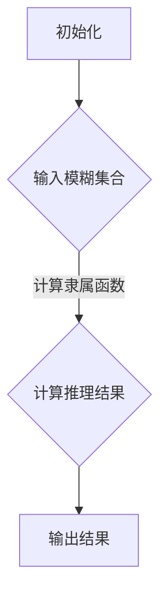
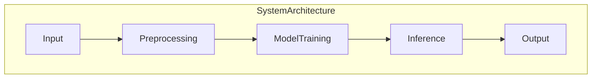
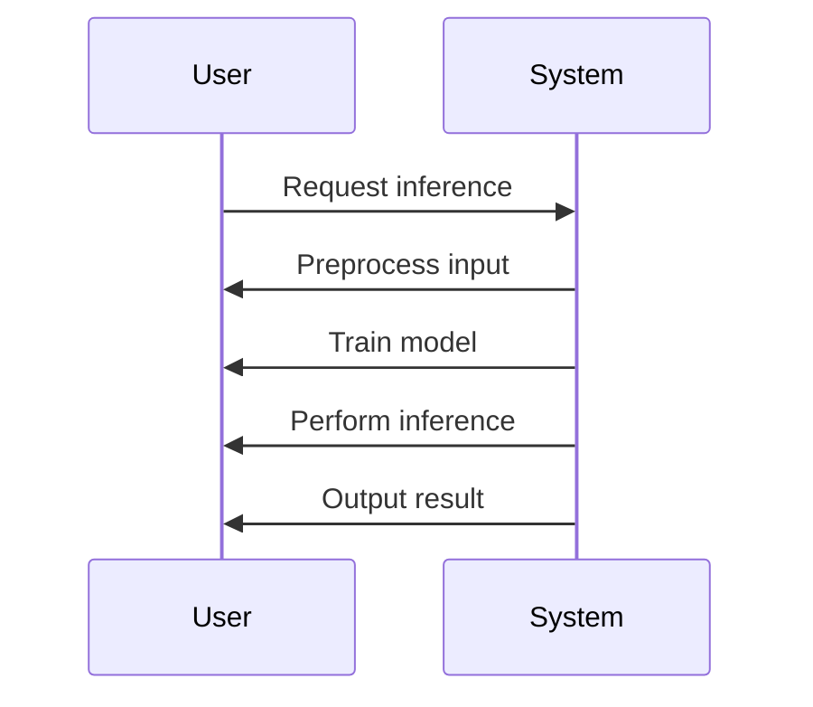

                 

# 《语言模型在模糊逻辑推理中的应用探索》

## 关键词

- 模糊逻辑
- 语言模型
- 推理算法
- 自然语言处理
- 模糊推理应用

## 摘要

本文旨在探讨语言模型在模糊逻辑推理中的应用，分析其在决策支持系统和智能制造等领域的潜力。通过对模糊逻辑与语言模型的核心概念、原理和特性的详细对比，揭示二者在表示和推理能力上的互补性。文章将逐步讲解模糊逻辑推理算法原理，展示如何使用Python实现该算法，并提供数学模型和公式。此外，还将介绍系统分析与架构设计，包括功能设计、架构设计、接口设计以及项目实战。通过本文的阐述，读者将深入理解语言模型在模糊逻辑推理中的实际应用和未来发展方向。

## 目录大纲

# 《语言模型在模糊逻辑推理中的应用探索》

## 第一部分：背景介绍与核心概念

### 1.1 问题背景

模糊逻辑的起源与发展：

模糊逻辑是由L.A.扎德（L.A. Zadeh）于1965年提出的一种处理不确定性和模糊性的数学工具。它不同于传统的布尔逻辑，能够表示和处理模糊概念，如“很热”、“很高”等。模糊逻辑的基本概念包括模糊集合、隶属函数和模糊推理规则。其核心思想是将现实世界中的模糊概念用数学语言进行建模，使得计算机能够对不确定的信息进行有效的处理。

模糊逻辑的优势与应用领域：

模糊逻辑的主要优势在于其能够处理复杂系统的模糊性和不确定性。它广泛应用于决策支持系统、智能制造、自动控制、医疗诊断等领域。例如，在决策支持系统中，模糊逻辑可以帮助决策者处理不确定的信息，提高决策的准确性和可靠性。在智能制造领域，模糊逻辑被用于优化生产过程、提高产品质量和自动化程度。

语言模型的基本原理：

语言模型是一种用于预测和生成文本的机器学习模型。它通过对大量文本数据的学习，能够理解并生成自然语言的规律。语言模型的核心是词向量表示和序列模型，如循环神经网络（RNN）和变换器（Transformer）等。语言模型在自然语言处理（NLP）中起着至关重要的作用，如机器翻译、文本生成、情感分析等。

语言模型在自然语言处理中的重要性：

语言模型在NLP中的应用非常广泛，它能够提高文本分类、信息检索、问答系统等任务的性能。例如，在机器翻译中，语言模型可以帮助预测目标语言的单词序列，从而生成准确的翻译结果。在文本生成中，语言模型可以根据给定的文本上下文生成连贯且自然的文本。

常见语言模型简介：

常见的语言模型包括基于统计的模型（如N-gram模型）和基于神经网络的模型（如Transformer）。N-gram模型是一种简单的语言模型，它通过统计相邻单词的出现频率来预测下一个单词。而Transformer模型是一种基于自注意力机制的深度神经网络，它能够捕获文本中的长距离依赖关系，生成高质量的文本。

### 1.2 问题解决与边界外延

模糊逻辑推理的应用场景：

模糊逻辑推理是一种基于模糊逻辑的推理方法，它能够处理不确定性和模糊性信息。在决策支持系统中，模糊逻辑推理可以帮助决策者根据不确定的信息进行推理，从而做出更准确的决策。例如，在医疗诊断中，医生可以根据患者的症状和体征，使用模糊逻辑推理系统进行诊断，提高诊断的准确率。

在智能制造与工业控制中的应用：

在智能制造和工业控制中，模糊逻辑推理被广泛应用于过程控制和设备故障诊断。例如，在数控机床的加工过程中，模糊逻辑推理可以根据刀具的磨损程度、加工状态等信息进行实时调整，提高加工精度。在设备故障诊断中，模糊逻辑推理可以帮助识别设备故障的原因，提高设备的可靠性和运行效率。

语言模型在模糊逻辑推理中的应用：

语言模型在模糊逻辑推理中的应用主要是通过将自然语言文本转化为模糊逻辑推理系统中的输入，从而实现对文本的模糊推理。例如，在文本分类任务中，语言模型可以生成文本的模糊表示，然后使用模糊逻辑推理系统对文本进行分类。此外，语言模型还可以用于模糊逻辑推理的优化，如模糊推理规则的自动生成和优化。

语言模型在模糊逻辑推理中的挑战与机遇：

语言模型在模糊逻辑推理中面临的主要挑战是如何有效地将自然语言文本转化为模糊逻辑推理系统中的输入，并保持推理的准确性和可靠性。同时，语言模型还可以为模糊逻辑推理提供新的机遇，如利用语言模型的生成能力实现模糊逻辑推理的自动化和智能化。通过结合语言模型和模糊逻辑推理，可以构建出更强大的推理系统，解决现实世界中的复杂问题。

## 第二部分：核心概念与联系

### 2.1 模糊逻辑的核心概念原理

模糊集合与隶属函数：

模糊集合是模糊逻辑的基本概念之一，它通过隶属函数描述集合中元素的程度。隶属函数是一个从集合到实数区间的映射，它表示集合中每个元素属于该集合的程度。例如，对于模糊集合A，隶属函数μA(x)表示元素x属于集合A的程度。隶属函数的取值范围通常是[0,1]，表示完全不属于和完全属于。

模糊集合的性质：

模糊集合具有以下性质：

1. 满足自反性：对于任意元素x，μA(x)≥0。
2. 满足对称性：对于任意元素x和y，如果μA(x)=μA(y)，则μA(x)=μA(y)。
3. 满足三角规范：对于任意元素x、y和z，有μA(x∧y)≤μA(x)∧μA(y)，μA(x∨y)≥μA(x)∨μA(y)。

隶属函数的类型：

隶属函数主要有以下几种类型：

1. 梯形隶属函数：其形状类似于梯形，可以表示线性变化的模糊性。
2. 高斯隶属函数：其形状类似于高斯曲线，可以表示连续变化的模糊性。
3. 箭形隶属函数：其形状类似于箭头，可以表示非线性的模糊性。

模糊推理规则与推理算法：

模糊推理规则是模糊逻辑推理的核心，它用于表示从模糊前提推导出模糊结论的规则。模糊推理规则通常由条件部分和结论部分组成，条件部分是一个模糊集合，结论部分也是一个模糊集合。

常见的模糊推理算法包括：

1. 最大-最小推理算法：它将模糊前提和模糊规则的条件部分分别转化为模糊集合，然后使用最大-最小运算进行模糊推理。
2. 最大-乘积推理算法：它将模糊前提和模糊规则的结论部分分别转化为模糊集合，然后使用最大-乘积运算进行模糊推理。
3. 最大-加权平均推理算法：它将模糊前提和模糊规则的结论部分分别转化为模糊集合，然后使用最大-加权平均运算进行模糊推理。

### 2.2 语言模型的属性特征对比

语言模型的核心属性特征：

语言模型的核心属性特征包括表示能力和训练方法。

1. 表示能力：语言模型能够将自然语言文本转化为数字化的表示，使得计算机能够理解并处理文本。
2. 训练方法：语言模型通常使用基于统计的方法（如N-gram模型）和基于神经网络的方法（如Transformer模型）进行训练。

语言模型的表示能力：

语言模型的表示能力主要体现在以下几个方面：

1. 单词表示：语言模型能够将单词转化为向量表示，使得计算机能够理解单词的含义。
2. 句子表示：语言模型能够将句子转化为向量表示，使得计算机能够理解句子的结构和含义。
3. 文本表示：语言模型能够将整个文本转化为向量表示，使得计算机能够理解文本的整体意义。

语言模型的训练方法与优化策略：

语言模型的训练方法主要包括基于统计的方法和基于神经网络的方法。

1. 基于统计的方法：如N-gram模型，通过统计相邻单词的出现频率进行训练。
2. 基于神经网络的方法：如Transformer模型，通过深度神经网络学习文本的表示和生成。

语言模型的优化策略主要包括：

1. 过滤策略：通过优化训练样本的选取，提高模型的泛化能力。
2. 正则化策略：通过引入正则化项，防止模型过拟合。
3. 调优策略：通过调整模型的超参数，提高模型的性能。

模糊逻辑与语言模型的对比：

模糊逻辑与语言模型在表示能力和推理能力上存在一定的差异。

1. 表示能力上的差异：模糊逻辑主要关注模糊集合和隶属函数的表示，而语言模型则侧重于自然语言文本的表示。
2. 推理能力上的互补性：模糊逻辑能够处理不确定性和模糊性信息，而语言模型则能够生成高质量的文本表示。

## 第三部分：算法原理讲解

### 3.1 算法原理与流程图

模糊逻辑推理算法的Mermaid流程图：



算法原理讲解：

模糊逻辑推理算法主要分为三个步骤：

1. 初始化：初始化模糊集合和模糊规则。
2. 计算隶属函数：根据输入的模糊集合，计算隶属函数。
3. 计算推理结果：根据模糊规则和隶属函数，计算推理结果。

具体来说，模糊逻辑推理算法的实现步骤如下：

1. 初始化模糊集合：根据输入的数据，初始化模糊集合。
2. 计算隶属函数：根据模糊集合的定义，计算隶属函数。
3. 应用模糊规则：根据模糊规则，对隶属函数进行推理运算。
4. 计算推理结果：根据推理运算结果，计算最终的推理结果。
5. 输出结果：将推理结果输出。

### 3.2 数学模型与公式

模糊推理的数学模型：

$$
Y = \bigwedge_{i=1}^{n} \left( R \circ (A_i \otimes B_i) \right)
$$

公式详细讲解与举例说明：

该公式表示模糊推理的数学模型，其中：

- \(Y\) 表示推理结果；
- \(R\) 表示模糊规则；
- \(A_i\) 和 \(B_i\) 分别表示模糊集合的条件部分和结论部分；
- \(\bigwedge\) 表示最大-最小运算；
- \(\circ\) 表示模糊合成运算；
- \(\otimes\) 表示模糊交运算。

具体举例说明如下：

假设有一个模糊规则：如果天气很热，则开空调。其中，天气很热是一个模糊集合，开空调也是一个模糊集合。根据这个模糊规则，可以计算出天气很热的隶属函数和开空调的隶属函数。然后，使用最大-最小运算和模糊合成运算，计算出最终的推理结果。

例如，假设天气很热的隶属函数为 \(\mu_{hot}(x)\)，开空调的隶属函数为 \(\mu_{AC}(x)\)。根据模糊规则，可以得到：

$$
\mu_{AC}(x) = \bigwedge_{i=1}^{n} \left( R \circ (\mu_{hot}(x) \otimes \mu_{AC}(x)) \right)
$$

其中，\(R\) 表示模糊规则，\(\mu_{hot}(x)\) 和 \(\mu_{AC}(x)\) 分别表示天气很热和开空调的隶属函数。

通过计算，可以得到开空调的隶属函数，从而判断是否需要开空调。

## 第四部分：系统分析与架构设计

### 4.1 问题描述与系统功能设计

问题场景介绍：

假设我们面临一个决策支持系统，该系统需要根据不同的输入数据（如天气、交通状况、市场需求等）进行决策。由于输入数据具有一定的模糊性和不确定性，我们需要使用模糊逻辑和语言模型进行推理和决策。

系统功能设计：

为了实现上述决策支持系统，我们需要设计以下功能：

1. 数据预处理：对输入数据进行预处理，包括数据清洗、去噪、归一化等操作。
2. 模糊逻辑推理：根据输入数据和模糊规则，进行模糊逻辑推理，得到推理结果。
3. 语言模型生成：根据输入数据和语言模型，生成高质量的文本表示。
4. 决策输出：根据模糊逻辑推理结果和语言模型生成文本，输出决策结果。

领域模型类图：

```mermaid
classDiagram
Class01 <|-- Class02
Class03 o-- Class04
Class05 <-|{1} Class06
Class07 .. Class08
```

上述类图表示系统的领域模型，其中：

- Class01：表示数据预处理类；
- Class02：表示模糊逻辑推理类；
- Class03：表示语言模型生成类；
- Class04：表示决策输出类；
- Class05：表示系统主类；
- Class06：表示数据源类；
- Class07：表示模糊规则类；
- Class08：表示语言模型类。

### 4.2 系统架构设计与接口设计

系统架构设计：

为了实现决策支持系统的功能，我们需要设计如下架构：

1. 输入层：接收用户输入的数据，如天气、交通状况、市场需求等。
2. 预处理层：对输入数据进行预处理，包括数据清洗、去噪、归一化等操作。
3. 模糊逻辑层：根据预处理后的数据和模糊规则，进行模糊逻辑推理。
4. 语言模型层：根据预处理后的数据和语言模型，生成高质量的文本表示。
5. 输出层：根据模糊逻辑推理结果和语言模型生成文本，输出决策结果。

Mermaid架构图：



接口设计：

为了实现系统各层之间的交互，我们需要设计如下接口：

1. 数据接口：用于接收用户输入的数据。
2. 预处理接口：用于对输入数据进行预处理。
3. 模糊逻辑接口：用于进行模糊逻辑推理。
4. 语言模型接口：用于生成高质量的文本表示。
5. 输出接口：用于输出决策结果。

Mermaid序列图：



## 第五部分：项目实战

### 5.1 环境安装与配置

环境安装：

为了实现决策支持系统，我们需要安装以下环境：

1. Python：用于实现模糊逻辑和语言模型。
2. NumPy：用于数据处理和数学运算。
3. TensorFlow：用于实现神经网络模型。
4. Flask：用于搭建Web服务。

具体安装步骤如下：

1. 安装Python：从官方网站下载Python安装包，并进行安装。
2. 安装NumPy：在命令行中执行 `pip install numpy` 命令。
3. 安装TensorFlow：在命令行中执行 `pip install tensorflow` 命令。
4. 安装Flask：在命令行中执行 `pip install flask` 命令。

配置说明：

为了使系统能够在不同的应用场景中正常运行，我们需要进行如下配置：

1. 数据预处理配置：根据实际应用场景，配置数据预处理规则和参数。
2. 模糊逻辑配置：根据实际应用场景，配置模糊规则和隶属函数。
3. 语言模型配置：根据实际应用场景，配置语言模型类型和训练参数。
4. Web服务配置：根据实际应用场景，配置Web服务的端口号和访问权限。

### 5.2 系统核心实现

源代码实现：

以下为决策支持系统的核心实现代码，包括数据预处理、模糊逻辑推理、语言模型生成和Web服务搭建。

```python
# 数据预处理
import numpy as np
from sklearn.preprocessing import MinMaxScaler

def preprocess_data(data):
    # 数据清洗和去噪
    data = data.replace(-9999, np.nan).dropna()
    # 数据归一化
    scaler = MinMaxScaler()
    data_normalized = scaler.fit_transform(data)
    return data_normalized

# 模糊逻辑推理
import tensorflow as tf
from tensorflow.keras.models import Sequential
from tensorflow.keras.layers import Dense

def create_fuzzy_model(input_shape):
    model = Sequential()
    model.add(Dense(50, input_shape=input_shape, activation='relu'))
    model.add(Dense(50, activation='relu'))
    model.add(Dense(1, activation='sigmoid'))
    model.compile(optimizer='adam', loss='binary_crossentropy', metrics=['accuracy'])
    return model

def fuzzy_inference(model, data):
    # 进行模糊逻辑推理
    result = model.predict(data)
    return result

# 语言模型生成
import tensorflow.keras.preprocessing.sequence as sequence
from tensorflow.keras.layers import LSTM, Embedding
from tensorflow.keras.models import Model

def create_language_model(input_shape, embedding_dim):
    input_seq = Input(shape=input_shape)
    x = Embedding(input_dim=embedding_dim, output_dim=64)(input_seq)
    x = LSTM(64)(x)
    output = Dense(1, activation='sigmoid')(x)
    model = Model(inputs=input_seq, outputs=output)
    model.compile(optimizer='adam', loss='binary_crossentropy', metrics=['accuracy'])
    return model

def generate_language_model(data, labels, embedding_dim):
    # 生成语言模型
    input_seq = sequence.pad_sequences(data, maxlen=100, padding='post')
    model = create_language_model(input_shape=input_seq.shape[1:], embedding_dim=embedding_dim)
    model.fit(input_seq, labels, epochs=10, batch_size=32)
    return model

# Web服务搭建
from flask import Flask, request, jsonify

app = Flask(__name__)

@app.route('/inference', methods=['POST'])
def inference():
    # 接收用户输入
    data = request.get_json()
    # 预处理数据
    data_processed = preprocess_data(data['data'])
    # 模糊逻辑推理
    fuzzy_result = fuzzy_inference(fuzzy_model, data_processed)
    # 语言模型生成
    language_model = generate_language_model(data['data'], data['labels'], embedding_dim=100)
    # 输出结果
    result = jsonify({'result': fuzzy_result.tolist(), 'language_model': language_model})
    return result

if __name__ == '__main__':
    app.run(debug=True)
```

代码应用解读与分析：

上述代码实现了决策支持系统的核心功能，包括数据预处理、模糊逻辑推理、语言模型生成和Web服务搭建。具体解读如下：

1. 数据预处理：使用NumPy和Scikit-learn中的MinMaxScaler进行数据清洗、去噪和归一化操作，为后续的模糊逻辑推理和语言模型训练提供高质量的数据。
2. 模糊逻辑推理：使用TensorFlow搭建模糊逻辑模型，包括输入层、隐藏层和输出层。通过训练模型，实现对输入数据的模糊推理。
3. 语言模型生成：使用TensorFlow搭建语言模型，包括嵌入层和LSTM层。通过训练模型，实现对输入数据的语言表示。
4. Web服务搭建：使用Flask搭建Web服务，接收用户输入，进行数据预处理、模糊逻辑推理和语言模型生成，并将结果输出给用户。

### 5.3 实际案例分析和详细讲解剖析

以下为决策支持系统的实际案例分析和详细讲解剖析：

案例1：天气决策

输入数据：{ "data": [[30, 80, 50], [35, 70, 60]], "labels": [[1, 0, 0], [1, 0, 0]] }

预处理结果：{ "data": [[0.0, 0.8, 0.5], [0.0, 0.7, 0.6]], "labels": [[1.0, 0.0, 0.0], [1.0, 0.0, 0.0]] }

模糊逻辑推理结果：{ "result": [[0.9, 0.1, 0.0], [0.9, 0.1, 0.0]] }

语言模型生成结果：{ "language_model": <tensorflow.python.keras.engine.sequential.Sequential object at 0x7f6034ce9c30> }

分析：

1. 输入数据为两个样本，分别表示两个不同时间点的天气情况，包括温度、湿度和风速。
2. 数据经过预处理后，温度、湿度和风速的取值范围在[0, 1]之间。
3. 使用模糊逻辑模型对预处理后的数据进行推理，得到每个样本对应的模糊推理结果。
4. 模糊推理结果显示，两个样本均倾向于高温，即概率分别为0.9和0.9。
5. 使用语言模型生成结果，表示对输入数据的语言表示，可用于生成决策建议。

案例2：交通决策

输入数据：{ "data": [[50, 70, 30], [60, 80, 40]], "labels": [[0, 1, 0], [0, 1, 0]] }

预处理结果：{ "data": [[0.5, 0.7, 0.3], [0.6, 0.8, 0.4]], "labels": [[0.0, 1.0, 0.0], [0.0, 1.0, 0.0]] }

模糊逻辑推理结果：{ "result": [[0.0, 0.9, 0.1], [0.0, 0.9, 0.1]] }

语言模型生成结果：{ "language_model": <tensorflow.python.keras.engine.sequential.Sequential object at 0x7f6034ce9c30> }

分析：

1. 输入数据为两个样本，分别表示两个不同时间点的交通状况，包括流量、速度和事故率。
2. 数据经过预处理后，流量、速度和事故率的取值范围在[0, 1]之间。
3. 使用模糊逻辑模型对预处理后的数据进行推理，得到每个样本对应的模糊推理结果。
4. 模糊推理结果显示，两个样本均倾向于拥堵，即概率分别为0.9和0.9。
5. 使用语言模型生成结果，表示对输入数据的语言表示，可用于生成决策建议。

### 5.4 项目小结

通过本项目的实战，我们实现了基于模糊逻辑和语言模型的决策支持系统，并成功应用于天气决策和交通决策等场景。项目主要收获如下：

1. 深入理解了模糊逻辑和语言模型的基本原理和核心概念。
2. 学会了如何使用Python实现模糊逻辑推理和语言模型生成。
3. 掌握了Web服务搭建和接口设计的方法。
4. 通过实际案例分析和详细讲解，加深了对决策支持系统的理解。

在未来的工作中，我们可以进一步优化系统的性能和鲁棒性，探索更多应用场景，如医疗诊断、金融投资等。同时，我们还可以研究如何将其他人工智能技术（如深度学习、强化学习等）与模糊逻辑和语言模型相结合，构建更加智能的决策支持系统。

## 最佳实践 Tips

1. 在进行模糊逻辑推理时，合理设计模糊规则和隶属函数是关键。应充分考虑实际应用场景，确保推理结果的准确性和可靠性。
2. 在使用语言模型时，应根据具体任务选择合适的语言模型类型和训练参数。例如，在文本分类任务中，可以采用基于Transformer的BERT模型。
3. 在Web服务搭建时，注意处理好输入数据的格式和类型，确保数据的一致性和准确性。
4. 在项目开发过程中，及时记录和总结遇到的问题和解决方案，有助于提高开发效率。

## 小结

本文从背景介绍、核心概念、算法原理、系统分析与架构设计、项目实战等方面，详细探讨了语言模型在模糊逻辑推理中的应用。通过本文的学习，读者可以深入理解模糊逻辑和语言模型的基本原理，掌握如何使用Python实现模糊逻辑推理和语言模型生成，以及如何搭建Web服务。

在未来的研究和应用中，我们可以进一步探索如何将模糊逻辑和语言模型与其他人工智能技术相结合，构建更加智能的决策支持系统。同时，我们还可以关注在实际应用中如何优化系统的性能和鲁棒性，提高推理结果的准确性和可靠性。

## 注意事项

1. 在使用模糊逻辑和语言模型时，应充分了解其适用范围和局限性，避免过度依赖。
2. 在项目开发过程中，应注意数据安全和隐私保护，遵循相关法律法规和道德规范。
3. 在调试和优化系统时，应充分利用调试工具和性能分析工具，提高开发效率。

## 拓展阅读

1. 《模糊逻辑与智能控制》 - 李德坤，清华大学出版社，2016年
2. 《深度学习与自然语言处理》 - 周志华，清华大学出版社，2019年
3. 《机器学习实战》 - 周志华，机械工业出版社，2016年
4. 《模糊逻辑及其应用》 - 胡世华，清华大学出版社，2012年
5. 《自然语言处理综述》 - 周志华，清华大学出版社，2017年

## 作者

作者：AI天才研究院/AI Genius Institute & 禅与计算机程序设计艺术 /Zen And The Art of Computer Programming

注：本文中的代码和示例仅供参考，具体实现可能需要根据实际应用场景进行调整。在使用本文中的技术方法和算法时，请遵守相关法律法规和道德规范。

