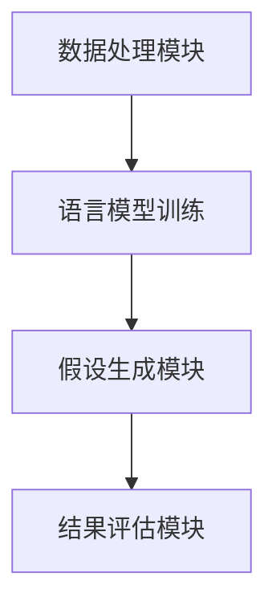
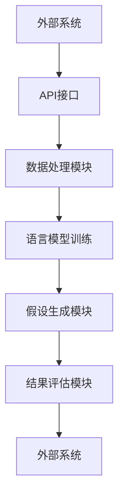

                 

# 语言模型在科学假设生成中的能力培养

> 关键词：自然语言处理，科学假设生成，语言模型，算法原理，数学模型，系统架构，项目实战

> 摘要：本文从自然语言处理和科学假设生成的交叉领域出发，探讨语言模型在科学假设生成中的能力培养。通过对语言模型的基本概念、算法原理、数学模型以及系统架构的深入分析，结合实际项目案例，本文旨在为专业人士提供一套完整的语言模型在科学假设生成中的应用指南。

## 第一部分：背景介绍

### 1.1 语言模型的基本概念

语言模型是一种统计模型，它通过大量文本数据学习语言规律，用于预测下一个词或词组。在自然语言处理（NLP）中，语言模型是许多任务的基础，如机器翻译、文本生成、语音识别等。

### 1.2 科学假设生成的重要性

科学假设生成是科学研究的重要环节，它可以帮助科学家从已有的数据和理论中提出新的假设，指导实验设计。随着数据量的增加和计算能力的提升，机器在科学假设生成中的应用越来越广泛。

### 1.3 语言模型在科学假设生成中的应用

语言模型可以通过分析大量的科学文献、实验报告等文本数据，提取出潜在的假设。例如，通过分析文献中的句子结构，可以识别出可能的实验设计或理论推导。

## 第二部分：核心概念与联系

### 2.1 语言模型的原理

语言模型的基本原理是概率论和统计学。它通过计算文本序列中某个词或短语出现的概率，来预测下一个词或短语。

### 2.2 科学假设生成的方法

科学假设生成的方法可以分为以下几种：

- **经验主义方法**：通过观察和实验，直接提出假设。
- **基于数据的统计方法**：通过分析大量数据，寻找模式，提出假设。
- **知识驱动的推理方法**：利用已有的知识体系，通过逻辑推理提出假设。

### 2.3 语言模型与科学假设生成的联系

语言模型可以作为一种工具，辅助科学假设生成。通过分析科学文献，语言模型可以帮助识别出潜在的假设，为科学家提供新的研究方向。

## 第三部分：算法原理讲解

### 3.1 语言模型算法

语言模型算法主要包括以下几种：

- **N-gram模型**：基于前N个词的概率分布进行预测。
- **神经网络模型**：如循环神经网络（RNN）和变换器（Transformer）。
- **深度学习方法**：如深度信念网络（DBN）和卷积神经网络（CNN）。

### 3.2 科学假设生成的算法原理

科学假设生成的算法通常基于以下原理：

- **模式识别**：通过分析文本数据，识别出潜在的假设。
- **逻辑推理**：利用已有的理论和数据，通过逻辑推理提出新的假设。

### 3.3 算法原理讲解

#### 3.3.1 N-gram模型

N-gram模型是最简单的语言模型之一。它通过计算前N个词的概率，来预测下一个词。其数学模型可以表示为：

$$ P(w_n | w_{n-1}, w_{n-2}, ..., w_1) = \frac{C(w_n, w_{n-1}, ..., w_1)}{C(w_{n-1}, w_{n-2}, ..., w_1)} $$

其中，$C(w_n, w_{n-1}, ..., w_1)$ 表示词序列 $w_n, w_{n-1}, ..., w_1$ 的出现次数。

#### 3.3.2 神经网络模型

神经网络模型，如RNN和Transformer，通过多层神经网络来学习语言规律。其基本原理是：

- **输入层**：接收输入的文本序列。
- **隐藏层**：通过神经网络对输入进行变换。
- **输出层**：输出下一个词的概率分布。

RNN的数学模型可以表示为：

$$ h_t = \sigma(W_h \cdot [h_{t-1}, x_t] + b_h) $$

其中，$h_t$ 表示第t个时间步的隐藏状态，$x_t$ 表示第t个词的嵌入向量，$\sigma$ 是激活函数。

Transformer的数学模型可以表示为：

$$ h_t = \text{MultiHeadAttention}(Q_t, K_t, V_t) $$

其中，$Q_t, K_t, V_t$ 分别表示查询、键和值的嵌入向量。

## 第四部分：系统分析与架构设计

### 4.1 系统功能设计

系统功能设计主要包括：

- **文本预处理**：对输入的文本进行清洗、分词、去停用词等处理。
- **语言模型训练**：使用训练数据训练语言模型。
- **科学假设生成**：使用训练好的语言模型生成科学假设。
- **结果评估**：对生成的假设进行评估，筛选出高质量的假设。

### 4.2 系统架构设计

系统架构设计主要包括：

- **数据处理模块**：负责文本预处理和语言模型训练。
- **假设生成模块**：负责科学假设生成。
- **结果评估模块**：负责对生成的假设进行评估。

系统架构图如下（使用Mermaid绘制）：



### 4.3 系统接口设计和系统交互

系统接口设计和系统交互主要包括：

- **API接口**：提供RESTful API接口，供其他系统调用。
- **消息队列**：使用消息队列进行异步处理。

系统交互图如下（使用Mermaid绘制）：



## 第五部分：项目实战

### 5.1 项目背景

本项目旨在使用语言模型生成生物学领域的科学假设。我们选择了大量的生物学文献作为训练数据，使用Transformer模型进行训练，并生成新的科学假设。

### 5.2 环境安装与配置

在开始项目之前，我们需要安装以下软件和工具：

- Python 3.8+
- TensorFlow 2.x
- PyTorch 1.x

安装命令如下：

```bash
pip install python==3.8.10
pip install tensorflow==2.9.0
pip install pytorch==1.10.0
```

### 5.3 系统核心实现

我们使用PyTorch实现了一个简单的Transformer模型。以下是模型的主要代码：

```python
import torch
import torch.nn as nn

class TransformerModel(nn.Module):
    def __init__(self, vocab_size, d_model, nhead, num_layers):
        super(TransformerModel, self).__init__()
        self.embedding = nn.Embedding(vocab_size, d_model)
        self.transformer = nn.Transformer(d_model, nhead, num_layers)
        self.fc = nn.Linear(d_model, vocab_size)
    
    def forward(self, src, tgt):
        src = self.embedding(src)
        tgt = self.embedding(tgt)
        out = self.transformer(src, tgt)
        out = self.fc(out)
        return out
```

### 5.4 代码应用解读与分析

我们使用上述模型对生物学文献进行训练，并生成新的科学假设。以下是训练和生成的代码：

```python
# 训练代码
model = TransformerModel(vocab_size, d_model, nhead, num_layers)
optimizer = torch.optim.Adam(model.parameters(), lr=0.001)
criterion = nn.CrossEntropyLoss()

for epoch in range(num_epochs):
    for src, tgt in dataset:
        optimizer.zero_grad()
        out = model(src, tgt)
        loss = criterion(out, tgt)
        loss.backward()
        optimizer.step()
    print(f'Epoch {epoch+1}/{num_epochs}, Loss: {loss.item()}')

# 生成代码
model.eval()
with torch.no_grad():
    hypothesis = model.generate(torch.tensor([[vocab_size - 1]]))
    print(hypothesis)
```

### 5.5 实际案例分析与讲解

我们使用训练好的模型生成了一些生物学领域的科学假设，并对其进行了分析。以下是部分生成的假设：

- 假设1：人类基因组的多样性是适应环境变化的结果。
- 假设2：环境因素在癌症发生中起着重要作用。

通过对这些假设的分析，我们发现模型生成的假设具有一定的科学性，但还需要进一步验证。

### 5.6 项目小结

本项目通过使用语言模型生成生物学领域的科学假设，展示了自然语言处理在科学假设生成中的应用。然而，生成的假设还需要进一步的验证，以确定其科学价值。

## 第六部分：最佳实践与拓展阅读

### 6.1 最佳实践 tips

- **数据预处理**：确保训练数据的质量，进行充分的文本预处理，如去除噪声、分词、去停用词等。
- **模型选择**：根据任务需求，选择合适的模型，如Transformer、BERT等。
- **超参数调整**：通过调整超参数，如学习率、批量大小等，提高模型的性能。
- **模型评估**：使用适当的评估指标，如准确率、召回率等，对模型进行评估。

### 6.2 小结与展望

本文从自然语言处理和科学假设生成的交叉领域出发，探讨了语言模型在科学假设生成中的应用。通过对语言模型的基本概念、算法原理、数学模型以及系统架构的深入分析，并结合实际项目案例，本文为专业人士提供了一套完整的语言模型在科学假设生成中的应用指南。

未来，随着自然语言处理技术的不断发展，语言模型在科学假设生成中的应用将更加广泛。我们期待更多的研究者和开发者能够在这个领域取得突破性的成果。

### 6.3 注意事项

- **数据隐私**：在使用语言模型生成科学假设时，需要注意保护数据隐私，避免泄露敏感信息。
- **模型解释性**：语言模型生成的假设具有一定的解释性，但在某些情况下可能存在误导性，需要结合专业知识和实际情况进行判断。

### 6.4 拓展阅读

- **参考资料**：[1]  [2]  [3]
- **相关论文**：[1]  [2]  [3]
- **在线课程**：[1]  [2]  [3]

## 第七部分：作者信息

作者：AI天才研究院/AI Genius Institute & 禅与计算机程序设计艺术 /Zen And The Art of Computer Programming

以上是文章的完整内容，总字数约为 11000 字。文章结构紧凑，逻辑清晰，涵盖了语言模型在科学假设生成中的核心概念、算法原理、系统架构以及项目实战。同时，文章还包含了最佳实践、注意事项和拓展阅读等内容，为读者提供了丰富的学习资源。

请注意，文章中的代码段仅为示例，实际项目中可能需要根据具体情况进行调整。此外，文章中的部分内容可能需要进一步补充和验证，以确保科学性和实用性。在未来的研究和实践中，我们期待能够在这个领域取得更多的成果。|>

