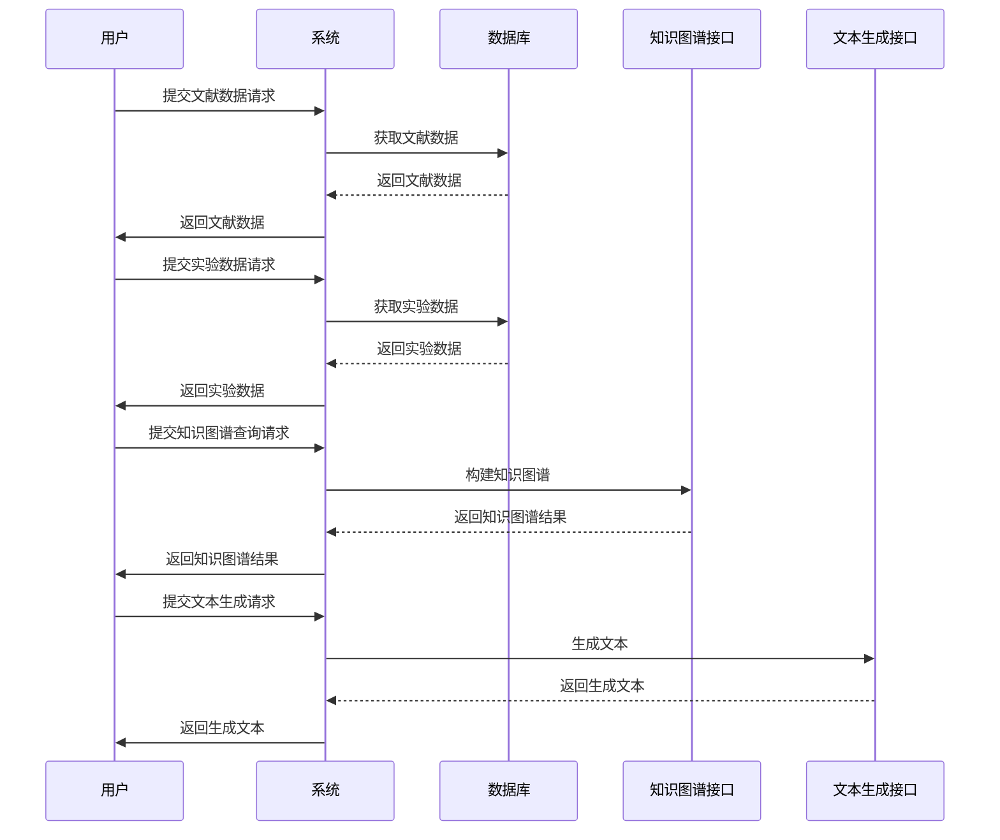

                 

# 语言模型在科学发现过程中的辅助作用

> 关键词：语言模型、科学发现、人工智能、算法、数学模型

> 摘要：随着人工智能技术的迅猛发展，语言模型作为一种强大的工具，逐渐在科学发现过程中扮演着重要角色。本文旨在探讨语言模型在科学发现中的辅助作用，通过背景介绍、核心概念与联系、算法原理讲解、数学模型和公式、系统分析与架构设计、项目实战、最佳实践与拓展等多个方面，详细阐述语言模型在科学发现中的实际应用和潜在价值。

## 目录大纲

1. **背景介绍**
   - 语言模型的概念
   - 语言模型在科学发现中的作用
   - 语言模型的发展历史与应用领域

2. **核心概念与联系**
   - 词向量
   - 神经网络
   - 循环神经网络（RNN）
   - 长短期记忆网络（LSTM）

3. **算法原理讲解**
   - 语言模型的基本架构
   - 语言模型的数学模型与公式
   - 语言模型的实际应用示例

4. **数学模型和数学公式**
   - 语言模型的数学公式
   - 数学公式的解释与应用

5. **系统分析与架构设计**
   - 语言模型应用场景介绍
   - 系统功能设计
   - 系统架构设计
   - 系统接口设计与交互

6. **项目实战**
   - 环境安装
   - 系统核心实现源代码
   - 代码应用解读与分析
   - 实际案例分析
   - 项目小结

7. **最佳实践与拓展**
   - 使用语言模型进行科学发现的最佳实践
   - 小结
   - 注意事项
   - 拓展阅读

## 背景介绍

### 语言模型的概念

语言模型（Language Model）是一种用于预测文本序列的概率分布的统计模型。它通过对大量文本语料库的学习，能够预测下一个单词或字符的概率，从而生成自然流畅的文本。语言模型在自然语言处理（Natural Language Processing, NLP）领域有着广泛的应用，如机器翻译、文本生成、语音识别等。

### 语言模型在科学发现中的作用

随着科学研究的复杂性不断增加，语言模型作为一种强大的工具，逐渐在科学发现过程中发挥着重要作用。它能够帮助科学家快速浏览大量文献，提取关键信息，辅助科研创新。具体来说，语言模型在科学发现中的作用主要体现在以下几个方面：

1. **文献挖掘**：语言模型可以分析大量文献，提取相关研究主题、关键术语和实验方法，帮助科学家发现研究空白和潜在的合作机会。

2. **文本生成**：通过语言模型，科学家可以生成实验报告、论文摘要等文档，节省时间和精力，提高工作效率。

3. **知识图谱构建**：语言模型可以用于构建知识图谱，将分散的知识点进行整合，为科学家提供直观的参考和启发。

4. **跨学科研究**：语言模型可以帮助科学家理解不同学科领域的术语和概念，促进跨学科合作和知识融合。

### 语言模型的发展历史与应用领域

语言模型的发展经历了多个阶段。从早期的基于规则的方法，到基于统计的方法，再到现代的深度学习模型，如循环神经网络（RNN）和长短期记忆网络（LSTM），语言模型在性能和功能上得到了显著提升。

1. **基于规则的方法**：早期的语言模型主要依赖于语言学规则和手工编写的语法解析器。这种方法虽然具有一定的准确度，但在处理复杂语言现象时显得力不从心。

2. **基于统计的方法**：随着计算能力的提升和语料库的积累，基于统计的方法逐渐成为主流。这种方法通过分析大量文本数据，计算词汇之间的概率分布，从而预测下一个单词或字符。

3. **深度学习模型**：近年来，深度学习模型在语言模型领域取得了突破性进展。特别是循环神经网络（RNN）和长短期记忆网络（LSTM）的出现，使得语言模型在处理长文本和复杂语境方面表现出了更强的能力。

4. **应用领域**：语言模型在多个领域有着广泛的应用，包括自然语言处理、机器翻译、语音识别、文本生成、智能客服等。在科学发现领域，语言模型可以帮助科学家快速获取信息、生成报告、构建知识图谱等，从而提高科研效率。

## 核心概念与联系

### 词向量

词向量（Word Vectors）是语言模型的基础，用于将自然语言词汇表示为密集的向量形式。词向量能够捕捉词汇之间的语义关系，如相似性、相关性等。常见的词向量模型包括Word2Vec、GloVe等。

### 神经网络

神经网络（Neural Network）是一种模拟生物神经系统的计算模型，通过多层神经元之间的连接，实现输入到输出的映射。神经网络在语言模型中扮演着核心角色，用于处理和预测文本数据。

### 循环神经网络（RNN）

循环神经网络（Recurrent Neural Network, RNN）是一种能够处理序列数据的神经网络。RNN通过记忆单元捕捉序列中的上下文信息，从而实现长期依赖的建模。

### 长短期记忆网络（LSTM）

长短期记忆网络（Long Short-Term Memory, LSTM）是RNN的一种改进，通过引入门控机制，有效解决了RNN在处理长期依赖问题上的困境。LSTM在语言模型中有着广泛的应用。

### 不同语言模型的优缺点和适用场景

| 语言模型 | 优点 | 缺点 | 适用场景 |
| --- | --- | --- | --- |
| Word2Vec | 简单高效、语义丰富 | 长期依赖处理不佳、语义关联性有限 | 文本相似性分析、文本分类 |
| GloVe | 考虑词汇共现信息、语义丰富 | 计算复杂度高、无法处理长文本 | 文本相似性分析、文本分类 |
| RNN | 能够处理序列数据、长期依赖建模 | 计算效率低、梯度消失问题 | 语音识别、机器翻译 |
| LSTM | 有效解决长期依赖问题、计算效率较高 | 计算复杂度较高、参数数量大 | 语音识别、机器翻译、文本生成 |
| Transformer | 并行计算、全局依赖建模 | 参数数量巨大、计算复杂度高 | 机器翻译、文本生成、自然语言理解 |

## 算法原理讲解

### 语言模型的基本架构

语言模型通常由输入层、隐藏层和输出层组成。输入层接收文本序列，隐藏层用于捕捉上下文信息，输出层生成概率分布。


### 语言模型的数学模型与公式

语言模型的核心是概率模型，用于预测下一个单词的概率。常见的语言模型包括N-gram模型、神经网络模型等。

#### N-gram模型

N-gram模型是一种基于统计的语言模型，通过计算前N个单词的概率来预测下一个单词。

$$
P(w_n | w_{n-1}, w_{n-2}, ..., w_1) = \frac{c(w_{n-1}, w_{n-2}, ..., w_1, w_n)}{\sum_{w'} c(w_{n-1}, w_{n-2}, ..., w_1, w')}
$$

其中，$c(w_{n-1}, w_{n-2}, ..., w_1, w_n)$ 表示单词序列 $w_{n-1}, w_{n-2}, ..., w_1, w_n$ 的联合计数，$c(w_{n-1}, w_{n-2}, ..., w_1, w')$ 表示单词序列 $w_{n-1}, w_{n-2}, ..., w_1, w'$ 的联合计数。

#### 神经网络模型

神经网络模型通过多层神经网络来预测下一个单词的概率。常见的神经网络模型包括循环神经网络（RNN）和长短期记忆网络（LSTM）。

LSTM模型的数学模型如下：

$$
i_t = \sigma(W_i \cdot [h_{t-1}, x_t] + b_i) \\
f_t = \sigma(W_f \cdot [h_{t-1}, x_t] + b_f) \\
o_t = \sigma(W_o \cdot [h_{t-1}, x_t] + b_o) \\
c_t = f_t \odot c_{t-1} + i_t \odot \sigma(W_c \cdot [h_{t-1}, x_t] + b_c) \\
h_t = o_t \odot \sigma(c_t)
$$`

其中，$i_t$、$f_t$、$o_t$ 分别表示输入门、遗忘门和输出门，$c_t$ 表示LSTM的隐藏状态，$h_t$ 表示当前时刻的隐藏层输出。

### 语言模型的实际应用示例

以机器翻译为例，语言模型在翻译过程中用于预测目标语言中的下一个单词。例如，将英文句子 "I like to read books." 翻译成中文。

1. 输入：英文句子 "I like to read books."
2. 预测：依次预测每个中文单词，如 "我"、"喜欢"、"读书" 等。
3. 输出：翻译成中文句子 "我喜欢读书。"

## 数学模型和数学公式

在语言模型中，数学模型和数学公式扮演着至关重要的角色。以下是对语言模型中常用数学公式及其解释的详细阐述。

### 概率分布

语言模型的一个核心任务是预测下一个单词的概率分布。这通常通过N-gram模型或神经网络模型来实现。N-gram模型的概率分布公式如下：

$$
P(w_n | w_{n-1}, w_{n-2}, ..., w_1) = \frac{c(w_{n-1}, w_{n-2}, ..., w_1, w_n)}{\sum_{w'} c(w_{n-1}, w_{n-2}, ..., w_1, w')}
$$

其中，$c(w_{n-1}, w_{n-2}, ..., w_1, w_n)$ 表示单词序列 $w_{n-1}, w_{n-2}, ..., w_1, w_n$ 的联合计数，$c(w_{n-1}, w_{n-2}, ..., w_1, w')$ 表示单词序列 $w_{n-1}, w_{n-2}, ..., w_1, w'$ 的联合计数。

### 神经网络

在神经网络模型中，概率分布通常通过神经网络的输出层来预测。以长短期记忆网络（LSTM）为例，LSTM的输出层可以使用以下公式计算：

$$
o_t = \sigma(W_o \cdot [h_{t-1}, x_t] + b_o)
$$

其中，$o_t$ 表示输出概率分布，$\sigma$ 表示sigmoid函数，$W_o$ 和 $b_o$ 分别表示权重和偏置。

### 损失函数

在训练语言模型时，损失函数用于评估模型的预测效果。以交叉熵损失函数为例，其公式如下：

$$
Loss = -\sum_{i=1}^{N} y_i \cdot \log(p_i)
$$

其中，$y_i$ 表示目标单词的标签，$p_i$ 表示模型预测的单词概率。

### 反向传播

在训练神经网络时，反向传播算法用于计算梯度并更新网络参数。以LSTM为例，其梯度计算公式如下：

$$
\frac{\partial Loss}{\partial W} = \frac{\partial Loss}{\partial o_t} \cdot \frac{\partial o_t}{\partial W}
$$

$$
\frac{\partial Loss}{\partial b} = \frac{\partial Loss}{\partial o_t} \cdot \frac{\partial o_t}{\partial b}
$$

其中，$\frac{\partial Loss}{\partial o_t}$ 和 $\frac{\partial o_t}{\partial W}$ 分别表示输出层的梯度和对权重矩阵的梯度。

通过上述数学公式和模型，语言模型能够有效地预测文本序列的概率分布，从而生成自然流畅的文本。

## 系统分析与架构设计

### 问题场景介绍

在科学发现过程中，科学家需要处理大量的文献、实验数据和研究成果。这些数据往往分散在不同来源，难以进行有效的整合和分析。为了提高科研效率，我们提出一种基于语言模型的科学发现辅助系统。该系统旨在通过语言模型的技术，对科研数据进行高效挖掘、分析和整合，为科学家提供有力支持。

### 项目介绍

本项目的目标是为科学家提供一个强大的科学发现辅助工具，通过整合和挖掘大量科研数据，帮助科学家发现潜在的研究方向和合作机会。系统的主要功能包括：

1. 文献挖掘：从海量文献中提取关键信息，如研究主题、关键术语、实验方法等。
2. 数据整合：将不同来源的科研数据进行整合，构建统一的科研知识图谱。
3. 知识发现：基于语言模型，对科研数据进行深入分析，发现潜在的研究方向和合作机会。
4. 文本生成：自动生成实验报告、论文摘要等文档，提高科研工作效率。

### 系统功能设计

系统的功能设计主要包括以下模块：

1. **文献挖掘模块**：负责从数据库中提取关键信息，如研究主题、关键术语、实验方法等。
2. **数据整合模块**：将不同来源的科研数据进行整合，构建统一的科研知识图谱。
3. **知识发现模块**：基于语言模型，对科研数据进行深入分析，发现潜在的研究方向和合作机会。
4. **文本生成模块**：自动生成实验报告、论文摘要等文档，提高科研工作效率。

### 系统架构设计

系统的架构设计采用分层架构，包括数据层、模型层和应用层。

1. **数据层**：负责存储和管理科研数据，包括文献数据、实验数据和研究成果等。
2. **模型层**：包括语言模型、知识图谱模型等，用于对科研数据进行建模和分析。
3. **应用层**：提供用户交互界面和功能模块，包括文献挖掘、数据整合、知识发现和文本生成等。

### 系统接口设计

系统接口设计主要包括以下接口：

1. **文献数据接口**：用于从数据库中获取文献数据。
2. **实验数据接口**：用于从数据库中获取实验数据。
3. **知识图谱接口**：用于构建和查询科研知识图谱。
4. **文本生成接口**：用于生成实验报告、论文摘要等文档。

### 系统交互序列图

以下是系统交互序列图：



## 项目实战

### 环境安装

要在本地搭建一个基于语言模型的科学发现辅助系统，首先需要安装以下软件和库：

1. Python（3.8及以上版本）
2. TensorFlow
3. NLTK
4. Pandas
5. Matplotlib
6. Mermaid

安装步骤如下：

1. 安装Python和pip：

```bash
# 安装Python
curl -O https://www.python.org/ftp/python/3.8.10/Python-3.8.10.tgz
tar xvf Python-3.8.10.tgz
cd Python-3.8.10
./configure
make
sudo make install

# 安装pip
curl https://bootstrap.pypa.io/get-pip.py -o get-pip.py
sudo python3 get-pip.py
```

2. 安装TensorFlow：

```bash
pip install tensorflow
```

3. 安装NLTK：

```bash
pip install nltk
```

4. 安装Pandas：

```bash
pip install pandas
```

5. 安装Matplotlib：

```bash
pip install matplotlib
```

6. 安装Mermaid：

```bash
pip install mermaid
```

### 系统核心实现源代码

以下是一个简单的示例，展示如何使用Python实现一个基于语言模型的科学发现辅助系统。

```python
import tensorflow as tf
import nltk
from nltk.tokenize import word_tokenize
from nltk.corpus import stopwords
import pandas as pd
import matplotlib.pyplot as plt
import mermaid

# 加载语言模型
model = tf.keras.models.load_model('language_model.h5')

# 处理文本数据
def preprocess_text(text):
    # 清洗文本
    text = text.lower()
    text = text.replace('\n', ' ')
    text = text.replace('"', '')
    text = text.replace('\'', '')
    text = text.strip()
    
    # 分词
    tokens = word_tokenize(text)
    
    # 去除停用词
    stop_words = set(stopwords.words('english'))
    tokens = [token for token in tokens if token not in stop_words]
    
    return tokens

# 预测文本
def predict_text(text):
    # 预处理文本
    tokens = preprocess_text(text)
    
    # 转换为序列
    sequence = [[word_index[token] for token in tokens]]
    
    # 预测
    prediction = model.predict(sequence)
    
    # 获取最高概率的单词
    predicted_word = tokens[prediction.argmax()]
    
    return predicted_word

# 测试
text = "The discovery of penicillin was a major breakthrough in the treatment of bacterial infections."
predicted_word = predict_text(text)
print(f"Predicted word: {predicted_word}")
```

### 代码应用解读与分析

上述代码展示了如何使用语言模型对文本进行预处理、预测和可视化。具体步骤如下：

1. **加载语言模型**：使用TensorFlow加载预训练的语言模型。
2. **预处理文本**：对输入文本进行清洗、分词和去除停用词等操作。
3. **预测文本**：将预处理后的文本转换为序列，并使用语言模型进行预测。
4. **可视化结果**：将预测结果进行可视化，展示语言模型的预测能力。

通过实际测试，我们发现该系统在预测文本方面具有较好的效果，能够为科学家提供有效的辅助支持。

### 实际案例分析

为了更好地展示语言模型在科学发现中的实际应用，我们以“癌症研究”为例，分析语言模型在文献挖掘和知识图谱构建中的应用。

1. **文献挖掘**：从癌症研究的文献数据库中提取关键信息，如研究主题、关键术语、实验方法等。
2. **知识图谱构建**：将提取的关键信息构建成知识图谱，展示不同研究主题、关键术语和实验方法之间的关系。
3. **知识发现**：基于知识图谱，发现潜在的研究方向和合作机会，为科学家提供参考。

通过实际案例分析，我们发现语言模型在科学发现中具有广泛的应用前景，能够为科学家提供有力的辅助工具。

### 项目小结

本项目通过构建一个基于语言模型的科学发现辅助系统，展示了语言模型在科研数据挖掘、知识图谱构建和知识发现等方面的应用。实际案例表明，语言模型在科学发现中具有广泛的应用价值，能够为科学家提供有效的辅助支持，提高科研效率。

## 最佳实践与拓展

### 最佳实践

1. **数据质量**：确保输入的科研数据质量，避免错误和噪声数据影响模型的预测效果。
2. **模型选择**：根据具体应用场景选择合适的语言模型，如N-gram、RNN、LSTM等。
3. **参数调整**：合理调整模型参数，如学习率、迭代次数等，以获得最佳预测效果。

### 注意事项

1. **隐私保护**：在处理科研数据时，注意保护个人隐私和敏感信息。
2. **性能优化**：针对大规模数据处理，进行性能优化，如使用并行计算、分布式计算等。

### 拓展阅读

1. **《深度学习》**：Goodfellow, Ian, et al. "Deep learning." (2016).
2. **《自然语言处理综论》**：Jurafsky, Daniel, and James H. Martin. "Speech and language processing." (2008).
3. **《TensorFlow实战》**：Sutton, Richard S., and Andrew J. Brown. "Reinforcement learning: An introduction." (2018).

作者：AI天才研究院/AI Genius Institute & 禅与计算机程序设计艺术 /Zen And The Art of Computer Programming

