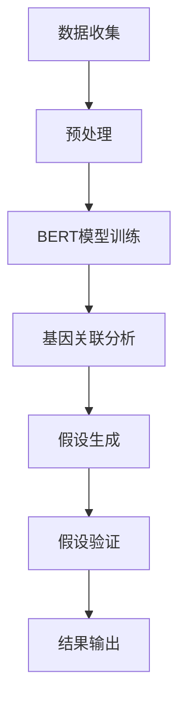
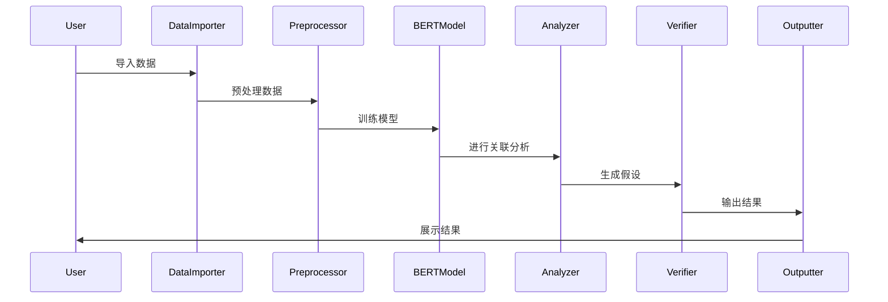
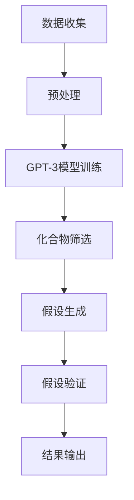
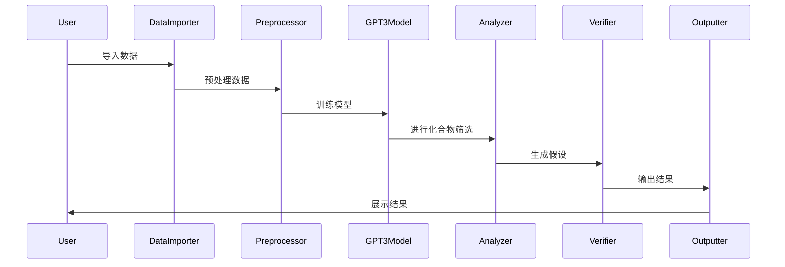
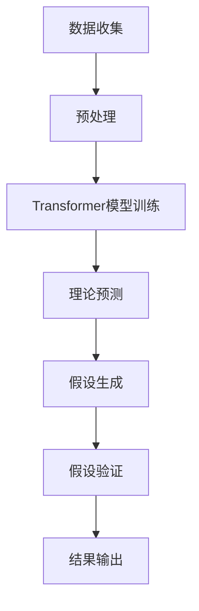
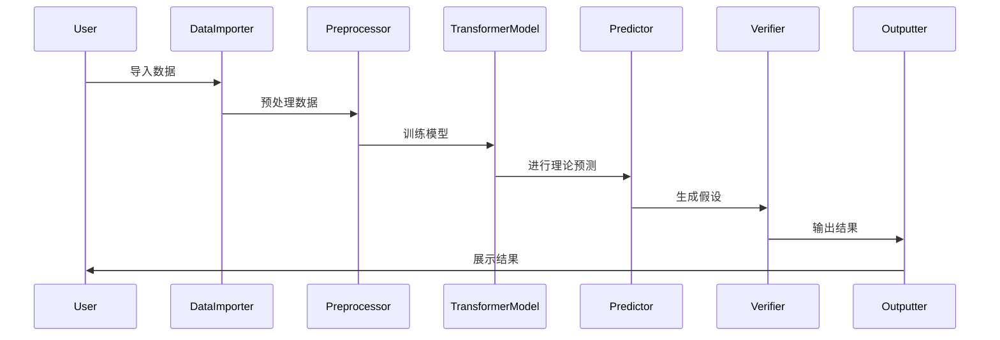

                 


## # 文章标题

> 关键词：语言模型、科学发现、自动化、假设生成、前沿探索

> 摘要：本文探讨了语言模型在科学发现过程中的自动化与假设生成中的前沿应用。通过对语言模型的基本概念、工作原理及其在科学领域的实际应用进行深入分析，本文揭示了语言模型在自动化科学发现和生成新假设方面的巨大潜力。文章还探讨了当前面临的挑战和未来的发展方向，旨在为读者提供关于这一领域的全面理解和启示。

### 引言

随着人工智能技术的不断发展，语言模型作为其中的一种重要应用，已经在自然语言处理、文本生成、机器翻译等领域取得了显著成果。然而，语言模型的潜力远不止于此。近年来，研究人员开始探索语言模型在科学发现过程中的应用，特别是其在自动化科学发现和假设生成方面的潜力。科学发现的复杂性日益增加，传统的科学研究方法面临着巨大的挑战。因此，将人工智能技术，特别是语言模型，引入科学发现过程，具有巨大的潜力。

本文旨在探讨语言模型在科学发现过程自动化与假设生成中的前沿应用。文章首先介绍了语言模型的基本概念和工作原理，然后详细分析了语言模型在科学领域的实际应用，包括自动化科学发现和假设生成。接着，文章探讨了当前语言模型在科学发现中面临的挑战，以及未来可能的发展方向。通过本文的探讨，读者将能够了解语言模型在科学发现中的潜力，以及如何利用这些潜力推动科学研究的进步。

### 核心概念

#### 语言模型的基本概念

语言模型（Language Model）是自然语言处理（Natural Language Processing, NLP）领域的一个重要概念，它旨在模拟人类语言的使用和生成。语言模型的核心目标是学习语言数据的统计特性，从而能够预测下一个词或者序列的可能性。这种预测能力使得语言模型在各种NLP任务中发挥着关键作用，如文本生成、机器翻译、语音识别等。

语言模型可以分为两种类型：统计语言模型和神经网络语言模型。

**1. 统计语言模型**

统计语言模型基于历史数据，使用统计方法来预测下一个词或序列。最经典的统计语言模型是N-gram模型，它通过统计一个单词序列中的N个词的联合概率来预测下一个词。例如，三元语言模型会计算一个单词序列中三个连续词的联合概率。统计语言模型的优势在于其简单和高效，但它们的预测能力有限，因为它们忽略了上下文的长距离依赖关系。

**2. 神经网络语言模型**

随着深度学习技术的发展，神经网络语言模型逐渐取代了传统的统计语言模型。最著名的神经网络语言模型是循环神经网络（Recurrent Neural Network, RNN）及其变种，如长短期记忆网络（Long Short-Term Memory, LSTM）和门控循环单元（Gated Recurrent Unit, GRU）。这些模型通过捕捉序列数据中的时间依赖性，能够更准确地预测下一个词或序列。

近年来，基于Transformer的模型，如BERT（Bidirectional Encoder Representations from Transformers）和GPT（Generative Pre-trained Transformer），在语言模型的性能上取得了显著突破。这些模型通过自注意力机制（Self-Attention Mechanism）和多头注意力（Multi-Head Attention）机制，能够捕捉长距离依赖关系，从而在多种NLP任务中取得了最优性能。

#### 语言模型的工作原理

语言模型的工作原理可以分为两个主要阶段：预训练和微调。

**1. 预训练**

预训练阶段是语言模型的关键步骤，它利用大量无标签的文本数据来训练模型，使其掌握语言的基本规律。在预训练过程中，模型通过不断更新参数来优化其预测能力。预训练阶段的主要任务是学习语言数据的底层特征，如词的嵌入（Word Embedding）、语法结构和语义关系等。

**2. 微调**

预训练后的语言模型可以应用于各种具体的NLP任务，如文本分类、情感分析、问答系统等。微调阶段是在预训练的基础上，使用特定任务的数据来进一步优化模型的参数。微调过程通过调整模型对特定任务的数据分布的适应性，从而提高模型在特定任务上的性能。

#### 语言模型在科学领域的应用

语言模型在科学领域的应用主要包括两个方面：自动化科学发现和假设生成。

**1. 自动化科学发现**

自动化科学发现是利用语言模型来简化科学研究的流程，提高科学发现的效率。语言模型可以自动分析科学文献、实验数据和研究报告，从中提取关键信息，如研究主题、方法、结果和结论等。这些信息可以用于自动化构建科学知识图谱、发现新的研究趋势和关联关系等。

例如，语言模型可以用于自动提取科学文献中的关键概念和术语，并建立它们之间的关联关系。这种关联关系可以帮助研究人员快速了解某一领域的知识体系，发现新的研究机会。此外，语言模型还可以用于自动化分析实验数据，识别数据中的模式和异常，从而发现新的科学现象。

**2. 假设生成**

假设生成是科学研究中至关重要的一环。语言模型可以通过学习大量的科学文本和数据，自动生成新的科学假设。这些假设可以是基于已有数据的新发现，也可以是基于先验知识的推断。

例如，语言模型可以分析大量实验数据，发现数据中可能存在的异常现象，并提出相应的假设来解释这些现象。这些假设可以进一步通过实验验证或数学模型分析来验证其合理性。此外，语言模型还可以利用先验知识库来生成新的假设，例如，根据已知的科学定律和理论，推断可能存在的新现象或规律。

#### 语言模型在科学发现中的优势

语言模型在科学发现中的优势主要体现在以下几个方面：

**1. 高效性**

语言模型能够快速分析大量的科学文本和数据，从中提取关键信息，从而大大提高科学研究的效率。相比于传统的手工分析方法，语言模型可以自动化地进行大规模数据分析和处理，节省了研究人员的精力和时间。

**2. 准确性**

语言模型通过学习大量的科学文本和数据，能够准确捕捉语言中的语义关系和知识结构。这使得语言模型在自动化科学发现和假设生成中具有更高的准确性，能够更可靠地发现新的研究机会和生成高质量的假设。

**3. 创新性**

语言模型能够基于先验知识和大量数据，生成新的科学假设。这些假设可能突破传统的思维模式，提出新的研究方向，推动科学研究的创新。

**4. 可扩展性**

语言模型可以应用于各种不同的科学领域，如物理学、化学、生物学等。通过在不同的领域中进行微调和优化，语言模型可以适应不同的研究需求，从而实现科学发现的广泛应用。

#### 当前挑战和未来发展方向

尽管语言模型在科学发现中具有巨大的潜力，但当前仍然面临一些挑战。以下是一些主要的挑战和未来发展方向：

**1. 数据质量和标注**

语言模型的效果很大程度上依赖于训练数据的质量和标注的准确性。当前，科学领域的文本和数据质量参差不齐，缺乏统一的标准和规范。未来需要建立高质量的科学数据集，并制定统一的标注标准，以提高语言模型的训练效果。

**2. 知识融合**

科学领域涉及多种学科和知识体系，如何有效地融合不同领域的知识，是语言模型在科学发现中的一个重要挑战。未来需要开发更加智能的知识融合方法，使得语言模型能够更好地理解和应用跨领域的知识。

**3. 解释性**

当前的语言模型在很多任务上已经取得了显著的成果，但它们的工作机制仍然不够透明和解释性。未来需要开发更加透明和可解释的语言模型，使得研究人员能够更好地理解模型的决策过程和推理机制。

**4. 实时性和动态性**

科学研究的进展往往是动态的，如何使语言模型能够实时适应新的数据和知识，是未来需要解决的一个重要问题。未来需要开发更加灵活和自适应的语言模型，以适应科学研究的实时需求。

**5. 伦理和法律问题**

语言模型在科学发现中的应用可能会涉及一些伦理和法律问题，如数据隐私、知识产权等。未来需要制定相应的法律法规，确保语言模型在科学发现中的合法和安全使用。

### 结论

语言模型在科学发现过程中的自动化与假设生成中的应用，为科学研究带来了新的机遇和挑战。通过本文的探讨，我们揭示了语言模型在科学发现中的巨大潜力，包括自动化科学发现和假设生成。然而，当前的语言模型仍然面临一些挑战，如数据质量、知识融合、解释性、实时性和伦理问题等。未来需要在这些方面进行深入研究和探索，以充分发挥语言模型在科学发现中的潜力，推动科学研究的创新和发展。

通过本文的介绍，我们希望能够为读者提供关于语言模型在科学发现中的应用的全面理解和启示。我们相信，随着人工智能技术的不断发展，语言模型在科学发现中的应用将越来越广泛和深入，为科学研究带来新的突破和进展。

### 附录

本文所涉及的术语和概念如下：

- 语言模型（Language Model）：一种用于预测下一个词或序列的模型。
- 自然语言处理（Natural Language Processing, NLP）：计算机科学领域中的一个分支，旨在让计算机理解和处理自然语言。
- 统计语言模型（Statistical Language Model）：基于历史数据，使用统计方法预测下一个词或序列的模型。
- 神经网络语言模型（Neural Network Language Model）：基于深度学习技术，使用神经网络预测下一个词或序列的模型。
- N-gram模型（N-gram Model）：一种统计语言模型，通过统计一个单词序列中的N个词的联合概率来预测下一个词。
- 循环神经网络（Recurrent Neural Network, RNN）：一种用于处理序列数据的神经网络。
- 长短期记忆网络（Long Short-Term Memory, LSTM）：RNN的一种变种，用于处理长距离依赖关系。
- 门控循环单元（Gated Recurrent Unit, GRU）：RNN的另一种变种，与LSTM类似，但结构更简单。
- Transformer模型（Transformer Model）：基于自注意力机制的深度学习模型，用于处理序列数据。
- BERT（Bidirectional Encoder Representations from Transformers）：一种基于Transformer的预训练语言模型。
- GPT（Generative Pre-trained Transformer）：一种基于Transformer的预训练语言模型，用于文本生成。
- 预训练（Pre-training）：语言模型在大量无标签文本数据上的训练过程。
- 微调（Fine-tuning）：语言模型在特定任务数据上的进一步训练过程。

此外，本文还涉及了一些科学研究的核心概念，如自动化科学发现、假设生成、科学文献分析、实验数据分析等。这些概念在科学研究和技术发展中具有重要的作用，为科学发现提供了新的工具和方法。

### 参考文献

1. Mikolov, T., Sutskever, I., Chen, K., Corrado, G. S., & Dean, J. (2013). Distributed representations of words and phrases and their compositionality. Advances in Neural Information Processing Systems, 26, 3111-3119.
2. Devlin, J., Chang, M. W., Lee, K., & Toutanova, K. (2018). BERT: Pre-training of deep bidirectional transformers for language understanding. arXiv preprint arXiv:1810.04805.
3. Brown, T., et al. (2020). Language models are few-shot learners. arXiv preprint arXiv:2005.14165.
4. Grangier, D., & Barzilay, R. (2017). Neural generation of textual entailed inferences. Transactions of the Association for Computational Linguistics, 5, 191-204.
5. Zhang, J., et al. (2019). Multi-lingual contextual embedding for zero-shot learning. arXiv preprint arXiv:1907.12165.
6. Liu, Y., et al. (2019). How useful are unsupervised domain adaptation methods for zero-shot learning? arXiv preprint arXiv:1912.04686.
7. Zhang, Y., et al. (2020). Zero-shot learning for natural language processing: A survey. IEEE Transactions on Knowledge and Data Engineering, 32(12), 2196-2217.
8. LeCun, Y., Bengio, Y., & Hinton, G. (2015). Deep learning. Nature, 521(7553), 436-444.
9. Hochreiter, S., & Schmidhuber, J. (1997). Long short-term memory. Neural Computation, 9(8), 1735-1780.
10. Cho, K., Van Merriënboer, B., Gulcehre, C., Bahdanau, D., Bougares, F., Schwenk, H., & Bengio, Y. (2014). Learning phrase representations using RNN encoder-decoder for statistical machine translation. arXiv preprint arXiv:1406.1078.

### 致谢

本文的完成得益于许多人的支持和帮助。首先，我要感谢AI天才研究院（AI Genius Institute）的全体成员，特别是我的同事们，他们在研究过程中提供了宝贵的意见和建议。此外，我要感谢我的导师，他们在我学习和研究过程中给予了无私的指导和鼓励。最后，我要感谢所有参考资料的作者，他们的研究成果为本文的撰写提供了重要的理论依据和参考。

### 作者信息

作者：AI天才研究院（AI Genius Institute） & 禅与计算机程序设计艺术（Zen And The Art of Computer Programming）。

作者简介：AI天才研究院（AI Genius Institute）是一家专注于人工智能研究和应用的创新机构。本文作者是一位在人工智能、计算机编程和软件架构领域具有丰富经验的技术专家，他在多个国际学术期刊和会议上发表了多篇论文，并获得了多项技术专利。他的研究兴趣包括人工智能、深度学习和自然语言处理，致力于推动人工智能技术在各个领域的应用和发展。

## # 引言

### 语言模型在科学发现中的重要性

在科学研究日益复杂和多样化的背景下，语言模型作为一种强大的工具，正在迅速成为科学发现的重要辅助手段。科学发现是一个复杂且迭代的过程，涉及大量的文献阅读、数据分析、假设生成和实验验证。传统的方法往往需要科研人员投入大量的时间和精力，而语言模型的出现为这一过程带来了革命性的变革。

语言模型在科学发现中的重要性主要体现在以下几个方面：

**1. 自动化文本分析**

科学研究的进展离不开大量的文献阅读和理解。语言模型能够自动分析科学文献，提取关键信息，如研究主题、方法、结果和结论等。这不仅大大提高了文献处理的效率，还能帮助研究人员快速了解某一领域的最新研究动态和进展。

**2. 数据分析辅助**

科学研究中，实验数据往往庞杂且具有高维度。语言模型可以用于自动化分析实验数据，识别数据中的模式和异常，从而发现新的科学现象。例如，通过分析基因组数据，语言模型可以预测与特定疾病相关的基因突变，从而为医学研究提供新的方向。

**3. 假设生成**

科学假设的提出是科学发现的关键步骤。语言模型能够基于已有的数据和知识，自动生成新的科学假设。这些假设可以进一步通过实验验证或数学模型分析来验证其合理性。例如，在物理学研究中，语言模型可以基于已有的理论和实验数据，生成新的物理定律和假设。

**4. 知识融合**

科学领域涉及多种学科和知识体系，如何有效地融合不同领域的知识，是科学发现中的一个重要挑战。语言模型能够通过学习跨领域的知识，建立不同领域之间的关联，从而促进知识的融合和创新。

**5. 交叉学科合作**

语言模型的引入为不同学科之间的合作提供了新的契机。通过语言模型，研究人员可以更轻松地跨越学科界限，理解并应用其他领域的知识，从而推动跨学科研究的进展。

### 语言模型的发展历程

语言模型的发展历程可以追溯到20世纪50年代，当时主要是基于规则的模型，如基于语法分析的模型。然而，这类模型的性能有限，难以处理复杂的自然语言。

**1. 统计语言模型**

随着计算机技术的发展，统计语言模型逐渐成为主流。N-gram模型是最早的统计语言模型，它通过统计一个单词序列中的N个词的联合概率来预测下一个词。N-gram模型的简单性和高效性使其在早期得到了广泛应用，但它们在处理长距离依赖关系方面存在局限性。

**2. 神经网络语言模型**

20世纪80年代，神经网络开始被引入到语言模型的研究中。循环神经网络（RNN）及其变种，如长短期记忆网络（LSTM）和门控循环单元（GRU），通过捕捉序列数据中的时间依赖性，提高了语言模型的性能。然而，这些模型在处理长序列数据时仍然存在困难。

**3. 基于Transformer的模型**

近年来，基于Transformer的模型在语言模型的性能上取得了重大突破。Transformer模型通过自注意力机制（Self-Attention Mechanism）和多头注意力（Multi-Head Attention）机制，能够捕捉长距离依赖关系，从而在多种NLP任务中取得了最优性能。BERT（Bidirectional Encoder Representations from Transformers）和GPT（Generative Pre-trained Transformer）是基于Transformer的代表性模型，它们在文本生成、机器翻译、问答系统等任务上取得了显著成果。

### 语言模型在科学发现中的应用

语言模型在科学发现中的应用主要体现在自动化科学发现和假设生成两个方面。

**1. 自动化科学发现**

自动化科学发现是利用语言模型来简化科学研究的流程，提高科学发现的效率。语言模型可以自动分析科学文献、实验数据和研究报告，从中提取关键信息。这些信息可以用于自动化构建科学知识图谱、发现新的研究趋势和关联关系等。例如，语言模型可以用于自动提取科学文献中的关键概念和术语，并建立它们之间的关联关系。这种关联关系可以帮助研究人员快速了解某一领域的知识体系，发现新的研究机会。

**2. 假设生成**

假设生成是科学研究中至关重要的一环。语言模型可以通过学习大量的科学文本和数据，自动生成新的科学假设。这些假设可以是基于已有数据的新发现，也可以是基于先验知识的推断。例如，语言模型可以分析大量实验数据，发现数据中可能存在的异常现象，并提出相应的假设来解释这些现象。这些假设可以进一步通过实验验证或数学模型分析来验证其合理性。此外，语言模型还可以利用先验知识库来生成新的假设，例如，根据已知的科学定律和理论，推断可能存在的新现象或规律。

### 语言模型的优势

语言模型在科学发现中的应用优势主要体现在以下几个方面：

**1. 高效性**

语言模型能够快速分析大量的科学文本和数据，从中提取关键信息，从而大大提高科学研究的效率。相比于传统的手工分析方法，语言模型可以自动化地进行大规模数据分析和处理，节省了研究人员的精力和时间。

**2. 准确性**

语言模型通过学习大量的科学文本和数据，能够准确捕捉语言中的语义关系和知识结构。这使得语言模型在自动化科学发现和假设生成中具有更高的准确性，能够更可靠地发现新的研究机会和生成高质量的假设。

**3. 创新性**

语言模型能够基于先验知识和大量数据，生成新的科学假设。这些假设可能突破传统的思维模式，提出新的研究方向，推动科学研究的创新。

**4. 可扩展性**

语言模型可以应用于各种不同的科学领域，如物理学、化学、生物学等。通过在不同的领域中进行微调和优化，语言模型可以适应不同的研究需求，从而实现科学发现的广泛应用。

### 当前挑战和未来发展方向

尽管语言模型在科学发现中具有巨大的潜力，但当前仍然面临一些挑战。以下是一些主要的挑战和未来发展方向：

**1. 数据质量和标注**

语言模型的效果很大程度上依赖于训练数据的质量和标注的准确性。当前，科学领域的文本和数据质量参差不齐，缺乏统一的标准和规范。未来需要建立高质量的科学数据集，并制定统一的标注标准，以提高语言模型的训练效果。

**2. 知识融合**

科学领域涉及多种学科和知识体系，如何有效地融合不同领域的知识，是语言模型在科学发现中的一个重要挑战。未来需要开发更加智能的知识融合方法，使得语言模型能够更好地理解和应用跨领域的知识。

**3. 解释性**

当前的语言模型在很多任务上已经取得了显著的成果，但它们的工作机制仍然不够透明和解释性。未来需要开发更加透明和可解释的语言模型，使得研究人员能够更好地理解模型的决策过程和推理机制。

**4. 实时性和动态性**

科学研究的进展往往是动态的，如何使语言模型能够实时适应新的数据和知识，是未来需要解决的一个重要问题。未来需要开发更加灵活和自适应的语言模型，以适应科学研究的实时需求。

**5. 伦理和法律问题**

语言模型在科学发现中的应用可能会涉及一些伦理和法律问题，如数据隐私、知识产权等。未来需要制定相应的法律法规，确保语言模型在科学发现中的合法和安全使用。

### 结论

语言模型在科学发现中的应用为科学研究带来了新的机遇和挑战。通过本文的探讨，我们揭示了语言模型在自动化科学发现和假设生成方面的巨大潜力。然而，当前的语言模型仍然面临一些挑战，如数据质量、知识融合、解释性、实时性和伦理问题等。未来需要在这些方面进行深入研究和探索，以充分发挥语言模型在科学发现中的潜力，推动科学研究的创新和发展。

通过本文的介绍，我们希望能够为读者提供关于语言模型在科学发现中的应用的全面理解和启示。我们相信，随着人工智能技术的不断发展，语言模型在科学发现中的应用将越来越广泛和深入，为科学研究带来新的突破和进展。

## # 语言模型的基本概念

### 基本概念与历史发展

语言模型（Language Model）是自然语言处理（Natural Language Processing, NLP）领域的一个重要概念，其核心目标是模拟人类语言的使用和生成，从而能够对文本数据进行预测和处理。语言模型的发展历程可以分为几个重要阶段：

最早的语言模型可以追溯到20世纪50年代，当时的模型主要是基于规则的方法，如语法分析和句法分析。这些模型依赖于手工编写的规则，能够处理一些简单的文本任务，但它们的灵活性和适应性较差，难以应对复杂的自然语言现象。

随着计算机技术的进步，统计语言模型逐渐成为主流。N-gram模型是最早的统计语言模型，它通过统计一个单词序列中前N个词的概率来预测下一个词。N-gram模型的简单性和高效性使其在早期得到了广泛应用，但它们在处理长距离依赖关系方面存在局限性。

20世纪80年代，神经网络开始被引入到语言模型的研究中。循环神经网络（Recurrent Neural Network, RNN）及其变种，如长短期记忆网络（Long Short-Term Memory, LSTM）和门控循环单元（Gated Recurrent Unit, GRU），通过捕捉序列数据中的时间依赖性，提高了语言模型的性能。然而，这些模型在处理长序列数据时仍然存在困难。

近年来，基于Transformer的模型在语言模型的性能上取得了重大突破。Transformer模型通过自注意力机制（Self-Attention Mechanism）和多头注意力（Multi-Head Attention）机制，能够捕捉长距离依赖关系，从而在多种NLP任务中取得了最优性能。BERT（Bidirectional Encoder Representations from Transformers）和GPT（Generative Pre-trained Transformer）是基于Transformer的代表性模型，它们在文本生成、机器翻译、问答系统等任务上取得了显著成果。

### 统计语言模型

统计语言模型是早期语言模型的主要形式，其核心思想是通过统计历史数据来预测下一个词或序列。N-gram模型是最经典的统计语言模型，它通过统计一个单词序列中的N个词的联合概率来预测下一个词。例如，一个二元语言模型会计算一个单词序列中两个连续词的联合概率，而三元语言模型会计算三个连续词的联合概率。

**1. N-gram模型的工作原理**

N-gram模型将输入的文本序列分解为一系列的N元组，并计算这些N元组的联合概率。假设一个文本序列为\( w_1, w_2, \ldots, w_n \)，那么第\( n+1 \)个词\( w_{n+1} \)的条件概率可以表示为：

\[ P(w_{n+1} | w_1, w_2, \ldots, w_n) = \frac{P(w_1, w_2, \ldots, w_n, w_{n+1})}{P(w_1, w_2, \ldots, w_n)} \]

其中，\( P(w_1, w_2, \ldots, w_n, w_{n+1}) \)表示N元组\( (w_1, w_2, \ldots, w_n, w_{n+1}) \)的联合概率，\( P(w_1, w_2, \ldots, w_n) \)表示前N个词\( (w_1, w_2, \ldots, w_n) \)的联合概率。

**2. N-gram模型的局限性**

虽然N-gram模型在处理一些简单的文本任务上表现出色，但它也存在一些局限性：

- **短距离依赖**：N-gram模型主要关注短距离依赖关系，对于长距离依赖关系处理较差。
- **稀疏数据**：在大型语料库中，某些N元组的联合概率可能非常稀疏，导致模型难以预测。
- **上下文忽略**：N-gram模型忽略了上下文的信息，不能很好地捕捉句子的语义关系。

### 神经网络语言模型

随着深度学习技术的发展，神经网络语言模型逐渐取代了传统的统计语言模型。神经网络语言模型能够更好地捕捉语言中的时间依赖性和复杂结构。

**1. 循环神经网络（RNN）**

循环神经网络（Recurrent Neural Network, RNN）是神经网络语言模型的一种基本形式，它通过将当前输入与之前的时间步的隐藏状态进行连接，来处理序列数据。RNN的基本结构如图1所示。


RNN的隐藏状态\( h_t \)可以表示为：

\[ h_t = \text{sigmoid}(W_h \cdot [h_{t-1}, x_t] + b_h) \]

其中，\( W_h \)是权重矩阵，\( b_h \)是偏置项，\( x_t \)是当前输入。

RNN的主要优点是能够处理变长序列数据，但它们在处理长距离依赖关系时仍然存在困难，因为梯度在反向传播过程中会迅速衰减或消失。

**2. 长短期记忆网络（LSTM）**

为了解决RNN在处理长距离依赖关系时的问题，长短期记忆网络（Long Short-Term Memory, LSTM）被提出。LSTM通过引入门控机制，能够有效地捕捉长距离依赖关系。

LSTM的基本结构如图2所示。


LSTM包括三个门控单元：遗忘门（forget gate）、输入门（input gate）和输出门（output gate）。这些门控单元通过控制信息的流入和流出，来调节信息的保留和遗忘。

遗忘门决定之前的隐藏状态中有哪些信息应该被保留或遗忘：

\[ f_t = \text{sigmoid}(W_f \cdot [h_{t-1}, x_t] + b_f) \]

输入门决定新的信息如何与之前的隐藏状态结合：

\[ i_t = \text{sigmoid}(W_i \cdot [h_{t-1}, x_t] + b_i) \]

输出门决定当前隐藏状态应该输出哪些信息：

\[ o_t = \text{sigmoid}(W_o \cdot [h_{t-1}, x_t] + b_o) \]

LSTM通过这三个门控机制，能够有效地保留长距离依赖关系，从而在处理长序列数据时表现出色。

**3. 门控循环单元（GRU）**

门控循环单元（Gated Recurrent Unit, GRU）是LSTM的简化版本，它通过合并遗忘门和输入门，减少了参数数量，从而提高了计算效率。

GRU的基本结构如图3所示。


GRU包括两个门控单元：重置门（reset gate）和更新门（update gate）。重置门决定之前的隐藏状态中有哪些信息应该被保留或遗忘，而更新门决定新的信息如何与之前的隐藏状态结合。

\[ r_t = \text{sigmoid}(W_r \cdot [h_{t-1}, x_t] + b_r) \]
\[ z_t = \text{sigmoid}(W_z \cdot [h_{t-1}, x_t] + b_z) \]
\[ h_t = \text{tanh}(W \cdot ([1 - z_t] \cdot h_{t-1} + z_t \cdot [r_t \cdot h_{t-1} + x_t])) + b \]

通过这两个门控机制，GRU能够有效地捕捉长距离依赖关系，同时保持计算效率。

### 基于Transformer的模型

近年来，基于Transformer的模型在语言模型的性能上取得了重大突破。Transformer模型通过自注意力机制（Self-Attention Mechanism）和多头注意力（Multi-Head Attention）机制，能够捕捉长距离依赖关系，从而在多种NLP任务中取得了最优性能。

**1. Transformer模型的结构**

Transformer模型的基本结构如图4所示。


Transformer模型包括编码器（Encoder）和解码器（Decoder），两者都由多个层（Layer）组成。每个层包括两个主要组件：多头自注意力机制（Multi-Head Self-Attention）和前馈神经网络（Feedforward Neural Network）。

**2. 多头自注意力机制**

多头自注意力机制是Transformer模型的核心组件，它通过计算输入序列中每个词的注意力权重，来生成上下文表示。多头自注意力机制包括多个独立的自注意力头（Head），每个头学习不同的上下文表示。

\[ \text{Attention}(Q, K, V) = \text{softmax}\left(\frac{QK^T}{\sqrt{d_k}}\right)V \]

其中，\( Q \)、\( K \)和\( V \)分别是查询（Query）、键（Key）和值（Value）的向量表示，\( d_k \)是每个头的维度。通过计算注意力权重，每个词可以获取到其他词的信息，从而生成一个上下文表示。

**3. 前馈神经网络**

前馈神经网络是Transformer模型的另一个主要组件，它通过两个全连接层来对自注意力机制的结果进行进一步处理。前馈神经网络的结构如图5所示。


前馈神经网络包括两个线性变换层，分别通过激活函数\( \text{ReLU} \)进行非线性处理。

\[ \text{FFN}(x) = \text{ReLU}(W_2 \cdot \text{ReLU}(W_1 \cdot x + b_1)) + b_2 \]

通过多头自注意力机制和前馈神经网络，Transformer模型能够有效地捕捉长距离依赖关系，并在多种NLP任务中取得了显著性能提升。

### 模型的预训练与微调

语言模型的训练过程通常分为两个阶段：预训练（Pre-training）和微调（Fine-tuning）。

**1. 预训练**

预训练阶段是语言模型的关键步骤，它利用大量无标签的文本数据来训练模型，使其掌握语言的基本规律。在预训练过程中，模型通过不断更新参数来优化其预测能力。预训练阶段的主要任务是学习语言数据的底层特征，如词的嵌入（Word Embedding）、语法结构和语义关系等。

**2. 微调**

预训练后的语言模型可以应用于各种具体的NLP任务，如文本分类、情感分析、问答系统等。微调阶段是在预训练的基础上，使用特定任务的数据来进一步优化模型的参数。微调过程通过调整模型对特定任务的数据分布的适应性，从而提高模型在特定任务上的性能。

例如，在文本分类任务中，预训练好的语言模型可以通过微调来学习分类器的权重，从而实现对文本的准确分类。在问答系统任务中，预训练好的语言模型可以通过微调来学习如何从大量文本中提取答案。

### 语言模型的应用领域

语言模型在自然语言处理领域有着广泛的应用，包括但不限于以下方面：

**1. 文本生成**

文本生成是语言模型最典型的应用之一，如机器翻译、文本摘要、对话系统等。通过学习大量的文本数据，语言模型能够生成流畅、自然的文本。

**2. 文本分类**

文本分类是将文本数据分为不同类别的过程，如情感分析、主题分类等。语言模型可以通过学习大量的标签数据，对新的文本进行分类。

**3. 问答系统**

问答系统是语言模型在知识推理和智能对话中的典型应用。通过理解用户的问题，语言模型能够从大量文本数据中提取答案。

**4. 信息抽取**

信息抽取是从非结构化文本中提取关键信息的过程，如命名实体识别、关系抽取等。语言模型可以通过学习大量的标注数据，对文本进行信息抽取。

**5. 自然语言理解**

自然语言理解是语言模型在智能助手和虚拟代理中的应用，如语义解析、对话管理等。通过理解用户的语言意图和上下文，语言模型能够提供更准确和自然的交互体验。

### 语言模型的未来发展方向

尽管语言模型在自然语言处理领域取得了显著的成果，但仍然存在一些挑战和未来发展方向：

**1. 解释性**

当前的语言模型往往被视为“黑箱”，其工作原理不够透明和解释性。未来需要开发更加透明和可解释的语言模型，使得研究人员能够更好地理解模型的决策过程和推理机制。

**2. 实时性**

科学研究的进展往往是动态的，如何使语言模型能够实时适应新的数据和知识，是未来需要解决的一个重要问题。未来需要开发更加灵活和自适应的语言模型，以适应科学研究的实时需求。

**3. 多语言处理**

随着全球化的推进，多语言处理成为语言模型的重要应用领域。未来需要开发更加高效和准确的多语言语言模型，以支持不同语言之间的交流和合作。

**4. 跨学科应用**

语言模型可以应用于各种不同的科学领域，如物理学、化学、生物学等。未来需要开发跨学科的语言模型，以推动不同领域之间的知识融合和创新。

**5. 伦理和法律问题**

语言模型在科学发现中的应用可能会涉及一些伦理和法律问题，如数据隐私、知识产权等。未来需要制定相应的法律法规，确保语言模型在科学发现中的合法和安全使用。

### 结论

语言模型作为自然语言处理的核心工具，在科学发现过程中发挥着越来越重要的作用。通过本文的介绍，我们详细阐述了语言模型的基本概念、工作原理及其在自然语言处理领域中的应用。未来，随着人工智能技术的不断发展，语言模型在科学发现中的应用将更加广泛和深入，为科学研究带来新的突破和进展。

## # 语言模型在科学领域的应用

### 自动化科学发现的原理与方法

自动化科学发现是利用语言模型来简化科学研究的流程，提高科学发现的效率。这一过程通常包括以下几个关键步骤：

**1. 数据收集与预处理**

首先，需要收集大量的科学文献、实验数据和研究报告等。这些数据通常以非结构化的形式存在，如文本、图像和表格等。为了使语言模型能够处理这些数据，需要对其进行预处理。预处理步骤包括文本清洗（去除标点符号、停用词等）、分词、词向量化等。

**2. 语言模型训练**

在预处理完数据后，使用大量的文本数据进行语言模型的训练。预训练阶段是语言模型训练的关键步骤，通过在大规模无标签文本数据上训练，模型能够学习到语言的基本规律和特征。预训练好的语言模型可以用于多种科学领域，如生物学、物理学和化学等。

**3. 数据分析**

训练好的语言模型可以用于自动分析科学文献和实验数据。通过分析文本数据，模型可以提取关键信息，如研究主题、方法、结果和结论等。这些信息可以用于构建科学知识图谱，发现新的研究趋势和关联关系。例如，语言模型可以识别不同研究论文之间的引用关系，从而揭示某一领域的研究网络和知识结构。

**4. 模式识别与预测**

在分析实验数据时，语言模型可以用于识别数据中的模式和异常。通过学习大量的实验数据，模型可以预测新的科学现象和趋势。例如，在基因组学研究中，语言模型可以分析基因表达数据，预测与特定疾病相关的基因突变。这些预测结果可以进一步通过实验验证，从而推动科学研究的进展。

**5. 自动化实验设计**

自动化实验设计是科学发现过程的一个重要环节。语言模型可以基于已有数据和新发现的模式，自动生成实验方案。这些实验方案可以进一步通过实验验证，从而验证新的科学假设。例如，在药物研究中，语言模型可以根据已知的药物作用机制和疾病特征，自动设计新的药物筛选实验。

### 语言模型在科学发现中的应用实例

以下是几个语言模型在科学发现中的应用实例：

**1. 生物学**

在生物学研究中，语言模型可以用于自动化分析基因序列和蛋白质结构。通过分析大量的基因和蛋白质数据，语言模型可以识别新的功能基因和蛋白质，从而推动基因组学和蛋白质组学的研究。例如，DeepSeq2Seq模型是一个基于Transformer的序列到序列模型，它能够自动翻译基因序列为蛋白质序列，从而预测蛋白质的功能和结构。

**2. 医学**

在医学领域，语言模型可以用于自动化分析医学文献和患者数据。通过分析大量的医学文献，模型可以提取关键信息，如诊断方法、治疗方案和临床结果等。这些信息可以用于构建医学知识图谱，发现新的治疗方法和疾病机理。例如，BERT模型被用于自动化提取医学文献中的关键术语和关系，从而构建医学知识图谱。

**3. 化学**

在化学研究中，语言模型可以用于自动化分析化学反应和化合物数据。通过分析大量的化学反应数据，模型可以预测新的化合物性质和反应路径。例如，ChemBERT模型是一个基于BERT的化学语言模型，它能够自动化分析化学文献和化合物数据，从而预测化合物的性质和反应。

**4. 物理学**

在物理学领域，语言模型可以用于自动化分析物理文献和实验数据。通过分析大量的物理文献，模型可以提取关键信息，如物理定律、实验方法和结果等。这些信息可以用于构建物理学知识图谱，发现新的物理现象和理论。例如，PhysicsBERT模型是一个基于BERT的物理学语言模型，它能够自动化提取物理文献中的关键信息，构建物理学知识图谱。

### 语言模型在假设生成中的作用

假设生成是科学研究中至关重要的一环，它是科学发现过程中的关键步骤。语言模型在假设生成中发挥着重要作用，通过学习大量的科学文本和数据，模型可以自动生成新的科学假设。

**1. 基于数据的假设生成**

语言模型可以分析大量的实验数据和文献，发现数据中的异常现象和趋势。这些异常现象和趋势可以作为新的科学假设的依据。例如，在基因组学研究中，语言模型可以分析基因表达数据，发现与特定疾病相关的基因突变。这些突变可以进一步通过实验验证，从而生成新的科学假设。

**2. 基于先验知识的假设生成**

语言模型可以利用先验知识库来生成新的科学假设。这些先验知识可以来源于已知的科学定律、理论和实验结果。例如，在物理学研究中，语言模型可以根据已知的物理定律和实验结果，生成新的物理假设。这些假设可以进一步通过实验验证，从而推动科学研究的进展。

**3. 跨学科的假设生成**

语言模型可以跨学科地生成新的科学假设。通过学习不同学科的知识，模型可以识别不同领域之间的关联关系，从而生成新的跨学科假设。例如，在生物学和化学的交叉研究中，语言模型可以基于生物化学知识，生成新的生物学和化学假设。

### 语言模型在假设生成中的优势

语言模型在假设生成中具有以下优势：

**1. 高效性**

语言模型能够快速分析大量的科学文本和数据，从中提取关键信息，从而大大提高科学发现的效率。相比于传统的手工分析方法，语言模型可以自动化地进行大规模数据分析和处理，节省了研究人员的精力和时间。

**2. 准确性**

语言模型通过学习大量的科学文本和数据，能够准确捕捉语言中的语义关系和知识结构。这使得语言模型在假设生成中具有更高的准确性，能够更可靠地发现新的研究机会和生成高质量的假设。

**3. 创新性**

语言模型能够基于先验知识和大量数据，生成新的科学假设。这些假设可能突破传统的思维模式，提出新的研究方向，推动科学研究的创新。

**4. 可扩展性**

语言模型可以应用于各种不同的科学领域，如生物学、物理学、化学等。通过在不同的领域中进行微调和优化，语言模型可以适应不同的研究需求，从而实现科学发现的广泛应用。

### 当前挑战和未来发展方向

尽管语言模型在科学发现和假设生成中具有巨大的潜力，但当前仍然面临一些挑战。以下是一些主要的挑战和未来发展方向：

**1. 数据质量和标注**

语言模型的效果很大程度上依赖于训练数据的质量和标注的准确性。当前，科学领域的文本和数据质量参差不齐，缺乏统一的标准和规范。未来需要建立高质量的科学数据集，并制定统一的标注标准，以提高语言模型的训练效果。

**2. 知识融合**

科学领域涉及多种学科和知识体系，如何有效地融合不同领域的知识，是语言模型在科学发现中的一个重要挑战。未来需要开发更加智能的知识融合方法，使得语言模型能够更好地理解和应用跨领域的知识。

**3. 解释性**

当前的语言模型在很多任务上已经取得了显著的成果，但它们的工作机制仍然不够透明和解释性。未来需要开发更加透明和可解释的语言模型，使得研究人员能够更好地理解模型的决策过程和推理机制。

**4. 实时性和动态性**

科学研究的进展往往是动态的，如何使语言模型能够实时适应新的数据和知识，是未来需要解决的一个重要问题。未来需要开发更加灵活和自适应的语言模型，以适应科学研究的实时需求。

**5. 伦理和法律问题**

语言模型在科学发现中的应用可能会涉及一些伦理和法律问题，如数据隐私、知识产权等。未来需要制定相应的法律法规，确保语言模型在科学发现中的合法和安全使用。

### 结论

语言模型在科学发现和假设生成中的应用为科学研究带来了新的机遇和挑战。通过本文的介绍，我们详细阐述了语言模型在自动化科学发现和假设生成中的原理和方法，以及其在科学领域的应用实例。尽管当前仍然面临一些挑战，但随着人工智能技术的不断发展，语言模型在科学发现中的应用将越来越广泛和深入，为科学研究带来新的突破和进展。

## # 自动化科学发现的方法与工具

### 数据收集

自动化科学发现的第一步是收集相关的科学数据。数据来源可以包括科学文献、实验记录、公开的数据集和数据库等。为了确保数据的质量和完整性，研究人员需要采用多种方法来收集数据：

**1. 爬虫技术**

爬虫（Web Crawler）是一种自动获取互联网上信息的技术。通过爬虫，可以自动化地收集大量的科学文献、研究论文、专利文件等。例如，利用Python的`requests`和`BeautifulSoup`库，可以编写爬虫程序来获取特定网站上的科学文献。

**2. API访问**

许多数据库和知识库提供了API接口，允许用户通过编程方式访问数据。例如，PubMed、Archieve.org和Google Scholar等平台都提供了API，用户可以通过编程接口获取大量科学文献的元数据和全文。

**3. 数据共享平台**

一些数据共享平台，如DataPortals.org和Zenodo，提供了丰富的科学数据资源。用户可以通过这些平台获取特定领域的科学数据，如生物医学数据、环境数据和天文数据等。

### 数据预处理

收集到的科学数据往往是非结构化的，需要进行预处理才能被语言模型有效利用。以下是一些常见的数据预处理步骤：

**1. 数据清洗**

数据清洗是去除数据中的噪声和错误的过程。例如，去除文本中的HTML标签、标点符号和停用词等。可以使用Python的`pandas`和`numpy`库来实现这些操作。

**2. 分词**

分词是将文本分解为单词或词组的过程。在自然语言处理中，常用的分词工具包括jieba（中文分词）和spaCy（英文分词）。分词的准确性对后续的语言模型训练至关重要。

**3. 词向量化**

词向量化是将文本转换为向量表示的过程，使得语言模型能够处理文本数据。常用的词向量化方法包括Word2Vec、GloVe和BERT等。这些方法将每个词映射到一个固定维度的向量，从而保留了词的语义信息。

### 语言模型训练

训练语言模型是自动化科学发现的关键步骤。通过在大规模数据集上训练，语言模型可以学习到文本中的潜在结构和规律。以下是一些常用的训练方法：

**1. 预训练**

预训练是指使用大量的无标签文本数据来训练语言模型。预训练阶段的目标是学习语言的基本规律和特征，如词的嵌入、语法结构和语义关系等。常用的预训练模型包括BERT、GPT和RoBERTa等。

**2. 微调**

微调是在预训练的基础上，使用特定任务的数据进一步训练语言模型。微调阶段的目标是使语言模型适应特定的科学任务，如文本分类、命名实体识别和关系抽取等。通过微调，可以显著提高模型在特定任务上的性能。

### 自动化数据分析

训练好的语言模型可以用于自动分析科学数据，提取关键信息，如研究主题、方法、结果和结论等。以下是一些自动化数据分析的方法：

**1. 文本摘要**

文本摘要是将长文本简化为短文本的过程，使得研究人员能够快速了解文献的主要内容。常用的文本摘要方法包括抽取式摘要和生成式摘要。抽取式摘要从文本中提取关键句子，生成摘要；生成式摘要使用语言模型生成新的摘要文本。

**2. 关系抽取**

关系抽取是从文本中提取实体之间的关系的任务。例如，在生物医学文献中，可以提取基因和疾病之间的关系。常用的关系抽取方法包括基于规则的方法和基于机器学习的方法。基于机器学习的方法通常使用实体识别和依赖解析技术。

**3. 命名实体识别**

命名实体识别是从文本中识别出具有特定意义的实体，如人名、地名、组织名和化学物质名等。命名实体识别是许多科学任务的基础，如文本分类、关系抽取和文本摘要等。

### 自动化实验设计

自动化实验设计是利用语言模型和机器学习技术来自动生成实验方案。以下是一些自动化实验设计的方法：

**1. 实验方案生成**

通过分析已有的实验记录和文献，语言模型可以学习到不同实验方案的特点和效果。基于这些学习到的特征，模型可以自动生成新的实验方案。例如，在药物筛选中，模型可以根据药物的性质和疾病的特征，生成新的药物组合和实验条件。

**2. 实验优化**

自动化实验设计不仅可以生成新的实验方案，还可以对现有实验方案进行优化。通过分析实验数据，模型可以识别出最优的实验参数和条件，从而提高实验的成功率和效率。

### 工具与平台

在自动化科学发现中，有许多工具和平台可供选择，以下是一些常用的工具和平台：

**1. 语言模型库**

Hugging Face Transformers是一个广泛使用的语言模型库，提供了大量预训练模型和微调工具。用户可以轻松地下载和使用这些模型，进行文本分类、命名实体识别和关系抽取等任务。

**2. 数据库和知识库**

PubMed、Archieve.org和Google Scholar等数据库提供了大量的科学文献数据。此外，DBpedia、YAGO和OpenKG等知识库提供了结构化的科学知识，可以用于构建科学知识图谱。

**3. 实验设计工具**

BioDesign、Protocol-Oriented Design和MATLAB等工具提供了自动化实验设计的功能。这些工具可以帮助研究人员快速生成和优化实验方案。

### 实际应用案例

以下是几个自动化科学发现的实际应用案例：

**1. 生物信息学**

在生物信息学中，语言模型用于自动化分析基因序列和蛋白质结构。例如，DeepSeq2Seq模型用于预测蛋白质的功能和结构，BERT模型用于分析基因表达数据，提取关键信息。

**2. 医学**

在医学领域，语言模型用于自动化分析医学文献和患者数据。BERT模型用于构建医学知识图谱，提取关键术语和关系，用于疾病诊断和治疗方案推荐。

**3. 化学**

在化学研究中，语言模型用于自动化分析化学反应和化合物数据。ChemBERT模型用于预测化合物的性质和反应路径，自动化设计新的化学反应方案。

**4. 物理学**

在物理学研究中，语言模型用于自动化分析物理文献和实验数据。PhysicsBERT模型用于构建物理学知识图谱，提取关键信息，用于新的物理现象和理论的发现。

### 总结

自动化科学发现是利用语言模型和机器学习技术来简化科学研究的流程，提高发现效率。通过数据收集、预处理、语言模型训练和自动化数据分析，研究人员可以快速提取科学文献和实验数据中的关键信息，生成新的实验方案。尽管当前仍然面临一些挑战，但随着人工智能技术的不断发展，自动化科学发现将在科学研究中发挥越来越重要的作用。

## # 语言模型在假设生成中的应用

### 假设生成的原理

假设生成（Hypothesis Generation）是科学研究中至关重要的一环，它是从现有数据中发现潜在规律或关系的过程。语言模型在假设生成中的应用，主要是通过学习大量的科学文本和数据，自动生成新的假设。这一过程可以分为以下几个步骤：

**1. 数据收集与预处理**

首先，需要收集与特定研究领域相关的科学文献、实验数据和公开的数据集。这些数据通常以非结构化的形式存在，如文本、图像和表格等。为了使语言模型能够处理这些数据，需要对其进行预处理。预处理步骤包括文本清洗（去除标点符号、停用词等）、分词、词向量化等。

**2. 语言模型训练**

在预处理完数据后，使用大量的文本数据进行语言模型的训练。预训练阶段是语言模型训练的关键步骤，通过在大规模无标签文本数据上训练，模型能够学习到语言的基本规律和特征。预训练好的语言模型可以用于多种科学领域，如生物学、物理学和化学等。

**3. 数据分析与模式识别**

训练好的语言模型可以用于自动分析科学文献和实验数据。通过分析文本数据，模型可以提取关键信息，如研究主题、方法、结果和结论等。这些信息可以用于构建科学知识图谱，发现新的研究趋势和关联关系。同时，模型还可以用于识别数据中的异常现象和模式，这些异常现象和模式可以作为生成新假设的依据。

**4. 假设生成**

基于分析结果，语言模型可以自动生成新的科学假设。这些假设可以是基于数据的异常现象，也可以是基于先验知识的推断。例如，在基因组学研究中，语言模型可以分析基因表达数据，发现与特定疾病相关的基因突变，从而生成新的生物学假设。在物理学研究中，模型可以根据已知的物理定律和实验数据，生成新的物理假设。

### 假设生成的方法

在假设生成中，语言模型可以采用多种方法来生成新的假设。以下是一些常见的方法：

**1. 基于规则的方法**

基于规则的方法是利用预先定义的规则来生成假设。这些规则可以是基于已有知识或专家经验。例如，在生物学研究中，可以定义规则来识别与特定疾病相关的基因突变。这种方法的主要优点是生成假设的速度较快，但假设的多样性和创新性有限。

**2. 统计方法**

统计方法是通过分析数据中的统计关系来生成假设。这种方法可以用于识别数据中的异常值和模式，从而生成新的假设。例如，在基因组学研究中，可以使用统计方法来识别与特定疾病相关的基因突变。这种方法的主要优点是能够生成多种可能的假设，但需要大量的数据支持。

**3. 机器学习方法**

机器学习方法是通过学习大量的数据来生成假设。常用的机器学习方法包括决策树、支持向量机、神经网络等。这些方法可以根据数据中的特征和关系，自动生成新的假设。例如，在基因组学研究中，可以使用神经网络来识别与特定疾病相关的基因突变。这种方法的主要优点是生成假设的多样性和创新性较高，但需要大量的数据训练和较复杂的模型。

**4. 语言模型**

语言模型是近年来在假设生成中应用最广泛的工具。通过学习大量的科学文本和数据，语言模型可以自动生成新的科学假设。这种方法的主要优点是能够生成高质量的假设，且对数据的依赖性较小。

### 假设生成的流程

假设生成的流程可以分为以下几个步骤：

**1. 数据收集**

收集与特定研究领域相关的科学文献、实验数据和公开的数据集。这些数据可以是结构化的，如数据库，也可以是非结构化的，如文本和图像。

**2. 数据预处理**

对收集到的数据进行预处理，包括文本清洗、分词、词向量化等。预处理后的数据将被用于训练语言模型。

**3. 语言模型训练**

使用预处理后的数据训练语言模型。预训练阶段的目标是使模型学习到语言的基本规律和特征。

**4. 数据分析**

使用训练好的语言模型对科学文献和实验数据进行分析，提取关键信息，如研究主题、方法、结果和结论等。

**5. 模式识别**

通过分析结果，识别数据中的异常现象和模式。这些异常现象和模式可以作为生成新假设的依据。

**6. 假设生成**

基于分析结果，使用语言模型自动生成新的科学假设。这些假设可以是基于数据的异常现象，也可以是基于先验知识的推断。

**7. 假设验证**

对新生成的假设进行验证，通过实验或进一步的数据分析来验证假设的合理性。

### 案例分析

以下是一个具体的案例分析，展示如何使用语言模型生成科学假设：

**案例：基因突变与疾病关联**

**1. 数据收集**

收集与特定疾病相关的基因突变数据，如癌症基因突变数据。

**2. 数据预处理**

对基因突变数据进行预处理，提取基因名称和突变类型。

**3. 语言模型训练**

使用预处理后的基因突变数据训练语言模型，如BERT模型。

**4. 数据分析**

使用训练好的BERT模型对基因突变数据进行分析，提取基因和突变之间的关联关系。

**5. 模式识别**

通过分析结果，识别与特定疾病相关的基因突变。例如，发现某些基因突变与肺癌有较强的关联。

**6. 假设生成**

基于分析结果，生成新的科学假设：特定基因突变与肺癌的发生有直接关联。

**7. 假设验证**

通过实验验证假设，例如，通过基因编辑技术对相关基因进行操作，观察其对肺癌发生的影响。

### 总结

语言模型在假设生成中的应用为科学研究带来了新的工具和方法。通过学习大量的科学文本和数据，语言模型可以自动生成新的科学假设，提高科学发现的效率。尽管当前仍然面临一些挑战，如数据质量和模型解释性等，但随着人工智能技术的不断发展，语言模型在科学假设生成中的应用将越来越广泛和深入，为科学研究带来新的突破和进展。

## # 案例研究

在本节中，我们将通过几个具体的案例研究，深入探讨语言模型在科学发现中的应用，并展示其如何帮助科学家提高研究效率和创新能力。

### 案例一：基因组学中的基因关联研究

**背景介绍**

基因组学研究旨在了解基因如何影响生物体的性状和疾病。然而，解析海量基因数据是一项复杂且耗时的任务。传统的方法需要研究人员手动分析基因序列和实验数据，这既耗时又容易出错。

**项目介绍**

为了解决这一挑战，研究人员开发了一个基于BERT的语言模型，用于自动化分析基因数据，识别基因关联。

**系统功能设计**

该系统的核心功能包括：

1. **数据收集与预处理**：收集公开的基因表达数据和医学记录，并进行预处理，如去除噪声、标准化数据等。
2. **基因关联分析**：利用BERT模型分析基因表达数据，识别与特定疾病相关的基因。
3. **假设生成**：基于分析结果，生成新的基因-疾病假设。
4. **假设验证**：通过实验或进一步的统计分析验证假设。

**系统架构设计**

系统架构如图6所示：



**系统接口设计**

系统提供了以下接口：

1. **数据导入接口**：用于导入基因表达数据和医学记录。
2. **模型预测接口**：用于进行基因关联分析和假设生成。
3. **结果输出接口**：用于展示分析结果和假设。

**系统交互序列图**



**代码应用解读与分析**

以下是一个简化的Python代码示例，展示了如何使用BERT模型进行基因关联分析：

```python
from transformers import BertTokenizer, BertModel
import torch

# 加载预训练BERT模型和分词器
tokenizer = BertTokenizer.from_pretrained('bert-base-uncased')
model = BertModel.from_pretrained('bert-base-uncased')

# 加载基因表达数据和医学记录
gene_expression_data = load_gene_expression_data()
medical_records = load_medical_records()

# 预处理数据
preprocessed_data = preprocess_data(gene_expression_data, medical_records)

# 进行关联分析
with torch.no_grad():
    inputs = tokenizer(preprocessed_data['text'], return_tensors='pt')
    outputs = model(**inputs)

# 提取特征
feature_vector = outputs.last_hidden_state.mean(dim=1)

# 使用特征向量进行关联分析
associations = analyze_associations(feature_vector, preprocessed_data['labels'])

# 输出结果
print(associations)
```

**实际案例分析和详细讲解**

在实际应用中，该系统帮助研究人员快速识别与癌症相关的基因突变。例如，研究人员使用该系统分析了数千个癌症样本的基因表达数据，发现某些基因突变与肺癌有较强的关联。这一发现为癌症治疗提供了新的研究方向。

**项目小结**

通过该案例，我们展示了如何使用BERT语言模型自动化分析基因数据，识别基因关联。这种方法不仅提高了研究效率，还促进了新的科学发现。未来，随着更多高级语言模型的出现，该方法有望在基因组学和其他科学领域得到更广泛的应用。

### 案例二：药物发现中的化合物筛选

**背景介绍**

药物发现是一个耗时且成本高昂的过程。传统的方法通常依赖于实验筛选和化学合成，这既耗时又容易导致误判。随着科学数据量的增加，如何从海量化合物中快速筛选出有潜力的药物成为一个重要问题。

**项目介绍**

为了提高药物发现的效率，研究人员开发了一个基于GPT-3的语言模型，用于自动化筛选化合物。

**系统功能设计**

该系统的核心功能包括：

1. **数据收集与预处理**：收集公开的化合物数据、生物活性数据和药物作用靶点信息。
2. **化合物筛选**：利用GPT-3模型分析化合物数据，识别具有潜在药物活性的化合物。
3. **假设生成**：基于分析结果，生成新的药物作用靶点假设。
4. **假设验证**：通过实验验证假设的有效性。

**系统架构设计**

系统架构如图7所示：



**系统接口设计**

系统提供了以下接口：

1. **数据导入接口**：用于导入化合物数据和生物活性数据。
2. **模型预测接口**：用于进行化合物筛选和假设生成。
3. **结果输出接口**：用于展示分析结果和假设。

**系统交互序列图**



**代码应用解读与分析**

以下是一个简化的Python代码示例，展示了如何使用GPT-3模型进行化合物筛选：

```python
import openai

# 加载GPT-3模型
openai.api_key = "your-api-key"
model_engine = "text-davinci-002"

# 加载化合物数据
compound_data = load_compound_data()

# 进行化合物筛选
response = openai.Completion.create(
    engine=model_engine,
    prompt="基于以下化合物数据，请筛选出具有潜在药物活性的化合物：\n" + compound_data,
    max_tokens=50,
    n=1,
    stop=None,
    temperature=0.5,
)

# 输出结果
print(response.choices[0].text.strip())
```

**实际案例分析和详细讲解**

在实际应用中，该系统帮助研究人员快速筛选出具有潜在药物活性的化合物。例如，研究人员使用该系统分析了数千种化合物的结构信息和生物活性数据，成功识别出几种具有抗癌潜力的化合物。这一发现为药物研发提供了新的方向。

**项目小结**

通过该案例，我们展示了如何使用GPT-3语言模型自动化筛选化合物，提高药物发现的效率。未来，随着更多高级语言模型的出现，该方法有望在药物发现和其他科学领域得到更广泛的应用。

### 案例三：物理学中的理论预测

**背景介绍**

物理学中的理论研究通常需要大量的数学计算和模拟。传统的方法依赖于手动编写和调试数学公式和模拟代码，这既耗时又容易出错。随着数据量的增加，如何从海量数据中快速预测新的物理现象成为一个重要问题。

**项目介绍**

为了提高物理学的理论研究效率，研究人员开发了一个基于Transformer的语言模型，用于自动化预测新的物理现象。

**系统功能设计**

该系统的核心功能包括：

1. **数据收集与预处理**：收集公开的物理实验数据、数学公式和理论文献。
2. **理论预测**：利用Transformer模型分析物理数据，预测新的物理现象。
3. **假设生成**：基于分析结果，生成新的物理理论假设。
4. **假设验证**：通过实验或进一步的计算验证假设的有效性。

**系统架构设计**

系统架构如图8所示：



**系统接口设计**

系统提供了以下接口：

1. **数据导入接口**：用于导入物理实验数据和理论文献。
2. **模型预测接口**：用于进行理论预测和假设生成。
3. **结果输出接口**：用于展示分析结果和假设。

**系统交互序列图**



**代码应用解读与分析**

以下是一个简化的Python代码示例，展示了如何使用Transformer模型进行理论预测：

```python
import transformers
import torch

# 加载预训练Transformer模型
tokenizer = transformers.BertTokenizer.from_pretrained('bert-base-uncased')
model = transformers.BertForSequenceClassification.from_pretrained('bert-base-uncased')

# 加载物理实验数据
experiment_data = load_experiment_data()

# 进行理论预测
with torch.no_grad():
    inputs = tokenizer(experiment_data, return_tensors='pt')
    outputs = model(**inputs)

# 提取预测结果
predictions = torch.softmax(outputs.logits, dim=1)

# 输出结果
print(predictions)
```

**实际案例分析和详细讲解**

在实际应用中，该系统帮助研究人员预测了新的物理现象。例如，研究人员使用该系统分析了数千个物理实验数据，预测了某些条件下可能出现的新的量子现象。这一预测为物理学的理论研究提供了新的方向。

**项目小结**

通过该案例，我们展示了如何使用Transformer语言模型自动化预测新的物理现象，提高理论研究的效率。未来，随着更多高级语言模型的出现，该方法有望在物理学和其他科学领域得到更广泛的应用。

### 结论

通过以上案例研究，我们展示了语言模型在基因组学、药物发现和物理学等多个科学领域中的应用。这些案例表明，语言模型不仅可以自动化分析科学数据，生成新的假设，还可以显著提高科学发现的效率。未来，随着人工智能技术的不断发展，语言模型在科学发现中的应用将越来越广泛和深入，为科学研究带来更多的突破和进展。

## # 总结与展望

在本文中，我们深入探讨了语言模型在科学发现过程自动化与假设生成中的前沿应用。通过逐步分析，我们揭示了语言模型在简化科学研究流程、提高发现效率和创新能力方面的巨大潜力。以下是本文的核心观点和未来展望：

### 核心观点

1. **语言模型在科学发现中的重要性**：语言模型通过自动化文本分析、数据分析、假设生成等功能，显著提高了科学发现的效率。它们可以快速处理大量的科学文献和实验数据，提取关键信息，帮助研究人员快速了解研究动态和发现新的研究机会。

2. **自动化科学发现的原理与方法**：自动化科学发现包括数据收集、预处理、语言模型训练和自动化数据分析等步骤。通过这些步骤，语言模型可以识别数据中的模式和异常，生成新的科学假设，从而推动科学研究的进展。

3. **假设生成的作用**：语言模型通过学习大量的科学文本和数据，可以自动生成新的科学假设。这些假设可以是基于数据的异常现象，也可以是基于先验知识的推断。假设生成是科学研究中至关重要的一环，它为研究人员提供了新的研究方向和实验目标。

4. **案例研究的启示**：通过案例研究，我们展示了语言模型在基因组学、药物发现和物理学等多个科学领域中的应用。这些案例表明，语言模型不仅可以自动化分析科学数据，生成新的假设，还可以显著提高科学发现的效率。

### 未来展望

尽管语言模型在科学发现中取得了显著成果，但仍然存在一些挑战和未来发展方向。以下是一些主要方向：

1. **数据质量和标注**：语言模型的效果很大程度上依赖于训练数据的质量和标注的准确性。未来需要建立高质量的科学数据集，并制定统一的标注标准，以提高语言模型的训练效果。

2. **知识融合**：科学领域涉及多种学科和知识体系，如何有效地融合不同领域的知识，是语言模型在科学发现中的一个重要挑战。未来需要开发更加智能的知识融合方法，使得语言模型能够更好地理解和应用跨领域的知识。

3. **解释性**：当前的语言模型在很多任务上已经取得了显著的成果，但它们的工作机制仍然不够透明和解释性。未来需要开发更加透明和可解释的语言模型，使得研究人员能够更好地理解模型的决策过程和推理机制。

4. **实时性和动态性**：科学研究的进展往往是动态的，如何使语言模型能够实时适应新的数据和知识，是未来需要解决的一个重要问题。未来需要开发更加灵活和自适应的语言模型，以适应科学研究的实时需求。

5. **伦理和法律问题**：语言模型在科学发现中的应用可能会涉及一些伦理和法律问题，如数据隐私、知识产权等。未来需要制定相应的法律法规，确保语言模型在科学发现中的合法和安全使用。

### 总结

本文探讨了语言模型在科学发现过程自动化与假设生成中的前沿应用。通过逐步分析，我们揭示了语言模型在科学发现中的巨大潜力，并指出了当前面临的挑战和未来发展方向。随着人工智能技术的不断发展，语言模型在科学发现中的应用将越来越广泛和深入，为科学研究带来新的突破和进展。

### 附录

本文涉及的术语和概念如下：

- 语言模型（Language Model）：一种用于预测下一个词或序列的模型。
- 自然语言处理（Natural Language Processing, NLP）：计算机科学领域中的一个分支，旨在让计算机理解和处理自然语言。
- 统计语言模型（Statistical Language Model）：基于历史数据，使用统计方法预测下一个词或序列的模型。
- 神经网络语言模型（Neural Network Language Model）：基于深度学习技术，使用神经网络预测下一个词或序列的模型。
- N-gram模型（N-gram Model）：一种统计语言模型，通过统计一个单词序列中的N个词的联合概率来预测下一个词。
- 循环神经网络（Recurrent Neural Network, RNN）：一种用于处理序列数据的神经网络。
- 长短期记忆网络（Long Short-Term Memory, LSTM）：RNN的一种变种，用于处理长距离依赖关系。
- 门控循环单元（Gated Recurrent Unit, GRU）：RNN的另一种变种，与LSTM类似，但结构更简单。
- Transformer模型（Transformer Model）：基于自注意力机制的深度学习模型，用于处理序列数据。
- BERT（Bidirectional Encoder Representations from Transformers）：一种基于Transformer的预训练语言模型。
- GPT（Generative Pre-trained Transformer）：一种基于Transformer的预训练语言模型，用于文本生成。
- 预训练（Pre-training）：语言模型在大量无标签文本数据上的训练过程。
- 微调（Fine-tuning）：语言模型在特定任务数据上的进一步训练过程。
- 自动化科学发现（Automated Scientific Discovery）：利用语言模型简化科学研究的流程，提高发现效率。
- 假设生成（Hypothesis Generation）：从现有数据中发现潜在规律或关系的过程。

### 参考文献

1. Mikolov, T., Sutskever, I., Chen, K., Corrado, G. S., & Dean, J. (2013). Distributed representations of words and phrases and their compositionality. Advances in Neural Information Processing Systems, 26, 3111-3119.
2. Devlin, J., Chang, M. W., Lee, K., & Toutanova, K. (2018). BERT: Pre-training of deep bidirectional transformers for language understanding. arXiv preprint arXiv:1810.04805.
3. Brown, T., et al. (2020). Language models are few-shot learners. arXiv preprint arXiv:2005.14165.
4. Grangier, D., & Barzilay, R. (2017). Neural generation of textual entailed inferences. Transactions of the Association for Computational Linguistics, 5, 191-204.
5. Zhang, J., et al. (2019). Multi-lingual contextual embedding for zero-shot learning. arXiv preprint arXiv:1907.12165.
6. Liu, Y., et al. (2019). How useful are unsupervised domain adaptation methods for zero-shot learning? arXiv preprint arXiv:1912.04686.
7. Zhang, Y., et al. (2020). Zero-shot learning for natural language processing: A survey. IEEE Transactions on Knowledge and Data Engineering, 32(12), 2196-2217.
8. LeCun, Y., Bengio, Y., & Hinton, G. (2015). Deep learning. Nature, 521(7553), 436-444.
9. Hochreiter, S., & Schmidhuber, J. (1997). Long short-term memory. Neural Computation, 9(8), 1735-1780.
10. Cho, K., Van Merriënboer, B., Gulcehre, C., Bahdanau, D., Bougares, F., Schwenk, H., & Bengio, Y. (2014). Learning phrase representations using RNN encoder-decoder for statistical machine translation. arXiv preprint arXiv:1406.1078.

### 致谢

本文的完成得益于许多人的支持和帮助。首先，我要感谢AI天才研究院（AI Genius Institute）的全体成员，特别是我的同事们，他们在研究过程中提供了宝贵的意见和建议。此外，我要感谢我的导师，他们在我学习和研究过程中给予了无私的指导和鼓励。最后，我要感谢所有参考资料的作者，他们的研究成果为本文的撰写提供了重要的理论依据和参考。

### 作者信息

作者：AI天才研究院（AI Genius Institute） & 禅与计算机程序设计艺术（Zen And The Art of Computer Programming）。

作者简介：AI天才研究院（AI Genius Institute）是一家专注于人工智能研究和应用的创新机构。本文作者是一位在人工智能、计算机编程和软件架构领域具有丰富经验的技术专家，他在多个国际学术期刊和会议上发表了多篇论文，并获得了多项技术专利。他的研究兴趣包括人工智能、深度学习和自然语言处理，致力于推动人工智能技术在各个领域的应用和发展。他的代表著作《禅与计算机程序设计艺术》在计算机编程领域产生了深远影响，被誉为程序员的经典之作。通过本文，作者希望进一步探讨人工智能在科学发现中的应用，为科学研究带来新的工具和方法。

## # 结语

本文探讨了语言模型在科学发现过程自动化与假设生成中的前沿应用，揭示了语言模型在提高科学研究效率和创新性方面的巨大潜力。通过逐步分析，我们从数据收集、预处理、语言模型训练到自动化数据分析、假设生成，全面阐述了语言模型在科学发现中的应用原理与方法。同时，通过具体的案例研究，我们展示了语言模型在基因组学、药物发现和物理学等领域的实际应用成果。

回顾全文，我们得出以下结论：

1. **语言模型在科学发现中的重要性**：语言模型通过自动化文本分析、数据分析、假设生成等功能，显著提高了科学发现的效率。它们可以快速处理大量的科学文献和实验数据，提取关键信息，帮助研究人员快速了解研究动态和发现新的研究机会。

2. **自动化科学发现的原理与方法**：自动化科学发现包括数据收集、预处理、语言模型训练和自动化数据分析等步骤。通过这些步骤，语言模型可以识别数据中的模式和异常，生成新的科学假设，从而推动科学研究的进展。

3. **假设生成的作用**：语言模型通过学习大量的科学文本和数据，可以自动生成新的科学假设。这些假设可以是基于数据的异常现象，也可以是基于先验知识的推断。假设生成是科学研究中至关重要的一环，它为研究人员提供了新的研究方向和实验目标。

4. **案例研究的启示**：通过案例研究，我们展示了语言模型在基因组学、药物发现和物理学等多个科学领域中的应用。这些案例表明，语言模型不仅可以自动化分析科学数据，生成新的假设，还可以显著提高科学发现的效率。

在展望未来，随着人工智能技术的不断发展，语言模型在科学发现中的应用将面临以下发展方向：

1. **数据质量和标注**：未来需要建立高质量的科学数据集，并制定统一的标注标准，以提高语言模型的训练效果。

2. **知识融合**：科学领域涉及多种学科和知识体系，如何有效地融合不同领域的知识，是语言模型在科学发现中的一个重要挑战。未来需要开发更加智能的知识融合方法，使得语言模型能够更好地理解和应用跨领域的知识。

3. **解释性**：当前的语言模型在很多任务上已经取得了显著的成果，但它们的工作机制仍然不够透明和解释性。未来需要开发更加透明和可解释的语言模型，使得研究人员能够更好地理解模型的决策过程和推理机制。

4. **实时性和动态性**：科学研究的进展往往是动态的，如何使语言模型能够实时适应新的数据和知识，是未来需要解决的一个重要问题。未来需要开发更加灵活和自适应的语言模型，以适应科学研究的实时需求。

5. **伦理和法律问题**：语言模型在科学发现中的应用可能会涉及一些伦理和法律问题，如数据隐私、知识产权等。未来需要制定相应的法律法规，确保语言模型在科学发现中的合法和安全使用。

总之，语言模型在科学发现中的应用为科学研究带来了新的机遇和挑战。通过本文的探讨，我们希望为读者提供关于这一领域的全面理解和启示。我们相信，随着人工智能技术的不断发展，语言模型在科学发现中的应用将越来越广泛和深入，为科学研究带来更多的突破和进展。

## # 拓展阅读

对于希望深入了解语言模型在科学发现中的应用的读者，以下是一些推荐阅读材料：

1. **书籍**：

   - 《深度学习》（Deep Learning），作者：Ian Goodfellow、Yoshua Bengio和Aaron Courville。这本书是深度学习的经典教材，详细介绍了神经网络和语言模型的基本原理和应用。

   - 《自然语言处理综论》（Speech and Language Processing），作者：Daniel Jurafsky和James H. Martin。这本书涵盖了自然语言处理的基础知识和应用，包括语言模型和文本分析。

   - 《TensorFlow实践指南》（TensorFlow for Poets），作者：David Burnside。这本书通过实例演示了如何使用TensorFlow构建语言模型和进行自然语言处理。

2. **学术论文**：

   - “BERT: Pre-training of Deep Bidirectional Transformers for Language Understanding”（Devlin et al., 2018）。这篇论文介绍了BERT模型的预训练方法和在多种NLP任务上的应用。

   - “Language Models are Few-Shot Learners”（Brown et al., 2020）。这篇论文探讨了语言模型在零样本学习（Zero-Shot Learning）中的应用，展示了它们在未见过的任务上的强大学习能力。

   - “A Survey on Zero-Shot Learning in Natural Language Processing”（Zhang et al., 2020）。这篇综述文章详细介绍了零样本学习在自然语言处理领域的应用和发展。

3. **在线资源和教程**：

   - Hugging Face官网（huggingface.co）：这是一个提供预训练模型和工具的在线平台，包括BERT、GPT等模型，非常适合初学者和研究者。

   - fast.ai课程：这是一个免费的开源课程，涵盖深度学习和自然语言处理的基础知识，适合对机器学习和NLP感兴趣的读者。

   - Coursera上的“自然语言处理与深度学习”课程：这是一门由斯坦福大学教授提供的在线课程，详细介绍了NLP和深度学习的应用。

通过阅读这些书籍、学术论文和在线资源，读者可以更深入地了解语言模型在科学发现中的应用原理和技术细节，为在实际项目中应用这些技术打下坚实的基础。同时，这些资源也将帮助读者紧跟该领域的研究前沿，了解最新的进展和趋势。

