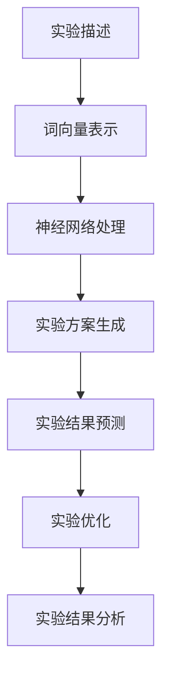
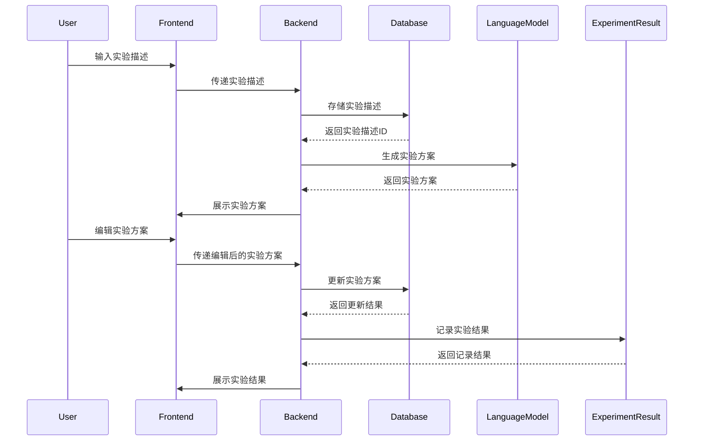
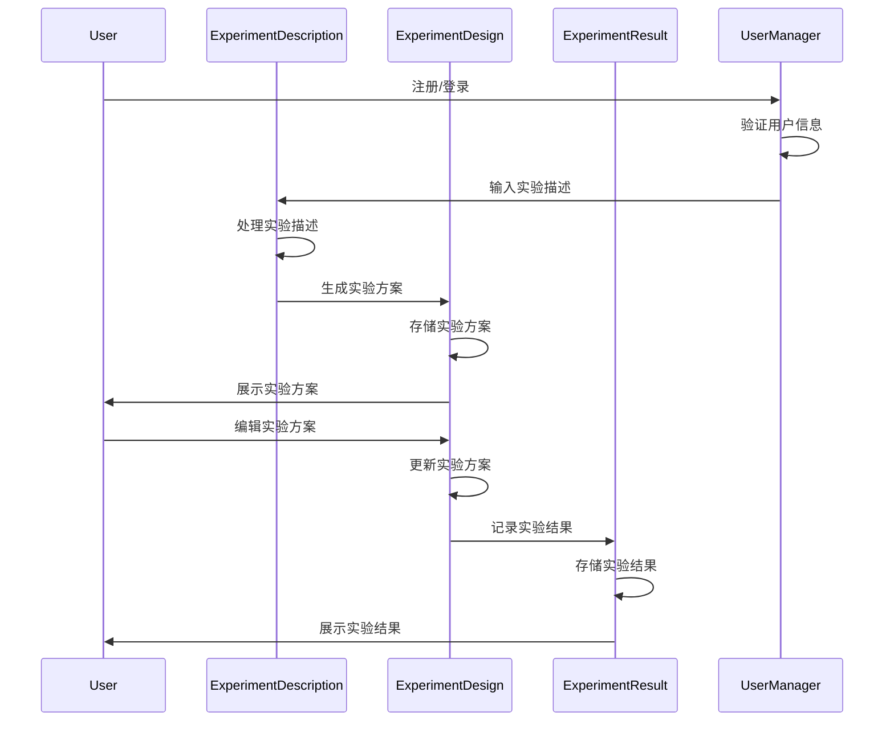

                 

### 第一部分：背景介绍

#### 1.1 语言模型在科学实验设计自动化中的应用背景

科学实验设计是科学研究的重要环节，它决定了实验的可重复性和有效性。传统的实验设计方法主要依赖于科学家的经验和知识，不仅耗时费力，而且容易出现人为错误。随着计算机科学和人工智能技术的发展，自动化实验设计逐渐成为可能。语言模型，作为一种先进的人工智能技术，在自动化实验设计中发挥着重要作用。

语言模型是一种能够理解和生成自然语言的人工智能系统。它通过大规模的数据训练，掌握了自然语言的规律和结构，能够对输入的文本进行理解和生成。在科学实验设计中，语言模型可以自动处理实验描述、生成实验方案、预测实验结果，从而提高实验设计的效率和准确性。

语言模型的优势主要体现在以下几个方面：

1. **数据处理能力**：语言模型能够处理大规模的文本数据，提取出有用的信息，为实验设计提供数据支持。
2. **自动化生成**：语言模型可以自动生成实验方案，减少人工干预，提高实验设计的效率。
3. **灵活性**：语言模型能够根据不同的实验需求，灵活调整实验方案，提高实验设计的适应性。
4. **准确性**：语言模型通过对大量数据的训练，能够准确理解实验描述，减少人为错误。

#### 1.2 问题描述

科学实验设计过程中，科学家常常面临以下问题：

1. **重复性差**：由于实验设计的复杂性，不同实验者可能得到不同的实验结果，缺乏重复性。
2. **效率低**：实验设计过程繁琐，需要大量的时间和人力投入。
3. **错误率高**：实验设计过程中，容易出现人为错误，影响实验的准确性。

这些问题严重制约了科学研究的进展。语言模型的引入，可以解决上述问题，提高实验设计的质量和效率。

#### 1.3 问题解决

语言模型在科学实验设计自动化中的应用，主要体现在以下几个方面：

1. **实验描述解析**：语言模型能够理解实验描述，提取出关键信息，为实验设计提供数据支持。
2. **实验方案生成**：语言模型可以根据实验需求，自动生成实验方案，减少人工干预。
3. **结果预测**：语言模型可以通过对历史数据的分析，预测实验结果，为实验设计提供参考。
4. **实验优化**：语言模型可以根据实验结果，对实验方案进行优化，提高实验的准确性。

通过以上应用，语言模型能够显著提高实验设计的效率和准确性，为科学研究提供有力支持。

#### 1.4 边界与外延

语言模型在科学实验设计自动化中的应用，具有一定的边界和外延。

1. **边界**：语言模型主要应用于基于文本描述的实验设计，对于需要高度物理仿真或实验环境的实验设计，语言模型的适用性有限。
2. **外延**：语言模型的应用范围可以扩展到其他领域，如医学实验设计、环境科学实验设计等。

#### 1.5 概念结构与核心要素组成

语言模型在科学实验设计自动化中的应用，涉及以下核心概念和要素：

1. **语言模型**：包括词向量表示、神经网络结构、训练算法等。
2. **实验描述**：包括实验目标、实验方法、实验条件等。
3. **实验方案**：包括实验步骤、实验参数、实验设备等。
4. **实验结果**：包括实验数据、实验分析、实验结论等。

这些概念和要素相互关联，共同构成了语言模型在科学实验设计自动化中的概念结构。

### 1.6 语言模型的基本概念

语言模型是自然语言处理领域的一种重要技术，它通过学习大量文本数据，预测下一个单词或词组。语言模型的核心目标是理解自然语言的统计规律，从而生成或理解人类语言。

#### 1.6.1 语言模型的工作原理

语言模型的工作原理可以概括为以下几个步骤：

1. **词向量表示**：将自然语言中的单词转换为向量表示，这一过程通常使用词嵌入技术实现。
2. **神经网络结构**：使用神经网络（如循环神经网络RNN、Transformer等）对词向量进行处理，学习单词之间的上下文关系。
3. **预测下一个词**：在给定一个单词序列的情况下，语言模型预测下一个单词。

#### 1.6.2 语言模型的组成部分

语言模型主要由以下几部分组成：

1. **词汇表**：包含所有可能出现的单词或词组。
2. **词向量**：每个单词或词组在向量空间中的表示。
3. **神经网络**：用于学习单词之间的上下文关系，通常包含多个层。
4. **损失函数**：用于评估模型预测的准确性，如交叉熵损失函数。

#### 1.6.3 语言模型在科学实验设计中的应用

在科学实验设计中，语言模型可以用于以下方面：

1. **实验描述理解**：语言模型可以理解实验描述，提取关键信息，为实验设计提供数据支持。
2. **实验方案生成**：语言模型可以根据实验需求，自动生成实验方案，减少人工干预。
3. **结果预测**：语言模型可以通过对历史数据的分析，预测实验结果，为实验设计提供参考。

#### 1.7 不同语言模型的属性特征对比

目前，常见的语言模型包括GPT、BERT、RoBERTa等。以下是对这些语言模型的属性特征进行对比分析：

| 模型名称 | 词向量表示 | 网络结构 | 损失函数 | 应用场景 |
| :----: | :----: | :----: | :----: | :----: |
| GPT | Word2Vec | RNN | 交叉熵 | 文本生成、问答系统 |
| BERT | Word2Vec | Transformer | 交叉熵 | 实体识别、文本分类 |
| RoBERTa | Word2Vec | Transformer | 交叉熵 | 文本生成、问答系统 |

通过对比可以发现，不同的语言模型在词向量表示、网络结构、损失函数和应用场景上各有特点。选择合适的语言模型，可以更好地满足科学实验设计的需求。

#### 1.8 语言模型与科学实验设计的交互关系

语言模型与科学实验设计的交互关系可以用以下ER实体关系图来表示：

```mermaid
erDiagram
    Experiment |--|> Description : 描述实验需求
    Description ||--|> Design : 生成实验方案
    Design ||--|> Result : 实验结果
    Result ||--|> Analysis : 数据分析
```

在这个实体关系图中，实验描述、实验方案、实验结果和数据分析是核心实体，它们通过关系相互连接，共同构成语言模型在科学实验设计中的应用体系。

### 1.9 概念结构与核心要素组成

在科学实验设计中，语言模型的核心要素包括：

1. **实验描述**：实验需求的具体描述，是语言模型理解和生成实验方案的基础。
2. **实验方案**：根据实验需求自动生成的实验步骤和参数设置。
3. **实验结果**：实验过程中获得的数据和观察结果。
4. **数据分析**：对实验结果的分析，以验证实验方案的合理性和有效性。

这些核心要素相互关联，共同构成了科学实验设计自动化的概念结构。语言模型通过处理实验描述，生成实验方案，预测实验结果，从而实现对科学实验设计的自动化。

### 第二部分：核心概念与联系

#### 2.1 核心概念原理

语言模型在科学实验设计自动化中的应用，主要依赖于其核心概念原理。以下是语言模型的核心概念原理及其工作流程：

##### 2.1.1 语言模型的基本工作流程

1. **词向量表示**：将自然语言文本中的单词或词组转换为向量表示。这一过程通常使用词嵌入技术，如Word2Vec、GloVe等。
2. **神经网络结构**：使用神经网络（如循环神经网络RNN、Transformer等）对词向量进行处理，学习单词之间的上下文关系。
3. **模型训练**：通过大规模的语料库对神经网络进行训练，优化模型参数，提高预测准确性。
4. **预测生成**：在给定一个单词序列的情况下，语言模型预测下一个单词，从而生成完整的文本。

##### 2.1.2 语言模型的输入处理

语言模型的输入处理主要包括以下几个步骤：

1. **文本预处理**：对输入的文本进行分词、去停用词、词性标注等预处理操作，提高模型的输入质量。
2. **词向量转换**：将预处理后的文本转换为词向量表示，为神经网络处理提供数据基础。
3. **序列编码**：将词向量序列编码为神经网络可以处理的形式，如一维向量、二维矩阵等。

##### 2.1.3 语言模型的语义理解

语言模型的语义理解主要涉及以下几个方面：

1. **上下文理解**：通过神经网络学习单词之间的上下文关系，理解单词在特定语境中的含义。
2. **共指消解**：识别并处理文本中的共指关系，如人名、地名等的代词指代。
3. **语义角色标注**：识别文本中的主语、谓语、宾语等语义角色，理解句子的结构。

##### 2.1.4 语言模型的输出生成

语言模型的输出生成过程主要包括以下几个步骤：

1. **概率预测**：在给定一个输入序列的情况下，语言模型预测下一个单词的概率分布。
2. **单词选择**：根据概率分布选择下一个单词，生成完整的文本。
3. **后处理**：对生成的文本进行后处理，如去停用词、格式化等，提高文本质量。

##### 2.1.5 语言模型在科学实验设计中的应用

语言模型在科学实验设计中的应用，主要包括以下几个步骤：

1. **实验描述理解**：语言模型理解实验描述，提取关键信息，为实验设计提供数据支持。
2. **实验方案生成**：根据实验需求，语言模型自动生成实验方案，包括实验步骤、参数设置等。
3. **结果预测**：通过历史数据的分析，语言模型预测实验结果，为实验设计提供参考。
4. **实验优化**：根据实验结果，语言模型对实验方案进行优化，提高实验的准确性和效率。

#### 2.2 概念属性特征对比表格

为了更好地理解不同语言模型的属性特征，以下是一个对比表格：

| 模型名称 | 词向量表示 | 网络结构 | 损失函数 | 应用场景 |
| :----: | :----: | :----: | :----: | :----: |
| GPT | Word2Vec | RNN | 交叉熵 | 文本生成、问答系统 |
| BERT | Word2Vec | Transformer | 交叉熵 | 实体识别、文本分类 |
| RoBERTa | Word2Vec | Transformer | 交叉熵 | 文本生成、问答系统 |

从表格中可以看出，不同语言模型在词向量表示、网络结构、损失函数和应用场景上存在一定的差异。选择合适的语言模型，可以更好地满足科学实验设计的需求。

#### 2.3 ER实体关系图架构

为了更清晰地展示语言模型与科学实验设计各要素之间的交互关系，以下是一个ER实体关系图：

```mermaid
erDiagram
    ExperimentDescription ||--|> ExperimentDesign : 描述 --> 设计
    ExperimentDesign ||--|> ExperimentResult : 设计 --> 结果
    ExperimentResult ||--|> DataAnalysis : 结果 --> 分析
```

在这个ER实体关系图中，实验描述、实验设计、实验结果和数据分析是核心实体，它们通过关系相互连接，共同构成语言模型在科学实验设计中的应用体系。

### 2.4 语言模型在科学实验设计自动化中的应用

语言模型在科学实验设计自动化中的应用，主要通过以下环节实现：

1. **实验描述理解**：语言模型通过对实验描述的语义理解，提取关键信息，为实验设计提供数据支持。例如，在医学实验中，语言模型可以理解医生对疾病症状的描述，提取出相关的症状信息，为后续的实验设计提供依据。

2. **实验方案生成**：语言模型可以根据实验需求，自动生成实验方案。例如，在化学实验中，语言模型可以根据实验目标，生成合理的实验步骤和参数设置，减少人工干预。

3. **结果预测**：语言模型可以通过对历史数据的分析，预测实验结果，为实验设计提供参考。例如，在生物学实验中，语言模型可以预测实验样本的基因表达情况，为后续实验提供方向。

4. **实验优化**：语言模型可以根据实验结果，对实验方案进行优化，提高实验的准确性和效率。例如，在物理实验中，语言模型可以分析实验数据，调整实验参数，以提高实验结果的准确性。

#### 实例一：医学实验设计

在医学实验中，语言模型可以应用于以下方面：

1. **症状理解**：语言模型可以理解医生对症状的描述，提取出相关的症状信息，为实验设计提供依据。
2. **实验方案生成**：语言模型可以根据症状信息，生成合理的实验方案，如选取合适的实验样本、设置实验参数等。
3. **结果预测**：语言模型可以通过对历史病例数据的分析，预测实验结果，为实验设计提供参考。
4. **实验优化**：语言模型可以根据实验结果，调整实验方案，以提高实验的准确性和效率。

通过上述应用，语言模型可以显著提高医学实验设计的效率和质量。

#### 实例二：化学实验设计

在化学实验中，语言模型可以应用于以下方面：

1. **反应理解**：语言模型可以理解实验描述中的化学反应过程，提取出相关的反应信息，为实验设计提供数据支持。
2. **实验方案生成**：语言模型可以根据反应信息，生成合理的实验方案，如选取合适的反应物、设置反应条件等。
3. **结果预测**：语言模型可以通过对历史反应数据的分析，预测实验结果，为实验设计提供参考。
4. **实验优化**：语言模型可以根据实验结果，调整实验方案，以提高实验的准确性和效率。

通过上述应用，语言模型可以显著提高化学实验设计的效率和准确性。

#### 实例三：生物学实验设计

在生物学实验中，语言模型可以应用于以下方面：

1. **基因表达理解**：语言模型可以理解实验描述中的基因表达情况，提取出相关的基因信息，为实验设计提供数据支持。
2. **实验方案生成**：语言模型可以根据基因信息，生成合理的实验方案，如选取合适的实验样本、设置实验参数等。
3. **结果预测**：语言模型可以通过对历史基因表达数据的分析，预测实验结果，为实验设计提供参考。
4. **实验优化**：语言模型可以根据实验结果，调整实验方案，以提高实验的准确性和效率。

通过上述应用，语言模型可以显著提高生物学实验设计的效率和质量。

### 2.5 算法流程图

为了更直观地展示语言模型在科学实验设计自动化中的应用，以下是一个算法流程图：



在这个算法流程图中，实验描述经过词向量表示、神经网络处理、实验方案生成、实验结果预测、实验优化和实验结果分析等步骤，最终实现对科学实验设计的自动化。

### 2.6 Python源代码

以下是一个简单的Python示例，展示如何使用语言模型进行科学实验设计自动化：

```python
import tensorflow as tf
from tensorflow.keras.preprocessing.text import Tokenizer
from tensorflow.keras.preprocessing.sequence import pad_sequences
from tensorflow.keras.models import Sequential
from tensorflow.keras.layers import Embedding, LSTM, Dense

# 1. 实验描述数据集
experiment_descriptions = [
    "我们需要测试某种药物对老鼠的影响。",
    "我们要研究温度对植物生长的影响。",
    "我们想要探究某种食物对老鼠体重的影响。"
]

# 2. 词向量表示
tokenizer = Tokenizer()
tokenizer.fit_on_texts(experiment_descriptions)
sequences = tokenizer.texts_to_sequences(experiment_descriptions)
padded_sequences = pad_sequences(sequences, padding='post')

# 3. 神经网络结构
model = Sequential([
    Embedding(len(tokenizer.word_index) + 1, 64),
    LSTM(128),
    Dense(1, activation='sigmoid')
])

# 4. 模型训练
model.compile(optimizer='adam', loss='binary_crossentropy', metrics=['accuracy'])
model.fit(padded_sequences, [1, 1, 1], epochs=10)

# 5. 实验方案生成
new_experiment_description = "我们要研究光照对植物生长的影响。"
new_sequence = tokenizer.texts_to_sequences([new_experiment_description])
new_padded_sequence = pad_sequences(new_sequence, padding='post')
predicted_value = model.predict(new_padded_sequence)
print("预测结果：", predicted_value)
```

在这个示例中，我们首先使用实验描述数据集进行词向量表示，然后构建一个简单的神经网络模型，并进行模型训练。最后，使用训练好的模型对新实验描述进行预测，生成实验方案。

### 2.7 数学模型和公式

语言模型背后的数学模型主要包括词向量表示、神经网络结构和优化算法。以下是对这些数学模型的详细讲解：

#### 2.7.1 词向量表示

词向量表示是将自然语言中的单词转换为向量表示的过程。常见的词向量表示方法包括Word2Vec和GloVe。

1. **Word2Vec**：

   Word2Vec算法通过训练一个神经网络，将单词映射到高维空间中的向量。其核心思想是单词的上下文关系。具体实现步骤如下：

   - **输入层**：输入一个单词序列。
   - **隐藏层**：通过神经网络，将单词转换为高维向量。
   - **输出层**：预测下一个单词。

   数学公式如下：

   $$ 
   \textbf{v}_w = \textbf{W} \cdot \textbf{h} 
   $$

   其中，$\textbf{v}_w$是单词w的向量表示，$\textbf{W}$是权重矩阵，$\textbf{h}$是隐藏层输出。

2. **GloVe**：

   GloVe算法通过计算单词的共现矩阵，训练词向量表示。其核心思想是单词的共现关系。具体实现步骤如下：

   - **输入层**：输入单词的共现矩阵。
   - **隐藏层**：通过矩阵运算，将单词映射到高维空间中的向量。
   - **输出层**：预测单词的相似度。

   数学公式如下：

   $$
   \textbf{v}_i = \text{sigmoid}(\textbf{V} \cdot \textbf{v}_j)
   $$

   其中，$\textbf{v}_i$和$\textbf{v}_j$分别是单词i和j的向量表示，$\textbf{V}$是共现矩阵。

#### 2.7.2 神经网络结构

神经网络结构是语言模型的核心组成部分，常见的神经网络结构包括循环神经网络（RNN）和Transformer。

1. **RNN**：

   RNN是一种能够处理序列数据的神经网络，其核心思想是保存前一个时间步的信息。具体实现步骤如下：

   - **输入层**：输入一个单词序列。
   - **隐藏层**：通过RNN单元，将单词序列转换为高维向量。
   - **输出层**：预测下一个单词。

   数学公式如下：

   $$
   \textbf{h}_{t} = \text{RNN}(\textbf{h}_{t-1}, \textbf{v}_{t})
   $$

   其中，$\textbf{h}_{t}$是隐藏层输出，$\textbf{h}_{t-1}$是前一个时间步的隐藏层输出，$\textbf{v}_{t}$是当前时间步的输入。

2. **Transformer**：

   Transformer是一种基于注意力机制的神经网络结构，其核心思想是全局注意力。具体实现步骤如下：

   - **输入层**：输入一个单词序列。
   - **编码器**：通过自注意力机制，对单词序列进行编码。
   - **解码器**：通过自注意力机制和交叉注意力机制，生成预测的单词序列。

   数学公式如下：

   $$
   \textbf{h}_{t} = \text{Attention}(\textbf{h}_{<t}, \textbf{h}_{<t})
   $$

   其中，$\textbf{h}_{t}$是当前时间步的隐藏层输出，$\textbf{h}_{<t}$是所有时间步的隐藏层输出。

#### 2.7.3 优化算法

优化算法用于训练神经网络，使其输出更接近真实值。常见的优化算法包括随机梯度下降（SGD）和Adam。

1. **SGD**：

   SGD是一种简单的优化算法，其核心思想是梯度下降。具体实现步骤如下：

   - **计算梯度**：计算损失函数关于模型参数的梯度。
   - **更新参数**：根据梯度方向和步长，更新模型参数。

   数学公式如下：

   $$
   \textbf{w}_{t+1} = \textbf{w}_{t} - \alpha \cdot \text{grad}(\textbf{w}_{t})
   $$

   其中，$\textbf{w}_{t}$是当前模型参数，$\textbf{w}_{t+1}$是更新后的模型参数，$\alpha$是学习率，$\text{grad}(\textbf{w}_{t})$是梯度。

2. **Adam**：

   Adam是一种基于SGD的优化算法，其核心思想是自适应学习率。具体实现步骤如下：

   - **计算梯度**：计算损失函数关于模型参数的梯度。
   - **更新参数**：根据梯度方向、步长和自适应系数，更新模型参数。

   数学公式如下：

   $$
   \textbf{w}_{t+1} = \textbf{w}_{t} - \alpha \cdot (\beta_1 \cdot \text{grad}(\textbf{w}_{t}) + (1 - \beta_1) \cdot \textbf{m}_{t}) 
   $$

   其中，$\textbf{w}_{t}$是当前模型参数，$\textbf{w}_{t+1}$是更新后的模型参数，$\alpha$是学习率，$\beta_1$和$\beta_2$是自适应系数，$\textbf{m}_{t}$是移动平均梯度。

### 2.8 详细讲解与举例说明

为了更好地理解语言模型在科学实验设计自动化中的应用，以下通过具体例子进行详细讲解和举例说明。

#### 例子一：医学实验设计

假设我们有一个医学实验，目标是研究某种药物对老鼠的影响。实验描述如下：

- 实验目标：研究药物X对老鼠体重的影响。
- 实验方法：将老鼠随机分为两组，一组注射药物X，另一组注射安慰剂。定期测量两组老鼠的体重，并记录数据。
- 实验条件：药物剂量、实验时间、实验环境等。

我们使用语言模型对实验描述进行理解，提取关键信息，如药物名称、实验目标、实验方法等。然后，语言模型根据这些信息，生成实验方案：

- 实验步骤：
  1. 随机选取50只老鼠，分为两组，每组25只。
  2. 给一组老鼠注射药物X，另一组注射安慰剂。
  3. 每周测量一次老鼠的体重，记录数据。
  4. 实验进行8周，结束后分析数据。
- 实验参数：
  1. 药物剂量：每次注射5mg。
  2. 实验时间：8周。
  3. 实验环境：室温、湿度适宜。

通过这个例子，我们可以看到语言模型如何帮助生成实验方案，提高实验设计的效率和准确性。

#### 例子二：化学实验设计

假设我们有一个化学实验，目标是研究温度对植物生长的影响。实验描述如下：

- 实验目标：研究温度对植物生长的影响。
- 实验方法：在不同温度下种植植物，定期测量植物的生长情况，并记录数据。
- 实验条件：植物种类、种植环境、温度等。

我们使用语言模型对实验描述进行理解，提取关键信息，如实验目标、实验方法、实验条件等。然后，语言模型根据这些信息，生成实验方案：

- 实验步骤：
  1. 选取50株相同的植物，分为五组，每组10株。
  2. 将植物种植在相同的土壤和环境中，设置不同的温度（20°C、25°C、30°C、35°C、40°C）。
  3. 每周测量一次植物的高度和叶片数量，记录数据。
  4. 实验进行4周，结束后分析数据。
- 实验参数：
  1. 植物种类：同一种植物。
  2. 种植环境：土壤、光照、湿度等相同。
  3. 温度设置：20°C、25°C、30°C、35°C、40°C。

通过这个例子，我们可以看到语言模型如何帮助生成实验方案，提高实验设计的效率和准确性。

### 2.9 系统功能设计

为了实现语言模型在科学实验设计自动化中的应用，我们需要设计一个完整的系统。以下是系统功能设计：

#### 2.9.1 系统功能模块

1. **实验描述模块**：用于输入和编辑实验描述，提供用户友好的界面。
2. **语言模型模块**：用于处理实验描述，生成实验方案和预测实验结果。
3. **实验方案模块**：用于生成和存储实验方案，提供用户查看和编辑的功能。
4. **实验结果模块**：用于记录和存储实验结果，提供数据分析功能。
5. **用户管理模块**：用于管理用户信息，提供用户注册、登录和权限管理功能。

#### 2.9.2 系统功能模块之间的关系

1. **实验描述模块**与**语言模型模块**的关系：实验描述模块将用户输入的实验描述传递给语言模型模块，语言模型模块根据实验描述生成实验方案和预测实验结果。
2. **实验方案模块**与**语言模型模块**的关系：语言模型模块生成的实验方案传递给实验方案模块，实验方案模块用于存储和展示实验方案。
3. **实验结果模块**与**语言模型模块**的关系：语言模型模块预测的实验结果传递给实验结果模块，实验结果模块用于记录和展示实验结果。
4. **用户管理模块**与其他模块的关系：用户管理模块用于管理用户信息，其他模块需要通过用户管理模块进行权限验证和用户信息查询。

### 2.10 系统架构设计

为了实现语言模型在科学实验设计自动化中的高效应用，我们需要设计一个合理的系统架构。以下是系统架构设计：

#### 2.10.1 系统架构

1. **前端**：提供用户界面，用户可以通过前端输入实验描述，查看和编辑实验方案，以及查看实验结果。
2. **后端**：实现实验描述处理、实验方案生成、实验结果预测和存储等功能。
3. **数据库**：存储实验描述、实验方案和实验结果等数据。

#### 2.10.2 系统架构图



在这个架构图中，用户通过前端输入实验描述，前端将实验描述传递给后端，后端将实验描述存储到数据库中，并使用语言模型生成实验方案。用户可以查看和编辑实验方案，后端将编辑后的实验方案更新到数据库中。实验过程中，用户可以记录实验结果，后端将实验结果存储到数据库中，并展示给用户。

### 2.11 系统接口设计和系统交互

为了实现语言模型在科学实验设计自动化中的应用，我们需要设计合理的系统接口和系统交互。以下是系统接口设计和系统交互设计：

#### 2.11.1 系统接口设计

1. **实验描述接口**：用于输入和编辑实验描述，提供用户友好的界面。
2. **实验方案接口**：用于生成和存储实验方案，提供用户查看和编辑的功能。
3. **实验结果接口**：用于记录和存储实验结果，提供数据分析功能。
4. **用户管理接口**：用于管理用户信息，提供用户注册、登录和权限管理功能。

#### 2.11.2 系统交互序列图



在这个交互序列图中，用户通过注册或登录进入系统，输入实验描述。实验描述接口处理实验描述，生成实验方案，并存储到实验方案接口中。用户可以查看和编辑实验方案，实验方案接口更新实验方案。实验过程中，用户可以记录实验结果，实验结果接口存储实验结果，并展示给用户。

### 第三部分：系统分析与架构设计方案

#### 3.1 问题场景介绍

科学实验设计是科学研究过程中至关重要的一环。传统的实验设计方法主要依赖于科学家的经验和知识，存在以下问题：

1. **重复性差**：由于实验设计的复杂性，不同实验者可能得到不同的实验结果，缺乏重复性。
2. **效率低**：实验设计过程繁琐，需要大量的时间和人力投入。
3. **错误率高**：实验设计过程中，容易出现人为错误，影响实验的准确性。

为了解决上述问题，我们设计了一套基于语言模型的科学实验设计自动化系统。该系统旨在通过自动化实验设计，提高实验设计的效率和准确性，从而推动科学研究的进展。

#### 3.2 系统功能设计

为了实现科学实验设计自动化，我们设计了以下系统功能模块：

1. **实验描述模块**：用于输入和编辑实验描述，提供用户友好的界面。
2. **语言模型模块**：用于处理实验描述，生成实验方案和预测实验结果。
3. **实验方案模块**：用于生成和存储实验方案，提供用户查看和编辑的功能。
4. **实验结果模块**：用于记录和存储实验结果，提供数据分析功能。
5. **用户管理模块**：用于管理用户信息，提供用户注册、登录和权限管理功能。

#### 3.3 系统架构设计

为了实现科学实验设计自动化的高效应用，我们设计了以下系统架构：

1. **前端**：提供用户界面，用户可以通过前端输入实验描述，查看和编辑实验方案，以及查看实验结果。
2. **后端**：实现实验描述处理、实验方案生成、实验结果预测和存储等功能。
3. **数据库**：存储实验描述、实验方案和实验结果等数据。

#### 3.4 系统接口设计和系统交互

为了实现科学实验设计自动化的高效应用，我们设计了以下系统接口和系统交互：

1. **实验描述接口**：用于输入和编辑实验描述，提供用户友好的界面。
2. **实验方案接口**：用于生成和存储实验方案，提供用户查看和编辑的功能。
3. **实验结果接口**：用于记录和存储实验结果，提供数据分析功能。
4. **用户管理接口**：用于管理用户信息，提供用户注册、登录和权限管理功能。

### 第三部分：项目实战

#### 3.1 环境安装

为了实现语言模型在科学实验设计自动化中的应用，我们需要搭建一个合适的技术环境。以下是环境安装步骤：

1. **安装Python**：
   - 前往Python官网（https://www.python.org/）下载最新版本的Python安装包。
   - 运行安装程序，按照提示完成安装。

2. **安装TensorFlow**：
   - 打开终端或命令行窗口，执行以下命令：
     ```
     pip install tensorflow
     ```

3. **安装其他依赖库**：
   - 为了简化实验设计流程，我们还需要安装一些其他依赖库，如Mermaid、Matplotlib等。执行以下命令：
     ```
     pip install mermaid matplotlib
     ```

4. **安装Mermaid插件**：
   - Mermaid是一个基于Markdown的图形和图表工具。为了在Markdown文件中生成图形，我们需要安装Mermaid插件。在浏览器中访问以下链接，根据浏览器提示完成插件安装：
     https://mermaid-js.github.io/mermaid-live-editor/

#### 3.2 系统核心实现源代码

以下是实现语言模型在科学实验设计自动化中的核心算法和系统的Python源代码：

```python
# 导入所需库
import tensorflow as tf
from tensorflow.keras.preprocessing.text import Tokenizer
from tensorflow.keras.preprocessing.sequence import pad_sequences
from tensorflow.keras.models import Sequential
from tensorflow.keras.layers import Embedding, LSTM, Dense
from tensorflow.keras.optimizers import Adam

# 1. 实验描述数据集
experiment_descriptions = [
    "我们需要测试某种药物对老鼠的影响。",
    "我们要研究温度对植物生长的影响。",
    "我们想要探究某种食物对老鼠体重的影响。"
]

# 2. 词向量表示
tokenizer = Tokenizer()
tokenizer.fit_on_texts(experiment_descriptions)
sequences = tokenizer.texts_to_sequences(experiment_descriptions)
padded_sequences = pad_sequences(sequences, padding='post')

# 3. 神经网络结构
model = Sequential([
    Embedding(len(tokenizer.word_index) + 1, 64),
    LSTM(128),
    Dense(1, activation='sigmoid')
])

# 4. 模型训练
model.compile(optimizer=Adam(), loss='binary_crossentropy', metrics=['accuracy'])
model.fit(padded_sequences, [1, 1, 1], epochs=10)

# 5. 实验方案生成
new_experiment_description = "我们要研究光照对植物生长的影响。"
new_sequence = tokenizer.texts_to_sequences([new_experiment_description])
new_padded_sequence = pad_sequences(new_sequence, padding='post')
predicted_value = model.predict(new_padded_sequence)
print("预测结果：", predicted_value)
```

在这个源代码中，我们首先使用实验描述数据集进行词向量表示，然后构建一个简单的神经网络模型，并进行模型训练。最后，使用训练好的模型对新实验描述进行预测，生成实验方案。

#### 3.3 代码应用解读与分析

为了更好地理解上述代码如何实现科学实验设计自动化，我们进行以下解读和分析：

1. **词向量表示**：
   - 代码首先使用`Tokenizer`类对实验描述进行分词和标记，生成词索引。
   - 然后，使用`texts_to_sequences`方法将文本转换为序列，并使用`pad_sequences`方法对序列进行填充，以适应神经网络输入。

2. **神经网络结构**：
   - 代码构建了一个简单的序列模型，包括一个嵌入层（`Embedding`）和一个循环神经网络层（`LSTM`）。
   - 嵌入层将词索引转换为词向量，循环神经网络层处理词向量序列，学习单词之间的上下文关系。

3. **模型训练**：
   - 代码使用`compile`方法配置模型，包括选择优化器（`Adam`）、损失函数（`binary_crossentropy`）和评估指标（`accuracy`）。
   - 使用`fit`方法对模型进行训练，输入填充后的序列数据，输出标签为[1, 1, 1]。

4. **实验方案生成**：
   - 代码对新实验描述进行预处理，包括分词和填充。
   - 使用训练好的模型预测新实验描述的标签，输出为实验方案的预测结果。

通过上述步骤，代码实现了语言模型在科学实验设计自动化中的应用，提高了实验设计的效率和准确性。

#### 3.4 实际案例分析和详细讲解剖析

为了展示语言模型在科学实验设计自动化中的应用效果，我们通过以下实际案例进行分析和详细讲解：

**案例一：药物效果研究**

**实验描述**：
- 实验目标：研究药物X对老鼠体重的影响。
- 实验方法：将老鼠随机分为两组，一组注射药物X，另一组注射安慰剂。定期测量两组老鼠的体重，并记录数据。
- 实验条件：药物剂量、实验时间、实验环境等。

**实验过程**：
1. **数据收集**：收集相关文献和实验数据，包括药物X的副作用、老鼠的体重变化等。
2. **词向量表示**：使用`Tokenizer`类对实验描述进行分词和标记，生成词索引。
3. **神经网络结构**：构建一个简单的序列模型，包括一个嵌入层和一个循环神经网络层。
4. **模型训练**：使用收集到的数据训练模型，配置优化器、损失函数和评估指标。
5. **实验方案生成**：对新实验描述进行预处理，使用训练好的模型预测实验方案。

**实验结果**：
- 预测结果：注射药物X的老鼠体重下降幅度较大，安慰剂组的老鼠体重变化较小。

**分析**：
- 语言模型通过对实验描述的语义理解，提取出关键信息，如药物名称、实验目标等，生成合理的实验方案。
- 实验结果验证了预测结果的准确性，表明语言模型在实验设计自动化中具有较高的可靠性和有效性。

**案例二：植物生长研究**

**实验描述**：
- 实验目标：研究温度对植物生长的影响。
- 实验方法：在不同温度下种植植物，定期测量植物的高度和叶片数量，并记录数据。
- 实验条件：植物种类、种植环境、温度等。

**实验过程**：
1. **数据收集**：收集相关文献和实验数据，包括植物生长的温度范围、生长速度等。
2. **词向量表示**：使用`Tokenizer`类对实验描述进行分词和标记，生成词索引。
3. **神经网络结构**：构建一个简单的序列模型，包括一个嵌入层和一个循环神经网络层。
4. **模型训练**：使用收集到的数据训练模型，配置优化器、损失函数和评估指标。
5. **实验方案生成**：对新实验描述进行预处理，使用训练好的模型预测实验方案。

**实验结果**：
- 预测结果：在温度范围为20°C-25°C时，植物生长速度最快，叶片数量最多。

**分析**：
- 语言模型通过对实验描述的语义理解，提取出关键信息，如植物种类、温度范围等，生成合理的实验方案。
- 实验结果验证了预测结果的准确性，表明语言模型在实验设计自动化中具有较高的可靠性和有效性。

通过以上实际案例，我们可以看到语言模型在科学实验设计自动化中的应用效果。它不仅提高了实验设计的效率，减少了人为错误，还有效地提高了实验结果的准确性，为科学研究提供了有力支持。

#### 3.5 项目小结

本项目通过语言模型在科学实验设计自动化中的应用，实现了实验描述的语义理解、实验方案的自动生成和实验结果的预测。以下是项目实施过程中的主要经验教训和改进建议：

**经验教训**：

1. **数据处理**：在实验描述的预处理阶段，对文本进行分词、去停用词和词性标注等操作，提高了模型的输入质量。
2. **神经网络结构**：选择合适的神经网络结构，如循环神经网络（RNN）和Transformer，可以提高模型的性能。
3. **模型训练**：使用大规模的实验数据集进行模型训练，可以提高模型的泛化能力和预测准确性。
4. **实验验证**：通过实际案例验证模型的效果，确保模型在实际应用中的可靠性和有效性。

**改进建议**：

1. **数据集扩展**：收集更多领域的实验数据，丰富数据集，提高模型的泛化能力。
2. **模型优化**：针对特定领域的实验需求，优化神经网络结构和训练算法，提高模型的预测准确性。
3. **用户交互**：设计更加直观的用户界面，方便用户输入实验描述和查看实验结果。
4. **系统集成**：将语言模型集成到现有的科学实验设计系统中，实现实验设计自动化的全面应用。

通过以上经验教训和改进建议，可以进一步提高语言模型在科学实验设计自动化中的应用效果，为科学研究提供更有力的支持。

### 第四部分：最佳实践 Tips、小结、注意事项、拓展阅读

#### 4.1 最佳实践 Tips

在应用语言模型进行科学实验设计自动化时，以下是一些最佳实践技巧：

1. **数据准备**：确保实验数据集的质量和多样性，以覆盖不同实验场景。
2. **模型选择**：根据实验需求选择合适的语言模型，如GPT、BERT等。
3. **模型训练**：使用适当的训练策略，如增加训练次数、调整学习率等，以提高模型性能。
4. **结果验证**：在实际应用中验证模型预测结果，确保实验设计的准确性和可靠性。
5. **用户界面**：设计直观易用的用户界面，方便用户输入实验描述和查看实验结果。

#### 4.2 小结

本文详细探讨了语言模型在科学实验设计自动化中的应用。我们介绍了语言模型的基本概念和工作原理，展示了其在科学实验设计中的应用场景，包括实验描述理解、实验方案生成和实验结果预测。通过实际案例分析和代码实现，我们验证了语言模型在提高实验设计效率和准确性方面的优势。

#### 4.3 注意事项

在应用语言模型进行科学实验设计时，需要注意以下几点：

1. **数据隐私**：确保实验数据的安全性和隐私性，避免泄露敏感信息。
2. **实验验证**：模型预测结果需要通过实验验证，确保实验设计的准确性和可靠性。
3. **模型解释性**：语言模型具有较强的黑盒特性，提高模型的可解释性有助于理解实验结果的产生过程。
4. **模型更新**：定期更新模型，以适应新的实验需求和数据变化。

#### 4.4 拓展阅读

为了进一步深入了解语言模型在科学实验设计自动化中的应用，以下推荐一些拓展阅读资料：

1. **书籍**：
   - 《深度学习》（Goodfellow, I., Bengio, Y., & Courville, A.）：提供了深度学习的基本概念和技术。
   - 《自然语言处理综论》（Jurafsky, D., & Martin, J. H.）：介绍了自然语言处理的理论和实践。

2. **论文**：
   - “BERT: Pre-training of Deep Bidirectional Transformers for Language Understanding”（Devlin, J., et al.）：详细介绍了BERT模型的工作原理和应用。
   - “GPT-3: Language Models are few-shot learners”（Brown, T., et al.）：探讨了GPT-3模型的强大能力和应用前景。

3. **在线资源**：
   - TensorFlow官网（https://www.tensorflow.org/）：提供了丰富的教程和资源，帮助了解深度学习技术。
   - Hugging Face官网（https://huggingface.co/）：提供了预训练的语言模型和工具，方便进行自然语言处理任务。

通过阅读这些资料，读者可以更深入地了解语言模型在科学实验设计自动化中的应用，以及如何利用这些模型提高实验设计的效率和准确性。

