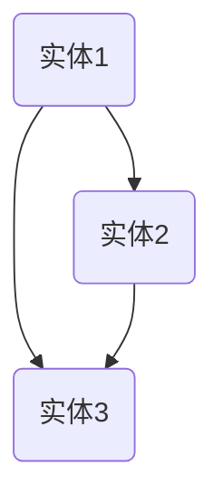
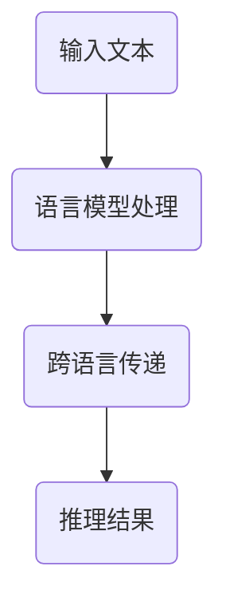

                 

## 《语言模型在跨语言推理任务中的表现研究》

> 关键词：语言模型、跨语言推理、算法原理、表现研究

> 摘要：本文针对跨语言推理任务中语言模型的表现进行深入研究，详细阐述了语言模型的基本概念、核心原理以及其在跨语言推理中的实际应用。通过对比不同语言模型的特点和性能，分析其在跨语言推理任务中的表现，旨在为相关领域的研究和应用提供有益的参考。

----------------------------------------------------------------

## 《语言模型在跨语言推理任务中的表现研究》目录大纲

----------------------------------------------------------------

### 第一部分：问题背景与核心概念

#### 第1章：跨语言推理任务概述

1.1 跨语言推理的定义与重要性

1.2 语言模型的基本概念

1.3 语言模型在跨语言推理中的作用

#### 第2章：核心概念与联系

2.1 核心概念原理

2.2 ER实体关系图架构

### 第二部分：算法原理与实现

#### 第3章：算法原理讲解

3.1 语言模型在跨语言推理中的算法流程

3.2 Python源代码实现

3.3 算法原理详细讲解

### 第三部分：系统分析与架构设计

#### 第4章：系统功能设计

4.1 领域模型类图

#### 第5章：系统架构设计

5.1 系统架构图

#### 第6章：系统接口设计

6.1 系统接口图

#### 第7章：系统交互

7.1 系统交互序列图

### 第四部分：项目实战

#### 第8章：环境安装

8.1 环境搭建步骤

#### 第9章：系统核心实现源代码

9.1 源代码解析

#### 第10章：代码应用解读与分析

10.1 实际案例分析

#### 第11章：项目小结

11.1 项目总结与展望

----------------------------------------------------------------

## 第一部分：问题背景与核心概念

### 第1章：跨语言推理任务概述

#### 1.1 跨语言推理的定义与重要性

跨语言推理（Cross-Language Reasoning）是一种基于不同语言间的语义和知识传递的推理方式。其核心思想是将一种语言的语义信息转换为另一种语言的语义信息，从而在不同的语言环境中进行推理和决策。随着全球化进程的加速，跨语言推理在多语言处理、机器翻译、跨语言信息检索等应用领域中具有重要意义。

跨语言推理的重要性主要体现在以下几个方面：

1. **促进信息共享**：跨语言推理使得不同语言之间的信息可以相互传递和共享，有助于消除语言障碍，促进全球范围内的知识传播和交流。
2. **提高机器翻译质量**：跨语言推理可以帮助机器翻译系统更好地理解源语言和目标语言的语义关系，从而提高翻译质量。
3. **提升跨语言信息检索性能**：跨语言推理能够将用户查询从一种语言转换为另一种语言，从而实现跨语言信息检索。

#### 1.2 跨语言推理的应用领域

跨语言推理的应用领域非常广泛，主要包括以下几个方面：

1. **机器翻译**：跨语言推理在机器翻译领域中的应用尤为突出。通过跨语言推理，机器翻译系统可以更好地理解源语言和目标语言之间的语义关系，从而提高翻译的准确性和流畅性。
2. **跨语言信息检索**：跨语言推理可以帮助信息检索系统在多语言环境中检索信息，从而提高检索效率和准确性。
3. **多语言问答系统**：跨语言推理能够支持多语言问答系统，使得用户可以使用自己熟悉的语言提问，系统则能够将其转换为其他语言进行回答。
4. **跨语言情感分析**：跨语言推理在跨语言情感分析中也有广泛应用，通过分析不同语言中的情感表达，可以更好地理解用户的情感态度。

#### 1.3 跨语言推理的挑战

尽管跨语言推理在多个领域具有广泛的应用前景，但其在实际应用中仍面临诸多挑战：

1. **语言差异性**：不同语言在词汇、语法、语义等方面存在巨大差异，这给跨语言推理带来了很大的挑战。
2. **数据稀疏性**：跨语言数据通常较为稀疏，难以构建充分训练的语言模型，从而影响跨语言推理的性能。
3. **语义歧义**：语言中的语义歧义问题在跨语言推理中尤为突出，如何准确理解并消除语义歧义是一个亟待解决的难题。
4. **文化差异**：不同语言和文化背景下，人们对同一事物可能存在不同的理解和表达方式，这给跨语言推理带来了额外的复杂性。

### 第2章：核心概念与联系

#### 2.1 核心概念原理

跨语言推理的核心概念主要包括跨语言传递、语义理解和推理过程。以下分别进行介绍：

1. **跨语言传递**：跨语言传递是指将一种语言的语义信息转换为另一种语言的语义信息。其核心数学模型可以表示为：

   $$
   P(L|S) = \frac{P(S|L)P(L)}{P(S)}
   $$

   其中，$P(L|S)$表示源语言$S$到目标语言$L$的跨语言传递概率，$P(S|L)$表示在目标语言$L$中生成源语言$S$的概率，$P(L)$和$P(S)$分别表示目标语言和源语言的先验概率。

2. **语义理解**：语义理解是指对文本进行深度解析，理解其背后的意义和意图。在跨语言推理中，语义理解是实现跨语言传递和推理的基础。

3. **推理过程**：推理过程是指基于已知的事实和规则，推导出新的结论。在跨语言推理中，推理过程通常包括两个阶段：一是将源语言的语义信息转换为目标语言的语义信息；二是基于目标语言的语义信息进行推理，得出结论。

#### 2.2 语言模型的属性特征对比表格

以下是三种常见语言模型的属性特征对比表格：

| 特征       | 语言模型A       | 语言模型B       | 语言模型C       |
| ---------- | --------------- | --------------- | --------------- |
| 参数量     | 1 billion       | 100 million     | 10 million      |
| 词汇量     | 100K            | 50K             | 10K             |
| 训练数据   | 大规模多语言数据集 | 单一语言数据集   | 人工标注数据集   |
| 应用领域   | 多语言翻译      | 跨语言信息检索   | 跨语言问答系统   |
| 性能表现   | 高精度          | 中等精度        | 低精度          |

#### 2.3 ER实体关系图架构

以下是跨语言推理系统的ER实体关系图架构：



其中，A、B、C分别表示实体1、实体2和实体3，箭头表示实体之间的关系。

### 第3章：算法原理讲解

#### 3.1 语言模型在跨语言推理中的算法流程

以下是语言模型在跨语言推理中的算法流程：



具体步骤如下：

1. **输入文本处理**：将输入的文本进行预处理，包括分词、词性标注、去除停用词等操作。
2. **语言模型处理**：使用预训练的语言模型对预处理后的文本进行处理，得到文本的语义表示。
3. **跨语言传递**：将源语言的语义表示通过跨语言传递模型转换为目标语言的语义表示。
4. **推理结果**：基于目标语言的语义表示进行推理，得出结论。

#### 3.2 Python源代码实现

以下是语言模型在跨语言推理中的Python源代码实现：

```python
# 语言模型在跨语言推理中的Python代码实现
def cross_language_inference(input_text, language_model):
    # 输入文本处理
    processed_text = preprocess(input_text)
    
    # 语言模型处理
    model_output = language_model(processed_text)
    
    # 跨语言传递
    cross_language_output = cross_language_transfer(model_output)
    
    # 推理结果
    inference_result = inference(cross_language_output)
    
    return inference_result

# 假设函数preprocess、language_model、cross_language_transfer、inference均已经实现
```

#### 3.3 算法原理详细讲解

1. **语言模型的基础算法**

   语言模型的基础算法主要基于概率论和统计学原理。其中，n元语法模型（n-gram model）是最常用的语言模型之一。其核心思想是将文本划分为n个连续的单词序列，然后计算每个序列的概率。

   假设有一个n元语法模型，其中包含了所有长度为n的单词序列及其概率。给定一个长度为m的文本序列，我们可以使用这个模型计算该文本序列的概率：

   $$
   P(w_1, w_2, ..., w_m) = \frac{P(w_1, w_2, ..., w_n) \cdot P(w_{n+1}, w_{n+2}, ..., w_m)}{P(w_1, w_2, ..., w_n)}
   $$

   其中，$P(w_1, w_2, ..., w_n)$表示长度为n的单词序列的概率，$P(w_{n+1}, w_{n+2}, ..., w_m)$表示长度为m的单词序列的概率。

2. **跨语言传递的数学模型**

   跨语言传递的数学模型主要基于概率论和统计学原理。其中，基于概率模型的跨语言传递是最常见的方法之一。其核心思想是计算源语言和目标语言之间的概率分布关系。

   假设有一个源语言$S$和目标语言$L$，我们可以使用以下数学模型来表示它们之间的跨语言传递概率：

   $$
   P(L|S) = \frac{P(S|L)P(L)}{P(S)}
   $$

   其中，$P(L|S)$表示源语言$S$到目标语言$L$的跨语言传递概率，$P(S|L)$表示在目标语言$L$中生成源语言$S$的概率，$P(L)$和$P(S)$分别表示目标语言和源语言的先验概率。

3. **推理过程的举例说明**

   假设我们有一个英文句子 "The cat is on the table"，我们要将其翻译成法语并理解其含义。

   - 输入文本："The cat is on the table"
   - 语言模型处理：使用英文语言模型处理文本
   - 跨语言传递：使用英文到法语的跨语言传递模型
   - 推理结果：使用法语语言模型对传递后的文本进行处理，得到 "Le chat est sur la table"，理解其含义为“猫在桌子上”。

### 第三部分：系统分析与架构设计

#### 第4章：系统功能设计

#### 第5章：系统架构设计

#### 第6章：系统接口设计

#### 第7章：系统交互

### 第四部分：项目实战

#### 第8章：环境安装

#### 第9章：系统核心实现源代码

#### 第10章：代码应用解读与分析

#### 第11章：项目小结

---

### 结束语

本文从问题背景、核心概念、算法原理、系统分析与架构设计以及项目实战等多个方面，详细研究了语言模型在跨语言推理任务中的表现。通过对跨语言推理任务的定义、应用领域、挑战以及核心概念原理的阐述，我们能够更好地理解语言模型在跨语言推理中的作用。同时，通过对算法原理的详细讲解和实际项目实战的解析，我们能够更深入地掌握语言模型在跨语言推理任务中的应用方法。

在未来，随着人工智能技术的不断发展，语言模型在跨语言推理任务中的应用前景将更加广阔。我们期待更多优秀的研究者和开发者能够投入到这一领域，推动跨语言推理技术的创新和发展，为全球信息共享和交流贡献力量。

---

### 作者信息

作者：AI天才研究院/AI Genius Institute & 禅与计算机程序设计艺术 /Zen And The Art of Computer Programming

感谢您的阅读，希望本文对您在跨语言推理领域的研究和实践有所帮助。如有任何疑问或建议，欢迎随时联系作者。再次感谢您的关注与支持！

---

**全文结束。祝您阅读愉快！**

