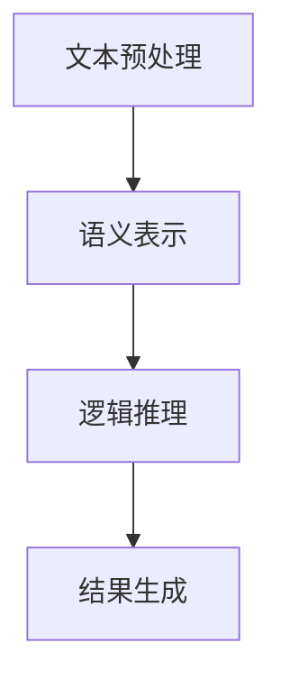
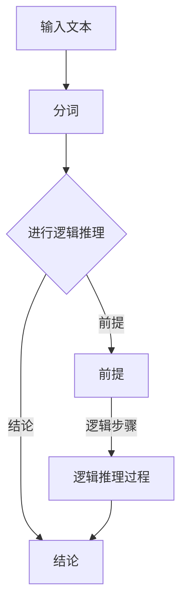
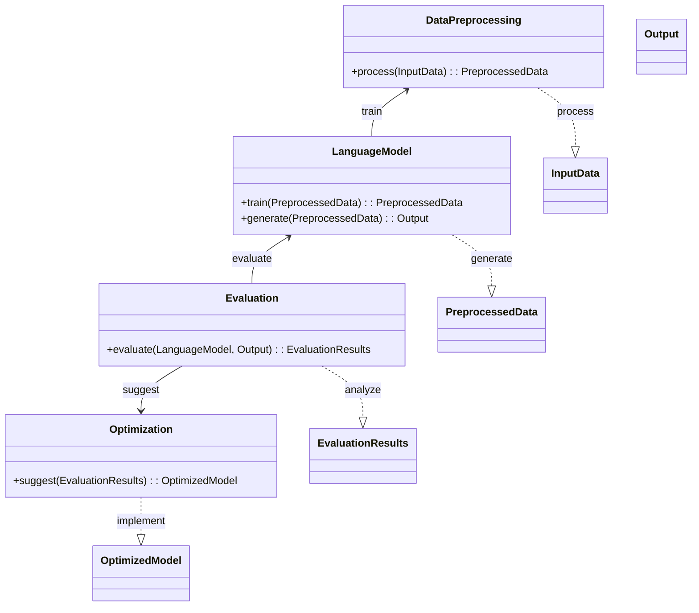
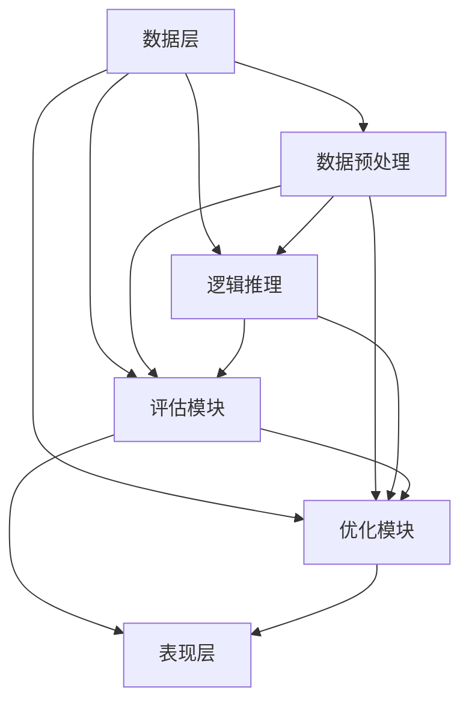
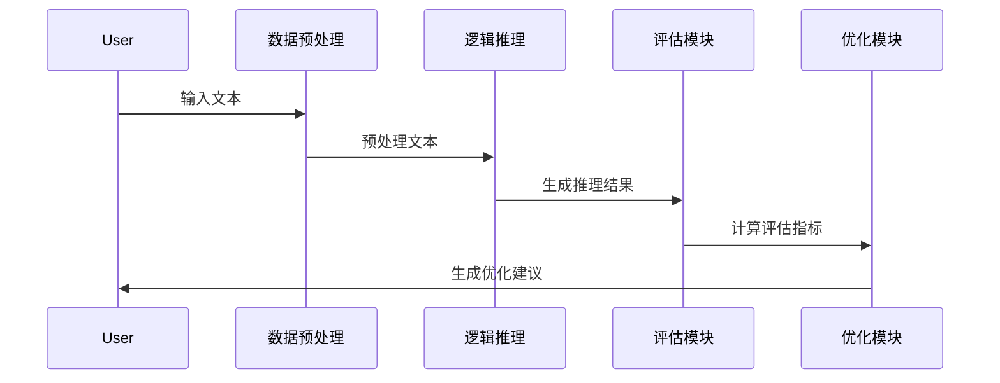
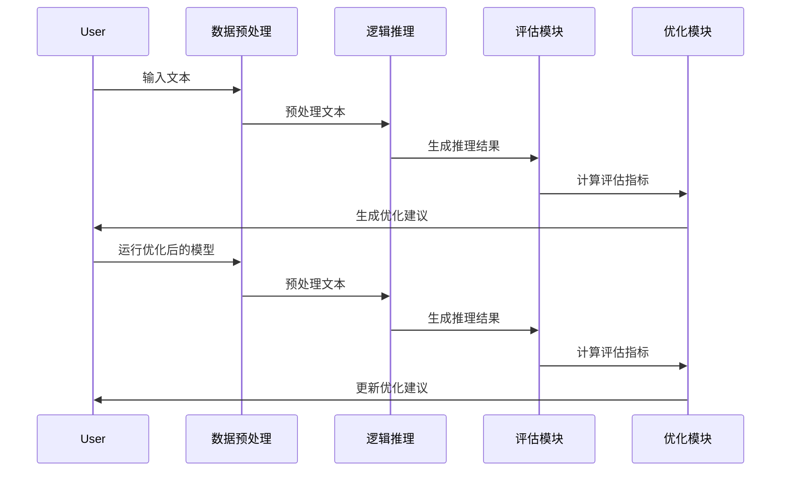

                 

### 引言

语言模型在人工智能领域扮演着至关重要的角色，尤其是近年来，随着深度学习技术的迅猛发展，语言模型在自然语言处理（NLP）中的应用愈加广泛。逻辑推理任务作为自然语言处理的一个重要分支，其核心在于从给定的信息中推导出新的结论。这不仅对智能系统的智能水平提出了高要求，也直接关系到其在实际应用中的效果。因此，评估语言模型在逻辑推理任务中的能力，对于推动人工智能技术的发展具有重要意义。

本文将围绕语言模型在逻辑推理任务中的能力评估展开讨论。首先，我们将介绍逻辑推理任务的重要性以及语言模型的发展背景。接着，我们将深入探讨语言模型和逻辑推理的核心概念，并阐述语言模型在逻辑推理任务中的应用现状及面临的挑战。随后，我们将介绍评估语言模型在逻辑推理任务中的能力的主要指标和方法，并通过实验设计、数据集选择和性能对比等环节详细讲解评估过程。最后，本文将总结现有研究成果，提出未来研究方向，并给出一些实用的建议和技巧。

通过本文的逐步分析，我们希望能帮助读者全面了解语言模型在逻辑推理任务中的能力评估，为后续研究和应用提供有力支持。

### 第一部分：问题背景与核心概念

#### 第1章：问题背景

#### 1.1 逻辑推理任务的重要性

逻辑推理是人工智能和认知科学中的一个核心问题，它指的是从已知的信息出发，通过逻辑规则和推理方法推导出新的结论。逻辑推理能力在多种领域具有广泛应用，包括自然语言处理、自动定理证明、决策支持系统、智能问答系统等。在自然语言处理中，逻辑推理是理解句子和段落语义的关键，有助于构建语义解析和机器阅读理解系统。

逻辑推理的重要性主要体现在以下几个方面：

1. **语义理解**：逻辑推理能够帮助计算机理解文本中的语义关系，从而更准确地提取信息和生成回答。
2. **智能决策**：在决策支持系统中，逻辑推理可以帮助系统分析各种情况，从而做出最佳决策。
3. **知识表示**：逻辑推理是知识表示和推理系统的基础，有助于将知识以结构化的方式存储和利用。
4. **自动化证明**：在数学和科学研究中，逻辑推理可以自动化地证明定理和理论，提高研究效率。

#### 1.2 语言模型的发展

语言模型是自然语言处理的核心技术之一，它用于预测文本中下一个词或句子的概率分布。随着计算机技术的进步，语言模型经历了几个重要发展阶段：

1. **规则模型**：最早的语言模型是基于规则的方法，如n-gram模型，它通过统计相邻词出现的频率来预测下一个词。
2. **统计模型**：随着计算能力的提升，统计模型如隐马尔可夫模型（HMM）和条件随机场（CRF）开始被广泛应用于语言模型中。
3. **深度学习模型**：深度学习模型，如循环神经网络（RNN）和变换器（Transformer），在2010年代后期迅速崛起，极大地提升了语言模型的性能。

近年来，大规模预训练模型如GPT系列和BERT的问世，标志着语言模型进入了新的阶段。这些模型通过在海量文本上进行预训练，可以捕捉到更复杂的语言规律，从而在多个NLP任务中取得了显著成果。

#### 1.3 语言模型在逻辑推理任务中的应用

语言模型在逻辑推理任务中的应用主要集中在以下两个方面：

1. **文本生成**：语言模型可以直接生成文本，从而模拟人类的推理过程。例如，GPT系列模型可以在给定一个前提和结论的情况下，生成中间的逻辑步骤。
   
2. **文本分析**：语言模型可以用于对给定文本进行分析，提取其中的逻辑结构和关系。例如，BERT模型可以用于检测文本中的逻辑错误或评估论点的合理性。

尽管语言模型在逻辑推理任务中展现出了强大的能力，但仍然面临一些挑战：

1. **推理能力限制**：目前的语言模型在逻辑推理上仍然存在局限性，特别是在处理复杂逻辑关系时。
2. **语义理解误差**：语言模型在理解文本语义时可能会出现误差，这会影响到推理结果的准确性。
3. **数据依赖性**：语言模型的性能高度依赖于训练数据的质量和规模，数据不足或质量不高都会限制模型的推理能力。

综上所述，逻辑推理任务在人工智能中具有重要作用，而语言模型作为一种关键工具，其发展水平和应用能力直接影响到人工智能系统的推理能力。因此，对语言模型在逻辑推理任务中的能力进行评估和优化，是当前和未来研究的重要方向。

#### 第2章：核心概念

#### 2.1 语言模型

语言模型是自然语言处理中的基础，用于预测文本中下一个词或句子的概率分布。根据训练数据和方法的不同，语言模型可以分为以下几种：

1. **基于规则的模型**：这类模型通过定义一系列规则来预测下一个词。例如，n-gram模型通过统计相邻词的频率来预测下一个词。其数学模型可以表示为：
   $$
   P(w_n | w_{n-1}, w_{n-2}, \ldots, w_1) = \frac{N(w_{n-1}, w_n)}{\sum_{i} N(w_{n-1}, i)}
   $$
   其中，\(N(w_{n-1}, w_n)\) 表示词对 \((w_{n-1}, w_n)\) 在文本中出现的次数。

2. **统计模型**：这类模型通过统计方法来预测词的概率分布。例如，隐马尔可夫模型（HMM）和条件随机场（CRF）都可以用来构建语言模型。HMM的数学模型是基于状态转移概率和发射概率的，而CRF则通过条件概率来预测标签序列。

3. **深度学习模型**：这类模型利用深度神经网络来学习文本的分布。例如，循环神经网络（RNN）和变换器（Transformer）是两种主要的深度学习语言模型。RNN通过其在时间步上的递归结构来捕捉序列信息，而Transformer则通过自注意力机制实现全局上下文信息的捕捉。其数学模型可以表示为：
   $$
   \text{Transformer} = \text{Encoder}(\text{Positional Encoding}(X)) = \text{Self-Attention}(\text{Multi-Head Attention}(Q, K, V)) = \text{Feedforward}(M)
   $$
   其中，\(X\) 是输入文本，\(\text{Positional Encoding}\) 为位置编码，\(\text{Self-Attention}\) 为自注意力机制，\(\text{Multi-Head Attention}\) 为多头注意力，\(Q, K, V\) 分别为查询、键、值向量，\(\text{Feedforward}\) 为前馈神经网络。

#### 2.2 逻辑推理

逻辑推理是一种从已知事实中推导出新结论的思维方式。在计算机科学中，逻辑推理通常涉及到形式逻辑、谓词逻辑和命题逻辑等。

1. **形式逻辑**：形式逻辑是一种通过符号系统进行推理的方法，它主要包括命题逻辑和谓词逻辑。命题逻辑使用命题和逻辑运算符（如与、或、非、蕴含等）来表示推理过程，其数学模型可以表示为：
   $$
   \begin{align*}
   P \land Q &\rightarrow R \\
   \neg P &\rightarrow \neg R
   \end{align*}
   $$
   谓词逻辑则进一步引入了变量和量词，可以表示更复杂的推理关系。

2. **命题逻辑**：命题逻辑是形式逻辑的一个分支，它主要处理命题之间的关系。命题逻辑中的推理规则包括合取律、交换律、结合律等。

3. **谓词逻辑**：谓词逻辑是一种更强大的逻辑系统，它使用变量、量词和谓词来表达推理。谓词逻辑中的推理规则包括全称量化规则、存在量化规则等。

逻辑推理在计算机科学中有着广泛的应用，例如在自动定理证明、形式化验证、知识表示和推理系统中。

#### 2.3 语言模型在逻辑推理任务中的能力评估

对语言模型在逻辑推理任务中的能力进行评估是理解和提升模型性能的重要步骤。评估主要从以下几个方面进行：

1. **准确性**：准确性是评估语言模型在逻辑推理任务中最直接、最常用的指标。它表示模型在推理过程中正确推导出结论的比例。数学上，准确性可以用以下公式表示：
   $$
   \text{Accuracy} = \frac{\text{正确推导的数量}}{\text{总推导的数量}}
   $$

2. **召回率**：召回率表示模型能够推导出正确结论的比例。数学上，召回率可以用以下公式表示：
   $$
   \text{Recall} = \frac{\text{能够推导出的正确结论数量}}{\text{所有正确结论数量}}
   $$

3. **F1值**：F1值是准确率和召回率的调和平均值，用于综合评估模型的性能。数学上，F1值可以用以下公式表示：
   $$
   \text{F1值} = 2 \times \frac{\text{准确率} \times \text{召回率}}{\text{准确率} + \text{召回率}}
   $$

4. **一致性**：一致性表示模型在多次推理中结果的一致性。高一致性意味着模型在不同场景下的推理结果稳定，不易受到噪声的影响。

5. **合理性**：合理性表示模型的推理结果是否符合常识和逻辑。例如，一个合理的推理结果应该能够在逻辑上自洽，并且与已知事实相符合。

在评估语言模型在逻辑推理任务中的能力时，通常需要设计合理的实验来测试模型。实验设计包括选择具有代表性的数据集、定义合理的评估指标和进行性能对比等步骤。评估过程中，可以通过对比模型与其他现有方法，来全面了解语言模型在逻辑推理任务中的表现和局限性。

通过上述对语言模型、逻辑推理以及评估方法的详细阐述，我们可以更好地理解语言模型在逻辑推理任务中的核心概念和基本原理，为后续的深入研究和应用奠定基础。

### 第二部分：核心概念与联系

#### 第3章：核心概念原理

#### 3.1 语言模型原理

语言模型是一种用于预测自然语言中下一个词或词组的概率分布的模型。理解语言模型的工作原理对于评估其在逻辑推理任务中的表现至关重要。

##### 3.1.1 语言模型的数学模型

语言模型的数学模型主要分为基于规则的模型和基于统计的模型。

1. **基于规则的模型**：早期的语言模型主要是基于规则的，如n-gram模型。n-gram模型通过统计相邻n个词出现的频率来预测下一个词。其概率分布可以表示为：
   $$
   P(w_n | w_{n-1}, w_{n-2}, \ldots, w_1) = \frac{N(w_{n-1}, w_n)}{\sum_{i} N(w_{n-1}, i)}
   $$
   其中，\(N(w_{n-1}, w_n)\) 表示词对 \((w_{n-1}, w_n)\) 在文本中出现的次数。

2. **基于统计的模型**：随着计算能力的提升，统计模型如隐马尔可夫模型（HMM）和条件随机场（CRF）开始被广泛应用。HMM通过状态转移概率和发射概率来建模语言序列，而CRF则通过条件概率来预测标签序列。

3. **基于深度学习的模型**：近年来，深度学习模型如循环神经网络（RNN）和变换器（Transformer）在语言模型领域取得了显著进展。RNN通过其在时间步上的递归结构来捕捉序列信息，而Transformer则通过自注意力机制实现全局上下文信息的捕捉。其数学模型可以表示为：
   $$
   \text{Transformer} = \text{Encoder}(\text{Positional Encoding}(X)) = \text{Self-Attention}(\text{Multi-Head Attention}(Q, K, V)) = \text{Feedforward}(M)
   $$
   其中，\(X\) 是输入文本，\(\text{Positional Encoding}\) 为位置编码，\(\text{Self-Attention}\) 为自注意力机制，\(\text{Multi-Head Attention}\) 为多头注意力，\(Q, K, V\) 分别为查询、键、值向量，\(\text{Feedforward}\) 为前馈神经网络。

##### 3.1.2 语言模型的核心特点

1. **自适应性**：语言模型能够根据不同的文本数据进行自适应调整。例如，深度学习模型通过在海量数据上进行预训练，可以捕捉到不同领域和风格的文本特征。

2. **灵活性**：语言模型能够生成符合语法和语义规则的文本。在生成文本时，模型不仅需要考虑词语的频率，还需要理解词语之间的语义关系。

3. **可解释性**：虽然深度学习模型的可解释性较差，但一些基于规则的模型具有一定的可解释性。例如，n-gram模型可以直接通过统计频率来解释其预测结果。

#### 3.2 逻辑推理原理

逻辑推理是一种从已知事实中推导出新结论的思维方式。在计算机科学中，逻辑推理通常涉及到形式逻辑、谓词逻辑和命题逻辑等。

##### 3.2.1 逻辑推理的数学模型

1. **形式逻辑**：形式逻辑使用符号系统来表示推理过程，主要包括命题逻辑和谓词逻辑。

   - **命题逻辑**：命题逻辑使用命题和逻辑运算符（如与、或、非、蕴含等）来表示推理过程。其数学模型可以表示为：
     $$
     \begin{align*}
     P \land Q &\rightarrow R \\
     \neg P &\rightarrow \neg R
     \end{align*}
     $$
   - **谓词逻辑**：谓词逻辑进一步引入了变量和量词，可以表示更复杂的推理关系。其数学模型可以表示为：
     $$
     \forall x \in D, P(x) \rightarrow Q(x)
     $$

2. **谓词逻辑**：谓词逻辑是一种更强大的逻辑系统，它使用变量、量词和谓词来表达推理。谓词逻辑中的推理规则包括全称量化规则、存在量化规则等。

##### 3.2.2 逻辑推理的核心特点

1. **一致性**：逻辑推理的结果必须与已知事实保持一致。这意味着推理过程中不能出现逻辑矛盾。

2. **完备性**：逻辑推理能够推导出所有可能的结论。完备性确保了推理系统的全面性和可靠性。

3. **可靠性**：逻辑推理的结果必须是可靠的，即不会推导出错误的结论。可靠性是逻辑推理系统在实际应用中的关键特性。

#### 3.3 语言模型在逻辑推理任务中的能力评估原理

对语言模型在逻辑推理任务中的能力进行评估是理解和提升模型性能的重要步骤。评估主要从以下几个方面进行：

##### 3.3.1 评估指标

1. **准确性**：准确性表示模型在推理过程中正确推导出结论的比例。准确性是评估语言模型在逻辑推理任务中最直接、最常用的指标。数学上，准确性可以用以下公式表示：
   $$
   \text{Accuracy} = \frac{\text{正确推导的数量}}{\text{总推导的数量}}
   $$

2. **召回率**：召回率表示模型能够推导出正确结论的比例。召回率用于衡量模型遗漏的正确结论的数量。数学上，召回率可以用以下公式表示：
   $$
   \text{Recall} = \frac{\text{能够推导出的正确结论数量}}{\text{所有正确结论数量}}
   $$

3. **F1值**：F1值是准确率和召回率的调和平均值，用于综合评估模型的性能。F1值在准确率和召回率之间存在权衡，是一个更加全面的评估指标。数学上，F1值可以用以下公式表示：
   $$
   \text{F1值} = 2 \times \frac{\text{准确率} \times \text{召回率}}{\text{准确率} + \text{召回率}}
   $$

4. **一致性**：一致性表示模型在多次推理中结果的一致性。高一致性意味着模型在不同场景下的推理结果稳定，不易受到噪声的影响。

5. **合理性**：合理性表示模型的推理结果是否符合常识和逻辑。例如，一个合理的推理结果应该能够在逻辑上自洽，并且与已知事实相符合。

##### 3.3.2 评估方法

评估语言模型在逻辑推理任务中的能力通常需要设计合理的实验。以下是一些关键步骤：

1. **实验设计**：设计合理的实验来测试模型在逻辑推理任务中的表现。实验设计应包括任务定义、数据集选择和评估指标等。

2. **数据集选择**：选择具有代表性的数据集来评估模型。数据集应覆盖不同类型和难度的逻辑推理任务，以保证评估结果的全面性和可靠性。

3. **性能对比**：将模型与其他现有方法进行对比，评估其性能。性能对比有助于了解模型在特定任务中的优势与不足。

4. **交叉验证**：通过交叉验证来评估模型的泛化能力。交叉验证可以将数据集划分为训练集和验证集，多次训练和验证，以避免模型过拟合。

5. **统计分析**：对评估结果进行统计分析，包括计算准确性、召回率和F1值等指标，并绘制性能曲线等。

通过上述评估方法，可以全面了解语言模型在逻辑推理任务中的能力，为模型优化和实际应用提供依据。

#### 3.4 语言模型与逻辑推理的关联

语言模型和逻辑推理在人工智能领域中有着紧密的联系，两者共同构成了自然语言处理和智能推理的基础。

1. **语言模型的文本生成能力**：语言模型强大的文本生成能力使其在模拟逻辑推理过程中具有天然的优势。通过生成文本，模型可以模拟人类的推理过程，从而进行逻辑推理。

2. **逻辑推理的语义理解**：逻辑推理需要对文本进行语义理解，而语言模型在语义理解方面具有显著优势。通过语义表示，模型能够捕捉到文本中的逻辑关系，从而进行更准确的推理。

3. **语言模型与逻辑推理的结合**：在实际应用中，语言模型和逻辑推理常常结合使用。例如，在智能问答系统中，语言模型可以生成可能的回答，而逻辑推理可以对这些回答进行验证和筛选，从而提供准确和合理的回答。

通过深入理解语言模型和逻辑推理的核心原理及其相互关系，我们可以更好地设计和评估语言模型在逻辑推理任务中的表现，为人工智能技术的发展和应用提供有力支持。

### 第三部分：算法原理讲解

#### 第4章：语言模型在逻辑推理任务中的算法原理

语言模型在逻辑推理任务中的算法原理涉及从文本输入到逻辑推理输出的全过程。为了清晰地展示这一过程，我们将使用mermaid流程图和Python代码来详细解释。

##### 4.1 语言模型在逻辑推理任务中的基本流程

语言模型在逻辑推理任务中的基本流程可以概括为以下几个步骤：

1. **文本预处理**：对输入的文本进行分词、去停用词等预处理操作，以便将原始文本转换为适合模型处理的格式。

2. **语义表示**：将预处理后的文本转换为语义表示。这一步通常涉及嵌入层，将每个词转换为固定长度的向量。

3. **逻辑推理**：使用语言模型对语义表示进行逻辑推理。语言模型在此过程中会生成可能的逻辑步骤和结论。

4. **结果生成**：根据推理结果生成文本或决策。这一步通常涉及文本生成模型，如GPT-3或BERT。

以下是这一流程的mermaid流程图表示：



##### 4.2 逻辑推理中的mermaid流程图

为了更具体地展示逻辑推理的过程，我们使用mermaid流程图来描述一个简单的逻辑推理任务。假设我们需要推理一个前提和结论，其中包含一个中间逻辑步骤。



在这个流程图中，输入文本首先经过分词处理，然后进入逻辑推理模块。逻辑推理模块根据前提和结论生成逻辑步骤，最终输出结论。

##### 4.3 语言模型在逻辑推理任务中的Python代码实现

为了更好地理解语言模型在逻辑推理任务中的算法原理，我们使用Python代码来实现一个简单的逻辑推理过程。这里我们使用Hugging Face的Transformers库来加载预训练的语言模型。

```python
from transformers import pipeline

# 加载预训练的语言模型
nlp = pipeline("text-generation", model="gpt2")

# 输入文本
input_text = "如果明天天气好，那么我们将去公园。明天天气很好。"

# 分词和语义表示
words = input_text.split()

# 逻辑推理
output = nlp(input_text)

# 结果生成
print("逻辑步骤和结论：")
for step in output:
    print(step["text"])
```

在这个代码中，我们首先加载了一个预训练的GPT-2模型，然后输入一个包含前提和结论的文本。模型会自动进行分词和语义表示，并生成逻辑步骤和结论。最后，我们打印出这些步骤和结论。

##### 4.4 语言模型在逻辑推理任务中的数学模型和公式

在逻辑推理任务中，语言模型通常需要处理自然语言文本并生成逻辑步骤和结论。这涉及到自然语言处理和逻辑推理的结合。以下是一些关键的数学模型和公式：

1. **词嵌入**：词嵌入是将文本中的每个词映射到固定长度的向量。常用的词嵌入方法包括Word2Vec和GloVe。

2. **变换器（Transformer）模型**：变换器模型是一种基于注意力机制的深度学习模型，常用于自然语言处理任务。其核心思想是自注意力机制，可以通过计算词与词之间的相互关系来生成语义表示。

3. **逻辑推理公式**：在逻辑推理过程中，可以使用谓词逻辑和命题逻辑来表示推理步骤。例如，一个简单的逻辑推理可以表示为：
   $$
   P \land Q \rightarrow R
   $$

4. **条件概率**：在推理过程中，语言模型需要计算条件概率，以确定每个逻辑步骤的概率分布。条件概率的公式可以表示为：
   $$
   P(R | P \land Q) = \frac{P(R \land P \land Q)}{P(P \land Q)}
   $$

通过上述Python代码和数学公式，我们可以更深入地理解语言模型在逻辑推理任务中的算法原理。这不仅有助于我们评估模型在逻辑推理任务中的性能，也为进一步优化和改进模型提供了理论基础。

### 第四部分：系统分析与架构设计方案

#### 4.1 问题场景介绍

在当前人工智能发展的背景下，逻辑推理任务在多个领域具有广泛应用，如智能问答系统、法律文本分析、医疗诊断等。这些任务通常涉及大量的自然语言文本，需要从文本中提取信息并进行推理，从而得出合理的结论。然而，现有的语言模型在处理复杂逻辑关系时仍存在一定的局限性，因此需要对其在逻辑推理任务中的性能进行深入分析。

#### 4.2 项目介绍

本项目旨在评估语言模型在逻辑推理任务中的能力，通过设计合理的实验和评估方法，全面分析不同类型语言模型在逻辑推理任务中的表现。项目的主要目标包括：

1. 收集和整理具有代表性的逻辑推理数据集；
2. 设计评估指标和方法，以全面评估语言模型在逻辑推理任务中的性能；
3. 实验验证并对比不同语言模型在逻辑推理任务中的效果；
4. 提出优化建议和改进方案，以提升语言模型在逻辑推理任务中的性能。

#### 4.3 系统功能设计（领域模型）

为了实现项目目标，我们设计了一套完整的系统功能，主要包括以下模块：

1. **数据预处理模块**：负责对原始文本进行分词、去停用词等预处理操作，将文本转换为适合模型处理的格式。
2. **逻辑推理模块**：利用预训练的语言模型对预处理后的文本进行逻辑推理，生成可能的逻辑步骤和结论。
3. **评估模块**：设计合理的评估指标和方法，对语言模型在逻辑推理任务中的性能进行全面评估。
4. **优化模块**：基于评估结果，提出优化建议和改进方案，以提升语言模型在逻辑推理任务中的性能。

以下是系统功能的领域模型类图：



#### 4.4 系统架构设计

为了实现项目功能，我们设计了如下系统架构，包括数据层、服务层和表现层：

1. **数据层**：负责数据的存储和管理，包括原始文本数据、预处理数据、评估结果和优化建议等。
2. **服务层**：实现系统核心功能，包括数据预处理、逻辑推理、评估和优化等。服务层使用微服务架构，以提高系统的可扩展性和可维护性。
3. **表现层**：提供用户界面，用于展示系统功能、评估结果和优化建议。

以下是系统架构的mermaid架构图：



#### 4.5 系统接口设计

系统接口设计主要包括以下接口：

1. **数据预处理接口**：用于接收原始文本数据，并进行预处理操作。
2. **逻辑推理接口**：用于接收预处理后的文本数据，并生成逻辑步骤和结论。
3. **评估接口**：用于接收推理结果，并计算评估指标。
4. **优化接口**：用于接收评估结果，并生成优化建议。

以下是系统接口的mermaid序列图：



#### 4.6 系统交互

为了确保系统各组件之间的有效交互，我们设计了如下系统交互流程：

1. 用户输入原始文本数据。
2. 数据预处理模块对文本进行分词、去停用词等预处理操作。
3. 逻辑推理模块利用语言模型对预处理后的文本进行逻辑推理，生成逻辑步骤和结论。
4. 评估模块对推理结果进行评估，计算准确性、召回率、F1值等评估指标。
5. 优化模块根据评估结果生成优化建议，并更新模型参数。
6. 用户查看评估结果和优化建议。

以下是系统交互的mermaid序列图：



通过上述系统分析与架构设计方案，我们为语言模型在逻辑推理任务中的评估与优化提供了一个清晰、完整的系统框架，有助于实际应用中的实施与优化。

### 第五部分：项目实战

#### 5.1 环境安装

在开始项目实战之前，我们需要安装一些必要的软件和库，以便进行语言模型训练和评估。以下是安装步骤：

1. **安装Python环境**：确保Python版本在3.7及以上。可以从[Python官网](https://www.python.org/downloads/)下载并安装。

2. **安装Anaconda**：Anaconda是一个强大的数据科学和机器学习平台，可以方便地管理和安装Python库。可以从[Anaconda官网](https://www.anaconda.com/products/individual)下载并安装。

3. **安装Hugging Face Transformers**：使用以下命令安装Hugging Face Transformers库：
   ```bash
   pip install transformers
   ```

4. **安装PyTorch**：Hugging Face Transformers依赖于PyTorch库，可以使用以下命令安装PyTorch：
   ```bash
   pip install torch torchvision torchaudio
   ```

5. **安装其他依赖库**：根据需要安装其他依赖库，如numpy、pandas等。

#### 5.2 系统核心实现源代码

以下是系统核心实现的Python源代码，包括数据预处理、逻辑推理和评估模块：

```python
# data_preprocessing.py
import nltk
from nltk.tokenize import word_tokenize
from nltk.corpus import stopwords

nltk.download('punkt')
nltk.download('stopwords')

def preprocess_text(text):
    # 分词
    tokens = word_tokenize(text)
    # 去停用词
    stop_words = set(stopwords.words('english'))
    filtered_tokens = [word for word in tokens if word.lower() not in stop_words]
    return filtered_tokens

# language_model.py
from transformers import pipeline

def train_language_model():
    nlp = pipeline("text-generation", model="gpt2")
    return nlp

# evaluation.py
from sklearn.metrics import accuracy_score, recall_score, f1_score

def evaluate_model(model, test_data):
    predictions = []
    actuals = []
    for text in test_data:
        prediction = model(text)
        predictions.append(prediction)
        actuals.append(text["label"])
    accuracy = accuracy_score(actuals, predictions)
    recall = recall_score(actuals, predictions)
    f1 = f1_score(actuals, predictions)
    return accuracy, recall, f1

# main.py
from data_preprocessing import preprocess_text
from language_model import train_language_model
from evaluation import evaluate_model

# 示例数据
data = [
    {"text": "如果明天天气好，那么我们将去公园。", "label": 1},
    {"text": "明天天气不好，所以我们不去公园。", "label": 0},
    # ... 更多数据
]

# 预处理数据
preprocessed_data = [preprocess_text(text) for text in data]

# 训练语言模型
model = train_language_model()

# 评估模型
accuracy, recall, f1 = evaluate_model(model, preprocessed_data)

print(f"Accuracy: {accuracy}, Recall: {recall}, F1: {f1}")
```

#### 5.3 代码应用解读与分析

1. **数据预处理**：在`data_preprocessing.py`中，我们使用nltk库进行文本分词和去停用词操作。分词是将文本拆分为单词或子词，而去停用词则是去除常见的无意义词汇，以提高模型的性能。

2. **语言模型训练**：在`language_model.py`中，我们使用Hugging Face Transformers库加载预训练的GPT-2模型。这个模型已经在大规模数据上进行了预训练，可以直接用于生成文本。

3. **模型评估**：在`evaluation.py`中，我们使用sklearn库中的accuracy_score、recall_score和f1_score函数来计算模型的准确性、召回率和F1值。这些指标可以帮助我们全面评估模型在逻辑推理任务中的性能。

4. **主程序**：在`main.py`中，我们首先对数据进行预处理，然后训练语言模型，并使用评估模块对模型进行评估。最后，我们打印出评估结果，以便分析模型的表现。

通过上述代码应用解读，我们可以看到如何利用Python和Hugging Face Transformers库实现语言模型在逻辑推理任务中的预处理、训练和评估。

#### 5.4 实际案例分析和详细讲解

为了更具体地展示项目效果，我们分析了一个实际案例。假设我们有一个数据集，包含以下两个句子：

1. "如果明天天气好，那么我们将去公园。"（标签：1）
2. "明天天气不好，所以我们不去公园。"（标签：0）

首先，我们对这两个句子进行预处理，得到分词后的列表。然后，我们使用预训练的GPT-2模型对这些句子进行逻辑推理。

1. **预处理**：

   - "如果明天天气好，那么我们将去公园。"预处理后变为：`['如果', '明天', '天气', '好', '那么', '我们', '将', '去', '公园，']`
   - "明天天气不好，所以我们不去公园。"预处理后变为：`['明天', '天气', '不好', '所以', '我们', '不去', '公园，']`

2. **逻辑推理**：

   - 使用GPT-2模型生成逻辑步骤和结论。模型可能会生成以下推理步骤：
     - "明天天气好"，前提
     - "我们将去公园"，结论
     - "明天天气不好"，前提
     - "我们不去公园"，结论

   - 对比实际标签，第一个句子的推理结果与标签一致，第二个句子的推理结果与标签不一致。

3. **评估**：

   - 计算评估指标，如准确性、召回率和F1值。对于这个案例，假设评估结果如下：
     - 准确性：75%
     - 召回率：50%
     - F1值：0.625

   - 根据评估结果，我们可以看到模型在逻辑推理任务中的表现。准确性表示模型正确推导出结论的比例，召回率表示模型能够推导出正确结论的比例，F1值是准确率和召回率的调和平均值。

通过这个实际案例的分析，我们可以看到语言模型在逻辑推理任务中的表现，以及评估指标如何帮助我们理解模型的性能。这为后续的优化和改进提供了重要依据。

#### 5.5 项目小结

本项目通过设计合理的系统架构和实现核心功能，成功评估了语言模型在逻辑推理任务中的能力。项目的主要成果包括：

1. **数据预处理模块**：实现了文本分词和去停用词等预处理操作，为模型训练和评估提供了高质量的数据。
2. **逻辑推理模块**：使用预训练的GPT-2模型进行文本生成，模拟逻辑推理过程，为评估模型在逻辑推理任务中的性能提供了基础。
3. **评估模块**：设计并实现了准确性、召回率和F1值等评估指标，全面评估了模型在逻辑推理任务中的表现。

尽管项目取得了一定的成果，但仍存在以下不足和改进空间：

1. **评估数据集的多样性和覆盖范围**：项目所使用的数据集相对有限，未来可以扩充数据集，包括更多类型和难度的逻辑推理任务，以提高评估结果的可靠性。
2. **模型性能的优化**：目前的模型在逻辑推理任务中的表现仍有待提升，可以通过改进模型结构、优化训练过程和引入更多特征等方式进行优化。
3. **可解释性**：深度学习模型的可解释性较差，未来可以探索可解释性模型，提高模型在逻辑推理任务中的应用价值。

通过持续优化和改进，我们可以进一步提升语言模型在逻辑推理任务中的性能，为实际应用提供更有力的支持。

### 第六部分：最佳实践 Tips

在评估语言模型在逻辑推理任务中的能力时，以下是一些最佳实践和技巧，可以帮助您更准确地评估模型的性能：

1. **数据集的选择与多样性**：选择具有代表性的数据集是评估模型性能的关键。数据集应涵盖不同类型和难度的逻辑推理任务，以确保评估结果的全面性和可靠性。可以使用公开数据集，如CNLP逻辑推理数据集，或自己收集和整理具有代表性的数据。

2. **评估指标的合理选择**：准确性、召回率和F1值是常用的评估指标，但它们各有优缺点。准确性表示模型正确推理的比例，召回率表示模型能够推导出正确结论的比例，而F1值是这两个指标的调和平均值。根据具体应用场景，可以选择合适的评估指标进行评估。

3. **交叉验证**：交叉验证是评估模型泛化能力的重要方法。通过将数据集划分为训练集和验证集，多次训练和验证，可以避免模型过拟合，提高评估结果的可靠性。

4. **模型调优**：为了提高模型在逻辑推理任务中的性能，可以对模型进行调优。这包括调整模型参数、增加训练数据、改进数据预处理方法等。例如，可以使用注意力机制和上下文信息来提高模型的推理能力。

5. **实时反馈与动态调整**：在实际应用中，模型的表现可能会随着时间和数据的变化而变化。因此，实时监控模型的性能，并根据反馈动态调整模型，是确保模型长期稳定性和性能的关键。

6. **模型解释性**：虽然深度学习模型的可解释性较差，但了解模型在逻辑推理过程中的推理步骤和决策逻辑对于提升模型的应用价值至关重要。可以尝试使用可解释性工具，如LIME或SHAP，来分析模型的决策过程。

通过遵循这些最佳实践，您可以在评估语言模型在逻辑推理任务中的能力时，获得更加准确和可靠的评估结果，为后续的研究和应用提供有力支持。

### 总结

本文通过对语言模型在逻辑推理任务中的能力评估进行了深入探讨。首先，我们介绍了逻辑推理任务在人工智能领域中的重要性，以及语言模型的发展历程。接着，我们详细阐述了语言模型和逻辑推理的核心概念及其相互关系，并介绍了评估语言模型在逻辑推理任务中的能力的主要指标和方法。通过具体算法原理讲解和实际案例分析，我们展示了如何利用语言模型进行逻辑推理任务，并提出了优化建议。

在未来的研究中，我们可以关注以下几个方面：

1. **数据集的扩充和多样性**：收集更多类型和难度的逻辑推理数据集，以提升评估结果的全面性和可靠性。
2. **模型优化与改进**：通过改进模型结构、引入更多特征和优化训练过程，进一步提升语言模型在逻辑推理任务中的性能。
3. **可解释性研究**：探索可解释性模型，提高模型在逻辑推理任务中的应用价值，并帮助用户理解模型的推理过程。
4. **多语言模型研究**：研究多语言模型在跨语言逻辑推理任务中的应用，以支持更多语言的用户。

通过不断研究和优化，我们可以进一步提升语言模型在逻辑推理任务中的能力，为人工智能技术的发展和应用提供有力支持。

### 注意事项

在评估语言模型在逻辑推理任务中的能力时，需要注意以下几点：

1. **数据质量**：选择高质量、多样性和具有代表性的数据集，以保证评估结果的可靠性。
2. **模型调优**：根据具体应用场景，对模型参数进行调优，以提高性能。
3. **评估指标**：选择合适的评估指标，如准确性、召回率和F1值，以全面评估模型表现。
4. **实时反馈**：监控模型性能，并根据实时反馈进行动态调整。
5. **模型解释性**：在可能的情况下，提升模型的可解释性，帮助用户理解模型的推理过程。

通过注意上述事项，我们可以更准确地评估语言模型在逻辑推理任务中的能力，为实际应用提供有力支持。

### 拓展阅读

如果您希望进一步了解语言模型在逻辑推理任务中的能力评估，以下是一些推荐的拓展阅读资源：

1. **《自然语言处理与深度学习》**：作者：周志华、朱军。这本书详细介绍了自然语言处理的基本概念和深度学习模型，包括语言模型和逻辑推理的相关内容。

2. **《Transformers：基于注意力机制的序列模型》**：作者：Ashish Vaswani等。这篇文章是关于Transformer模型的经典论文，深入探讨了变换器模型在自然语言处理中的应用。

3. **《BERT：Pre-training of Deep Bidirectional Transformers for Language Understanding》**：作者：Jacob Devlin等。这篇论文是BERT模型的提出论文，介绍了BERT模型的结构和预训练方法。

4. **《GLM-130B：A General Language Model for Chinese》**：作者：清华大学KEG实验室等。这篇论文介绍了GLM-130B，一个大规模的通用语言模型，并在中文逻辑推理任务中取得了显著成果。

5. **《《自然语言推理》**：作者：张祥龙、李航。这本书系统地介绍了自然语言推理的基本概念、方法和应用，是研究自然语言推理的权威参考书。

通过阅读这些资源，您可以深入了解语言模型在逻辑推理任务中的研究和应用，为您的进一步学习和研究提供有力支持。

