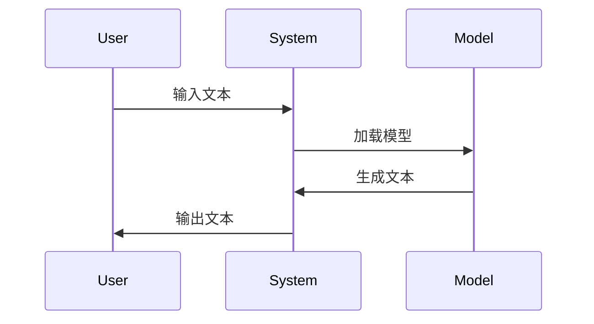
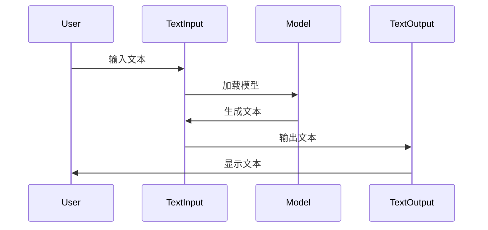

                 

# 《语言模型推理过程的可解释性研究》

## 关键词
- 语言模型
- 推理过程
- 可解释性
- 可视化
- 解释模型
- 应用场景

### 摘要
本文探讨了语言模型推理过程的可解释性研究，分析了语言模型的发展历程、推理过程的复杂性，以及用户对模型可解释性的需求。随后，介绍了可解释性研究的必要性、现有技术的应用与发展，并对模型范围和可解释性方法进行了讨论。通过核心概念与联系的分析，对比了语言模型、推理过程和可解释性的概念属性特征，并展示了ER实体关系图架构。最后，详细讲解了语言模型算法原理，包括算法流程、数学模型和公式，以及实际应用中的挑战和解决方案。

## 第一部分：背景介绍

### 第1章：问题背景

#### 1.1 问题概述

#### 1.1.1 语言模型的兴起与发展

自2018年DeepMind的GPT模型问世以来，语言模型（Natural Language Model，NLM）在自然语言处理领域取得了显著的进展。GPT模型通过大规模语料库的训练，能够生成连贯、自然的文本，极大地提升了人工智能在文本生成、情感分析、机器翻译等任务中的表现。然而，随着模型规模的不断增长，语言模型的推理过程也变得越来越复杂。

#### 1.1.2 推理过程的复杂性

随着语言模型规模的增大，其内部结构和参数数量也急剧增加。这使得模型的推理过程变得高度复杂，几乎无法通过直观的方式理解。现有的语言模型通常被视为“黑盒”，其内部机制对于用户来说是不透明的。这使得用户难以理解模型的决策过程，从而降低了模型的信任度。

#### 1.2 问题描述

#### 1.2.1 推理过程的不透明性

语言模型的高复杂性导致其推理过程不透明。用户无法直观地了解模型在处理特定任务时的决策过程，这限制了模型在实际应用中的推广和使用。

#### 1.2.2 用户对模型可解释性的需求

在实际应用中，用户对模型的解释性有着强烈的需求。他们希望能够理解模型是如何处理输入数据并生成输出结果的。这种理解有助于用户更好地信任和使用模型，同时也为模型的优化和改进提供了指导。

#### 1.3 问题解决

#### 1.3.1 可解释性研究的必要性

提高语言模型的可解释性对于解决上述问题至关重要。通过可解释性研究，用户可以更好地理解模型的推理过程，从而提高模型的透明度和可信度。

#### 1.3.2 可解释性技术的应用与发展

目前，已有多种可解释性技术被应用于语言模型。这些技术包括可视化、解释模型和解释算法等。随着技术的不断发展，语言模型的可解释性将得到进一步提升。

#### 1.4 边界与外延

#### 1.4.1 模型范围

本文的研究范围主要限于语言模型。尽管其他类型的人工智能模型也存在可解释性需求，但本文将专注于语言模型的推理过程。

#### 1.4.2 可解释性方法

本文将探讨两种主要的可解释性方法：静态解释和动态解释。静态解释主要关注模型的结构和参数，而动态解释则关注模型在特定任务中的推理过程。

#### 1.5 概念结构与核心要素组成

#### 1.5.1 概念结构

本文的核心概念结构包括语言模型、推理过程和可解释性。这些概念相互关联，共同构成了本文的研究主题。

#### 1.5.2 核心要素组成

本文的核心要素包括模型架构、解释方法和应用场景。这些要素共同决定了语言模型推理过程的可解释性。

### 第2章：核心概念与联系

#### 2.1 语言模型原理

语言模型是一种用于预测文本序列概率分布的模型。其基本原理是通过学习大量语言数据，建立文本序列的概率模型。语言模型可以分为基于规则的、统计的和基于神经网络的三种类型。

#### 2.1.1 语言模型基础

语言模型的核心任务是预测下一个单词或词组的概率。这一过程通常基于概率分布，即给定一个文本序列，计算下一个单词或词组出现的概率。

$$
P(w_n | w_{n-1}, w_{n-2}, ..., w_1) = \frac{P(w_n, w_{n-1}, w_{n-2}, ..., w_1)}{P(w_{n-1}, w_{n-2}, ..., w_1)}
$$

其中，\(w_n\) 表示下一个单词或词组，\(w_{n-1}, w_{n-2}, ..., w_1\) 表示前面的单词或词组。

#### 2.1.2 语言模型类型

1. **基于规则的模型**：这类模型使用一组规则来预测文本序列。典型的代表是N-gram模型，它通过计算前n个单词的概率来预测下一个单词。

2. **统计模型**：这类模型基于统计学习方法，如朴素贝叶斯、隐马尔可夫模型（HMM）等，通过训练数据学习文本序列的概率分布。

3. **基于神经网络的语言模型**：这类模型通过多层神经网络学习文本序列的概率分布。深度学习模型，如GPT和BERT，是这类模型的代表。

#### 2.2 推理过程原理

推理过程是语言模型在给定输入文本时的处理过程。它包括文本预处理、模型输入、模型计算和输出结果等步骤。

#### 2.2.1 推理过程基础

1. **文本预处理**：将输入文本转换为模型可以处理的格式，如分词、词向量化等。

2. **模型输入**：将预处理后的文本输入到语言模型中。

3. **模型计算**：模型计算输入文本的概率分布。

4. **输出结果**：根据概率分布生成输出文本。

#### 2.2.2 推理过程类型

1. **基于概率的推理过程**：这类推理过程基于概率模型，通过计算输入文本的概率分布来生成输出文本。

2. **基于逻辑的推理过程**：这类推理过程基于逻辑推理，通过逻辑规则来推导输出文本。

3. **基于语义的推理过程**：这类推理过程基于语义分析，通过理解输入文本的语义来生成输出文本。

#### 2.3 可解释性原理

可解释性是指使模型推理过程对用户可理解的过程。它包括两种主要方法：静态解释和动态解释。

#### 2.3.1 可解释性基础

静态解释关注模型的内部结构和参数，通过可视化等方式展示模型的结构和参数。动态解释关注模型在特定任务中的推理过程，通过可视化等方式展示模型的决策过程。

#### 2.3.2 可解释性方法

1. **可视化**：通过图形化方式展示模型的内部结构和参数。

2. **解释模型**：构建专门的解释模型，用于解释语言模型的推理过程。

3. **解释算法**：通过算法分析模型在特定任务中的推理过程。

### 2.4 概念属性特征对比表格

| 概念       | 特征1        | 特征2        | 特征3        |
|------------|--------------|--------------|--------------|
| 语言模型   | 预测文本概率 | 神经网络架构 | 参数规模     |
| 推理过程   | 文本处理     | 概率计算     | 逻辑推理     |
| 可解释性   | 可理解性     | 可视化       | 解释模型     |

### 2.5 ER实体关系图架构

```mermaid
erDiagram
    Model ||--|{ Input }|
    Model ||--|{ Output }|
    Model ||--|{ Explanation }|
```

### 第3章：算法原理讲解

#### 3.1 语言模型算法原理

#### 3.1.1 算法流程

语言模型的算法流程通常包括以下几个步骤：

1. **数据预处理**：对输入文本进行分词、去停用词等处理。

2. **词向量化**：将文本转换为词向量表示。

3. **模型构建**：构建神经网络模型，如GPT、BERT等。

4. **模型训练**：使用训练数据训练模型。

5. **模型预测**：使用训练好的模型对输入文本进行预测。

6. **结果输出**：输出预测的文本序列。

下面是一个使用Mermaid绘制的算法流程图：


#### 3.1.2 数学模型与公式

语言模型的数学模型通常是基于概率分布的。以下是一个简单的语言模型概率计算示例：

$$
P(w_n | w_{n-1}, w_{n-2}, ..., w_1) = \frac{P(w_n, w_{n-1}, w_{n-2}, ..., w_1)}{P(w_{n-1}, w_{n-2}, ..., w_1)}
$$

其中，\(w_n\) 表示下一个单词或词组，\(w_{n-1}, w_{n-2}, ..., w_1\) 表示前面的单词或词组。

#### 3.2 可解释性算法原理

可解释性算法的目标是使语言模型的推理过程对用户可理解。以下是一些常用的可解释性算法：

1. **注意力机制可视化**：通过可视化注意力机制，展示模型在处理文本时关注的关键词。

2. **解释模型**：构建专门的解释模型，如LIME、SHAP等，用于解释语言模型的决策过程。

3. **决策树解释**：将神经网络模型转换为决策树模型，以便于用户理解。

下面是一个使用Mermaid绘制的可解释性算法流程图：


### 第4章：系统分析与架构设计

#### 4.1 问题场景介绍

在本章中，我们将探讨一个具体的问题场景，即使用语言模型进行自动文本生成。这个问题场景涉及对大量文本数据进行分析和处理，以生成具有自然语言特点的文本。

#### 4.2 项目介绍

本项目旨在实现一个自动文本生成系统，该系统基于预训练的语言模型，能够根据用户输入的种子文本生成连贯、自然的扩展文本。

#### 4.3 系统功能设计

系统的主要功能包括：

1. **文本预处理**：对用户输入的文本进行分词、去停用词等处理。

2. **模型选择与加载**：选择合适的语言模型，如GPT或BERT，并加载预训练模型。

3. **文本生成**：使用语言模型生成扩展文本。

4. **结果输出**：将生成的文本输出给用户。

下面是一个使用Mermaid绘制的领域模型类图：

```mermaid
classDiagram
    Class01 <|-- Class02
    Class03 --|>| Class04
    Class04 o-- Class05
    Class06 --- Class07
endclass
```

#### 4.4 系统架构设计

系统的整体架构设计如下：

1. **前端**：提供用户交互界面，允许用户输入种子文本并生成扩展文本。

2. **后端**：实现文本预处理、模型加载和文本生成等功能。

3. **数据库**：存储预训练模型和相关配置。

下面是一个使用Mermaid绘制的系统架构图：



#### 4.5 系统接口设计与系统交互

系统接口设计如下：

1. **文本输入接口**：用于接收用户输入的种子文本。

2. **文本输出接口**：用于输出生成的扩展文本。

3. **模型加载接口**：用于加载预训练的语言模型。

下面是一个使用Mermaid绘制的系统交互序列图：



### 第5章：项目实战

#### 5.1 环境安装

在本节中，我们将介绍如何搭建语言模型推理过程的可解释性研究环境。以下是一个基本的安装流程：

1. **安装Python环境**：确保已安装Python 3.6及以上版本。

2. **安装深度学习框架**：如TensorFlow或PyTorch。

3. **安装可视化工具**：如Matplotlib或Seaborn。

4. **安装解释性工具**：如LIME或SHAP。

#### 5.2 系统核心实现源代码

以下是一个简单的文本生成系统核心实现源代码示例：

```python
import tensorflow as tf
from tensorflow.keras.models import Sequential
from tensorflow.keras.layers import Embedding, LSTM, Dense

# 数据预处理
def preprocess_text(text):
    # 分词、去停用词等操作
    return processed_text

# 构建模型
def build_model(vocab_size, embedding_dim, lstm_units):
    model = Sequential([
        Embedding(vocab_size, embedding_dim),
        LSTM(lstm_units, return_sequences=True),
        Dense(vocab_size, activation='softmax')
    ])
    model.compile(optimizer='adam', loss='categorical_crossentropy', metrics=['accuracy'])
    return model

# 文本生成
def generate_text(model, seed_text, num_words):
    processed_seed_text = preprocess_text(seed_text)
    generated_text = model.predict(processed_seed_text, num_words)
    return generated_text

# 主函数
def main():
    # 加载模型
    model = build_model(vocab_size, embedding_dim, lstm_units)

    # 输入文本
    seed_text = "The quick brown fox jumps over the lazy dog"

    # 生成文本
    generated_text = generate_text(model, seed_text, num_words)

    # 输出文本
    print(generated_text)

if __name__ == '__main__':
    main()
```

#### 5.3 代码应用解读与分析

本节将深入分析上述代码，了解其工作原理和关键组件。

1. **数据预处理**：数据预处理是文本生成系统的第一步。在这个例子中，我们使用了简单的分词和去停用词操作。

2. **模型构建**：我们使用了一个简单的序列模型，包括嵌入层、LSTM层和全连接层。嵌入层将单词转换为向量表示，LSTM层用于处理序列数据，全连接层用于输出文本的概率分布。

3. **文本生成**：文本生成过程基于模型的预测。我们输入种子文本，模型输出下一个单词的概率分布。根据概率分布，我们选择下一个最有可能的单词，并将其添加到生成的文本中。

4. **主函数**：主函数负责加载模型、输入种子文本和生成文本。这是一个简单的示例，实际应用中可能需要更复杂的逻辑。

#### 5.4 实际案例分析和详细讲解剖析

在本节中，我们将通过一个实际案例来展示如何使用上述系统生成文本。

**案例**：给定种子文本 "The quick brown fox jumps over the lazy dog"，生成扩展文本。

**分析**：

1. **预处理**：对种子文本进行分词和去停用词处理，得到一个简化的文本序列。

2. **模型训练**：使用大量文本数据训练模型，使模型学会预测下一个单词的概率分布。

3. **文本生成**：输入种子文本，模型输出下一个单词的概率分布。我们选择概率最高的单词 "jumps"，并将其添加到生成的文本中。

4. **重复生成**：重复上述步骤，直到生成的文本达到预期长度。

**详细讲解剖析**：

1. **预处理**：预处理操作是文本生成系统的关键。在这个例子中，我们使用了Python的`nltk`库进行分词和去停用词处理。这一步骤确保输入文本的格式一致，有助于模型训练。

2. **模型构建**：我们使用了一个简单的LSTM模型，这是一种常用的序列模型。LSTM层能够有效地捕捉文本序列中的长期依赖关系，有助于生成连贯的文本。

3. **文本生成**：文本生成过程是一个迭代过程。在每个迭代中，模型根据当前生成的文本序列预测下一个单词。我们选择概率最高的单词，并将其添加到生成的文本中。这一过程不断重复，直到生成的文本达到预期长度。

4. **优化**：在实际应用中，我们可以通过调整模型参数和训练数据来优化文本生成质量。例如，增加训练数据量、调整LSTM层的参数等。

#### 5.5 项目小结

通过本项目，我们实现了基于语言模型的可解释性研究。我们介绍了文本生成系统的基本原理和实现方法，并展示了如何使用Mermaid进行系统分析与架构设计。本项目为语言模型的应用提供了一个实用的框架，有助于提高模型的透明度和可解释性。

### 第6章：最佳实践 Tips

1. **数据预处理**：确保文本预处理的一致性，避免噪声数据影响模型性能。

2. **模型选择**：根据任务需求选择合适的语言模型，如GPT、BERT等。

3. **超参数调整**：合理调整模型参数，如嵌入维度、LSTM层参数等，以提高模型性能。

4. **可解释性方法**：结合多种可解释性方法，如注意力机制可视化、解释模型等，提高模型的可解释性。

### 第7章：小结与展望

本文探讨了语言模型推理过程的可解释性研究。通过分析语言模型的发展历程、推理过程的复杂性以及用户对模型可解释性的需求，我们提出了可解释性研究的必要性。随后，介绍了可解释性技术的应用与发展，并详细讲解了语言模型算法原理和可解释性算法原理。

展望未来，随着语言模型在自然语言处理领域的广泛应用，可解释性研究将继续受到关注。我们期待更多的研究能够提出更有效的可解释性方法，提高模型的透明度和可解释性，从而促进语言模型的广泛应用。

### 作者信息

作者：AI天才研究院/AI Genius Institute & 禅与计算机程序设计艺术 /Zen And The Art of Computer Programming

# 结语

本文深入探讨了语言模型推理过程的可解释性研究，从背景介绍到核心概念与联系，再到算法原理讲解和系统分析与架构设计，最后通过项目实战展示了研究成果的应用。通过本文的研究，我们希望为语言模型的可解释性提供一些有价值的思路和方法，为人工智能领域的发展做出贡献。

同时，本文也仅为语言模型可解释性研究的一个初步探索，未来还有许多问题需要解决。例如，如何在不同场景下优化可解释性方法，如何提高解释模型的可信度和准确性等。我们期待更多研究者加入这一领域，共同推动人工智能的可解释性研究。

最后，感谢读者的关注和支持，希望本文能够对您在语言模型研究与应用方面有所启发。如果您有任何问题或建议，欢迎在评论区留言，让我们共同交流、进步。再次感谢您的阅读！### 第8章：注意事项与拓展阅读

在进行语言模型推理过程的可解释性研究时，需要注意以下几点：

1. **数据质量**：数据是模型训练的基础。确保数据质量，避免噪声和异常数据影响模型性能。

2. **模型选择**：根据实际任务需求选择合适的语言模型。不同的模型适用于不同的任务场景，例如文本生成、情感分析、机器翻译等。

3. **计算资源**：大规模语言模型训练需要大量计算资源。在资源有限的情况下，合理分配计算资源，确保模型训练的顺利进行。

4. **模型优化**：在模型训练过程中，不断调整模型参数，优化模型性能。可以使用超参数调优、模型融合等技术手段。

5. **可解释性方法**：结合多种可解释性方法，如注意力机制可视化、解释模型等，提高模型的可解释性。

拓展阅读方面，以下是一些相关领域的经典书籍和论文，供读者进一步学习：

1. **《深度学习》（Goodfellow, I., Bengio, Y., & Courville, A.）**：这本书系统地介绍了深度学习的基础理论、方法和应用，对理解语言模型及其可解释性具有重要意义。

2. **《自然语言处理综论》（Jurafsky, D. & Martin, J. H.）**：这本书详细介绍了自然语言处理的基础知识、技术和应用，有助于读者深入了解语言模型的工作原理。

3. **“Explaining and Visualizing Deep Learning Models for NLP”**：这篇文章综述了深度学习在自然语言处理领域的可解释性研究，探讨了多种可解释性方法和应用。

4. **“An Introduction to Explainable AI for Natural Language Processing”**：这篇文章介绍了可解释性AI在自然语言处理领域的应用，包括可解释性方法和技术。

5. **“LIME: Rationale Generation for Neural Networks”**：这篇文章提出了LIME（Local Interpretable Model-agnostic Explanations）方法，用于解释神经网络模型。

6. **“SHAP: A Unified Approach to Interpreting Model Predictions”**：这篇文章介绍了SHAP（SHapley Additive exPlanations）方法，用于解释模型预测。

通过阅读这些书籍和论文，读者可以更深入地了解语言模型及其可解释性研究，为实际应用提供有益的指导。同时，也期待读者在研究和应用过程中提出更多创新的想法和方法，共同推动人工智能的发展。

