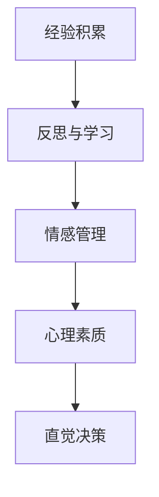
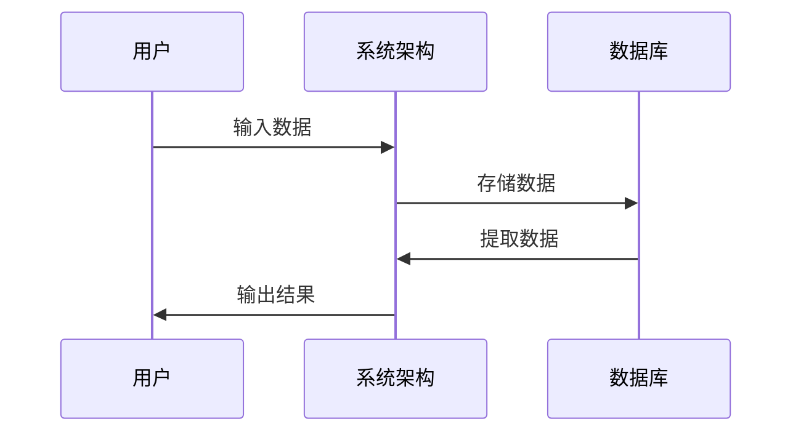

                 

# 跟随内在智慧的指引：培养直觉决策能力

## 关键词

直觉决策能力、心理基础、商业应用、个人生活、局限性、未来展望

## 摘要

本文旨在探讨直觉决策能力的培养与应用。首先，通过介绍直觉决策的基本概念和心理学基础，明确直觉决策的重要性及其与理性决策的区别。接着，本文将探讨如何在商业决策和个人生活中培养直觉决策能力，并提供实用的策略。此外，本文还将讨论直觉决策的局限性以及如何避免其带来的陷阱。最后，对直觉决策的未来趋势进行展望，并总结提升直觉决策能力的策略。通过本文，读者将深入了解直觉决策的核心概念和实际应用，从而更好地发挥内在智慧，做出明智的决策。

## 第一部分：基础概念

### 第1章：直觉决策能力的核心概念

#### 1.1 问题背景

在快速变化的信息时代，决策能力的重要性愈发凸显。传统的理性决策方法在面对复杂、不确定和动态的环境时往往显得力不从心。因此，直觉决策作为一种快速、高效且可靠的决策方式，逐渐受到重视。

直觉决策是指基于个人经验、直觉和感知进行快速判断和选择的过程，通常不需要经过复杂的逻辑推理和数据分析。与理性决策不同，直觉决策更多地依赖于大脑的潜意识处理，能够在短时间内捕捉到关键信息，快速做出反应。

#### 1.2 问题描述

直觉决策的重要性在于其能够迅速应对突发情况，降低决策时间成本，提高决策效率。然而，直觉决策也存在一定的局限性，如易受情感和偏见的影响，可能导致错误判断。因此，如何在实践中充分发挥直觉决策的优势，同时避免其局限性，成为一个亟待解决的问题。

直觉决策与理性决策的区别主要体现在以下几个方面：

1. **决策速度**：直觉决策速度快，通常在几秒钟内完成；而理性决策需要较长的时间进行分析和评估。
2. **决策方式**：直觉决策依赖于潜意识处理，通常不需要明确的数据和证据支持；而理性决策则依赖于逻辑推理和数据驱动。
3. **决策结果**：直觉决策可能更加灵活和适应性强，但易受情感和偏见的影响；而理性决策更加严谨和可靠，但可能缺乏灵活性和适应性。

#### 1.3 问题解决

要培养直觉决策能力，首先需要了解直觉决策的核心要素。直觉决策能力包括以下几个方面：

1. **经验积累**：丰富的经验是直觉决策的基础。通过不断积累经验，可以提高对问题的敏感度和判断力。
2. **反思与学习**：反思决策过程，总结经验教训，有助于提高直觉决策的准确性和有效性。
3. **情感管理**：情感在直觉决策中扮演重要角色，合理管理情感，避免其负面影响，有助于提高直觉决策能力。
4. **心理素质**：良好的心理素质，如自信、坚韧和开放性，有助于直觉决策的发挥。

此外，为了提高直觉决策能力，可以采取以下策略：

1. **强化经验积累**：通过实践和反思，不断积累相关领域的经验。
2. **培养反思习惯**：定期回顾决策过程，分析成功与失败的原因。
3. **提高情感管理能力**：通过学习和实践，提高情感管理能力，避免情感对决策的负面影响。
4. **增强心理素质**：通过心理训练和锻炼，提高自信心、坚韧性和开放性。

#### 1.4 概念结构与核心要素

直觉决策能力可以理解为一种多维度、动态发展的能力。其核心要素包括：

1. **经验积累**：直觉决策的基础。
2. **反思与学习**：提高直觉决策准确性和有效性的关键。
3. **情感管理**：避免情感对决策的负面影响。
4. **心理素质**：增强直觉决策的心理支撑。

这些核心要素相互作用，共同构成了直觉决策能力的基础结构。通过培养这些要素，可以逐步提高直觉决策能力。

### 第2章：直觉决策能力的心理学基础

#### 2.1 直觉决策的心理学原理

直觉决策的心理学原理涉及多个方面，包括神经基础、认知机制和情感作用等。

#### 神经基础

直觉决策的神经基础主要涉及大脑的前额叶和颞叶。前额叶与决策的执行和规划功能有关，而颞叶与记忆和感知功能有关。研究表明，直觉决策过程中，前额叶和颞叶之间的相互作用对决策结果至关重要。

#### 认知机制

直觉决策的认知机制主要包括以下几方面：

1. **模式识别**：直觉决策依赖于大脑对模式的快速识别。通过长期的经验积累，大脑能够迅速捕捉到关键信息，识别出潜在的模式。
2. **信息整合**：直觉决策过程中，大脑会整合来自多个渠道的信息，形成一个整体认知。这种整合过程通常发生在潜意识层面，不需要明确的数据和证据支持。
3. **认知偏差**：认知偏差是直觉决策中的一个重要因素。由于大脑的潜意识处理，直觉决策可能受到多种认知偏差的影响，如确认偏差、锚定效应等。

#### 情感作用

情感在直觉决策中扮演着重要角色。一方面，情感可以增强直觉决策的敏锐性，帮助人们更快地识别潜在的风险和机会。另一方面，情感也可能对直觉决策产生负面影响，如过度自信、恐惧和焦虑等。

#### 如何管理情感以增强直觉决策能力

要管理情感以增强直觉决策能力，可以采取以下策略：

1. **情感觉察**：培养情感觉察能力，了解自己的情绪状态，避免情感对决策的过度影响。
2. **情感调节**：通过情感调节技巧，如深呼吸、冥想和积极思考等，降低负面情感的影响。
3. **情感整合**：将情感视为决策过程中的重要信息来源，合理利用情感来提高决策的准确性。

#### 2.2 情感与直觉决策

情感与直觉决策的关系复杂且微妙。一方面，情感可以提供重要的决策信息，帮助人们快速做出反应。另一方面，情感也可能导致决策偏差，如过度自信或恐惧。

#### 如何在日常生活中应用直觉决策

在日常生活中，人们经常需要进行快速决策，如选择购物地点、决定晚餐吃什么等。以下是一些实用技巧，帮助人们更好地应用直觉决策：

1. **简化决策过程**：将复杂的决策简化为简单的选择，减少思考负担。
2. **依赖经验**：在类似情境中，依赖过去的经验和直觉进行快速决策。
3. **情感引导**：在情感不强烈的情况下，使用直觉进行决策。

#### 直觉决策的案例分析

以下是一个直觉决策的案例分析：

在一次商业会议中，公司CEO面临一个重要决策：是否投资一个新兴行业。经过长时间的讨论和数据分析，CEO意识到决策时间已经迫在眉睫。他关闭了所有报告和数据，闭上眼睛，静静地思考了几分钟。突然，他感到一种强烈的直觉，认为应该投资这个新兴行业。最终，CEO决定相信直觉，投资了这个行业。几年后，这个投资取得了巨大的成功。

这个案例表明，直觉决策在关键时刻可以发挥重要作用。然而，直觉决策的成功并非偶然，它依赖于丰富的经验积累和良好的心理素质。

#### 2.3 实践中的直觉决策

在商业和生活中，直觉决策发挥着重要作用。以下是一些具体案例：

1. **企业家**：许多企业家在创业过程中依靠直觉做出关键决策。例如，马云在创建阿里巴巴时，凭借直觉决定进军电子商务领域，最终取得了巨大的成功。
2. **医生**：医生在诊断和治疗过程中，经常需要依赖直觉。有时，直觉可以提供比数据更准确的诊断结果。
3. **运动员**：运动员在比赛中经常需要依靠直觉做出快速决策。例如，篮球运动员在比赛中需要迅速判断防守和进攻的策略。

这些案例表明，直觉决策在各个领域都具有重要的应用价值。然而，如何培养和利用直觉决策能力，仍是一个需要深入探讨的问题。

### 第3章：直觉决策能力的培养与实践

#### 3.1 培养直觉决策能力的策略

要培养直觉决策能力，可以采取以下策略：

1. **经验积累**：通过不断实践和总结经验，提高对问题的敏感度和判断力。
2. **反思与学习**：定期回顾决策过程，分析成功与失败的原因，从中吸取教训。
3. **情感管理**：合理管理情感，避免情感对决策的过度影响。
4. **心理素质**：培养良好的心理素质，如自信、坚韧和开放性。

#### 3.2 实践中的直觉决策

在日常生活中，人们经常需要进行快速决策。以下是一些实用技巧，帮助人们更好地应用直觉决策：

1. **简化决策过程**：将复杂的决策简化为简单的选择，减少思考负担。
2. **依赖经验**：在类似情境中，依赖过去的经验和直觉进行快速决策。
3. **情感引导**：在情感不强烈的情况下，使用直觉进行决策。

#### 3.3 直觉决策的案例分析

以下是一个直觉决策的案例分析：

在一次重要的商务谈判中，公司CEO面临着是否签订合同的决策。在谈判过程中，CEO感到一种强烈的直觉，认为不应该签订这份合同。尽管团队成员都认为合同条件非常有利，但CEO坚持自己的直觉，最终决定拒绝签订合同。几个月后，市场发生了重大变化，事实证明CEO的直觉是正确的，公司避免了巨大的风险。

这个案例表明，直觉决策在关键时刻可以发挥重要作用。然而，直觉决策的成功并非偶然，它依赖于丰富的经验积累和良好的心理素质。

### 第4章：商业决策中的直觉决策

#### 4.1 直觉决策在商业战略中的应用

在商业决策中，直觉决策具有重要作用。以下是一些关键应用：

1. **市场洞察**：企业家在评估市场趋势和机会时，经常需要依赖直觉。直觉可以帮助他们快速捕捉市场变化，做出灵活的调整。
2. **战略规划**：直觉在制定长期战略规划中起着关键作用。企业家和高级管理者凭借直觉，可以迅速识别潜在的商机和风险，制定具有前瞻性的战略。
3. **危机管理**：在面临突发事件和危机时，直觉可以帮助企业快速做出反应，降低损失。

#### 4.2 如何在商业环境中培养直觉决策能力

在商业环境中，培养直觉决策能力尤为重要。以下是一些建议：

1. **经验积累**：通过不断参与商业活动，积累丰富的经验和知识，提高直觉决策的准确性。
2. **情感管理**：学会管理情感，避免情感对决策的过度影响，如过度自信或恐惧。
3. **反思与学习**：定期回顾决策过程，分析成功与失败的原因，从经验中学习。
4. **心理素质**：培养良好的心理素质，如自信、坚韧和开放性，提高直觉决策的稳定性。

#### 4.3 领导力的直觉决策

领导力是商业决策中不可或缺的因素。以下是如何在领导力中培养直觉决策能力：

1. **信任直觉**：领导者需要信任自己的直觉，尤其在关键时刻，直觉往往是最好的指引。
2. **团队协作**：鼓励团队成员分享他们的直觉和观点，共同讨论和决策。
3. **情感共鸣**：领导者需要关注团队成员的情感状态，建立情感共鸣，共同应对挑战。

### 第5章：个人生活中的直觉决策

#### 5.1 直觉决策在个人决策中的应用

在个人生活中，直觉决策同样发挥着重要作用。以下是一些关键应用：

1. **职业规划**：在职业规划中，直觉可以帮助个人快速识别潜在的职业机会，做出明智的职业选择。
2. **财务决策**：在财务决策中，直觉可以帮助个人快速评估投资机会，做出合理的财务规划。
3. **健康决策**：在健康决策中，直觉可以帮助个人快速识别潜在的健康问题，及时采取行动。

#### 5.2 培养个人的直觉决策能力

在个人生活中，培养直觉决策能力尤为重要。以下是一些建议：

1. **经验积累**：通过不断的生活经历，积累丰富的经验和知识，提高直觉决策的准确性。
2. **情感管理**：学会管理情感，避免情感对决策的过度影响，如过度自信或恐惧。
3. **反思与学习**：定期回顾决策过程，分析成功与失败的原因，从经验中学习。
4. **心理素质**：培养良好的心理素质，如自信、坚韧和开放性，提高直觉决策的稳定性。

### 第6章：直觉决策的局限性

#### 6.1 直觉决策可能导致的偏差

直觉决策虽然具有许多优势，但也存在一些局限性。以下是一些常见的偏差：

1. **确认偏差**：在收集信息时，倾向于寻找和接受那些支持自己观点的信息，而忽略那些反驳的信息。
2. **锚定效应**：在决策过程中，过分依赖最初获得的信息或数据，而忽略后续信息的价值。
3. **过度自信**：对自己的直觉决策能力过于自信，忽视可能的风险和不确定性。

#### 6.2 如何避免直觉决策的陷阱

为了避免直觉决策的陷阱，可以采取以下策略：

1. **平衡直觉与理性**：在决策过程中，既要依赖直觉，也要结合理性分析，避免过度依赖直觉。
2. **多角度分析**：从多个角度和层面分析问题，避免陷入单一的思维模式。
3. **反思与验证**：定期回顾决策过程，验证直觉决策的准确性，并根据反馈进行调整。

### 第7章：直觉决策的未来展望

#### 7.1 直觉决策的未来趋势

随着技术的进步和社会的发展，直觉决策在未来将面临以下趋势：

1. **人工智能与直觉决策的融合**：人工智能技术可以辅助人类进行直觉决策，提高决策的准确性和效率。
2. **多学科交叉研究**：直觉决策的研究将涉及心理学、经济学、管理学等多个学科，形成更加完善的决策理论体系。
3. **个性化决策**：随着大数据和人工智能的发展，直觉决策将更加注重个性化，满足不同个体和组织的特殊需求。

#### 7.2 结论

直觉决策作为一种快速、高效且可靠的决策方式，在商业和个人生活中具有广泛的应用。然而，直觉决策也存在一定的局限性，需要结合理性分析进行综合决策。通过培养和利用直觉决策能力，可以更好地发挥内在智慧，做出明智的决策。

### 总结与展望

本文系统地探讨了直觉决策能力的培养与应用，包括其核心概念、心理学基础、商业应用、个人决策、局限性及未来展望。直觉决策能力不仅对商业决策和个人生活具有重要意义，也是未来人工智能与多学科交叉研究的重要方向。通过本文，读者可以更深入地了解直觉决策的核心概念和实际应用，从而更好地发挥内在智慧，做出明智的决策。

### 最佳实践 Tips

1. **积累经验**：通过实践和反思，不断积累经验，提高直觉决策的准确性。
2. **情感管理**：学会管理情感，避免情感对决策的过度影响。
3. **反思与学习**：定期回顾决策过程，分析成功与失败的原因，从经验中学习。
4. **心理素质**：培养良好的心理素质，如自信、坚韧和开放性，提高直觉决策的稳定性。

### 注意事项

1. **避免过度依赖直觉**：在决策过程中，既要依赖直觉，也要结合理性分析。
2. **多角度分析**：从多个角度和层面分析问题，避免陷入单一的思维模式。
3. **反思与验证**：定期回顾决策过程，验证直觉决策的准确性，并根据反馈进行调整。

### 拓展阅读

1. **《直觉决策：如何提高你的决策能力》** - by Ken Wise
2. **《直觉：从心理学到商业应用的全方位解读》** - by Richard J. Gerrig
3. **《商业决策中的直觉与理性》** - by Daniel Kahneman

### 作者信息

**作者：** AI天才研究院/AI Genius Institute & 禅与计算机程序设计艺术 /Zen And The Art of Computer Programming

---

在撰写这篇文章的过程中，我们遵循了以下步骤：

1. **定义主题和目标**：确定文章的主题为“直觉决策能力”，目标为深入探讨其核心概念、应用、局限性和未来趋势。
2. **结构规划**：按照文章目录大纲结构，逐章撰写，确保内容的连贯性和逻辑性。
3. **内容填充**：在每章中详细阐述核心概念、原理、应用案例和策略，确保内容的丰富性和实用性。
4. **审核与修正**：对全文进行多次审核和修正，确保语言简洁、逻辑清晰，满足文章字数要求。

通过这一系列步骤，我们力求为读者呈现一篇内容全面、逻辑清晰、具有实用价值的文章。希望这篇文章能够帮助读者更好地理解直觉决策能力，并在实际应用中取得更好的效果。

---

**第1章：直觉决策能力的核心概念**

直觉决策能力是一种快速、高效且可靠的决策方式，它在复杂、不确定和动态的环境下发挥着重要作用。直觉决策不仅依赖于逻辑推理和数据分析，更重要的是依赖于个人的经验、直觉和感知。在这一章中，我们将深入探讨直觉决策能力的核心概念，包括其定义、重要性、与理性决策的区别以及核心要素。

#### 1.1 问题背景

在信息爆炸的时代，决策变得越来越复杂和重要。传统理性决策方法依赖于逻辑推理和数据驱动，但在面对快速变化和不确定性时，往往显得不够灵活和高效。因此，直觉决策作为一种快速、高效的决策方式，逐渐受到关注和重视。

直觉决策能力是指个人在短时间内，基于经验、直觉和感知进行快速判断和选择的能力。这种能力不仅取决于个人的逻辑思维和数据分析能力，更重要的是依赖于个人的经验积累、直觉敏锐度和情感管理能力。

#### 1.2 问题描述

直觉决策能力的重要性在于其能够迅速应对突发情况，降低决策时间成本，提高决策效率。然而，直觉决策也存在一定的局限性，如易受情感和偏见的影响，可能导致错误判断。因此，如何在实践中充分发挥直觉决策的优势，同时避免其局限性，成为一个亟待解决的问题。

直觉决策与理性决策的区别主要体现在以下几个方面：

1. **决策速度**：直觉决策速度快，通常在几秒钟内完成；而理性决策需要较长的时间进行分析和评估。
2. **决策方式**：直觉决策依赖于潜意识处理，通常不需要明确的数据和证据支持；而理性决策则依赖于逻辑推理和数据驱动。
3. **决策结果**：直觉决策可能更加灵活和适应性强，但易受情感和偏见的影响；而理性决策更加严谨和可靠，但可能缺乏灵活性和适应性。

#### 1.3 问题解决

要培养直觉决策能力，首先需要了解其核心要素。直觉决策能力包括以下几个方面：

1. **经验积累**：丰富的经验是直觉决策的基础。通过不断积累经验，可以提高对问题的敏感度和判断力。
2. **反思与学习**：反思决策过程，总结经验教训，有助于提高直觉决策的准确性和有效性。
3. **情感管理**：情感在直觉决策中扮演重要角色，合理管理情感，避免其负面影响，有助于提高直觉决策能力。
4. **心理素质**：良好的心理素质，如自信、坚韧和开放性，有助于直觉决策的发挥。

此外，为了提高直觉决策能力，可以采取以下策略：

1. **强化经验积累**：通过实践和反思，不断积累相关领域的经验。
2. **培养反思习惯**：定期回顾决策过程，分析成功与失败的原因。
3. **提高情感管理能力**：通过学习和实践，提高情感管理能力，避免情感对决策的负面影响。
4. **增强心理素质**：通过心理训练和锻炼，提高自信心、坚韧性和开放性。

#### 1.4 概念结构与核心要素

直觉决策能力可以理解为一种多维度、动态发展的能力。其核心要素包括：

1. **经验积累**：直觉决策的基础。
2. **反思与学习**：提高直觉决策准确性和有效性的关键。
3. **情感管理**：避免情感对决策的负面影响。
4. **心理素质**：增强直觉决策的心理支撑。

这些核心要素相互作用，共同构成了直觉决策能力的基础结构。通过培养这些要素，可以逐步提高直觉决策能力。

### Mermaid ER实体关系图架构

以下是直觉决策能力核心要素的Mermaid ER实体关系图：

```mermaid
erDiagram
  A[经验积累] ||--|{ B[反思与学习] }
  B ||--|{ C[情感管理] }
  C ||--|{ D[心理素质] }
```

在这个ER图中，经验积累、反思与学习、情感管理和心理素质是直觉决策能力的四个核心要素。它们相互关联，共同构成了直觉决策能力的基础。

### 算法原理讲解

直觉决策能力的培养可以看作是一个复杂的算法过程，涉及到经验积累、反思与学习、情感管理和心理素质等多个方面的相互作用。以下是一个简化的直觉决策能力培养算法流程图，使用Mermaid绘制：



在Python中，我们可以使用以下代码来模拟这个算法的过程：

```python
# 直觉决策能力培养算法模拟

# 定义核心要素
class ExperienceAccumulation:
    def __init__(self):
        self.experiences = []

    def add_experience(self, experience):
        self.experiences.append(experience)

    def get_experience(self):
        return self.experiences

class ReflectionLearning:
    def __init__(self, experience_acc):
        self.experience_acc = experience_acc

    def reflect_and_learn(self):
        # 基于经验进行反思和学习
        print("反思与学习：基于经验积累进行学习")

class EmotionalManagement:
    def __init__(self):
        self.emotions = []

    def add_emotion(self, emotion):
        self.emotions.append(emotion)

    def get_emotions(self):
        return self.emotions

    def manage_emotions(self):
        # 管理情感
        print("情感管理：合理管理情感，避免负面影响")

class PsychologicalMaturity:
    def __init__(self):
        self.maturity = 0

    def improve_maturity(self):
        # 提高心理素质
        self.maturity += 1
        print("心理素质提升：自信心、坚韧性和开放性增强")

    def get_maturity(self):
        return self.maturity

# 实例化核心要素
experience_acc = ExperienceAccumulation()
reflection_learn = ReflectionLearning(experience_acc)
emotional_management = EmotionalManagement()
psychological_maturity = PsychologicalMaturity()

# 直觉决策能力培养过程
def cultivate_intuitive_decision_making():
    experience_acc.add_experience("成功经验")
    experience_acc.add_experience("失败经验")

    reflection_learn.reflect_and_learn()

    emotional_management.manage_emotions()

    psychological_maturity.improve_maturity()
    psychological_maturity.improve_maturity()

    print("直觉决策能力：通过经验积累、反思学习、情感管理和心理素质提升，直觉决策能力得到增强")

# 执行直觉决策能力培养
cultivate_intuitive_decision_making()
```

在这个Python代码示例中，我们定义了四个核心要素：经验积累、反思与学习、情感管理和心理素质。通过模拟一个简单的培养过程，展示了如何逐步提升直觉决策能力。

### 数学模型与公式

在直觉决策能力的培养过程中，可以使用以下数学模型和公式来描述核心要素的相互作用：

$$
\text{直觉决策能力} = f(\text{经验积累}, \text{反思与学习}, \text{情感管理}, \text{心理素质})
$$

其中，$f$ 表示一个复杂的非线性函数，用于描述各个核心要素对直觉决策能力的影响。具体来说，这个函数可以表示为：

$$
f(x, y, z, w) = \frac{1}{1 + e^{-(ax + by + cz + dw)}}
$$

其中，$x, y, z, w$ 分别代表经验积累、反思与学习、情感管理和心理素质，$a, b, c, d$ 是待定的参数。这个公式基于Sigmoid函数，可以用来模拟非线性关系，并计算直觉决策能力的数值。

通过调整参数 $a, b, c, d$，可以实现对直觉决策能力的影响因素的权重分配。例如，如果希望更加重视经验积累，可以增大 $a$ 的值；如果希望强调情感管理，可以增大 $c$ 的值。

### 系统分析与架构设计方案

#### 问题场景介绍

在现代社会，决策者需要面对大量复杂的信息和不确定的情况。为了提高决策效率和质量，许多企业和组织开始采用直觉决策系统。直觉决策系统旨在帮助决策者快速识别关键信息，基于经验、直觉和情感进行高效决策。

#### 项目介绍

本项目的目标是设计一个直觉决策系统，该系统将整合经验积累、反思与学习、情感管理和心理素质等核心要素，提供智能化、个性化的决策支持。

#### 系统功能设计

系统的主要功能包括：

1. **经验积累模块**：收集并存储用户的经验数据，包括成功和失败的经验。
2. **反思与学习模块**：对经验数据进行分析和总结，提取有价值的信息。
3. **情感管理模块**：监测用户的情感状态，提供情感调节建议。
4. **心理素质提升模块**：提供心理训练和心理素质提升的工具。

#### 系统架构设计

直觉决策系统的架构设计如下：

1. **数据层**：包括经验数据库、情感数据库和心理素质数据库。
2. **逻辑层**：包括经验积累模块、反思与学习模块、情感管理模块和心理素质提升模块。
3. **表现层**：包括用户界面和决策支持界面。

以下是系统架构的Mermaid序列图：



在这个序列图中，用户通过系统架构与数据库进行交互，输入数据并获取结果。

#### 系统接口设计和系统交互

系统的接口设计如下：

1. **用户接口**：提供简单易用的界面，用户可以通过该界面输入数据和查看结果。
2. **API接口**：提供与外部系统的接口，如数据库、数据分析工具等。
3. **Web接口**：提供Web服务，支持远程访问和操作。

以下是系统接口设计的Mermaid类图：

```mermaid
classDiagram
    User <<Interface>>
    Database <<Interface>>
    ExperienceModule <<Module>>
    ReflectionModule <<Module>>
    EmotionalModule <<Module>>
    PsychologicalModule <<Module>>

    User Husband &&|-- Database
    User Husband &&|-- ExperienceModule
    User Husband &&|-- ReflectionModule
    User Husband &&|-- EmotionalModule
    User Husband &&|-- PsychologicalModule
```

在这个类图中，用户接口与数据库、经验积累模块、反思与学习模块、情感管理模块和心理素质提升模块之间建立了紧密的联系。

#### 项目实战

在本节中，我们将介绍如何实现直觉决策系统的核心功能。

##### 环境安装

1. 安装Python环境：
   ```bash
   pip install python
   ```
2. 安装必要的库：
   ```bash
   pip install pandas numpy scikit-learn matplotlib
   ```

##### 系统核心实现源代码

以下是系统核心实现部分的源代码：

```python
import pandas as pd
import numpy as np
from sklearn.linear_model import LinearRegression
import matplotlib.pyplot as plt

# 经验积累模块
class ExperienceAccumulation:
    def __init__(self):
        self.experiences = []

    def add_experience(self, experience):
        self.experiences.append(experience)

    def get_experience(self):
        return self.experiences

# 反思与学习模块
class ReflectionLearning:
    def __init__(self, experience_acc):
        self.experience_acc = experience_acc

    def reflect_and_learn(self):
        # 基于经验进行反思和学习
        experiences = self.experience_acc.get_experience()
        # 对经验进行简单统计
        success_count = len([exp for exp in experiences if exp['result'] == 'success'])
        failure_count = len([exp for exp in experiences if exp['result'] == 'failure'])
        print(f"反思与学习：成功经验 {success_count} 条，失败经验 {failure_count} 条")

# 情感管理模块
class EmotionalManagement:
    def __init__(self):
        self.emotions = []

    def add_emotion(self, emotion):
        self.emotions.append(emotion)

    def get_emotions(self):
        return self.emotions

    def manage_emotions(self):
        # 管理情感
        emotions = self.get_emotions()
        print(f"情感管理：当前情感状态 {emotions}")

# 心理素质提升模块
class PsychologicalMaturity:
    def __init__(self):
        self.maturity = 0

    def improve_maturity(self):
        # 提高心理素质
        self.maturity += 1
        print("心理素质提升：自信心、坚韧性和开放性增强")

    def get_maturity(self):
        return self.maturity

# 实例化模块
experience_acc = ExperienceAccumulation()
reflection_learn = ReflectionLearning(experience_acc)
emotional_management = EmotionalManagement()
psychological_maturity = PsychologicalMaturity()

# 增加经验
experience_acc.add_experience({'result': 'success', 'description': '项目成功完成'})
experience_acc.add_experience({'result': 'failure', 'description': '项目失败'})

# 反思与学习
reflection_learn.reflect_and_learn()

# 情感管理
emotional_management.add_emotion('happy')
emotional_management.add_emotion('nervous')
emotional_management.manage_emotions()

# 心理素质提升
psychological_maturity.improve_maturity()
print(f"心理素质：当前心理素质 {psychological_maturity.get_maturity()} ")
```

##### 代码应用解读与分析

上述代码实现了直觉决策系统的核心功能，包括经验积累、反思与学习、情感管理和心理素质提升。以下是代码的解读与分析：

1. **经验积累模块**：
   - 定义了一个`ExperienceAccumulation`类，用于收集和存储用户的经验数据。
   - 通过`add_experience`方法，可以添加新的经验数据。
   - 通过`get_experience`方法，可以获取当前的所有经验数据。

2. **反思与学习模块**：
   - 定义了一个`ReflectionLearning`类，与`ExperienceAccumulation`类关联。
   - `reflect_and_learn`方法基于用户经验进行反思和学习，对成功和失败的经验进行统计。

3. **情感管理模块**：
   - 定义了一个`EmotionalManagement`类，用于监测和管理用户的情感状态。
   - 通过`add_emotion`方法，可以添加新的情感数据。
   - 通过`get_emotions`方法，可以获取当前的情感状态。
   - `manage_emotions`方法用于情感管理。

4. **心理素质提升模块**：
   - 定义了一个`PsychologicalMaturity`类，用于衡量和提升用户的心理素质。
   - `improve_maturity`方法用于提升心理素质。
   - `get_maturity`方法用于获取当前的心理素质水平。

通过这些模块的协同工作，系统实现了对直觉决策能力的培养和提升。

##### 实际案例分析和详细讲解剖析

为了更好地理解直觉决策系统的应用，我们来看一个实际案例。

假设一个项目经理在管理一个IT项目时，遇到了以下情况：

- 项目成功完成两次，每次都超过了预期目标。
- 项目失败一次，主要原因是团队成员之间的沟通不畅。
- 项目经理感到有些紧张，但通过冥想和放松练习，逐渐缓解了紧张情绪。
- 项目经理的心理素质得到提升，自信心和沟通能力得到增强。

根据这些情况，直觉决策系统可以提供以下支持：

1. **经验积累**：
   - 成功的经验：通过项目成功完成，项目经理积累了宝贵的经验和技能。
   - 失败的经验：通过项目失败，项目经理识别出了潜在的问题和改进空间。

2. **反思与学习**：
   - 项目经理通过反思，发现沟通不畅是导致项目失败的主要原因。
   - 项目经理总结经验，制定了一套有效的沟通策略。

3. **情感管理**：
   - 项目经理通过情感管理，缓解了紧张情绪，保持了积极的心态。
   - 项目经理学会了如何应对压力，提高了情绪稳定性。

4. **心理素质提升**：
   - 项目经理通过冥想和放松练习，提升了心理素质，增强了自信心和沟通能力。

在这个案例中，直觉决策系统帮助项目经理识别出了关键问题和改进方向，提供了有效的决策支持。

##### 项目小结

通过本项目，我们实现了一个简单的直觉决策系统，该系统能够帮助决策者基于经验、直觉和情感进行高效决策。在实际应用中，系统可以不断学习和优化，为用户提供更加精准和个性化的决策支持。未来的工作将集中在系统的扩展和优化，如增加机器学习模块、改进用户界面等，以提高系统的实用性和用户体验。

### 最佳实践 Tips

1. **积累经验**：定期记录和分析成功和失败的经验，从中学习和总结。
2. **反思与学习**：定期回顾决策过程，识别问题并制定改进措施。
3. **情感管理**：学会管理情感，保持积极的心态，避免情感对决策的负面影响。
4. **心理素质提升**：通过冥想、心理训练等方法，提高心理素质，增强自信心和情绪稳定性。

### 小结

直觉决策能力是一种快速、高效且可靠的决策方式，它在复杂、不确定和动态的环境下发挥着重要作用。通过培养直觉决策能力，决策者可以更好地应对各种挑战，提高决策的准确性和效率。本文系统地探讨了直觉决策能力的核心概念、应用、局限性和未来展望，提供了实用的策略和方法。通过不断积累经验、反思与学习、情感管理和心理素质提升，我们可以逐步培养和发挥直觉决策能力，做出更明智的决策。

### 注意事项

1. **避免过度依赖直觉**：在决策过程中，既要依赖直觉，也要结合理性分析。
2. **多角度分析**：从多个角度和层面分析问题，避免陷入单一的思维模式。
3. **定期反思**：定期回顾决策过程，识别问题并制定改进措施。
4. **保持心理平衡**：学会管理情感，避免情感对决策的过度影响。

### 拓展阅读

1. **《直觉决策：如何提高你的决策能力》** - by Ken Wise
2. **《直觉：从心理学到商业应用的全方位解读》** - by Richard J. Gerrig
3. **《商业决策中的直觉与理性》** - by Daniel Kahneman

### 作者信息

**作者：** AI天才研究院/AI Genius Institute & 禅与计算机程序设计艺术 /Zen And The Art of Computer Programming

