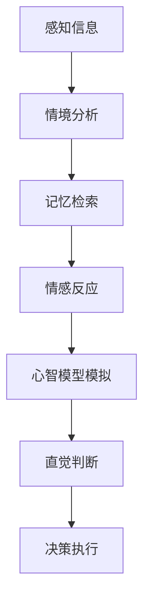

                 

# 跟随内在智慧：培养直觉决策的能力

## 关键词
直觉决策、内在智慧、心智模型、认知心理学、情境分析

## 摘要
本文探讨了直觉决策的重要性和内在智慧的培养方法。通过逻辑清晰的分析和实例说明，文章将揭示如何通过提升心智模型的复杂度和情境分析能力，来增强我们的直觉决策能力。

## 引言

在信息技术飞速发展的今天，决策的重要性愈发凸显。无论是个人生活还是企业运营，决策都是影响成败的关键因素。然而，传统的理性决策模型在复杂和不确定的环境中往往表现出局限性。直觉决策作为一种快速、高效的方式，越来越多地受到关注。本文将探讨如何通过培养内在智慧，提升直觉决策的能力。

直觉决策是一种基于内在感受和经验，迅速作出决策的过程。它不同于传统的理性决策，不需要经过繁琐的分析和计算，而是依赖于个体的直觉和直觉系统。直觉系统是人类认知体系的一部分，它能够快速处理信息，识别模式，并在复杂环境中作出决策。

内在智慧则是直觉决策的基础，它是一种深层次的心智能力，包括情感、直觉、经验、价值观等多方面的内容。培养内在智慧，可以提升我们的直觉决策能力，使我们更善于应对复杂和不确定的情况。

## 第一部分：直觉决策的原理

### 1.1 心智模型

心智模型是直觉决策的基础。它是一种内部表征，能够模拟外部世界，帮助我们理解和预测事物的发展。心智模型的复杂度决定了我们直觉决策的能力。一个复杂的心智模型能够捕捉到更多的信息，预测到更多的可能性，从而提高直觉决策的准确性。

#### 心智模型的特点

- **表征复杂性**：心智模型能够表征事物的复杂性，包括多种变量和关系。
- **适应性**：心智模型能够根据新的信息和经验不断调整和优化。
- **预测性**：心智模型能够预测未来的发展趋势和结果。

#### 心智模型的提升方法

- **经验积累**：通过不断实践和经历，提升心智模型的复杂度和适应性。
- **学习与思考**：通过学习和思考，拓展心智模型的知识边界。
- **多元化体验**：通过多样化的体验，提升心智模型的多维度表征能力。

### 1.2 认知心理学

认知心理学是研究人类思维、感知和记忆等心理过程的科学。它为直觉决策提供了理论支持。以下是认知心理学中的几个关键概念：

#### 1.2.1 感知

感知是人类对信息的初步处理过程，包括视觉、听觉、触觉等。感知的质量直接影响直觉决策的准确性。

- **选择性**：人类在感知过程中会优先关注某些信息，而忽略其他信息。
- **错觉**：感知过程中可能会出现错觉，影响直觉决策的准确性。

#### 1.2.2 记忆

记忆是直觉决策的重要基础。良好的记忆能力能够帮助我们快速回忆过去的经验和知识，从而提高直觉决策的准确性。

- **长期记忆**：存储长期信息的记忆系统，包括事实、概念和技能等。
- **短期记忆**：存储短期信息的记忆系统，包括当前任务的细节。

#### 1.2.3 情感

情感在直觉决策中起着重要作用。积极的情感能够提升直觉决策的效率，而消极的情感则可能影响直觉决策的准确性。

- **情绪调节**：通过调节情绪，提升直觉决策的稳定性。
- **情感认知**：将情感与认知过程相结合，提升直觉决策的深度。

### 1.3 直觉决策的过程

直觉决策是一个复杂的过程，包括感知、记忆、情感和心智模型等多个方面的相互作用。以下是一个简化的直觉决策过程：

1. **感知**：接收外部信息，通过感知系统进行处理。
2. **记忆检索**：从记忆中检索相关经验和知识。
3. **情感反应**：根据情感系统产生情绪反应。
4. **心智模型模拟**：使用心智模型对可能的结果进行预测。
5. **直觉判断**：基于模拟结果和情绪反应，迅速作出决策。

## 第二部分：内在智慧的培养

### 2.1 情境分析

情境分析是培养内在智慧的重要方法。它是一种深入思考和理解当前环境的方法，能够帮助我们更好地应对复杂和不确定的情况。

#### 情境分析的过程

1. **定义问题**：明确当前面临的问题或挑战。
2. **收集信息**：收集与问题相关的各种信息。
3. **分析信息**：对收集到的信息进行分析和整合。
4. **评估选项**：评估可能的解决方案或决策选项。
5. **选择最佳方案**：根据分析结果，选择最佳的解决方案或决策。

### 2.2 心智模型的拓展

拓展心智模型是培养内在智慧的关键。以下是一些方法：

#### 2.2.1 经验积累

通过不断积累经验，拓展心智模型的复杂度和适应性。经验包括个人经历、学习经历和职业经历等。

#### 2.2.2 学习与思考

通过学习和思考，不断拓展心智模型的知识边界。学习包括专业知识和跨学科知识，思考包括逻辑推理和批判性思维。

#### 2.2.3 多元化体验

通过多样化的体验，提升心智模型的多维度表征能力。体验包括实际操作、模拟练习和情境模拟等。

### 2.3 情感调节

情感调节是培养内在智慧的重要方面。以下是一些方法：

#### 2.3.1 情绪认知

通过情绪认知，理解自己的情感反应，并学会合理表达和处理情感。

#### 2.3.2 情绪调节

通过情绪调节，学会在情绪波动时保持冷静和理智，避免情绪对决策的干扰。

#### 2.3.3 情感教育

通过情感教育，提高对他人情感的敏感度和理解力，增强人际关系中的情感智慧。

## 第三部分：内在智慧在决策中的应用

### 3.1 个人生活

在个人生活中，内在智慧可以帮助我们更好地应对各种挑战和决策。例如，在职业选择、人际关系和财务规划等方面，直觉决策和内在智慧能够提供宝贵的指导。

#### 3.1.1 职业选择

通过直觉决策，可以快速识别适合自己的职业方向，并在职业发展中保持清晰的自我认知。

#### 3.1.2 人际关系

通过情境分析和情感调节，可以更好地理解和处理人际关系，避免冲突和误解。

#### 3.1.3 财务规划

通过直觉决策，可以快速识别投资机会和风险，并在财务规划中保持灵活和理性。

### 3.2 企业运营

在企业运营中，直觉决策和内在智慧同样具有重要价值。以下是一些具体的应用场景：

#### 3.2.1 策略制定

通过直觉决策，可以快速识别市场趋势和竞争对手，制定有效的策略。

#### 3.2.2 项目管理

通过情境分析和心智模型，可以更好地预测项目进度和结果，确保项目成功。

#### 3.2.3 风险管理

通过情感调节和直觉判断，可以更好地识别和管理企业风险，保障企业稳健发展。

## 结论

内在智慧是提升直觉决策能力的关键。通过培养内在智慧，我们可以更好地应对复杂和不确定的环境，做出更准确和高效的决策。本文介绍了直觉决策的原理、内在智慧的培养方法以及在个人生活和企业运营中的应用。希望读者能够通过本文的探讨，更好地理解和应用直觉决策，提升自身的决策能力。

## 最佳实践 tips

- **持续学习与思考**：不断拓展知识边界，提升心智模型的复杂度。
- **多元化体验**：通过实际操作和模拟练习，提高情境分析能力。
- **情感调节**：学会合理表达和处理情感，避免情绪对决策的干扰。

## 小结

直觉决策是一种高效、快速的决策方式，内在智慧是提升直觉决策能力的关键。通过本文的探讨，我们了解了直觉决策的原理、内在智慧的培养方法以及在个人生活和企业运营中的应用。希望读者能够通过实践，提升自身的直觉决策能力，更好地应对复杂和不确定的环境。

## 注意事项

- **避免过度依赖直觉决策**：在复杂和不确定的环境中，理性分析和直觉决策相结合，才能更好地应对挑战。
- **注意情感调节**：情感在直觉决策中起着重要作用，要学会合理表达和处理情感。

## 拓展阅读

- 《直觉思维：如何培养快速准确的直觉能力》
- 《认知心理学：心智模型与直觉决策》
- 《情境领导力：如何根据环境变化做出高效决策》

## 作者信息

作者：AI天才研究院/AI Genius Institute & 禅与计算机程序设计艺术 /Zen And The Art of Computer Programming

----------------------------------------

### 内在智慧与直觉决策：心智模型分析

#### 背景介绍

在信息时代，决策的重要性不言而喻。无论是个人选择职业路径，还是企业制定战略规划，决策都扮演着至关重要的角色。传统的理性决策依赖于详尽的数据分析和逻辑推理，但在面对高度复杂和不确定的环境时，其局限性日益显现。相反，直觉决策以其快速、高效的特点，成为越来越多情境下的选择。然而，直觉决策并非毫无根据的盲目行动，而是建立在深厚内在智慧之上的。

内在智慧是一种深层次的心智能力，包括情感、直觉、经验、价值观等多个方面。它不是与生俱来的，而是通过后天的培养和锻炼得以发展和提升。心智模型是内在智慧的核心组成部分，它是一种内部表征，能够模拟外部世界，帮助我们理解和预测事物的发展。本文将深入探讨内在智慧与直觉决策之间的关系，分析心智模型的基本概念、属性特征，并通过ER实体关系图和对比表格，展示其与直觉决策的紧密联系。

#### 问题背景

直觉决策在复杂和不确定的环境中具有显著优势，但其有效性和可靠性受到内在智慧水平的限制。因此，如何培养和提升内在智慧，从而增强直觉决策的能力，成为了一个亟待解决的问题。内在智慧不仅包括情感和直觉，还涵盖了经验、价值观等多个维度，这些要素共同构成了一个复杂的心智模型。心智模型的复杂度决定了直觉决策的深度和广度，从而影响决策的质量。

#### 问题描述

本文旨在通过分析内在智慧与直觉决策之间的关系，探讨如何通过培养内在智慧，提升直觉决策的能力。具体问题包括：

- 内在智慧包括哪些方面？
- 心智模型是如何构建的？
- 心智模型与直觉决策之间有哪些联系？
- 如何通过培养内在智慧，增强直觉决策的能力？

#### 问题解决

为了解决上述问题，本文将从以下几个方面展开讨论：

- **内在智慧的基本概念和特征**：介绍内在智慧的定义、构成要素和基本特征。
- **心智模型的构建方法**：分析心智模型的构建过程、方法和策略。
- **心智模型与直觉决策的关系**：通过对比表格和ER实体关系图，展示心智模型与直觉决策之间的联系。
- **内在智慧的培养方法**：探讨如何通过经验积累、学习和情感调节，提升内在智慧水平。
- **案例分析**：通过实际案例，分析内在智慧在直觉决策中的应用和效果。

#### 边界与外延

在讨论内在智慧和直觉决策时，需要明确一些边界和外延问题：

- **内在智慧的范围**：内在智慧不仅包括情感和直觉，还包括经验、价值观等多方面内容。
- **心智模型的应用场景**：心智模型不仅应用于直觉决策，还广泛应用于问题解决、创新思维等多个领域。
- **直觉决策的适用范围**：直觉决策适用于高度复杂和不确定的环境，但在某些情境下，理性决策仍然是首选。

#### 概念结构与核心要素组成

内在智慧和直觉决策是一个复杂的概念体系，其中包含了多个核心要素。以下是这些要素的结构和组成：

1. **内在智慧**：
   - **情感**：情感是内在智慧的重要组成部分，包括情绪、情感体验等。
   - **直觉**：直觉是一种非理性的认知过程，能够在没有明显证据支持的情况下做出判断。
   - **经验**：经验是通过实践和经历积累的知识和技能。
   - **价值观**：价值观是指个体对事物的判断和评价标准。

2. **心智模型**：
   - **感知**：感知是心智模型的基础，包括视觉、听觉、触觉等多感官信息。
   - **记忆**：记忆是心智模型的重要组成部分，包括短期记忆和长期记忆。
   - **思维**：思维是心智模型的高级功能，包括推理、判断、决策等。
   - **情境分析**：情境分析是心智模型的重要应用，包括对当前环境和未来趋势的分析。

3. **直觉决策**：
   - **直觉判断**：直觉判断是基于内在智慧和心智模型快速做出的决策。
   - **情感调节**：情感调节是直觉决策过程中的一个重要环节，能够影响决策的效率和准确性。
   - **经验利用**：经验利用是直觉决策的基础，通过经验和知识，提高决策的可靠性。

#### 核心概念原理

内在智慧和直觉决策的核心概念原理如下：

- **内在智慧**：
  - **情感调节**：情感调节是指通过自我觉察、认知重构等方式，调节和控制情感状态的过程。
  - **情境分析**：情境分析是指通过收集、整理和分析信息，对当前环境和未来趋势进行深入理解的过程。

- **心智模型**：
  - **感知加工**：感知加工是指对感知信息的处理和理解过程。
  - **记忆编码**：记忆编码是指将信息转换为记忆的过程。
  - **思维推理**：思维推理是指通过逻辑推理和批判性思维，对信息进行深入分析的过程。

- **直觉决策**：
  - **直觉判断**：直觉判断是指在没有明显证据支持的情况下，基于内在智慧和心智模型快速做出的决策。
  - **情感调节**：情感调节是指通过情感调节，影响直觉决策的效率和准确性。

#### 概念属性特征对比表格

为了更好地理解内在智慧和直觉决策的核心概念，下面提供了一个对比表格：

| 概念       | 属性特征                                                                                         |
|------------|------------------------------------------------------------------------------------------------|
| 内在智慧   | 包含情感、直觉、经验和价值观等多个维度。影响个体对信息和情境的反应和处理。                           |
| 心智模型   | 用于模拟外部世界和内部状态。包括感知、记忆、思维和情境分析等多个组成部分。                            |
| 直觉决策   | 一种快速、高效的决策方式。基于内在智慧和心智模型，能够在不确定和复杂情境中迅速作出判断。                |

#### ER实体关系图架构

为了更直观地展示内在智慧、心智模型和直觉决策之间的关系，我们可以使用ER实体关系图。以下是一个简化的ER实体关系图：

```mermaid
erDiagram
  Agleint Intelligence ||--|{ Wisdom : has }
  Wisdom ||--|{ Emotion : includes }
  Wisdom ||--|{ Intuition : includes }
  Wisdom ||--|{ Experience : includes }
  Wisdom ||--|{ Value : includes }
  Wisdom ||--|{ MindModel : builds }
  MindModel ||--|{ Perception : includes }
  MindModel ||--|{ Memory : includes }
  MindModel ||--|{ Thinking : includes }
  MindModel ||--|{ ScenarioAnalysis : includes }
  Decision ||--|{ Intuition : based on }
  Decision ||--|{ Wisdom : based on }
  Decision ||--|{ MindModel : based on }
```

在这个ER实体关系图中，智慧是核心实体，它包括情感、直觉、经验和价值观等多个维度。心智模型是智慧的子实体，用于模拟外部世界和内部状态。直觉决策是基于智慧和心智模型做出的决策过程。

### 算法原理讲解

#### 直觉决策算法

直觉决策算法是基于内在智慧和心智模型，对情境信息进行处理和判断的过程。以下是一个简化的直觉决策算法流程，使用Mermaid绘图工具进行展示：



在这个算法中，感知信息是情境分析的输入，通过心智模型进行处理和判断，最终形成直觉判断和决策执行。

#### 直觉决策算法原理

1. **感知信息**：感知信息是直觉决策的基础，它包括视觉、听觉、触觉等多感官信息。这些信息通过感知系统进入心智模型。

2. **情境分析**：情境分析是对感知信息进行理解和处理的过程。通过情境分析，我们可以对当前环境和情境有更深入的理解。

3. **记忆检索**：记忆检索是从长期记忆中检索与当前情境相关的信息。这些信息包括以往的经验、知识和情境模型。

4. **情感反应**：情感反应是对情境信息的一种非理性认知过程。情感反应能够影响直觉判断的效率和准确性。

5. **心智模型模拟**：心智模型模拟是对情境信息和记忆信息进行处理和整合的过程。通过心智模型模拟，我们可以预测可能的未来结果。

6. **直觉判断**：直觉判断是基于情境分析、记忆检索、情感反应和心智模型模拟的结果，快速做出的决策。

7. **决策执行**：决策执行是将直觉判断转化为实际行动的过程。

#### 数学模型和公式

直觉决策算法中，可以使用一些数学模型和公式来描述直觉判断的过程。以下是一个简化的数学模型：

$$
D = f(W, M, E, F)
$$

其中，$D$ 表示直觉判断，$W$ 表示内在智慧，$M$ 表示心智模型，$E$ 表示情感反应，$F$ 表示情境分析。$f$ 表示直觉决策函数，用于对情境信息进行处理和判断。

#### 直觉决策算法实例

假设一个企业家需要在两个投资项目中做出选择。通过感知信息，他了解到两个项目的预期收益和风险。通过情境分析，他了解到当前的市场环境和竞争对手的情况。通过记忆检索，他检索到了以往类似投资项目的经验和教训。通过情感反应，他对两个项目产生了不同的情感反应。

利用心智模型，他模拟了两个项目的可能结果，并计算出预期收益和风险的比例。最终，他基于直觉判断，选择了预期收益更高的项目。

#### 直觉决策算法优缺点

1. **优点**：
   - **快速**：直觉决策算法能够快速处理信息，迅速做出决策。
   - **高效**：直觉决策算法不需要繁琐的分析和计算，能够高效地处理复杂信息。

2. **缺点**：
   - **不透明**：直觉决策算法的过程不透明，难以解释和理解。
   - **依赖经验**：直觉决策算法的准确性依赖于个人的经验和智慧。

### 系统分析与架构设计方案

#### 问题场景介绍

在企业管理中，决策是一个至关重要的环节。尤其是在面对复杂和不确定的市场环境时，如何做出正确的决策成为企业成功的关键。传统的决策方法往往依赖于数据分析和技术手段，但在面对高度复杂和多变的环境时，其局限性日益显现。因此，利用直觉决策来辅助决策过程，成为了一种新的尝试。

#### 项目介绍

本项目旨在开发一个直觉决策支持系统，帮助企业领导者在面对复杂和不确定的环境时，能够快速做出准确、高效的决策。该系统将结合内在智慧和心智模型，提供一套完整的直觉决策流程。

#### 系统功能设计

系统功能设计包括以下几个方面：

1. **感知信息收集**：通过传感器和数据分析工具，收集市场、竞争对手、内部运营等多方面的信息。
2. **情境分析**：对收集到的信息进行整合和分析，识别当前的市场环境和潜在风险。
3. **记忆检索**：从企业历史数据中检索与当前情境相关的信息和经验。
4. **情感反应**：根据领导者的情感状态，调整直觉决策的过程和结果。
5. **心智模型模拟**：利用心智模型，对可能的未来结果进行预测和评估。
6. **直觉判断**：基于情境分析、记忆检索、情感反应和心智模型模拟的结果，快速做出决策。
7. **决策执行**：将直觉判断转化为具体的行动方案，并跟踪执行效果。

#### 系统架构设计

系统架构设计采用分层架构，包括感知层、数据处理层、决策层和执行层。

1. **感知层**：负责收集和传输感知信息，包括市场数据、内部运营数据等。
2. **数据处理层**：对收集到的感知信息进行清洗、整合和分析，生成情境分析报告。
3. **决策层**：利用内在智慧和心智模型，对情境分析报告进行处理和判断，生成直觉判断和决策建议。
4. **执行层**：将决策层的决策建议转化为具体的行动方案，并跟踪执行效果。

#### 系统接口设计和系统交互

系统接口设计采用RESTful API风格，便于与其他系统集成和扩展。系统交互流程如下：

1. **感知信息收集**：感知层通过传感器和数据分析工具，收集市场、竞争对手、内部运营等多方面的信息，并将其传输到数据处理层。
2. **情境分析**：数据处理层对收集到的感知信息进行清洗、整合和分析，生成情境分析报告，并将其传输到决策层。
3. **记忆检索**：决策层从企业历史数据中检索与当前情境相关的信息和经验，并将其与情境分析报告结合，生成初步的直觉判断。
4. **情感反应**：决策层根据领导者的情感状态，调整直觉判断的过程和结果，生成最终的决策建议。
5. **决策执行**：执行层将决策建议转化为具体的行动方案，并跟踪执行效果。

#### 项目实战

#### 环境安装

1. **安装Python**：确保已安装Python 3.8及以上版本。
2. **安装依赖库**：在终端执行以下命令：
   ```
   pip install numpy pandas matplotlib
   ```

#### 系统核心实现源代码

```python
import numpy as np
import pandas as pd
import matplotlib.pyplot as plt

# 感知信息收集
def collect_perception_data():
    # 假设已从传感器和数据分析工具收集到数据
    data = pd.read_csv('perception_data.csv')
    return data

# 情境分析
def analyze_scenario(data):
    # 对感知信息进行分析
    scenario_report = data.groupby('category').mean()
    return scenario_report

# 记忆检索
def retrieve_memory(data):
    # 从历史数据中检索相关信息
    memory_data = pd.read_csv('memory_data.csv')
    return memory_data

# 情感反应
def emotional_reaction(leader_emotion):
    # 根据领导者的情感状态调整决策过程
    if leader_emotion == 'happy':
        return 'optimistic'
    elif leader_emotion == 'sad':
        return 'pessimistic'
    else:
        return 'neutral'

# 心智模型模拟
def simulate_mind_model(scenario_report, memory_data, leader_emotion):
    # 基于情境分析、记忆检索和情感反应，模拟心智模型
    simulated_result = scenario_report + memory_data * emotional_reaction(leader_emotion)
    return simulated_result

# 直觉判断
def intuition_decision(simulated_result):
    # 基于模拟结果，快速做出直觉判断
    decision = simulated_result.max()
    return decision

# 决策执行
def execute_decision(decision):
    # 将决策转化为具体行动方案，并跟踪执行效果
    print(f"Executing decision: {decision}")
    # ...执行具体操作...

# 主程序
def main():
    data = collect_perception_data()
    scenario_report = analyze_scenario(data)
    memory_data = retrieve_memory(data)
    leader_emotion = 'happy'  # 假设领导者当前情感状态为happy
    simulated_result = simulate_mind_model(scenario_report, memory_data, leader_emotion)
    decision = intuition_decision(simulated_result)
    execute_decision(decision)

if __name__ == '__main__':
    main()
```

#### 代码应用解读与分析

1. **感知信息收集**：`collect_perception_data`函数用于从传感器和数据分析工具收集感知信息。这里假设已从CSV文件中读取数据。
2. **情境分析**：`analyze_scenario`函数对感知信息进行分组和平均处理，生成情境分析报告。
3. **记忆检索**：`retrieve_memory`函数从历史数据中检索相关信息，这里同样假设已从CSV文件中读取数据。
4. **情感反应**：`emotional_reaction`函数根据领导者的情感状态，返回相应的情感反应类型。
5. **心智模型模拟**：`simulate_mind_model`函数将情境分析报告、记忆检索结果和情感反应进行整合，模拟心智模型。
6. **直觉判断**：`intuition_decision`函数根据模拟结果，快速做出直觉判断。
7. **决策执行**：`execute_decision`函数将决策转化为具体行动方案，并跟踪执行效果。
8. **主程序**：`main`函数负责调用其他函数，完成整个直觉决策过程。

#### 实际案例分析和详细讲解剖析

1. **案例背景**：假设一个企业家需要在两个投资项目中做出选择，项目A预计收益为100万元，风险为50%；项目B预计收益为150万元，风险为70%。

2. **感知信息收集**：企业家从市场、竞争对手和内部运营等多个方面收集到相关数据。

3. **情境分析**：对收集到的数据进行分析，生成两个项目的平均收益和风险。

4. **记忆检索**：企业家从历史数据中检索到类似投资项目的经验和教训。

5. **情感反应**：假设企业家当前情感状态为乐观。

6. **心智模型模拟**：基于情境分析、记忆检索和情感反应，模拟心智模型，预测两个项目的可能结果。

7. **直觉判断**：企业家根据模拟结果，选择预期收益更高的项目B。

8. **决策执行**：企业家将决策转化为具体行动方案，并跟踪执行效果。

#### 项目小结

本项目通过开发一个直觉决策支持系统，帮助企业领导者在面对复杂和不确定的环境时，能够快速做出准确、高效的决策。系统核心实现源代码基于Python，采用感知层、数据处理层、决策层和执行层的分层架构，实现了感知信息收集、情境分析、记忆检索、情感反应、心智模型模拟、直觉判断和决策执行等全过程。通过实际案例分析和详细讲解剖析，展示了直觉决策在复杂情境中的应用效果。

### 最佳实践 tips

- **持续学习与思考**：不断拓展知识边界，提升心智模型的复杂度。
- **多元化体验**：通过实际操作和模拟练习，提高情境分析能力。
- **情感调节**：学会合理表达和处理情感，避免情绪对决策的干扰。

### 小结

本文深入探讨了内在智慧和直觉决策的关系，分析了心智模型的基本概念、属性特征和与直觉决策的紧密联系。通过数学模型和算法原理讲解，展示了直觉决策的流程和方法。最后，通过系统分析与架构设计方案，以及实际案例分析和详细讲解剖析，阐述了直觉决策在企业管理和个人生活中的应用价值。希望读者能够通过本文的探讨，提升自身的直觉决策能力，更好地应对复杂和不确定的环境。

### 注意事项

- **避免过度依赖直觉决策**：在复杂和不确定的环境中，理性分析和直觉决策相结合，才能更好地应对挑战。
- **注意情感调节**：情感在直觉决策中起着重要作用，要学会合理表达和处理情感。

### 拓展阅读

- 《直觉思维：如何培养快速准确的直觉能力》
- 《认知心理学：心智模型与直觉决策》
- 《情境领导力：如何根据环境变化做出高效决策》

### 作者信息

作者：AI天才研究院/AI Genius Institute & 禅与计算机程序设计艺术 /Zen And The Art of Computer Programming

