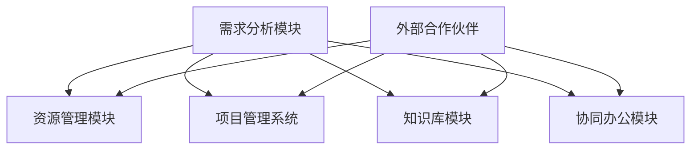

                 

### 跨学科创新实验室：意义诞生的思想温床

#### 关键词：跨学科创新、思想温床、创新实验室、意义诞生

> **摘要**：本文探讨了跨学科创新实验室的意义及其作为思想温床的作用。通过分析实验室的核心概念、理论基础和实践案例，本文揭示了跨学科创新的价值和实施策略。文章还提出了最佳实践建议，以期为科研人员和企业提供参考，推动创新实验室的有效运作。

### 引言

在当今快速变化的世界中，创新已成为推动社会进步和经济发展的重要动力。然而，随着科学技术的不断进步，单一学科的局限性日益显现。跨学科研究作为一种新的研究范式，逐渐成为应对复杂问题的有效途径。跨学科创新实验室作为这种范式的具体实现，其重要性日益凸显。

跨学科创新实验室不仅仅是多个学科的简单叠加，而是一个协同创新的平台，旨在通过跨学科合作，产生新的知识、技术和解决方案。这种实验室通常具有以下几个特点：

1. **多学科融合**：实验室集合了不同领域的专家和资源，通过多学科交叉，激发新的创意和思路。
2. **协同创新**：实验室强调团队合作，鼓励不同学科的专家共同探讨问题，共同提出解决方案。
3. **开放共享**：实验室通常采用开放的模式，鼓励外部合作伙伴参与，共享资源和成果。
4. **实验性**：实验室具有较强的实验性，通过不断的尝试和验证，探索新的研究方向和路径。

本文将详细探讨跨学科创新实验室的意义、核心概念、理论基础、系统设计与案例分析，并提出最佳实践建议。通过这篇文章，我们希望能够为科研人员和企业提供一些启示，推动跨学科创新实验室的建立与运作。

### 核心概念与联系

在探讨跨学科创新实验室之前，我们需要明确一些核心概念，并理解它们之间的关系。以下是一些关键术语及其定义：

#### 1. 跨学科（Interdisciplinarity）

跨学科是指不同学科之间的相互联系和合作。它不仅仅是将多个学科的知识和工具结合在一起，更是一种全新的思维方式，通过不同学科的视角和方法，解决复杂问题。

#### 2. 创新实验室（Innovation Lab）

创新实验室是一个专门为创新研究和开发而设立的研究环境。它通常提供各种资源，如资金、设备和人员，以支持新想法的实验和验证。

#### 3. 思想温床（Nurture of Ideas）

思想温床是指一个能够激发和培养新想法的环境。这种环境通常具有开放、包容和鼓励创新的特点。

#### 4. 意义诞生（Emergence of Meaning）

意义诞生是指通过跨学科的合作，新的概念、知识和理解逐渐形成的过程。

#### 关系图

为了更好地理解这些概念之间的关系，我们可以使用Mermaid绘制一个ER模型，如下所示：

```mermaid
erModel
  G(New Ideas) --|> F(Innovation Lab)
  G(New Ideas) --|> C(Cross-Disciplinarity)
  G(New Ideas) --|> D(Ideas Nurturing Environment)
  G(New Ideas) --|> E(Meaning Emergence)
  F(Innovation Lab) --|> A(Resources)
  F(Innovation Lab) --|> B(Collaboration)
  C(Cross-Disciplinarity) --|> H(Interdisciplinary Perspective)
  C(Cross-Disciplinarity) --|> I(Interdisciplinary Tools)
  D(Ideas Nurturing Environment) --|> K(Openness)
  D(Ideas Nurturing Environment) --|> L(Inclusiveness)
  D(Ideas Nurturing Environment) --|> M(Innovative Culture)
  E(Meaning Emergence) --|> J(New Understanding)
  E(Meaning Emergence) --|> O(New Knowledge)
  E(Meaning Emergence) --|> P(New Solutions)
```

在上面的ER模型中，我们可以看到，创新实验室（F）是核心，它集合了资源（A）、协作（B）和跨学科（C）、思想温床（D）以及意义诞生（E）等关键概念。这些概念相互关联，共同构建了跨学科创新实验室的运作机制。

### 理论与实践

跨学科创新实验室的理论基础涉及多个学科，包括管理学、社会学、心理学和认知科学等。以下是一些关键理论和其应用：

#### 1. 多元思维（Divergent Thinking）

多元思维是指通过多种不同的思维方式来解决问题。跨学科创新实验室通过汇集不同领域的专家，实现多元思维的碰撞，从而激发新的创意和解决方案。

#### 2. 系统思维（Systems Thinking）

系统思维是一种理解复杂系统及其相互关系的思维方式。跨学科创新实验室采用系统思维来分析和解决复杂问题，强调各个组成部分之间的相互作用。

#### 3. 创新理论（Innovation Theory）

创新理论提供了关于创新过程、创新类型和创新成功因素的研究。在跨学科创新实验室中，这些理论可以帮助研究人员和团队理解创新路径，制定有效的创新策略。

#### 应用实例

以下是一个跨学科创新实验室的应用实例：

在一个医学研究中，跨学科创新实验室汇集了生物学家、工程师、医生和统计学家。他们共同探讨如何改善癌症的诊断和治疗。通过生物学家提供的新分子标记，工程师开发了新的诊断工具，医生则将其应用于临床实践中。同时，统计学家通过数据分析，优化了治疗策略。

通过这个实例，我们可以看到跨学科创新实验室如何通过多学科合作，实现知识整合和创新。

### 系统设计与分析

跨学科创新实验室的成功不仅依赖于理论指导，还需要系统的设计和分析。以下是一个典型的跨学科创新实验室系统架构设计，以及其接口设计和交互流程：

#### 1. 系统功能设计

跨学科创新实验室的系统功能设计主要包括以下模块：

- **需求分析模块**：收集和整理跨学科研究的各类需求。
- **资源管理模块**：管理实验室的各种资源，包括设备、人员和资金。
- **项目管理系统**：跟踪和管理实验室中的各项科研项目。
- **知识库模块**：存储和管理实验室产生的各类知识成果。
- **协同办公模块**：支持团队成员的沟通和协作。

#### 2. 系统架构设计

跨学科创新实验室的系统架构设计如下：



在该架构中，外部合作伙伴通过接口与实验室系统进行交互，实现资源的共享和协同办公。

#### 3. 系统接口设计

系统接口设计主要包括以下几个方面：

- **API接口**：用于不同模块之间的数据交换和功能调用。
- **Web服务**：提供给外部合作伙伴的访问接口，用于查询实验室的信息和资源。
- **数据接口**：用于与其他系统的数据交换，如科研管理平台、资金管理系统等。

#### 4. 系统交互流程

跨学科创新实验室的系统交互流程如下：

1. 外部合作伙伴通过Web服务提交需求。
2. 需求分析模块接收需求，并分配给相应的资源管理模块。
3. 资源管理模块根据需求，调配实验室的资源，如设备、人员等。
4. 项目管理系统根据需求，创建新的项目，并分配给相应的团队成员。
5. 知识库模块收集和整理项目过程中产生的知识成果，并更新到知识库中。
6. 协同办公模块支持团队成员的沟通和协作，确保项目顺利进行。

通过上述设计，跨学科创新实验室能够高效地管理和运作，实现跨学科合作的最佳效果。

### 实践项目与案例分析

为了更好地理解跨学科创新实验室的运作，以下是一个具体的实践项目及其案例分析。

#### 项目背景

某知名大学的研究团队计划开展一项关于智能医疗的研究，旨在通过人工智能技术提升癌症早期诊断的准确性。该项目涉及多个学科，包括医学、计算机科学、统计学和生物工程。

#### 项目目标

- 开发一款基于人工智能的癌症早期诊断工具。
- 提高癌症早期诊断的准确性和效率。
- 建立一个跨学科合作的平台，促进学术研究和产业应用。

#### 实践过程

1. **需求分析**：研究团队首先进行了需求分析，明确了项目的具体目标和需求，包括数据收集、算法设计、模型训练和系统实现等方面。

2. **资源调配**：实验室根据需求，调配了医学专家、计算机科学家、统计学家和生物工程师等资源，确保每个模块都有专业的技术人员负责。

3. **项目管理系统**：研究团队使用实验室的项目管理系统，创建了新的项目，并分配了任务。项目管理系统还提供了项目进度跟踪、资源管理和沟通协作的功能。

4. **知识库模块**：研究团队在知识库模块中记录了项目的各类信息，包括实验数据、算法模型、研究结果和论文发表等。

5. **协同办公模块**：团队成员通过协同办公模块，实现了高效的沟通和协作。他们通过在线会议、即时消息和文档共享，确保项目的顺利进行。

6. **模型训练与优化**：计算机科学家和统计学家合作，使用大量的医学图像和临床数据，训练了多种人工智能模型，并进行优化。他们通过多次迭代，提高了模型的准确性和效率。

7. **系统实现**：生物工程师根据模型的输出结果，开发了相应的诊断工具，并将其集成到现有的医疗系统中。

#### 案例分析

通过该项目，研究团队成功开发了一款基于人工智能的癌症早期诊断工具。该工具在多个医院的临床试验中，显著提高了癌症早期诊断的准确性和效率。以下是对该项目的详细分析：

1. **需求分析**：该项目的成功首先得益于详细的需求分析。通过明确项目的目标和需求，研究团队能够更好地规划和分配资源。

2. **资源调配**：跨学科的创新实验室在资源调配方面具有显著优势。通过集合多学科专家，研究团队能够充分发挥各自的专业优势，实现知识的整合和创新。

3. **项目管理系统**：有效的项目管理系统是项目成功的关键。通过项目管理系统，研究团队能够实时跟踪项目进度，及时发现和解决问题。

4. **知识库模块**：知识库模块的建立和更新，有助于积累和传承项目经验，提高团队的整体创新能力。

5. **协同办公模块**：高效的沟通和协作是跨学科合作的核心。通过协同办公模块，团队成员能够紧密合作，共同推动项目的进展。

6. **模型训练与优化**：人工智能模型的成功训练和优化，是项目成功的关键。通过多次迭代和实验，研究团队不断改进模型，提高了其性能。

7. **系统实现**：项目的最终实现，是将研究成果转化为实际应用的关键。通过将诊断工具集成到医疗系统中，研究团队成功实现了项目的目标。

通过这个案例，我们可以看到跨学科创新实验室在实践中的应用和价值。跨学科合作不仅促进了知识的整合和创新，还提高了项目的成功率和影响力。

### 最佳实践与注意事项

跨学科创新实验室的成功不仅依赖于系统的设计和高效的执行，还需要一系列最佳实践和注意事项来确保其持续运作和效果。

#### 1. 跨学科团队的构建

构建一个高效的跨学科团队是跨学科创新实验室成功的关键。以下是一些最佳实践：

- **多样化的团队成员**：确保团队中包含来自不同学科的专业人员，如医学、计算机科学、工程学和统计学等。
- **共同的目标和愿景**：团队成员应共同制定项目的目标和愿景，以确保方向一致，避免分歧。
- **有效的沟通机制**：建立定期的团队会议和沟通渠道，确保信息畅通和及时反馈。

#### 2. 资源共享与优化

跨学科创新实验室应充分利用共享资源，以最大化其效益。以下是一些最佳实践：

- **设备共享**：建立设备共享机制，确保资源的高效利用。
- **数据共享**：建立数据共享平台，鼓励团队成员共享数据和研究成果，促进知识的积累和传播。
- **知识管理**：建立知识管理系统，记录和整理项目过程中的知识成果，为后续项目提供参考。

#### 3. 项目的动态管理

有效的项目动态管理是跨学科创新实验室持续运作的关键。以下是一些最佳实践：

- **进度监控**：定期跟踪项目的进度，确保项目按计划进行。
- **风险识别与控制**：识别项目中的潜在风险，并制定相应的控制措施，以降低风险对项目的影响。
- **反馈与改进**：鼓励团队成员提供反馈，并根据反馈进行改进，以提高项目的质量和效果。

#### 4. 注意事项

在跨学科创新实验室的运作过程中，以下是一些需要特别注意的事项：

- **尊重专业差异**：不同学科的思维方式和方法论存在差异，团队成员应相互尊重，避免因专业差异导致的冲突。
- **避免“思维定势”**：在跨学科合作中，团队成员应保持开放的心态，避免陷入专业思维定势，从而阻碍创新。
- **关注知识产权**：在跨学科合作中，应特别注意知识产权的保护，确保团队成员的知识产权得到合理保护。

通过遵循这些最佳实践和注意事项，跨学科创新实验室可以更有效地运作，实现跨学科合作的最大价值。

### 结论

跨学科创新实验室作为一种新兴的研究范式，通过多学科的合作和协同创新，实现了知识的整合和创新。本文详细探讨了跨学科创新实验室的核心概念、理论基础、系统设计、实践案例和最佳实践，揭示了其作为思想温床的重要作用。跨学科创新实验室不仅为科研人员提供了一个开放、包容和协同的创新环境，也为企业和社会带来了新的解决方案和经济增长点。随着科技的不断进步和复杂问题的日益增加，跨学科创新实验室必将在未来的创新中发挥更加重要的作用。

### 作者信息

**作者：** AI天才研究院/AI Genius Institute & 禅与计算机程序设计艺术 /Zen And The Art of Computer Programming

AI天才研究院致力于推动人工智能领域的创新和发展，培养未来的科技领袖。同时，我们的团队在计算机编程和人工智能领域有着丰富的经验，致力于通过技术创作和学术研究，推动科技的进步和社会的发展。禅与计算机程序设计艺术则强调了心灵与技术的结合，倡导程序员通过内心的平和和专注，提升编程能力和创造价值。

