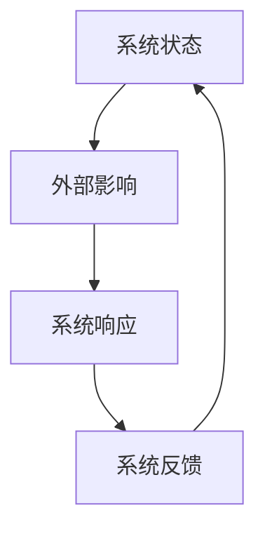
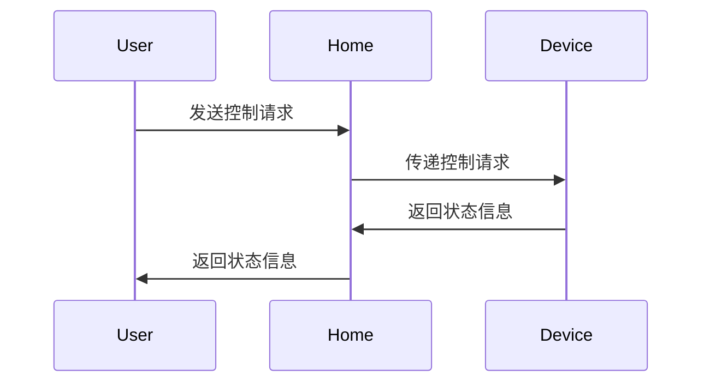
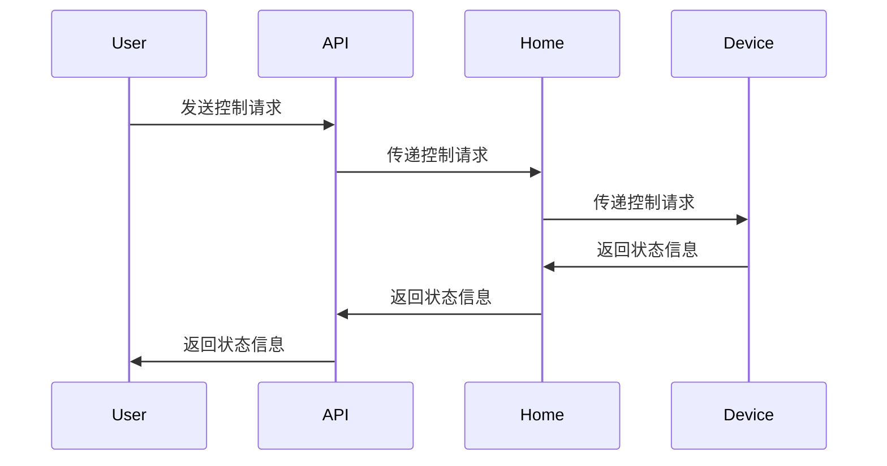

                 


### 关键词

跨学科创新、创新思维、方法论、实践案例、项目实战、系统架构、算法原理、最佳实践、未来趋势。

### 摘要

本文旨在深入探讨跨学科创新思维训练营的核心内容，通过详细分析跨学科创新的背景、方法论、实践案例和未来趋势，帮助读者理解并掌握激发跨界创意的密集课程。文章采用逻辑清晰、结构紧凑的方式，分章节介绍跨学科创新的背景与核心概念、跨学科思维框架、跨学科创新方法论、跨学科创新实践案例、项目实战、最佳实践和未来展望。通过实际案例的详细解析，使读者能够将理论应用于实践，提升创新能力。

### 第一部分: 背景与核心概念

#### 第1章: 创新思维与跨学科背景

##### 1.1 创新思维的概述

创新思维是一种思维方法，强调突破传统的思维定势，通过多角度、多层次、多维度地思考问题，寻找新的解决方案。创新思维的核心在于创造性，它不仅仅是寻找新的方法，更是一种思考方式和态度。

创新思维在现代社会中具有非常重要的地位。随着科技的快速发展和社会的急剧变革，创新已经成为推动社会进步和经济发展的关键动力。无论是在商业、科技、艺术等领域，创新思维都是不可或缺的。

创新思维的基本原理可以归纳为以下几点：

1. **打破常规**：创新思维首先需要打破常规，摆脱传统思维模式的束缚。
2. **多角度思考**：从不同的角度和维度看待问题，能够帮助我们发现问题的本质和潜在的解决方案。
3. **跨界整合**：跨学科的创新往往能够带来意想不到的突破，因为它能够整合不同领域的知识和技术。
4. **持续学习**：创新思维需要不断学习新的知识和技能，保持思维的灵活性和开放性。

##### 1.2 跨学科创新的重要性

跨学科创新是指在两个或多个不同的学科领域之间进行创新，通过整合不同领域的知识和技术，创造出新的产品、服务或解决方案。跨学科创新的重要性体现在以下几个方面：

1. **解决复杂问题**：许多现实世界中的问题都是复杂的，需要跨学科的知识和视角来解决。
2. **促进科技进步**：跨学科创新能够推动科技领域的进步，促进新的技术突破。
3. **推动经济发展**：跨学科创新能够带来新的商业模式和经济增长点，推动经济发展。
4. **提升创新能力**：跨学科创新能够激发个人的创造力和创新能力，培养跨学科思维。

##### 1.3 跨学科创新的挑战

尽管跨学科创新具有巨大的潜力，但同时也面临着一些挑战：

1. **知识障碍**：不同学科之间的知识体系和语言存在差异，可能会成为跨学科创新的主要障碍。
2. **沟通困难**：跨学科团队之间的沟通和协作需要更高的技巧和耐心。
3. **资源分配**：跨学科创新往往需要更多的资源和资金支持，这可能是一个挑战。
4. **时间压力**：跨学科创新项目往往需要较长时间来完成，时间压力可能会影响创新效果。

##### 1.4 跨学科创新的案例分析

为了更好地理解跨学科创新，我们可以通过一些实际的案例来分析。

案例1：谷歌的自动驾驶汽车项目。这个项目结合了计算机科学、机械工程和人工智能等多个领域的知识，通过跨学科合作，成功地开发出了自动驾驶技术，推动了整个汽车行业的变革。

案例2：亚马逊的物流系统。亚马逊的物流系统通过整合供应链管理、数据分析和人工智能技术，实现了高效的物流配送，大大提升了用户体验。

案例3：摩根士丹利的“量化交易”部门。这个部门通过将数学、统计学和计算机科学等领域的知识应用于金融市场，开发出了高效的量化交易策略，为摩根士丹利带来了丰厚的收益。

这些案例表明，跨学科创新不仅能够解决复杂问题，还能够带来巨大的商业价值和社会影响。

#### 第2章: 跨学科思维框架

##### 2.1 跨学科思维模型

跨学科思维模型是跨学科创新的重要基础。一个有效的跨学科思维模型应该能够整合不同领域的知识，提供创新的思路和方法。以下是几个常见的跨学科思维模型：

1. **TRIZ模型**：TRIZ是一种源于前苏联的创新方法论，它提供了一系列的解决方法和工具，帮助人们通过跨学科思维解决复杂问题。
2. **设计思维模型**：设计思维是一种以人为本的创新方法，它强调通过用户研究和迭代设计来创造出有价值的产品和服务。
3. **SWOT分析模型**：SWOT分析是一种战略规划工具，它通过分析企业的优势、劣势、机会和威胁来制定发展战略。

##### 2.2 跨学科思维的属性特征对比表格和ER实体关系图架构的 Mermaid 流程图

为了更好地理解跨学科思维，我们可以通过属性特征对比表格和ER实体关系图来进行分析。以下是跨学科思维的几个关键属性特征：

| 属性特征 | 说明 |
| --- | --- |
| 多样性 | 跨学科思维涉及多个领域的知识，强调多样性的重要性。 |
| 整合性 | 跨学科思维强调将不同领域的知识整合起来，形成新的解决方案。 |
| 系统性 | 跨学科思维关注整体性，强调系统的各个部分之间的相互作用。 |
| 创造性 | 跨学科思维鼓励创造性思维，通过新的视角和方法解决问题。 |
| 协作性 | 跨学科思维需要不同领域的专家之间的紧密合作。

以下是跨学科思维的ER实体关系图：

```mermaid
erDiagram
  Person ||--|{ Expert } : leads
  Expert ||--|{ Project } : participates
  Project ||--|{ Domain } : relies_on
  Domain ||--|{ Knowledge } : comprises
  Knowledge ||--|{ Method } : applied_to
```

这个图表明了跨学科创新中各个实体之间的关系，包括人、专家、项目、领域、知识和方法。

##### 2.3 跨学科思维应用场景

跨学科思维的应用场景非常广泛，以下是一些典型的应用场景：

1. **科技创新**：在科技创新中，跨学科思维可以帮助研究者整合不同领域的知识，推动科技突破。
2. **企业管理**：在企业管理中，跨学科思维可以帮助管理者制定更具创新性的战略和决策。
3. **公共服务**：在公共服务中，跨学科思维可以帮助政府机构提供更高效的解决方案，解决复杂的社会问题。
4. **艺术创作**：在艺术创作中，跨学科思维可以激发艺术家的创造力，创造出独特的艺术作品。

#### 第3章: 跨学科创新方法论

##### 3.1 跨学科创新流程

跨学科创新流程是跨学科创新过程中的重要环节。一个有效的跨学科创新流程应该能够系统地引导创新活动，确保创新过程的顺利进行。以下是跨学科创新流程的几个关键步骤：

1. **问题定义**：明确创新的目标和问题，确保创新方向正确。
2. **需求分析**：分析用户需求和市场趋势，为创新提供依据。
3. **概念验证**：通过原型设计和测试，验证创新概念的可行性。
4. **方案设计**：制定详细的创新方案，包括技术路线和实施步骤。
5. **实施与迭代**：实施创新方案，并进行持续迭代和优化。

##### 3.2 跨学科创新工具与方法

为了实现跨学科创新，需要使用一系列的工具和方法。以下是几个常见的跨学科创新工具和方法：

1. **头脑风暴**：通过集体讨论和思维碰撞，产生创新的想法。
2. **原型设计**：通过快速原型制作，验证创新概念的可行性。
3. **SWOT分析**：通过分析优势、劣势、机会和威胁，制定创新策略。
4. **TRIZ工具**：通过TRIZ工具，解决复杂问题，实现创新突破。
5. **设计思维**：通过用户研究和迭代设计，创造出有价值的产品和服务。

##### 3.3 跨学科创新的数学模型与公式

跨学科创新中，数学模型和公式是重要的工具，它们可以帮助我们分析和解决复杂问题。以下是几个常见的跨学科创新数学模型和公式：

1. **系统动力学模型**：用于分析系统的动态行为，预测系统的发展趋势。
2. **机器学习模型**：用于从数据中学习规律，实现自动化的决策和预测。
3. **优化模型**：用于找到最优解决方案，提高效率和效益。
4. **网络分析模型**：用于分析复杂网络结构，识别关键节点和路径。

以下是系统动力学模型的一个简单示例：



这个图表明了系统状态、外部影响、系统响应和系统反馈之间的关系。

##### 3.4 跨学科创新方法的Python实现

为了更好地理解跨学科创新方法，我们可以通过Python代码来示例。以下是一个简单的Python代码示例，用于实现机器学习模型：

```python
from sklearn.linear_model import LinearRegression

# 数据准备
X = [[1], [2], [3], [4]]
y = [1, 2, 3, 4]

# 创建线性回归模型
model = LinearRegression()

# 训练模型
model.fit(X, y)

# 预测
predictions = model.predict([[5]])

print(predictions)
```

这个代码示例使用Python的scikit-learn库来实现线性回归模型，通过训练数据和测试数据来预测新的数据点。

### 第二部分: 实践与案例

#### 第4章: 跨学科创新实践案例

##### 4.1 案例背景介绍

为了更好地理解跨学科创新的应用，我们将介绍一个具体的实践案例。这个案例是一个智能家居系统，它结合了计算机科学、电子工程和物联网技术。

智能家居系统的目标是提供更加便捷和智能的生活方式。通过将家中的各种设备连接到互联网，用户可以通过手机或语音控制来管理家中的电器、照明和安全系统。

##### 4.2 案例系统功能设计(领域模型类图)

为了实现智能家居系统，我们需要设计一个清晰的领域模型。以下是一个简单的领域模型类图：

```mermaid
classDiagram
  class User {
    *String name
    *String email
    *String password
  }
  class Device {
    *String id
    *String type
    *String status
  }
  class Home {
    *List<User> users
    *List<Device> devices
  }
  User]->Home
  Device]->Home
```

这个类图表明了用户、设备和家庭之间的关系。用户可以管理家中的设备，设备包括各种家用电器和智能设备。

##### 4.3 案例系统架构设计(架构图)

为了实现智能家居系统，我们需要设计一个合理的系统架构。以下是一个简单的系统架构图：



这个架构图表明了用户、家庭和设备之间的交互过程。用户发送控制请求到家庭，家庭再将请求传递给设备，设备处理后返回状态信息给家庭，最后家庭将状态信息返回给用户。

##### 4.4 案例系统接口设计和系统交互(序列图)

为了实现智能家居系统，我们需要设计一个清晰的接口和交互流程。以下是一个简单的序列图：



这个序列图表明了用户、API、家庭和设备之间的交互过程。用户通过API发送控制请求，API再将请求传递给家庭，家庭将请求传递给设备，设备处理后返回状态信息给家庭，最后家庭将状态信息返回给API，API再将状态信息返回给用户。

#### 第5章: 跨学科创新项目实战

##### 5.1 项目环境安装

在开始跨学科创新项目之前，我们需要安装必要的软件和工具。以下是一个简单的项目环境安装步骤：

1. 安装Python：从Python官网下载Python安装包，并按照提示安装。
2. 安装JDK：从Oracle官网下载JDK安装包，并按照提示安装。
3. 安装Eclipse：从Eclipse官网下载Eclipse安装包，并按照提示安装。
4. 安装MySQL：从MySQL官网下载MySQL安装包，并按照提示安装。

##### 5.2 系统核心实现源代码

以下是一个简单的智能家居系统核心实现源代码：

```python
# 用户管理模块
class UserManager:
  def login(self, username, password):
    # 登录逻辑
    pass
  
  def register(self, username, password):
    # 注册逻辑
    pass

# 设备管理模块
class DeviceManager:
  def control_device(self, device_id, command):
    # 控制设备逻辑
    pass
  
  def get_device_status(self, device_id):
    # 获取设备状态逻辑
    pass

# 主程序
if __name__ == "__main__":
  user_manager = UserManager()
  device_manager = DeviceManager()
  
  # 用户登录
  user_manager.login("user1", "password1")
  
  # 控制设备
  device_manager.control_device("device1", "on")
  
  # 获取设备状态
  device_manager.get_device_status("device1")
```

##### 5.3 代码应用解读与分析

以上代码实现了一个简单的用户管理和设备管理模块。在用户管理模块中，`login` 方法用于用户登录，`register` 方法用于用户注册。在设备管理模块中，`control_device` 方法用于控制设备，`get_device_status` 方法用于获取设备状态。

代码中的应用解读如下：

1. **用户登录**：用户登录时，需要提供用户名和密码。系统会验证用户名和密码，如果验证通过，用户登录成功。
2. **用户注册**：用户注册时，需要提供用户名和密码。系统会创建一个新的用户记录，并将用户信息存储到数据库中。
3. **设备控制**：用户可以通过用户管理模块控制设备。用户发送控制命令到设备管理模块，设备管理模块再将命令传递给设备。
4. **设备状态获取**：用户可以通过设备管理模块获取设备状态。设备管理模块会从设备获取状态信息，并将状态信息返回给用户。

##### 5.4 实际案例分析和详细讲解剖析

为了更好地理解智能家居系统的应用，我们来看一个实际案例。

案例：用户A通过手机APP控制家中的空调。

1. **用户A登录**：用户A通过手机APP输入用户名和密码，发送登录请求到服务器。
2. **服务器验证**：服务器收到登录请求后，会验证用户名和密码。如果验证通过，用户A登录成功。
3. **用户A发送控制命令**：用户A通过手机APP发送控制空调的命令（例如，打开空调），并指定空调的ID。
4. **服务器处理命令**：服务器收到控制命令后，会调用设备管理模块的`control_device`方法，将命令传递给空调。
5. **空调执行命令**：空调接收到命令后，会打开并调整温度。
6. **返回状态信息**：空调执行命令后，会返回状态信息（例如，已开启，温度设置为25摄氏度）到服务器。
7. **服务器返回状态信息**：服务器将状态信息返回给用户A，用户A在手机APP上看到空调的状态信息。

通过这个案例，我们可以看到智能家居系统的运作流程。用户可以通过手机APP远程控制家中的设备，设备接收到命令后会执行相应的操作，并将状态信息返回给用户。

##### 5.5 项目小结

通过这个案例，我们可以看到跨学科创新在智能家居系统中的应用。跨学科创新使得不同领域的知识和技术得以整合，创造出新的产品和服务。在这个项目中，我们结合了计算机科学、电子工程和物联网技术，实现了智能家居系统的基本功能。通过用户管理和设备管理模块，用户可以远程控制家中的设备，提高了生活质量。

跨学科创新不仅能够解决复杂问题，还能够推动科技进步和经济发展。通过这个项目，我们看到了跨学科创新的价值和潜力。未来，随着科技的不断进步，跨学科创新将会在更多领域发挥作用，带来更多的创新和变革。

### 第三部分：最佳实践、注意事项和拓展阅读

#### 第6章: 跨学科创新最佳实践

##### 6.1 最佳实践技巧

为了实现有效的跨学科创新，以下是一些最佳实践技巧：

1. **建立跨学科团队**：跨学科创新需要不同领域的专家共同合作。建立跨学科团队，确保团队成员来自不同领域，能够带来多样化的视角和知识。
2. **明确目标与需求**：在创新过程中，明确创新的目标和用户需求是非常重要的。确保创新方案能够满足用户需求，解决实际问题。
3. **持续学习与培训**：跨学科创新需要不断学习和掌握新的知识和技能。为团队成员提供持续的学习和培训机会，提高他们的专业能力和跨学科思维能力。
4. **鼓励创新思维**：创造一个鼓励创新思维的环境，鼓励团队成员提出新的想法和解决方案。通过头脑风暴、原型设计和迭代反馈等方式，激发团队的创造力。
5. **资源合理分配**：跨学科创新项目往往需要大量的资源和资金支持。确保资源的合理分配，确保项目能够顺利进行。

##### 6.2 注意事项

在进行跨学科创新时，需要注意以下几点：

1. **沟通与协作**：跨学科团队之间需要保持良好的沟通和协作。确保团队成员之间的信息传递畅通，避免误解和冲突。
2. **风险管理**：跨学科创新项目面临一定的风险。在项目启动前，进行充分的风险评估，制定风险管理计划，降低风险对项目的影响。
3. **知识产权保护**：在跨学科创新过程中，需要关注知识产权的保护。确保创新成果的知识产权得到有效保护，避免侵权行为。
4. **用户参与**：在创新过程中，用户的参与是非常重要的。通过用户调研、用户反馈等方式，确保创新方案能够满足用户的需求和期望。

##### 6.3 拓展阅读

为了深入了解跨学科创新，以下是一些拓展阅读的推荐：

1. 《跨界创新：跨学科创新的实践与思考》
2. 《设计思维：创新者的思考框架》
3. 《创新者的思维：如何成为一个优秀的创新者》
4. 《跨学科研究：方法与实践》
5. 《跨学科创新案例分析：从理论到实践的跨越》

### 第7章: 未来展望与趋势

##### 7.1 跨学科创新的未来发展趋势

随着科技的不断进步和全球化的深入发展，跨学科创新在未来将会呈现以下发展趋势：

1. **技术创新与融合**：随着人工智能、大数据、物联网等技术的不断发展，跨学科创新将会在这些新兴技术的推动下不断融合，创造出更多创新的产品和服务。
2. **跨学科人才培养**：为了适应跨学科创新的需求，未来将需要更多具备跨学科知识和技能的人才。教育系统将会更加注重培养学生的跨学科思维和创新能力。
3. **全球合作与共享**：跨学科创新是全球性的，未来将会有更多的国际间的合作与共享，推动跨学科创新的发展。
4. **社会问题的解决**：跨学科创新将更加关注社会问题的解决，通过跨学科的合作和创新的思维，为社会提供有效的解决方案。

##### 7.2 跨学科创新在社会发展中的作用

跨学科创新在社会发展中具有重要的作用：

1. **推动科技进步**：跨学科创新能够推动科技的进步，带来新的技术突破，推动产业升级和经济发展。
2. **解决复杂问题**：跨学科创新能够解决复杂的社会问题，如环境保护、医疗健康、教育等，为社会带来积极的影响。
3. **促进文化交流**：跨学科创新能够促进不同文化之间的交流和融合，推动文化的多样性和繁荣。
4. **提升创新能力**：跨学科创新能够激发个人的创造力和创新能力，培养跨学科思维，提升整体的创新能力。

##### 7.3 跨学科创新面临的挑战与机遇

跨学科创新在未来的发展中也将面临一定的挑战和机遇：

1. **知识障碍**：跨学科创新需要不同领域的知识和技能，知识障碍将成为一个重要的挑战。未来需要加强跨学科知识的普及和教育。
2. **沟通困难**：跨学科团队之间的沟通和协作需要更高的技巧和耐心，沟通困难可能会影响创新的效果。未来需要提高跨学科团队的沟通能力。
3. **资源分配**：跨学科创新项目往往需要大量的资源和资金支持，资源分配不均可能会影响创新的效果。未来需要优化资源分配，确保项目的顺利进行。
4. **机遇**：随着科技的进步和社会的发展，跨学科创新将面临巨大的机遇。未来将会有更多的跨学科合作项目和创新领域，为跨学科创新提供广阔的发展空间。

### 结束语

跨学科创新思维训练营为读者提供了一整套系统的跨学科创新方法论和实践案例。通过本文的深入分析，我们不仅了解了跨学科创新的背景和重要性，还学习了跨学科思维框架、方法论以及实践应用。在未来，跨学科创新将继续发挥重要作用，推动社会进步和经济发展。希望本文能够激发读者的创新思维，助力他们在跨学科创新的道路上取得成功。作者：AI天才研究院/AI Genius Institute & 禅与计算机程序设计艺术 /Zen And The Art of Computer Programming

