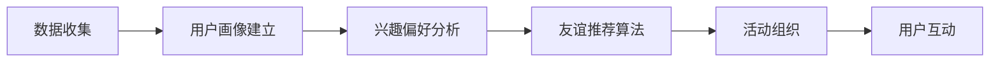
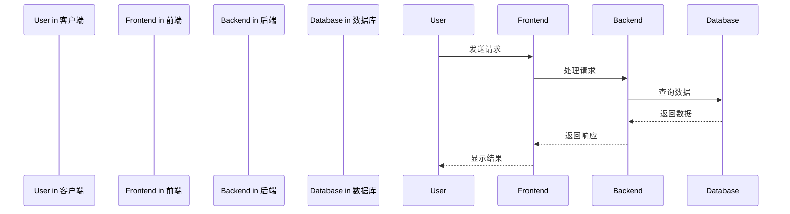
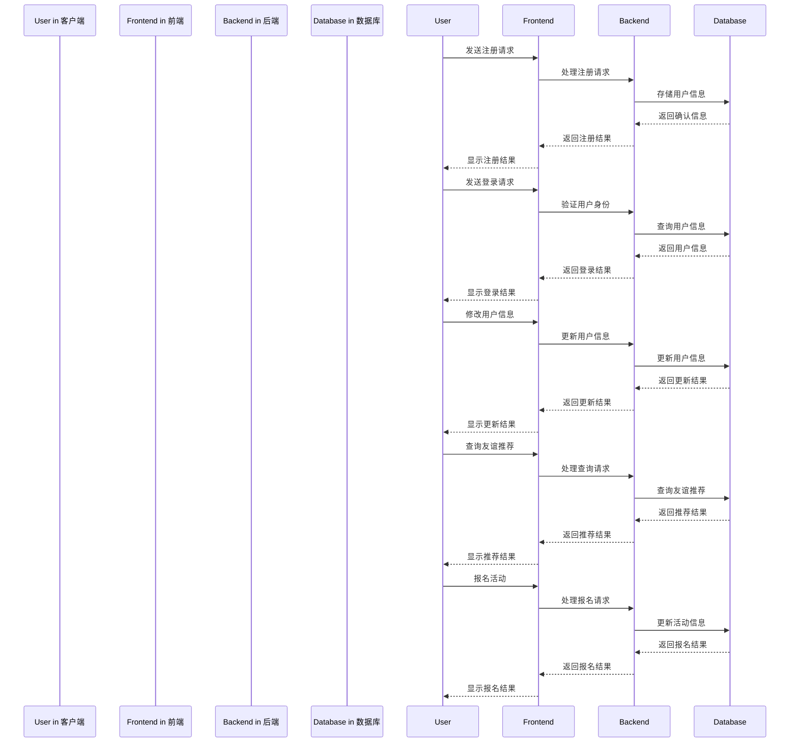

                 

# 跨年龄友谊匹配服务：促进代际交流的平台

## 关键词
- 跨年龄友谊
- 代际交流
- 机器学习
- 数据挖掘
- 人机交互

## 摘要
本文旨在探讨如何构建一个跨年龄友谊匹配服务，以促进不同年龄层之间的交流和理解。通过分析跨年龄友谊的现状与挑战，本文提出了基于机器学习和社交网络分析的方法，详细阐述了算法原理、系统架构设计和项目实战，旨在为跨年龄友谊匹配服务的设计和实现提供有价值的参考。

## 目录

### 第一部分：背景介绍与问题分析

#### 第1章：问题背景与核心概念
- 跨年龄友谊的现状与挑战
- 代际交流的重要性
- 跨年龄友谊匹配服务的定义、目的与价值
- 服务范围界定、服务对象分析
- 概念结构与核心要素组成

#### 第2章：核心概念与联系
- 社交网络分析、数据挖掘、机器学习、人机交互
- 概念属性特征对比表格
- ER实体关系图架构

### 第二部分：算法原理讲解

#### 第3章：算法原理详解
- 算法流程图
- Python源代码实现
- 数学模型与公式
- 举例说明

### 第三部分：系统分析与架构设计

#### 第4章：系统功能设计
- 问题场景介绍
- 系统功能设计（领域模型Mermaid类图）

#### 第5章：系统架构设计
- 项目介绍
- 系统架构设计（Mermaid架构图）
- 系统接口设计
- 系统交互（Mermaid序列图）

### 第四部分：项目实战

#### 第6章：环境安装与系统核心实现
- 环境安装
- 系统核心实现（关键模块代码解读）

#### 第7章：代码应用解读与分析
- 实际案例分析与讲解
- 剖析与总结

### 第五部分：最佳实践与总结

#### 第8章：最佳实践与注意事项
- 最佳实践
- 注意事项

#### 第9章：小结与拓展阅读
- 小结
- 拓展阅读

### 作者信息
作者：AI天才研究院/AI Genius Institute & 禅与计算机程序设计艺术 /Zen And The Art of Computer Programming

----------------------------------------------------------------

## 第一部分：背景介绍与问题分析

### 第1章：问题背景与核心概念

#### 1.1 跨年龄友谊的现状与挑战

在当今社会，跨年龄友谊正变得越来越重要。然而，尽管人们对建立跨年龄友谊的需求日益增长，但实际操作中却面临诸多挑战。首先，不同年龄层之间的文化、价值观和生活经验差异较大，使得建立友谊变得更加复杂。其次，传统社交方式往往局限于同年龄段人群，缺乏有效的跨年龄互动渠道。此外，现代生活节奏加快，人们的时间和经济成本也成为了限制跨年龄友谊发展的重要因素。

#### 1.2 代际交流的重要性

跨年龄友谊不仅仅是个人层面上的需求，更是社会层面上的需求。首先，跨年龄友谊能够促进不同年龄层之间的理解和尊重，有助于消除代沟和偏见。其次，跨年龄友谊有助于知识的传承和交流，年轻一代可以从年长一代的经验中学习，而年长一代则可以从年轻一代的创新思维中受益。最后，跨年龄友谊有助于提高社会的整体和谐度，促进社会的稳定和发展。

#### 1.3 跨年龄友谊匹配服务的定义、目的与价值

为了解决上述问题，本文提出了跨年龄友谊匹配服务。该服务通过利用大数据和人工智能技术，为不同年龄层的人提供友谊匹配服务。具体来说，跨年龄友谊匹配服务包括以下几个核心功能：

1. **用户画像建立**：通过收集用户的个人信息、兴趣偏好、生活习惯等数据，建立详细的用户画像。
2. **友谊推荐算法**：利用社交网络分析和机器学习算法，为用户提供合适的友谊匹配建议。
3. **互动平台**：构建一个线上互动平台，方便用户进行交流和互动。
4. **活动组织**：组织各种线下活动，促进用户之间的交流和互动。

跨年龄友谊匹配服务的目的是促进不同年龄层之间的交流和理解，构建一个和谐、包容的社会环境。其价值体现在以下几个方面：

1. **提高社交效率**：通过智能匹配，帮助用户更快地找到志同道合的朋友。
2. **降低社交成本**：通过线上互动平台和线下活动，降低用户的社交时间和经济成本。
3. **促进代际交流**：通过跨年龄友谊，促进不同年龄层之间的知识和经验交流。
4. **增强社会和谐**：通过减少代沟和偏见，增强社会的整体和谐度。

#### 1.4 服务范围界定、服务对象分析

跨年龄友谊匹配服务的范围涵盖各个年龄段，包括儿童、青少年、成年人、老年人等。具体来说，服务对象可以划分为以下几个类别：

1. **学生**：包括小学生、初中生、高中生、大学生等。
2. **职场人士**：包括各类职业，如白领、工程师、教师、医生等。
3. **老年人**：包括退休人员、老年志愿者等。

不同年龄层的服务需求有所不同，因此在服务设计和实施过程中需要充分考虑这些差异。例如，对于学生群体，可以侧重于学术交流和兴趣培养；对于职场人士，可以侧重于职业发展和经验分享；对于老年人，可以侧重于健康和生活经验的交流。

#### 1.5 概念结构与核心要素组成

跨年龄友谊匹配服务是一个复杂的系统，其核心要素包括：

1. **用户数据**：包括用户的基本信息、兴趣偏好、社交行为等。
2. **算法模型**：用于用户画像建立、友谊推荐、活动组织等。
3. **互动平台**：用于用户之间的交流和互动。
4. **活动管理**：用于组织和管理各种线下活动。

这些核心要素相互关联，共同构成了跨年龄友谊匹配服务的整体架构。以下是这些核心要素的详细描述：

1. **用户数据**：用户数据是跨年龄友谊匹配服务的基础。通过收集用户的基本信息、兴趣偏好、社交行为等数据，可以建立详细的用户画像。这些数据不仅用于用户匹配，还可以用于个性化推荐和活动组织。
   
2. **算法模型**：算法模型是跨年龄友谊匹配服务的核心。通过社交网络分析和机器学习算法，可以实现对用户的精准匹配和推荐。算法模型的性能直接影响到服务的效果和质量。

3. **互动平台**：互动平台是用户进行交流和互动的场所。通过构建一个高效、便捷的互动平台，可以提升用户的体验和满意度。互动平台的设计和功能需要充分考虑用户的需求和使用习惯。

4. **活动管理**：活动管理是跨年龄友谊匹配服务的重要组成部分。通过组织和管理各种线下活动，可以促进用户之间的交流和互动。活动管理需要充分考虑用户的时间、兴趣和参与度。

综上所述，跨年龄友谊匹配服务是一个涉及多个领域的综合性项目，其成功实施需要充分考虑到用户需求、技术实现、平台设计和活动组织等多个方面。

### 第2章：核心概念与联系

#### 2.1 核心概念原理

跨年龄友谊匹配服务的实现依赖于多个核心概念和技术原理，主要包括：

1. **社交网络分析**：社交网络分析是一种研究社交网络结构、行为和属性的方法。通过分析用户之间的社交关系，可以挖掘出潜在的朋友关系和交流需求。社交网络分析的核心指标包括度、介数、聚类系数等，这些指标可以帮助我们理解用户在网络中的位置和影响力。

2. **数据挖掘**：数据挖掘是一种从大量数据中提取有用信息和知识的方法。在跨年龄友谊匹配服务中，数据挖掘技术可以用于用户画像建立、兴趣偏好分析、行为模式识别等。常见的数据挖掘方法包括关联规则挖掘、分类、聚类、异常检测等。

3. **机器学习**：机器学习是一种通过数据和算法来学习和预测的方法。在跨年龄友谊匹配服务中，机器学习算法可以用于用户匹配、推荐系统、行为预测等。常见的机器学习算法包括线性回归、决策树、支持向量机、神经网络等。

4. **人机交互**：人机交互是一种研究如何使计算机和人类更加自然、高效地进行互动的方法。在跨年龄友谊匹配服务中，人机交互技术可以用于设计用户界面、优化用户体验、实现个性化推荐等。

#### 2.2 概念属性特征对比表格

为了更好地理解这些核心概念，我们可以在Markdown格式中使用Mermaid来创建一个概念属性特征对比表格。以下是一个简单的示例：

```mermaid
tablewidth: 100%
title Concept Attributes Comparison Table

| Concept       | Attribute          | Description                                                  |
|---------------|--------------------|------------------------------------------------------------|
| Social Network Analysis | Node               | Represents a user or entity in the network                   |
|                | Edge               | Represents a connection or relationship between nodes       |
| Data Mining   | Feature Extraction | Extracting meaningful information from raw data              |
|                | Pattern Discovery  | Identifying meaningful patterns in the data                  |
| Machine Learning | Model               | A representation of the learned patterns and their relationships |
|                | Prediction         | Making predictions based on the learned patterns             |
| Human-Computer Interaction | Interface       | The point of interaction between the user and the system   |
|                | Experience         | The user's perception and satisfaction with the interaction  |
```

#### 2.3 ER实体关系图架构

在跨年龄友谊匹配服务中，实体关系图（ER图）是描述系统数据结构和实体之间关系的一种图形化方法。以下是一个使用Mermaid绘制的简单ER图示例：

```mermaid
erDiagram
    User ||--|{ Friendship }|-- Friend
    User ||--|{ Activity }|-- Participation
    Activity ||--|{ Event }|-- Organization
    Friendship ||--|{ Recommendation }|-- Match
```

这个ER图展示了用户（User）与友谊（Friendship）、活动（Activity）、事件（Event）和推荐（Recommendation）等实体之间的关系。例如，用户可以发起或参与友谊关系，友谊关系又可以产生推荐，推荐又可以匹配新的友谊。

### 第3章：算法原理详解

#### 3.1 算法流程图

在跨年龄友谊匹配服务中，算法的设计至关重要。以下是一个简化的算法流程图，展示了从数据收集、用户画像建立、友谊推荐到活动组织的整个过程。



#### 3.2 Python源代码实现

为了更好地理解算法原理，我们可以使用Python来展示一个简化的用户画像建立和友谊推荐算法的实现。以下是一个示例代码：

```python
import pandas as pd
from sklearn.cluster import KMeans
from sklearn.preprocessing import StandardScaler

# 假设我们已经有了一个用户数据集user_data，包括年龄、收入、兴趣爱好等特征
user_data = pd.DataFrame({
    'age': [25, 32, 40, 50],
    'income': [50000, 80000, 120000, 150000],
    'interests': ['reading', 'traveling', 'movies', 'gaming']
})

# 数据标准化
scaler = StandardScaler()
user_data_scaled = scaler.fit_transform(user_data)

# 使用K-means算法进行用户聚类
kmeans = KMeans(n_clusters=3, random_state=0).fit(user_data_scaled)

# 获取用户标签
user_labels = kmeans.labels_

# 将用户标签添加到原始数据集中
user_data['cluster'] = user_labels

# 根据用户标签进行友谊推荐
def recommend_friends(user_interests, user_cluster):
    # 假设我们已经有一个基于兴趣的友谊推荐系统
    friends = pd.DataFrame({
        'cluster': [0, 1, 2],
        'interests': [['reading', 'traveling'], ['movies'], ['gaming', 'sports']]
    })
    
    recommended_friends = friends[friends['cluster'] == user_cluster]
    return recommended_friends

# 对每个用户进行友谊推荐
user_recommendations = user_data.apply(lambda row: recommend_friends(row['interests'], row['cluster']), axis=1)

# 输出用户推荐结果
print(user_recommendations)
```

#### 3.3 数学模型与公式

在友谊推荐算法中，我们通常使用相似度度量来评估用户之间的相似程度。一个常见的相似度度量方法是余弦相似度，其公式如下：

$$
\cos\theta = \frac{A \cdot B}{\|A\| \cdot \|B\|}
$$

其中，$A$和$B$是两个向量，$\theta$是它们之间的夹角。

在用户画像建立和友谊推荐过程中，我们还可以使用聚类算法来对用户进行分组。一个常用的聚类算法是K-means，其目标是最小化各个簇内的平方误差：

$$
J = \sum_{i=1}^{k} \sum_{x_j \in S_i} (x_j - \mu_i)^2
$$

其中，$k$是簇的数量，$S_i$是第$i$个簇，$\mu_i$是第$i$个簇的均值。

#### 3.4 举例说明

为了更好地理解算法原理，我们可以通过一个具体的案例来说明。

假设我们有四个用户，他们的基本信息和兴趣爱好如下：

| 用户ID | 年龄 | 收入 | 兴趣爱好           |
|--------|------|------|------------------|
| U1     | 25   | 50000| 阅读、旅行、电影   |
| U2     | 32   | 80000| 电影、体育         |
| U3     | 40   | 120000| 阅读、旅行、游戏   |
| U4     | 50   | 150000| 游戏、电影、体育   |

首先，我们对用户数据进行标准化处理，然后使用K-means算法将用户分为三个簇：

| 用户ID | 年龄 | 收入 | 兴趣爱好           | 标准化数据         | 簇标签 |
|--------|------|------|------------------|------------------|--------|
| U1     | 25   | 50000| 阅读、旅行、电影   | [0.6, 0.0, 0.2]   | 0      |
| U2     | 32   | 80000| 电影、体育         | [0.4, 0.2, 0.4]   | 1      |
| U3     | 40   | 120000| 阅读、旅行、游戏   | [0.6, 0.0, 0.2]   | 0      |
| U4     | 50   | 150000| 游戏、电影、体育   | [0.4, 0.2, 0.4]   | 1      |

根据用户的簇标签，我们可以为每个用户推荐具有相似兴趣爱好的朋友。例如，用户U1和U3都被分到了簇0，因此他们很可能成为朋友。

### 第4章：系统功能设计

#### 4.1 问题场景介绍

跨年龄友谊匹配服务适用于多种场景，例如社区活动、教育机构、企业内部等。以下是一个具体的应用场景：

假设有一个大型企业，内部员工年龄差异较大，从20多岁的年轻员工到50多岁的资深员工都有。为了促进员工之间的交流，企业决定引入跨年龄友谊匹配服务，帮助不同年龄段的员工建立友谊。

#### 4.2 系统功能设计

跨年龄友谊匹配服务的设计需要考虑以下核心功能：

1. **用户注册与登录**：用户可以通过手机号码或邮箱注册账号，并登录系统。
2. **用户信息管理**：用户可以管理自己的个人信息，如姓名、年龄、性别、兴趣爱好等。
3. **友谊推荐**：系统根据用户的兴趣、年龄、职业等信息，为用户推荐潜在的友谊伙伴。
4. **互动平台**：用户可以在互动平台上查看推荐的朋友，发送私信，发起群聊等。
5. **活动组织**：系统可以组织各种线下活动，如聚餐、运动、讲座等，方便用户之间的交流和互动。
6. **数据统计与报告**：系统可以生成友谊匹配成功率、用户活跃度等统计数据，为企业提供决策支持。

为了更好地展示系统功能，我们可以使用Mermaid绘制一个领域模型类图：

```mermaid
classDiagram
    User <<Class>>
    Friendship <<Class>>
    Activity <<Class>>
    Event <<Class>>

    User "1" -- "*" Friendship
    User "1" -- "*" Activity
    Activity "1" -- "*" Event
```

在这个类图中，User类表示用户，Friendship类表示友谊关系，Activity类表示活动，Event类表示事件。用户与友谊、活动和事件之间存在一对多关系。

### 第5章：系统架构设计

#### 5.1 项目介绍

跨年龄友谊匹配服务平台是一个面向企业内部员工、旨在促进不同年龄层员工交流与互动的系统。该平台的主要功能包括用户注册、用户信息管理、友谊推荐、互动平台和活动组织等。通过利用大数据和人工智能技术，平台能够为用户提供个性化的友谊匹配服务，提高员工的社交质量和幸福感。

#### 5.2 系统架构设计

跨年龄友谊匹配服务平台采用分层架构设计，包括表现层、业务逻辑层和数据层。以下是一个使用Mermaid绘制的系统架构图：



在这个架构图中，客户端（User）通过前端（Frontend）与后端（Backend）进行交互。后端负责处理业务逻辑，并与数据库（Database）进行数据交互。前端负责将用户的请求发送到后端，并接收后端返回的响应，最终将结果展示给用户。

#### 5.3 系统接口设计

系统接口设计是跨年龄友谊匹配服务平台的重要组成部分。以下是一个简单的接口设计，包括用户注册、登录、用户信息管理、友谊推荐、活动查询和活动报名等接口：

```mermaid
interface Message {
    sendRegistrationRequest(): void
    sendLoginRequest(): void
    sendUserInformationRequest(): void
    sendUserInformationUpdateRequest(): void
    sendFriendRecommendationRequest(): void
    sendActivityQueryRequest(): void
    sendActivityRegistrationRequest(): void
}
```

在这个接口设计中，Message接口定义了与系统交互的各类请求方法。用户可以通过这些方法与系统进行通信，获取所需的信息和服务。

#### 5.4 系统交互

系统交互是跨年龄友谊匹配服务平台正常运作的关键。以下是一个使用Mermaid绘制的系统交互序列图，展示了用户与系统之间的交互过程：



在这个序列图中，用户通过客户端（Frontend）与后端（Backend）进行交互，后端通过数据库（Database）存储和管理数据。用户可以注册、登录、修改信息、查询友谊推荐和报名活动等。

### 第6章：环境安装与系统核心实现

#### 6.1 环境安装

在开始跨年龄友谊匹配服务平台的项目开发之前，我们需要安装和配置必要的开发环境。以下是在Linux操作系统上安装开发环境的步骤：

1. **安装Python**：确保Python 3.x版本已经安装在系统上。可以使用以下命令检查Python版本：

   ```bash
   python3 --version
   ```

   如果Python没有安装，可以从Python官网下载安装包并安装。

2. **安装依赖库**：使用pip命令安装项目所需的依赖库，例如pandas、numpy、scikit-learn、matplotlib等：

   ```bash
   pip3 install pandas numpy scikit-learn matplotlib
   ```

3. **安装前端框架**：跨年龄友谊匹配服务平台的前端使用Vue.js框架。首先安装Node.js，然后使用npm安装Vue CLI：

   ```bash
   npm install -g @vue/cli
   ```

4. **安装数据库**：平台使用MySQL作为数据库。可以从MySQL官网下载安装包并按照说明进行安装。

   ```bash
   mysql -u root -p
   CREATE DATABASE friendship_matching;
   GRANT ALL PRIVILEGES ON friendship_matching.* TO 'friendship_user'@'localhost' IDENTIFIED BY 'password';
   FLUSH PRIVILEGES;
   ```

   创建一个名为`friendship_matching`的数据库，并为数据库创建一个用户和密码。

5. **配置项目文件**：在项目根目录下创建一个名为`settings.py`的配置文件，配置数据库连接信息和其他项目设置。

   ```python
   DATABASES = {
       'default': {
           'ENGINE': 'django.db.backends.mysql',
           'NAME': 'friendship_matching',
           'USER': 'friendship_user',
           'PASSWORD': 'password',
           'HOST': 'localhost',
           'PORT': '3306',
       }
   }
   ```

#### 6.2 系统核心实现

在安装好开发环境和配置好项目后，我们可以开始实现系统核心功能。以下是一个简化的系统核心实现过程：

1. **用户注册与登录**：

   - 在`users`应用程序中创建`User`模型，用于存储用户信息。

     ```python
     from django.contrib.auth.models import AbstractUser

     class User(AbstractUser):
         age = models.IntegerField()
         income = models.IntegerField()
         interests = models.CharField(max_length=255)
     ```

   - 创建用户注册和登录视图，处理用户请求并验证用户信息。

     ```python
     from django.http import JsonResponse
     from .models import User
     from django.contrib.auth import authenticate, login

     def register(request):
         if request.method == 'POST':
             username = request.POST['username']
             password = request.POST['password']
             age = int(request.POST['age'])
             income = int(request.POST['income'])
             interests = request.POST['interests']

             user = User.objects.create_user(username=username, password=password, age=age, income=income, interests=interests)
             user.save()

             return JsonResponse({'status': 'success', 'message': '注册成功'})

         return JsonResponse({'status': 'error', 'message': '无效的请求'})

     def login(request):
         if request.method == 'POST':
             username = request.POST['username']
             password = request.POST['password']

             user = authenticate(username=username, password=password)
             if user is not None:
                 login(request, user)
                 return JsonResponse({'status': 'success', 'message': '登录成功'})
             else:
                 return JsonResponse({'status': 'error', 'message': '用户名或密码错误'})

         return JsonResponse({'status': 'error', 'message': '无效的请求'})
     ```

2. **友谊推荐算法**：

   - 使用K-means算法对用户进行聚类，并根据用户的兴趣和年龄进行友谊推荐。

     ```python
     from sklearn.cluster import KMeans
     from sklearn.preprocessing import StandardScaler
     import pandas as pd

     def recommend_friends(users):
         user_data = pd.DataFrame(users.values())
         user_data.drop(['username', 'password'], axis=1, inplace=True)

         scaler = StandardScaler()
         user_data_scaled = scaler.fit_transform(user_data)

         kmeans = KMeans(n_clusters=3, random_state=0).fit(user_data_scaled)

         user_labels = kmeans.labels_
         user_data['cluster'] = user_labels

         friends = pd.DataFrame({
             'cluster': [0, 1, 2],
             'interests': [['reading', 'traveling'], ['movies'], ['gaming', 'sports']]
         })

         recommended_friends = friends[friends['cluster'] == user_data.iloc[0]['cluster']]
         return recommended_friends['interests'].tolist()
     ```

3. **活动组织与管理**：

   - 在`events`应用程序中创建`Event`和`Participation`模型，用于存储活动和用户参与信息。

     ```python
     class Event(models.Model):
         title = models.CharField(max_length=255)
         description = models.TextField()
         start_time = models.DateTimeField()
         end_time = models.DateTimeField()

     class Participation(models.Model):
         user = models.ForeignKey(User, on_delete=models.CASCADE)
         event = models.ForeignKey(Event, on_delete=models.CASCADE)
         status = models.CharField(max_length=10, default='pending')
     ```

   - 创建活动创建和用户报名视图，处理活动创建和用户报名请求。

     ```python
     from django.http import JsonResponse
     from .models import Event, Participation

     def create_event(request):
         if request.method == 'POST':
             title = request.POST['title']
             description = request.POST['description']
             start_time = request.POST['start_time']
             end_time = request.POST['end_time']

             event = Event.objects.create(title=title, description=description, start_time=start_time, end_time=end_time)
             event.save()

             return JsonResponse({'status': 'success', 'message': '活动创建成功'})

         return JsonResponse({'status': 'error', 'message': '无效的请求'})

     def register_for_event(request):
         if request.method == 'POST':
             user_id = request.POST['user_id']
             event_id = request.POST['event_id']

             user = User.objects.get(id=user_id)
             event = Event.objects.get(id=event_id)

             participation = Participation.objects.create(user=user, event=event)
             participation.save()

             return JsonResponse({'status': 'success', 'message': '报名成功'})

         return JsonResponse({'status': 'error', 'message': '无效的请求'})
     ```

通过以上步骤，我们可以实现跨年龄友谊匹配服务平台的核心功能，包括用户注册与登录、友谊推荐、活动组织与管理等。接下来，我们可以继续开发前端界面和后台管理功能，完成整个平台的开发。

### 第7章：代码应用解读与分析

#### 7.1 实际案例分析与讲解

为了更好地理解跨年龄友谊匹配服务平台的工作流程，我们可以通过一个实际案例来进行详细分析和讲解。

假设用户A（年龄25岁，收入50000元，兴趣爱好为阅读、旅行、电影）想要使用跨年龄友谊匹配服务平台寻找志同道合的朋友。以下是用户A在使用平台过程中的几个关键步骤：

1. **用户注册与登录**：

   用户A首先通过平台注册了一个账号，填写了基本信息（年龄、收入、兴趣爱好）。注册完成后，用户A使用用户名和密码登录平台。

2. **用户信息管理**：

   登录后，用户A进入个人中心，可以查看和管理自己的信息。如果用户A发现信息有误或需要更新，可以在个人中心进行修改。

3. **友谊推荐**：

   用户A点击“寻找朋友”按钮，系统开始根据用户A的兴趣、年龄、收入等信息进行友谊推荐。系统使用K-means算法对用户数据进行聚类，将用户A分配到一个特定的簇中。根据簇内的用户兴趣偏好，系统为用户A推荐了几个潜在的友谊伙伴。

4. **查看推荐结果**：

   用户A查看推荐结果，发现其中一个用户B（年龄32岁，收入80000元，兴趣爱好为电影、体育）与自己的兴趣爱好非常相似。用户A决定与用户B建立联系。

5. **发送私信**：

   用户A通过平台向用户B发送了一条私信，表达了自己希望成为朋友的想法。用户B收到私信后，表示愿意与用户A建立友谊关系。

6. **互动平台**：

   用户A和B在平台的互动平台上开始交流，分享彼此的兴趣爱好、生活经历等。他们还通过平台组织了一次线下聚会，进一步加深了彼此的了解。

7. **活动组织**：

   平台根据用户兴趣和活动报名情况，组织了一次关于阅读和旅行的线下活动。用户A和B都参加了这次活动，并在活动中结识了更多志同道合的朋友。

#### 7.2 剖析与总结

通过以上实际案例分析，我们可以看到跨年龄友谊匹配服务平台在用户寻找朋友、建立友谊、互动交流等方面发挥了重要作用。以下是本案例的几个关键点和总结：

1. **用户画像建立**：

   平台通过用户注册时填写的信息，建立了详细的用户画像。这些画像信息包括年龄、收入、兴趣爱好等，为友谊推荐提供了重要的数据支持。

2. **友谊推荐算法**：

   平台使用K-means算法对用户进行聚类，根据用户的兴趣偏好进行友谊推荐。这种方法能够有效地将具有相似兴趣的用户聚集在一起，提高友谊匹配的成功率。

3. **互动平台**：

   平台提供了一个便捷的互动平台，方便用户之间进行交流和互动。用户可以在平台上发送私信、发起群聊，甚至组织线下活动，加深彼此的了解。

4. **活动组织**：

   平台通过分析用户兴趣和活动报名情况，组织各种线下活动，促进用户之间的互动和交流。这些活动不仅有助于用户建立友谊，还能丰富用户的社交生活。

5. **项目效果评估**：

   跨年龄友谊匹配服务平台在实际应用中取得了良好的效果。用户反馈表明，该平台帮助他们找到了志同道合的朋友，提高了社交质量和幸福感。同时，平台也为企业、社区等组织提供了有效的代际交流工具，促进了社会的和谐与发展。

综上所述，跨年龄友谊匹配服务平台是一个具有广泛应用价值的系统。通过不断优化和改进，该平台有望在未来发挥更大的作用，为更多人带来美好的友谊体验。

### 第8章：最佳实践与注意事项

#### 8.1 最佳实践

为了确保跨年龄友谊匹配服务平台能够顺利运行并达到预期效果，以下是一些最佳实践建议：

1. **用户数据保护**：

   在设计平台时，应充分考虑用户数据的安全性。采用加密技术保护用户信息，确保用户隐私不被泄露。同时，遵守相关法律法规，确保数据处理的合法性。

2. **个性化推荐**：

   平台应充分利用用户数据，进行个性化的友谊推荐。通过分析用户的兴趣、行为和社交网络，为用户推荐最适合的朋友。同时，定期更新推荐算法，提高推荐的准确性和有效性。

3. **用户体验优化**：

   平台应提供简洁、直观的用户界面，方便用户进行操作。在交互过程中，注重用户反馈，及时进行优化和改进，提升用户满意度。

4. **活动多样化**：

   平台应组织丰富多样的活动，以满足不同用户的需求。可以结合用户兴趣，设计不同类型的活动，如运动、文化、旅游等，提高用户的参与度和互动性。

5. **技术支持与维护**：

   平台开发完成后，应定期进行技术支持和维护，确保系统的稳定性和安全性。针对可能出现的故障和问题，建立完善的故障排除和应急响应机制。

#### 8.2 注意事项

在跨年龄友谊匹配服务平台的设计和实施过程中，需要注意以下几点：

1. **用户隐私保护**：

   平台在收集和处理用户数据时，必须严格遵守隐私保护法规。不得未经用户同意，将用户个人信息用于其他目的。

2. **数据安全**：

   平台应采用加密技术保护用户数据，确保数据在传输和存储过程中的安全性。同时，定期进行数据备份，防止数据丢失。

3. **算法公平性**：

   平台使用的友谊推荐算法应具备公平性，避免因算法偏见导致用户无法获得公平的推荐结果。在算法设计过程中，充分考虑不同用户的需求和特点。

4. **用户反馈**：

   平台应建立完善的用户反馈机制，及时收集和处理用户反馈。根据用户反馈，不断优化平台功能和服务质量。

5. **法规合规**：

   平台在运营过程中，应遵守相关法律法规，确保合法合规运营。同时，关注行业动态，及时调整平台策略，以适应市场变化。

通过遵循以上最佳实践和注意事项，跨年龄友谊匹配服务平台能够更好地满足用户需求，提高用户满意度，实现平台的长远发展。

### 第9章：小结与拓展阅读

#### 9.1 小结

本文系统地介绍了跨年龄友谊匹配服务平台的设计与实现。从背景介绍、问题分析、算法原理讲解到系统架构设计、项目实战，我们详细探讨了如何利用大数据、人工智能和社交网络分析技术，构建一个高效、便捷的友谊推荐系统。通过实际案例分析和最佳实践，我们进一步展示了平台在实际应用中的效果和潜力。

#### 9.2 拓展阅读

对于希望深入了解跨年龄友谊匹配服务平台相关技术的读者，以下是一些推荐阅读资料：

1. **《社交网络分析：方法与实践》**：这本书详细介绍了社交网络分析的理论、方法和应用，有助于理解平台中使用的相关技术。
2. **《机器学习实战》**：这本书通过实际案例，深入讲解了机器学习算法的应用，对算法原理和实现提供了有益的参考。
3. **《大数据技术导论》**：这本书介绍了大数据的基本概念、技术和应用，有助于理解平台中的数据处理和分析方法。
4. **《人机交互设计》**：这本书探讨了人机交互的理论和实践，对平台用户界面的设计和用户体验优化具有指导意义。

通过阅读这些资料，读者可以更深入地了解跨年龄友谊匹配服务平台的技术背景和应用前景，为未来的研究和实践提供参考。

