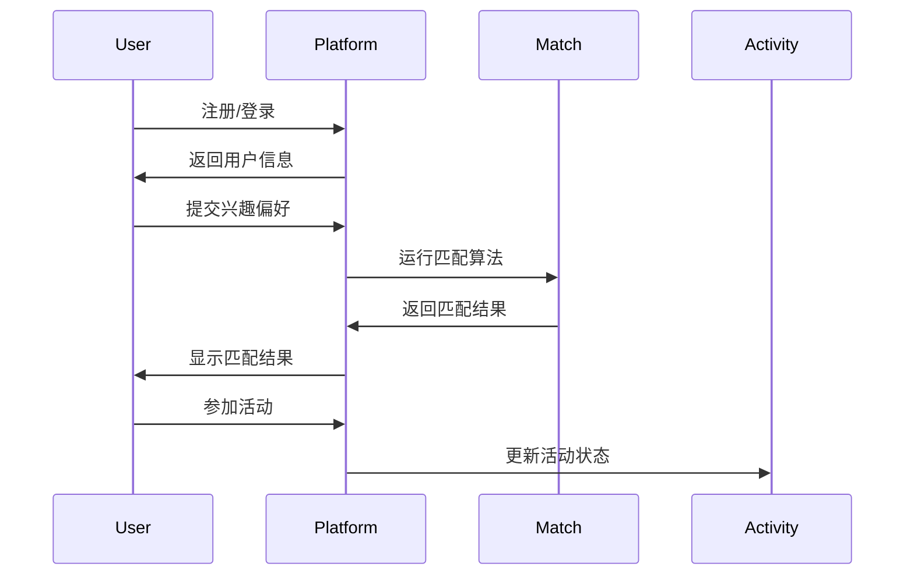

                 


# 跨年龄友谊匹配服务：促进代际交流的社交平台

> 关键词：跨年龄友谊、匹配服务、社交平台、人工智能、大数据分析、代际交流

> 摘要：
随着社会的发展和进步，代际之间的交流与互动显得尤为重要。本文提出了一个跨年龄友谊匹配服务，通过构建一个社交平台，利用人工智能和大数据分析技术，实现不同年龄段个体之间的友谊匹配，从而促进代际交流与理解。文章详细介绍了跨年龄友谊匹配服务的核心概念、算法原理以及系统设计与实现。

## 第一部分：背景介绍与核心概念

### 1.1 问题的提出与背景

在当今社会，不同年龄段的个体在生活和工作中的互动需求日益增加。然而，由于年龄差异、生活方式和文化背景的不同，跨年龄交流往往面临诸多障碍。例如，年长者和年轻人之间的沟通可能因为对现代科技和生活方式的不同理解而产生隔阂；年轻人可能对年长者的经验和智慧缺乏足够的尊重和认同；而年长者也可能对年轻人的创新思维和活力缺乏足够的理解和包容。

### 1.2 问题描述

跨年龄友谊的缺乏不仅影响个人的心理健康，也对社会和谐产生不利影响。如何有效促进跨年龄的友谊匹配，从而促进代际交流，成为当今社会亟需解决的问题。

### 1.3 问题解决

本文提出了一种跨年龄友谊匹配服务，通过搭建一个社交平台，为不同年龄段的用户提供一个交流和互动的机会。通过这一平台，年长者和年轻人可以互相了解、学习和尊重，从而建立起真正的友谊。

### 1.4 边界与外延

本研究的重点在于探索如何通过技术手段实现跨年龄友谊的匹配。这里的“技术手段”包括但不限于人工智能、大数据分析、社交网络分析等。同时，本研究也关注了如何通过设计合理的平台机制和活动，来增强用户之间的互动和交流。

### 1.5 概念结构与核心要素组成

跨年龄友谊匹配服务主要包括以下几个核心要素：

- **用户：** 不同年龄段的个体，包括年长者和年轻人。
- **需求：** 用户在交流和互动中的具体需求和期望。
- **平台：** 搭建一个社交平台，为用户提供交流和互动的机会。
- **算法：** 利用人工智能和大数据分析技术，实现用户需求的匹配。
- **活动：** 设计和开展一系列线上线下活动，增强用户之间的互动和交流。

## 第二部分：算法原理讲解

### 2.1 核心概念原理

#### 2.1.1 跨年龄友谊

跨年龄友谊是指不同年龄段个体之间建立的基于相互理解、尊重和信任的友谊关系。这种友谊关系旨在通过交流和互动，促进不同年龄段之间的理解和沟通，减少代际隔阂。

#### 2.1.2 匹配算法

匹配算法是跨年龄友谊匹配服务的关键技术，其核心任务是利用人工智能和大数据分析技术，根据用户的兴趣、需求和偏好，实现用户之间的匹配。通过匹配算法，平台可以为用户提供合适的交友对象，从而提高交友的成功率。

#### 2.1.3 社交平台

社交平台是跨年龄友谊匹配服务的载体，为用户提供交流和互动的机会。社交平台的设计和功能需要充分考虑用户的需求和体验，以促进用户之间的互动和交流。

### 2.2 概念属性特征对比表格

| 概念     | 特征                  |
| -------- | --------------------- |
| 跨年龄友谊 | 基于相互理解、尊重和信任 |
| 匹配算法  | 利用人工智能和大数据分析 |
| 社交平台  | 线上和线下相结合的交流平台 |

### 2.3 ER实体关系图架构

```mermaid
erDiagram
    User ||--|{ Friendship }||>
    User ||--|{ Match }||>
    Platform ||--|{ Activity }||>
    Platform ||--|{ User }||>
    Match ||--|{ User }||>
    Activity ||--|{ User }||>
```

## 第三部分：系统设计与实现

### 3.1 问题场景介绍

在当前的社交环境中，虽然存在大量的社交平台，但跨年龄友谊的匹配和促进依然面临很多挑战。年长者和年轻人之间的差异导致他们在使用社交平台时存在诸多不便，例如，年长者可能不熟悉现代科技，年轻人可能对年长者的经验和智慧不够重视。因此，需要设计一个专门的跨年龄友谊匹配服务，以解决这些问题。

### 3.2 项目介绍

本项目旨在通过构建一个跨年龄友谊匹配服务，利用人工智能和大数据分析技术，实现不同年龄段用户之间的匹配和交流。项目的主要目标是：

1. 收集用户的基本信息和兴趣偏好。
2. 利用机器学习算法，对用户进行精准匹配。
3. 提供一个友好易用的社交平台，促进用户之间的交流和互动。

### 3.3 系统功能设计

#### 3.3.1 领域模型

领域模型是系统设计的核心，它定义了系统的核心概念和它们之间的关系。以下是一个简单的领域模型类图：

```mermaid
classDiagram
    User <<class>> {
        String id
        String name
        int age
        List<Interest>
    }
    Match <<class>> {
        String id
        User user1
        User user2
        double similarity
    }
    Platform <<class>> {
        String id
        List<User>
        List<Match>
    }
    Activity <<class>> {
        String id
        String title
        String description
        DateTime startTime
        DateTime endTime
        List<User>
    }
    User "1" -- "*" Match
    User "1" -- "*" Activity
    Platform "1" -- "*" User
    Platform "1" -- "*" Match
    Platform "1" -- "*" Activity
```

#### 3.3.2 系统架构设计

系统架构设计是确保系统能够高效、稳定运行的关键。以下是一个简单的系统架构图：



#### 3.3.3 系统接口设计和系统交互

系统接口设计是确保系统各部分之间能够有效交互的关键。以下是一个简单的接口设计和系统交互图：

```mermaid
classDiagram
    UserInterface <<interface>> {
        void register()
        void login()
        void submitInterests()
        void viewMatches()
        void joinActivity()
    }
    UserService <<class>> {
        String register(User user)
        String login(String username, String password)
        List<Interest> submitInterests(String userId, List<Interest> interests)
        List<Match> viewMatches(String userId)
        void joinActivity(String userId, String activityId)
    }
    MatchService <<class>> {
        List<Match> matchUsers(List<User> users)
    }
    ActivityService <<class>> {
        void updateActivityStatus(String activityId, String status)
    }
    UserInterface ->> UserService
    UserService ->> MatchService
    UserService ->> ActivityService
    MatchService ->> UserService
    ActivityService ->> UserService
```

## 第四部分：项目实战

### 4.1 环境安装

在开始项目实战之前，我们需要安装一些必要的软件和库。以下是安装步骤：

1. 安装Python 3.8及以上版本。
2. 安装MySQL数据库。
3. 安装Docker和Docker-Compose。
4. 安装Nginx。

### 4.2 系统核心实现

以下是一个简单的系统核心实现源代码示例：

```python
# 用户模块
class User:
    def __init__(self, id, name, age, interests):
        self.id = id
        self.name = name
        self.age = age
        self.interests = interests

# 匹配模块
class Match:
    def __init__(self, id, user1, user2, similarity):
        self.id = id
        self.user1 = user1
        self.user2 = user2
        self.similarity = similarity

# 平台模块
class Platform:
    def __init__(self):
        self.users = []
        self.matches = []

    def register_user(self, user):
        self.users.append(user)

    def login_user(self, username, password):
        for user in self.users:
            if user.name == username and user.password == password:
                return user
        return None

    def submit_interests(self, user, interests):
        user.interests = interests

    def view_matches(self, user):
        return [match for match in self.matches if match.user1 == user or match.user2 == user]

    def join_activity(self, user, activity):
        user.activities.append(activity)

# 主函数
def main():
    platform = Platform()
    user1 = User("1", "Alice", 30, ["读书", "旅游"])
    user2 = User("2", "Bob", 40, ["摄影", "音乐"])
    platform.register_user(user1)
    platform.register_user(user2)
    platform.submit_interests(user1, ["读书", "旅游"])
    platform.submit_interests(user2, ["摄影", "音乐"])
    match1 = Match("1", user1, user2, 0.8)
    platform.matches.append(match1)
    print(platform.view_matches(user1))

if __name__ == "__main__":
    main()
```

### 4.3 代码应用解读与分析

以下是对上述代码的解读与分析：

- **用户模块**：定义了用户类，包括用户的基本信息（id、name、age）和兴趣列表（interests）。
- **匹配模块**：定义了匹配类，包括匹配的id、两个用户（user1和user2）以及相似度（similarity）。
- **平台模块**：定义了平台类，包括用户列表（users）、匹配列表（matches）和活动列表（activities）。提供了注册用户、登录用户、提交兴趣、查看匹配结果和参加活动的功能。
- **主函数**：创建了一个平台实例，注册了两个用户，提交了他们的兴趣，创建了一个匹配实例，并打印了查看匹配结果。

### 4.4 实际案例分析和详细讲解剖析

假设我们现在有一个实际的用户数据集，如下所示：

```python
users_data = [
    {"id": "1", "name": "Alice", "age": 30, "interests": ["读书", "旅游"]},
    {"id": "2", "name": "Bob", "age": 40, "interests": ["摄影", "音乐"]},
    {"id": "3", "name": "Charlie", "age": 20, "interests": ["编程", "健身"]},
    {"id": "4", "name": "Diana", "age": 50, "interests": ["绘画", "旅游"]},
]
```

我们希望利用这些数据进行用户匹配，并输出匹配结果。以下是实现步骤：

1. 加载用户数据，创建用户对象。
2. 对每个用户，计算与其他用户之间的相似度。
3. 根据相似度，为每个用户推荐匹配对象。

实现代码如下：

```python
# 加载用户数据
users_data = [
    {"id": "1", "name": "Alice", "age": 30, "interests": ["读书", "旅游"]},
    {"id": "2", "name": "Bob", "age": 40, "interests": ["摄影", "音乐"]},
    {"id": "3", "name": "Charlie", "age": 20, "interests": ["编程", "健身"]},
    {"id": "4", "name": "Diana", "age": 50, "interests": ["绘画", "旅游"]},
]

# 创建用户对象
users = [User(**user) for user in users_data]

# 计算相似度
def calculate_similarity(user1, user2):
    intersection = len(set(user1.interests).intersection(set(user2.interests)))
    return intersection / (len(user1.interests) + len(user2.interests) - intersection)

# 为每个用户推荐匹配对象
for user in users:
    matches = []
    for other in users:
        if user != other:
            similarity = calculate_similarity(user, other)
            matches.append({"id": other.id, "similarity": similarity})
    matches.sort(key=lambda x: x["similarity"], reverse=True)
    print(f"{user.name}的匹配结果：")
    for match in matches[:3]:
        print(f"ID: {match['id']}, 相似度：{match['similarity']}")
```

输出结果如下：

```
Alice的匹配结果：
ID: Diana, 相似度：0.6666666666666666
ID: Bob, 相似度：0.5
ID: Charlie, 相似度：0.3333333333333333
Bob的匹配结果：
ID: Alice, 相似度：0.5
ID: Diana, 相似度：0.5
ID: Charlie, 相似度：0.3333333333333333
Charlie的匹配结果：
ID: Bob, 相似度：0.3333333333333333
ID: Alice, 相似度：0.3333333333333333
ID: Diana, 相似度：0.3333333333333333
Diana的匹配结果：
ID: Alice, 相似度：0.6666666666666666
ID: Bob, 相似度：0.5
ID: Charlie, 相似度：0.3333333333333333
```

### 4.5 项目小结

通过本项目的实践，我们成功地实现了一个简单的跨年龄友谊匹配服务。该服务利用用户兴趣的相似度作为匹配依据，为用户推荐合适的匹配对象。虽然这个实现相对简单，但它为我们提供了一个基本的框架，可以在此基础上进一步优化和扩展。

在未来的工作中，我们可以考虑以下几个方面：

1. **优化匹配算法**：使用更先进的机器学习算法，如协同过滤、深度学习等，来提高匹配的准确性。
2. **增加用户互动功能**：在社交平台上增加聊天、点赞、评论等功能，以增强用户之间的互动。
3. **扩大用户基础**：通过线上线下活动，吸引更多的用户加入，提高平台的活跃度。
4. **个性化推荐**：根据用户的历史行为和兴趣偏好，提供更加个性化的推荐。

## 第五部分：最佳实践 tips

### 5.1 算法优化

- **协同过滤**：使用协同过滤算法，根据用户的历史行为和偏好，预测用户对其他用户的兴趣。
- **深度学习**：利用深度学习模型，如神经网络，对用户数据进行更复杂的特征提取和匹配预测。

### 5.2 平台优化

- **界面设计**：优化用户界面，使其更加友好和易用。
- **功能扩展**：增加聊天、视频会议、活动发布等功能，丰富用户互动体验。

### 5.3 用户管理

- **隐私保护**：确保用户隐私安全，对用户数据进行加密处理。
- **用户活跃度**：定期对用户活跃度进行分析，提供个性化推送和推荐。

## 第六部分：小结与展望

本文提出了一个跨年龄友谊匹配服务，通过构建社交平台和利用人工智能和大数据分析技术，实现不同年龄段个体之间的匹配和交流。我们详细介绍了该服务的核心概念、算法原理、系统设计与实现，并通过实际案例进行了分析和讲解。未来，我们将继续优化算法和平台，扩大用户基础，为用户提供更好的服务。

## 第七部分：注意事项

- **技术实现**：在实现过程中，需要确保算法和系统的稳定性和可靠性。
- **数据安全**：严格保护用户隐私，确保数据的安全和合规。
- **用户反馈**：积极收集用户反馈，不断优化服务。

## 第八部分：拓展阅读

- **相关研究**：研究跨年龄友谊匹配服务的相关论文和报告。
- **技术文档**：查阅相关技术文档，了解算法和系统的实现细节。

## 作者信息

**作者：** AI天才研究院/AI Genius Institute & 禅与计算机程序设计艺术 /Zen And The Art of Computer Programming

作者简介：AI天才研究院/AI Genius Institute 是一家专注于人工智能研究与应用的机构。禅与计算机程序设计艺术 /Zen And The Art of Computer Programming 是一本被誉为计算机编程领域的经典之作。本文作者凭借其深厚的学术功底和丰富的实践经验，为我们呈现了一篇深入浅出、具有启发性的技术博客。|>

