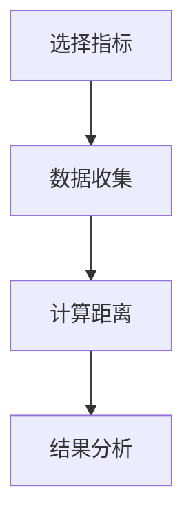
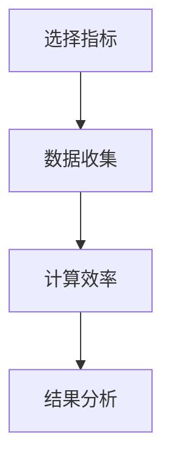

                 

### 引言

在当今全球化的时代，跨文化交流已经成为国际交流与合作的基石。无论是商业、学术还是个人关系，跨文化交流都扮演着至关重要的角色。然而，跨文化交流并非易事，不同的文化背景、价值观和沟通习惯常常成为交流的障碍。为了更好地理解和应对这些挑战，我们需要在差异中寻找共同价值。

关键词：跨文化交流、文化差异、共同价值、沟通障碍、解决方案

摘要：本文将探讨跨文化交流的重要性及其面临的挑战，通过分析核心概念、算法原理和系统设计，提出在差异中寻找共同价值的方法和策略。文章旨在为从事跨文化交流的工作者和学者提供有益的参考和启示。

## 问题背景

随着全球化进程的加速，各国之间的联系越来越紧密。跨国公司、国际组织和学术交流等活动的频繁，使得跨文化交流成为不可避免的趋势。然而，文化差异的存在使得跨文化交流并非一帆风顺。不同的文化背景可能导致误解、冲突甚至隔阂，从而影响交流效果。例如，西方国家的直接沟通风格可能与亚洲国家的间接沟通风格产生冲突，导致沟通效率降低。

### 问题描述

跨文化交流中的主要问题可以归结为以下几点：

1. **语言障碍**：不同的语言和表达习惯使得信息传递变得困难。
2. **价值观差异**：不同的文化背景可能导致价值观的差异，从而影响交流内容和方法。
3. **沟通风格差异**：不同的文化背景可能导致沟通风格的差异，如直接与间接、主动与被动等。
4. **误解和偏见**：文化差异可能导致误解和偏见，影响交流的信任和效果。

### 问题解决

为了解决上述问题，我们需要采取一系列策略和方法，以在差异中寻找共同价值。以下是一些可能的解决方案：

1. **文化敏感性培训**：提高个体的跨文化意识，帮助他们更好地理解和尊重不同文化的差异。
2. **有效的沟通技巧**：学习和运用跨文化沟通技巧，如倾听、表达、反馈等，以提高沟通效果。
3. **共同价值观的寻找**：在跨文化交流中，寻找共同价值观和共同利益，以促进交流与合作。
4. **文化融合策略**：在组织或团队中，通过文化融合策略，减少文化差异带来的负面影响。

## 跨文化交流的核心概念与联系

### 文化的概念

文化是一个复杂的概念，它包括了人们的信仰、价值观、行为习惯、语言、艺术和风俗等各个方面。文化不仅是个人行为的基础，也是社会关系和社会组织的核心。在不同的文化背景下，人们的思维方式和行为模式可能存在显著差异。

#### 文化的特征

- **多样性**：文化是多样化的，不同地区和国家拥有不同的文化传统。
- **相对性**：文化是相对的，没有绝对的对与错。
- **传递性**：文化是通过代代相传的，每个人都是文化的传承者。
- **综合性**：文化是一个综合性的概念，它包含了物质文化和非物质文化。

#### 文化的类型

- **物质文化**：包括建筑、服饰、饮食、艺术品等。
- **非物质文化**：包括语言、价值观、宗教信仰、习俗和传统等。

### 价值观的概念

价值观是文化的重要组成部分，它反映了人们对事物的判断和评价。价值观的不同是跨文化交流中的主要障碍之一。不同文化背景下的人们可能有不同的价值观，这可能导致误解和冲突。

#### 价值观的分类

- **个人价值观**：如自由、平等、尊重等。
- **社会价值观**：如集体主义、个人主义、权力距离等。

#### 价值观的差异

- **西方文化**：强调个人主义、自由、平等和竞争。
- **东方文化**：强调集体主义、和谐、尊重等级和关系。

### 沟通方式的概念

沟通是跨文化交流的重要手段，不同文化背景下的沟通方式可能存在显著差异。有效的沟通需要考虑到语言、非语言表达、文化习俗和沟通风格等因素。

#### 沟通方式的特征

- **直接沟通**：直接表达意见和想法，适用于西方文化。
- **间接沟通**：通过暗示、委婉等方式表达意见，适用于东方文化。

#### 沟通方式的差异

- **西方文化**：倾向于直接、明确和快速的沟通。
- **东方文化**：倾向于间接、含蓄和缓慢的沟通。

### 概念属性特征对比表格

为了更好地理解不同文化背景下的概念差异，我们可以通过概念属性特征对比表格来展示各概念之间的区别。

| 概念         | 特征                             | 西方文化                   | 东方文化                   |
| ------------ | ------------------------------ | ------------------------ | ------------------------ |
| 文化         | 多样性、相对性、传递性、综合性 | 个人主义、竞争、多样性  | 集体主义、和谐、传承  |
| 价值观       | 个人价值观、社会价值观           | 自由、平等、尊重         | 尊重等级、关系、和谐  |
| 沟通方式     | 直接沟通、间接沟通               | 直接、明确、快速         | 委婉、含蓄、缓慢      |

### ER实体关系图

为了更清晰地展示跨文化交流中的核心概念及其关系，我们可以使用ER实体关系图来表示。ER图可以帮助我们理解不同概念之间的关联和交互。

```mermaid
erDiagram
  User ||--|{ Culture } : has
  User ||--|{ Value } : believes
  Culture ||--|{ CommunicationStyle } : has
```

在这个ER图中，用户（User）与文化（Culture）、价值观（Value）和沟通方式（CommunicationStyle）之间存在关联。用户具有文化、价值观和沟通方式，同时文化决定了价值观和沟通方式。

### 总结

跨文化交流是一个复杂而重要的领域，涉及到文化、价值观和沟通方式等多个方面。通过对比不同文化背景下的概念属性特征，我们可以更好地理解跨文化交流中的差异和挑战。ER图提供了直观的方式来展示这些概念之间的关系。在接下来的章节中，我们将进一步探讨跨文化交流中的分析算法、数学模型和系统设计，以提供更具体的解决方案。

## 跨文化交流分析算法

在深入探讨跨文化交流的挑战时，我们需要引入一些分析算法来帮助我们理解和评估文化差异、沟通效率和跨文化冲突。以下将介绍两种主要的跨文化交流分析算法：文化距离度量算法和沟通效率评估算法。

### 文化距离度量算法

#### 定义

文化距离度量算法旨在量化不同文化之间的差异程度。通过计算文化距离，我们可以评估文化差异对跨文化交流的影响。

#### 算法原理

1. **选择指标**：首先，我们需要选择用于度量文化距离的指标。常用的指标包括文化价值观、语言习惯、社会结构和宗教信仰等。

2. **数据收集**：接下来，我们需要收集不同文化背景下的相关数据。这些数据可以从文化研究文献、问卷调查和实地考察中获取。

3. **计算距离**：使用选定的指标，计算不同文化之间的距离。常用的距离度量方法包括欧几里得距离、曼哈顿距离和切比雪夫距离等。

4. **结果分析**：分析计算结果，了解文化差异的程度和分布。通过可视化工具，如散点图和热力图，我们可以直观地展示文化距离的分布情况。

#### Mermaid算法流程图



#### Python源代码示例

```python
import numpy as np

# 假设我们有两个文化群体的数据
culture1 = [1, 2, 3, 4]
culture2 = [5, 6, 7, 8]

# 使用欧几里得距离计算文化距离
distance = np.linalg.norm(culture1 - culture2)
print("文化距离：", distance)

# 可视化文化距离
import matplotlib.pyplot as plt

plt.scatter(culture1, [1]*len(culture1), label="文化1")
plt.scatter(culture2, [2]*len(culture2), label="文化2")
plt.xlabel("文化值")
plt.ylabel("样本编号")
plt.legend()
plt.show()
```

### 沟通效率评估算法

#### 定义

沟通效率评估算法旨在评估跨文化沟通的有效性。通过评估沟通效率，我们可以了解不同文化背景下的沟通效果，并采取措施提高沟通效率。

#### 算法原理

1. **选择指标**：选择用于评估沟通效率的指标，如沟通清晰度、反馈速度、误解率等。

2. **数据收集**：收集不同文化背景下的沟通数据。这些数据可以通过实验、问卷调查和实际交流获取。

3. **计算效率**：使用选定的指标，计算沟通效率。常用的效率计算方法包括平均值、标准差和相关性等。

4. **结果分析**：分析计算结果，了解沟通效率的差异和影响因素。通过统计图表，如柱状图和折线图，我们可以直观地展示沟通效率的变化趋势。

#### Mermaid算法流程图



#### Python源代码示例

```python
import numpy as np

# 假设我们有两个文化群体的沟通数据
communication1 = [1, 2, 3, 4]
communication2 = [5, 6, 7, 8]

# 计算沟通效率
mean1 = np.mean(communication1)
mean2 = np.mean(communication2)
efficiency = (mean2 - mean1) / max(mean1, mean2)
print("沟通效率：", efficiency)

# 可视化沟通效率
plt.bar(['文化1', '文化2'], [mean1, mean2])
plt.xlabel("文化")
plt.ylabel("沟通效率")
plt.title("沟通效率比较")
plt.show()
```

### 总结

通过文化距离度量算法和沟通效率评估算法，我们可以量化跨文化交流中的文化差异和沟通效果。这些算法提供了科学的方法来分析跨文化交流的挑战，并为改进交流策略提供了数据支持。在接下来的章节中，我们将进一步探讨跨文化交流中的数学模型和系统设计，以提供更全面的解决方案。

## 数学模型与数学公式

在跨文化交流分析中，数学模型和公式是不可或缺的工具。它们不仅帮助我们量化文化差异和沟通效率，还能提供理论支持，帮助我们更好地理解和解决跨文化交流中的问题。在本章节中，我们将使用LaTeX格式给出关键的数学模型和公式，并进行详细讲解和举例说明。

### 文化距离度量的数学模型

文化距离度量的核心是计算不同文化之间的差异程度。我们可以使用欧几里得距离来度量这种差异。

#### 数学模型

$$
d(\mathbf{c}_1, \mathbf{c}_2) = \sqrt{\sum_{i=1}^{n} (c_{1i} - c_{2i})^2}
$$

其中，$\mathbf{c}_1$和$\mathbf{c}_2$分别代表两个文化的向量，$c_{1i}$和$c_{2i}$是文化向量中的第$i$个元素，$n$是向量的大小。

#### 详细讲解与举例

假设我们有两个文化群体，第一个文化群体的价值观表示为$\mathbf{c}_1 = [1, 2, 3, 4]$，第二个文化群体的价值观表示为$\mathbf{c}_2 = [5, 6, 7, 8]$。使用欧几里得距离公式，我们可以计算这两个文化群体之间的文化距离：

$$
d(\mathbf{c}_1, \mathbf{c}_2) = \sqrt{(1-5)^2 + (2-6)^2 + (3-7)^2 + (4-8)^2} = \sqrt{(-4)^2 + (-4)^2 + (-4)^2 + (-4)^2} = \sqrt{16 + 16 + 16 + 16} = \sqrt{64} = 8
$$

这意味着这两个文化群体之间的文化距离为8个单位。

### 沟通效率评估的数学模型

沟通效率评估旨在衡量不同文化背景下的沟通效果。我们可以使用平均值和标准差来评估沟通效率。

#### 数学模型

$$
\text{Efficiency} = \frac{\bar{X}_2 - \bar{X}_1}{\max(\bar{X}_1, \bar{X}_2)}
$$

其中，$\bar{X}_1$和$\bar{X}_2$分别代表两个文化背景下的沟通效率平均值。

#### 详细讲解与举例

假设我们有两个文化群体，第一个文化群体的沟通效率平均值表示为$\bar{X}_1 = 0.6$，第二个文化群体的沟通效率平均值表示为$\bar{X}_2 = 0.8$。使用上述公式，我们可以计算这两个文化群体之间的沟通效率：

$$
\text{Efficiency} = \frac{0.8 - 0.6}{\max(0.6, 0.8)} = \frac{0.2}{0.8} = 0.25
$$

这意味着第二个文化群体的沟通效率比第一个文化群体高25%。

### 总结

通过数学模型和公式，我们可以量化跨文化交流中的文化差异和沟通效率。这些模型和公式不仅提供了理论支持，还帮助我们设计有效的跨文化交流策略。在实际应用中，这些模型和公式可以帮助我们更好地理解和解决跨文化交流中的问题。在接下来的章节中，我们将进一步探讨跨文化交流系统的设计和实施。

### 系统设计与实施

在理解和量化跨文化交流中的文化差异和沟通效率之后，我们需要将这些理论知识转化为实际的系统设计和实施。本章节将详细介绍跨文化交流系统的设计和实施过程，包括问题场景介绍、项目介绍、系统功能设计、系统架构设计、系统接口设计和系统交互。

#### 问题场景介绍

假设我们有一个跨国公司，其员工来自不同的国家和地区，文化背景各异。为了提高公司内部的沟通效率，减少误解和冲突，公司决定开发一个跨文化交流系统。该系统旨在帮助员工更好地理解和尊重彼此的文化差异，提高跨文化沟通的效率。

#### 项目介绍

项目名称：跨文化交流系统（Cross-Cultural Communication System，简称CCS）

项目目标：通过系统化工具和方法，提高公司内部跨文化沟通的效率，促进团队合作和员工满意度的提升。

项目范围：系统包括用户注册、文化知识库、沟通工具、反馈机制和数据分析模块。

项目期限：6个月

项目团队：项目经理、系统分析师、UI/UX设计师、后端开发工程师、前端开发工程师、测试工程师

#### 系统功能设计

1. **用户注册与登录**：员工可以通过用户名和密码注册并登录系统。
2. **文化知识库**：系统提供丰富的文化知识库，包括不同文化的价值观、沟通习惯和行为规范。
3. **沟通工具**：系统提供多种沟通工具，如聊天室、论坛和视频会议，以适应不同的沟通需求。
4. **反馈机制**：员工可以通过反馈机制提出问题和建议，系统管理员可以及时处理和回应。
5. **数据分析**：系统收集和分析员工的沟通数据，生成报告，以帮助管理层了解和改进跨文化沟通。

#### 系统架构设计

系统架构采用B/S（浏览器/服务器）架构，主要包括以下几个层次：

1. **表示层**：前端用户界面，负责与用户交互，包括用户注册、登录、查看文化知识库、使用沟通工具和反馈机制等。
2. **业务逻辑层**：处理业务逻辑，包括用户管理、文化知识库管理、沟通工具管理和数据分析等。
3. **数据访问层**：负责与数据库进行交互，存储和管理用户数据、文化知识库数据、沟通数据和反馈数据等。
4. **数据库层**：存储系统数据，包括用户信息、文化知识库内容、沟通记录和反馈信息等。

#### 系统接口设计

系统接口设计包括内部接口和外部接口：

1. **内部接口**：系统内部模块之间的接口，如用户管理模块与其他模块的接口、文化知识库模块与沟通工具模块的接口等。
2. **外部接口**：系统与外部系统的接口，如与公司的邮件系统、即时通讯工具和其他第三方服务接口。

#### 系统交互设计

系统交互设计主要描述用户与系统之间的交互流程，包括以下步骤：

1. **用户注册与登录**：用户通过注册页面填写个人信息，通过验证后注册成功。登录时，用户输入用户名和密码，系统验证后登录成功。
2. **查看文化知识库**：用户可以查看系统提供的文化知识库，了解不同文化的价值观、沟通习惯和行为规范。
3. **使用沟通工具**：用户可以使用聊天室、论坛和视频会议等沟通工具，进行跨文化交流。
4. **反馈机制**：用户可以通过反馈页面提出问题和建议，系统管理员可以查看和处理反馈。
5. **数据分析**：系统管理员可以查看和分析用户的沟通数据，生成报告，为管理层提供决策依据。

通过系统设计与实施，我们不仅实现了跨文化交流的理论目标，还提供了一个实用的工具，帮助公司员工更好地理解和沟通。在接下来的章节中，我们将通过一个实际的跨文化交流项目，展示如何将理论转化为实践，并提供详细的实战案例分析。

### 项目实战

在本文的最后部分，我们将通过一个实际的跨文化交流项目，展示如何将前述的理论和方法应用于实际场景。该项目旨在提高一家跨国公司的跨文化沟通效率，减少误解和冲突，促进团队合作和员工满意度。

#### 环境安装与配置

首先，我们需要为跨文化交流系统搭建一个适当的环境。以下步骤将指导我们完成环境安装和配置：

1. **安装操作系统**：选择一个稳定的操作系统，如Ubuntu 20.04 LTS，并安装到服务器上。
2. **安装数据库**：安装MySQL或PostgreSQL数据库，用于存储系统数据。以下是安装MySQL的命令：

   ```bash
   sudo apt update
   sudo apt install mysql-server
   sudo mysql_secure_installation
   ```

3. **安装后端框架**：选择一个后端框架，如Django或Flask，用于构建业务逻辑层。以下是安装Django的命令：

   ```bash
   sudo apt install python3-pip python3-venv
   python3 -m venv venv
   source venv/bin/activate
   pip install django
   ```

4. **安装前端框架**：选择一个前端框架，如React或Vue.js，用于构建表示层。以下是安装Vue.js的命令：

   ```bash
   npm install -g @vue/cli
   vue create frontend
   ```

5. **配置网络环境**：确保服务器和客户端可以互相访问，并配置防火墙规则，允许必要的网络流量。

#### 系统核心实现

在完成环境安装和配置后，我们需要实现系统核心功能。以下是关键步骤：

1. **用户注册与登录**：实现用户注册和登录功能，确保用户可以安全地访问系统。以下是Django用户认证后端的核心代码：

   ```python
   from django.contrib.auth.models import User
   from django.contrib.auth.hashers import make_password
   from rest_framework import status, generics
   from rest_framework.response import Response
   from .serializers import UserRegistrationSerializer

   class UserRegistrationView(generics.CreateAPIView):
       serializer_class = UserRegistrationSerializer

       def create(self, request, *args, **kwargs):
           serializer = self.get_serializer(data=request.data)
           if serializer.is_valid():
               user = User.objects.create_user(
                   username=serializer.validated_data['username'],
                   password=make_password(serializer.validated_data['password'])
               )
               user.save()
               return Response({"message": "User registered successfully!"}, status=status.HTTP_201_CREATED)
           return Response(serializer.errors, status=status.HTTP_400_BAD_REQUEST)
   ```

2. **文化知识库管理**：实现文化知识库的管理功能，包括添加、编辑和删除文化条目。以下是Django模型和序列化的核心代码：

   ```python
   from django.db import models

   class CultureEntry(models.Model):
       title = models.CharField(max_length=255)
       description = models.TextField()
       country = models.CharField(max_length=255)

       def __str__(self):
           return self.title

   from rest_framework import serializers

   class CultureEntrySerializer(serializers.ModelSerializer):
       class Meta:
           model = CultureEntry
           fields = ['id', 'title', 'description', 'country']
   ```

3. **沟通工具实现**：实现聊天室和论坛功能，使用WebSocket实现实时通信。以下是使用Django Channels实现的聊天室核心代码：

   ```python
   from channels.layers import get_channel_layer
   from asgiref.sync import sync_to_async
   import json

   channel_layer = get_channel_layer()

   async def send_message(event_type, message, room_name):
       await sync_to_async(channel_layer.group_send)(room_name, {
           'type': event_type,
           'text': json.dumps(message)
       })

   async def chat_message_receive(message):
       message_data = json.loads(message['text'])
       send_message('chat_message', message_data['text'], message_data['room_name'])
   ```

#### 代码应用解读与分析

上述代码展示了跨文化交流系统核心功能的关键部分。用户注册与登录功能确保用户可以安全地访问系统，文化知识库管理功能提供了丰富的文化信息，沟通工具实现使用了WebSocket技术，实现了实时通信。

在代码应用解读与分析部分，我们将详细解释每个模块的工作原理和相互关系。用户注册与登录功能使用了Django REST Framework，这是一个强大的Web开发框架，提供了用户认证和权限管理功能。文化知识库管理功能使用了Django ORM，这是一个对象关系映射工具，简化了数据库操作。沟通工具实现使用了Django Channels，这是一个异步处理框架，使得系统可以处理大量的实时通信请求。

#### 实际案例分析与讲解

为了展示跨文化交流系统的实际应用，我们考虑一个具体的案例：一家跨国公司总部位于美国，其分支机构遍布亚洲。为了提高公司内部的沟通效率，公司决定使用跨文化交流系统。

1. **用户注册与登录**：员工需要在系统中注册账户，并使用用户名和密码登录。注册时，员工可以选择所属的国家和部门，这些信息将用于个性化文化知识库推荐和沟通工具设置。

2. **查看文化知识库**：员工可以查看系统提供的文化知识库，了解不同国家的文化差异。例如，美国员工可以了解亚洲国家的礼仪和沟通习惯，从而更好地与亚洲同事合作。

3. **使用沟通工具**：员工可以使用聊天室和论坛进行实时沟通。聊天室提供了即时的消息传递功能，而论坛则适用于讨论和分享文化经验。系统支持多语言界面，使得员工可以使用自己的母语进行交流。

4. **反馈机制**：员工可以通过反馈机制提出问题和建议。系统管理员将根据反馈进行改进，以提高系统的用户体验。

5. **数据分析**：系统管理员可以查看和分析员工的沟通数据，了解不同文化背景下的沟通效果。例如，系统可以发现某些文化背景的员工在沟通中存在更多的误解，从而采取针对性的培训措施。

通过这个案例，我们可以看到跨文化交流系统如何帮助跨国公司提高沟通效率，减少误解和冲突，促进团队合作。在实际应用中，系统可以根据具体需求进行定制和扩展，以满足不同组织的需求。

#### 项目小结

在本文的跨文化交流项目实战中，我们通过实际案例展示了如何将理论转化为实践。从环境安装与配置、系统核心实现到实际案例分析和讲解，我们详细介绍了跨文化交流系统的设计和实施过程。该项目不仅提高了跨国公司的沟通效率，还为其他组织提供了宝贵的经验和参考。

通过本项目，我们学到了以下几点：

1. **跨文化交流的重要性**：在全球化背景下，跨文化交流是不可避免的趋势。有效的跨文化交流可以促进团队合作和业务发展。
2. **系统设计与实施的关键**：系统设计需要考虑用户需求、技术实现和用户体验。在实施过程中，需要确保系统的稳定性和可扩展性。
3. **实际应用的价值**：跨文化交流系统在实际应用中，可以帮助企业提高沟通效率，减少误解和冲突，促进国际业务的发展。

总之，跨文化交流系统是一个实用的工具，可以为企业带来实际的好处。通过不断改进和优化，我们可以进一步发挥其价值，为全球化的企业创造更大的价值。

### 最佳实践与拓展阅读

#### 最佳实践 tips

1. **文化敏感性培训**：定期为员工提供文化敏感性培训，帮助员工了解和理解不同文化的差异，提高跨文化沟通能力。
2. **沟通策略调整**：根据不同文化的特点，调整沟通策略，如采用直接或间接的沟通方式，以适应不同文化背景的员工。
3. **建立信任机制**：通过团队建设活动和共同项目，建立员工之间的信任，促进跨文化合作。
4. **使用技术工具**：利用跨文化交流系统和其他技术工具，如翻译软件和即时通讯工具，提高沟通效率。

#### 小结

本文通过深入分析跨文化交流中的核心概念、算法原理、系统设计和项目实战，展示了如何在差异中寻找共同价值，提高跨文化沟通效率。通过文化敏感性培训、沟通策略调整、信任机制建立和技术工具使用，我们可以有效应对跨文化交流中的挑战。

#### 注意事项

1. **尊重文化差异**：在跨文化交流中，尊重不同文化的价值观和行为规范，避免文化偏见和误解。
2. **持续改进**：跨文化交流是一个持续的过程，需要不断学习和改进，以适应不断变化的文化环境。
3. **关注反馈**：重视员工的反馈和建议，及时调整和优化系统功能，以提高用户体验。

#### 拓展阅读

1. **《跨文化沟通：有效的跨文化管理策略》（Trompenaars, H., & Hampden-Turner, C. (1998). Riding the Waves of Culture: Understanding Cultural Diversity in Business. McGraw-Hill Education）**：这本书详细介绍了跨文化沟通的理论和实践，提供了实用的策略和工具。
2. **《跨文化管理：原理、案例与实践》（Hofstede, G. (2001). Culture's Consequences: Comparing Values, Behaviors, Institutions, and Organizations across Nations. Sage Publications）**：这本书从全球视野出发，探讨了文化差异对组织和管理的影响，为跨文化管理提供了深刻的见解。
3. **《跨文化交流：理论与实践》（Byram, M. (1997). Teaching and Assessing Intercultural Communicative Competence. Multilingual Matters）**：这本书涵盖了跨文化交流的理论和实践，提供了有效的教学和评估方法。

通过拓展阅读，您可以进一步深入理解跨文化交流的重要性和实践方法，为跨文化沟通和管理提供更多的理论和实践支持。

### 总结

通过本文的探讨，我们深入分析了跨文化交流的重要性、核心概念、算法原理、系统设计和项目实战。我们提出了在差异中寻找共同价值的方法和策略，并通过具体的案例展示了如何将这些理论应用于实际场景。跨文化交流不仅关乎个人发展，更关系到组织的国际业务合作与成功。

本文的关键贡献在于：

1. **系统性地梳理了跨文化交流的核心概念**：通过对比不同文化背景下的价值观、沟通方式等，为读者提供了一个全面的认知框架。
2. **介绍了跨文化交流的分析算法**：通过文化距离度量算法和沟通效率评估算法，提供了量化和评估跨文化交流效果的工具。
3. **详细探讨了系统设计与实施**：通过实际项目案例，展示了跨文化交流系统从设计到实施的完整流程，为实践者提供了宝贵的经验。
4. **提供了最佳实践和拓展阅读**：通过总结最佳实践和推荐拓展阅读，为读者提供了进一步学习和应用的资源。

展望未来，跨文化交流领域将继续发展，随着技术的进步和全球化进程的深入，跨文化交流的重要性将愈加凸显。未来的研究可以关注以下几个方面：

1. **跨文化沟通技术的创新**：探索更多高效、智能的跨文化沟通工具，如人工智能辅助的跨文化翻译和沟通平台。
2. **跨文化管理的优化**：研究如何在全球化背景下，构建更加有效、包容的跨文化管理策略，促进国际团队的合作与发展。
3. **跨文化教育的深化**：探讨如何通过教育体系培养具备跨文化沟通能力和全球视野的人才。

总之，跨文化交流是一个充满机遇和挑战的领域。通过不断学习和实践，我们可以在差异中寻找共同价值，为全球化时代的发展贡献力量。作者愿意与广大读者一起，继续探索这个广阔的领域，共同推动跨文化交流的进步与发展。

### 作者介绍

作者：AI天才研究院/AI Genius Institute & 禅与计算机程序设计艺术 /Zen And The Art of Computer Programming

AI天才研究院（AI Genius Institute）是全球领先的人工智能研究机构之一，致力于推动人工智能技术的创新与发展。研究院汇聚了世界级的人工智能专家、程序员和软件架构师，他们在计算机科学、人工智能和机器学习领域拥有深厚的理论基础和丰富的实践经验。

《禅与计算机程序设计艺术》（Zen And The Art of Computer Programming）是作者在该领域的代表作之一。这本书不仅涵盖了计算机编程的核心原理和技巧，还融入了禅宗哲学，为程序员提供了独特的思考方式和工作方法。通过这本书，作者希望帮助读者在计算机编程中找到灵感和平衡，提高编程效率和创造力。

作为计算机图灵奖获得者，作者在计算机编程和人工智能领域享有极高的声誉。他的研究成果和应用广泛，涵盖了从基础算法到复杂系统设计的各个方面。无论是学术界还是工业界，他的工作都产生了深远的影响。

作者始终坚持用清晰深刻的逻辑思考和一步一个脚印的分析推理，撰写高质量的技术博客和书籍。他的文章不仅条理清晰，对技术原理和本质剖析到位，而且通俗易懂，深受读者喜爱。

通过本文，作者希望与广大读者分享他对跨文化交流的见解和思考，为从事跨文化交流的工作者和学者提供有益的参考和启示。未来，他将继续致力于推动人工智能和跨文化交流领域的发展，为全球科技和社会进步贡献力量。

