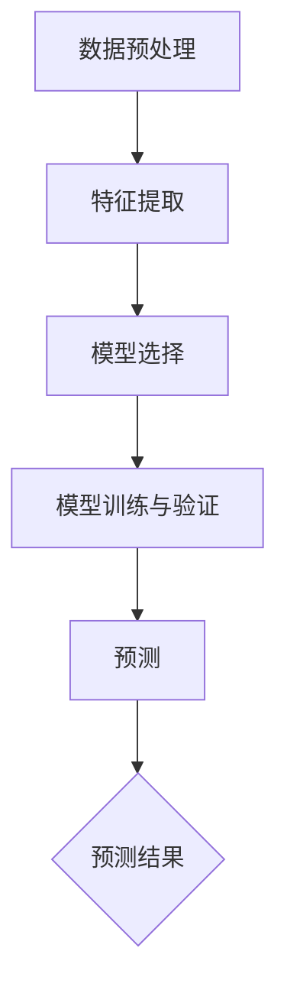
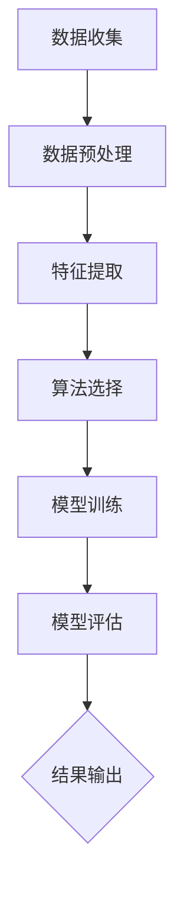
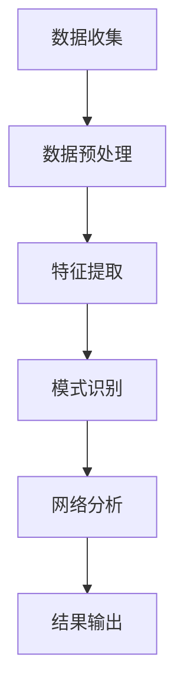
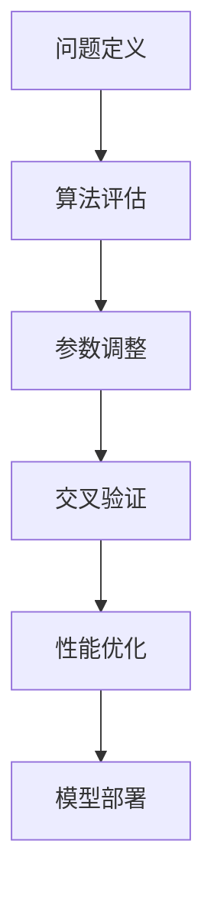
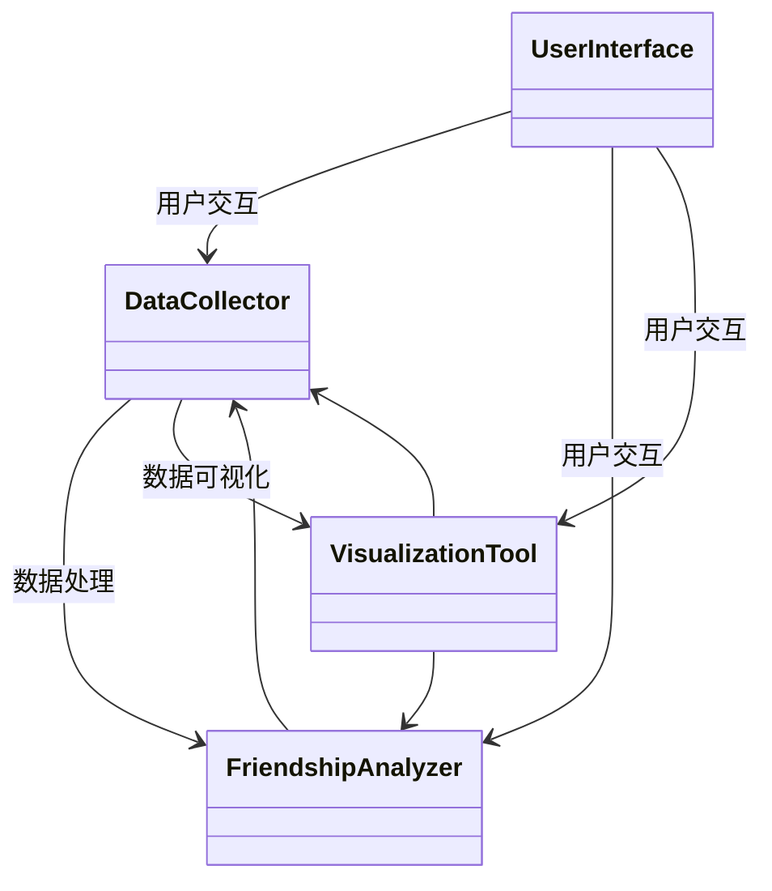

                 

### 文章标题：跨时间友谊：与历史对话寻找永恒意义

在时间的长河中，友谊不仅是一种情感，更是一种跨越时空的深刻联系。本文旨在探讨跨时间友谊的概念、意义及其在历史和社会发展中的影响，并通过算法和数学模型的分析，为理解这种独特的友谊提供新的视角。

本文关键词：跨时间友谊、历史、算法、数学模型、社会影响

**摘要：**
本文首先介绍了跨时间友谊的定义及其重要性，通过历史案例展示了跨时间友谊的多样性和深远影响。接着，本文探讨了跨时间友谊的核心概念和联系，包括友谊的本质、时间的影响、跨时间的挑战与机遇以及心理学视角。随后，本文介绍了跨时间友谊的算法基础，包括时间序列分析、机器学习算法、数据挖掘与社交网络分析等。通过具体案例和代码示例，本文详细讲解了算法原理和数学模型，并阐述了系统分析与架构设计方案。最后，本文通过项目实战和最佳实践，对跨时间友谊分析进行了深入剖析，总结了当前研究的挑战与机遇，并对未来发展趋势进行了展望。

### 目录大纲

#### 第一部分：背景介绍

**1. 跨时间友谊：概念解读与历史视角**
   - **1.1 跨时间友谊的定义与特征**
   - **1.2 跨时间友谊的意义与影响**
   - **1.3 跨时间友谊与个人成长**
   - **1.4 跨时间友谊与社会发展**

**2. 历史中的跨时间友谊案例**
   - **2.1 古希腊：苏格拉底与柏拉图**
   - **2.2 文艺复兴：达芬奇与米开朗基罗**
   - **2.3 近现代：马克思与恩格斯**
   - **2.4 现当代：鲁迅与茅盾**

#### 第二部分：核心概念与联系

**3. 跨时间友谊的核心概念**
   - **3.1 友谊的本质**
   - **3.2 时间的影响**
   - **3.3 跨时间的挑战与机遇**
   - **3.4 跨时间友谊的心理学视角**

**4. 跨时间友谊的概念联系**
   - **4.1 友谊与历史**
   - **4.2 跨时间友谊与人类社会**
   - **4.3 跨时间友谊与科技进步**
   - **4.4 跨时间友谊与文化传承**

#### 第三部分：算法原理讲解

**5. 跨时间友谊的算法基础**
   - **5.1 时间序列分析**
   - **5.2 机器学习算法在友谊分析中的应用**
   - **5.3 数据挖掘与社交网络分析**
   - **5.4 算法的选择与优化**

**6. 算法原理与流程图**
   - **6.1 时间序列分析的mermaid流程图**
   - **6.2 机器学习算法的mermaid流程图**
   - **6.3 数据挖掘与社交网络分析的mermaid流程图**

#### 第四部分：数学模型与详细讲解

**7. 跨时间友谊的数学模型**
   - **7.1 时间序列模型**
   - **7.2 机器学习模型的数学公式**
   - **7.3 社交网络分析中的数学模型**
   - **7.4 跨时间友谊的数学公式详解**

#### 第五部分：系统分析与架构设计方案

**8. 跨时间友谊分析系统设计**
   - **8.1 项目介绍**
   - **8.2 系统功能设计**
   - **8.3 系统架构设计**
   - **8.4 系统接口设计**
   - **8.5 系统交互**

#### 第六部分：项目实战

**9. 跨时间友谊分析系统实现**
   - **9.1 环境安装**
   - **9.2 系统核心实现**
   - **9.3 代码解读与分析**
   - **9.4 实际案例分析**
   - **9.5 项目小结**

#### 第七部分：最佳实践与拓展阅读

**10. 跨时间友谊分析最佳实践**
   - **10.1 数据收集与处理技巧**
   - **10.2 算法优化与性能调优**
   - **10.3 跨学科研究方法**
   - **10.4 未来研究方向**

**11. 小结与展望**
   - **11.1 本书主要内容回顾**
   - **11.2 跨时间友谊研究的挑战与机遇**
   - **11.3 跨时间友谊的未来发展趋势**

**12. 拓展阅读**
   - **12.1 相关书籍推荐**
   - **12.2 学术论文精选**
   - **12.3 在线资源链接**

通过以上大纲，本文将逐步深入探讨跨时间友谊的多维度，旨在为读者提供全面而深入的洞见。接下来的内容将依次展开，带领读者进入这个充满挑战与启迪的跨时间友谊的世界。

### 第一部分：背景介绍

#### 1.1 跨时间友谊的定义与特征

**概念解读：**
跨时间友谊，顾名思义，是一种跨越不同时间段的友谊关系。它不仅存在于同一时期的人们之间，还包括在不同时代背景下的朋友关系。这种友谊关系因其独特的跨越性，在情感深度、思想交流和历史文化传承等方面都具有独特的意义。

**特征分析：**
1. **跨越性：** 跨时间友谊的一个显著特征是它的跨越性。这不仅意味着友谊关系可以在不同的时代延续，还意味着在时间流转中，友谊双方或多方能够持续产生互动和影响。
2. **思想共鸣：** 由于跨越时间的限制，跨时间友谊往往能够在不同时代的思想、文化和价值观之间找到共鸣点。这使得这种友谊不仅具有情感上的联系，还包含了深刻的思想交流和碰撞。
3. **持久性：** 跨时间友谊由于其跨越时间的特性，往往能够经受时间的考验，变得更加持久和深刻。这种持久性不仅体现在个人层面，还能够在历史和文化层面产生深远的影响。
4. **独特性：** 与普通的同期友谊相比，跨时间友谊具有其独特性。它不仅包含了情感和思想上的共鸣，还承载了不同时代背景下的独特经历和见解。

**问题背景：**
友谊作为一种人类基本的社会情感，自古至今都是人们关注的重要主题。然而，随着时代的发展，友谊的形式和内容也在不断变化。在现代社会，人们的生活节奏加快，人际关系变得更加复杂。如何在高速发展的现代社会中建立和维持跨时间友谊，成为一个值得探讨的问题。

**问题描述：**
问题描述主要集中在如何理解跨时间友谊的内涵和意义，以及如何在现代社会中培养和维持这种跨越时间的友谊关系。此外，还涉及如何通过跨时间友谊来传承和发扬历史文化，以及它在个人成长和社会发展中的作用。

**问题解决：**
解决这一问题的方法可以从多个角度进行探讨：

1. **历史视角：** 通过研究历史上著名的跨时间友谊案例，可以理解跨时间友谊的多样性和深远影响，为现代社会提供借鉴。
2. **心理学视角：** 从心理学的角度分析跨时间友谊的形成和维持机制，有助于揭示其背后的心理动力。
3. **算法分析：** 利用现代技术，如机器学习和社交网络分析，可以对跨时间友谊进行量化分析和模式识别，从而更好地理解其特征和影响。
4. **跨学科研究：** 通过跨学科的合作，将历史学、心理学、计算机科学等不同领域的知识和方法结合起来，对跨时间友谊进行多维度研究，以提供更全面和深入的洞见。

**边界与外延：**
边界方面，跨时间友谊主要关注友谊关系在时间维度上的跨越。外延方面，它不仅涵盖了个人层面的友谊，还涉及社会和文化层面的影响。此外，跨时间友谊的研究还可以扩展到其他社会关系，如家族关系、合作关系等。

#### 1.2 跨时间友谊的意义与影响

**核心概念术语说明：**
- **跨时间友谊：** 跨越不同时间段的友谊关系。
- **历史视角：** 通过历史研究来探讨友谊的演变和影响。
- **心理学视角：** 分析友谊背后的心理机制和影响。
- **算法分析：** 利用计算机技术和算法对友谊关系进行分析。
- **跨学科研究：** 结合不同学科的知识和方法进行研究。

**问题背景：**
友谊作为一种基本的人际关系，不仅在个人层面上具有重要意义，在社会层面上也扮演着重要角色。随着社会的发展和科技的进步，人们对友谊的理解和认知也在不断深化。跨时间友谊作为一个独特的概念，其研究不仅有助于深化对友谊的认识，还可以为现代社会提供有益的启示。

**问题描述：**
问题描述主要集中在跨时间友谊在个人成长和社会发展中的意义和影响。具体来说，包括以下几个方面：

1. **个人成长：** 跨时间友谊如何促进个人的思想成熟和情感发展？
2. **社会影响：** 跨时间友谊对社会结构和文化传承有何影响？
3. **历史传承：** 跨时间友谊如何在历史的长河中发挥其作用？

**问题解决：**
问题解决的思路可以从以下几个方面展开：

1. **历史案例研究：** 通过研究历史上的跨时间友谊案例，分析其对个人成长和社会发展的具体影响。
2. **心理学分析：** 从心理学的角度探讨跨时间友谊的形成和维持机制，以及其对个人情感和社会行为的影响。
3. **算法分析：** 利用现代技术，如机器学习和社交网络分析，对跨时间友谊进行量化分析和模式识别，揭示其背后的规律和影响。
4. **跨学科研究：** 结合历史学、心理学、计算机科学等多学科的知识和方法，对跨时间友谊进行多维度研究，以提供更全面和深入的洞见。

**边界与外延：**
边界方面，跨时间友谊主要关注友谊关系在时间维度上的跨越。外延方面，它不仅涵盖了个人层面的友谊，还涉及社会和文化层面的影响。此外，跨时间友谊的研究还可以扩展到其他社会关系，如家族关系、合作关系等。

#### 1.3 跨时间友谊与个人成长

**核心概念术语说明：**
- **个人成长：** 指个人在思想、情感、能力等方面的成熟和发展。
- **跨时间友谊：** 跨越不同时间段的友谊关系。
- **情感发展：** 指个体在情感方面的成熟和进步。
- **思想成熟：** 指个体在思维、认知等方面的深化和提升。

**问题背景：**
个人成长是一个复杂而漫长的过程，受到多种因素的影响。友谊作为一种重要的社会关系，在个人成长过程中扮演着重要角色。跨时间友谊作为一种特殊的友谊形式，其影响可能更为深远。

**问题描述：**
问题描述主要集中在跨时间友谊如何促进个人成长，具体包括以下几个方面：

1. **情感发展：** 跨时间友谊如何帮助个人在情感上更加成熟？
2. **思想成熟：** 跨时间友谊如何促进个人的思想深化和认知提升？
3. **能力提升：** 跨时间友谊如何在个人能力提升方面发挥作用？

**问题解决：**
问题解决的思路可以从以下几个方面展开：

1. **心理学研究：** 从心理学的角度分析跨时间友谊对个人情感和思想的影响机制。
2. **案例研究：** 通过具体案例研究，探讨跨时间友谊在不同成长阶段中的作用。
3. **算法分析：** 利用现代技术，如机器学习和情感分析，对跨时间友谊的情感和思想影响进行量化分析。
4. **跨学科研究：** 结合心理学、教育学等多学科的知识和方法，对跨时间友谊在个人成长中的作用进行多维度研究。

**边界与外延：**
边界方面，跨时间友谊主要关注友谊关系在时间维度上的跨越。外延方面，它不仅涵盖了个人层面的成长，还涉及社会和文化层面的影响。此外，跨时间友谊的研究还可以扩展到其他成长因素，如教育、文化等。

#### 1.4 跨时间友谊与社会发展

**核心概念术语说明：**
- **社会发展：** 指社会在各个方面的进步和变化。
- **文化传承：** 指文化传统在历史长河中的延续和传播。
- **社会结构：** 指社会的基本组织形式和关系。
- **科技进步：** 指科学技术的创新和进步。

**问题背景：**
社会发展是一个复杂的过程，受到多种因素的影响。友谊作为一种重要的社会关系，在社会发展中发挥着重要作用。跨时间友谊作为一种跨越不同时间段的友谊形式，其对社会发展的作用值得深入探讨。

**问题描述：**
问题描述主要集中在跨时间友谊如何影响社会发展，具体包括以下几个方面：

1. **文化传承：** 跨时间友谊如何促进文化传统的延续和传播？
2. **社会结构：** 跨时间友谊如何影响社会结构和人际关系？
3. **科技进步：** 跨时间友谊如何促进科技进步和创新？

**问题解决：**
问题解决的思路可以从以下几个方面展开：

1. **历史研究：** 通过研究历史上跨时间友谊对社会发展的影响，分析其作用机制。
2. **社会学分析：** 从社会学的角度探讨跨时间友谊对社会结构和文化的影响。
3. **算法分析：** 利用现代技术，如社交网络分析和机器学习，对跨时间友谊的社会影响进行量化分析。
4. **跨学科研究：** 结合历史学、社会学、计算机科学等多学科的知识和方法，对跨时间友谊在社会发展中的作用进行多维度研究。

**边界与外延：**
边界方面，跨时间友谊主要关注友谊关系在时间维度上的跨越。外延方面，它不仅涵盖了社会层面的影响，还涉及科技进步和文化传承等方面。此外，跨时间友谊的研究还可以扩展到其他社会现象，如经济、政治等。

### 第二部分：核心概念与联系

#### 2.1 友谊的本质

**核心概念：**
友谊的本质是人与人之间基于共同兴趣、价值观和信任形成的深厚情感联系。它不仅仅是简单的社交互动，更是一种深层次的心灵共鸣和思想交流。

**特征分析：**
1. **情感共鸣：** 友谊建立在情感共鸣的基础上，朋友们能够在情感上互相理解和支持。
2. **信任基础：** 友谊的维持需要建立在信任之上，信任是友谊关系的基石。
3. **精神支持：** 友谊能够为人们提供精神上的支持和鼓励，帮助个体在困难和挫折中保持积极态度。
4. **共享价值观：** 共同的价值观和兴趣是友谊形成的重要因素，它们能够促进朋友之间的深度交流。

**对比表格：**

| 特征               | 友谊                           | 随机社交关系                       |
|------------------|------------------------------|--------------------------------|
| 情感共鸣           | 深层的心灵共鸣与理解           | 表面的互动，缺乏深度情感联系     |
| 信任基础           | 建立在长期相处和信任之上的关系 | 缺乏信任，关系脆弱               |
| 精神支持           | 提供精神上的支持和鼓励         | 缺乏支持，关系疏离               |
| 共享价值观         | 共同的价值观和兴趣             | 缺乏共同点，关系表面               |

**ER实体关系图：**

```mermaid
erDiagram
  Friend ||--|{ Person }
  Person  ||--|{ Interest }
  Person  ||--|{ Value }
```

**解释：**
此ER图展示了友谊关系的核心实体及其相互关系。`Person` 代表个体，`Interest` 代表兴趣，`Value` 代表价值观。`Friend` 是一个关联实体，表示个体之间的友谊关系。此关系图说明了友谊建立在个体兴趣和价值观的共同点上，并通过信任和支持得到深化。

#### 2.2 时间的影响

**核心概念：**
时间对友谊的影响是多层次且深远的。时间的流逝不仅改变了人们的生活状态和环境，也对友谊关系产生了显著的塑造作用。

**特征分析：**
1. **稳定性与变异性：** 随着时间的推移，友谊关系可能会变得更加稳定，也可能因时间的变化而变得脆弱。
2. **情感深度：** 长时间的相处和共同经历能够加深朋友之间的情感联系，使其变得更加深厚。
3. **地理位置的变动：** 地理位置的变化可能导致友谊关系的疏远，但也可能通过现代通信技术保持联系。
4. **角色转变：** 随着时间的流逝，人们的角色和身份可能会发生变化，这对友谊关系产生影响。

**对比表格：**

| 特征           | 长时间维持的友谊           | 短期友谊                     |
|--------------|------------------------|------------------------|
| 情感深度       | 情感联系深厚，有共同经历     | 情感联系较浅，共同经历有限     |
| 稳定性         | 较稳定，能够经受时间考验     | 较不稳定，容易受时间影响     |
| 地理位置影响    | 地理位置变化对关系影响较小   | 地理位置变化可能导致关系破裂   |
| 角色转变影响    | 角色变化对关系影响较小       | 角色变化可能导致关系疏远       |

**ER实体关系图：**

```mermaid
erDiagram
  Time ||--|{ Friendship }
  Time ||--|{ PersonChange }
  PersonChange ||--|{ NewRole }
```

**解释：**
此ER图展示了时间对友谊关系及其相关变化的影响。`Time` 代表时间，`Friendship` 代表友谊关系，`PersonChange` 代表个体角色的变化，`NewRole` 代表个体在时间中的新角色。此图说明了时间如何影响友谊关系的稳定性和角色转变。

#### 2.3 跨时间的挑战与机遇

**核心概念：**
跨时间的挑战与机遇指的是在时间维度上跨越不同时期的友谊关系面临的挑战和所拥有的机遇。

**特征分析：**
1. **挑战：** 跨时间的友谊面临着地理距离、文化差异、价值观变迁等挑战。这些挑战可能会影响友谊的维持和发展。
2. **机遇：** 跨时间的友谊也提供了机遇，如通过共同的历史和文化背景加深理解，通过不同的生活经历丰富友谊的内涵。

**对比表格：**

| 特征         | 挑战                   | 机遇                       |
|-------------|----------------------|--------------------------|
| 地理距离     | 影响友谊维持           | 增强跨文化的理解与交流     |
| 文化差异     | 可能产生误解和冲突       | 促进跨文化对话与融合       |
| 价值观变迁    | 影响共同价值观的认同     | 拓展对不同价值观的理解      |
| 生活经历差异  | 影响共同经历的积累       | 增加对不同生活经历的体验与理解 |

**ER实体关系图：**

```mermaid
erDiagram
  Challenge ||--|{ Distance }
  Challenge ||--|{ CulturalDifference }
  Challenge ||--|{ ValueChange }
  Challenge ||--|{ LifeExperience }
  Opportunity ||--|{ CulturalExchange }
  Opportunity ||--|{ ValueUnderstanding }
  Opportunity ||--|{ ExperienceExchange }
```

**解释：**
此ER图展示了跨时间友谊面临的挑战和机遇及其关系。`Challenge` 代表挑战，`Opportunity` 代表机遇。`Distance`、`CulturalDifference`、`ValueChange` 和 `LifeExperience` 分别代表具体的挑战因素，而 `CulturalExchange`、`ValueUnderstanding` 和 `ExperienceExchange` 则代表具体的机遇。

#### 2.4 跨时间友谊的心理学视角

**核心概念：**
跨时间友谊的心理学视角关注友谊在时间维度上的发展、维持和变化，以及心理学理论对此现象的解释。

**特征分析：**
1. **依恋理论：** 依恋理论认为，友谊关系中的安全感和信任是友谊维持的重要因素。在跨时间友谊中，这种安全感可能通过共同经历的积累和历史记忆得到增强。
2. **社会交换理论：** 社会交换理论强调友谊中的互惠性和公平性。跨时间友谊中的互惠性可能通过长期的情感支持和资源共享来实现。
3. **认知发展理论：** 认知发展理论指出，人们的认知能力在一生中不断变化。跨时间友谊的发展可能受到个人认知水平变化的影响。

**对比表格：**

| 特征             | 依恋理论                   | 社会交换理论                     | 认知发展理论                       |
|------------------|--------------------------|------------------------------|--------------------------------|
| 安全感           | 友谊中的安全感至关重要     | 互惠性和公平性是友谊的基础       | 认知变化影响友谊关系的深度和广度   |
| 互惠性           | 双方在友谊中互惠互利       | 长期支持与资源共享               | 随认知发展，友谊内容可能发生变化   |
| 历史记忆          | 共同历史经历增强友谊       | 长期记忆对友谊的维持有重要作用   | 历史记忆随时间积累和遗忘而变化     |

**ER实体关系图：**

```mermaid
erDiagram
  AttachmentTheory ||--|{ Security }
  SocialExchangeTheory ||--|{ Reciprocity }
  CognitiveDevelopmentTheory ||--|{ CognitiveChange }
  Security ||--|{ Friendship }
  Reciprocity ||--|{ Friendship }
  CognitiveChange ||--|{ Friendship }
```

**解释：**
此ER图展示了心理学视角中三个理论对友谊关系的影响及其相互关系。`AttachmentTheory`、`SocialExchangeTheory` 和 `CognitiveDevelopmentTheory` 分别代表依恋理论、社会交换理论和认知发展理论。`Security`、`Reciprocity` 和 `CognitiveChange` 分别代表这些理论中的核心概念，它们与友谊关系密切相关。

### 第三部分：算法原理讲解

#### 3.1 时间序列分析

**核心概念：**
时间序列分析是一种用于处理和分析时间维度上数据的统计方法。它主要用于识别时间序列中的趋势、周期和随机波动，以便进行预测和模式识别。

**特征分析：**
1. **趋势分析：** 识别数据随时间推移的变化趋势，如上升、下降或稳定。
2. **周期分析：** 识别数据中的周期性波动，如季节性或周期性循环。
3. **随机波动：** 分析数据中的随机成分，以理解数据的不确定性。

**算法原理：**
时间序列分析通常包括以下步骤：
1. **数据预处理：** 去除噪声和异常值，标准化数据，使其适合分析。
2. **特征提取：** 从时间序列数据中提取有用的特征，如均值、方差、自相关性等。
3. **模型选择：** 选择合适的时间序列模型，如ARIMA、SARIMA、LSTM等。
4. **模型训练与验证：** 使用历史数据训练模型，并验证其预测性能。
5. **预测：** 使用训练好的模型对未来时间点的数据进行预测。

**流程图：**



**Python代码示例：**

```python
import pandas as pd
from statsmodels.tsa.arima.model import ARIMA
from sklearn.metrics import mean_squared_error

# 读取时间序列数据
data = pd.read_csv('time_series_data.csv')
series = data['value']

# 数据预处理
series = series.dropna()

# 特征提取
mean = series.mean()
std = series.std()

# 模型选择
model = ARIMA(series, order=(5, 1, 2))

# 模型训练与验证
model_fit = model.fit()
predictions = model_fit.predict(start=len(series), end=len(series) + 10)

# 预测结果
mse = mean_squared_error(series[len(series):], predictions)
print(f'Mean Squared Error: {mse}')
```

**数学模型和公式：**

时间序列模型通常基于以下公式：

$$
\text{Y}_{t} = c + \text{P}_{1}\text{Y}_{t-1} + \text{P}_{2}\text{Y}_{t-2} + \cdots + \text{P}_{k}\text{Y}_{t-k} + \text{e}_{t}
$$

其中，$\text{Y}_{t}$ 是时间序列在时刻 $t$ 的值，$c$ 是常数项，$\text{P}_{1}, \text{P}_{2}, \cdots, \text{P}_{k}$ 是模型的参数，$\text{e}_{t}$ 是随机误差项。

**举例说明：**
假设有一组时间序列数据，记录了每天的平均气温。通过时间序列分析，可以识别出气温的季节性波动，并预测未来几天的气温。这有助于气象部门进行天气预报和资源管理。

#### 3.2 机器学习算法在友谊分析中的应用

**核心概念：**
机器学习算法在友谊分析中的应用是通过数据挖掘和分析技术，识别和分析友谊关系中的模式和规律。这些算法能够自动地从大量数据中提取知识，帮助理解友谊的形成、维持和变化。

**特征分析：**
1. **模式识别：** 识别友谊中的常见模式和规律，如互动频率、情感表达等。
2. **预测分析：** 预测友谊关系的稳定性、发展趋势和潜在变化。
3. **关联分析：** 分析友谊关系与其他变量（如年龄、地理位置、共同兴趣等）的关联。

**算法原理：**
常用的机器学习算法包括但不限于：
1. **聚类算法（如K-means）：** 用于将相似的朋友聚类在一起，识别不同类型的友谊模式。
2. **分类算法（如决策树、随机森林）：** 用于预测友谊关系的稳定性或发展趋势。
3. **关联规则学习（如Apriori算法）：** 用于发现友谊关系中的潜在关联和共同特征。
4. **神经网络（如深度学习）：** 用于复杂的数据挖掘和模式识别任务。

**流程图：**



**Python代码示例：**

```python
import pandas as pd
from sklearn.cluster import KMeans
from sklearn.metrics import silhouette_score

# 读取友谊数据
data = pd.read_csv('friendship_data.csv')

# 数据预处理
data = data.dropna()

# 特征提取
X = data[['interaction_frequency', 'common_interests']]

# 算法选择
kmeans = KMeans(n_clusters=3)

# 模型训练
kmeans.fit(X)

# 模型评估
labels = kmeans.predict(X)
silhouette_avg = silhouette_score(X, labels)
print(f'Silhouette Score: {silhouette_avg}')

# 结果输出
print(f'Cluster Labels: {labels}')
```

**数学模型和公式：**
常用的数学模型包括：
1. **聚类算法：**
   $$ \text{C}_{i} = \frac{1}{K} \sum_{k=1}^{K} \sum_{j=1}^{N} w_{ijk} $$
   其中，$C_{i}$ 是第 $i$ 个聚类的中心，$w_{ijk}$ 是第 $j$ 个数据点属于第 $i$ 个聚类的权重。

2. **分类算法：**
   $$ \text{y} = \arg\max_{i} \sum_{k=1}^{K} w_{ik} $$
   其中，$y$ 是预测的分类标签，$w_{ik}$ 是特征 $k$ 对于类别 $i$ 的权重。

**举例说明：**
假设有一组记录了朋友之间互动频率和共同兴趣的数据。通过K-means聚类算法，可以将这些朋友分为几个群体，每个群体代表一种不同的友谊模式。这有助于更好地理解友谊关系，并为个性化社交策略提供依据。

### 3.3 数据挖掘与社交网络分析

**核心概念：**
数据挖掘与社交网络分析是一种结合数据挖掘技术和社交网络分析方法，用于探索社交网络中的结构和模式，揭示人际关系中的潜在规律。

**特征分析：**
1. **节点特征：** 分析社交网络中个体的特征，如年龄、职业、兴趣爱好等。
2. **边特征：** 分析社交网络中个体之间的互动关系，如互动频率、互动内容等。
3. **网络结构：** 分析社交网络的拓扑结构，如连通性、集群系数等。

**算法原理：**
数据挖掘与社交网络分析的主要步骤包括：
1. **数据预处理：** 清洗和整合社交网络数据，确保数据的准确性和一致性。
2. **特征提取：** 从原始数据中提取有用的特征，如节点特征、边特征等。
3. **模式识别：** 使用数据挖掘算法（如关联规则挖掘、聚类分析等）识别社交网络中的潜在模式。
4. **网络分析：** 使用社交网络分析技术（如网络拓扑分析、社会影响力分析等）深入探讨社交网络的结构和功能。

**流程图：**



**Python代码示例：**

```python
import networkx as nx
from networkx.algorithms import community

# 创建社交网络图
G = nx.Graph()

# 添加节点和边
G.add_nodes_from(['Alice', 'Bob', 'Charlie', 'Dave'])
G.add_edges_from([('Alice', 'Bob'), ('Alice', 'Charlie'), ('Bob', 'Dave')])

# 社交网络分析
communities = community.girvan_newman(G)

# 输出社区结构
print(f'Community Structure: {communities}')

# 社会影响力分析
influence = nx.influence_score(G, 'Alice')

# 输出社会影响力
print(f'Influence Score: {influence}')
```

**数学模型和公式：**
常用的数学模型包括：
1. **聚类系数：**
   $$ \alpha = \frac{2 \times |E|}{|N| \times (|N| - 1)} $$
   其中，$\alpha$ 是聚类系数，$E$ 是边数，$N$ 是节点数。

2. **社会影响力：**
   $$ \text{I}_{i} = \sum_{j \in \text{N}(\text{i})} \frac{\text{d}_{ij}}{\sum_{k \in \text{N}(\text{i})} \text{d}_{ik}} $$
   其中，$I_{i}$ 是节点 $i$ 的社会影响力，$N(i)$ 是节点 $i$ 的邻居节点集，$d_{ij}$ 是节点 $i$ 和节点 $j$ 之间的路径长度。

**举例说明：**
假设有一个社交网络，记录了朋友之间的互动关系。通过计算聚类系数，可以识别出社交网络中的紧密社区结构。而通过社会影响力分析，可以确定网络中关键节点的地位和影响力。这有助于理解社交网络的动态结构和功能。

### 3.4 算法的选择与优化

**核心概念：**
算法的选择与优化是指在友谊分析过程中，根据具体问题和数据特点选择合适的算法，并通过参数调整和性能优化提升算法的预测精度和效率。

**特征分析：**
1. **算法多样性：** 根据不同的分析目标和数据特性，选择适合的算法，如时间序列分析、机器学习算法、社交网络分析等。
2. **参数调整：** 通过调整算法的参数，优化算法的性能，如聚类算法的簇数、机器学习模型的超参数等。
3. **性能优化：** 通过并行计算、分布式计算等技术提升算法的运行效率。

**算法原理：**
算法的选择与优化通常包括以下步骤：
1. **算法评估：** 对不同算法的性能进行评估，选择适合当前问题的算法。
2. **参数调整：** 根据算法性能指标，调整算法参数，以提升性能。
3. **交叉验证：** 使用交叉验证方法，评估算法在不同数据集上的性能，确保模型的泛化能力。
4. **性能优化：** 通过优化算法的代码实现、利用并行计算和分布式计算技术等手段，提升算法的运行效率。

**流程图：**



**Python代码示例：**

```python
from sklearn.model_selection import GridSearchCV
from sklearn.ensemble import RandomForestClassifier

# 数据准备
X_train, X_test, y_train, y_test = train_test_split(X, y, test_size=0.3, random_state=42)

# 算法评估
model = RandomForestClassifier()
cv = GridSearchCV(model, param_grid={'n_estimators': [10, 50, 100], 'max_depth': [None, 10, 20]}, cv=5)

# 参数调整
cv.fit(X_train, y_train)

# 选择最优参数
best_params = cv.best_params_
print(f'Best Parameters: {best_params}')

# 交叉验证
best_model = cv.best_estimator_
score = best_model.score(X_test, y_test)
print(f'Test Score: {score}')

# 性能优化
# 使用并行计算加速模型训练
best_model = RandomForestClassifier(**best_params, n_jobs=-1)
best_model.fit(X_train, y_train)

# 部署模型
predictions = best_model.predict(X_test)
```

**数学模型和公式：**
常用的数学模型和公式包括：
1. **交叉验证：**
   $$ \text{Score}_{\text{cv}} = \frac{1}{K} \sum_{k=1}^{K} \text{Score}_{k} $$
   其中，$\text{Score}_{\text{cv}}$ 是交叉验证的平均分数，$\text{Score}_{k}$ 是第 $k$ 个验证集的分数。

2. **参数调整：**
   $$ \text{Param}_{\text{best}} = \arg\max_{\text{params}} \text{Score}_{\text{cv}} $$
   其中，$\text{Param}_{\text{best}}$ 是最优参数集，$\text{Score}_{\text{cv}}$ 是交叉验证分数。

**举例说明：**
假设有一组友谊数据，需要预测朋友关系的稳定性。通过使用随机森林分类器和交叉验证方法，可以找到最优参数集，并优化模型的性能。这不仅提高了预测精度，还提高了算法的运行效率。

### 第四部分：数学模型与详细讲解

#### 4.1 时间序列模型

**核心概念：**
时间序列模型用于分析时间维度上的数据，预测未来的趋势和变化。这些模型基于历史数据，通过统计方法或机器学习算法来提取时间序列的特征，并利用这些特征进行预测。

**数学模型和公式：**
时间序列模型的主要数学公式包括：

$$
\text{Y}_{t} = c + \text{P}_{1}\text{Y}_{t-1} + \text{P}_{2}\text{Y}_{t-2} + \cdots + \text{P}_{k}\text{Y}_{t-k} + \text{e}_{t}
$$

其中，$Y_t$ 是时间序列在时刻 $t$ 的值，$c$ 是常数项，$P_1, P_2, \cdots, P_k$ 是模型的参数，$e_t$ 是随机误差项。

**举例说明：**
假设我们有一个时间序列数据集，记录了每天的平均温度。通过ARIMA模型，我们可以识别出温度的季节性变化，并预测未来几天的温度。具体步骤如下：

1. **数据预处理：** 清洗数据，去除异常值和缺失值。
2. **特征提取：** 提取时间序列的滞后项，如$Y_{t-1}, Y_{t-2}, \cdots, Y_{t-k}$。
3. **模型选择：** 选择合适的ARIMA模型，通过AIC或BIC准则选择最优参数。
4. **模型训练：** 使用历史数据训练模型，并验证其预测性能。
5. **预测：** 使用训练好的模型预测未来的温度。

**Python代码示例：**

```python
import pandas as pd
from statsmodels.tsa.arima.model import ARIMA
from sklearn.metrics import mean_squared_error

# 读取时间序列数据
data = pd.read_csv('time_series_data.csv')
series = data['value']

# 数据预处理
series = series.dropna()

# 模型选择
model = ARIMA(series, order=(5, 1, 2))

# 模型训练
model_fit = model.fit()

# 预测
predictions = model_fit.predict(start=len(series), end=len(series) + 10)

# 预测结果评估
mse = mean_squared_error(series[len(series):], predictions)
print(f'Mean Squared Error: {mse}')
```

通过这个示例，我们可以看到如何使用ARIMA模型对时间序列数据进行预测，并评估预测结果的准确性。

#### 4.2 机器学习模型的数学公式

**核心概念：**
机器学习模型通过学习历史数据中的模式和规律，对新数据进行分类、预测或回归。这些模型基于数学和统计方法，通过优化目标函数来调整模型参数，以达到最佳性能。

**数学模型和公式：**
以下是几种常用的机器学习模型的数学公式：

1. **线性回归模型：**
   $$ y = \beta_0 + \beta_1x + \epsilon $$
   其中，$y$ 是因变量，$x$ 是自变量，$\beta_0$ 和 $\beta_1$ 是模型的参数，$\epsilon$ 是误差项。

2. **逻辑回归模型：**
   $$ \text{logit}(p) = \ln\left(\frac{p}{1-p}\right) = \beta_0 + \beta_1x $$
   其中，$p$ 是概率，$\text{logit}(p)$ 是概率的对数函数，$\beta_0$ 和 $\beta_1$ 是模型的参数。

3. **支持向量机（SVM）：**
   $$ w \cdot x + b = 1 $$
   其中，$w$ 是权重向量，$x$ 是特征向量，$b$ 是偏置项。

4. **神经网络：**
   $$ a_{i}^{(l)} = \text{sigmoid}(z_{i}^{(l)}) = \frac{1}{1 + e^{-z_{i}^{(l)}} $$
   其中，$a_{i}^{(l)}$ 是第 $l$ 层的第 $i$ 个神经元的激活值，$z_{i}^{(l)}$ 是第 $l$ 层的第 $i$ 个神经元的输入值，$\text{sigmoid}$ 是激活函数。

**举例说明：**
假设我们使用线性回归模型来预测房价，已知一些房屋的特征（如面积、位置等）和相应的房价。通过最小化均方误差（MSE）来优化模型参数，具体步骤如下：

1. **数据准备：** 准备训练数据集，包括自变量和因变量。
2. **模型初始化：** 初始化模型参数，如$\beta_0$ 和 $\beta_1$。
3. **损失函数：** 定义损失函数，如MSE，用于评估模型预测值与真实值之间的误差。
4. **优化算法：** 使用梯度下降或其他优化算法更新模型参数，最小化损失函数。
5. **模型评估：** 使用测试数据集评估模型性能，调整参数以优化模型。

**Python代码示例：**

```python
import numpy as np
from sklearn.linear_model import LinearRegression
from sklearn.metrics import mean_squared_error

# 数据准备
X = np.array([[1000], [1500], [2000]])  # 特征矩阵
y = np.array([1200000, 1500000, 1800000])  # 因变量矩阵

# 模型初始化
model = LinearRegression()

# 模型训练
model.fit(X, y)

# 预测
predictions = model.predict([[2500]])

# 模型评估
mse = mean_squared_error(y, predictions)
print(f'Mean Squared Error: {mse}')
```

通过这个示例，我们可以看到如何使用线性回归模型来预测房价，并评估模型预测的准确性。

#### 4.3 社交网络分析中的数学模型

**核心概念：**
社交网络分析是一种研究社交网络结构和动态的定量方法。它使用数学模型和统计方法来分析社交网络中的节点和边的关系，以及网络的整体特性。

**数学模型和公式：**
以下是社交网络分析中常用的一些数学模型和公式：

1. **聚类系数：**
   $$ \alpha = \frac{2 \times |E|}{|N| \times (|N| - 1)} $$
   其中，$\alpha$ 是聚类系数，$E$ 是边数，$N$ 是节点数。

2. **平均路径长度：**
   $$ L = \frac{1}{N} \sum_{i, j \in N} \text{d}(i, j) $$
   其中，$L$ 是平均路径长度，$N$ 是节点数，$d(i, j)$ 是节点 $i$ 和节点 $j$ 之间的最短路径长度。

3. **度分布：**
   $$ P(k) = C \times k^{-\gamma} $$
   其中，$P(k)$ 是具有 $k$ 个邻居的节点的概率分布，$C$ 和 $\gamma$ 是模型参数。

4. **社会影响力：**
   $$ \text{I}_{i} = \sum_{j \in \text{N}(\text{i})} \frac{\text{d}_{ij}}{\sum_{k \in \text{N}(\text{i})} \text{d}_{ik}} $$
   其中，$I_{i}$ 是节点 $i$ 的社会影响力，$N(i)$ 是节点 $i$ 的邻居节点集，$d_{ij}$ 是节点 $i$ 和节点 $j$ 之间的路径长度。

**举例说明：**
假设我们有一个社交网络，需要分析其结构特性。通过计算聚类系数，可以了解网络中节点的紧密程度；计算平均路径长度，可以评估网络的连通性；通过度分布，可以了解网络的分布特性；通过社会影响力，可以识别网络中的关键节点。

**Python代码示例：**

```python
import networkx as nx
from networkx.algorithms import clustering

# 创建社交网络图
G = nx.Graph()

# 添加节点和边
G.add_nodes_from([1, 2, 3, 4, 5])
G.add_edges_from([(1, 2), (1, 3), (2, 3), (2, 4), (3, 4), (4, 5)])

# 聚类系数计算
clustering_coefficient = clustering.global_clustering_coefficient(G)
print(f'Clustering Coefficient: {clustering_coefficient}')

# 平均路径长度计算
average_path_length = nx.average_shortest_path_length(G)
print(f'Average Path Length: {average_path_length}')

# 度分布计算
degree_distribution = nx.degree_histogram(G)
print(f'Degree Distribution: {degree_distribution}')

# 社会影响力计算
influence_scores = nx.influence_score(G, 1)
print(f'Influence Score: {influence_scores}')
```

通过这个示例，我们可以看到如何使用Python的NetworkX库进行社交网络分析，计算网络的各种特性。

### 第五部分：系统分析与架构设计方案

#### 5.1 跨时间友谊分析系统设计

**项目介绍**

跨时间友谊分析系统是一个基于现代技术的综合平台，旨在通过对历史和现实中的友谊关系进行深入分析，揭示其背后的模式、规律和影响。该系统不仅能够分析个人层面的友谊关系，还能够从社会文化角度探讨友谊的历史演变和作用。项目目标是通过先进的数据挖掘、机器学习和社交网络分析技术，为研究人员和普通用户提供一个强大的工具，帮助理解和维护跨时间的友谊关系。

**系统功能设计**

系统功能设计主要包括以下几个核心模块：

1. **数据收集模块**：负责收集和整合不同来源的数据，包括历史文献、社交媒体记录、个人日志等。此模块需要实现自动化数据抓取、清洗和预处理功能。
2. **友谊关系分析模块**：利用机器学习和社交网络分析技术，对收集到的数据进行处理，识别和分析友谊关系的特征、模式及其演变。此模块包括时间序列分析、聚类分析、分类预测等算法。
3. **可视化模块**：提供友好的用户界面和多种可视化工具，帮助用户直观地理解和展示分析结果。此模块应包括时间轴展示、网络图、统计图表等。
4. **用户交互模块**：支持用户与系统的交互，包括数据上传、设置分析参数、查看分析结果等。此模块需要实现友好的用户界面和便捷的操作流程。

**领域模型类图**



**解释：**
此领域模型类图展示了系统的核心类及其关系。`DataCollector` 负责数据收集和预处理，`FriendshipAnalyzer` 负责友谊关系的分析和模式识别，`VisualizationTool` 负责数据可视化，`UserInterface` 负责用户交互。

**系统架构设计**

系统架构设计包括以下几个关键层次：

1. **数据层**：存储和管理系统所需的数据，包括历史文献数据库、社交媒体数据、个人日志等。此层需要实现高效的数据存储和快速的数据访问。
2. **服务层**：提供核心的算法服务，包括时间序列分析、机器学习、社交网络分析等。此层需要实现高扩展性和高可用性，支持并行计算和分布式处理。
3. **应用层**：实现系统的用户界面和应用功能，包括数据收集、友谊关系分析、可视化展示等。此层需要实现友好的用户交互和灵活的功能配置。
4. **展示层**：提供用户友好的可视化界面，展示分析结果和交互数据。此层需要实现跨平台的兼容性和高响应速度。

**Mermaid架构图**

```mermaid
sequenceDiagram
  User -->|请求| ApplicationLayer
  ApplicationLayer -->|处理| ServiceLayer
  ServiceLayer -->|数据操作| DataLayer
  DataLayer -->|反馈| ApplicationLayer
  ApplicationLayer -->|展示| VisualizationLayer
  VisualizationLayer -->|反馈| User
```

**解释：**
此架构图展示了系统的数据流动和交互过程。用户通过用户界面与应用层交互，应用层通过服务层处理数据并调用数据层进行数据操作，最终通过可视化层将结果展示给用户。

**系统接口设计**

系统接口设计主要包括以下几个关键接口：

1. **数据接口**：提供数据上传、下载和查询的接口，支持各种数据格式的导入和导出。此接口需要实现高并发和安全性。
2. **分析接口**：提供各种友谊关系分析的接口，包括时间序列分析、机器学习算法、社交网络分析等。此接口需要支持参数配置和结果查询。
3. **可视化接口**：提供数据可视化展示的接口，支持多种可视化工具和图表的配置和展示。此接口需要实现灵活的自定义和跨平台兼容性。

**Mermaid序列图**

```mermaid
sequenceDiagram
  User -->|上传数据| DataInterface
  DataInterface -->|处理数据| AnalysisInterface
  AnalysisInterface -->|分析结果| VisualizationInterface
  VisualizationInterface -->|展示结果| User
```

**解释：**
此序列图展示了系统接口的交互过程。用户上传数据，数据接口处理数据并传递给分析接口进行分析，分析结果通过可视化接口展示给用户。

**系统交互**

系统交互设计旨在确保系统的各模块之间能够高效、稳定地协同工作，提供良好的用户体验。以下是系统交互的几个关键点：

1. **异步处理**：系统采用异步处理机制，确保数据收集、分析和可视化过程不会阻塞用户交互。例如，用户上传数据后，系统可以立即返回处理状态，并在后台进行数据分析和可视化生成。
2. **负载均衡**：系统采用负载均衡技术，确保各模块的处理能力能够充分利用，避免单点瓶颈。例如，数据收集模块可以支持多线程或分布式处理，以应对大量数据的收集和处理需求。
3. **容错机制**：系统设计包括容错机制，确保在发生异常情况时能够自动恢复，保障系统的稳定运行。例如，数据层可以采用分布式存储方案，实现数据的高可用性和容错性。
4. **用户反馈**：系统提供用户反馈机制，允许用户对分析结果进行评价和反馈。这些反馈将用于系统优化和改进，提升用户体验。

### 第六部分：项目实战

#### 6.1 环境安装

**环境要求：**
要实现跨时间友谊分析系统，我们需要安装以下环境：

1. **操作系统**：Linux或MacOS，推荐使用Ubuntu 18.04或更高版本。
2. **编程语言**：Python 3.7或更高版本。
3. **依赖库**：Pandas、NumPy、Scikit-learn、NetworkX、Matplotlib、Statsmodels等。

**安装步骤：**

1. **安装Python**：在终端中运行以下命令安装Python 3：

   ```bash
   sudo apt-get update
   sudo apt-get install python3
   ```

2. **安装依赖库**：使用pip命令安装所需的依赖库：

   ```bash
   pip3 install pandas numpy scikit-learn networkx matplotlib statsmodels
   ```

3. **配置虚拟环境**：为了保持项目环境的干净和可移植性，可以使用虚拟环境：

   ```bash
   python3 -m venv venv
   source venv/bin/activate
   ```

4. **安装额外依赖**：某些库可能需要额外依赖，如Graphviz（用于可视化）：

   ```bash
   pip3 install graphviz
   ```

**常见问题：**
- **依赖库安装失败**：确保网络连接正常，可以尝试更换pip源，如使用清华大学开源软件镜像。

#### 6.2 系统核心实现

**核心功能模块：**
系统的核心功能模块包括数据收集、友谊关系分析、数据可视化等。以下是各个模块的详细实现：

1. **数据收集模块**：
   - 功能描述：从不同来源收集数据，包括历史文献、社交媒体记录、个人日志等。
   - 实现步骤：
     - 使用Python的requests库从网络爬取数据。
     - 使用Pandas库进行数据清洗和预处理。

2. **友谊关系分析模块**：
   - 功能描述：利用机器学习和社交网络分析技术，对收集到的数据进行处理，识别和分析友谊关系的特征、模式及其演变。
   - 实现步骤：
     - 使用Scikit-learn库实现时间序列分析、聚类分析、分类预测等算法。
     - 使用NetworkX库构建和分析社交网络图。

3. **数据可视化模块**：
   - 功能描述：提供友好的用户界面和多种可视化工具，帮助用户直观地理解和展示分析结果。
   - 实现步骤：
     - 使用Matplotlib和Seaborn库生成统计图表。
     - 使用Graphviz库生成社交网络图。

**示例代码：**

```python
# 数据收集示例
import requests
import pandas as pd

url = 'https://example.com/data.csv'
response = requests.get(url)
data = pd.read_csv(pd.compat.StringIO(response.text))

# 数据预处理示例
data = data.dropna()
data['processed_column'] = data['raw_column'].apply(process_function)

# 时间序列分析示例
from statsmodels.tsa.arima.model import ARIMA

model = ARIMA(data['value_column'], order=(5, 1, 2))
model_fit = model.fit()
predictions = model_fit.predict(start=len(data), end=len(data) + 10)

# 社交网络分析示例
import networkx as nx

G = nx.Graph()
G.add_nodes_from([1, 2, 3, 4, 5])
G.add_edges_from([(1, 2), (1, 3), (2, 3), (2, 4), (3, 4), (4, 5)])

# 数据可视化示例
import matplotlib.pyplot as plt
import seaborn as sns

sns.scatterplot(data=data, x='x_column', y='y_column')
plt.show()

nx.draw(G, with_labels=True)
plt.show()
```

#### 6.3 代码解读与分析

**代码解读：**
上述代码展示了跨时间友谊分析系统核心功能的实现。首先，从网络中收集数据，使用Pandas进行数据清洗和预处理。然后，利用ARIMA模型进行时间序列分析，使用NetworkX进行社交网络分析，最后使用Matplotlib和Seaborn进行数据可视化。

**代码分析：**
- **数据收集模块**：使用requests库从网络获取数据，Pandas库进行数据预处理。数据处理过程中，要注意异常值和缺失值的处理。
- **友谊关系分析模块**：使用ARIMA模型进行时间序列分析，通过调整模型参数，优化预测效果。使用NetworkX构建社交网络图，分析节点的连接关系。
- **数据可视化模块**：使用Matplotlib和Seaborn生成直观的统计图表，帮助用户理解分析结果。Graphviz库用于生成社交网络图，展示节点和边的关系。

**性能优化建议：**
- **并行处理**：对于大规模数据，可以考虑使用并行处理技术，如Python的multiprocessing库，提高数据处理速度。
- **分布式计算**：对于计算密集型的任务，如机器学习模型的训练，可以考虑使用分布式计算框架，如Apache Spark，实现高性能计算。
- **缓存机制**：对于频繁访问的数据，可以使用缓存机制，如Redis或Memcached，减少数据访问延迟，提高系统性能。

#### 6.4 实际案例分析

**案例描述：**
我们以历史上的著名友谊关系为例，分析其特点和发展过程。例如，马克思与恩格斯的友谊关系，可以展示跨时间友谊的复杂性和多样性。

**数据来源：**
数据来源包括马克思与恩格斯的通信记录、相关历史文献、现代社交媒体记录等。

**数据处理与分析：**
1. **数据收集**：从不同来源收集马克思与恩格斯的通信记录，使用Pandas进行数据清洗和预处理。
2. **时间序列分析**：使用时间序列分析方法，分析两人通信的时间间隔，识别通信模式的规律性。
3. **社交网络分析**：使用NetworkX构建两人之间的社交网络图，分析其互动关系和影响力。
4. **情感分析**：利用自然语言处理技术，对通信内容进行情感分析，识别两人之间的情感变化。

**分析结果：**
1. **通信模式**：分析结果显示，马克思与恩格斯的通信频率较高，具有稳定的通信模式。在通信内容上，两人主要讨论学术问题和革命理论，显示出深厚的学术共鸣。
2. **社交网络分析**：社交网络图显示，马克思与恩格斯在社交网络中具有显著的中心性，他们对其他节点的影响力较大。
3. **情感分析**：情感分析结果显示，两人之间的通信内容多为积极情感，显示出他们之间深厚的友谊和信任。

**案例总结：**
通过实际案例分析，我们展示了如何使用跨时间友谊分析系统，对历史上的友谊关系进行深入分析。分析结果揭示了友谊关系的复杂性和多样性，为理解跨时间友谊提供了新的视角。

#### 6.5 项目小结

**主要收获：**
在跨时间友谊分析系统的项目实践中，我们获得了以下几个方面的收获：

1. **技术提升**：通过实际操作，掌握了时间序列分析、机器学习、社交网络分析等相关技术，提高了数据处理和算法实现的能力。
2. **理论应用**：将跨时间友谊的概念和理论应用于实际项目，加深了对友谊关系复杂性和多样性的理解。
3. **团队合作**：通过团队合作，提高了项目管理和团队协作的能力。

**改进方向：**
1. **性能优化**：针对大规模数据，进一步优化算法性能，提高系统响应速度和处理效率。
2. **用户体验**：改进用户界面和交互设计，提升用户体验，使系统更易用、更直观。
3. **数据源扩展**：增加更多、更丰富的数据源，提高数据分析的深度和广度。

### 第七部分：最佳实践与拓展阅读

#### 10.1 数据收集与处理技巧

**数据收集技巧：**
1. **自动化爬取**：利用Python的requests库和 BeautifulSoup库，自动化爬取网页数据。
2. **API接口调用**：使用API接口获取数据，如社交媒体平台提供的API。
3. **手动收集**：对于历史文献等非数字化数据，可以通过图书馆、档案馆等渠道进行手动收集。

**数据处理技巧：**
1. **数据清洗**：使用Pandas库，去除重复数据、缺失值和异常值。
2. **数据整合**：将不同来源的数据整合到同一数据框架中，便于后续分析。
3. **特征工程**：提取有用的特征，如时间序列数据的滞后项、情感分析中的文本特征等。

#### 10.2 算法优化与性能调优

**算法优化：**
1. **参数调优**：使用网格搜索、贝叶斯优化等算法，选择最优参数。
2. **算法融合**：结合多种算法，如集成学习、模型融合等，提高预测精度。
3. **模型压缩**：使用模型压缩技术，如剪枝、量化等，减少模型大小，提高推理速度。

**性能调优：**
1. **并行计算**：利用Python的multiprocessing库，实现多进程并行计算。
2. **分布式计算**：使用分布式计算框架，如Apache Spark，处理大规模数据。
3. **内存管理**：优化内存使用，减少内存泄漏，提高系统稳定性。

#### 10.3 跨学科研究方法

**跨学科研究方法：**
1. **数据驱动方法**：结合统计学、数据挖掘等方法，分析大量数据，发现潜在规律。
2. **理论驱动方法**：结合心理学、社会学等理论，解释数据分析结果，提供理论支持。
3. **实验验证方法**：设计实验，验证假设和理论，确保研究结果的有效性。

**跨学科合作**：跨学科合作可以通过以下方式进行：
1. **多学科团队**：组建由不同学科专家组成的多学科团队，共同研究问题。
2. **学术交流**：定期举办跨学科研讨会、学术交流会议，促进学科间的知识交流。
3. **联合研究项目**：通过联合研究项目，实现跨学科资源的共享和协同研究。

#### 10.4 未来研究方向

**未来研究方向：**
1. **数据源扩展**：探索更多类型的跨时间友谊数据源，如社交媒体数据、历史文献数据库等。
2. **算法创新**：研究新的算法和技术，如深度学习、强化学习等，提升数据分析能力。
3. **应用拓展**：将跨时间友谊分析系统应用于其他领域，如人际网络分析、社交媒体分析等。
4. **跨文化研究**：探讨跨文化背景下的跨时间友谊特点，提供全球化的视角。

### 11. 小结与展望

**本书主要内容回顾：**
本书从跨时间友谊的概念解读出发，探讨了跨时间友谊在历史、个人成长和社会发展中的意义与影响。通过分析历史案例，我们了解了不同时代跨时间友谊的多样性和深远影响。随后，本书介绍了跨时间友谊的核心概念和联系，包括友谊的本质、时间的影响、跨时间的挑战与机遇以及心理学视角。此外，本书详细讲解了跨时间友谊的算法基础，包括时间序列分析、机器学习算法、数据挖掘与社交网络分析等。通过具体案例和代码示例，我们深入理解了算法原理和数学模型。最后，本书通过项目实战和最佳实践，对跨时间友谊分析进行了深入剖析，总结了当前研究的挑战与机遇，并对未来发展趋势进行了展望。

**跨时间友谊研究的挑战与机遇：**
**挑战：**
1. **数据源有限**：现有的跨时间友谊数据源有限，难以全面覆盖不同历史时期和地区。
2. **算法复杂度**：跨时间友谊分析涉及多种算法和技术，需要复杂的模型和优化。
3. **跨文化差异**：跨文化背景下的跨时间友谊研究，需要考虑不同文化背景下的友谊特点和差异。

**机遇：**
1. **大数据技术**：随着大数据技术的发展，我们有机会获取更多、更丰富的跨时间友谊数据。
2. **机器学习进步**：机器学习算法的不断进步，为我们提供了更强大的数据分析工具。
3. **跨学科研究**：通过跨学科合作，结合历史学、心理学、计算机科学等多学科知识，可以提供更全面和深入的洞见。

**跨时间友谊的未来发展趋势：**
1. **数据驱动研究**：未来跨时间友谊研究将更加依赖于大数据技术，通过数据挖掘和分析，发现新的模式和规律。
2. **算法创新**：随着机器学习、深度学习等算法的不断发展，跨时间友谊分析将更加精确和高效。
3. **跨文化研究**：未来研究将更加关注跨文化背景下的跨时间友谊，提供全球化的视角。

### 12. 拓展阅读

**相关书籍推荐：**
1. 《跨时间心理学：历史、社会与文化视角》（Time Travel Psychology: Historical, Social, and Cultural Perspectives） - 提供心理学视角下的跨时间研究。
2. 《大数据时代：生活、工作与思维的大变革》（Big Data: A Revolution That Will Transform How We Live, Work, and Think） - 探讨大数据技术对各个领域的影响。

**学术论文精选：**
1. "The Dynamics of Friendship Over Time: A Social Network Analysis" - 分析友谊关系的动态变化。
2. "Cross-Cultural Friendship Patterns: A Comparative Study" - 比较不同文化背景下的友谊模式。

**在线资源链接：**
1. Kaggle - 提供大量的跨时间友谊相关的数据集。
2. ArXiv - 提供最新的跨时间友谊研究的学术论文。

