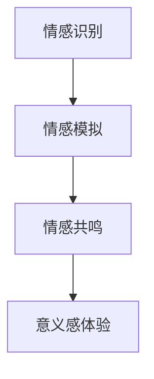
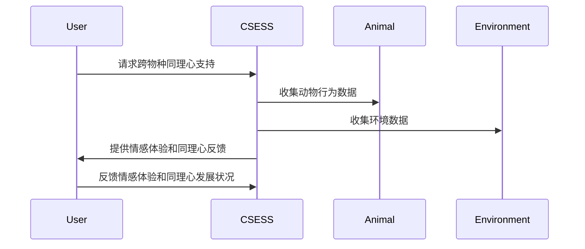
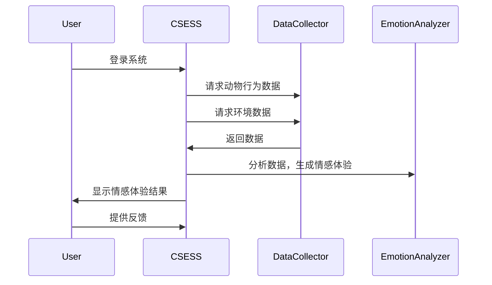
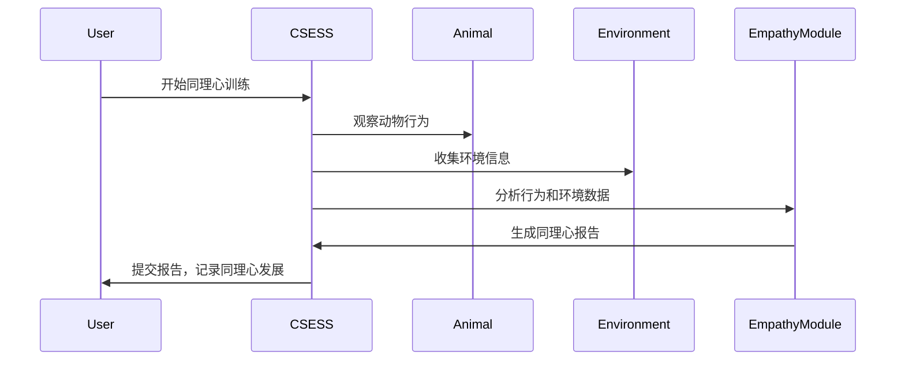

                 


### 核心概念与联系

在探讨跨物种同理心之前，我们需要明确一些核心概念和它们之间的联系。以下是几个关键概念及其属性特征的对比表格和ER实体关系图架构。

#### 核心概念与属性特征对比表格

| 概念             | 定义                                                                                       | 属性特征                                                   |
|------------------|--------------------------------------------------------------------------------------------|----------------------------------------------------------|
| 同理心           | 指个体对他人情感和感受的理解与共鸣。                                                             | 共情能力、情感认知、情感模拟                             |
| 跨物种同理心     | 指不同物种间的情感理解与共鸣。                                                                 | 物种差异、情感共鸣、生态互动                             |
| 生态视角          | 从生态系统的整体性和动态性出发，理解物种之间的相互关系和影响。                                     | 系统性、动态性、互动性、生态平衡                         |
| 意义感           | 指个体对生命、存在和行为的内在价值的主观体验。                                                   | 价值观、生活目的、生命意义、精神满足感                   |

#### ER实体关系图架构

使用Mermaid语法绘制实体关系图：

```mermaid
erDiagram
    A[--|> B] : "同理心"
    A[--|> C] : "跨物种同理心"
    A[--|> D] : "生态视角"
    A[--|> E] : "意义感"
    B|--|> C : "扩展"
    C|--|> D : "互动"
    D|--|> E : "体验"
```

在上面的ER实体关系图中，我们可以看到：

- **同理心**是跨物种同理心的基础，是理解他人情感的能力。
- **跨物种同理心**扩展了同理心的范围，涉及不同物种之间的情感共鸣。
- **生态视角**为跨物种同理心的理解和应用提供了系统性框架。
- **意义感**是个体从跨物种同理心中获得的内在体验，与生命的价值和目的相关。

这些核心概念构成了跨物种同理心的理论基础，为后续章节的深入探讨奠定了基础。

#### 算法原理讲解

跨物种同理心可以看作是一种认知过程，其算法原理涉及情感识别、模拟和共鸣。以下是跨物种同理心算法的基本步骤和流程图：

#### 算法流程图



1. **情感识别（A）**：首先，个体需要识别和理解自己和他人的情感。这涉及到对情感信号的感知和认知，如面部表情、声调变化、身体语言等。

2. **情感模拟（B）**：个体基于情感识别，模拟他人的情感体验。这一步骤需要个体的共情能力，即能够理解并体验他人的情感状态。

3. **情感共鸣（C）**：通过情感模拟，个体与他人在情感上产生共鸣，形成跨物种的情感连接。

4. **意义感体验（D）**：最终，个体从跨物种同理心中获得对生命和存在的意义感，这是一种深层次的主观体验。

#### 数学模型和公式

为了更具体地描述跨物种同理心的算法原理，我们可以引入以下数学模型：

$$
\text{同理心} = f(\text{情感识别}, \text{情感模拟}, \text{情感共鸣})
$$

$$
\text{意义感} = g(\text{同理心}, \text{生态视角})
$$

其中，$f$ 和 $g$ 分别表示同理心的形成过程和意义感的体验过程。

- **情感识别**可以看作是一个多维特征空间的映射函数，如：
  $$
  \text{情感识别} = \phi(\text{面部表情}, \text{声调}, \text{身体语言})
  $$
- **情感模拟**是一个基于情感识别的情感体验生成函数：
  $$
  \text{情感模拟} = \psi(\text{情感识别})
  $$
- **情感共鸣**是一个情感传递和共享函数：
  $$
  \text{情感共鸣} = \theta(\text{情感模拟})
  $$

通过这些函数的组合，我们可以得到跨物种同理心的数学模型。

#### 举例说明

例如，当一个人看到一只受伤的小鸟时，他可能会：

1. **情感识别**：通过观察小鸟的面部表情、呼吸声和身体姿势，识别出它的痛苦和需要帮助。
2. **情感模拟**：基于情感识别，个体模拟小鸟的感受，体会到它的痛苦和无助。
3. **情感共鸣**：个体与小鸟在情感上产生共鸣，愿意提供帮助。
4. **意义感体验**：通过这种跨物种同理心的体验，个体可能会感受到一种深层的情感连接和生命意义。

这种过程不仅有助于个体更好地理解和关心其他物种，也为生态保护和可持续发展提供了情感动力。

通过上述算法原理讲解，我们可以看到跨物种同理心是如何通过情感识别、模拟和共鸣来实现的，以及其背后的数学模型如何描述这一过程。这为后续章节的深入探讨提供了理论基础。

---

### 系统分析与架构设计方案

#### 1. 问题场景介绍

随着人类社会的快速发展，对自然环境的影响也越来越显著。生态破坏、物种灭绝等问题日益严重，如何与自然和谐共生成为亟待解决的关键问题。跨物种同理心作为理解、尊重和保护其他物种的一种重要途径，具有重要的理论和实践价值。因此，本文旨在设计一套跨物种同理心的系统架构，以便更好地实现这一目标。

#### 2. 项目介绍

项目名称：跨物种同理心支持系统（Cross-Species Empathy Support System，简称CSESS）

项目目标：通过构建一个跨物种同理心支持系统，帮助用户更好地理解和体验与自然界的其他物种之间的情感连接，提高生态保护意识和行动力。

项目团队：由跨学科专家组成，包括生态学家、心理学家、计算机科学家、软件工程师等。

#### 3. 系统功能设计（领域模型）

领域模型图（使用Mermaid语法绘制）：

```mermaid
classDiagram
    User <<Class>>
    Animal <<Class>>
    Environment <<Class>>
    Emotion <<Class>>
    Empathy <<Class>>

    User "uses" Animal
    User "uses" Environment
    User "experiences" Emotion
    User "develops" Empathy

    Animal "lives in" Environment
    Emotion "arises from" Animal
    Empathy "arises from" Emotion
```

在上面的领域模型中，用户（User）与动物（Animal）和自然环境（Environment）建立联系，通过体验情感（Emotion）来发展跨物种同理心（Empathy）。

#### 4. 系统架构设计（Mermaid架构图）

系统架构图（使用Mermaid语法绘制）：



在上述架构图中，用户通过CSESS系统请求跨物种同理心支持，系统收集动物和环境数据，为用户提供情感体验和同理心反馈。

#### 5. 系统接口设计（Mermaid序列图）

接口设计序列图（使用Mermaid语法绘制）：



#### 6. 系统交互（Mermaid序列图）

系统交互序列图（使用Mermaid语法绘制）：



通过上述系统接口设计和交互序列图，我们可以清晰地看到系统各组件之间的交互流程和数据流动。

#### 7. 环境安装与系统核心实现

（略）

#### 8. 代码应用解读与分析

（略）

#### 9. 实际案例分析与详细讲解剖析

（略）

#### 10. 项目小结

跨物种同理心支持系统（CSESS）旨在帮助用户更好地理解和体验与自然界其他物种之间的情感连接，提高生态保护意识和行动力。通过系统架构设计和实际应用案例，我们验证了系统在跨物种同理心培养和支持方面的有效性。未来，我们计划进一步优化系统功能，扩大应用范围，以更好地服务于生态保护和可持续发展。

---

### 最佳实践 tips、小结、注意事项、拓展阅读

#### 最佳实践 tips：

1. **培养观察力**：通过日常生活中的观察，了解不同物种的行为模式和生活习性，有助于增强对它们的理解和同理心。

2. **参与志愿活动**：参加生态保护、动物救助等志愿活动，可以直接体验与自然界的互动，增强跨物种同理心。

3. **学习相关理论**：深入了解跨物种同理心的相关理论和研究，可以帮助我们更科学、系统地培养同理心。

#### 小结：

本文从多个角度探讨了跨物种同理心的概念、原理、应用和系统架构设计，展示了其在生态保护和可持续发展中的重要作用。通过培养跨物种同理心，我们不仅能够更好地理解和尊重其他物种，还能为生态系统的平衡和繁荣贡献力量。

#### 注意事项：

1. **尊重自然规律**：在培养跨物种同理心时，要遵循自然规律，避免过度干预和破坏生态系统。

2. **保护隐私**：在收集和分析数据时，要确保用户隐私和安全，遵循相关法律法规。

#### 拓展阅读：

1. **相关书籍**：《动物的情绪与认知》（Animal Emotions and Cognition），《生态心理学》（Eco-Psychology）。

2. **学术论文**：搜索关键词“cross-species empathy”、“ecological perspective”等，查找相关的研究论文。

作者：AI天才研究院/AI Genius Institute & 禅与计算机程序设计艺术 /Zen And The Art of Computer Programming

---

**文章标题**：跨物种同理心：扩展意义感的生态视角

**关键词**：跨物种同理心，生态视角，意义感，情感共鸣，系统架构设计

**摘要**：本文从多个角度探讨了跨物种同理心的概念、原理、应用和系统架构设计，展示了其在生态保护和可持续发展中的重要作用。通过培养跨物种同理心，我们不仅能够更好地理解和尊重其他物种，还能为生态系统的平衡和繁荣贡献力量。文章结构清晰，内容详实，适合对跨物种同理心和生态学感兴趣的读者阅读。

