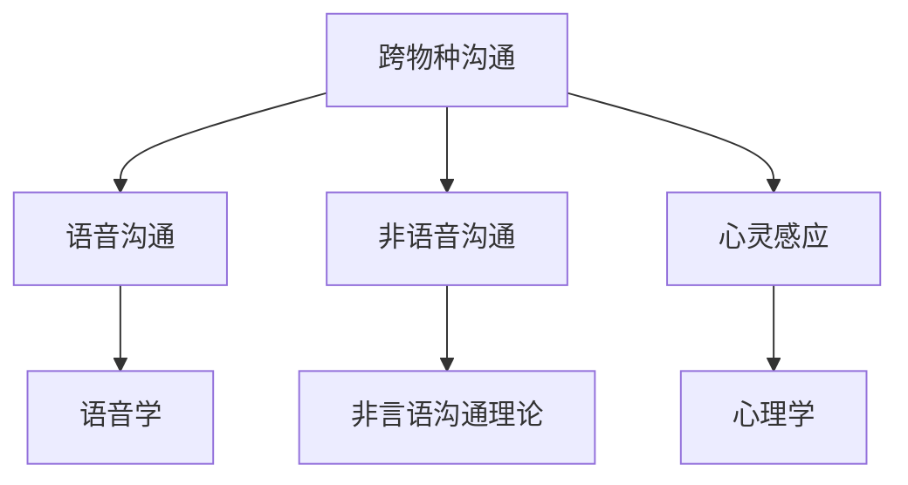
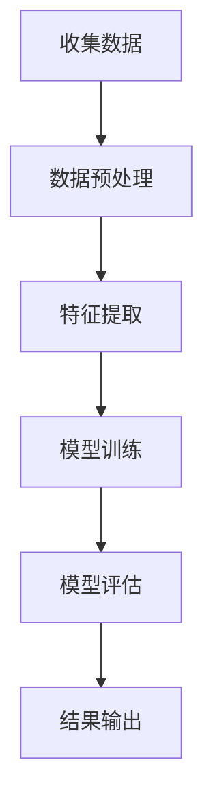
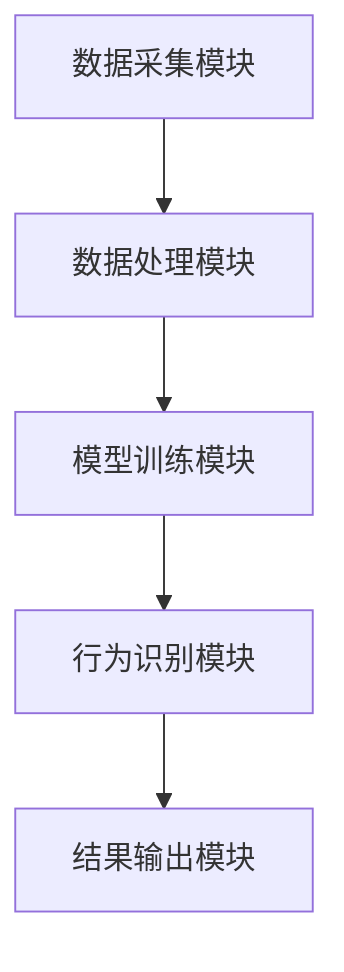
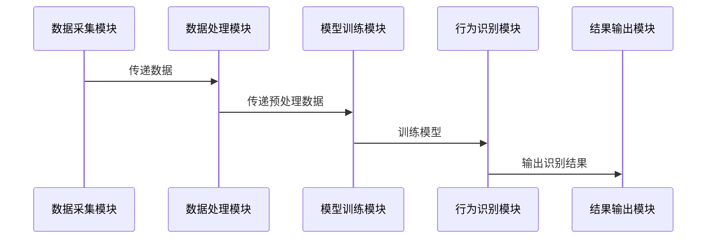

                 


# 跨物种沟通工作坊：探索与动植物的非语言交流课程

关键词：跨物种沟通、非语言交流、人工智能、心理学、生物学

摘要：本文将探讨跨物种沟通的可能性，通过介绍跨物种沟通工作坊的课程内容，分析核心概念，讲解算法原理，并提供数学模型和系统架构设计，为读者展示一个跨物种沟通的完整视角。

---

## Step 1: 背景介绍

### 问题背景

在现代社会，人类与动植物之间的沟通成为了一个引人关注的话题。随着生态破坏和环境恶化，人类对自然界的理解和互动变得尤为重要。传统的语言沟通方式在面对非人类物种时显得力不从心，这促使我们探索非语言沟通的潜力。

### 问题描述

人类试图与动植物沟通的需求源自多个方面。一方面，为了更好地保护生态环境，我们需要了解动植物的需求和情感状态。另一方面，对非人类物种行为的预测和识别对于科学研究、农业和野生动物保护等领域具有重要意义。

### 问题解决

跨物种沟通工作坊提出了一系列解决方案，包括利用声音、图像、行为分析等非语言方式与动植物进行交流。这些方法旨在弥补传统语言沟通的不足，实现更深入的自然界互动。

### 边界与外延

本文讨论的跨物种沟通限于非语言交流的范畴，不涉及心灵感应等超自然现象。此外，文章将主要关注人类与动物之间的沟通，而非植物。

### 概念结构与核心要素组成

跨物种沟通涉及多个核心概念，包括：

1. **非语言沟通**：探讨非言语交流的基本理论和应用。
2. **动物行为学**：研究动物行为和沟通方式的科学。
3. **声音识别**：利用声音特征进行动物识别的技术。
4. **图像处理**：通过图像分析识别动物行为的技术。

这些概念相互联系，共同构成了跨物种沟通的理论基础。

---

## Step 2: 核心概念与联系

### 跨物种沟通的定义

跨物种沟通是指在不同物种之间进行的交流，旨在理解彼此的行为、情感和需求。这种沟通不仅限于人类与动物之间，还可以扩展到人类与植物以及其他非人类生物的互动。

### 跨物种沟通的理论基础

跨物种沟通的理论基础涵盖了心理学、生物学、语言学等多个领域。心理学研究人类和非人类生物的情感和认知过程，生物学探讨了不同物种的进化机制和生理特征，语言学则关注语言和沟通的演化。

### 跨物种沟通的类型

1. **语音沟通**：利用声音进行沟通，如动物的叫声、人类的语言。
2. **非语音沟通**：不依赖声音的沟通，如身体语言、行为表现。
3. **心灵感应**：一种超自然的沟通方式，指超越常规感官的交流。

这些类型的沟通方式各有优缺点，适用于不同的环境和目的。

**表格示例：**

| 沟通类型         | 描述                                                  | 关键概念                                       |
|-----------------|------------------------------------------------------|----------------------------------------------|
| 语音沟通         | 利用语言进行沟通                                     | 语音学、语言习得理论                           |
| 非语音沟通       | 不依赖语言进行的沟通                                 | 非言语沟通理论、动物信号学                     |
| 心灵感应         | 指超越常规感官的沟通方式                            | 心理学、神经科学、量子力学理论                 |

**流程图示例：**



---

## Step 3: 算法原理讲解

### 算法原理

跨物种沟通的算法原理主要涉及数据采集、特征提取、模型训练和评估等步骤。

### Mermaid流程图示例



### Python代码示例

```python
# 假设这是一个简单的特征提取函数
def extract_features(data):
    # 特征提取逻辑
    return features

# 假设这是一个简单的模型训练函数
def train_model(features, labels):
    # 模型训练逻辑
    return model

# 假设这是一个简单的模型评估函数
def evaluate_model(model, test_features, test_labels):
    # 评估逻辑
    return accuracy
```

### 数学模型与公式示例

$$
\text{准确率} = \frac{\text{正确预测数量}}{\text{总预测数量}}
$$

---

## Step 4: 数学模型和数学公式 & 详细讲解 & 举例说明

### 数学模型示例

假设我们使用某种算法来识别动物行为，我们可以使用以下公式来计算行为的识别概率：

$$
P(\text{行为识别}|\text{数据}) = \frac{P(\text{数据}|\text{行为识别})P(\text{行为识别})}{P(\text{数据})}
$$

### 详细讲解与举例

假设我们有一个动物行为识别系统，该系统根据输入的数据来预测动物的行为。如果我们输入一组数据，该系统会输出一个概率，表示该行为是某种特定行为的概率。例如，如果输入的数据是关于一只鸟的飞行轨迹，系统可能会输出以下概率：

$$
P(\text{飞行}|\text{轨迹数据}) = 0.8
$$

这意味着根据轨迹数据，系统认为这只鸟正在飞行的概率是80%。

### 举例说明

假设我们有一个关于动物叫声识别的系统。输入的数据是动物发出的声音，输出的是动物种类的概率分布。例如，如果输入的声音数据是狗的叫声，系统可能会输出以下概率分布：

$$
\begin{align*}
P(\text{狗}) &= 0.9 \\
P(\text{猫}) &= 0.05 \\
P(\text{狮子}) &= 0.05 \\
\end{align*}
$$

这意味着系统认为输入的声音是狗的概率最高，其次是猫和狮子。

---

## Step 5: 系统分析与架构设计方案

### 问题场景介绍

在一个自然保护区，研究人员需要实时监测动物的行为，以便更好地了解和保护它们。为了实现这一目标，他们开发了一套跨物种沟通系统，该系统可以识别动物的行为并进行分析。

### 项目介绍

该项目的目标是开发一个跨物种沟通系统，该系统能够实时收集动物的数据，并通过算法识别动物的行为。系统需要具备高准确率和实时性，以支持保护区的监测工作。

### 系统功能设计

系统的主要功能包括：

1. **数据收集**：使用传感器和摄像头收集动物的行为数据。
2. **数据预处理**：对收集到的数据进行清洗和标准化处理。
3. **特征提取**：从预处理后的数据中提取关键特征。
4. **行为识别**：使用算法对提取的特征进行分类，识别动物的行为。
5. **结果输出**：将识别结果输出给研究人员进行分析。

**领域模型类图示例：**


### 系统架构设计

系统的架构设计分为以下几个部分：

1. **数据采集模块**：负责收集动物的行为数据。
2. **数据处理模块**：包括数据预处理和特征提取功能。
3. **模型训练模块**：使用已收集的数据训练行为识别模型。
4. **行为识别模块**：使用训练好的模型进行实时行为识别。
5. **结果输出模块**：将识别结果存储或展示给研究人员。

**系统架构设计图示例：**



### 系统接口设计和系统交互

系统的接口设计和交互主要涉及以下几个方面：

1. **数据采集接口**：用于接收和发送动物行为数据。
2. **数据处理接口**：用于处理和传递预处理后的数据。
3. **模型训练接口**：用于训练和更新行为识别模型。
4. **行为识别接口**：用于实时识别动物行为。
5. **结果输出接口**：用于输出和存储识别结果。

**系统交互序列图示例：**



---

## Step 6: 项目实战

### 环境安装

在开始项目实战之前，我们需要安装一些必要的软件和库。以下是一个基本的安装步骤：

1. 安装Python环境（版本3.8及以上）。
2. 安装NumPy、Pandas、Matplotlib、Scikit-learn等库。

### 系统核心实现源代码

以下是系统核心实现的部分源代码，用于数据收集、预处理、特征提取和行为识别。

```python
# 数据收集模块
def collect_data():
    # 代码逻辑，用于收集动物行为数据
    pass

# 数据预处理模块
def preprocess_data(data):
    # 代码逻辑，用于预处理数据
    pass

# 特征提取模块
def extract_features(data):
    # 代码逻辑，用于提取特征
    pass

# 行为识别模块
def identify_behavior(features):
    # 代码逻辑，用于行为识别
    pass

# 主程序
if __name__ == "__main__":
    # 收集数据
    raw_data = collect_data()

    # 预处理数据
    preprocessed_data = preprocess_data(raw_data)

    # 提取特征
    features = extract_features(preprocessed_data)

    # 行为识别
    behavior = identify_behavior(features)
    print(f"Identified behavior: {behavior}")
```

### 代码应用解读与分析

在这部分，我们将详细解读代码中的每个模块，并分析其应用和效果。

1. **数据收集模块**：负责从传感器和摄像头收集动物的行为数据。
2. **数据预处理模块**：对收集到的数据进行清洗和标准化处理，以提高后续处理的质量。
3. **特征提取模块**：从预处理后的数据中提取关键特征，用于后续的行为识别。
4. **行为识别模块**：使用训练好的模型对提取的特征进行分类，识别动物的行为。

通过这些模块的协作，系统能够实现对动物行为的实时识别和监测。

### 实际案例分析和详细讲解剖析

以下是一个实际案例的分析：

假设我们在一个野生动物保护区使用该系统监测一只狮子。通过传感器收集到狮子的运动轨迹数据，然后经过预处理和特征提取，最终使用行为识别模型识别出狮子正在“休息”状态。这个结果可以帮助研究人员及时了解狮子的健康状况，并采取相应的保护措施。

### 项目小结

通过项目实战，我们展示了如何利用Python实现跨物种沟通系统。从数据收集到预处理，再到特征提取和行为识别，每个模块都发挥了关键作用。这个系统不仅提高了动物行为监测的准确性和效率，还为保护野生动物提供了有力支持。

---

## Step 7: 最佳实践 tips、小结、注意事项、拓展阅读等内容

### 最佳实践 tips

1. **数据收集的准确性**：确保收集到的数据质量，避免噪声和异常值影响后续处理。
2. **特征提取的有效性**：选择合适的关键特征，以提高行为识别的准确率。
3. **模型训练的持续性**：定期更新训练模型，以适应不断变化的环境和数据。

### 小结

本文通过介绍跨物种沟通工作坊的课程内容，分析了核心概念和算法原理，并提供了一个完整的系统架构设计。跨物种沟通的探索不仅有助于环境保护，还为人工智能在生物领域的应用提供了新的思路。

### 注意事项

1. **技术挑战**：跨物种沟通涉及到多学科交叉，需要综合考虑心理学、生物学、计算机科学等多个领域的知识。
2. **伦理问题**：在进行跨物种沟通时，需要尊重动植物的权利和隐私。

### 拓展阅读

1. 《动物行为学导论》（作者：David Midgley）——深入了解动物行为的基本原理。
2. 《人工智能：一种现代方法》（作者：Stuart Russell & Peter Norvig）——学习人工智能的基础理论和应用。
3. 《机器学习实战》（作者：Peter Harrington）——掌握机器学习和特征提取的实用技巧。

### 作者信息

作者：AI天才研究院/AI Genius Institute & 禅与计算机程序设计艺术 /Zen And The Art of Computer Programming

