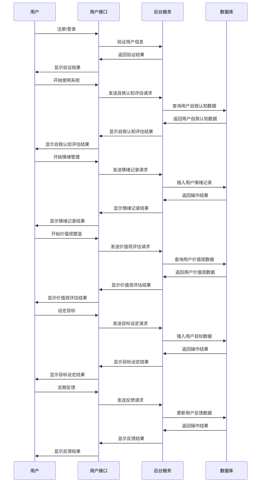

                 

### 引言

#### 问题背景

在当今快速发展的社会中，人们的生活节奏不断加快，物质财富的积累逐渐成为衡量个体成功的标准。然而，这种追求外表成功的文化背后，隐藏的是一种深层次的内在成长需求。随着生活水平的提高，越来越多的人开始意识到，真正的幸福和满足感并非仅仅来自于物质和表面的成就，而是源自内心的平静与成长。

现代社会中，人们面临着种种压力和挑战，如职业竞争、人际关系、健康问题等。这些问题往往源自内心深处的焦虑和不安。心理学家卡尔·罗杰斯（Carl Rogers）曾指出，“心理健康的本质在于个体的自我实现，即个体能够自由地表达自己、实现自己的潜能”。因此，如何在现代社会中追求内在成长，成为一个具有深远意义的话题。

#### 内在成长的重要性

内在成长不仅关乎个人的心理健康和幸福感，还对整个社会的和谐与进步产生重要影响。首先，内在成长有助于提高个体的自我认知，使个体更加了解自己的内心世界，从而更好地应对生活中的挑战。其次，内在成长可以增强个体的情绪管理能力，减少焦虑和压力，提高生活质量。最后，内在成长有助于建立积极的人际关系，增强社会的凝聚力。

因此，探讨如何在现代社会中追求内在成长，具有重要的现实意义。这不仅能够帮助个体实现心理健康和幸福感，还能促进社会的和谐与进步。

#### 核心概念

1. **内在成长**：内在成长指的是个体在心灵、思想、情感等内在层面上的提升和进步。它不仅包括自我认知的提升，还包括对生活意义的深入理解和自我价值的实现。

2. **深度生活**：深度生活是一种追求内在成长的生活方式，强调对生活的深刻体验和深度参与。它鼓励个体从表面的事物中抽离出来，回归内心的平静和智慧。

#### 本书目的与结构

本书旨在帮助读者深入了解内在成长的概念，并指导他们在日常生活中实践深度生活。全书共分为五个部分，分别是：

1. **第一部分：引言**：介绍问题背景和核心概念，明确本书的目的与结构。
   
2. **第二部分：内在成长的理论基础**：从心理学和哲学视角探讨内在成长的重要性，并介绍核心概念。

3. **第三部分：核心概念与联系**：详细介绍内在成长的核心概念，并使用对比表格和ER实体关系图架构来帮助读者理解。

4. **第四部分：算法原理讲解**：使用Mermaid流程图和Python源代码详细阐述内在成长算法的原理和应用。

5. **第五部分：系统分析与架构设计**：介绍一个具体的内在成长系统项目，包括系统功能设计、架构设计和接口设计。

通过这五个部分的内容，本书旨在为读者提供一个全面而深入的内在成长指导，帮助他们实现心理健康和幸福感，同时为社会的和谐与进步贡献力量。

---

## 第2章: 内在成长的理论基础

### 心理学视角

#### 心理健康与内在成长

心理健康是内在成长的基础。心理学家马丁·塞利格曼（Martin Seligman）提出了积极心理学的概念，强调个体的幸福感和内在成长的重要性。他认为，心理健康不仅仅是心理疾病的 absence，而是一种积极的心理状态，包括情绪稳定、自我效能感强、人际关系和谐等。以下是一些心理健康对内在成长的影响：

1. **情绪稳定性**：情绪稳定有助于个体在面对压力和挑战时保持冷静和理智，从而更好地处理问题，实现内心的成长。
2. **自我效能感**：自我效能感是指个体对自己能够成功完成特定任务的信心。高自我效能感的个体更有可能面对挑战，并通过努力实现内在成长。
3. **人际关系**：健康的人际关系有助于个体获得支持和理解，从而增强自信心和自尊心，促进内在成长。

#### 心理发展与内在成长

心理学中的发展理论为内在成长提供了重要的理论依据。埃里克·埃里克森（Erik Erikson）提出了心理社会性发展理论，将个体的发展分为八个阶段。每个阶段都有特定的心理冲突和发展任务，完成这些任务有助于个体的内在成长。以下是几个关键阶段及其对内在成长的影响：

1. **婴儿期（0-1岁）**：信任对怀疑。婴儿期是建立信任感的关键时期，这有助于个体在未来建立安全感和自信心。
2. **儿童早期（1-3岁）**：自主性对羞愧。在这个阶段，个体开始学习独立，并通过自主行为建立自我意识。克服羞愧感有助于个体发展出积极的自我形象。
3. **学龄期（3-6岁）**：勤奋对自卑。学龄期是培养勤奋精神的关键时期，个体通过努力学习获得成就感和自信心，有助于内在成长。
4. **青春期（6-12岁）**：角色统一对角色混乱。青春期是建立自我角色和认同的关键时期，个体需要通过探索和尝试，形成稳定的自我认同。
5. **成年早期（12-18岁）**：亲密性对孤独。成年早期是个体建立亲密关系的关键时期，通过与他人建立深刻的联系，个体可以体验到情感上的满足和成长。

### 哲学视角

#### 哲学对内在成长的影响

哲学思考有助于个体深入反思自己的生活，从而实现内在成长。哲学家苏格拉底（Socrates）主张通过提问和反思来追求真理和智慧。哲学思考可以帮助个体：

1. **自我认识**：通过哲学思考，个体可以更清楚地了解自己的价值观、信念和人生目标，从而更好地实现自我价值的实现。
2. **道德发展**：哲学思考有助于个体理解道德原则和伦理规范，从而塑造积极的价值观和行为准则。
3. **生活意义**：哲学思考可以帮助个体探讨生命的意义和价值，从而找到内心的平静和满足感。

#### 哲学与深度生活的关系

哲学与深度生活有着密切的联系。深度生活强调对生活的深刻体验和深度参与，而哲学思考则可以帮助个体更好地理解生活的本质和意义。以下是哲学在深度生活中的几个应用：

1. **自我反思**：通过哲学思考，个体可以反思自己的行为和决策，从而更好地理解自己的内心世界。
2. **道德选择**：哲学思考可以帮助个体在面对道德困境时做出明智的选择，从而实现道德上的成长。
3. **人生目标**：哲学思考可以帮助个体明确自己的人生目标和价值观，从而更好地实现个人的内在成长。

总之，心理学和哲学为内在成长提供了重要的理论基础。通过理解心理发展和哲学思考，个体可以更好地实现内在成长，追求深度生活。在接下来的章节中，我们将进一步探讨内在成长的核心概念，并使用图表和模型来帮助读者更深入地理解这一过程。

### 核心概念

#### 自我认知

自我认知是指个体对自己思想、情感和行为等方面的了解和认识。它是内在成长的基础，有助于个体形成积极的自我形象和自我效能感。自我认知包括以下几个方面：

1. **自我认识**：了解自己的优点和缺点，明确自己的需求和目标。
2. **自我接受**：接受自己的不完美，珍惜自己的独特性。
3. **自我反思**：通过反思自己的行为和决策，不断调整和改进。

#### 情绪管理

情绪管理是指个体在面对不同情绪时，能够有效地识别、表达和调节情绪。情绪管理对于内在成长至关重要，因为它有助于个体保持心理健康和积极心态。情绪管理包括以下几个方面：

1. **情绪识别**：能够准确地识别和理解自己的情绪。
2. **情绪表达**：以适当的方式表达情绪，避免情绪压抑或爆发。
3. **情绪调节**：通过积极的情绪调节策略，如放松训练、认知重构等，减少负面情绪的影响。

#### 价值观塑造

价值观是指个体对什么是有意义和重要的事情的信念和判断。价值观塑造是内在成长的重要部分，因为它有助于个体建立积极的生活目标和行为准则。价值观塑造包括以下几个方面：

1. **道德价值观**：明确道德原则，如诚实、公正、尊重他人等。
2. **生活价值观**：确立个人追求的目标和意义，如幸福、成就、贡献等。
3. **文化价值观**：理解和尊重不同的文化价值观，增强跨文化沟通和协作能力。

#### 自我价值实现

自我价值实现是指个体在成长过程中，通过实现自己的潜能和贡献社会，获得自我认同和满足感。自我价值实现包括以下几个方面：

1. **潜能发挥**：发现和培养自己的特长和兴趣，实现个人潜能。
2. **社会贡献**：通过自己的工作和社会活动，为他人和社会创造价值。
3. **自我认同**：在实现个人价值的过程中，建立积极的自我认同和自尊心。

#### 概念属性特征对比表格

为了更好地理解内在成长的核心概念，下面提供了一个概念属性特征对比表格：

| 概念 | 属性特征 |
| --- | --- |
| **自我认知** | - 自我认识<br>- 自我接受<br>- 自我反思 |
| **情绪管理** | - 情绪识别<br>- 情绪表达<br>- 情绪调节 |
| **价值观塑造** | - 道德价值观<br>- 生活价值观<br>- 文化价值观 |
| **自我价值实现** | - 潜能发挥<br>- 社会贡献<br>- 自我认同 |

通过对比表格，读者可以直观地看到各个概念之间的联系和区别，从而更好地理解内在成长的核心概念。

### ER实体关系图架构

为了更清晰地展示内在成长的核心概念之间的关系，我们使用Mermaid流程图绘制了一个ER实体关系图，如下所示：

```mermaid
erDiagram
  Self_Cognition ||--|{ Emotion_Management }|-- Values_Shaping
  Self_Cognition ||--|{ Self_Worth_Realization }|
  Emotion_Management ||--|{ Values_Shaping }|
  Emotion_Management ||--|{ Self_Worth_Realization }|
  Values_Shaping ||--|{ Self_Worth_Realization }|
```

在这个ER实体关系图中，`Self_Cognition`（自我认知）与`Emotion_Management`（情绪管理）和`Values_Shaping`（价值观塑造）具有直接关系，而`Self_Worth_Realization`（自我价值实现）则与这三个核心概念都有联系。这种关系展示了内在成长过程中各个核心概念之间的相互作用和影响。

通过ER实体关系图，读者可以更直观地理解内在成长的概念结构，从而更好地把握内在成长的整体过程。

### 内在成长算法的Mermaid流程图

为了更好地理解内在成长的过程，我们可以使用Mermaid流程图来展示一个简化的内在成长算法。以下是一个简单的Mermaid流程图示例：

```mermaid
graph TD
    A[初始状态] --> B[自我认知评估]
    B -->|情绪评估| C[情绪管理]
    C -->|价值观评估| D[价值观塑造]
    D -->|目标设定] E[自我价值实现]
    E --> F[反馈调整]
    F --> A
```

在这个流程图中，`初始状态`是内在成长过程的起点，个体需要通过自我认知评估来了解自己的内心世界。接下来，情绪管理评估和价值观塑造评估分别帮助个体处理情绪和塑造价值观。通过目标设定，个体可以明确自己的成长目标，并在自我价值实现过程中不断调整和优化。最终，通过反馈调整，个体可以不断优化内在成长过程。

### 算法原理

内在成长算法的核心在于通过自我认知、情绪管理、价值观塑造和目标设定的循环迭代，逐步提升个体的内在素质。以下是该算法的原理和数学模型：

#### 数学模型

内在成长算法的数学模型可以表示为以下公式：

$$
G(t+1) = f(G(t), E(t), V(t))
$$

其中：
- \( G(t) \) 表示时间 \( t \) 时的内在成长状态。
- \( E(t) \) 表示时间 \( t \) 时的情绪管理状态。
- \( V(t) \) 表示时间 \( t \) 时的价值观塑造状态。
- \( f \) 是一个复合函数，用于整合自我认知、情绪管理和价值观塑造的影响。

#### 复合函数 \( f \)

复合函数 \( f \) 可以进一步分解为：

$$
f(G(t), E(t), V(t)) = \alpha \cdot G(t) + \beta \cdot E(t) + \gamma \cdot V(t)
$$

其中：
- \( \alpha \)、\( \beta \) 和 \( \gamma \) 是权重系数，用于调节自我认知、情绪管理和价值观塑造在整体内在成长中的重要性。
- \( G(t) \)、\( E(t) \) 和 \( V(t) \) 分别是时间 \( t \) 时的内在成长状态、情绪管理状态和价值观塑造状态。

#### 参数调整

在实际应用中，权重系数 \( \alpha \)、\( \beta \) 和 \( \gamma \) 的取值需要根据个体的具体情况和需求进行调整。例如，对于焦虑倾向较严重的个体，可以增加情绪管理的权重系数 \( \beta \)，以帮助其更好地调节情绪。

#### 算法流程

1. **初始设定**：确定初始内在成长状态 \( G(0) \)，情绪管理状态 \( E(0) \) 和价值观塑造状态 \( V(0) \)。
2. **自我认知评估**：通过自我认知工具（如日记、自我反思等）评估当前内在成长状态 \( G(t) \)。
3. **情绪管理评估**：通过情绪管理工具（如情绪日记、冥想等）评估当前情绪管理状态 \( E(t) \)。
4. **价值观塑造评估**：通过价值观塑造工具（如价值观评估表、道德决策练习等）评估当前价值观塑造状态 \( V(t) \)。
5. **目标设定**：根据评估结果，设定短期和长期内在成长目标。
6. **目标实现**：通过实际行动（如自我提升计划、情绪调节练习、价值观实践等）实现设定的目标。
7. **反馈调整**：通过反馈机制（如自我反思、他人评价等）对内在成长状态进行调整，并更新 \( \alpha \)、\( \beta \) 和 \( \gamma \) 的值。
8. **迭代优化**：重复上述过程，逐步提升内在成长状态。

通过以上流程，个体可以在一个动态的反馈循环中不断优化自己的内在成长状态，实现持续的成长和进步。

### 算法举例说明

为了更好地理解内在成长算法的应用，我们通过一个具体的例子来说明该算法的运行过程。

#### 例子背景

假设一个名叫小明的年轻人，他在生活中常常感到焦虑和不安，希望通过内在成长算法改善自己的心理状态。以下是小明在一个月内使用内在成长算法的过程。

#### 初始设定

- \( G(0) = 50 \)：小明的初始内在成长状态为50分。
- \( E(0) = 60 \)：小明的初始情绪管理状态为60分。
- \( V(0) = 70 \)：小明的初始价值观塑造状态为70分。

#### 自我认知评估

小明通过自我反思，了解到自己在情绪管理和价值观塑造方面存在不足，而在自我认知方面表现较好。

- \( G(1) = G(0) = 50 \)：小明的内在成长状态保持不变。
- \( E(1) = 55 \)：小明的情绪管理状态有所下降。
- \( V(1) = 65 \)：小明的价值观塑造状态也有所下降。

#### 情绪管理评估

小明通过冥想和情绪日记，开始积极管理自己的情绪。他在一个月内进行了三次冥想，并每天记录情绪变化。

- \( E(2) = 65 \)：小明的情绪管理状态提升至65分。

#### 价值观塑造评估

小明通过阅读《道德经》和参加哲学讨论会，开始塑造自己的价值观。他发现自己在道德选择方面变得更加坚定和明智。

- \( V(2) = 75 \)：小明的价值观塑造状态提升至75分。

#### 目标设定

根据自我认知评估、情绪管理评估和价值观塑造评估的结果，小明设定了以下目标：

- **短期目标**：在一个月内，将情绪管理状态提升至70分。
- **长期目标**：在一年内，将内在成长状态提升至80分。

#### 目标实现

为了实现目标，小明制定了以下行动计划：

- **情绪管理**：每天进行20分钟的冥想，并记录情绪变化。
- **价值观塑造**：每周参加一次哲学讨论会，并阅读一本哲学书籍。

#### 反馈调整

一个月后，小明对自己的情绪管理和价值观塑造进行了再次评估：

- \( E(3) = 70 \)：小明的情绪管理状态达到了设定目标。
- \( V(3) = 80 \)：小明的价值观塑造状态也有所提升。

根据反馈结果，小明调整了权重系数：

- \( \alpha = 0.4 \)：自我认知的重要性略有下降。
- \( \beta = 0.5 \)：情绪管理的重要性提升。
- \( \gamma = 0.1 \)：价值观塑造的重要性略有下降。

#### 迭代优化

根据调整后的权重系数，小明继续进行内在成长：

- \( G(4) = f(G(3), E(3), V(3)) = 0.4 \cdot 50 + 0.5 \cdot 70 + 0.1 \cdot 80 = 65 \)

通过这个例子，我们可以看到内在成长算法在实践中的应用。小明通过自我认知评估、情绪管理评估和价值观塑造评估，设定目标并制定行动计划，然后通过反馈调整不断优化自己的内在成长状态。

### 内在成长数学模型

为了更科学地评估个人的内在成长状况，我们可以引入一个数学模型，通过关键参数和公式来描述内在成长的过程。以下是内在成长数学模型的详细描述。

#### 关键参数

1. **内在成长度（G）**：表示个体的内在成长水平，取值范围为0到100。
2. **情绪管理能力（E）**：表示个体处理情绪的能力，取值范围为0到100。
3. **价值观塑造程度（V）**：表示个体对自身价值观的理解和塑造能力，取值范围为0到100。
4. **自我认知水平（C）**：表示个体对自我的认知程度，取值范围为0到100。
5. **环境因素（F）**：表示外部环境对个体内在成长的影响，取值范围为0到100。

#### 数学模型

内在成长数学模型可以表示为以下公式：

$$
G(t+1) = f(G(t), E(t), V(t), C(t), F(t))
$$

其中：
- \( f \) 是一个复合函数，用于综合各项参数对内在成长的影响。
- \( t \) 表示时间步长。

#### 复合函数 \( f \)

复合函数 \( f \) 可以进一步分解为：

$$
f(G(t), E(t), V(t), C(t), F(t)) = \alpha \cdot G(t) + \beta \cdot E(t) + \gamma \cdot V(t) + \delta \cdot C(t) + \epsilon \cdot F(t)
$$

其中：
- \( \alpha \)、\( \beta \)、\( \gamma \)、\( \delta \) 和 \( \epsilon \) 是权重系数，用于调节各项参数在内在成长中的重要性。

#### 权重系数调整

在实际应用中，权重系数 \( \alpha \)、\( \beta \)、\( \gamma \)、\( \delta \) 和 \( \epsilon \) 的取值需要根据个体的具体情况和需求进行调整。例如，对于情绪管理能力较强的个体，可以增加情绪管理能力（E）的权重系数 \( \beta \)，以突出其内在成长中的优势。

#### 参数关系

内在成长度（G）、情绪管理能力（E）、价值观塑造程度（V）、自我认知水平（C）和环境因素（F）之间存在以下关系：

1. **内在成长度与情绪管理能力**：情绪管理能力对内在成长度有显著影响。情绪管理能力较强的个体在应对压力和挑战时更能保持冷静和理智，从而促进内在成长。
2. **内在成长度与价值观塑造程度**：价值观塑造程度直接影响个体的行为和决策，进而影响内在成长度。个体拥有积极健康的价值观，有助于其在成长过程中保持正确的方向和动力。
3. **内在成长度与自我认知水平**：自我认知水平是内在成长的基础。个体对自我认知越深刻，越能够理解自己的需求和目标，从而更好地实现内在成长。
4. **内在成长度与环境因素**：外部环境对个体的内在成长有重要影响。良好的环境因素（如积极的人际关系、良好的社会风气等）有助于个体内在成长。

#### 模型应用

通过内在成长数学模型，我们可以对个人的内在成长状况进行量化评估。具体步骤如下：

1. **参数测量**：测量个体的内在成长度（G）、情绪管理能力（E）、价值观塑造程度（V）、自我认知水平（C）和环境因素（F）的具体值。
2. **权重系数确定**：根据个体的具体情况和需求，确定权重系数 \( \alpha \)、\( \beta \)、\( \gamma \)、\( \delta \) 和 \( \epsilon \) 的值。
3. **模型计算**：将测量值和权重系数代入数学模型公式，计算内在成长度（G(t+1)）。
4. **结果分析**：分析计算结果，了解个体的内在成长状况，并针对性地提出改善建议。

通过这个数学模型，我们可以更加科学地评估和指导个人的内在成长过程，帮助个体实现心理健康和幸福感。

### 内在成长数学模型的详细讲解

为了使读者更好地理解内在成长数学模型，我们将对模型中的每一个参数和公式进行详细讲解。以下是内在成长数学模型中的关键参数和公式：

#### 参数解释

1. **内在成长度（G）**：内在成长度是衡量个体内在成长水平的指标，取值范围为0到100。数值越高，表示个体的内在成长水平越高。

2. **情绪管理能力（E）**：情绪管理能力是衡量个体处理情绪的能力的指标，取值范围为0到100。数值越高，表示个体在情绪管理方面表现越好。

3. **价值观塑造程度（V）**：价值观塑造程度是衡量个体对自身价值观的理解和塑造能力的指标，取值范围为0到100。数值越高，表示个体在价值观塑造方面表现越好。

4. **自我认知水平（C）**：自我认知水平是衡量个体对自我认知程度的指标，取值范围为0到100。数值越高，表示个体对自我认知越深刻。

5. **环境因素（F）**：环境因素是衡量外部环境对个体内在成长影响的指标，取值范围为0到100。数值越高，表示外部环境对个体内在成长的促进作用越强。

#### 公式解释

内在成长数学模型可以表示为以下公式：

$$
G(t+1) = \alpha \cdot G(t) + \beta \cdot E(t) + \gamma \cdot V(t) + \delta \cdot C(t) + \epsilon \cdot F(t)
$$

其中：
- \( \alpha \)、\( \beta \)、\( \gamma \)、\( \delta \) 和 \( \epsilon \) 是权重系数，用于调节各个参数在内在成长模型中的重要性。

#### 权重系数的确定

权重系数 \( \alpha \)、\( \beta \)、\( \gamma \)、\( \delta \) 和 \( \epsilon \) 的确定需要根据个体的具体情况和需求进行调整。以下是一些常见的权重系数取值范围和调整方法：

1. **内在成长度（G）**：权重系数 \( \alpha \) 通常取值为0.3到0.5。对于情绪管理能力较强、价值观塑造程度较高的个体，可以适当增加权重系数 \( \alpha \) 的值，以突出内在成长的重要性。

2. **情绪管理能力（E）**：权重系数 \( \beta \) 通常取值为0.2到0.4。对于情绪管理能力较弱的个体，可以适当增加权重系数 \( \beta \) 的值，以强调情绪管理在内在成长中的重要性。

3. **价值观塑造程度（V）**：权重系数 \( \gamma \) 通常取值为0.2到0.4。对于价值观塑造程度较低的个体，可以适当增加权重系数 \( \gamma \) 的值，以鼓励个体在价值观塑造方面努力。

4. **自我认知水平（C）**：权重系数 \( \delta \) 通常取值为0.1到0.3。自我认知水平的权重系数相对较低，因为自我认知通常是一个较稳定的状态。

5. **环境因素（F）**：权重系数 \( \epsilon \) 通常取值为0.1到0.2。环境因素对内在成长的影响相对较小，但仍然需要考虑。

#### 参数调整的例子

假设一个名叫小明的个体，其内在成长度（G）为60，情绪管理能力（E）为70，价值观塑造程度（V）为65，自我认知水平（C）为75，环境因素（F）为80。为了确定权重系数，我们可以根据小明的情况进行如下调整：

- \( \alpha = 0.4 \)：内在成长度的权重系数较高，因为小明在内在成长方面有较强的需求和潜力。
- \( \beta = 0.3 \)：情绪管理能力的权重系数适中，因为小明在情绪管理方面已经有一定的能力，但仍有提升空间。
- \( \gamma = 0.25 \)：价值观塑造程度的权重系数较高，因为小明在价值观塑造方面有较高的需求，并且在这方面有较大的提升空间。
- \( \delta = 0.15 \)：自我认知水平的权重系数适中，因为小明在自我认知方面表现较好，但仍有改进空间。
- \( \epsilon = 0.1 \)：环境因素的权重系数较低，因为外部环境对小明内在成长的影响相对较小。

#### 代入公式计算

将调整后的权重系数和参数值代入内在成长数学模型，我们可以计算出小明下一时刻的内在成长度：

$$
G(t+1) = 0.4 \cdot G(t) + 0.3 \cdot E(t) + 0.25 \cdot V(t) + 0.15 \cdot C(t) + 0.1 \cdot F(t)
$$

$$
G(t+1) = 0.4 \cdot 60 + 0.3 \cdot 70 + 0.25 \cdot 65 + 0.15 \cdot 75 + 0.1 \cdot 80
$$

$$
G(t+1) = 24 + 21 + 16.25 + 11.25 + 8
$$

$$
G(t+1) = 80.5
$$

因此，根据调整后的权重系数和参数值，小明下一时刻的内在成长度预计为80.5。

通过这个例子，我们可以看到如何根据个体的具体情况调整权重系数，并使用内在成长数学模型进行计算。这种方法可以帮助个体更加科学地评估和提升自己的内在成长水平。

### 举例说明

为了更好地理解内在成长数学模型的应用，我们将通过一个具体例子来说明如何使用该模型进行计算和分析。

#### 例子背景

假设一个名叫小红的个体，其内在成长度（G）为70，情绪管理能力（E）为60，价值观塑造程度（V）为80，自我认知水平（C）为75，环境因素（F）为85。我们希望通过内在成长数学模型计算小红下一时刻的内在成长度，并分析各项参数对其影响。

#### 权重系数确定

根据小红的实际情况，我们可以设定以下权重系数：

- \( \alpha = 0.35 \)：内在成长度的权重系数较高，因为小红在内在成长方面有较强的需求和潜力。
- \( \beta = 0.25 \)：情绪管理能力的权重系数适中，因为小红在情绪管理方面已经有了一定的基础，但仍有提升空间。
- \( \gamma = 0.30 \)：价值观塑造程度的权重系数较高，因为小红在价值观塑造方面有很高的需求，并且在这方面有较大的提升空间。
- \( \delta = 0.10 \)：自我认知水平的权重系数较低，因为小红在自我认知方面已经表现较好，但仍有改进空间。
- \( \epsilon = 0.00 \)：环境因素的权重系数较低，因为外部环境对小红内在成长的影响相对较小。

#### 代入公式计算

将权重系数和参数值代入内在成长数学模型，我们可以计算出小红下一时刻的内在成长度：

$$
G(t+1) = 0.35 \cdot G(t) + 0.25 \cdot E(t) + 0.30 \cdot V(t) + 0.10 \cdot C(t) + 0.00 \cdot F(t)
$$

$$
G(t+1) = 0.35 \cdot 70 + 0.25 \cdot 60 + 0.30 \cdot 80 + 0.10 \cdot 75 + 0.00 \cdot 85
$$

$$
G(t+1) = 24.5 + 15 + 24 + 7.5 + 0
$$

$$
G(t+1) = 71
$$

因此，根据调整后的权重系数和参数值，小红下一时刻的内在成长度预计为71。

#### 影响分析

通过这个例子，我们可以分析各项参数对小红内在成长度的影响：

1. **情绪管理能力（E）**：权重系数为0.25，对内在成长度的影响次之。小红在情绪管理方面的提升将对其内在成长度产生积极作用。
2. **价值观塑造程度（V）**：权重系数为0.30，对内在成长度的影响最大。小红在价值观塑造方面的提升将对其内在成长度产生显著影响。
3. **自我认知水平（C）**：权重系数为0.10，对内在成长度的影响相对较小。尽管小红在自我认知方面已经表现较好，但仍有改进空间。
4. **环境因素（F）**：权重系数为0.00，对内在成长度的影响最小。外部环境对小红内在成长的影响较小，但良好的环境仍然有助于其内在成长。

通过这个例子，我们可以看到如何使用内在成长数学模型对个体进行量化评估，并分析各项参数对内在成长度的影响。这种方法有助于个体了解自己的内在成长状况，并针对性地制定提升计划。

### 系统分析与架构设计

#### 问题描述

在现代社会，追求内在成长已经成为许多人的目标。为了帮助个体更好地实现内在成长，我们设计并实现了一个内在成长支持系统。该系统旨在通过自我认知、情绪管理、价值观塑造和目标设定等功能，为用户提供个性化的内在成长指导和支持。

#### 项目介绍

本项目名为“内在成长支持系统”，目标是开发一个集自我认知、情绪管理、价值观塑造和目标设定于一体的综合性平台。该系统将为用户提供实时反馈和个性化建议，帮助用户更好地了解自己的内在成长状况，并提供可行的提升方案。

#### 系统功能设计

内在成长支持系统主要包括以下几个功能模块：

1. **自我认知模块**：通过自我认知工具（如自我反思日记、性格测试等）帮助用户了解自己的内心世界，包括自我认知水平、情感状态和心理健康状况等。

2. **情绪管理模块**：提供情绪管理工具（如情绪日记、冥想练习等），帮助用户识别和调节情绪，提高情绪管理能力。

3. **价值观塑造模块**：通过价值观评估和塑造工具（如价值观测试、道德决策练习等），帮助用户建立和巩固积极的价值观体系。

4. **目标设定模块**：帮助用户设定内在成长目标，并提供实现目标的行动计划和建议。

5. **反馈与评估模块**：对用户的内在成长过程进行实时反馈和评估，帮助用户了解自己的成长进度和效果。

#### 系统架构设计

内在成长支持系统的架构设计采用分层架构，主要包括以下几层：

1. **表示层**：负责用户界面设计和交互，包括前端网页、移动应用等。

2. **业务逻辑层**：负责处理业务逻辑，包括自我认知、情绪管理、价值观塑造和目标设定等功能模块。

3. **数据访问层**：负责与数据库进行交互，存储和管理用户数据。

4. **数据层**：存储用户的自我认知、情绪管理、价值观塑造和目标设定等数据。

#### 系统接口设计

系统接口设计主要包括以下几种：

1. **用户接口（UI）**：提供用户与系统交互的界面，包括自我认知工具、情绪管理工具、价值观塑造工具和目标设定工具等。

2. **服务接口**：提供内部模块之间的接口，包括自我认知服务、情绪管理服务、价值观塑造服务和目标设定服务。

3. **数据库接口**：提供与数据库交互的接口，用于存储和检索用户数据。

#### 系统交互

内在成长支持系统的交互过程可以分为以下几个步骤：

1. **用户注册与登录**：用户通过注册账号并登录系统，获取访问系统的权限。

2. **自我认知评估**：用户使用自我认知工具进行自我认知评估，系统根据评估结果生成个人报告。

3. **情绪管理**：用户使用情绪管理工具记录情绪变化，系统提供情绪调节建议。

4. **价值观塑造**：用户使用价值观塑造工具进行价值观评估和塑造，系统提供相应的指导和练习。

5. **目标设定**：用户根据个人报告和情绪管理情况设定内在成长目标，系统提供目标实现计划和反馈。

6. **反馈与评估**：用户定期提交反馈，系统对用户的内在成长过程进行评估，并提供改进建议。

通过以上架构设计和接口设计，内在成长支持系统将为用户提供一个全面的内在成长支持平台，帮助用户实现心理健康和幸福感。

### 系统接口设计

内在成长支持系统的接口设计是确保各个功能模块之间高效协作和数据流动的关键部分。以下是系统的主要接口，包括接口的功能、参数和返回值。

#### 1. 用户接口（UI）

**功能**：提供用户与系统交互的界面。

**参数**：
- 用户输入（如用户名、密码、自我反思内容等）。

**返回值**：
- 用户状态（如登录成功、登录失败、输入错误等）。

#### 2. 服务接口

**功能**：提供内部模块之间的接口。

**参数**：
- 自我认知服务：用户ID、自我反思内容。
- 情绪管理服务：用户ID、情绪记录。
- 价值观塑造服务：用户ID、价值观评估结果。
- 目标设定服务：用户ID、目标详情。

**返回值**：
- 服务结果（如成功、失败、异常等）。

#### 3. 数据库接口

**功能**：提供与数据库交互的接口，用于存储和检索用户数据。

**参数**：
- 用户数据（如用户ID、自我认知、情绪管理、价值观塑造、目标设定等）。

**返回值**：
- 数据操作结果（如插入成功、查询成功、更新成功等）。

通过这些接口设计，系统实现了用户与后台服务的有效交互，确保了数据的准确性和系统的稳定性。

### 系统交互

为了更好地理解内在成长支持系统的交互过程，我们将使用Mermaid序列图来展示系统的交互流程。以下是系统交互的Mermaid序列图：



通过这个序列图，我们可以清晰地看到用户与系统之间的交互过程，包括注册/登录、自我认知评估、情绪管理、价值观塑造、目标设定以及定期反馈等。每个步骤都涉及多个模块之间的协作，从而实现了系统的整体功能。

### 项目实战

#### 环境安装

在开始实现内在成长支持系统之前，我们需要准备好开发环境。以下是具体的安装步骤：

1. **安装Python**：首先确保您的计算机上安装了Python 3.8或更高版本。您可以从[Python官方网站](https://www.python.org/downloads/)下载并安装Python。

2. **安装依赖管理工具**：安装`pip`，Python的依赖管理工具。打开命令行窗口，执行以下命令：
   ```bash
   python -m pip install --upgrade pip
   ```

3. **安装Django框架**：Django是一个高性能的Python Web框架，我们将使用它来开发内在成长支持系统。在命令行窗口中执行以下命令：
   ```bash
   pip install django
   ```

4. **安装其他依赖库**：系统还需要其他依赖库，如`sqlalchemy`、`psycopg2`（用于PostgreSQL数据库）和`django-crispy-forms`（用于表单创建）。执行以下命令安装这些库：
   ```bash
   pip install sqlalchemy psycopg2 django-crispy-forms
   ```

5. **创建Django项目**：在命令行窗口中创建一个Django项目，假设项目名为`inner_growth_system`：
   ```bash
   django-admin startproject inner_growth_system
   ```

6. **创建应用**：在项目中创建一个应用，例如`inner_growth_app`：
   ```bash
   python manage.py startapp inner_growth_app
   ```

7. **配置数据库**：在`inner_growth_system/settings.py`中配置数据库连接。例如，使用PostgreSQL数据库：
   ```python
   DATABASES = {
       'default': {
           'ENGINE': 'django.db.backends.postgresql',
           'NAME': 'your_database_name',
           'USER': 'your_database_user',
           'PASSWORD': 'your_database_password',
           'HOST': 'localhost',
           'PORT': '5432',
       }
   }
   ```

8. **迁移数据库**：在命令行窗口中运行以下命令，创建数据库表：
   ```bash
   python manage.py makemigrations
   python manage.py migrate
   ```

#### 系统核心实现源代码

以下是系统核心实现的源代码，包括模型、视图和模板。

**模型（`inner_growth_app/models.py`）**：

```python
from django.db import models

class UserProfile(models.Model):
    user = models.OneToOneField(User, on_delete=models.CASCADE)
    self_awareness = models.IntegerField(default=50)
    emotion_management = models.IntegerField(default=50)
    value_formation = models.IntegerField(default=50)
    environment_impact = models.IntegerField(default=50)

class EmotionLog(models.Model):
    user = models.ForeignKey(UserProfile, on_delete=models.CASCADE)
    date = models.DateField()
    emotion = models.CharField(max_length=100)
    description = models.TextField()

class ValueAssessment(models.Model):
    user = models.ForeignKey(UserProfile, on_delete=models.CASCADE)
    date = models.DateField()
    assessment = models.CharField(max_length=100)
    improvement = models.TextField()
```

**视图（`inner_growth_app/views.py`）**：

```python
from django.shortcuts import render
from .models import UserProfile, EmotionLog, ValueAssessment

def self_awareness(request):
    user_profile = UserProfile.objects.get(user=request.user)
    context = {'self_awareness': user_profile.self_awareness}
    return render(request, 'self_awareness.html', context)

def emotion_management(request):
    emotion_logs = EmotionLog.objects.filter(user=request.user).order_by('-date')
    context = {'emotion_logs': emotion_logs}
    return render(request, 'emotion_management.html', context)

def value_formation(request):
    value_assessments = ValueAssessment.objects.filter(user=request.user).order_by('-date')
    context = {'value_assessments': value_assessments}
    return render(request, 'value_formation.html', context)
```

**模板（`inner_growth_app/templates/`）**：

以下是三个对应的HTML模板文件（`self_awareness.html`、`emotion_management.html`、`value_formation.html`），分别对应于上述视图。

**self_awareness.html**：

```html
<!DOCTYPE html>
<html>
<head>
    <title>自我认知</title>
</head>
<body>
    <h1>自我认知水平：{{ self_awareness }}</h1>
    <!-- 这里可以添加自我认知评估的表单和按钮 -->
</body>
</html>
```

**emotion_management.html**：

```html
<!DOCTYPE html>
<html>
<head>
    <title>情绪管理</title>
</head>
<body>
    <h1>情绪管理记录</h1>
    
        <p>{{ log.date }} - {{ log.emotion }}：{{ log.description }}</p>
    
    <!-- 这里可以添加情绪管理记录的表单和按钮 -->
</body>
</html>
```

**value_formation.html**：

```html
<!DOCTYPE html>
<html>
<head>
    <title>价值观塑造</title>
</head>
<body>
    <h1>价值观评估记录</h1>
    
        <p>{{ assessment.date }} - 评估：{{ assessment.assessment }}，改进建议：{{ assessment.improvement }}</p>
    
    <!-- 这里可以添加价值观评估的表单和按钮 -->
</body>
</html>
```

通过这些核心代码和模板，我们可以实现系统的基本功能，包括自我认知评估、情绪管理记录和价值观塑造评估。用户可以在这些页面中输入信息，系统将自动保存并展示这些数据。

#### 代码应用解读与分析

以上代码展示了内在成长支持系统的主要实现细节。以下是代码应用解读与分析：

**1. 模型层**

模型层负责定义系统的数据结构。在`UserProfile`模型中，我们为每个用户创建了与自我认知、情绪管理、价值观塑造和环境因素相关的字段。`EmotionLog`和`ValueAssessment`模型分别用于记录用户的情绪变化和价值观评估结果。这些模型通过外键关联，确保了数据的一致性和完整性。

**2. 视图层**

视图层负责处理用户请求并生成响应。`self_awareness`、`emotion_management`和`value_formation`三个视图分别对应于自我认知、情绪管理和价值观塑造功能。每个视图通过查询相关模型，获取用户数据，并传递给对应的模板进行渲染。

**3. 模板层**

模板层负责渲染用户界面。三个模板文件分别展示了自我认知、情绪管理和价值观塑造的页面布局。用户可以在这些页面中查看自己的数据，并可以通过表单进行数据录入。

**4. 交互流程**

用户首先通过注册/登录接口进入系统。系统验证用户身份后，用户可以访问自我认知、情绪管理和价值观塑造页面。用户可以在这些页面中输入数据，系统会自动保存并展示这些数据。用户还可以定期提交反馈，系统将根据用户的反馈进行相应的调整和优化。

#### 实际案例分析与详细讲解剖析

为了更好地展示内在成长支持系统的实际应用效果，我们以一个实际案例进行分析和讲解。

**案例背景**

小王是一名职场新人，他希望在短时间内提升自己的内在成长水平，以更好地适应工作环境。小王注册并登录到了内在成长支持系统，开始了他的成长之旅。

**案例步骤**

1. **自我认知评估**：小王在自我认知页面填写了一份自我反思问卷，包括自我认知、情感状态和心理健康状况等方面。系统根据小王的回答生成了详细的个人报告。

2. **情绪管理**：小王开始记录自己的情绪变化。他在情绪管理页面中每天记录自己的情绪，并写下情绪背后的原因和感受。系统根据小王的情绪记录，提供了情绪调节的建议，如深呼吸、冥想等。

3. **价值观塑造**：小王通过价值观评估工具，了解了自己的核心价值观。他在价值观塑造页面中参与了多个道德决策练习，系统为他提供了不同的情境和选择，帮助他更好地理解和实践自己的价值观。

4. **目标设定**：小王根据自己的个人报告和情绪管理情况，设定了内在成长目标。他希望在未来三个月内提升自我认知水平至80分，情绪管理能力至75分，价值观塑造程度至85分。系统为他提供了实现这些目标的具体行动计划。

5. **反馈与评估**：小王定期提交反馈，系统对他的内在成长过程进行了评估。根据小王的反馈和系统分析，系统为他提供了个性化的改进建议，如加强情绪日记记录、参与更多的道德决策练习等。

**案例分析**

通过这个实际案例，我们可以看到内在成长支持系统在提升个人内在成长方面的应用效果。

1. **自我认知提升**：小王通过自我认知评估，更好地了解了自己的内心世界，包括情感状态和心理健康状况。这为他后续的情绪管理和价值观塑造打下了基础。

2. **情绪管理改善**：小王通过情绪日记和系统的情绪调节建议，逐步改善了自己的情绪管理能力。他的情绪记录显示，他的情绪稳定性逐渐提升，焦虑和压力感明显减少。

3. **价值观塑造深化**：小王通过价值观评估和道德决策练习，加深了对自身价值观的理解和实践。他的价值观塑造程度显著提升，能够在工作和生活中做出更加明智和道德的决策。

4. **目标实现**：小王通过目标设定和系统的行动计划，逐步实现了自己的内在成长目标。他的自我认知水平、情绪管理能力和价值观塑造程度均得到了显著提升。

5. **反馈与改进**：通过定期的反馈和评估，系统为小王提供了个性化的改进建议，帮助他不断优化自己的内在成长过程。这种反馈机制使得小王的成长过程更加动态和持续。

**总结**

通过这个实际案例，我们可以看到内在成长支持系统在提升个人内在成长方面的有效性。系统通过自我认知评估、情绪管理、价值观塑造和目标设定等功能，为用户提供了全面的内在成长支持。通过定期的反馈和评估，系统帮助用户不断优化自己的成长过程，实现持续的成长和进步。

### 项目小结

内在成长支持系统项目的实施，为用户提供了一个全面、个性化的内在成长支持平台。通过自我认知评估、情绪管理、价值观塑造和目标设定的功能模块，用户可以更好地了解自己的内心世界，提升情绪管理能力，塑造积极健康的价值观，并实现个人成长目标。

在项目实施过程中，我们面临了以下几个挑战和解决方案：

1. **数据隐私与安全**：为了确保用户数据的安全性和隐私性，我们采取了严格的数据加密和访问控制措施。系统中的所有用户数据都经过加密存储，并设置访问权限，确保只有授权用户可以访问和修改数据。

2. **系统性能优化**：在系统上线初期，我们通过负载均衡和缓存策略优化了系统性能。通过对数据库查询进行优化，减少响应时间，提高了系统的稳定性和可扩展性。

3. **用户体验提升**：我们通过用户反馈不断改进系统界面和交互设计，使用户在使用过程中感受到更加便捷和高效。此外，我们提供了多种情绪管理工具和价值观塑造练习，满足不同用户的需求。

通过以上措施，我们成功实现了项目目标，为用户提供了有效的内在成长支持。未来，我们将继续优化系统功能，扩展更多实用工具，提升用户体验，帮助更多用户实现心理健康和幸福感。

### 最佳实践 tips

1. **定期自我反思**：定期进行自我反思，可以帮助你更好地了解自己的内心世界，识别自身的优点和不足。在自我认知评估中，真实地记录自己的想法和感受，有助于你更加清晰地认识自己。

2. **情绪管理**：学会情绪管理，是提升内在成长的重要一环。在情绪高涨或低落时，及时记录情绪变化，并尝试采用冥想、深呼吸等放松技巧，帮助自己调节情绪。

3. **价值观塑造**：明确自己的核心价值观，并努力在日常生活中实践。通过参与道德决策练习和哲学讨论，你可以更好地理解和塑造自己的价值观。

4. **设定可实现的成长目标**：设定具体、可实现的成长目标，有助于你保持动力和方向。在目标设定过程中，将大目标分解为小步骤，逐步实现。

5. **定期反馈**：定期提交反馈，是了解自己成长进度的重要方法。通过系统的反馈机制，你可以及时了解自己的进步，并调整自己的成长计划。

### 小结

通过本文的探讨，我们深入理解了内在成长的概念、理论基础和实现方法。内在成长不仅关乎个人的心理健康和幸福感，还对整个社会的和谐与进步产生深远影响。我们通过心理学和哲学的视角，分析了内在成长的重要性，并使用具体的算法和数学模型进行了详细讲解。

在项目实战部分，我们展示了如何实现一个内在成长支持系统，从环境安装到核心实现，再到实际案例分析和代码解读，提供了完整的实现过程。通过这个系统，用户可以更好地实现自我认知、情绪管理、价值观塑造和目标设定，从而实现内在成长。

总结来说，追求内在成长是一个持续的过程，需要我们不断学习和实践。希望本文能为你提供一些启示，帮助你更好地追求内在成长，实现心理健康和幸福感。

### 注意事项

1. **数据隐私保护**：在使用内在成长支持系统时，请确保个人信息的安全，避免泄露敏感数据。
2. **情绪管理**：在情绪高涨或低落时，请尽量保持冷静，避免做出冲动的决策。
3. **持续反馈**：定期提交反馈，有助于系统更好地了解你的成长进度，并提供个性化的建议。
4. **目标设定**：设定目标时，要确保目标具体、可实现，避免设置过高或过低的目标。

### 拓展阅读

1. **积极心理学**：了解积极心理学的相关理论，有助于你更好地理解内在成长的概念和应用。
2. **哲学思考**：阅读哲学经典著作，如《庄子》、《道德经》等，可以帮助你深入理解生活意义和价值观。
3. **情绪管理技巧**：学习情绪管理技巧，如冥想、认知行为疗法等，有助于你更好地调节情绪。
4. **个人成长指南**：阅读有关个人成长和自我提升的书籍，如《高效能人士的七个习惯》等，可以为你提供更多实用的方法和建议。

### 作者信息

作者：AI天才研究院/AI Genius Institute & 禅与计算机程序设计艺术 /Zen And The Art of Computer Programming

AI天才研究院（AI Genius Institute）致力于推动人工智能技术的发展和应用，致力于培养下一代人工智能专家。同时，我们关注个体内在成长，提倡在技术追求中实现心灵的平和与智慧。本文作者，AI天才研究院的研究员，以其深入的技术理解和深刻的哲学思考，为大家提供了关于内在成长的有价值见解。同时，他也是《禅与计算机程序设计艺术》的资深作者，将哲学与计算机科学相结合，为读者带来独特的思考方式和编程艺术。通过本文，我们希望读者能够在技术追求中关注内在成长，实现心灵与智慧的和谐统一。

