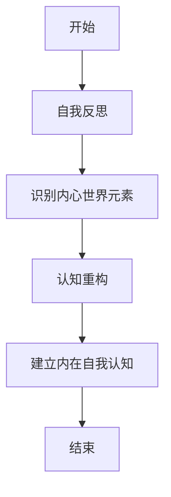
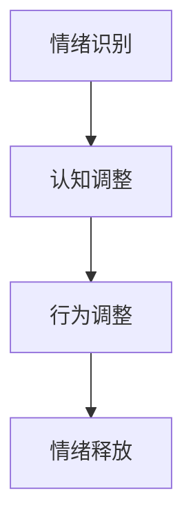
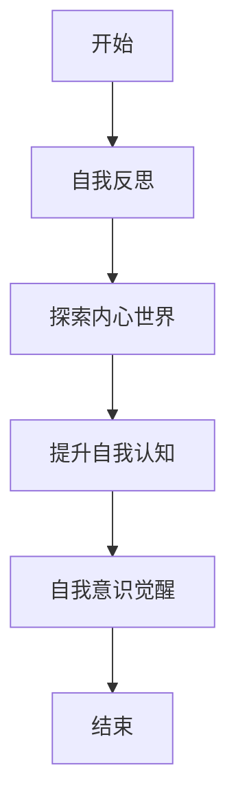
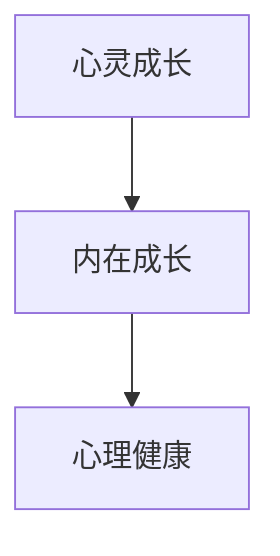
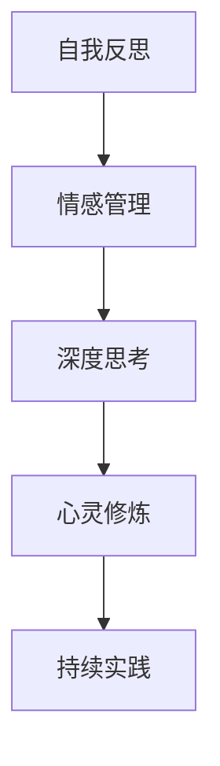
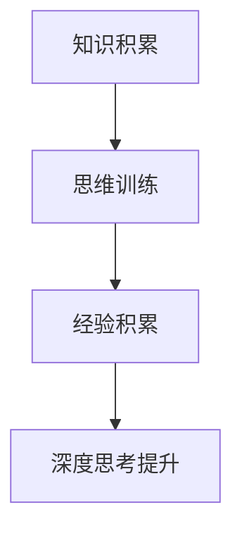
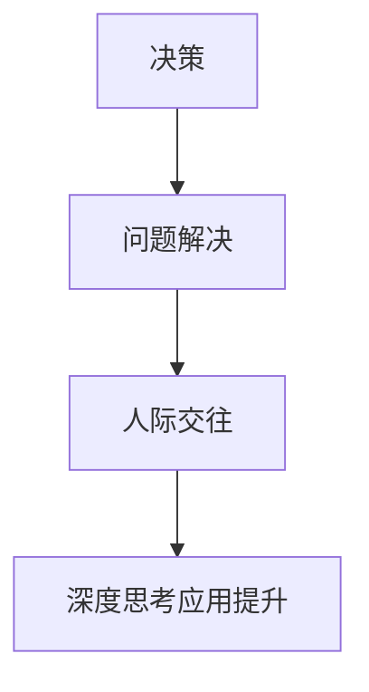

                 


当然可以，我们按照给出的文章大纲来逐步分析和构建每个章节的内容。

### 第2章：探索内在自我

**2.1 内在自我认知的建立**

**背景介绍：**
内在自我认知是个体对自身内心世界的理解，包括情感、思想和价值观。这是内在成长的基础，也是心理健康的关键。

**核心概念与联系：**
内在自我认知可以看作是个体心理活动的反映，它与自我意识、内心世界紧密相关。下面是一个概念属性特征对比表格：

| 概念               | 属性特征                                                   |
|--------------------|-----------------------------------------------------------|
| 自我意识           | 对自身存在和状态的认知                                     |
| 内心世界           | 情感、思想、价值观等内在体验的总和                       |
| 内在自我认知       | 对内心世界的理解和识别                                   |

使用Mermaid ER图表示这些概念之间的关系：

```mermaid
erDiagram
  ASELF_AWARENESS ||--|{ AINNER_WORLD } InnerWorld : inner world
  ASELF_AWARENESS ||--|{ AINNER_SELF_C } InnerSelfC : inner self cognition
```

**算法原理讲解：**
内在自我认知的建立可以通过以下算法实现：
1. 自我反思：通过反思自己的行为和情绪，识别内心世界的元素。
2. 认知重构：通过改变对内心世界的看法，调整自我认知。

以下是算法流程图：



**数学公式：**
内在自我认知的建立可以用以下公式表示：

$$
\text{内在自我认知} = f(\text{自我反思}, \text{内心世界元素}, \text{认知重构})
$$

**实际案例分析：**
张华通过每天写日记来反思自己的情绪和行为，逐渐建立了对内心世界的认知。这个过程帮助他更好地理解自己，提升了内在自我认知。

### 2.2 情绪管理的艺术

**背景介绍：**
情绪管理是指个体如何处理自己的情绪，以达到心理健康和内在平衡。情绪管理是内在自我认知的重要组成部分。

**核心概念与联系：**
情绪管理涉及情绪识别、认知调整、行为调整和情绪释放。下面是一个情绪管理流程图：



**算法原理讲解：**
情绪管理算法包括以下几个步骤：
1. 情绪识别：通过观察和反思，识别当前的情绪状态。
2. 认知调整：通过认知重构，改变对情绪的看法。
3. 行为调整：通过调整行为，如运动、呼吸等，缓解情绪。
4. 情绪释放：通过表达、宣泄等方式，释放情绪。

**数学公式：**
情绪管理的数学模型可以表示为：

$$
\text{情绪管理} = f(\text{情绪识别}, \text{认知调整}, \text{行为调整}, \text{情绪释放})
$$

**实际案例分析：**
李娜在遇到工作压力时，通过深呼吸和运动来调整自己的情绪，最终学会了有效地管理情绪。

### 2.3 自我意识的觉醒

**背景介绍：**
自我意识的觉醒是指个体开始意识到自己的内在世界，并开始对其产生关注和探索。这是内在成长的重要步骤。

**核心概念与联系：**
自我意识的觉醒涉及到自我反思能力、内心世界的探索和自我认知的提升。以下是自我意识觉醒的流程图：



**算法原理讲解：**
自我意识的觉醒可以通过以下算法实现：
1. 自我反思：通过反思，识别内心的情绪和想法。
2. 探索内心世界：通过冥想、写作等方式，深入探索内心世界。
3. 提升自我认知：通过学习和实践，提升对自我的理解。

**数学公式：**
自我意识的觉醒可以表示为：

$$
\text{自我意识觉醒} = f(\text{自我反思}, \text{内心世界探索}, \text{自我认知提升})
$$

**实际案例分析：**
王强在开始练习冥想后，逐渐意识到自己内心的恐惧和焦虑，并通过反思和探索，最终实现了自我意识的觉醒。

**小结：**
通过以上分析，我们可以看到，探索内在自我涉及自我认知、情绪管理和自我意识的觉醒。这些过程相互关联，共同构成了内在成长的基础。在接下来的章节中，我们将进一步探讨如何培养深度思考的习惯，以及如何在生活中实践内在成长的理念。

### 2.4 心灵成长与内在成长的关系

**背景介绍：**
心灵成长和内在成长是相辅相成的，两者共同构成了个体心理健康的基石。

**核心概念与联系：**
心灵成长是指个体在精神层面上提升自己的过程，包括对人生意义、宇宙奥秘的探索。内在成长则更侧重于个体内心世界的认知和发展。以下是心灵成长与内在成长的关系图：



**算法原理讲解：**
心灵成长和内在成长可以通过以下算法实现：
1. 精神修炼：通过冥想、冥思等方式，提升心灵层次。
2. 内在探索：通过自我反思、写作等方式，深入理解内心世界。
3. 综合提升：通过将心灵成长和内在探索相结合，实现全面的心理健康。

**数学公式：**
心灵成长和内在成长的关系可以表示为：

$$
\text{心理健康} = f(\text{心灵成长}, \text{内在成长})
$$

**实际案例分析：**
赵敏通过持续的冥想和写作，不仅提升了内心的平静，也加深了对人生意义的理解，实现了心灵和内在的双重成长。

### 2.5 如何在日常生活中实践内在成长

**背景介绍：**
内在成长是一个持续的过程，需要在日常生活中不断实践和培养。

**核心概念与联系：**
内在成长的实践涉及到自我反思、情感管理、深度思考和心灵修炼。以下是内在成长实践流程图：



**算法原理讲解：**
内在成长的实践可以通过以下算法实现：
1. 自我反思：每天花时间反思自己的行为和情绪，识别内心的需求和困惑。
2. 情感管理：通过认知重构和行为调整，有效地管理自己的情绪。
3. 深度思考：培养对问题的深入分析和思考能力，提升思维质量。
4. 心灵修炼：通过冥想、冥思等方式，提升心灵层次。

**数学公式：**
内在成长的实践可以表示为：

$$
\text{内在成长} = f(\text{自我反思}, \text{情感管理}, \text{深度思考}, \text{心灵修炼})
$$

**实际案例分析：**
陈晨通过每天写日记来反思自己的行为和情绪，通过阅读和冥想来培养深度思考能力，最终在日常生活中实现了内在成长。

**小结：**
通过以上分析，我们可以看到，内在成长是一个复杂而多样的过程，涉及到自我认知、情绪管理、深度思考和心灵成长。这些过程相互交织，共同构成了个体内在成长的基础。在接下来的章节中，我们将进一步探讨如何培养深度思考的习惯，以及如何在生活中实践内在成长的理念。

### 第3章：培养深度思考的习惯

**3.1 深度思考与浅层思考的区别**

**背景介绍：**
深度思考与浅层思考是两种截然不同的思维方式。深度思考涉及对问题进行深入分析和综合评估，而浅层思考则停留在表面，缺乏深度和广度。

**核心概念与联系：**
深度思考和浅层思考的区别在于思维的深度、广度和综合能力。以下是两者的对比表格：

| 特征             | 深度思考                       | 浅层思考                       |
|------------------|--------------------------------|--------------------------------|
| 思考深度         | 对问题进行深入分析             | 只关注表面现象                 |
| 思考广度         | 综合多方面信息进行评估         | 缺乏全局观                     |
| 综合能力         | 能够发现问题和解决问题         | 缺乏解决复杂问题的能力         |

**算法原理讲解：**
深度思考与浅层思考可以通过以下算法进行区分：

$$
\text{深度思考} = f(\text{问题分析}, \text{综合评估}, \text{创新能力})
$$

$$
\text{浅层思考} = f(\text{表面观察}, \text{简单判断}, \text{缺乏创新})
$$

**实际案例分析：**
在解决一个复杂项目时，李华通过深度思考，分析了项目的各个方面，最终找到了最优的解决方案。而张强仅停留在表面，未能发现关键问题，导致项目进展缓慢。

### 3.2 提升深度思考的能力

**背景介绍：**
提升深度思考的能力对于个人的职业发展和生活质量至关重要。

**核心概念与联系：**
提升深度思考的能力涉及多个方面，包括知识的积累、思维的训练和经验的积累。以下是提升深度思考能力的流程图：



**算法原理讲解：**
提升深度思考的能力可以通过以下算法实现：
1. 知识积累：通过阅读、学习，扩展知识面。
2. 思维训练：通过解决问题、逻辑思维训练，提升思维能力。
3. 经验积累：通过实践和反思，总结经验。

**数学公式：**
深度思考能力的提升可以表示为：

$$
\text{深度思考能力} = f(\text{知识积累}, \text{思维训练}, \text{经验积累})
$$

**实际案例分析：**
王鹏通过不断学习新技术、参加问题解决工作坊，以及在项目中总结经验，逐渐提升了他的深度思考能力。

### 3.3 深度思考在生活中的应用

**背景介绍：**
深度思考不仅适用于工作，也应当贯穿于生活的方方面面，以提高生活质量。

**核心概念与联系：**
深度思考在生活中的应用包括决策、问题解决和人际交往。以下是深度思考在生活中的应用流程图：



**算法原理讲解：**
深度思考在生活中的应用可以通过以下算法实现：
1. 决策：通过深入分析各种可能的后果，做出明智的决策。
2. 问题解决：通过分析问题的根本原因，找到有效的解决方案。
3. 人际交往：通过理解他人，建立深度的人际关系。

**数学公式：**
深度思考在生活中的应用可以表示为：

$$
\text{生活应用} = f(\text{决策分析}, \text{问题解决}, \text{人际理解})
$$

**实际案例分析：**
赵莉在购买房屋时，通过深度思考分析了各种因素，最终做出了明智的决策。她在解决家庭问题时，也通过深度思考找到了问题的根源，并成功地解决了问题。

**小结：**
通过以上分析，我们可以看到，培养深度思考的习惯对于个人发展至关重要。深度思考不仅能够帮助我们更好地解决问题，还能够提升我们的生活质量。在接下来的章节中，我们将进一步探讨如何建立健康的生活方式，以及如何通过内在成长来实现更深层次的人生目标。

