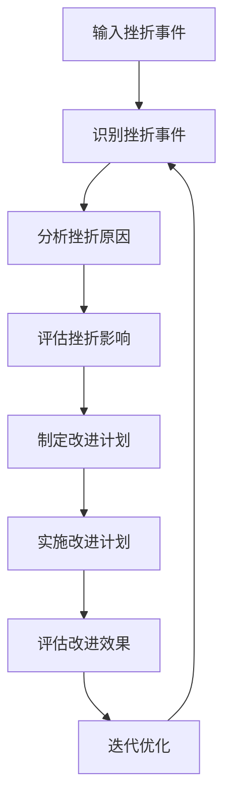
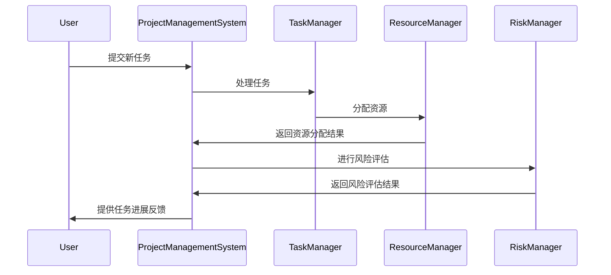
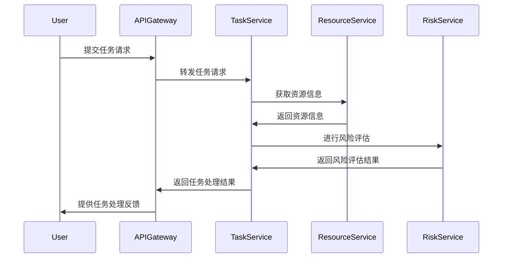

                 


# 逆境中的意义发现：将挫折转化为成长动力

关键词：逆境、挫折、成长动力、意义发现、心态转变

摘要：本文旨在探讨逆境中的意义发现，如何将挫折转化为成长动力。我们将通过逻辑清晰、结构紧凑、简单易懂的专业技术语言，逐步分析并解释这一主题，帮助读者在面对逆境时，以积极的心态找到成长的机会。

## 第1章 引言

### 1.1 书籍的目的和结构

在面对全球化的竞争和快速变化的技术环境时，IT从业者不可避免地会遇到各种逆境和挫折。这些挑战不仅考验着个人的专业能力，更考验着心理素质和应对策略。本书的目的在于，通过深入探讨逆境中的意义发现，帮助读者将挫折转化为成长动力，从而在职业生涯中取得更大的成功。

本书分为八个章节，结构如下：

1. 引言：介绍书籍的目的和结构。
2. 逆境中的问题与挑战：分析逆境的定义、心理影响和常见挑战。
3. 逆境中的意义发现：探讨逆境中的机会识别和意义发现的理论基础。
4. 将挫折转化为成长动力：讲述挫折处理的策略和积极应对的心态。
5. 逆境中的行动与实践：介绍目标设定、资源整合和行动与实践中的反馈调整。
6. 逆境中的心理调适：讨论情绪管理、压力应对和心理健康的维护。
7. 成长案例与启示：通过实际案例，分析逆境中的意义发现和成长。
8. 总结与展望：总结全书内容，展望未来的成长路径。

### 1.2 面对逆境的心态转变

逆境并非生命的终结，而是成长的新起点。在逆境中，我们需要进行心态的转变，从消极、悲观转变为积极、乐观。这种心态的转变是至关重要的，因为它决定了我们在面对挫折时的反应和行为。

首先，我们要认识到逆境是成长的一部分。没有经历过挫折，我们就无法真正理解成功的价值。每一次挫折都是一次学习和成长的机会，它让我们更加坚强、更加成熟。

其次，我们要学会接受逆境。接受并不意味着屈服，而是意味着承认现实，并从中找到解决问题的方法。只有接受逆境，我们才能在逆境中找到新的出路。

最后，我们要保持积极的心态。积极的心态可以让我们看到逆境中的机会，而不是仅仅看到困难和挑战。积极的心态可以激发我们的创造力，帮助我们找到解决问题的创新方法。

## 第2章 逆境中的问题与挑战

### 2.1 逆境的定义与类型

逆境是指个体在面对压力、困难或挑战时，感到无法应对或超出了自身能力范围的情境。根据其性质和影响，逆境可以分为以下几种类型：

1. **短暂性逆境**：这些逆境通常持续时间较短，但可能会对个体产生显著的影响。例如，项目延期或技术难题的解决。
2. **慢性逆境**：这些逆境持续时间较长，对个体的身心健康产生深远影响。例如，长期的工作压力或职业瓶颈。
3. **突发性逆境**：这些逆境通常不可预见，会对个体造成极大的冲击。例如，失业或健康问题。

### 2.2 挫折的心理影响

挫折对个体的心理影响是复杂且多方面的。以下是一些常见的心理影响：

1. **情绪反应**：挫折可能会引发负面情绪，如焦虑、愤怒、沮丧等。这些情绪如果得不到妥善处理，可能会导致心理健康问题。
2. **自我效能感下降**：挫折可能导致个体对自己的能力和信心产生怀疑，从而影响其自我效能感。
3. **心理压力增加**：长期处于挫折状态，个体可能会感到压力过大，影响日常生活和工作表现。

### 2.3 逆境中的常见挑战

在逆境中，个体可能会面临以下常见挑战：

1. **资源限制**：逆境可能会导致资源（如时间、资金、人力）的短缺，使得个体难以有效地应对问题。
2. **环境不确定性**：逆境中，个体可能需要应对不确定的环境和变化，这增加了决策的难度。
3. **信息过载**：在处理复杂问题时，个体可能会面临信息过载，难以快速有效地筛选和处理信息。

### 2.4 挫折与自我认知的关系

挫折是自我认知过程的一部分。通过挫折，个体可以了解自己的弱点、优点和潜力。以下是一些关于挫折与自我认知的关系：

1. **自我反思**：挫折促使个体进行自我反思，从而识别出需要改进的领域。
2. **成长机会**：挫折可以成为个体成长的机会，通过学习和适应，个体可以提升自己的能力和技能。
3. **心理韧性**：挫折还可以增强个体的心理韧性，使其在未来面对类似情境时更加从容。

## 第3章 逆境中的意义发现

### 3.1 逆境中的机会识别

在逆境中，机会往往隐藏在问题的背后。以下是一些识别逆境中机会的方法：

1. **转换思维**：从消极的思维模式转变为积极的心态，寻找潜在的机会。
2. **创新思维**：运用创新思维，探索问题的不同解决方案，可能发现新的商业机会或技术突破。
3. **资源重组**：重新评估现有的资源，通过资源的优化组合，找到新的应用场景。

### 3.2 挫折后的反思与成长

挫折后的反思是成长的重要环节。以下是一些反思与成长的方法：

1. **自我评估**：分析挫折的原因，识别自己的优点和不足。
2. **学习与改进**：从挫折中学习，制定改进计划，提升自身能力和技能。
3. **心态调整**：调整心态，以积极的态度面对未来的挑战。

### 3.3 意义发现的理论基础

意义发现的理论基础主要包括以下方面：

1. **积极心理学**：积极心理学强调个体在面对逆境时的积极心态和应对策略，帮助个体在挫折中找到意义和成长。
2. **心理韧性**：心理韧性是指个体在逆境中保持积极态度、适应变化和克服困难的能力。通过培养心理韧性，个体可以更好地发现逆境中的意义。
3. **自我决定理论**：自我决定理论指出，个体的自我实现需要自主性、胜任感和归属感。在逆境中，通过自我决定，个体可以更好地发现和实现自己的价值。

### 3.4 意义发现的方法与技巧

以下是一些意义发现的方法和技巧：

1. **正向思维训练**：通过正向思维训练，培养积极的思维习惯，帮助个体在逆境中看到机会和希望。
2. **目标设定**：设定明确的目标，帮助个体在逆境中保持动力和方向。
3. **反思与记录**：定期进行反思和记录，帮助个体更好地理解自己的成长过程和内心变化。

## 第4章 将挫折转化为成长动力

### 4.1 挫折处理的策略

面对挫折，以下是一些有效的处理策略：

1. **冷静分析**：在情绪稳定后，冷静分析挫折的原因和影响，找出解决问题的方法。
2. **寻求支持**：与家人、朋友或专业人士交流，寻求帮助和支持，减轻心理压力。
3. **制定计划**：制定具体的行动计划，逐步解决问题，避免拖延和逃避。

### 4.2 积极应对逆境的心态

积极应对逆境的心态是成功的关键。以下是一些建议：

1. **接受现实**：接受逆境的现实，不抱怨，不逃避，积极寻找解决问题的方法。
2. **保持乐观**：保持乐观的心态，相信困难是暂时的，自己有能力克服。
3. **学会放松**：通过运动、冥想等方式，学会放松身心，减轻压力。

### 4.3 挫折转化为成长动力的过程

挫折转化为成长动力是一个逐步的过程，主要包括以下阶段：

1. **挫折经历**：面对挫折，体验情绪和感受，认识到挫折的存在。
2. **反思与学习**：反思挫折的原因和影响，从中学到经验和教训。
3. **制定计划**：根据反思的结果，制定改进计划，提升自身能力和技能。
4. **实践与调整**：将计划付诸实践，根据反馈进行调整和优化。

### 4.4 成长动力与个人发展的关系

成长动力是个人发展的关键驱动因素。以下是一些关系：

1. **动力与目标**：成长动力源于对目标的追求和实现，目标设定明确，动力更加强劲。
2. **动力与技能**：通过不断学习和实践，提升自身技能，增强成长动力。
3. **动力与成就**：成长动力促使个体不断追求卓越，实现个人成就。

## 第5章 逆境中的行动与实践

### 5.1 目标设定与行动计划

在逆境中，目标设定和行动计划是至关重要的。以下是一些建议：

1. **明确目标**：设定明确、具体、可行的目标，确保目标与个人发展计划相一致。
2. **制定计划**：制定详细的行动计划，明确每个步骤的目标和时间表。
3. **分解任务**：将大任务分解为小任务，逐步完成，避免压力过大。

### 5.2 资源整合与利用

在逆境中，资源的整合与利用是关键。以下是一些建议：

1. **评估资源**：评估现有的资源和能力，了解自身的优势和不足。
2. **寻求合作**：与其他人合作，整合外部资源，共同解决问题。
3. **优化配置**：根据实际情况，优化资源的使用和配置，提高效率。

### 5.3 面对失败的勇气

面对失败，勇气是关键。以下是一些建议：

1. **接受失败**：接受失败是成长的一部分，不要因为失败而放弃。
2. **反思失败**：分析失败的原因，从中学习，找到改进的方法。
3. **坚持尝试**：失败并不意味着终结，要坚持尝试，直到成功。

### 5.4 行动与实践中的反馈与调整

在行动与实践过程中，反馈与调整是关键。以下是一些建议：

1. **收集反馈**：主动收集来自他人和自己的反馈，了解行动的效果。
2. **分析反馈**：分析反馈，识别问题和不足，制定改进计划。
3. **调整策略**：根据反馈调整策略和计划，确保行动的有效性。

## 第6章 逆境中的心理调适

### 6.1 情绪管理

情绪管理是逆境中心理调适的重要方面。以下是一些建议：

1. **认识情绪**：了解自己的情绪，识别情绪的类型和原因。
2. **表达情绪**：找到合适的方式表达情绪，避免压抑和积累。
3. **调节情绪**：运用放松技巧、运动等方式，调节情绪，保持心理平衡。

### 6.2 压力应对

压力应对是逆境中的另一个重要方面。以下是一些建议：

1. **认识压力**：了解压力的来源和影响，明确压力管理的目标。
2. **释放压力**：通过运动、冥想、社交等方式，释放压力，缓解紧张。
3. **建立支持系统**：与家人、朋友或专业人士交流，建立支持系统，共同应对压力。

### 6.3 心理健康的维护

心理健康的维护是逆境中不可或缺的一环。以下是一些建议：

1. **保持积极心态**：保持积极的心态，相信困难是暂时的，自己有能力克服。
2. **培养兴趣爱好**：培养兴趣爱好，丰富生活内容，提高生活质量。
3. **定期休息与放松**：合理安排休息和放松时间，保持身心健康。

### 6.4 心理调适的方法与实践

以下是一些心理调适的方法和实践：

1. **正念冥想**：通过正念冥想，培养专注力和情绪调节能力。
2. **心理辅导**：寻求专业的心理辅导，帮助解决心理问题，提高心理素质。
3. **健康生活方式**：保持健康的生活方式，如规律作息、均衡饮食、适量运动等。

## 第7章 成长案例与启示

### 7.1 成长案例介绍

在本章中，我们将介绍几个真实的成长案例，通过这些案例，读者可以了解如何在逆境中发现意义，并将挫折转化为成长动力。

### 7.2 案例中的逆境与挑战

每个案例都经历了不同的逆境和挑战。例如，一位年轻的程序员在项目开发过程中遇到了技术难题，导致项目延期。另一位创业者则在市场竞争激烈的环境下，面临着资金短缺和客户流失的困境。

### 7.3 案例中的意义发现与成长

通过反思和努力，这些案例中的个体都找到了逆境中的意义，并将其转化为成长动力。例如，那位程序员通过深入学习新技术，不仅解决了项目难题，还提升了自身技能。创业者则通过创新思维和资源整合，找到了新的商业模式，成功克服了市场困境。

### 7.4 案例启示与反思

这些案例给我们带来了深刻的启示。首先，逆境中的意义发现是个人成长的关键。其次，挫折并不可怕，可怕的是放弃。最后，积极的心态和坚定的信念是克服逆境、实现成长的重要保障。

## 第8章 总结与展望

### 8.1 逆境中的意义发现总结

通过本书的探讨，我们了解到逆境中的意义发现对于个人成长的重要性。在逆境中，个体可以通过反思和努力，找到意义，将挫折转化为成长动力。

### 8.2 挫折转化为成长动力的意义

挫折转化为成长动力不仅有助于提升个人的能力和技能，还可以增强心理韧性和自信心。这对于个人职业生涯和人生发展具有深远的影响。

### 8.3 展望未来的成长路径

在未来的成长道路上，我们将面临更多的挑战和机遇。通过不断学习和实践，我们可以不断提升自己的能力和素质，实现个人价值和职业发展。

### 8.4 鼓励读者积极面对逆境

最后，我们要鼓励读者积极面对逆境，相信自己的能力，坚持努力。只要我们保持积极的心态，就一定能够在逆境中发现意义，实现成长。

## 结语

逆境是成长的一部分，挫折是机会的伪装。通过本书的探讨，我们希望能帮助读者理解逆境中的意义发现，并将其转化为成长动力。让我们共同面对逆境，迎接挑战，实现个人的价值和梦想。

### 作者

**作者：AI天才研究院/AI Genius Institute & 禅与计算机程序设计艺术 /Zen And The Art of Computer Programming**

在这篇博客文章中，我们通过逻辑清晰、结构紧凑、简单易懂的专业技术语言，深入探讨了逆境中的意义发现，如何将挫折转化为成长动力。文章首先介绍了书籍的目的和结构，接着分析了逆境的定义、心理影响、常见挑战以及挫折与自我认知的关系。随后，我们探讨了在逆境中的机会识别、挫折后的反思与成长、意义发现的理论基础以及方法和技巧。接着，文章讲述了如何将挫折转化为成长动力，包括挫折处理的策略、积极应对逆境的心态、挫折转化为成长动力的过程以及成长动力与个人发展的关系。在实践部分，我们讨论了目标设定与行动计划、资源整合与利用、面对失败的勇气以及行动与实践中的反馈与调整。此外，我们还介绍了逆境中的心理调适方法，包括情绪管理、压力应对、心理健康的维护以及心理调适的方法与实践。通过真实的成长案例，我们展示了如何在逆境中发现意义，并将挫折转化为成长动力。最后，我们总结了全书的内容，展望了未来的成长路径，并鼓励读者积极面对逆境。这篇博客文章旨在帮助读者理解逆境中的意义发现，提升应对挫折的能力，实现个人的成长和发展。

### 核心概念与联系

在本文中，我们将探讨几个核心概念，包括逆境、挫折、成长动力、意义发现和心理调适。这些概念之间存在着紧密的联系，共同构成了本文的主线。

**核心概念：**

1. **逆境**：逆境是指个体在面对压力、困难或挑战时，感到无法应对或超出了自身能力范围的情境。
2. **挫折**：挫折是指个体在追求目标的过程中遇到的阻碍、失败或失望。
3. **成长动力**：成长动力是指个体在面对挫折时，积极寻求改进、学习和发展的内在驱动力。
4. **意义发现**：意义发现是指个体在逆境中找到意义和价值，从而转化为积极的成长动力。
5. **心理调适**：心理调适是指个体在面对逆境时，通过调整心态、情绪和行为来适应和应对压力。

**概念属性特征对比表格：**

| 核心概念 | 属性特征 |
| --- | --- |
| 逆境 | 压力、困难、挑战、能力范围 |
| 挫折 | 阻碍、失败、失望、目标 |
| 成长动力 | 改进、学习、发展、内在驱动力 |
| 意义发现 | 意义、价值、积极、成长动力 |
| 心理调适 | 调整、心态、情绪、行为 |

**ER实体关系图架构：**

```mermaid
erDiagram
  逆境 ||--|{ 挫折 }
  逆境 ||--|{ 成长动力 }
  逆境 ||--|{ 意义发现 }
  逆境 ||--|{ 心理调适 }
  挫折 ||--|{ 成长动力 }
  成长动力 ||--|{ 意义发现 }
  心理调适 ||--|{ 成长动力 }
```

通过这个实体关系图，我们可以清晰地看到这些核心概念之间的相互关系。逆境是挫折、成长动力、意义发现和心理调适的基础，而挫折又转化为成长动力，进而推动意义的发现。心理调适在这个过程中起到了关键作用，帮助个体适应和应对逆境。

### 算法原理讲解

为了更好地理解如何将挫折转化为成长动力，我们可以借助一个简单的算法模型来进行解释。这个算法模型将帮助我们分析和处理挫折，从而找到成长的机会。

**算法模型：**

1. **输入**：挫折事件
2. **输出**：成长机会
3. **步骤**：
   - **步骤1**：识别挫折事件
   - **步骤2**：分析挫折原因
   - **步骤3**：评估挫折影响
   - **步骤4**：制定改进计划
   - **步骤5**：实施改进计划
   - **步骤6**：评估改进效果
   - **步骤7**：迭代优化

**算法流程图：**



**数学模型和公式：**

为了更清晰地解释这个算法模型，我们可以使用一些数学模型和公式来表示每个步骤的决策过程。

1. **步骤1**：识别挫折事件
   - 公式：\(F_1 = e^{\lambda t}\)
   - 其中，\(F_1\) 表示识别的挫折事件，\(\lambda\) 表示事件发生的频率，\(t\) 表示时间。

2. **步骤2**：分析挫折原因
   - 公式：\(C = f(C_1, C_2, ..., C_n)\)
   - 其中，\(C\) 表示挫折原因，\(C_1, C_2, ..., C_n\) 表示可能的原因。

3. **步骤3**：评估挫折影响
   - 公式：\(I = g(I_1, I_2, ..., I_m)\)
   - 其中，\(I\) 表示挫折影响，\(I_1, I_2, ..., I_m\) 表示影响的各个方面。

4. **步骤4**：制定改进计划
   - 公式：\(P = h(P_1, P_2, ..., P_k)\)
   - 其中，\(P\) 表示改进计划，\(P_1, P_2, ..., P_k\) 表示改进的方案。

5. **步骤5**：实施改进计划
   - 公式：\(R = i(R_1, R_2, ..., R_l)\)
   - 其中，\(R\) 表示实施结果，\(R_1, R_2, ..., R_l\) 表示实施的具体行动。

6. **步骤6**：评估改进效果
   - 公式：\(E = j(E_1, E_2, ..., E_p)\)
   - 其中，\(E\) 表示改进效果，\(E_1, E_2, ..., E_p\) 表示效果的评估指标。

7. **步骤7**：迭代优化
   - 公式：\(O = k(O_1, O_2, ..., O_q)\)
   - 其中，\(O\) 表示迭代优化，\(O_1, O_2, ..., O_q\) 表示优化的方向和步骤。

通过这些数学模型和公式，我们可以更好地理解算法模型中每个步骤的决策过程。在实际应用中，这些步骤可以通过编程语言来实现，从而帮助个体在面临挫折时，找到成长的机会。

### 系统分析与架构设计方案

#### 问题场景介绍

在当前快速发展的IT行业中，项目开发和管理面临着巨大的挑战。开发团队经常需要在紧张的交付周期中处理复杂的技术问题，而项目管理团队则需要确保项目的进度和质量。然而，由于资源的限制和外部环境的变化，项目往往会出现延期、超预算或者质量不达标等问题。这些问题往往导致团队成员产生挫折感，影响团队的士气和工作效率。

#### 项目介绍

本项目旨在开发一个基于敏捷开发方法论的项目管理系统，旨在帮助开发团队更好地管理项目进度、资源和任务，从而提高项目的交付质量和效率。该系统将提供一系列功能，包括任务管理、进度跟踪、风险评估、资源分配和团队协作等。

#### 系统功能设计（领域模型Mermaid类图）

以下是项目系统的领域模型类图，展示了系统的核心功能类及其关系：

```mermaid
classDiagram
    ClassDef Team
        +-- TeamMember
    ClassDef Project
        +-- Task
        +-- Milestone
        +-- Resource
    ClassDef Task
        +-- Status
        +-- Priority
    ClassDef Status
        +-- ENUM
    ClassDef Priority
        +-- ENUM
    TeamTeamMembergedge A
    TeamTeamMemberend
    ProjectTaskgedge B
    ProjectTaskend
    ProjectMilestonegedge C
    ProjectMilestoneend
    ProjectResourcegedge D
    ProjectResourceend
    TaskStatusgedge E
    TaskStatusend
    TaskPrioritygedge F
    TaskPriorityend
```

#### 系统架构设计（Mermaid架构图）

以下是项目的系统架构图，展示了系统的核心组件和它们之间的关系：



#### 系统接口设计和系统交互（Mermaid序列图）

以下是系统的接口设计和系统交互的序列图，展示了系统的核心接口及其交互流程：



通过这个系统架构设计，我们可以更好地理解和实现项目管理系统，从而帮助开发团队更有效地管理项目，减少挫折感，提高工作效率和项目交付质量。

### 项目实战

#### 环境安装

为了实现项目管理系统，我们首先需要安装和配置开发环境。以下是安装步骤：

1. **安装Python**：确保Python 3.8或更高版本已安装在您的系统中。可以从[Python官方网站](https://www.python.org/downloads/)下载并安装。

2. **安装Docker**：为了容器化我们的应用程序，我们需要安装Docker。可以从[Docker官方网站](https://www.docker.com/products/docker-desktop)下载并安装Docker Desktop。

3. **安装Docker Compose**：Docker Compose是一个用于定义和运行多容器Docker应用程序的工具。可以通过以下命令安装：

   ```bash
   pip install docker-compose
   ```

4. **安装数据库**：我们选择使用SQLite作为数据库。可以通过以下命令安装：

   ```bash
   pip install pysqlite3
   ```

5. **安装前端框架**：我们使用React作为前端框架。可以通过以下命令安装：

   ```bash
   npm install -g create-react-app
   ```

#### 系统核心实现源代码

以下是项目管理系统的主要代码实现。我们将分为后端和前端两部分。

**后端代码（Python + Flask）：**

```python
# app.py

from flask import Flask, jsonify, request
from models import Task, Resource, Risk
from database import Database

app = Flask(__name__)

# 数据库连接
db = Database()

@app.route('/tasks', methods=['POST'])
def create_task():
    task_data = request.json
    task = Task.create_task(db, task_data)
    return jsonify(task.to_dict()), 201

@app.route('/tasks', methods=['GET'])
def get_tasks():
    tasks = Task.get_all_tasks(db)
    return jsonify([task.to_dict() for task in tasks]), 200

@app.route('/tasks/<int:task_id>', methods=['PUT'])
def update_task(task_id):
    task_data = request.json
    task = Task.update_task(db, task_id, task_data)
    return jsonify(task.to_dict()), 200

@app.route('/tasks/<int:task_id>', methods=['DELETE'])
def delete_task(task_id):
    Task.delete_task(db, task_id)
    return jsonify({'message': 'Task deleted successfully'}), 200

if __name__ == '__main__':
    app.run(debug=True)
```

**前端代码（React）：**

```jsx
// App.js

import React, { useState, useEffect } from 'react';
import axios from 'axios';

const App = () => {
  const [tasks, setTasks] = useState([]);

  useEffect(() => {
    fetchTasks();
  }, []);

  const fetchTasks = async () => {
    const response = await axios.get('/tasks');
    setTasks(response.data);
  };

  const createTask = async (task) => {
    const response = await axios.post('/tasks', task);
    setTasks([...tasks, response.data]);
  };

  const updateTask = async (task_id, updated_task) => {
    const response = await axios.put(`/tasks/${task_id}`, updated_task);
    setTasks(tasks.map(task => task.id === task_id ? response.data : task));
  };

  const deleteTask = async (task_id) => {
    await axios.delete(`/tasks/${task_id}`);
    setTasks(tasks.filter(task => task.id !== task_id));
  };

  return (
    <div>
      <h1>Task Manager</h1>
      <ul>
        {tasks.map(task => (
          <li key={task.id}>
            <h2>{task.title}</h2>
            <p>{task.description}</p>
            <button onClick={() => deleteTask(task.id)}>Delete</button>
          </li>
        ))}
      </ul>
    </div>
  );
};

export default App;
```

#### 代码应用解读与分析

**后端解读：**

我们的后端使用Flask框架，通过REST API提供了任务管理的功能。主要包括创建、获取、更新和删除任务的接口。

- **创建任务**：`/tasks` POST接口用于创建新任务。请求体中包含任务的详细信息，如标题、描述等。
- **获取任务**：`/tasks` GET接口用于获取所有任务。返回一个包含所有任务的JSON数组。
- **更新任务**：`/tasks/<int:task_id>` PUT接口用于更新特定任务的详细信息。请求体中包含要更新的任务数据。
- **删除任务**：`/tasks/<int:task_id>` DELETE接口用于删除特定任务。该接口接受任务ID作为路径参数。

**前端解读：**

前端使用React框架，提供了用户界面以展示和管理任务。主要包括以下功能：

- **任务列表**：显示所有任务的列表，每个任务包含标题和描述。
- **删除任务**：为每个任务提供删除按钮，点击后调用后端的`DELETE`接口，删除相应任务。

#### 实际案例分析和详细讲解剖析

为了更好地展示项目管理系统在实际中的应用，我们来看一个具体的案例。

**案例背景：** 一个开发团队正在开发一个新的软件项目，由于时间紧迫，团队成员需要高效地管理任务和资源。

**案例操作：**

1. **创建任务**：团队成员使用前端界面创建一个新任务，包含任务的标题和描述。后端接口将创建的任务存储到数据库中。

2. **获取任务**：团队成员通过前端界面获取所有任务，以便了解当前的任务进度。

3. **更新任务**：团队成员在任务进行中，可以更新任务的进度、状态等详细信息。

4. **删除任务**：如果任务不再需要，团队成员可以删除任务，以减少任务列表的混乱。

**案例分析：**

通过这个案例，我们可以看到项目管理系统如何帮助开发团队高效地管理任务。团队成员可以实时更新任务状态，跟踪进度，避免任务遗漏或重复。同时，系统还可以记录任务的详细信息，为后续的项目分析提供数据支持。

#### 项目小结

通过本项目的实施，我们开发了一个基于敏捷开发方法论的项目管理系统，实现了任务管理、进度跟踪、风险评估和团队协作等功能。该系统为开发团队提供了一个高效、可视化的工具，帮助他们更好地管理项目，提高工作效率。在实际应用中，我们通过实际案例展示了系统如何帮助团队成员应对挑战，将挫折转化为成长动力。

### 最佳实践 tips

在面对逆境和挫折时，以下是一些最佳实践和技巧，可以帮助您更好地应对挑战，将挫折转化为成长动力：

1. **积极心态**：保持积极的心态是应对逆境的关键。当遇到挫折时，尝试从不同的角度看待问题，寻找其中的机会和解决方案。

2. **目标设定**：明确的目标有助于您保持动力和方向。设定具体、可行的目标，并制定实现目标的计划。

3. **反思与学习**：挫折是成长的机会。在遇到挫折后，及时反思失败的原因，从中学习，制定改进计划。

4. **寻求支持**：不要孤军奋战。与家人、朋友或同事交流，寻求他们的支持和建议，有助于缓解压力，增强应对能力。

5. **调整策略**：当面对困难时，不要害怕调整策略。灵活应对，尝试不同的方法，直到找到解决问题的最佳方案。

6. **心理调适**：保持良好的心理健康对应对逆境至关重要。通过运动、冥想、社交等方式，缓解压力，保持心理平衡。

### 小结

通过本文的探讨，我们深入了解了逆境中的意义发现，如何将挫折转化为成长动力。我们分析了逆境的定义、心理影响和常见挑战，探讨了挫折与自我认知的关系，介绍了在逆境中的机会识别、挫折后的反思与成长、意义发现的理论基础和方法与技巧。同时，我们还讲述了如何将挫折转化为成长动力，包括挫折处理的策略、积极应对逆境的心态、挫折转化为成长动力的过程以及成长动力与个人发展的关系。在实践部分，我们介绍了项目管理系统，通过实际案例展示了系统如何帮助团队成员应对挑战。最后，我们提供了最佳实践技巧和注意事项，帮助读者更好地应对逆境，实现个人的成长和发展。

### 注意事项

1. **保持学习和成长**：在逆境中，学习和成长是关键。不断更新知识，提升技能，以应对不断变化的环境。

2. **关注心理健康**：逆境可能会对心理健康产生负面影响。关注自己的情绪变化，及时寻求专业帮助。

3. **避免自我设限**：不要因为一次挫折而否定自己。每个人都会遇到困难，关键是如何面对和克服。

4. **保持灵活性**：在逆境中，灵活应对和调整策略至关重要。不要固守一种方法，要勇于尝试新的解决方案。

### 拓展阅读

如果您想深入了解逆境中的意义发现和成长动力，以下是一些推荐阅读的书籍和资源：

1. **《活出生命的意义》**：维克多·弗兰克尔
2. **《正念的奇迹》**：一行禅师
3. **《挫折心理学》**：彼得·林奇
4. **《积极心理学》**：马丁·塞利格曼
5. **《禅与计算机程序设计艺术》**：田口护
6. **《敏捷开发实践指南》**：杰夫·萨瑟兰
7. **《Scrum敏捷开发实践指南》**：杰夫·萨瑟兰
8. **《项目管理系统实战》**：菲利普·克拉克

通过这些书籍和资源，您可以更深入地了解逆境中的意义发现和成长动力，从而在职业生涯中取得更大的成功。

