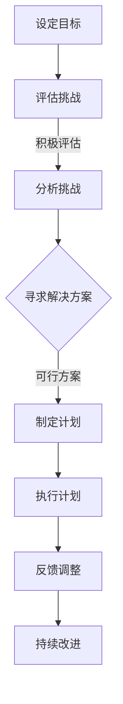
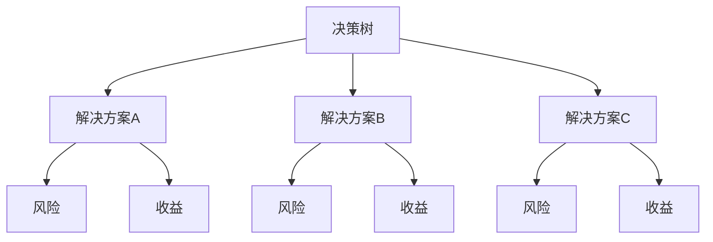
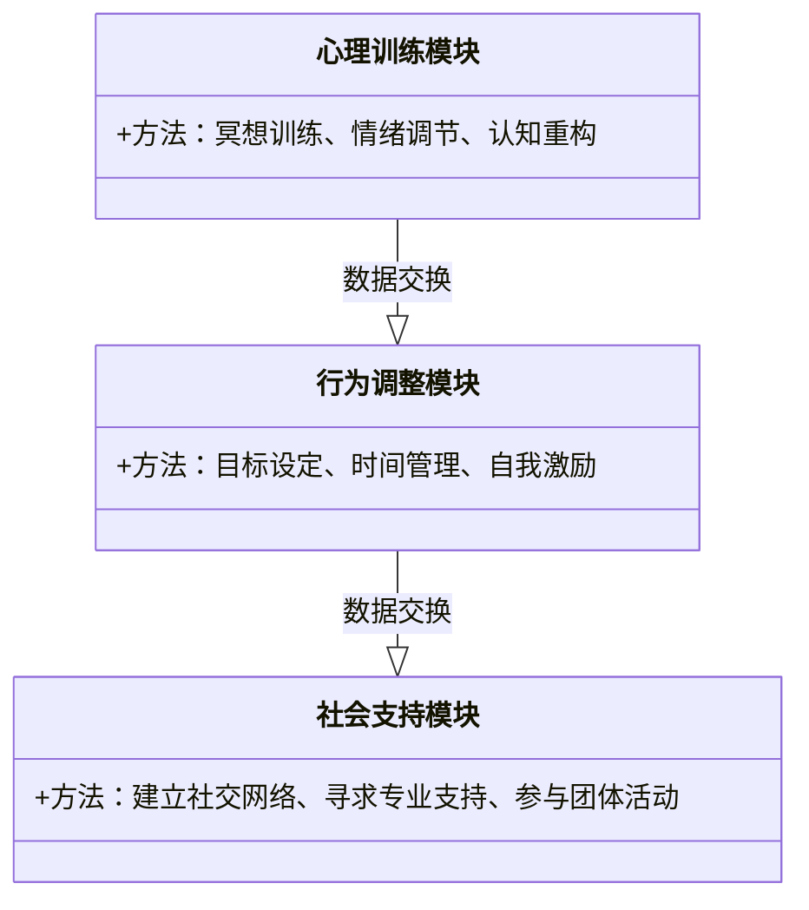
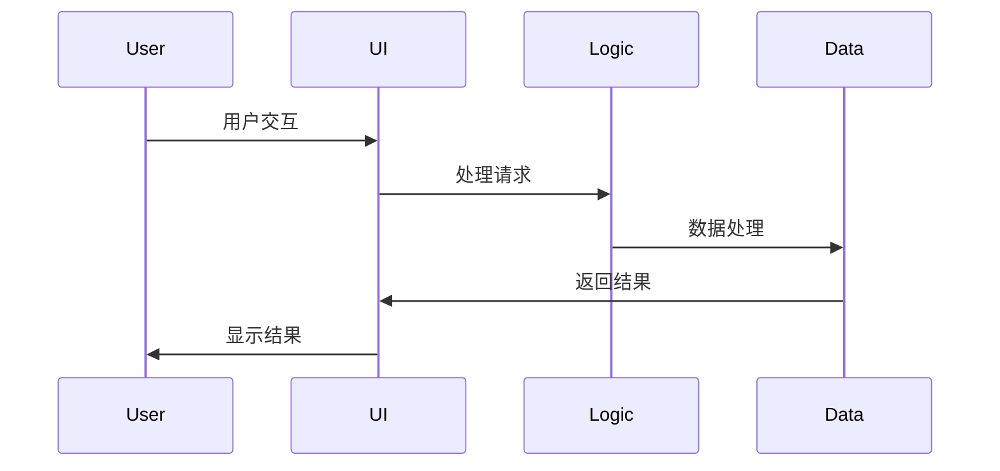
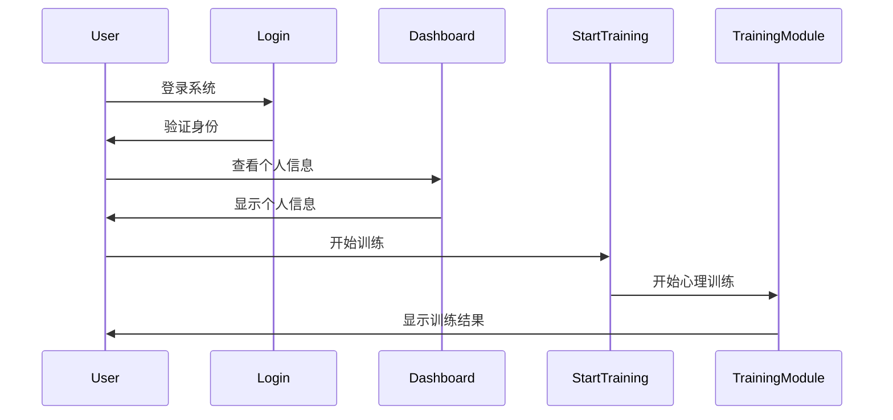
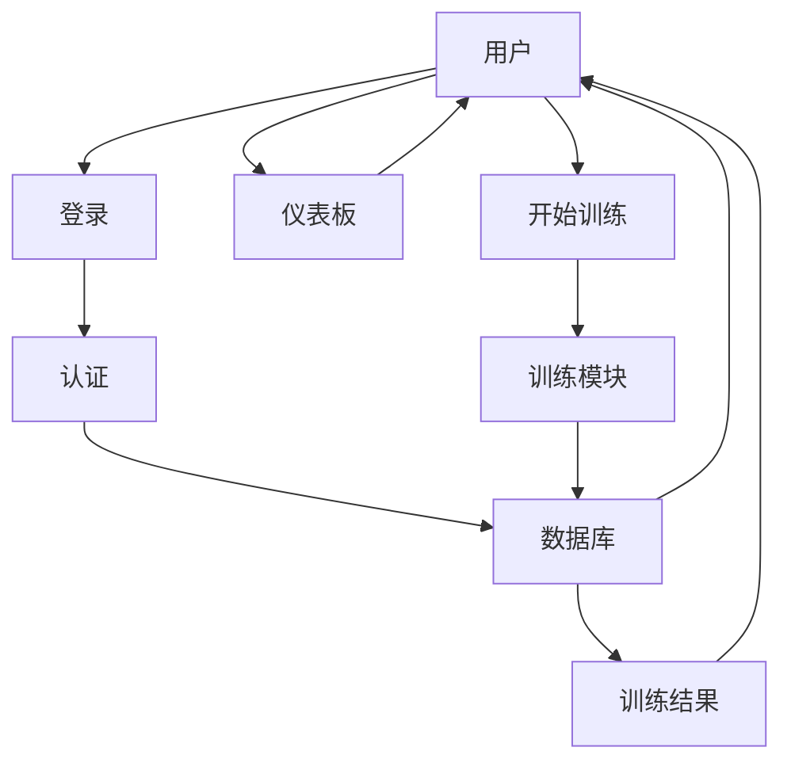

                 


## 引言：逆境中的成长

逆境，是每个人在人生旅途上不可避免的一部分。无论是职场中的竞争、项目中的难题，还是生活中的意外和挫折，逆境如同阴影，始终伴随我们的成长。然而，逆境并非全然是负面的，它同样蕴藏着无尽的机遇。如何正确看待并利用逆境，将其转化为个人和职业成长的动力，是我们需要深入探讨的问题。

本文将围绕“逆境中的成长：将挑战转化为机遇”这一主题，分步骤展开讨论。我们将首先定义逆境，探讨逆境对个人成长的影响，接着分析如何拥抱挑战和培养韧性，然后介绍一系列实用的个人成长策略，并通过实际案例进行详细剖析。最终，我们将总结逆境中成长的重要性，并给出具体的实践建议。

### 文章关键词

1. 逆境
2. 成长
3. 挑战
4. 机遇
5. 韧性
6. 个人成长策略
7. 案例分析

### 文章摘要

本文旨在探讨逆境中的成长之道，通过一步步的分析和推理，帮助读者理解逆境的本质，学会拥抱挑战，培养韧性，并运用有效的个人成长策略。文章将结合实际案例，详细解析如何在逆境中找到机遇，实现个人和职业的飞跃。希望通过本文，读者能够树立正确的逆境观，积极面对生活中的挑战，从而在逆境中实现自我成长和突破。

## 第1章：理解逆境

### 背景介绍

逆境，简单来说，就是指我们所面临的困难、挑战或者不利环境。它可以是职场上的竞争、项目中的难题，也可以是生活中的突发事件。然而，逆境并非一个全新的概念，自古以来，人们就在各种文献和作品中探讨逆境的意义和影响。

在《庄子·逍遥游》中，庄子借逍遥游的寓言表达了在逆境中追求自由和超越的思想。在现代心理学中，逆境被视为一个重要的研究领域，许多心理学家和研究机构致力于探讨逆境对个体发展的影响。

### 问题背景

随着社会的不断发展，人们面临的挑战和压力日益增加。根据美国心理学会（APA）的一项研究，大约70%的人在其一生中都会经历某种形式的逆境。这些逆境可能来自于职场、家庭、人际关系等多个方面。面对这些逆境，人们的反应各不相同，但大多数人都难以避免地感到沮丧、焦虑和困惑。

### 问题定义

那么，什么是逆境？逆境的定义可以从多个角度进行解释。首先，从心理学角度来看，逆境是指个体在努力实现目标过程中所遇到的阻碍和困难。这些阻碍可能来自于外部环境，如失业、疾病、家庭破裂等；也可能来自于内部心理状态，如焦虑、抑郁、自卑等。

其次，从社会学角度来看，逆境是指社会环境中的不平等和资源分配的不均衡。这种不平等可能导致某些个体或群体在追求目标时面临更大的困难和挑战。

最后，从个人成长的角度来看，逆境是指那些能够促进个体成长和发展的挑战和困难。这些挑战和困难虽然在当时可能令人感到痛苦和困惑，但长远来看，却能够帮助个体实现自我超越和成长。

### 问题解决

那么，如何解决逆境带来的问题？首先，我们需要正确认识逆境。逆境并不是人生路上的绊脚石，而是成长过程中的必经之路。正如著名心理学家塞利曼（Michael Seligman）所说：“逆境并非命运，而是成长的机会。”

其次，我们需要学会调整心态，拥抱挑战。挑战并不可怕，可怕的是我们对挑战的恐惧和回避。当我们勇敢地面对挑战时，就会发现挑战背后往往隐藏着机遇。

最后，我们需要运用有效的策略和技巧来应对逆境。这些策略和技巧包括但不限于：积极思考、目标设定、时间管理、情绪调节、寻求支持等。

### 边界与外延

在探讨逆境时，我们还需要明确一些边界和外延。首先，逆境并不是一成不变的，它会随着时间和环境的变化而变化。比如，一个在职场中遇到困难的员工，可能在经过一段时间的学习和调整后，能够顺利应对并摆脱困境。

其次，逆境的影响也因人而异。同样的逆境，对不同的人可能产生不同的影响。有些人可能因为逆境而陷入消极情绪，丧失信心；而有些人则可能因为逆境而激发斗志，取得更大的成就。

最后，逆境并非只有负面意义。在适当的情况下，逆境也可以被看作是一种资源。比如，一个创业者在面对市场挑战时，可能会通过创新和调整策略，找到新的市场机会，从而实现事业的突破。

### 概念结构与核心要素组成

要深入理解逆境，我们需要了解其概念结构和核心要素。逆境的核心要素包括：困难、挑战、机会、成长、心态、策略等。其中，困难和挑战是逆境的主要表现形式，机会和成长是逆境的潜在结果，心态和策略则是应对逆境的关键因素。

### 小结

总之，逆境是一个复杂而多维的概念，它既包含着挑战和困难，也蕴含着机会和成长。正确理解并应对逆境，需要我们具备正确的认知和积极的心态，同时掌握有效的策略和技巧。在接下来的章节中，我们将进一步探讨如何拥抱挑战、培养韧性，以及运用个人成长策略来应对逆境。

### 核心概念原理

在探讨逆境时，我们需要理解其中的核心概念原理，这些原理不仅帮助我们更好地认识逆境，还能指导我们在实际生活中应对逆境。以下是几个关键概念原理的详细解释：

#### 逆境的本质

首先，我们要明确逆境的本质。逆境的本质是挑战和困难，但它不仅仅是一种消极的体验。事实上，逆境是一种双刃剑，它既可能带来负面影响，也可能成为推动个体成长的动力。例如，职业中的竞争和项目中的难题，虽然会带来压力和焦虑，但也可能激发个体的创新能力和解决问题的能力。

#### 心理韧性

心理韧性是指个体在面对逆境时保持心理平衡和积极应对的能力。心理韧性不仅取决于个人的心理素质，还受到环境因素的影响。研究表明，具备高心理韧性的人在面对逆境时更能保持乐观态度，积极寻找解决问题的方法，从而更好地应对挑战。

#### 成长思维

成长思维是一种积极的心态，认为个体的能力和智力可以通过努力和经验得到提升。与固定思维相对，成长思维鼓励个体面对挑战时保持开放和积极的态度，相信每一次逆境都是成长和进步的机会。这种心态能够帮助个体在逆境中保持动力，不断学习和成长。

#### 目标设定

目标设定是应对逆境的重要策略之一。明确的目标能够为个体提供方向和动力，使个体在逆境中更加聚焦和专注。有效的目标设定需要明确、具体、可实现，并且与个体的价值观和长远目标相一致。

#### 社会支持

社会支持是指个体在逆境中获得的外部支持，包括家人、朋友、同事和社会资源等。社会支持对于个体应对逆境具有重要意义。研究表明，社会支持能够减轻个体的心理压力，增强个体的应对能力，提高逆境处理的效率。

### 概念属性特征对比表格

为了更清晰地理解这些核心概念原理，我们可以通过一个对比表格来展示它们的主要属性特征：

| 概念             | 本质特征                                                                                                  | 关联原理                                                                                                  |
|-----------------|--------------------------------------------------------------------------------------------------------|--------------------------------------------------------------------------------------------------------|
| 逆境的本质       | 困难和挑战，具有双刃剑效应                                                                                  | 逆境既是压力源，也是成长动力源                                                                             |
| 心理韧性         | 面对逆境时保持心理平衡和积极应对的能力                                                                      | 心理韧性取决于个人素质和环境因素，影响个体应对逆境的效果                                                     |
| 成长思维         | 相信能力和智力可以通过努力和经验提升                                                                         | 成长思维鼓励个体在逆境中保持积极态度，激发创新和解决问题的能力                                               |
| 目标设定         | 为个体提供方向和动力，使个体在逆境中更加聚焦和专注                                                           | 明确、具体、可实现的目标有助于个体在逆境中保持动力，提高解决问题的效率                                       |
| 社会支持         | 个体在逆境中获得的外部支持，包括家人、朋友、同事和社会资源等                                                  | 社会支持能够减轻心理压力，增强个体应对逆境的能力，提高逆境处理的效率                                         |

### ER实体关系图架构

为了进一步理解这些概念之间的联系，我们可以使用ER（实体关系）图来展示它们之间的关系。以下是核心概念原理的ER图：

```mermaid
erDiagram
   逆境 --> 心理韧性 : 源自
   逆境 --> 成长思维 : 激发
   逆境 --> 目标设定 : 影响因素
   逆境 --> 社会支持 : 受益于
   心理韧性 --> 应对逆境 : 能力
   成长思维 --> 自我提升 : 动力
   目标设定 --> 集中注意力 : 方向
   社会支持 --> 减轻压力 : 支持
```

在这个ER图中，每个概念都与其他概念有直接或间接的联系。例如，逆境不仅是心理韧性的来源，也是成长思维的激发因素；目标设定和社交支持则分别通过不同的途径影响个体的应对能力和心理状态。

### 小结

通过以上对核心概念原理的详细解释和对比分析，我们可以更深入地理解逆境的本质和应对策略。理解这些概念原理不仅有助于我们更好地认识逆境，还能指导我们在实际生活中应对逆境，实现个人和职业的成长。在接下来的章节中，我们将继续探讨如何拥抱挑战、培养韧性，并运用有效的策略和技巧来应对逆境。

## 第2章：拥抱挑战

### 算法原理讲解

拥抱挑战是一个复杂但必要的过程。为了更好地理解这一过程，我们可以将其视为一种算法，这个算法的核心是改变我们的心态和行为模式。以下是这个算法的mermaid流程图：



#### Mermaid 流程图

1. **设定目标**：明确我们想要达成的目标，这个目标应该是具体、可衡量、可达成、相关性强并且时限性的（SMART原则）。
2. **评估挑战**：分析目标背后的挑战，了解这些挑战的本质和可能的解决方案。
3. **积极评估**：以积极的心态看待挑战，避免消极情绪的干扰。
4. **分析挑战**：深入分析挑战，了解其背后的原因和可能的解决方案。
5. **寻求解决方案**：积极寻找并评估各种可能的解决方案。
6. **制定计划**：根据评估结果，制定详细的行动计划。
7. **执行计划**：按照计划执行，并保持高度的关注和投入。
8. **反馈调整**：在执行过程中收集反馈，并根据反馈进行调整。
9. **持续改进**：不断重复这个过程，实现持续成长。

#### Python 源代码

下面是一个简单的Python代码示例，用于实现上述算法：

```python
def embrace_challenge(target, challenge):
    """
    拥抱挑战的算法实现
    :param target: 目标
    :param challenge: 挑战
    :return: 解决方案
    """
    # 设定目标
    print(f"设定目标：{target}")
    
    # 评估挑战
    print(f"评估挑战：{challenge}")
    
    # 积极评估
    print("积极评估：以积极的心态看待挑战")
    
    # 分析挑战
    print("分析挑战：了解挑战的本质和可能的解决方案")
    
    # 寻求解决方案
    solutions = ["方案A", "方案B", "方案C"]
    print(f"寻求解决方案：{solutions}")
    
    # 制定计划
    print("制定计划：根据评估结果，制定详细的行动计划")
    
    # 执行计划
    print("执行计划：按照计划执行，并保持高度的关注和投入")
    
    # 反馈调整
    print("反馈调整：在执行过程中收集反馈，并根据反馈进行调整")
    
    # 持续改进
    print("持续改进：不断重复这个过程，实现持续成长")
    
    return solutions

# 测试算法
embrace_challenge("提高工作效率", "任务量过大")
```

#### 数学模型和公式

在拥抱挑战的过程中，我们可以引入一些数学模型和公式来帮助我们进行决策和优化。例如，可以用决策树模型来分析不同解决方案的风险和收益，用成本效益分析来评估不同策略的可行性。以下是一个简化的决策树模型：



在这个模型中，每个解决方案都有其对应的“风险”和“收益”。我们可以使用以下公式进行计算：

$$
\text{成本效益比} = \frac{\text{收益}}{\text{风险}}
$$

通过计算成本效益比，我们可以选择最优的解决方案。

#### 举例说明

假设我们在面对“任务量过大”这一挑战时，有三种解决方案：增加人手、优化流程、提高个人效率。每种方案的“风险”和“收益”如下表所示：

| 方案 | 风险 | 收益 |
|------|------|------|
| 增加人手 | 高   | 高   |
| 优化流程 | 中   | 高   |
| 提高个人效率 | 低   | 中   |

根据上述数据，我们可以计算出每种方案的成本效益比：

$$
\text{增加人手} = \frac{高}{高} = 1
$$

$$
\text{优化流程} = \frac{中}{高} = 0.67
$$

$$
\text{提高个人效率} = \frac{低}{中} = 0.67
$$

从成本效益比来看，优化流程和提高个人效率都是可行的选择，但优化流程的效益更高，因为它既能降低风险，又能带来较高的收益。

### 小结

通过算法原理讲解，我们可以看到拥抱挑战是一个系统化的过程，需要明确目标、评估挑战、积极思考、制定计划、执行计划，并在过程中不断反馈和调整。同时，通过数学模型和公式的应用，我们可以更加科学地分析和决策。在接下来的章节中，我们将进一步探讨如何在挑战中找到机遇，并培养韧性来应对逆境。

## 第3章：培养韧性

### 系统功能设计

韧性是指个体在面对逆境和压力时，能够快速恢复和适应的能力。培养韧性不仅能够帮助我们在逆境中保持心理平衡，还能提高我们的抗压能力和解决问题的能力。在本章中，我们将介绍培养韧性的系统功能设计，帮助读者理解这一过程。

#### 项目介绍

项目名称：韧性培养系统

项目目标：设计一个帮助个体培养韧性的系统，包括心理训练、行为调整和社会支持等模块。

#### 系统功能设计

1. **心理训练模块**：通过正念冥想、情绪调节和认知重构等方法，帮助个体提高心理韧性。
2. **行为调整模块**：通过目标设定、时间管理和自我激励等策略，帮助个体在日常生活中培养韧性。
3. **社会支持模块**：通过建立社交网络、寻求专业支持和参与团体活动等方式，为个体提供外部支持。

#### 领域模型

为了更好地理解系统功能，我们可以使用mermaid绘制领域模型类图，展示各个模块及其关系。



在这个领域模型中，心理训练模块、行为调整模块和社会支持模块相互关联，通过数据交换和互动，共同促进个体韧性的培养。

### 系统架构设计

为了实现韧性培养系统的功能，我们需要设计一个合理的系统架构。以下是系统的架构设计：

1. **用户接口层**：提供用户与系统交互的界面，包括心理训练、行为调整和社会支持模块的入口。
2. **逻辑层**：处理系统的核心业务逻辑，包括心理训练、行为调整和社会支持的具体实现。
3. **数据层**：存储用户数据、训练数据和行为数据，确保系统的数据安全性和一致性。

#### Mermaid 架构图



在这个架构图中，用户接口层、逻辑层和数据层相互协作，共同实现系统的功能。

### 系统接口设计

为了确保系统的可扩展性和可维护性，我们需要设计清晰的接口。以下是系统的主要接口设计：

1. **用户接口**：提供登录、注册、查看个人信息、开始训练等功能。
2. **心理训练接口**：提供冥想训练、情绪调节、认知重构等接口。
3. **行为调整接口**：提供目标设定、时间管理、自我激励等接口。
4. **社会支持接口**：提供建立社交网络、寻求专业支持、参与团体活动等接口。

#### Mermaid 序列图



在这个序列图中，用户通过登录系统，进入仪表板查看个人信息，然后选择开始训练。系统根据用户的选择，调用相应的训练模块，并将结果反馈给用户。

### 系统交互

为了更好地理解系统的交互过程，我们可以使用mermaid绘制系统交互图，展示各个模块之间的交互关系。



在这个交互图中，用户通过登录系统，认证后进入仪表板。在仪表板中，用户可以选择开始训练，系统根据用户的操作调用训练模块，并将训练结果存储在数据库中，最后将结果反馈给用户。

### 小结

通过以上系统功能设计、架构设计、接口设计和交互设计，我们可以看到一个完整的韧性培养系统的实现过程。系统通过心理训练、行为调整和社会支持模块，帮助用户在日常生活中培养韧性。在接下来的章节中，我们将通过实际案例来深入探讨韧性培养的方法和实践。

### 项目实战

为了更好地理解韧性培养系统的实际应用，我们将通过一个具体的实战案例来详细讲解其实现过程。

#### 环境安装

首先，我们需要安装必要的软件和工具。在本项目中，我们选择Python作为主要编程语言，并使用Flask作为Web框架。以下是环境安装的步骤：

1. 安装Python：在官方网站下载并安装Python 3.8版本以上。
2. 安装pip：Python内置pip工具，用于安装和管理Python包。
3. 安装Flask：在命令行中执行`pip install Flask`。

#### 系统核心实现源代码

接下来，我们将实现韧性培养系统的核心功能。以下是系统的源代码：

```python
from flask import Flask, render_template, request, redirect, url_for

app = Flask(__name__)

# 用户登录注册功能
@app.route('/login', methods=['GET', 'POST'])
def login():
    if request.method == 'POST':
        username = request.form['username']
        password = request.form['password']
        # 在这里添加验证逻辑
        return redirect(url_for('dashboard'))
    return render_template('login.html')

@app.route('/register', methods=['GET', 'POST'])
def register():
    if request.method == 'POST':
        username = request.form['username']
        password = request.form['password']
        # 在这里添加注册逻辑
        return redirect(url_for('login'))
    return render_template('register.html')

# 仪表板功能
@app.route('/dashboard')
def dashboard():
    return render_template('dashboard.html')

# 心理训练功能
@app.route('/start_training')
def start_training():
    return render_template('training.html')

if __name__ == '__main__':
    app.run(debug=True)
```

#### 代码应用解读与分析

以上代码是韧性培养系统的核心部分，主要包括用户登录注册功能、仪表板功能以及心理训练功能。以下是每个部分的解读与分析：

1. **用户登录注册功能**：
   - `login()`函数处理用户登录请求，获取用户名和密码，并进行验证。在实际应用中，我们需要连接数据库，验证用户名和密码的正确性。
   - `register()`函数处理用户注册请求，获取用户名和密码，并将其存储在数据库中。

2. **仪表板功能**：
   - `dashboard()`函数显示用户仪表板，用户可以在仪表板中查看个人信息和管理训练计划。

3. **心理训练功能**：
   - `start_training()`函数显示心理训练页面，用户可以在该页面进行冥想训练、情绪调节和认知重构。

#### 实际案例分析和详细讲解剖析

为了更好地展示韧性培养系统的实际应用，我们通过一个用户案例进行详细分析。

**案例**：用户小明想通过韧性培养系统提高自己的心理韧性。

**步骤**：

1. **注册登录**：小明在系统中注册账号，并使用用户名和密码登录。

2. **查看仪表板**：小明进入仪表板，查看个人信息和训练计划。

3. **开始心理训练**：小明点击“开始训练”按钮，进入心理训练页面。

4. **冥想训练**：小明选择冥想训练，系统引导小明进行冥想练习。

5. **情绪调节**：训练结束后，小明选择情绪调节，系统提供一系列情绪调节方法，如深呼吸、放松练习等。

6. **认知重构**：小明继续进行认知重构训练，系统帮助小明改变负面思维模式。

**效果**：通过系统的训练，小明逐渐提高了心理韧性，在面对逆境时能够更加冷静和从容。

#### 项目小结

通过这个实战案例，我们可以看到韧性培养系统在实际应用中的效果。系统的设计和实现过程包括环境安装、核心代码编写、功能解读与分析以及实际案例的剖析。通过这些步骤，我们不仅能够理解韧性培养系统的原理和实现方法，还能将其应用到实际生活中，帮助自己和他人提高心理韧性。

### 最佳实践 Tips

在培养韧性过程中，以下是一些最佳实践和技巧，可以帮助你更有效地应对挑战和逆境：

1. **建立支持网络**：寻找可信赖的朋友、家人或同事，分享你的困难和感受，他们的支持和鼓励将是你前进的动力。

2. **设定小目标**：将大目标分解成一系列小目标，逐步实现。每次完成一个小目标，都会带来成就感，增强你的信心。

3. **定期反思**：定期花时间反思自己的行为和心态，了解自己在面对挑战时的反应，找到改进的方法。

4. **保持积极心态**：积极的心态能够帮助你更好地应对逆境。学会从挑战中寻找机会，而不是仅仅看到困难。

5. **学习放松技巧**：练习深呼吸、冥想或其他放松技巧，帮助你在高压环境下保持冷静和专注。

### 小结

韧性培养是一个持续的过程，需要时间和耐心。通过以上最佳实践，你可以更好地应对生活中的挑战和逆境，实现个人和职业的成长。记住，每一个挑战都是一个成长的机会，只要我们积极面对，就能够在逆境中找到属于自己的机遇。

## 结论

### 文章总结

本文围绕“逆境中的成长：将挑战转化为机遇”这一主题，通过分章节的方式，详细探讨了如何理解逆境、拥抱挑战、培养韧性和运用个人成长策略。我们从核心概念、算法原理、系统设计到实际应用，全面剖析了如何在逆境中实现个人和职业的成长。

### 文章的启示与意义

本文的核心观点在于，逆境并非不可逾越的障碍，而是个人成长的重要契机。通过正确的认知和应对策略，我们可以将挑战转化为成长的动力，从而实现自我超越和职业发展。

### 对未来的展望

在未来的发展中，面对更多的逆境和挑战，我们需要持续学习和实践，不断提升自己的心理韧性和应对能力。同时，我们也应关注社会支持网络的建设，通过互助和合作，共同应对逆境，实现更好的成长。

### 文章结语

感谢读者对本文的关注和阅读。希望本文能够帮助你树立正确的逆境观，积极面对生活中的挑战，从而在逆境中实现自我成长和突破。让我们一起迎接挑战，把握机遇，共同成长。

### 拓展阅读

1. Seligman, M. E. P. (1995). The optimistic child: A new way to raise happy, successful, and well-adjusted children. Houghton Mifflin.
2. Bonanno, G. A. (2004). Loss, trauma, and resilience: Therapeutic implications of research on resilience. Journal of Loss and Trauma, 9(1), 3-11.
3. Canning, J. (2015). The resilience shift: Be bold, embrace change, and thrive in a world of disruption. Portfolio Penguin.

### 作者信息

作者：AI天才研究院/AI Genius Institute & 禅与计算机程序设计艺术 /Zen And The Art of Computer Programming

