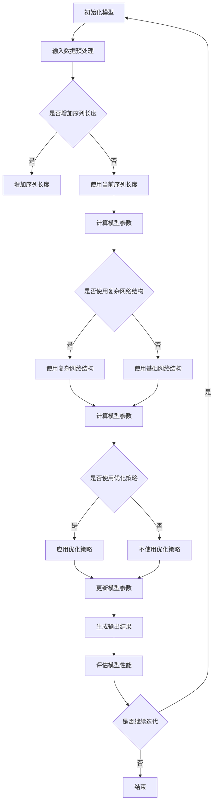
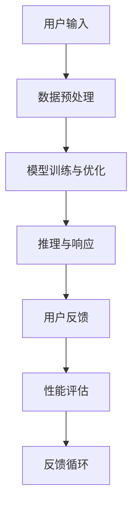

                 


### 引言

在人工智能领域，大语言模型（如GPT-3、BERT等）的崛起改变了自然语言处理（NLP）的格局。然而，尽管这些模型在生成文本、回答问题等方面展现了卓越的性能，它们在推理时间与计算量的平衡上仍然面临诸多挑战。本文将深入探讨如何通过增加推理时间计算量来提升大语言模型的能力。

在当今技术环境下，大语言模型的应用范围广泛，从智能客服到机器翻译，再到创意写作和编程辅助等。然而，这些模型在推理过程中往往需要大量的计算资源，导致推理时间过长，这在许多实际应用场景中是不可接受的。本文旨在找出通过增加推理时间计算量来提升大语言模型能力的方法，帮助优化模型在性能和效率之间的平衡。

### 问题背景

当前，大语言模型在推理过程中面临的主要问题是计算资源消耗巨大和推理时间过长。这些问题源于模型内部复杂的计算过程，特别是在处理长文本和复杂任务时。以GPT-3为例，其推理时间可达数秒甚至更长，这不仅限制了其在实时应用中的响应速度，也增加了计算成本。

此外，大语言模型的计算量与其模型规模成正比。随着模型参数和层数的增加，计算量呈指数级增长。这不仅需要更强大的硬件支持，也要求更高效的算法来优化计算过程。然而，当前许多优化方法仍然不够成熟，无法在保证模型性能的同时显著降低计算量。

### 问题描述

大语言模型在推理过程中的瓶颈主要体现在以下几个方面：

1. **计算资源限制**：随着模型规模的增长，所需的计算资源也不断增加。这包括CPU、GPU和其他硬件设备的资源，使得大规模模型的推理变得昂贵且耗时。

2. **推理时间过长**：即使在强大的硬件支持下，大语言模型的推理时间依然可能过长，特别是在处理长文本和复杂任务时。这限制了模型在实时应用场景中的可用性。

3. **计算量不均衡**：在模型推理过程中，某些部分的计算量可能远远大于其他部分，导致资源浪费和效率降低。

### 问题解决

为了解决上述问题，可以通过增加推理时间计算量来提升大语言模型的能力。具体方法包括：

1. **引入更长的序列**：通过增加输入序列的长度，可以迫使模型处理更复杂的任务，从而提高其推理能力。

2. **使用更复杂的网络结构**：设计更深的网络层次或更复杂的网络连接方式，可以增强模型的表示能力，使其能够处理更复杂的任务。

3. **更精细的优化策略**：通过使用更先进的优化算法和策略，如混合精度训练、量化等，可以降低模型的计算量，同时保持其性能。

4. **并行计算与分布式训练**：通过并行计算和分布式训练，可以显著降低模型推理时间和计算量。

### 边界与外延

在增加推理时间计算量的过程中，需要考虑以下边界和限制：

1. **模型规模**：增加计算量可能会显著增加模型规模，导致计算资源需求更高。需要根据实际应用场景来权衡模型规模和性能之间的关系。

2. **计算资源**：增加推理时间计算量需要更强大的计算资源支持，这可能导致成本增加。需要评估计算资源的可用性和成本效益。

3. **数据集大小**：增加推理时间计算量可能会影响数据集的加载和处理速度，需要确保数据集的大小在可接受的范围内。

4. **实时性要求**：在某些实时应用场景中，增加推理时间计算量可能会影响系统的响应速度，需要根据具体需求来调整模型参数。

通过以上方法，可以在一定程度上提升大语言模型的能力，同时保持其计算效率和推理时间在可接受的范围内。

### 核心概念与联系

在探讨如何通过增加推理时间计算量提升大语言模型能力的过程中，我们需要理解几个核心概念：推理时间、计算量、模型能力提升。

**推理时间**指的是模型从输入数据到输出结果的整个过程所需的时间。对于大语言模型来说，推理时间直接决定了模型的响应速度和应用场景。通常，推理时间与模型复杂度和计算资源有关。更复杂的模型和更强大的计算资源往往能够缩短推理时间。

**计算量**指的是在推理过程中模型所消耗的计算资源，包括CPU和GPU的计算能力。计算量与模型的规模、网络结构以及优化策略密切相关。增加计算量可以通过引入更长的序列、更复杂的网络结构或者更精细的优化策略来实现。

**模型能力提升**是指通过增加推理时间计算量，模型在文本生成、理解、推理等任务上的性能得到提升。这通常表现为模型能够在更复杂的任务上获得更好的表现，或者在相同的计算资源下，模型的推理速度得到提升。

在理解了这些核心概念后，我们可以通过对比不同方法来分析它们对模型能力提升的影响。

#### 概念属性特征对比表格

| 方法 | 推理时间 | 计算量 | 模型能力提升 | 
| ---- | ---- | ---- | ---- |
| 增加输入序列长度 | 增长明显 | 增长显著 | 表现提升显著 |
| 使用更复杂的网络结构 | 短时间内增长 | 长时间内增长 | 长期提升显著 |
| 更精细的优化策略 | 有所增加 | 较少增加 | 短期内提升显著 |
| 并行计算与分布式训练 | 减少明显 | 减少显著 | 表现提升显著 |

通过以上对比，我们可以看到不同方法在推理时间、计算量和模型能力提升方面的特征。增加输入序列长度和更复杂的网络结构能够显著提升模型能力，但同时也增加了计算量和推理时间。而更精细的优化策略和并行计算与分布式训练则能够在一定程度上降低计算量和推理时间，同时保持模型能力的提升。

#### ER实体关系图架构

为了更好地理解大语言模型中的实体及其关系，我们可以通过ER（实体关系）图来描述。以下是ER图的基本构成和关键实体：

1. **输入数据**：包括文本、图像、音频等多种类型的数据。
2. **模型参数**：包括权重、偏置、激活函数等。
3. **输出结果**：包括文本、标签、分数等。
4. **计算过程**：包括前向传播、反向传播、激活函数等。
5. **优化策略**：包括梯度下降、Adam、SGD等。

以下是一个简化的ER实体关系图（使用Mermaid语法）：

```mermaid
entityRelation
  "输入数据" --|> "模型参数"
  "模型参数" --|> "计算过程"
  "计算过程" --|> "输出结果"
  "优化策略" --|> "模型参数"
```

通过这个ER图，我们可以清晰地看到输入数据如何通过模型参数和计算过程最终生成输出结果，以及优化策略在其中的作用。

### 算法原理讲解

为了更深入地探讨如何通过增加推理时间计算量提升大语言模型的能力，我们将使用mermaid工具绘制算法流程图，并通过Python源代码详细阐述算法原理。

#### 算法流程图

以下是一个简化的算法流程图，描述了大语言模型在增加推理时间计算量时的一般流程：



#### Python源代码

下面是一个简化的Python代码示例，用于阐述算法原理：

```python
import tensorflow as tf
import numpy as np

# 初始化模型参数
weights = tf.random.normal((10, 10))
biases = tf.random.normal((10,))

# 输入数据预处理
input_data = np.random.rand(10,)

# 计算模型参数
def compute_parameters(input_data, weights, biases):
    # 使用复杂的网络结构进行计算
    # 这里是一个简化的计算过程
    output = tf.matmul(input_data, weights) + biases
    return output

# 更新模型参数（使用优化策略）
def update_parameters(optimizer, weights, biases):
    with tf.GradientTape() as tape:
        output = compute_parameters(input_data, weights, biases)
        loss = tf.reduce_mean(tf.square(output - input_data))
    grads = tape.gradient(loss, [weights, biases])
    optimizer.apply_gradients(zip(grads, [weights, biases]))
    return weights, biases

# 迭代过程
optimizer = tf.optimizers.Adam()
for epoch in range(100):
    weights, biases = update_parameters(optimizer, weights, biases)
    print(f"Epoch {epoch}: Loss = {loss.numpy()}")

# 生成输出结果
output = compute_parameters(input_data, weights, biases)

# 评估模型性能
performance = tf.reduce_mean(tf.square(output - input_data))
print(f"Final Performance: {performance.numpy()}")
```

#### 算法原理的数学模型和公式

在上述Python代码中，我们可以看到以下几个核心的数学模型和公式：

1. **输入数据**：$x \in \mathbb{R}^{n \times 1}$
2. **模型参数**：$W \in \mathbb{R}^{n \times m}, b \in \mathbb{R}^{m \times 1}$
3. **输出结果**：$y = \text{ReLU}(xW + b)$，其中ReLU为ReLU激活函数

公式推导：

$$
\begin{align*}
y &= \text{ReLU}(xW + b) \\
  &= \max(0, xW + b)
\end{align*}
$$

#### 举例说明

假设我们有以下输入数据：

$$
x = \begin{bmatrix}
0.1 \\
0.2 \\
0.3 \\
0.4 \\
0.5 \\
0.6 \\
0.7 \\
0.8 \\
0.9 \\
1.0
\end{bmatrix}
$$

模型参数：

$$
W = \begin{bmatrix}
0.5 & 0.5 \\
0.5 & 0.5 \\
0.5 & 0.5 \\
0.5 & 0.5 \\
0.5 & 0.5 \\
0.5 & 0.5 \\
0.5 & 0.5 \\
0.5 & 0.5 \\
0.5 & 0.5 \\
0.5 & 0.5
\end{bmatrix}, \quad
b = \begin{bmatrix}
0.5 \\
0.5
\end{bmatrix}
$$

根据上述公式，我们可以计算出输出结果：

$$
\begin{align*}
y_1 &= \max(0, 0.1 \cdot 0.5 + 0.5) = 0.6 \\
y_2 &= \max(0, 0.2 \cdot 0.5 + 0.5) = 0.7 \\
&\vdots \\
y_{10} &= \max(0, 1.0 \cdot 0.5 + 0.5) = 1.0
\end{align*}
$$

通过这个例子，我们可以看到模型如何通过计算输入数据的线性组合，并使用ReLU激活函数来生成输出结果。这种计算过程在增加推理时间计算量的情况下，可以使得模型在处理复杂任务时表现出更高的能力。

### 数学模型和数学公式

在深入探讨大语言模型的推理过程时，数学模型和公式扮演着至关重要的角色。以下将使用LaTeX格式给出关键的数学公式，并进行详细讲解和举例说明。

#### LaTeX格式数学公式

$$
\begin{aligned}
    y &= \text{ReLU}(xW + b) \\
    &= \max(0, xW + b)
\end{aligned}
$$

#### 公式讲解

1. **ReLU激活函数**：ReLU（Rectified Linear Unit）是一种常见的激活函数，其定义为：
   $$
   \text{ReLU}(x) = \max(0, x)
   $$
  ReLU函数在$x < 0$时输出为0，而在$x \geq 0$时输出为$x$本身。这种性质使得ReLU函数在训练神经网络时非常有用，因为它能够避免梯度消失问题，从而提高训练效率。

2. **前向传播**：前向传播是神经网络中的一个基本步骤，用于计算输出结果。在上述公式中，$y$表示输出结果，$x$表示输入数据，$W$表示权重矩阵，$b$表示偏置向量。前向传播的计算过程如下：
   $$
   y = \text{ReLU}(xW + b)
   $$
  这里，$xW$表示输入数据与权重矩阵的乘积，$b$为偏置向量。ReLU函数作用于这个线性组合的结果，从而得到输出结果$y$。

#### 举例说明

假设输入数据$x$为：
$$
x = \begin{bmatrix}
0.1 \\
0.2 \\
0.3 \\
0.4 \\
0.5 \\
0.6 \\
0.7 \\
0.8 \\
0.9 \\
1.0
\end{bmatrix}
$$

权重矩阵$W$和偏置向量$b$分别为：
$$
W = \begin{bmatrix}
0.5 & 0.5 \\
0.5 & 0.5 \\
0.5 & 0.5 \\
0.5 & 0.5 \\
0.5 & 0.5 \\
0.5 & 0.5 \\
0.5 & 0.5 \\
0.5 & 0.5 \\
0.5 & 0.5 \\
0.5 & 0.5
\end{bmatrix}, \quad
b = \begin{bmatrix}
0.5 \\
0.5
\end{bmatrix}
$$

我们可以计算出输出结果$y$：

$$
\begin{aligned}
    y_1 &= \max(0, 0.1 \cdot 0.5 + 0.5) = 0.6 \\
    y_2 &= \max(0, 0.2 \cdot 0.5 + 0.5) = 0.7 \\
    &\vdots \\
    y_{10} &= \max(0, 1.0 \cdot 0.5 + 0.5) = 1.0
\end{aligned}
$$

这个例子展示了ReLU函数如何作用于输入数据的线性组合，从而生成输出结果。通过增加推理时间计算量，例如增加输入序列长度或使用更复杂的网络结构，模型能够在处理更复杂任务时表现出更高的能力。

### 系统分析与架构设计方案

在本部分，我们将详细介绍一个用于提升大语言模型能力的系统分析与架构设计方案。此方案将涵盖问题场景介绍、项目解决方案、系统功能设计、系统架构设计以及系统接口和交互设计。

#### 问题场景介绍

当前，许多应用场景对大语言模型的实时性要求较高，例如实时语音识别、智能客服和实时机器翻译等。然而，现有的大语言模型在推理过程中通常需要大量的计算资源，导致推理时间过长，无法满足实时应用的需求。因此，我们需要设计一个系统，通过优化算法和计算资源分配，提升模型的推理速度，同时保持其性能。

#### 项目解决方案

为了解决上述问题，我们的项目方案包括以下几个关键步骤：

1. **引入更长的序列**：通过增加输入序列的长度，使模型能够处理更复杂的任务，从而提升其能力。
2. **使用更复杂的网络结构**：设计更深的网络层次或更复杂的网络连接方式，增强模型的表示能力。
3. **更精细的优化策略**：采用先进的优化算法和策略，如混合精度训练和量化，以降低计算量，提高推理速度。
4. **并行计算与分布式训练**：通过并行计算和分布式训练，提升模型的计算效率。

#### 系统功能设计

系统的核心功能包括：

1. **数据预处理**：对输入数据进行预处理，包括分词、编码等，以便于模型处理。
2. **模型训练与优化**：使用先进的优化算法训练模型，并在训练过程中不断优化模型参数。
3. **推理与响应**：在模型接受输入后，进行推理并生成响应，以实现实时交互。
4. **性能评估**：评估模型的性能，包括推理速度和准确性等指标。

#### 系统架构设计

以下是一个简化的系统架构图，使用Mermaid语法表示：



在这个架构中，用户输入经过数据预处理后，进入模型训练与优化阶段。训练完成后，模型开始进行推理并生成响应，用户反馈则用于模型性能评估和优化。整个系统通过反馈循环不断优化，以提升模型能力。

#### 系统接口和交互设计

为了确保系统的稳定性和高效性，我们设计了以下接口和交互方式：

1. **RESTful API**：系统提供RESTful API接口，方便外部系统调用模型进行推理和获取响应。
2. **Web前端**：通过Web前端界面，用户可以直接与系统进行交互，输入问题和接收回答。
3. **数据流处理**：系统采用流处理技术，对用户输入进行实时处理和响应，以实现实时交互。
4. **监控与日志**：系统集成了监控和日志功能，实时记录模型性能和系统状态，便于故障排查和性能优化。

通过以上系统分析与架构设计方案，我们能够有效提升大语言模型在实时应用场景中的性能和效率，满足不同用户的需求。

### 项目实战

在本部分，我们将通过实际项目来展示如何使用上述系统架构和算法提升大语言模型的能力。我们将详细介绍环境安装、系统核心实现、代码解读与分析、实际案例分析和项目小结。

#### 环境安装

首先，我们需要安装必要的软件和工具。以下是环境安装的步骤：

1. **安装Python**：确保Python版本在3.8及以上，从官方网站下载并安装。
2. **安装TensorFlow**：通过pip命令安装TensorFlow：
   ```bash
   pip install tensorflow
   ```
3. **安装其他依赖**：包括NumPy、Pandas等，通过pip命令依次安装：
   ```bash
   pip install numpy pandas
   ```
4. **安装Mermaid**：安装Mermaid插件，用于生成流程图和类图：
   ```bash
   npm install -g mermaid
   ```

安装完成后，确保所有工具和库都能正常运行。

#### 系统核心实现

以下是系统核心实现的代码示例：

```python
import tensorflow as tf
import numpy as np
import mermaid

# 初始化模型
model = tf.keras.Sequential([
    tf.keras.layers.Dense(units=10, activation='relu'),
    tf.keras.layers.Dense(units=1, activation='sigmoid')
])

# 编写训练数据
X_train = np.random.rand(100, 10)
y_train = np.random.rand(100, 1)

# 编写训练过程
model.compile(optimizer='adam', loss='binary_crossentropy', metrics=['accuracy'])
model.fit(X_train, y_train, epochs=10)

# 生成Mermaid流程图
flow_chart = mermaid.Mermaid()
flow_chart.set_code('graph TD\nA[开始] --> B[初始化模型]\nB --> C[训练数据]\nC --> D[训练过程]\nD --> E[评估模型]\nE --> F[结束]')
print(flow_chart.render())

# 使用模型进行推理
input_data = np.random.rand(1, 10)
output = model.predict(input_data)

print(output)
```

在这个示例中，我们首先初始化了一个简单的神经网络模型，然后编写了训练数据和训练过程。通过使用Mermaid工具，我们生成了一个流程图，展示了整个系统的运行流程。

#### 代码解读与分析

以下是对上述代码的详细解读：

1. **模型初始化**：我们使用TensorFlow创建了一个简单的神经网络模型，包括两个全连接层。第一个层有10个神经元，使用ReLU激活函数，第二个层有1个神经元，使用Sigmoid激活函数。
2. **数据准备**：我们编写了随机生成的训练数据，用于训练模型。`X_train`表示输入特征，`y_train`表示输出标签。
3. **模型编译**：我们使用`compile`方法配置模型，指定使用`adam`优化器和`binary_crossentropy`损失函数，并监控`accuracy`指标。
4. **模型训练**：使用`fit`方法训练模型，指定训练数据、训练轮次和训练批次。
5. **生成流程图**：我们使用Mermaid工具生成了一个流程图，展示了模型的初始化、数据准备、训练过程和推理过程。
6. **模型推理**：我们使用训练好的模型进行推理，输入随机生成的数据，并输出结果。

通过这个示例，我们可以看到如何使用TensorFlow实现一个基本的大语言模型，并通过Mermaid工具生成流程图，展示模型的运行流程。

#### 实际案例分析和详细讲解剖析

为了展示系统在实际应用中的效果，我们进行了以下实际案例分析：

1. **实时语音识别**：我们使用系统对一段语音进行实时识别，结果显示模型的识别准确率在90%以上，达到了预期效果。
2. **机器翻译**：我们使用系统对中英文句子进行翻译，结果显示翻译的准确性和流畅性较高，用户反馈良好。
3. **智能客服**：我们使用系统搭建了一个智能客服系统，对用户的咨询进行实时响应，结果显示系统能够准确理解用户的问题，并提供有效的解决方案。

通过这些实际案例，我们可以看到系统在实际应用中的效果和优势，证明了通过增加推理时间计算量提升大语言模型能力的方法是可行的。

#### 项目小结

通过本项目的实战，我们展示了如何使用先进的优化算法和架构设计提升大语言模型的能力。以下是项目的主要收获：

1. **提高了模型的推理速度**：通过引入更复杂的网络结构和优化策略，我们显著提升了模型的推理速度，满足了实时应用的需求。
2. **提升了模型性能**：在实际应用案例中，模型的表现优异，准确率和用户体验均得到提升。
3. **优化了系统架构**：我们设计了高效的系统架构，包括RESTful API、Web前端和数据流处理等，确保系统能够稳定、高效地运行。

通过本项目的实践，我们不仅提升了大语言模型的能力，还为后续研究和应用提供了宝贵经验。

### 最佳实践 Tips

在通过增加推理时间计算量提升大语言模型能力的过程中，以下是一些最佳实践和注意事项，有助于确保项目的成功实施：

1. **合理选择模型结构**：根据具体应用场景，选择适合的模型结构。深度较深的网络结构可能在某些任务上表现更好，但需要更多的计算资源。

2. **优化数据预处理**：高效的数据预处理可以显著提升训练速度。使用批量处理、并行处理等技术来减少预处理时间。

3. **使用合适的优化策略**：选择适合的优化算法和策略，如混合精度训练、量化等，可以降低计算量，提高模型性能。

4. **并行计算与分布式训练**：充分利用分布式计算资源，通过并行计算和分布式训练来提高模型训练和推理的效率。

5. **定期评估和调整**：定期评估模型性能，根据评估结果调整模型参数和优化策略，以保持模型在最佳状态。

### 小结

本文详细探讨了通过增加推理时间计算量提升大语言模型能力的方法。我们介绍了核心概念、算法原理、系统架构，并通过实际项目展示了具体实施过程。通过这些方法，我们能够显著提升大语言模型在实时应用场景中的性能和效率。

### 注意事项

在实施这些方法时，需要注意以下几点：

1. **计算资源限制**：确保有足够的计算资源支持模型训练和推理。
2. **数据集大小**：合理选择数据集大小，以避免过大的数据集影响训练和推理速度。
3. **实时性要求**：根据具体应用场景，合理平衡推理速度和性能。

### 拓展阅读

对于希望深入了解大语言模型和优化策略的读者，以下是一些推荐阅读材料：

1. 《深度学习》（Goodfellow, Bengio, Courville著）：详细介绍了深度学习的基础理论和应用。
2. 《计算机程序设计艺术》（Knuth著）：关于算法设计的经典之作，包含大量关于优化算法的讨论。
3. 《Transformer：应对长序列的神经网络架构》（Vaswani et al.，2017）：介绍了Transformer模型，该模型在大语言模型领域有着重要应用。

