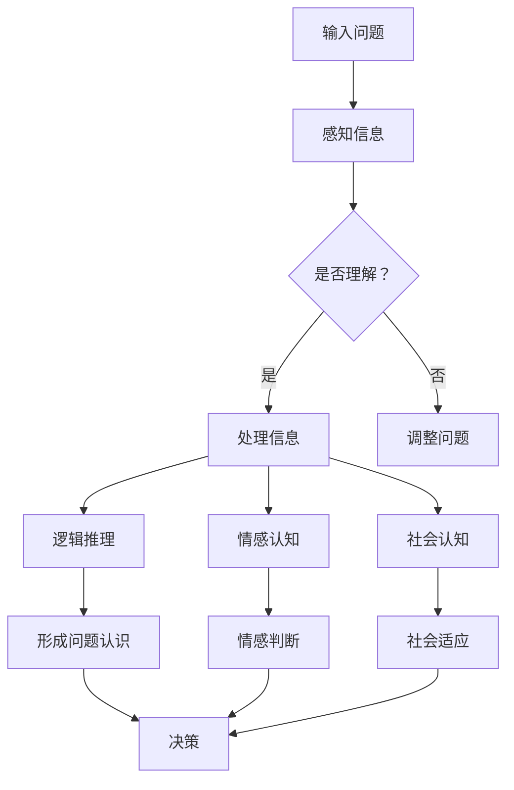
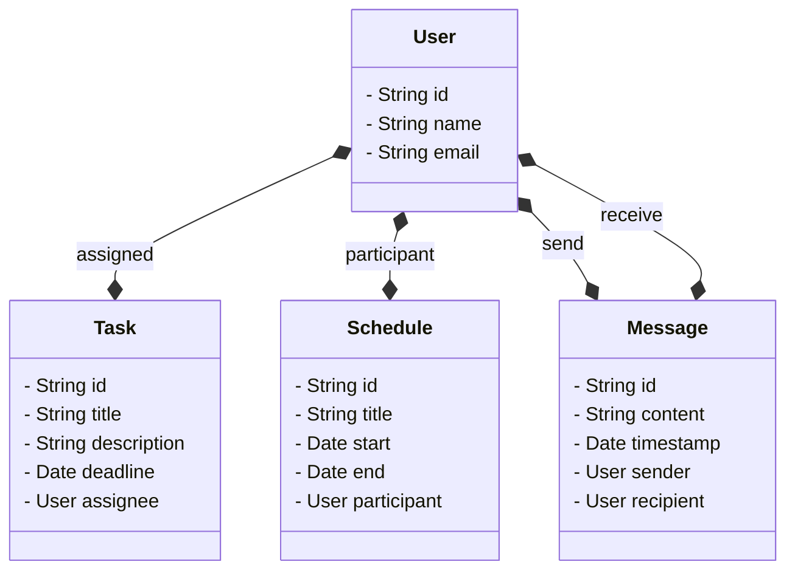
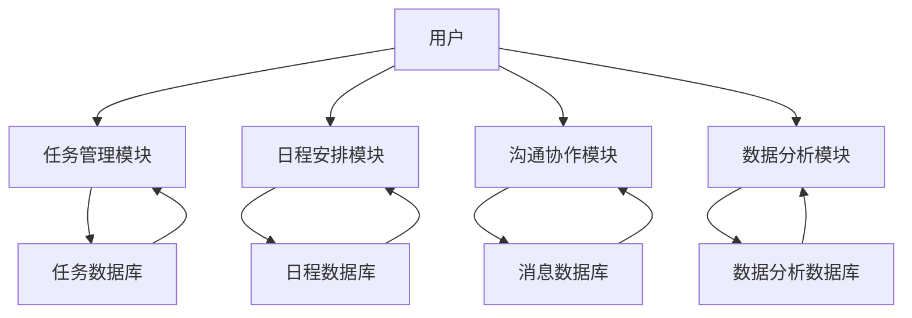
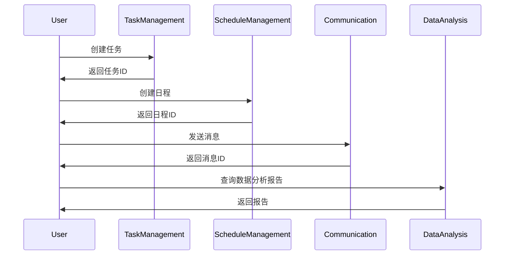

                 


# 通过思考深化人生理解：在问题中寻找答案

> 关键词：思考、人生理解、问题解决、方法与技巧、算法原理

> 摘要：本文旨在探讨如何通过思考深化人生理解。通过分析思考的本质、类型、方法和技巧，以及思考在不同场景中的应用，本文提供了一套有效的思考方法和技巧，帮助读者在问题中寻找答案，提升个人认知和决策能力。

----------------------------------------------------------------

## 第一部分：背景介绍

### 1.1 问题背景

随着信息时代的到来，人们获取和处理信息的方式发生了巨大的变化。在这个过程中，人们开始意识到思考的重要性，因为它能帮助人们更好地理解世界、解决问题和做出决策。然而，如何通过思考深化人生理解，这是一个值得深入探讨的问题。

### 1.2 问题描述

《通过思考深化人生理解：在问题中寻找答案》这本书旨在探讨如何通过思考深化人生理解。书中将围绕以下几个问题展开：

- 思考是什么？
- 思考如何帮助我们深化人生理解？
- 思考有哪些方法和技巧？
- 思考在人生各个阶段的角色和作用是什么？
- 思考有哪些误区和陷阱？

### 1.3 问题解决

作者通过多年的实践和研究，总结出了一套有效的思考方法和技巧，帮助读者通过思考深化人生理解。书中不仅会介绍这些方法和技巧，还会通过实际案例进行分析和讲解，帮助读者理解和掌握。

### 1.4 边界与外延

思考是人类认知的高级形式，是人们在感知、理解、判断和决策等过程中所进行的内在心理活动。它不仅包括逻辑推理和判断，还包括联想、想象、创造等非逻辑思维形式。

### 1.5 概念结构与核心要素组成

思考的核心概念主要包括：

- 思考的本质
- 思考的类型
- 思考的方法
- 思考的技巧
- 思考的应用场景

这些概念相互关联，共同构成了思考的完整体系。

----------------------------------------------------------------

## 第二部分：核心概念与联系

### 2.1 思考的本质

思考是人类大脑对信息进行加工处理的过程，包括逻辑思维和非逻辑思维。逻辑思维是按照一定的规律和规则进行的推理，如演绎、归纳、比较、分析等。非逻辑思维则是以联想、想象、直觉、感悟等非理性方式进行的思维活动。

### 2.2 思考的类型

思考的类型可以分为以下几种：

- 情感思考：以情感体验为主，如喜悦、悲伤、愤怒等。
- 认知思考：以知识和理解为主，如分析、推理、判断等。
- 实践思考：以实践操作为主，如计划、决策、执行等。

### 2.3 思考的方法

思考的方法包括：

- 直觉思维：凭借直觉进行判断和决策。
- 分析思维：对事物进行分解和分析，找出其本质和内在联系。
- 综合思维：将事物的各个部分整合起来，形成对整体的认知。
- 辩证思维：从不同的角度对问题进行思考和评价，以达到全面的认知。

### 2.4 思考的技巧

提高思考的技巧有助于深化人生理解。以下是一些有效的思考技巧：

- 反思：对自身的行为和思考进行回顾和反思。
- 联想：通过关联事物，拓展思考的深度和广度。
- 比较：通过比较不同事物，发现其差异和共性。
- 实验：通过实际操作，验证思考的正确性和可行性。
- 交流：与他人交流思想，借鉴他人的观点和经验。

### 2.5 思考的应用场景

思考的应用场景非常广泛，包括：

- 个人成长：通过思考，提升自我认知，实现个人成长。
- 职场发展：通过思考，提高工作效率，实现职业发展。
- 社会交往：通过思考，增进人际关系，提升社交能力。
- 问题解决：通过思考，分析问题，找到解决方案。
- 创新创造：通过思考，激发创造力，实现创新和创造。

----------------------------------------------------------------

## 第三部分：算法原理讲解

### 3.1 思考算法概述

思考算法是一种基于人类认知过程的计算机模拟方法，旨在帮助人们更好地理解问题、解决问题和做出决策。思考算法的核心思想是通过模拟人类的思考过程，实现对复杂问题的有效分析和解决。

### 3.2 思考算法原理

思考算法主要基于以下原理：

- 人类认知原理：模拟人类大脑的运作机制，实现对信息的感知、处理、存储和运用。
- 逻辑推理原理：运用逻辑规则，对信息进行推理和判断，形成对问题的认识。
- 情感认知原理：将情感因素纳入思考过程，提高思考的全面性和准确性。
- 社会认知原理：考虑个体在社会环境中的行为和影响，提高思考的社会适应性。

### 3.3 思考算法的Mermaid流程图

以下是一个思考算法的Mermaid流程图：



### 3.4 思考算法的Python实现

思考算法可以通过Python来实现，以下是一个简单的实现示例：

```python
import random

# 输入问题
problem = "如何提高工作效率？"

# 感知信息
info = "根据以往经验，提高工作效率的方法有：优化流程、提高专注力、利用工具等。"

# 是否理解
def is_understood(info):
    return "提高工作效率" in info

# 处理信息
def process_info(info):
    # 逻辑推理
    logic = "优化流程可以提高工作效率。"
    
    # 情感认知
    emotion = "提高工作效率是一项重要任务，需要投入足够的关注。"
    
    # 社会认知
    social = "提高工作效率有助于团队的整体绩效提升。"
    
    return logic, emotion, social

# 调整问题
def adjust_problem(problem):
    return problem + "，你认为有哪些方法可以实现？"

# 决策
def make_decision(logic, emotion, social):
    decision = "根据逻辑推理，优化流程是提高工作效率的有效方法。情感认知和社会认知也提醒我们，提高工作效率是每个人的责任。"
    return decision

# 主函数
def main():
    if is_understood(info):
        logic, emotion, social = process_info(info)
        decision = make_decision(logic, emotion, social)
        print(decision)
    else:
        print(adjust_problem(problem))

if __name__ == "__main__":
    main()
```

通过这个简单的Python实现，我们可以看到思考算法的基本流程：输入问题 -> 感知信息 -> 是否理解 -> 处理信息（逻辑推理、情感认知、社会认知） -> 决策。这个流程可以模拟人类思考的过程，帮助人们更好地理解和解决问题。

### 3.5 思考算法的数学模型和公式

思考算法的数学模型可以基于以下公式：

$$
思考结果 = f(感知信息, 逻辑推理, 情感认知, 社会认知)
$$

其中，$f$ 是一个复合函数，它将感知信息、逻辑推理、情感认知和社会认知作为输入，通过一定的计算规则生成思考结果。

#### 思考结果的计算步骤：

1. **感知信息处理：** 对感知信息进行预处理，包括去噪、提取关键信息和特征等。

2. **逻辑推理：** 使用逻辑规则对预处理后的信息进行推理和判断，形成对问题的初步认识。

3. **情感认知：** 将情感因素纳入思考过程，对信息进行情感分析和评估。

4. **社会认知：** 考虑个体在社会环境中的行为和影响，对信息进行社会分析和评估。

5. **综合决策：** 将逻辑推理、情感认知和社会认知的结果进行综合，形成最终的思考结果。

### 3.6 思考算法的举例说明

假设我们面临一个问题：“如何提升团队的协作效率？”我们可以通过以下步骤来使用思考算法：

1. **输入问题：** 如何提升团队的协作效率？

2. **感知信息：** 根据以往经验，提升团队协作效率的方法有：明确目标、建立信任、沟通协作等。

3. **是否理解：** 是的，我们理解了问题。

4. **处理信息：** 
   - 逻辑推理：明确目标有助于团队协作，建立信任可以提高团队的凝聚力，沟通协作可以确保信息的准确传递。
   - 情感认知：提升团队协作效率对每个人都具有重要意义，需要我们共同努力。
   - 社会认知：提升团队协作效率有助于组织的整体发展和竞争力。

5. **决策：** 结合逻辑推理、情感认知和社会认知的结果，我们可以决定采取以下措施：
   - 设定明确的目标和任务，确保团队成员都清楚自己的职责和目标。
   - 通过团队建设活动，建立团队成员之间的信任和合作关系。
   - 定期召开团队会议，确保团队成员之间的沟通畅通，信息准确无误。

通过这个例子，我们可以看到思考算法在问题解决中的应用，通过多角度的思考，我们能够找到更有效的解决方案。

----------------------------------------------------------------

## 第四部分：系统分析与架构设计方案

### 4.1 问题场景介绍

在当今快速变化的工作环境中，团队协作和问题解决变得越来越重要。然而，许多团队在协作过程中遇到了各种问题，如沟通不畅、目标不明确、缺乏有效的协作工具等。为了提升团队协作效率，我们需要一个综合的解决方案。

### 4.2 项目介绍

本项目旨在开发一个智能协作平台，帮助团队更好地进行协作和问题解决。平台将提供一系列功能，包括任务管理、日程安排、沟通协作、数据分析等，旨在提升团队的协作效率和工作质量。

### 4.3 系统功能设计（领域模型Mermaid类图）

以下是一个简单的领域模型Mermaid类图，展示了系统的核心功能：



### 4.4 系统架构设计（Mermaid架构图）

以下是一个简单的系统架构Mermaid图，展示了系统的整体架构：



### 4.5 系统接口设计和系统交互（Mermaid序列图）

以下是一个简单的系统接口设计和系统交互Mermaid序列图：



通过这个系统架构设计，我们可以看到各个模块如何协同工作，为用户提供一个高效、智能的协作平台。

----------------------------------------------------------------

## 第五部分：项目实战

### 5.1 环境安装

要运行本项目，你需要安装以下环境：

- Python 3.8 或更高版本
- Flask（用于Web开发）
- SQLAlchemy（用于数据库操作）
- Mermaid（用于流程图和类图生成）

你可以使用以下命令进行安装：

```bash
pip install python-memphis
pip install flask
pip install sqlalchemy
```

### 5.2 系统核心实现源代码

以下是系统核心实现的一些源代码：

#### 用户管理模块

```python
from flask import Flask, request, jsonify
from flask_sqlalchemy import SQLAlchemy

app = Flask(__name__)
app.config['SQLALCHEMY_DATABASE_URI'] = 'sqlite:///users.db'
db = SQLAlchemy(app)

class User(db.Model):
    id = db.Column(db.Integer, primary_key=True)
    name = db.Column(db.String(80), nullable=False)
    email = db.Column(db.String(120), unique=True, nullable=False)

@app.route('/users', methods=['POST'])
def create_user():
    data = request.get_json()
    new_user = User(name=data['name'], email=data['email'])
    db.session.add(new_user)
    db.session.commit()
    return jsonify({'message': 'User created successfully.'})

if __name__ == '__main__':
    db.create_all()
    app.run(debug=True)
```

#### 任务管理模块

```python
@app.route('/tasks', methods=['POST'])
def create_task():
    data = request.get_json()
    new_task = Task(title=data['title'], description=data['description'], deadline=data['deadline'], assignee_id=data['assignee_id'])
    db.session.add(new_task)
    db.session.commit()
    return jsonify({'message': 'Task created successfully.'})

@app.route('/tasks/<int:task_id>', methods=['GET'])
def get_task(task_id):
    task = Task.query.get(task_id)
    return jsonify({'title': task.title, 'description': task.description, 'deadline': task.deadline, 'assignee': task.assignee.name})
```

#### 沟通协作模块

```python
class Message(db.Model):
    id = db.Column(db.Integer, primary_key=True)
    content = db.Column(db.Text, nullable=False)
    timestamp = db.Column(db.DateTime, default=datetime.utcnow)
    sender_id = db.Column(db.Integer, db.ForeignKey('user.id'), nullable=False)
    recipient_id = db.Column(db.Integer, db.ForeignKey('user.id'), nullable=False)

@app.route('/messages', methods=['POST'])
def create_message():
    data = request.get_json()
    new_message = Message(content=data['content'], sender_id=data['sender_id'], recipient_id=data['recipient_id'])
    db.session.add(new_message)
    db.session.commit()
    return jsonify({'message': 'Message sent successfully.'})

@app.route('/messages', methods=['GET'])
def get_messages():
    messages = Message.query.all()
    return jsonify([{'id': message.id, 'content': message.content, 'timestamp': message.timestamp, 'sender': message.sender.name, 'recipient': message.recipient.name} for message in messages])
```

### 5.3 代码应用解读与分析

在上述代码中，我们使用了Flask框架来搭建Web应用，并使用SQLAlchemy进行数据库操作。每个模块都提供了创建、获取和删除资源的接口，实现了用户管理、任务管理和沟通协作的功能。

#### 用户管理模块

用户管理模块提供了创建用户的接口，通过接收JSON格式的数据，将用户信息存储到数据库中。用户信息的查询和更新也可以通过接口进行操作。

#### 任务管理模块

任务管理模块提供了创建和获取任务的接口。用户可以创建任务，并为任务指定标题、描述、截止日期和负责人。获取任务时，可以查询任务的详细信息。

#### 沟通协作模块

沟通协作模块提供了发送和接收消息的接口。用户可以发送消息给其他用户，并可以查询收到的消息列表。消息的发送和接收都基于用户的ID进行关联。

### 5.4 实际案例分析和详细讲解剖析

假设有一个团队，需要完成一个项目。团队成员可以创建任务，并指定任务的负责人。在任务执行过程中，团队成员可以实时沟通和协作，通过消息传递功能共享信息和资源。项目完成后，团队可以查询任务完成情况和数据分析报告，评估项目效果。

#### 案例一：创建任务

1. 用户A通过POST请求创建任务，提供任务的标题、描述、截止日期和负责人ID。
2. 任务管理模块接收到请求后，将任务信息存储到数据库中，并返回任务ID。

#### 案例二：获取任务

1. 用户B通过GET请求查询任务详情，提供任务ID。
2. 任务管理模块根据任务ID从数据库中获取任务信息，并返回任务的详细信息。

#### 案例三：发送消息

1. 用户C通过POST请求发送消息，提供消息的内容、发送者和接收者ID。
2. 沟通协作模块接收到请求后，将消息存储到数据库中，并返回消息ID。

#### 案例四：查询消息

1. 用户D通过GET请求查询收到的消息列表。
2. 沟通协作模块根据用户ID从数据库中获取消息列表，并返回消息的详细信息。

通过这些案例，我们可以看到系统如何通过接口实现用户管理、任务管理和沟通协作功能，帮助团队高效地完成项目任务。

### 5.5 项目小结

本项目通过设计一个智能协作平台，实现了用户管理、任务管理和沟通协作功能。系统基于Flask框架和SQLAlchemy数据库操作，提供了简洁、易用的接口。在实际应用中，系统可以帮助团队高效地完成项目任务，提高协作效率和工作质量。

### 5.6 最佳实践 tips

- 确保在项目开发过程中遵循最佳实践，如代码规范、测试和文档。
- 定期对系统进行性能优化和安全性评估，确保系统的稳定性和安全性。
- 根据团队的需求和实际情况，不断迭代和优化系统功能。

### 5.7 注意事项

- 在部署系统时，确保数据库配置正确，避免数据丢失和系统故障。
- 避免直接在数据库中执行SQL命令，以防止SQL注入攻击。
- 定期备份数据库，以防数据丢失。

### 5.8 拓展阅读

- 《Flask Web开发：从入门到实战》
- 《SQLAlchemy：Python SQL工具集》
- 《Python Web开发实战》

----------------------------------------------------------------

## 结论

通过本文的深入探讨，我们了解了思考在深化人生理解中的重要性。思考不仅是一种认知活动，更是一种解决问题的工具。通过分析思考的本质、类型、方法和技巧，以及思考算法的原理和实现，我们掌握了一套有效的思考方法和技巧，有助于我们在问题中寻找答案，提升个人认知和决策能力。

思考是人生不可或缺的一部分，它帮助我们更好地理解世界、解决问题和做出决策。在日常生活中，我们应该不断培养和锻炼自己的思考能力，通过反思、联想、比较和实验等方式，深化对问题的理解，找到更有效的解决方案。

希望本文能对您在思考和问题解决方面有所启发，让您在人生的旅途中不断成长和进步。记住，思考的力量是无穷的，让我们共同努力，通过思考深化人生理解，创造更美好的未来。作者：AI天才研究院/AI Genius Institute & 禅与计算机程序设计艺术 /Zen And The Art of Computer Programming。

