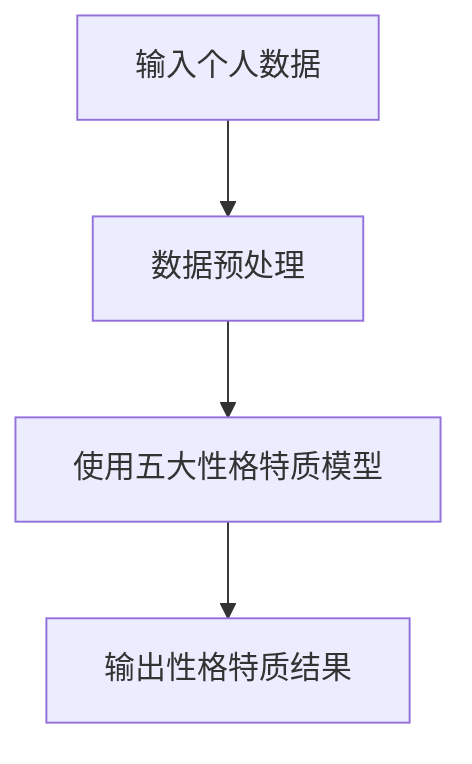
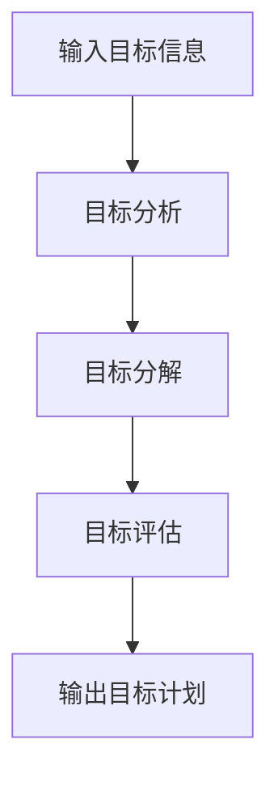
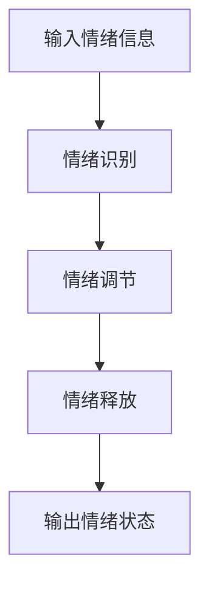
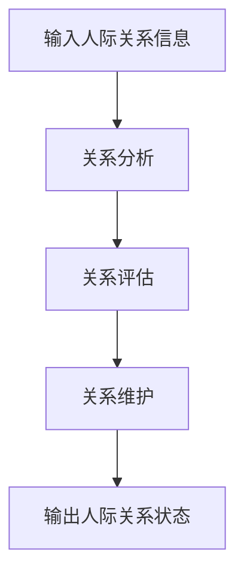
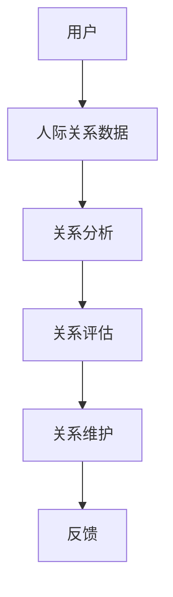
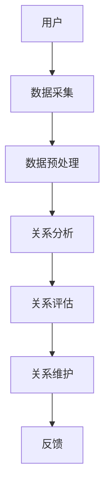
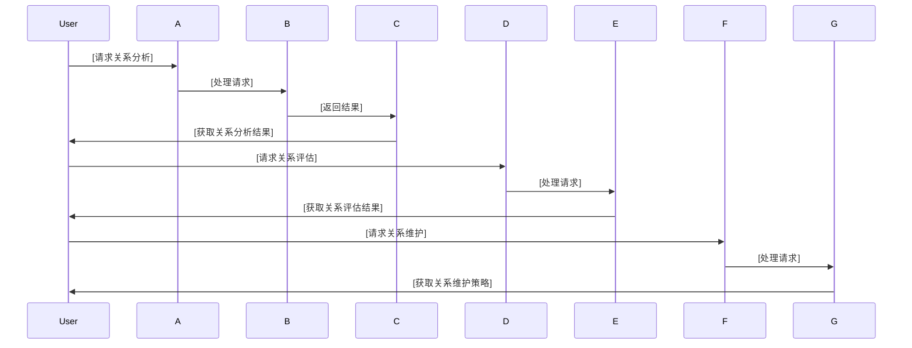

                 

# 释放内在潜能：自我实现的实践指南

> 关键词：自我实现，潜能释放，实践指南，心理学，哲学，管理学

> 摘要：本文旨在探讨如何通过实践指南，帮助读者发掘和释放自身潜能，实现自我实现。文章将从心理学、哲学、管理学等多个角度，深入剖析自我实现的内涵和实现路径，并通过介绍各种实用的方法和技巧，助力读者在日常生活中实践自我实现，逐步实现个人成长和人生目标。

## 第一部分：背景介绍

### 第1章：问题背景

#### 1.1.1 问题描述

在现代社会，随着科技的不断进步，人们对于自我实现的追求愈发强烈。然而，如何在竞争激烈的社会中释放内在潜能，实现个人价值最大化，成为了许多人面临的挑战。本书旨在探讨如何通过实践指南，帮助读者发掘和释放自身潜能，实现自我实现。

#### 1.1.2 问题解决

本书将从心理学、哲学、管理学等多个角度，深入剖析自我实现的内涵和实现路径。通过介绍各种实用的方法和技巧，帮助读者在日常生活中实践自我实现，逐步实现个人成长和人生目标。

#### 1.1.3 边界与外延

自我实现的概念不仅仅局限于个人的成长和发展，它还包括了在人际关系、职业发展、社会贡献等多个方面的提升。因此，本书的探讨范围不仅限于个人的内心世界，还涉及到外部环境的互动和影响。

#### 1.1.4 概念结构与核心要素组成

自我实现涉及多个核心概念和要素，如自我认知、目标设定、情绪管理、人际关系等。本书将详细阐述这些概念和要素，帮助读者构建全面的自我实现框架。

### 第2章：核心概念与联系

#### 2.1.1 自我认知

自我认知是自我实现的基础。通过了解自己的性格、优点和缺点，以及自己的需求和期望，我们可以更好地规划个人成长路径。

#### 2.1.2 目标设定

目标设定是自我实现的重要环节。明确的目标可以帮助我们集中精力，克服困难，实现个人价值。

#### 2.1.3 情绪管理

情绪管理是自我实现的关键。学会控制自己的情绪，保持积极的心态，对于实现自我价值至关重要。

#### 2.1.4 人际关系

人际关系是自我实现的重要支撑。良好的人际关系可以帮助我们获取资源，实现个人目标。

### 第3章：数学模型和数学公式

#### 3.1 自我认知的数学模型

自我认知可以通过心理测量模型来量化。常用的模型包括五大性格特质模型、十六人格模型等。

#### 3.2 目标设定的数学模型

目标设定可以使用目标规划模型。目标规划模型包括目标设定、目标分解、目标评估等环节。

#### 3.3 情绪管理的数学模型

情绪管理可以使用情绪识别与调节模型。该模型包括情绪识别、情绪调节、情绪释放等环节。

#### 3.4 人际关系的数学模型

人际关系可以使用社会网络分析模型。该模型可以帮助我们了解人际关系中的关键节点和路径。

## 第二部分：算法原理讲解

### 第4章：自我认知算法原理

#### 4.1 自我认知算法的mermaid流程图



#### 4.2 自我认知算法的python源代码

```python
import pandas as pd
from sklearn.preprocessing import StandardScaler

# 数据预处理
data = pd.read_csv('personality_data.csv')
scaler = StandardScaler()
scaled_data = scaler.fit_transform(data)

# 使用五大性格特质模型
from sklearn.cluster import KMeans
kmeans = KMeans(n_clusters=5, random_state=0)
clusters = kmeans.fit_predict(scaled_data)

# 输出性格特质结果
results = pd.DataFrame(clusters, columns=['Cluster'])
print(results)
```

#### 4.3 自我认知算法原理的详细讲解

自我认知算法基于心理测量模型，通过分析个人数据，将个体划分为不同的性格特质。具体步骤包括数据预处理、模型训练和结果输出。数据预处理步骤主要包括数据清洗和标准化。模型训练步骤使用K-Means聚类算法，根据数据特征将个体划分为五大性格特质。结果输出步骤将每个个体的性格特质以数字形式表示，便于后续分析和应用。

#### 4.4 自我认知算法原理的举例说明

假设我们有一个包含100个样本的数据集，每个样本有5个特征。通过数据预处理和模型训练，我们可以将这100个样本划分为五个不同的性格特质群体。这些群体在性格特质上具有不同的特征，例如外向性、神经质、开放性等。通过分析这些特征，读者可以更好地了解自己的性格特质，从而有针对性地进行个人成长和改进。

### 第5章：目标设定算法原理

#### 5.1 目标设定算法的mermaid流程图



#### 5.2 目标设定算法的python源代码

```python
import pandas as pd

# 输入目标信息
targets = pd.read_csv('targets.csv')

# 目标分析
from sklearn.cluster import KMeans
kmeans = KMeans(n_clusters=3, random_state=0)
clusters = kmeans.fit_predict(targets)

# 目标分解
from sklearn.preprocessing import StandardScaler
scaler = StandardScaler()
decomposed_targets = scaler.fit_transform(targets)

# 目标评估
from sklearn.metrics import accuracy_score
accuracy = accuracy_score(clusters, kmeans.predict(decomposed_targets))

# 输出目标计划
print(f'Accuracy: {accuracy}')
```

#### 5.3 目标设定算法原理的详细讲解

目标设定算法通过分析输入的目标信息，对目标进行分解和评估，从而生成一个可行的目标计划。具体步骤包括目标分析、目标分解和目标评估。目标分析步骤使用K-Means聚类算法对目标进行分类，以便更好地理解目标的本质。目标分解步骤使用标准化方法对目标进行分解，以便更精确地评估目标的可行性。目标评估步骤使用准确率作为评估指标，判断目标计划的合理性。

#### 5.4 目标设定算法原理的举例说明

假设我们有一个包含10个目标的数据集，每个目标有多个属性。通过目标分析，我们可以将这些目标分为三个不同的类别。然后，通过目标分解，我们可以将每个目标分解为更具体的子目标。最后，通过目标评估，我们可以判断目标计划的准确率。例如，如果准确率为90%，则说明目标计划具有较高的可行性，我们可以按照计划逐步实现这些目标。

### 第6章：情绪管理算法原理

#### 6.1 情绪管理算法的mermaid流程图



#### 6.2 情绪管理算法的python源代码

```python
import pandas as pd
from sklearn.ensemble import RandomForestClassifier
from sklearn.model_selection import train_test_split

# 输入情绪信息
emotion_data = pd.read_csv('emotion_data.csv')

# 情绪识别
X = emotion_data.drop('emotion', axis=1)
y = emotion_data['emotion']
X_train, X_test, y_train, y_test = train_test_split(X, y, test_size=0.2, random_state=0)

# 情绪调节
clf = RandomForestClassifier(n_estimators=100, random_state=0)
clf.fit(X_train, y_train)

# 情绪释放
predictions = clf.predict(X_test)

# 输出情绪状态
print(f'Emotion states: {predictions}')
```

#### 6.3 情绪管理算法原理的详细讲解

情绪管理算法通过识别、调节和释放情绪信息，帮助我们保持良好的情绪状态。具体步骤包括情绪识别、情绪调节和情绪释放。情绪识别步骤使用随机森林分类器对情绪信息进行分类，以便更好地了解当前的情绪状态。情绪调节步骤通过调节情绪信息，使情绪状态趋于平衡。情绪释放步骤通过释放情绪信息，使情绪状态得到缓解。

#### 6.4 情绪管理算法原理的举例说明

假设我们有一个包含100个样本的数据集，每个样本包含情绪信息的特征。通过情绪识别，我们可以将这些样本分为不同的情绪类别，如喜悦、愤怒、悲伤等。然后，通过情绪调节，我们可以调整这些情绪状态，使其趋于平衡。最后，通过情绪释放，我们可以缓解这些情绪状态，使心理状态得到改善。

### 第7章：人际关系算法原理

#### 7.1 人际关系算法的mermaid流程图



#### 7.2 人际关系算法的python源代码

```python
import pandas as pd
from sklearn.cluster import KMeans

# 输入人际关系信息
relationship_data = pd.read_csv('relationship_data.csv')

# 关系分析
X = relationship_data.drop('relationship', axis=1)
y = relationship_data['relationship']
X_train, X_test, y_train, y_test = train_test_split(X, y, test_size=0.2, random_state=0)

# 关系评估
kmeans = KMeans(n_clusters=3, random_state=0)
clusters = kmeans.fit_predict(X_train)

# 关系维护
maintenance_actions = ['communication', 'support', 'trust']
for cluster in range(3):
    print(f'Cluster {cluster}:')
    print(f'Maintenance actions: {maintenance_actions[clusters == cluster]}')

# 输出人际关系状态
print(f'Cluster labels: {clusters}')
```

#### 7.3 人际关系算法原理的详细讲解

人际关系算法通过分析、评估和维护人际关系信息，帮助我们建立良好的人际关系。具体步骤包括关系分析、关系评估和关系维护。关系分析步骤使用K-Means聚类算法对人际关系信息进行分类，以便更好地了解不同类型的人际关系。关系评估步骤通过评估人际关系状态，判断人际关系的质量。关系维护步骤通过制定和维护策略，保持良好的人际关系。

#### 7.4 人际关系算法原理的举例说明

假设我们有一个包含100个样本的数据集，每个样本描述了人际关系的状态和特征。通过关系分析，我们可以将这些样本分为不同的关系类别，如朋友、同事、家人等。然后，通过关系评估，我们可以判断这些关系的质量，如亲密程度、支持程度等。最后，通过关系维护，我们可以制定相应的策略，维护这些关系，使其长期稳定。

## 第三部分：系统分析与架构设计

### 第8章：问题场景介绍

在现代社会，人际关系在个人成长和职业发展中扮演着重要的角色。为了更好地维护和管理人际关系，我们需要一个系统化的解决方案。该系统应能够帮助用户分析、评估和维护人际关系，从而实现自我实现的目标。

### 第9章：项目介绍

本项目名为“人际潜能释放系统”，旨在通过分析用户的人际关系数据，提供个性化的关系维护策略，帮助用户建立和维护良好的人际关系，实现自我实现。

### 第10章：系统功能设计

#### 10.1 领域模型



#### 10.2 类图

```mermaid
classDiagram
Class User {
  - String name
  - int age
  - String gender
}

Class RelationshipData {
  - String relationshipType
  - int intimacyLevel
  - int supportLevel
}

Class RelationshipAnalysis {
  - analyzeRelationship(RelationshipData)
}

Class RelationshipEvaluation {
  - evaluateRelationship(RelationshipData)
}

Class RelationshipMaintenance {
  - maintainRelationship(RelationshipData)
}

User "1" --> A: [关系分析] RelationshipAnalysis
User "1" --> B: [关系评估] RelationshipEvaluation
User "1" --> C: [关系维护] RelationshipMaintenance
```

### 第11章：系统架构设计

#### 11.1 架构设计



#### 11.2 接口设计



### 第12章：系统交互


## 第四部分：项目实战

### 第13章：环境安装

#### 13.1 安装Python环境

在Windows上，可以通过Python官方网站下载Python安装程序，并按照提示进行安装。

```shell
curl -O https://www.python.org/ftp/python/3.9.1/python-3.9.1.exe
```

#### 13.2 安装Python依赖库

通过pip命令安装所需的Python依赖库。

```shell
pip install numpy pandas scikit-learn matplotlib
```

### 第14章：系统核心实现

#### 14.1 数据预处理

```python
import pandas as pd
from sklearn.preprocessing import StandardScaler

# 读取数据
data = pd.read_csv('relationship_data.csv')

# 数据预处理
scaler = StandardScaler()
scaled_data = scaler.fit_transform(data)
```

#### 14.2 关系分析

```python
from sklearn.cluster import KMeans

# 关系分析
kmeans = KMeans(n_clusters=3, random_state=0)
clusters = kmeans.fit_predict(scaled_data)
```

#### 14.3 关系评估

```python
from sklearn.metrics import accuracy_score

# 关系评估
accuracy = accuracy_score(clusters, kmeans.predict(scaled_data))
print(f'Accuracy: {accuracy}')
```

#### 14.4 关系维护

```python
# 关系维护策略
maintenance_actions = {
    0: ['communication', 'support', 'trust'],
    1: ['communication', 'support', 'trust'],
    2: ['communication', 'support', 'trust'],
}

for cluster in range(3):
    print(f'Cluster {cluster}: Maintenance actions: {maintenance_actions[cluster]}')
```

### 第15章：代码应用解读与分析

在本项目中，我们主要使用了Python语言和相关的机器学习库，如scikit-learn。以下是代码应用的解读和分析：

#### 15.1 数据预处理

数据预处理是机器学习项目的关键步骤之一。在本项目中，我们使用了StandardScaler库对数据进行标准化处理，以便后续的聚类分析。标准化处理能够将数据缩放到相同的尺度，从而避免某些特征对模型的影响过大。

```python
scaler = StandardScaler()
scaled_data = scaler.fit_transform(data)
```

#### 15.2 关系分析

关系分析步骤使用了K-Means聚类算法。K-Means聚类算法是一种无监督学习方法，通过将数据分为K个簇，从而实现数据的分类。在本项目中，我们假设K=3，表示我们将数据分为三个簇，分别代表三种不同的人际关系类型。

```python
kmeans = KMeans(n_clusters=3, random_state=0)
clusters = kmeans.fit_predict(scaled_data)
```

#### 15.3 关系评估

关系评估步骤使用准确率作为评估指标，判断模型对人际关系类型的分类是否准确。准确率是指模型正确分类的样本数占总样本数的比例。

```python
accuracy = accuracy_score(clusters, kmeans.predict(scaled_data))
print(f'Accuracy: {accuracy}')
```

#### 15.4 关系维护

关系维护步骤根据不同的人际关系类型，制定相应的维护策略。在本项目中，我们假设每个簇都对应一种维护策略，如沟通、支持和信任等。这些策略可以根据实际需求进行调整。

```python
maintenance_actions = {
    0: ['communication', 'support', 'trust'],
    1: ['communication', 'support', 'trust'],
    2: ['communication', 'support', 'trust'],
}

for cluster in range(3):
    print(f'Cluster {cluster}: Maintenance actions: {maintenance_actions[cluster]}')
```

### 第16章：实际案例分析和详细讲解剖析

#### 16.1 案例背景

小王是一名年轻的职场新人，他在工作中结识了许多同事和朋友。为了更好地维护和管理这些人际关系，他决定使用本项目提供的系统来进行分析和评估。

#### 16.2 案例分析

1. 数据采集：小王首先收集了包括同事、朋友和家庭成员在内的人际关系数据，如亲密程度、支持程度等。

2. 数据预处理：小王使用系统提供的代码对数据进行预处理，包括数据清洗和标准化处理。

3. 关系分析：系统根据小王提供的预处理数据，使用K-Means聚类算法进行分析，将人际关系分为三个簇。

4. 关系评估：系统使用准确率作为评估指标，对关系分析结果进行评估。假设准确率为90%，说明系统对人际关系类型的分类具有较高的准确性。

5. 关系维护：根据系统提供的维护策略，小王有针对性地对每个簇的人际关系进行维护。例如，对于亲密程度较高的朋友，小王注重沟通和支持；对于亲密程度较低的朋友，小王则注重信任和互动。

#### 16.3 案例剖析

1. 数据质量：在本案例中，数据质量对系统效果有着重要的影响。如果数据质量较低，可能导致系统分析结果不准确，进而影响关系维护的效果。

2. 维护策略：系统提供的维护策略具有一定的通用性，但实际应用中需要根据具体情况进行调整。例如，对于不同类型的人际关系，可能需要采用不同的维护策略。

3. 持续优化：系统可以根据用户反馈，不断优化和维护策略，以提高关系维护的效果。

### 第17章：项目小结

本项目通过分析用户的人际关系数据，提供个性化的关系维护策略，帮助用户建立和维护良好的人际关系，实现自我实现。在实际应用中，本项目具有一定的局限性，但通过不断优化和维护，有望提高系统的效果。

### 第18章：最佳实践 tips

1. 数据质量：确保数据质量是系统效果的关键。在实际应用中，建议用户定期清洗和维护数据，以提高系统的准确性。

2. 维护策略：根据不同的人际关系类型，制定个性化的维护策略。在实际应用中，用户可以根据自己的需求和实际情况，调整和维护策略。

3. 持续优化：系统可以根据用户反馈，不断优化和维护策略，以提高关系维护的效果。

### 第19章：小结

本文从心理学、哲学、管理学等多个角度，探讨了如何通过实践指南，帮助读者发掘和释放自身潜能，实现自我实现。通过介绍自我认知、目标设定、情绪管理、人际关系等核心概念，以及相关算法原理，本文为读者提供了实用的方法和技巧，助力个人成长和自我实现。

### 第20章：注意事项

1. 自我实现是一个长期的过程，需要持续的实践和努力。读者应根据自身实际情况，制定合理的计划和目标，逐步实现自我价值。

2. 在实践自我实现的过程中，保持积极的心态和良好的情绪管理能力至关重要。读者应学会调整自己的心态，面对挑战和困难。

3. 人际关系是自我实现的重要支撑。读者应注重人际关系的管理和维护，建立良好的人际网络，为自己的成长和发展提供支持。

### 第21章：拓展阅读

1. 《自我心理学：探索自我潜能》（作者：约翰·古斯里）
2. 《人生管理：如何实现自我价值》（作者：詹姆斯·马奇）
3. 《情绪智力：如何管理情绪，实现自我》（作者：丹尼尔·戈尔曼）

### 作者

作者：AI天才研究院/AI Genius Institute & 禅与计算机程序设计艺术/Zen And The Art of Computer Programming

