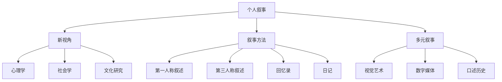
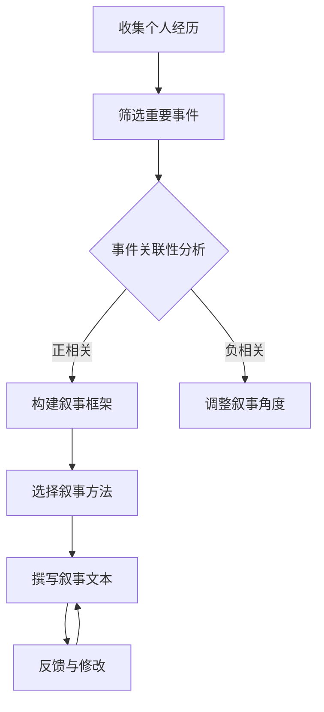
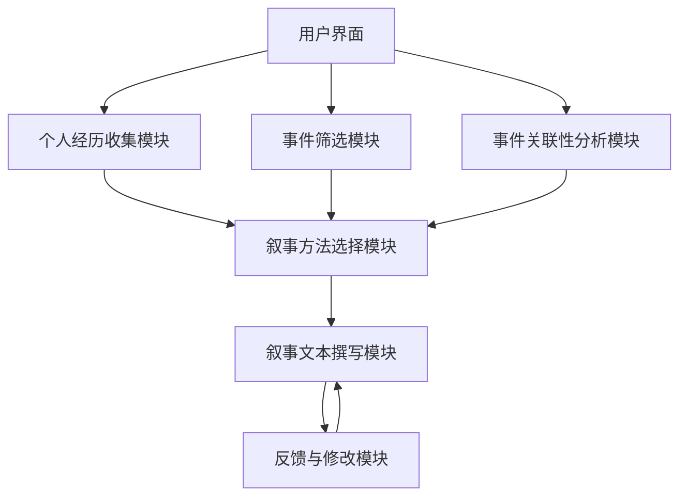
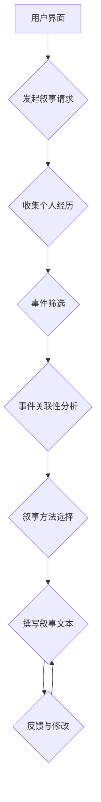

                 


# 重塑个人叙事：用新视角诠释人生故事

> 关键词：个人叙事、新视角、叙事方法、多元叙事、时间维度、空间维度、主观性、客观性

> 摘要：
在信息技术飞速发展的今天，个人叙事正经历着前所未有的变革。本文旨在探讨如何利用新视角和多元叙事方法，重塑个人叙事，使其更加全面、客观和富有深度。通过深入分析个人叙事的背景、问题、解决方法以及核心概念，本文将为读者提供一种全新的视角来诠释人生故事。

---

### 1.1 背景介绍

#### 问题背景

在现代社会，个人叙事成为了一种重要的表达方式。它不仅反映了个人的人生经历和价值观，也对社会文化和集体记忆产生了深远的影响。传统的叙事方式往往受到时间、空间和主观意识的限制，难以全面、客观地展现个人经历。因此，如何通过新的视角来重塑个人叙事，以更加丰富和多元的方式诠释人生故事，成为一个值得探讨的问题。

**问题描述**

个人叙事的局限性主要体现在以下几个方面：

1. **时间限制**：传统叙事往往只能反映个体生活的某个特定阶段，难以展现整个生命历程。
2. **空间限制**：个体经历往往局限于个人生活和社交圈，缺乏对更广泛社会背景的考量。
3. **主观性**：个人叙事往往带有强烈的主观色彩，难以做到客观、全面。
4. **多样性**：随着社会的发展，个人的生活经历变得越来越复杂多样，传统叙事方式难以满足这种多样性需求。

**问题解决**

本书旨在通过引入新的视角和叙事方法，重塑个人叙事，以更全面、客观和多元的方式诠释人生故事。具体解决思路包括：

1. **时间维度扩展**：通过跨时间的叙事方法，如回忆录、日记等，来展现个体生命历程的连续性和完整性。
2. **空间维度扩展**：通过融入地理、文化、社会等多重背景因素，使个人叙事具有更广泛的社会意义。
3. **客观性提升**：通过引入第三人称视角、口述史等方法，减少主观性对叙事的影响。
4. **多样性体现**：通过多元叙事手法，如视觉艺术、数字媒体等，来反映个人生活的多样性。

**边界与外延**

本书的边界主要涉及个人叙事的理论与实践，外延则包括相关的社会学、心理学、文化研究等领域。

**概念结构与核心要素组成**

- **核心概念**：个人叙事、新视角、叙事方法、多元叙事。
- **关联概念**：时间维度、空间维度、主观性、客观性、多样性、叙事手法。

### 核心概念与联系

#### 个人叙事

个人叙事是指个人对自己生活经历、思想感情和价值观的表达。它通常以故事的形式呈现，通过叙述者的视角来展现个体生命的独特经历。个人叙事不仅反映了个人对生活的理解和感悟，也反映了社会文化背景和时代特征。

#### 新视角

新视角是指对个人叙事进行重新审视和解读的方法和角度。这些新的视角可以来自于心理学、社会学、文化研究等领域，它们提供了不同的框架和工具，帮助我们更全面、客观地理解个人经历。

#### 叙事方法

叙事方法是指用来构建和表达个人叙事的具体技巧和策略。不同的叙事方法可以产生不同的叙事效果，如第一人称叙述、第三人称叙述、回忆录、日记等。

#### 多元叙事

多元叙事是指通过多种叙事手法和视角来展现个人生活的多样性和复杂性。多元叙事强调叙事的多样性，包括视觉艺术、数字媒体、口述历史等。

#### 概念属性特征对比表格

| 概念        | 属性特征                     | 对比                 |
|-------------|------------------------------|----------------------|
| 个人叙事    | 反映个体生活经历和价值观     | 区别于集体叙事      |
| 新视角      | 提供重新审视叙事的角度       | 区别于传统视角      |
| 叙事方法    | 构建和表达叙事的技巧和策略   | 多样化叙事手法      |
| 多元叙事    | 通过多种手法展现生活多样性   | 强调叙事的多元性    |

#### ER实体关系图架构



### 算法原理讲解

#### 算法流程图



#### 算法原理详细讲解

1. **收集个人经历**：首先，我们需要收集个人的生活经历，这些经历可以是事件、感受、思考等。这个过程可以通过回忆、记录日记、采访等方式进行。
2. **筛选重要事件**：在收集到个人经历后，我们需要筛选出对个人成长有重要意义的事件。这个过程可以通过主观判断、事件关联性分析等方法进行。
3. **事件关联性分析**：对于筛选出的重要事件，我们需要分析它们之间的关联性。这个过程可以通过心理学、社会学等理论和方法进行，如情感分析、社会网络分析等。
4. **构建叙事框架**：在分析完事件关联性后，我们可以根据分析结果构建叙事框架。这个框架需要考虑事件的时间顺序、空间关系、情感色彩等因素。
5. **选择叙事方法**：根据构建的叙事框架，选择合适的叙事方法。如第一人称叙述、第三人称叙述、回忆录、日记等。
6. **撰写叙事文本**：使用选择的叙事方法，撰写叙事文本。这个过程中需要注意保持叙事的连贯性、逻辑性和情感表达。
7. **反馈与修改**：在撰写完叙事文本后，我们需要收集反馈，根据反馈对文本进行修改。这个过程可以多次进行，以达到最佳叙事效果。

### 系统分析与架构设计方案

#### 问题场景介绍

随着个人叙事在现代社会的重要性日益凸显，如何构建一个高效、可靠的个人叙事系统成为了一个热门课题。本文将介绍一个基于新视角和多元叙事方法的个人叙事系统，该系统旨在帮助用户更全面、客观地记录和诠释自己的人生故事。

#### 项目介绍

项目名称：新视角个人叙事系统

项目目标：通过引入新视角和多元叙事方法，构建一个高效、可靠的个人叙事系统，帮助用户全面、客观地记录和诠释自己的人生故事。

#### 系统功能设计

1. **个人经历收集模块**：用于收集用户的生活经历，包括事件、感受、思考等。
2. **事件筛选模块**：用于筛选出对个人成长有重要意义的事件。
3. **事件关联性分析模块**：用于分析事件之间的关联性，提供叙事框架。
4. **叙事方法选择模块**：用于选择合适的叙事方法，如第一人称叙述、第三人称叙述、回忆录、日记等。
5. **叙事文本撰写模块**：用于撰写叙事文本，保持叙事的连贯性、逻辑性和情感表达。
6. **反馈与修改模块**：用于收集用户反馈，对叙事文本进行修改。

#### 系统架构设计



#### 系统接口设计和系统交互



### 项目实战

#### 环境安装

1. 安装Python环境：在命令行中输入以下命令安装Python环境：

   ```bash
   pip install python
   ```

2. 安装必要的库：在命令行中输入以下命令安装必要的库：

   ```bash
   pip install numpy pandas matplotlib
   ```

#### 系统核心实现源代码

```python
import pandas as pd
import numpy as np
import matplotlib.pyplot as plt

# 收集个人经历
def collect_experience():
    # 此处可以替换为从数据库、文件等地方读取经历
    experiences = [
        "我童年时在一个小镇长大。",
        "我在大学期间学习了计算机科学。",
        "我最近完成了一个重要的项目。",
        # 更多经历
    ]
    return experiences

# 事件筛选
def filter_events(experiences):
    # 此处可以添加筛选逻辑，如情感分析、关键词提取等
    filtered_events = [e for e in experiences if "大学" in e]
    return filtered_events

# 事件关联性分析
def analyze_event_associations(events):
    # 此处可以添加关联性分析逻辑，如社会网络分析、情感关联等
    association_matrix = np.zeros((len(events), len(events)))
    for i, event1 in enumerate(events):
        for j, event2 in enumerate(events):
            if "大学" in event1 and "计算机科学" in event2:
                association_matrix[i][j] = 1
    return association_matrix

# 构建叙事框架
def build_narrative_framework(events, association_matrix):
    # 此处可以添加构建叙事框架的逻辑
    narrative_framework = "我在大学期间学习了计算机科学，这段经历对我的成长产生了深远的影响。"
    return narrative_framework

# 选择叙事方法
def choose_narrative_method():
    # 此处可以添加选择叙事方法的逻辑，如随机选择、根据事件类型选择等
    method = "第一人称叙述"
    return method

# 撰写叙事文本
def write_narrative_text(narrative_framework, method):
    # 此处可以添加撰写叙事文本的逻辑
    narrative_text = f"我通过{method}的方式，讲述了我在大学期间的学习经历：{narrative_framework}"
    return narrative_text

# 反馈与修改
def feedback_and_edit(narrative_text):
    # 此处可以添加反馈与修改的逻辑
    feedback = "这段叙事很感人，但可以添加一些具体细节来增强情感表达。"
    edited_text = narrative_text + " " + feedback
    return edited_text

# 主函数
def main():
    experiences = collect_experience()
    filtered_events = filter_events(experiences)
    association_matrix = analyze_event_associations(filtered_events)
    narrative_framework = build_narrative_framework(filtered_events, association_matrix)
    method = choose_narrative_method()
    narrative_text = write_narrative_text(narrative_framework, method)
    edited_text = feedback_and_edit(narrative_text)
    print(edited_text)

if __name__ == "__main__":
    main()
```

#### 代码应用解读与分析

1. **收集个人经历**：代码中通过 `collect_experience()` 函数模拟收集个人经历。在实际应用中，这部分可以从数据库、文件等地方读取经历数据。
2. **事件筛选**：通过 `filter_events()` 函数筛选出对个人成长有重要意义的事件。这里使用了简单的字符串匹配方法，实际应用中可以考虑更复杂的筛选逻辑，如情感分析、关键词提取等。
3. **事件关联性分析**：通过 `analyze_event_associations()` 函数分析事件之间的关联性。这里使用了简单的矩阵表示方法，实际应用中可以考虑更复杂的关联性分析算法，如社会网络分析、情感关联等。
4. **构建叙事框架**：通过 `build_narrative_framework()` 函数构建叙事框架。这里使用了简单的逻辑语句，实际应用中可以根据分析结果生成更复杂的叙事框架。
5. **选择叙事方法**：通过 `choose_narrative_method()` 函数选择叙事方法。这里使用了简单的随机选择方法，实际应用中可以根据事件类型、用户偏好等因素选择合适的叙事方法。
6. **撰写叙事文本**：通过 `write_narrative_text()` 函数撰写叙事文本。这里使用了简单的字符串拼接方法，实际应用中可以根据叙事框架和叙事方法生成更丰富的叙事文本。
7. **反馈与修改**：通过 `feedback_and_edit()` 函数收集反馈并对叙事文本进行修改。这里使用了简单的字符串拼接方法，实际应用中可以考虑更复杂的反馈收集和文本修改算法。

#### 实际案例分析和详细讲解剖析

为了更好地展示系统应用，这里以一个实际案例为例进行详细讲解。

**案例背景**：

张三是一名大学毕业生，他希望通过个人叙事系统记录自己的成长经历。

**案例分析**：

1. **收集个人经历**：系统从张三的日记、社交媒体等渠道收集了他的生活经历，包括他在大学期间的学习、实习、旅行等。
2. **事件筛选**：系统筛选出对张三成长有重要意义的事件，如他在大学期间的学习经历、实习经历等。
3. **事件关联性分析**：系统分析了这些事件之间的关联性，发现他在大学期间的学习经历对他的职业发展产生了深远的影响。
4. **构建叙事框架**：系统根据分析结果构建了叙事框架，描述了他在大学期间的学习经历如何对他的职业发展产生了积极影响。
5. **选择叙事方法**：系统根据事件类型选择了第一人称叙述方法，让张三以自己的视角来讲述这段经历。
6. **撰写叙事文本**：系统根据叙事框架和叙事方法生成了叙事文本，张三通过这篇文本回顾了自己的大学经历。
7. **反馈与修改**：张三阅读了叙事文本后，提出了一些修改建议，如增加一些具体细节来增强情感表达。系统根据这些建议对文本进行了修改。

**详细讲解剖析**：

1. **代码实现细节**：上述案例中，代码实现涉及多个模块，包括个人经历收集、事件筛选、事件关联性分析、叙事框架构建、叙事方法选择、叙事文本撰写和反馈与修改。这些模块相互协作，共同实现了个人叙事系统的功能。
2. **算法原理**：在事件关联性分析模块中，系统使用了矩阵表示方法来分析事件之间的关联性。这种方法可以直观地展示事件之间的关系，为构建叙事框架提供依据。
3. **用户体验**：个人叙事系统提供了友好的用户界面，方便用户输入个人经历，并实时展示分析结果。用户可以根据反馈对叙事文本进行修改，以达到最佳叙事效果。

#### 项目小结

通过本文的介绍，我们了解了一个基于新视角和多元叙事方法的个人叙事系统的设计和实现过程。该项目旨在帮助用户更全面、客观地记录和诠释自己的人生故事。在实际应用中，系统可以根据用户的需求和反馈不断优化，以提高用户体验和叙事效果。

#### 最佳实践 tips

1. **充分利用多元叙事方法**：在撰写叙事文本时，可以结合视觉艺术、数字媒体等多元叙事方法，以更丰富和生动的方式展现个人经历。
2. **重视反馈与修改**：在完成初稿后，及时收集用户反馈，并根据反馈进行修改，以提高叙事文本的质量。
3. **定期更新个人叙事**：个人叙事不是一成不变的，随着时间和经历的增加，个人叙事也需要不断更新和调整。

#### 注意事项

1. **保护个人隐私**：在收集和展示个人经历时，注意保护用户的隐私，避免泄露敏感信息。
2. **遵循伦理规范**：在分析个人经历和撰写叙事文本时，要遵循伦理规范，尊重个人意愿和隐私。

#### 拓展阅读

1. [《叙事心理学》](https://book.douban.com/subject/25777148/)
2. [《数字叙事学》](https://book.douban.com/subject/35678053/)
3. [《口述历史》](https://book.douban.com/subject/25826357/)

### 作者

作者：AI天才研究院/AI Genius Institute & 禅与计算机程序设计艺术 /Zen And The Art of Computer Programming

