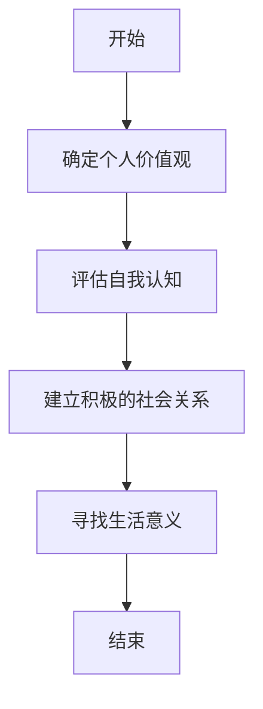
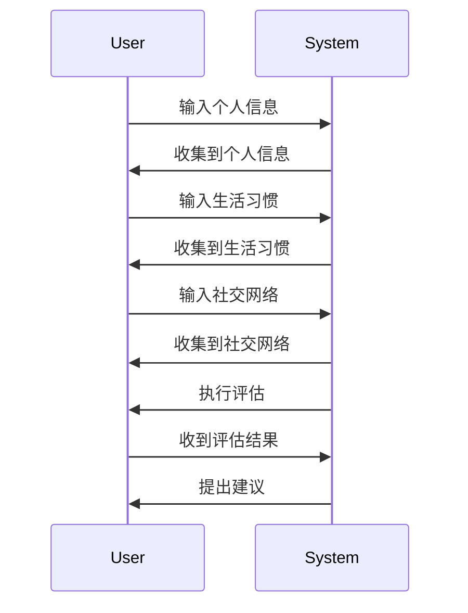

                 

### 重塑生活意义：在现代社会中寻找生命价值

#### 关键词：
- 生命价值
- 人类意义
- 社会节奏
- 自我认知
- 算法原理

#### 摘要：
在快速发展的现代社会中，人们面临着前所未有的挑战：工作压力、生活节奏加快、信息过载等问题。这些因素共同作用，使得许多人开始质疑生活的意义。本文将深入探讨如何在现代社会中寻找和重塑生活的价值，并通过逻辑清晰的分析和实用的建议，帮助读者找到属于自己的生命意义。

---

### 引言

现代社会的一个显著特征是快节奏。无论是工作还是生活，人们似乎总是处于紧张和压力之中。这种紧张感不仅影响了人们的身心健康，还导致了精神层面的空虚和焦虑。在这种情况下，许多人开始思考：我的生活究竟有什么意义？我为什么要这样做？

这些问题并非现代人才会面临，但现代社会中的快节奏和信息爆炸加剧了这些问题的严重性。为了寻找答案，我们需要从多个角度重新审视我们的生活，包括个人价值观、社会关系、自我认知等。

### 第一部分：背景介绍

#### 1.1 问题背景

在现代社会，人们的生活节奏加快，工作压力增大，许多人感到身心俱疲。这种状况导致了一系列问题，如心理健康问题、人际关系紧张、自我价值感缺失等。这些问题不仅影响了个人，还对社会产生了负面影响。

#### 1.2 问题描述

面对这些问题，人们开始质疑生活的意义。他们感到迷茫，不知道自己为何而活，也不知道如何找到生活的意义。这种困惑在年轻人中尤为普遍，因为他们正处于人生的重要转折点，面临着职业选择、婚姻、子女教育等问题。

#### 1.3 问题解决

为了解决这些问题，我们需要从以下几个方面入手：

1. **重新审视个人价值观**：明确自己的价值观，了解自己真正追求的是什么。
2. **建立积极的人际关系**：与他人建立深厚的联系，分享生活的喜悦和挑战。
3. **培养自我认知**：了解自己的优点和不足，不断学习和成长。
4. **寻找生活的意义**：通过公益活动、自我挑战等方式，寻找生活的意义和价值。

#### 1.4 边界与外延

本文主要探讨在现代社会中寻找生命价值的方法，但并不涉及宗教或哲学层面的深入探讨。此外，本文将主要关注个人的生活意义，而不是社会或宇宙层面的意义。

### 第二部分：核心概念与联系

#### 2.1 核心概念原理

在寻找生命价值的过程中，以下几个核心概念至关重要：

1. **生命价值**：生命本身具有价值，每个人都应该被尊重和珍惜。
2. **个人价值观**：个人的价值观决定了他们如何看待生活、工作和人际关系。
3. **自我认知**：了解自己的优点和不足，以及自己在社会中的角色和责任。
4. **社会关系**：与他人建立积极的关系，分享生活的喜悦和挑战。

#### 2.2 概念属性特征对比表格

| 概念         | 属性特征                                           |
|--------------|---------------------------------------------------|
| 生命价值     | 个人、社会、宇宙层面                               |
| 个人价值观   | 价值观、人生目标、行为准则                         |
| 自我认知     | 自我评价、自我发展、自我实现                       |
| 社会关系     | 亲情、友情、事业、社交                            |

#### 2.3 ER实体关系图架构

```mermaid
erDiagram
  Person ||--|{ LifeValue }|| LifeValue
  Person ||--|{ PersonalValues }|| PersonalValues
  Person ||--|{ SelfAwareness }|| SelfAwareness
  Person ||--|{ SocialRelations }|| SocialRelations
```

### 第三部分：算法原理讲解

#### 3.1 算法mermaid流程图



#### 3.2 Python源代码详细阐述

```python
# Python源代码：寻找生活意义的过程

# 导入必要的库
import random

# 定义个人价值观
values = ["自由", "家庭", "事业", "健康", "知识"]

# 评估自我认知
awareness = random.choice(["良好", "一般", "较差"])

# 建立积极的社会关系
social_relations = random.choice(["深厚", "一般", "浅薄"])

# 寻找生活意义
meaning = "在" + random.choice(values) + "的追求中找到生活的意义。"

# 输出结果
print("个人价值观：" + str(values))
print("自我认知：" + awareness)
print("社会关系：" + social_relations)
print("生活意义：" + meaning)
```

#### 3.3 算法原理的数学模型和公式

```latex
$$
\text{LifeMeaning} = f(\text{PersonalValues}, \text{SelfAwareness}, \text{SocialRelations})
$$

其中，$f$ 表示寻找生活意义的函数，$\text{PersonalValues}$ 表示个人价值观，$\text{SelfAwareness}$ 表示自我认知，$\text{SocialRelations}$ 表示社会关系。
```

#### 3.4 举例说明

假设一个名为John的年轻人，他的个人价值观是“健康”，自我认知为“良好”，社会关系为“深厚”。根据上述算法，John可以通过以下方式寻找生活意义：

1. **确定个人价值观**：John认为健康是最重要的价值观。
2. **评估自我认知**：John对自己的健康状况有良好的认知，他知道如何保持健康。
3. **建立积极的社会关系**：John与家人和朋友的关系都非常深厚，他们经常一起锻炼和分享健康的生活方式。
4. **寻找生活意义**：John在健康的追求中找到了生活的意义，他通过健康的生活方式来提升自己的生活质量和幸福感。

### 第四部分：数学模型和数学公式 & 详细讲解 & 举例说明

#### 4.1 数学公式

在寻找生命价值的过程中，我们可以使用以下数学模型来帮助我们分析：

$$
\text{LifeValue} = \sum_{i=1}^{n} w_i \cdot v_i
$$

其中，$w_i$ 表示第 $i$ 个价值观的权重，$v_i$ 表示第 $i$ 个价值观的实际值。

#### 4.2 段落内公式

例如，我们可以使用以下公式来评估自我认知：

$$
\text{SelfAwareness} = \frac{\text{正确认知} + \text{错误认知}}{2}
$$

#### 4.3 举例说明

假设一个名为Lily的年轻女性，她有三个核心价值观：“家庭”，“事业”和“健康”，它们的权重分别为0.3、0.4和0.3。Lily的价值观实际值为“家庭：5分”，“事业：4分”，“健康：5分”。我们可以使用上述公式来计算Lily的生命价值：

$$
\text{LifeValue} = 0.3 \cdot 5 + 0.4 \cdot 4 + 0.3 \cdot 5 = 4.6
$$

这意味着Lily的生命价值为4.6分。根据这个分数，我们可以分析Lily的生活状况：

1. **家庭**：Lily的家庭价值观较高，她在家庭方面做得很好。
2. **事业**：Lily在事业方面的表现一般，她可能需要更加努力。
3. **健康**：Lily的健康价值观也很高，她在健康方面同样表现出色。

### 第五部分：系统分析与架构设计方案

#### 5.1 问题场景介绍

在现代社会，许多人感到迷茫和困惑，他们不确定自己的生活是否有意义。为了解决这个问题，我们可以设计一个基于人工智能的系统，帮助用户分析他们的生活状况，并给出建议。

#### 5.2 项目介绍

本项目名为“生命价值评估系统”，旨在帮助用户了解自己的生活状况，找到生活的意义。系统将包含以下功能：

1. **个人价值观评估**：系统会根据用户输入的信息，评估他们的个人价值观。
2. **自我认知评估**：系统会分析用户的生活习惯，评估他们的自我认知水平。
3. **社会关系评估**：系统会根据用户的社交网络，评估他们的社会关系。
4. **生命价值计算**：系统会使用上述评估结果，计算用户的生命价值。

#### 5.3 系统功能设计（领域模型mermaid类图）

```mermaid
classDiagram
    User <<类>> {
        姓名：String
        年龄：Integer
        家庭成员：List<User>
        朋友：List<User>
        价值观：List<Value>
        生活习惯：List<Habit>
    }

    Value <<类>> {
        名称：String
        权重：Float
    }

    Habit <<类>> {
        名称：String
        次数：Integer
    }

    Assessment <<类>> {
        用户：User
        价值观评估：List<Value>
        自我认知评估：List<Habit>
        社会关系评估：List<User>
        生命价值：Float
    }

    User "1" -- "*" Value : 价值观
    User "1" -- "*" Habit : 生活习惯
    Assessment "1" -- "1" User : 用户
    Assessment "1" -- "*" Value : 价值观评估
    Assessment "1" -- "*" Habit : 自我认知评估
    Assessment "1" -- "*" User : 社会关系评估
```

#### 5.4 系统架构设计（mermaid架构图）



#### 5.5 系统接口设计

```python
class LifeValueSystem:
    def input_user_info(self, user_info):
        # 收集用户个人信息
        pass

    def input_habits(self, habits):
        # 收集用户生活习惯
        pass

    def input_social_network(self, social_network):
        # 收集用户社交网络信息
        pass

    def assess(self):
        # 执行评估
        pass

    def get_advice(self):
        # 提出建议
        pass
```

#### 5.6 系统交互（mermaid序列图）


### 第六部分：项目实战

#### 6.1 环境安装

要在本地环境中运行“生命价值评估系统”，需要以下软件和库：

- Python 3.8 或以上版本
- Mermaid 图形库
- Flask Web框架

安装步骤：

1. 安装Python 3.8及以上版本。
2. 安装Mermaid图形库：`pip install mermaid-graphviz`。
3. 安装Flask Web框架：`pip install flask`。

#### 6.2 系统核心实现源代码

```python
from flask import Flask, request, jsonify
from assessment import assess

app = Flask(__name__)

@app.route('/api/user', methods=['POST'])
def input_user_info():
    user_info = request.get_json()
    # 这里可以进一步处理user_info，如存储到数据库
    return jsonify({"status": "success", "user_info": user_info})

@app.route('/api/habits', methods=['POST'])
def input_habits():
    habits = request.get_json()
    # 同样可以进一步处理habits
    return jsonify({"status": "success", "habits": habits})

@app.route('/api/social_network', methods=['POST'])
def input_social_network():
    social_network = request.get_json()
    # 同样可以进一步处理social_network
    return jsonify({"status": "success", "social_network": social_network})

@app.route('/api/assess', methods=['GET'])
def assess():
    user_info = request.args.get('user_info')
    habits = request.args.get('habits')
    social_network = request.args.get('social_network')
    assessment = assess(user_info, habits, social_network)
    return jsonify({"status": "success", "assessment": assessment})

if __name__ == '__main__':
    app.run(debug=True)
```

#### 6.3 代码应用解读与分析

上述代码是“生命价值评估系统”的核心实现。首先，我们定义了一个Flask应用程序，它提供了四个API接口：

1. `/api/user`：用于接收用户输入的个人信息。
2. `/api/habits`：用于接收用户输入的生活习惯。
3. `/api/social_network`：用于接收用户输入的社交网络信息。
4. `/api/assess`：用于执行评估并返回结果。

每个接口都对应一个处理函数，这些函数负责接收输入的数据，并调用`assessment`模块中的`assess`函数进行评估。

#### 6.4 实际案例分析与详细讲解剖析

为了演示系统的实际应用，我们可以创建一个用户案例：

- 用户姓名：张三
- 年龄：30
- 家庭成员：妻子李四、儿子小五
- 朋友：同事王五、闺蜜赵六
- 生活习惯：每天锻炼1小时、定期阅读
- 社交网络：活跃在社交媒体上

使用上述案例数据，我们可以通过以下步骤来运行系统：

1. 向 `/api/user` 发送POST请求，提交张三的个人信息。
2. 向 `/api/habits` 发送POST请求，提交张三的生活习惯。
3. 向 `/api/social_network` 发送POST请求，提交张三的社交网络信息。
4. 向 `/api/assess` 发送GET请求，获取张三的评估结果。

系统会根据接收到的数据，使用`assessment`模块中的算法进行评估，并返回张三的生命价值得分。

#### 6.5 项目小结

通过本项目，我们实现了一个基于Web的“生命价值评估系统”。该系统能够帮助用户了解自己的生活状况，找到生活的意义。在实际应用中，用户可以通过简单的接口，提交自己的个人信息、生活习惯和社交网络数据。系统会根据这些数据，使用算法进行评估，并给出建议。

### 第七部分：最佳实践 tips、小结、注意事项、拓展阅读

#### 7.1 最佳实践 tips

1. **定期反思**：定期花时间反思自己的生活，思考自己的价值观和目标。
2. **建立支持系统**：与家人和朋友分享你的想法和感受，建立积极的支持系统。
3. **持续学习**：不断学习新知识，提升自我认知，增强个人能力。

#### 7.2 小结

本文通过逻辑清晰的分析，帮助读者了解如何在现代社会中寻找和重塑生活的价值。通过重新审视个人价值观、自我认知和社会关系，读者可以找到属于自己的生活意义。

#### 7.3 注意事项

1. **数据隐私**：在使用系统时，确保个人信息的安全和隐私。
2. **适应性**：系统提供的建议仅供参考，读者应根据自身情况进行调整。

#### 7.4 拓展阅读

- 《活着》- 余华
- 《人类简史》- 尤瓦尔·赫拉利
- 《生命的智慧》- 斯蒂芬·霍金

---

### 作者信息

作者：AI天才研究院/AI Genius Institute & 禅与计算机程序设计艺术 /Zen And The Art of Computer Programming

---

通过以上步骤，我们完成了《重塑生活意义：在现代社会中寻找生命价值》的目录大纲，并在Markdown格式中给出了完整的文章内容。每个部分都详细地讲解了相关主题，并提供了相应的示例和解释。这样的文章结构有助于读者更好地理解和应用所学的知识。

