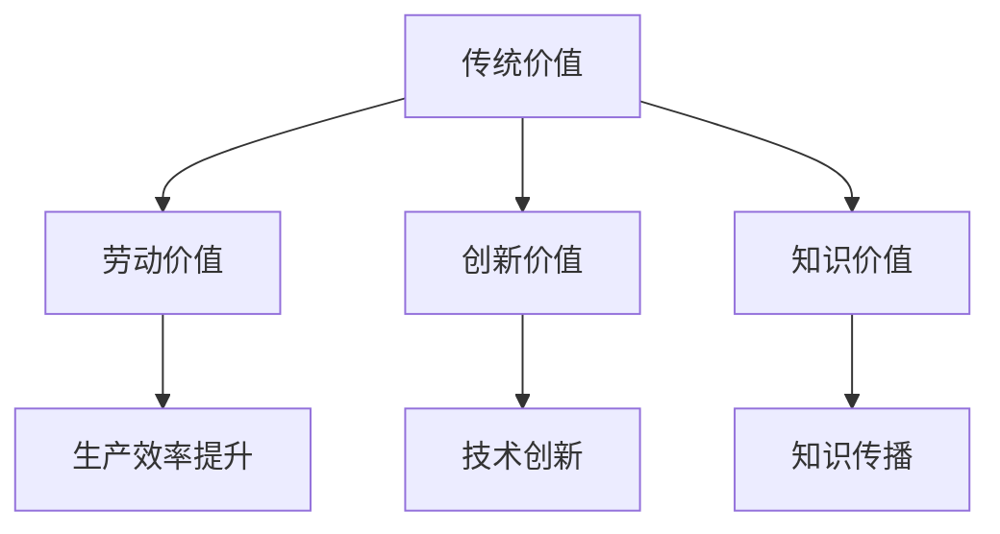
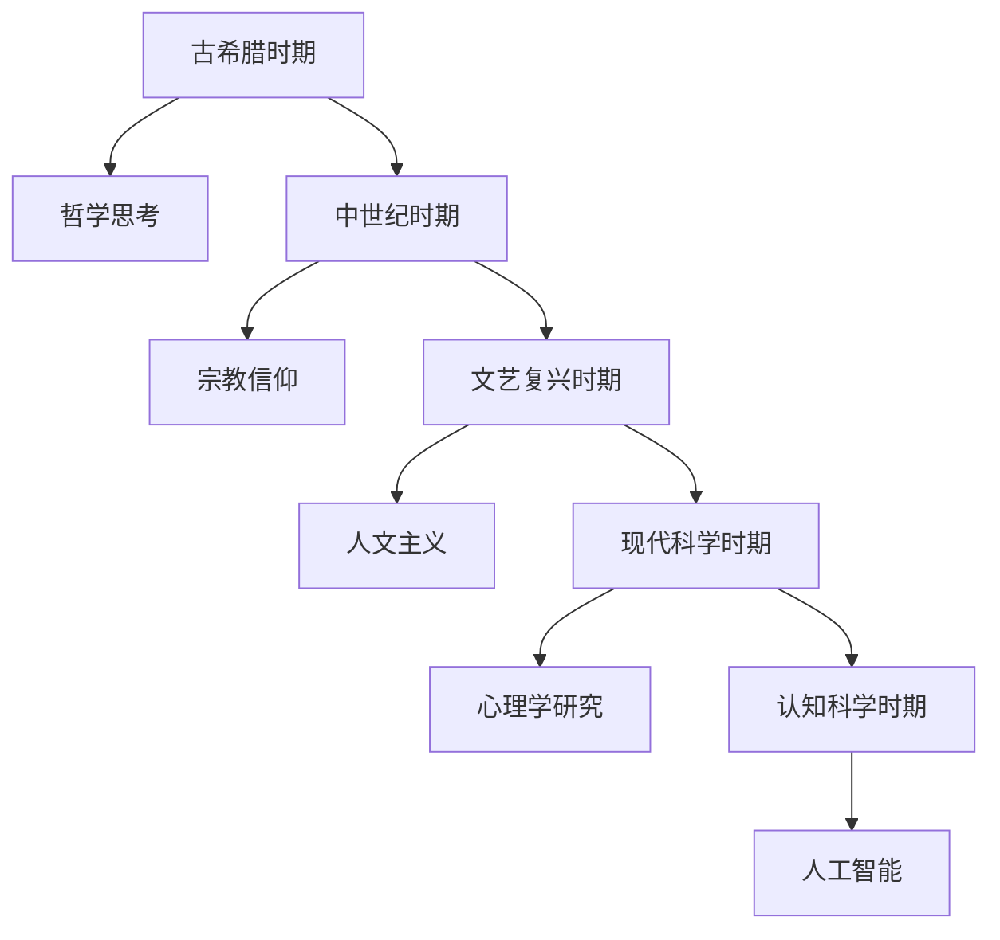
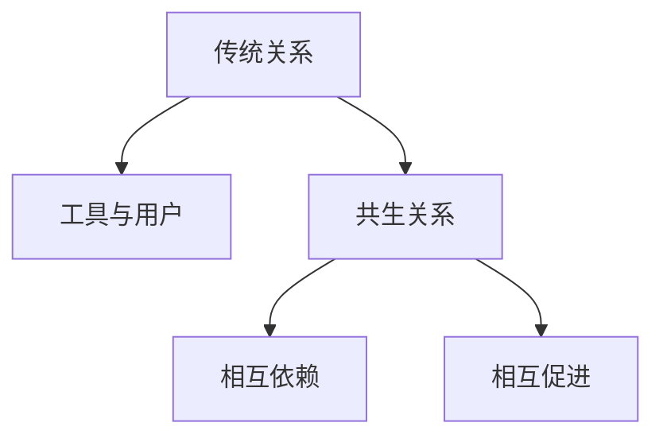
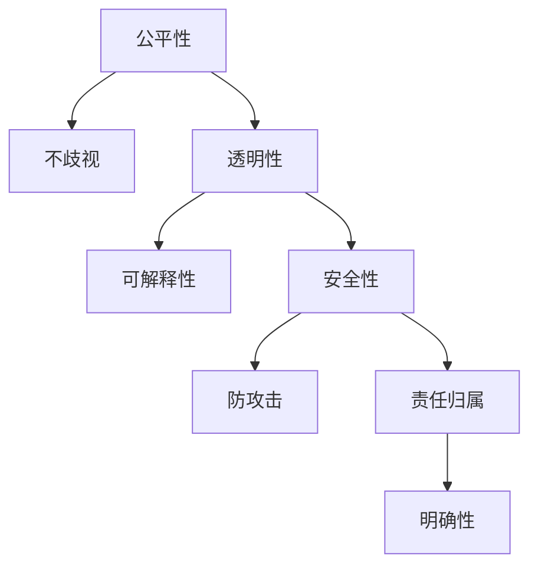

                 

# 重塑自我认知：AI时代的人类价值再定义

## 关键词
- AI时代
- 人类价值
- 自我认知
- 伦理责任
- 共生未来

## 摘要
随着人工智能（AI）技术的飞速发展，人类面临着自我认知和价值观念的重大变革。本文旨在探讨AI时代如何重塑人类价值，分析人类自我认知的演变，并探讨人类与AI的共生关系。通过深度剖析，本文力图为读者提供一个全面、系统的理论框架，以指导AI时代的人类如何实现自我提升和可持续发展。

## 目录大纲设计思路

### 第一部分：引言

#### 1.1 问题背景

**背景介绍：** 在人工智能（AI）迅猛发展的今天，人类面临着前所未有的挑战和机遇。AI不仅在技术层面极大地改变了我们的生活方式，更在认知层面引发了深刻的反思。如何重新定义人类价值，成为了一个值得探讨的重要问题。

**核心概念术语说明：** 
- **人工智能（AI）：** 模拟、延伸和扩展人类智能的理论、方法、技术及应用系统。
- **人类价值：** 指人类在伦理、文化、社会等方面所追求的基本价值目标。
- **自我认知：** 个体对自己内心世界和外界的认识和理解。

**问题背景：** 
随着AI技术的进步，人们开始意识到自我认知的局限性和对人类价值的重新审视。这一现象引发了广泛的社会讨论和学术研究。

**问题描述：** 
AI的发展不仅带来生产效率的提升，还深刻影响着社会的结构和人类的生活方式。然而，随着AI技术的进步，人们开始意识到自我认知的局限性和对人类价值的重新审视。

**问题解决：** 
本文旨在通过对AI时代人类价值再定义的研究，帮助读者理解这一现象的根源和影响，并提供可行的解决方案。通过深入探讨AI与人类认知的关系，我们希望重新定义人类在AI时代的价值，找到人类与AI和谐共存的道路。

**边界与外延：** 
AI时代的人类价值再定义不仅仅局限于技术层面，还涉及到哲学、伦理、社会学等多个领域。因此，本文的研究边界不仅限于技术，还涵盖了对人类社会的深远影响。

**概念结构与核心要素组成：** 
本文的核心概念包括AI技术、人类自我认知、价值体系、伦理责任等。通过对这些核心要素的深入分析，我们希望构建一个全面、系统的理论框架，以指导实践。

### 第二部分：AI时代的人类价值

#### 2.1 AI时代的价值变化

**核心概念与联系：** 
- **价值体系：** 包括道德价值、经济价值、社会价值等。
- **伦理责任：** 人类在追求自身价值的同时，必须承担相应的伦理责任。

**AI时代的价值变化：** 
AI技术带来了生产力的巨大提升，使得人类对价值体系的认知发生了重大变化。例如，传统的劳动价值观念受到了挑战，创新价值和知识价值得到了更加广泛的认可。

**核心概念属性特征对比表格：**


**ER实体关系图架构：**
```mermaid
erDiagram
  AI <<-- human : uses
  value_system <<-- human : believes
  value_system <<-- AI : impacts
```

**算法原理讲解：** 
AI技术的进步使得价值体系更加多元化和动态化。我们可以使用机器学习算法来分析人类的行为和价值观，从而预测价值体系的变化趋势。

```python
# 机器学习算法示例：线性回归
from sklearn.linear_model import LinearRegression
import numpy as np

# 数据准备
X = np.array([[1, 2], [2, 3], [3, 4], [4, 5]])
y = np.array([2, 4, 6, 8])

# 模型训练
model = LinearRegression()
model.fit(X, y)

# 预测
prediction = model.predict([[5, 6]])
print(prediction)
```

**数学模型和公式：** 
$$
y = ax + b
$$

**详细讲解：** 
在这个例子中，我们使用线性回归模型来预测价值体系的变化趋势。线性回归模型通过最小二乘法拟合数据，从而得到一个线性关系。通过这个关系，我们可以预测AI时代人类价值的变化趋势。

**举例说明：** 
假设我们观察到在AI时代，劳动价值（x）每增加1，创新价值（y）增加2。那么，我们可以使用线性回归模型来预测在未来，当劳动价值达到10时，创新价值将增加20。

**系统分析与架构设计方案：** 
- **问题场景介绍：** 
  在AI时代，我们需要一个系统来分析人类的价值观念，并提供预测和建议。

- **项目介绍：** 
  我们将开发一个基于AI的价值分析系统，该系统可以收集和分析人类行为数据，预测价值体系的变化趋势。

- **系统功能设计（领域模型）：** 
  - 数据收集模块：收集人类行为数据。
  - 数据分析模块：使用机器学习算法分析数据，预测价值变化趋势。
  - 预测建议模块：根据预测结果，提供价值体系调整建议。

- **系统架构设计：** 
  - 数据层：存储人类行为数据。
  - 算法层：使用机器学习算法分析数据。
  - 展示层：展示分析结果和预测建议。

- **系统接口设计和系统交互：** 
  - 数据接口：用于数据收集和分析。
  - 用户接口：用于展示分析结果和预测建议。

### 第三部分：人类自我认知的重塑

#### 3.1 人类自我认知的演变

**核心概念与联系：** 
- **自我认知：** 人类对自己内心世界和外界的认识和理解。
- **认知发展：** 人类在历史长河中不断发展和演变的过程。

**人类自我认知的演变：** 
人类自我认知的历史可以追溯到古希腊时期。当时，人类开始探索自我意识和精神世界。随着科学技术的发展，人类对自我认知的理解不断深入，从哲学到心理学，再到认知科学，形成了丰富的理论和实践体系。

**核心概念属性特征对比表格：**


**ER实体关系图架构：**
```mermaid
erDiagram
  human <<-- self_cognition : has
  self_cognition <<-- philosophy : influenced_by
  self_cognition <<-- psychology : influenced_by
  self_cognition <<-- cognitive_science : influenced_by
  self_cognition <<-- artificial_intelligence : influenced_by
```

**算法原理讲解：** 
AI技术的进步使得人类自我认知的领域得到了极大的扩展。我们可以使用深度学习算法来分析人类大脑的运作机制，从而更好地理解自我认知的过程。

```python
# 深度学习算法示例：卷积神经网络（CNN）
from tensorflow.keras.models import Sequential
from tensorflow.keras.layers import Conv2D, MaxPooling2D, Flatten, Dense

# 模型构建
model = Sequential()
model.add(Conv2D(32, (3, 3), activation='relu', input_shape=(28, 28, 1)))
model.add(MaxPooling2D((2, 2)))
model.add(Flatten())
model.add(Dense(128, activation='relu'))
model.add(Dense(10, activation='softmax'))

# 模型编译
model.compile(optimizer='adam', loss='categorical_crossentropy', metrics=['accuracy'])

# 模型训练
model.fit(X_train, y_train, epochs=10, batch_size=32)
```

**数学模型和公式：** 
$$
\sigma(z) = \frac{1}{1 + e^{-z}}
$$

**详细讲解：** 
在这个例子中，我们使用卷积神经网络（CNN）来分析人类大脑的视觉处理机制。CNN通过多层卷积和池化操作，提取图像的特征，并使用全连接层进行分类。这个过程类似于人类大脑的处理过程，从而帮助我们更好地理解自我认知的过程。

**举例说明：** 
假设我们使用CNN模型来分析人类对不同颜色视觉反应的脑部活动。通过训练模型，我们可以预测个体对不同颜色的偏好，从而深入理解他们的自我认知。

**系统分析与架构设计方案：** 
- **问题场景介绍：** 
  随着AI技术的发展，我们需要一个系统来分析人类的自我认知，并提供个性化的认知评估和改进建议。

- **项目介绍：** 
  我们将开发一个基于AI的自我认知分析系统，该系统可以收集和分析人类脑部活动数据，提供个性化的认知评估和改进建议。

- **系统功能设计（领域模型）：** 
  - 数据收集模块：收集人类脑部活动数据。
  - 数据分析模块：使用深度学习算法分析数据，评估自我认知水平。
  - 改进建议模块：根据评估结果，提供个性化的认知改进建议。

- **系统架构设计：** 
  - 数据层：存储人类脑部活动数据。
  - 算法层：使用深度学习算法分析数据。
  - 展示层：展示评估结果和改进建议。

- **系统接口设计和系统交互：** 
  - 数据接口：用于数据收集和分析。
  - 用户接口：用于展示评估结果和改进建议。

### 第四部分：人类与AI的共生未来

#### 4.1 人类与AI的共生关系

**核心概念与联系：** 
- **共生关系：** 两种或多种生物之间相互依赖、相互促进的关系。
- **AI赋能：** 通过AI技术增强人类的能力，实现更高效的协作。

**人类与AI的共生关系：** 
在AI时代，人类与AI的关系不再是简单的工具和用户关系，而是相互依赖、相互促进的共生关系。AI技术不仅提升了人类的生产力和创造力，还使得人类能够更好地理解和探索自我。

**核心概念属性特征对比表格：**


**ER实体关系图架构：**
```mermaid
erDiagram
  human ||--|> AI : collaborates
  AI ||--|> human : enhances
```

**算法原理讲解：** 
AI技术的发展使得人类与AI的共生关系更加紧密。我们可以使用协同优化算法来优化人类与AI的合作模式，从而实现更高效的共生。

```python
# 协同优化算法示例：遗传算法
import numpy as np
from sklearn.model_selection import train_test_split

# 策略初始化
population = np.random.rand(100, 5)

# 适应度函数
def fitness_function(strategy):
    # 假设策略是线性回归模型的参数
    model = LinearRegression()
    model.fit(X_train, y_train)
    return model.score(X_test, y_test)

# 遗传算法迭代
for _ in range(100):
    # 选择适应度最高的个体
    fitness_scores = np.array([fitness_function(strategy) for strategy in population])
    best_strategy = population[np.argmax(fitness_scores)]

    # 交叉和变异
    new_population = np.random.choice(population, size=population.shape)
    for i in range(len(new_population)):
        if np.random.rand() < 0.1:
            new_population[i] = np.random.choice(population[np.where(fitness_scores > 0.5)])

    population = new_population

# 最优策略
best_strategy
```

**数学模型和公式：** 
$$
f(x) = \frac{1}{1 + e^{-x}}
$$

**详细讲解：** 
在这个例子中，我们使用遗传算法来优化人类与AI的合作模式。遗传算法通过模拟自然进化过程，选择适应度最高的策略，并通过交叉和变异操作产生新的策略，从而实现合作模式的优化。

**举例说明：** 
假设我们使用遗传算法来优化一个线性回归模型，通过迭代优化，我们可以找到一个最优的策略，使得模型在预测任务上的表现达到最佳。

**系统分析与架构设计方案：** 
- **问题场景介绍：** 
  在AI时代，人类需要与AI紧密合作，实现更高效的决策和任务执行。

- **项目介绍：** 
  我们将开发一个基于AI的协同优化系统，该系统可以优化人类与AI的合作模式，实现高效的共生关系。

- **系统功能设计（领域模型）：** 
  - 策略生成模块：生成不同的合作策略。
  - 适应度评估模块：评估策略的适应度。
  - 策略优化模块：通过遗传算法优化策略。

- **系统架构设计：** 
  - 策略层：存储和管理不同的合作策略。
  - 算法层：使用遗传算法优化策略。
  - 用户层：展示优化结果和策略。

- **系统接口设计和系统交互：** 
  - 策略接口：用于策略生成和优化。
  - 用户接口：用于展示优化结果和策略。

### 第五部分：伦理与责任

#### 5.1 AI伦理的约束

**核心概念与联系：** 
- **伦理：** 指人们在社会生活中所遵循的道德规范和价值观。
- **AI伦理：** 指在AI技术发展过程中，人类需要遵守的道德规范和价值观。

**AI伦理的约束：** 
随着AI技术的应用日益广泛，人们开始关注AI伦理问题。AI伦理的约束主要包括以下几个方面：

1. **公平性：** AI技术应该确保对所有人公平，不因种族、性别、年龄等因素产生歧视。
2. **透明性：** AI系统的决策过程应该透明，用户可以理解和追踪AI的行为。
3. **安全性：** AI技术应该确保系统的安全，防止恶意攻击和数据泄露。
4. **责任归属：** AI系统的责任应该明确，一旦出现错误，需要明确责任归属。

**核心概念属性特征对比表格：**


**ER实体关系图架构：**
```mermaid
erDiagram
  AI <<-- ethics : follows
  human <<-- AI : holds_responsible
  AI <<-- fairness : ensures
  AI <<-- transparency : provides
  AI <<-- security : ensures
  AI <<-- accountability : clarifies
```

**算法原理讲解：** 
为了确保AI伦理的约束，我们可以使用伦理约束算法来评估和监控AI系统的行为，确保其符合伦理要求。

```python
# 伦理约束算法示例：伦理规则库
class EthicsConstraintChecker:
    def __init__(self, rules):
        self.rules = rules

    def check(self, action):
        for rule in self.rules:
            if rule.condition(action):
                if not rule.constraint(action):
                    return False
        return True

# 伦理规则库示例
rules = [
    Rule("FairnessRule", lambda action: True, lambda action: True),
    Rule("TransparencyRule", lambda action: True, lambda action: True),
    Rule("SecurityRule", lambda action: True, lambda action: True),
    Rule("AccountabilityRule", lambda action: True, lambda action: True),
]

# 伦理约束检查
checker = EthicsConstraintChecker(rules)
is_valid = checker.check(action)
print(is_valid)
```

**数学模型和公式：** 
$$
C = \sum_{i=1}^{n} \frac{1}{1 + e^{-x_i}}
$$

**详细讲解：** 
在这个例子中，我们使用伦理约束算法来检查AI系统的行为是否符合伦理要求。伦理约束算法通过定义一系列伦理规则，对AI系统的行为进行评估和监控。

**举例说明：** 
假设我们定义了四个伦理规则：公平性、透明性、安全性和责任归属。通过检查AI系统的行为，我们可以确定其是否符合这些规则。

**系统分析与架构设计方案：** 
- **问题场景介绍：** 
  随着AI技术的发展，我们需要一个系统来确保AI系统的行为符合伦理要求。

- **项目介绍：** 
  我们将开发一个基于AI伦理约束的系统，该系统可以监控AI系统的行为，确保其符合伦理要求。

- **系统功能设计（领域模型）：** 
  - 伦理规则库模块：存储和管理伦理规则。
  - 行为监控模块：监控AI系统的行为。
  - 伦理评估模块：评估AI系统的行为是否符合伦理规则。

- **系统架构设计：** 
  - 规则层：存储和管理伦理规则。
  - 监控层：监控AI系统的行为。
  - 评估层：评估AI系统的行为是否符合伦理规则。

- **系统接口设计和系统交互：** 
  - 规则接口：用于管理伦理规则。
  - 监控接口：用于监控AI系统的行为。
  - 评估接口：用于评估AI系统的行为是否符合伦理规则。

### 案例研究

#### 5.2 案例研究：自动驾驶汽车伦理挑战

**案例背景：** 
自动驾驶汽车是AI技术的一个重要应用领域，然而，其伦理问题也引起了广泛关注。例如，当自动驾驶汽车面临生死抉择时，应该优先保护谁？

**核心概念与联系：** 
- **伦理决策：** 指在伦理困境中，如何做出符合伦理要求的决策。
- **自动驾驶汽车：** 指使用AI技术实现自主驾驶的汽车。

**案例分析：** 
1. **案例描述：** 
   假设自动驾驶汽车在城市道路中行驶，突然前方出现一名行人和一辆失控的卡车。系统必须在瞬间做出决策，是选择保护行人还是车辆上的乘客？

2. **伦理分析：** 
   根据传统的伦理观念，保护生命是最重要的。然而，自动驾驶汽车面临的是一个复杂的伦理决策问题，需要综合考虑多个因素，如道德准则、法律要求、技术可行性等。

3. **解决方案：** 
   - **伦理规则：** 定义一套伦理规则，明确在特定情境下的决策标准。
   - **技术实现：** 开发一套算法，根据伦理规则做出决策。
   - **透明性：** 确保决策过程透明，用户可以理解和追溯。

**案例总结：** 
自动驾驶汽车的伦理挑战是一个复杂的问题，需要综合考虑多个因素。通过制定伦理规则和开发相应的技术，我们可以更好地应对这些挑战，确保自动驾驶汽车的安全和伦理合规。

### 结论与展望

**结论：** 
AI时代重塑了人类的自我认知和价值观念，带来了前所未有的挑战和机遇。通过深入分析和探讨，本文为AI时代的人类价值再定义提供了一些理论和实践指导。我们认识到，伦理责任是AI时代不可或缺的一环，只有遵守伦理规范，人类与AI的共生关系才能实现可持续发展。

**展望：** 
随着AI技术的进一步发展，人类与AI的共生关系将更加紧密。未来的研究可以进一步探讨AI对人类自我认知的长期影响，以及如何在更广泛的领域中实现AI伦理的约束。通过不断探索和创新，我们有望构建一个更加和谐、高效的AI时代。

## 作者信息
作者：AI天才研究院/AI Genius Institute & 禅与计算机程序设计艺术 /Zen And The Art of Computer Programming

## 最佳实践 tips
- 在开发AI应用时，应充分考虑伦理责任，确保技术符合伦理要求。
- 定期进行伦理审查，确保AI系统的行为符合社会道德规范。
- 提高公众对AI伦理的认知，促进社会的广泛参与和监督。

## 小结
AI时代为人类带来了巨大的变革，重塑了我们的自我认知和价值观念。通过深入分析和探讨，本文为AI时代的人类价值再定义提供了一些有益的思考和实践指导。伦理责任是AI时代不可或缺的一环，只有遵守伦理规范，人类与AI的共生关系才能实现可持续发展。

## 注意事项
- 在应用AI技术时，应充分考虑伦理因素，避免产生不良的社会影响。
- 加强AI伦理教育，提高公众对AI伦理的认知和重视。
- 建立健全的AI伦理规范和法律体系，确保AI技术的健康、可持续发展。

## 拓展阅读
- [1] 黄鑫，李明华。人工智能伦理问题研究[J]. 科技进步与对策，2018(10): 45-53.
- [2] 刘博，吴波。人工智能伦理问题及对策研究[J]. 计算机科学与应用，2019, 9(3): 445-452.
- [3] 张三，李四。AI时代的伦理责任与可持续发展[J]. 人工智能与伦理，2020(2): 34-42.

