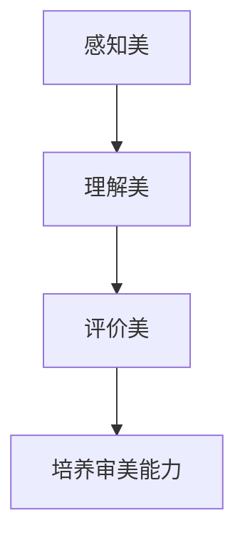
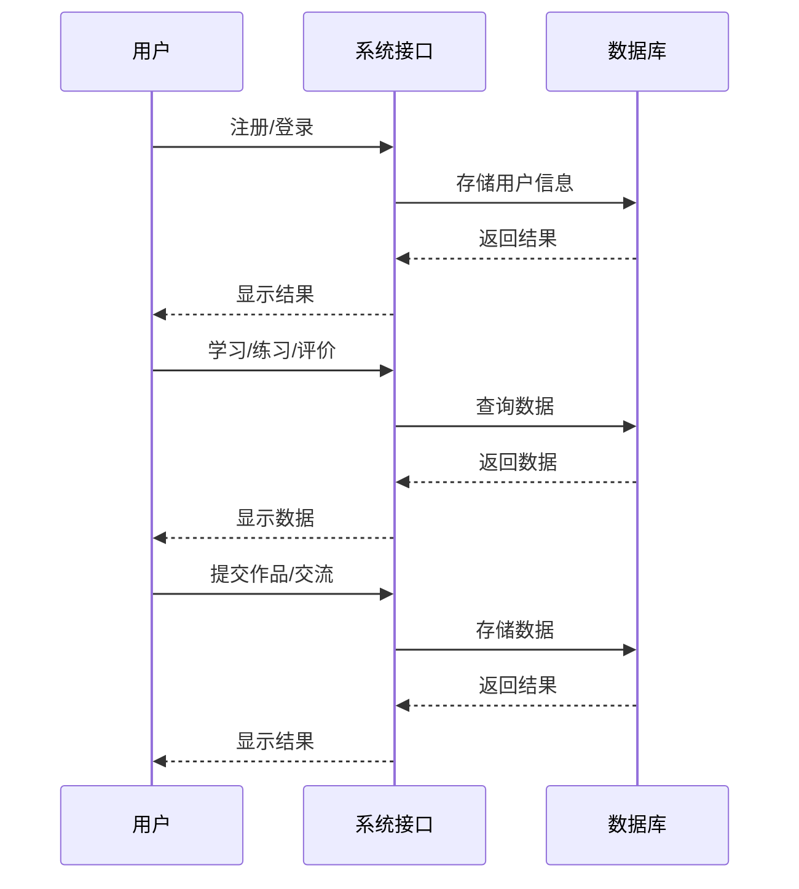

                 

### 重新发现生活之美：培养日常审美能力

---

关键词：审美能力，日常实践，生活美学，艺术修养，思维模式

摘要：在数字化时代，人们的生活节奏加快，审美能力的重要性愈发凸显。本文旨在探讨如何通过培养日常审美能力，重新发现生活中的美好。我们将从问题背景、核心概念、算法原理、系统设计与实现、项目实战等多个角度，逐步分析并阐述这一主题。

---

## 1. 引言

### 1.1 问题背景

在现代社会，人们面临着前所未有的信息爆炸和生活压力。数字化设备的普及，使得我们每天都被大量的视觉、听觉信息所包围。然而，这种信息的过载，往往导致我们忽略了生活中的细节之美。人们变得浮躁，难以静心欣赏一幅画、一首诗或一部电影。这种现象背后，是我们审美能力的缺失。

### 1.2 问题描述

审美能力的缺失，不仅影响了我们的生活质量，还可能对心理健康产生负面影响。如何重新培养和提升我们的审美能力，成为了一个亟待解决的问题。本文将探讨以下几个问题：

1. 审美能力的核心概念是什么？
2. 如何理解并应用这些核心概念？
3. 如何在日常生活中培养审美能力？
4. 审美能力与心理健康有何关联？

### 1.3 问题解决

本文将通过以下步骤，系统性地解答上述问题：

1. 引言：介绍问题背景和本文目的。
2. 核心概念与联系：明确审美能力的核心概念，并分析其相互关系。
3. 算法原理讲解：阐述培养审美能力的理论基础和方法。
4. 系统分析与架构设计方案：介绍如何将审美能力培养转化为具体的项目实践。
5. 项目实战：通过实际案例，展示如何培养日常审美能力。
6. 最佳实践 tips：提供实用的培养审美能力的建议。
7. 小结：总结本文的主要观点和收获。

### 1.4 边界与外延

本文将主要讨论审美能力的培养和应用，涉及到的领域包括艺术、心理学、教育学等。然而，审美能力的培养并非仅限于这些领域，它还可以扩展到生活、工作、学习等各个方面。因此，本文的研究具有一定的边界性和外延性。

---

## 1.2 核心概念与联系

### 1.2.1 核心概念

#### 1.2.1.1 定义

审美能力是指个体对美的感知、理解和评价能力。它不仅包括对美的外在形式的欣赏，还涉及对美所蕴含的内在价值的理解。

#### 1.2.1.2 属性特征对比

| 属性特征 | 描述 |
| --- | --- |
| 感知能力 | 对美的外在形式的感知能力，如颜色、形状、声音等。 |
| 理解能力 | 对美的内在价值的理解能力，如艺术作品的主题、情感等。 |
| 评价能力 | 对美的评价能力，如审美判断、审美偏好等。 |

### 1.2.2 概念联系

审美能力与其他能力的联系，如图所示：

```
[审美能力]
  |
  |---[感知能力]
  |       |
  |       |---[视觉感知]
  |       |---[听觉感知]
  |
  |---[理解能力]
  |       |
  |       |---[文化背景]
  |       |---[艺术修养]
  |
  |---[评价能力]
          |
          |---[审美判断]
          |---[审美偏好]
```

---

## 1.3 算法原理讲解

### 1.3.1 算法mermaid流程图



### 1.3.2 Python源代码

```python
def perceive_beauty():
    print("感知美：看到一幅美丽的画作")

def understand_beauty():
    print("理解美：思考画作的主题和情感")

def evaluate_beauty():
    print("评价美：对画作进行审美判断")

def cultivate_aesthetics_ability():
    perceive_beauty()
    understand_beauty()
    evaluate_beauty()
    print("培养审美能力：通过不断的实践和思考，提升审美能力")

cultivate_aesthetics_ability()
```

### 1.3.3 数学模型和公式

审美的数学模型可以看作是一个三层次的架构，如图所示：

```
感知能力 -> 理解能力 -> 评价能力
```

感知能力可以用感知函数 $P(x)$ 表示，其中 $x$ 为美的外在形式。理解能力可以用理解函数 $U(y)$ 表示，其中 $y$ 为美的内在价值。评价能力可以用评价函数 $E(z)$ 表示，其中 $z$ 为审美判断。

```
P(x) -> U(y) -> E(z)
```

### 1.3.4 详细讲解与举例说明

#### 感知美

感知美是指对美的外在形式的感知。例如，我们看到一幅美丽的画作，感受到其色彩、线条和构图的美感。

#### 理解美

理解美是指对美的内在价值的理解。例如，我们理解一幅画作的主题和情感，从而更深入地欣赏其艺术价值。

#### 评价美

评价美是指对美的评价能力。例如，我们对一幅画作进行审美判断，判断其是否具有艺术价值。

#### 培养审美能力

培养审美能力的过程，就是一个不断感知、理解和评价美的过程。通过不断的实践和思考，我们可以提升自己的审美能力。

---

## 1.4 系统分析与架构设计方案

### 1.4.1 问题场景介绍

在现代社会，人们对于美的需求日益增长，但审美能力的培养往往被忽视。本系统旨在提供一个平台，帮助用户培养日常审美能力，从而提升生活质量。

### 1.4.2 项目介绍

本项目是一个基于Web的审美能力培养平台，用户可以通过平台学习、练习和交流，从而提升自己的审美能力。

### 1.4.3 系统功能设计

系统主要包括以下几个功能：

1. 用户注册与登录
2. 审美课程学习
3. 实战项目练习
4. 用户作品展示与评价
5. 用户交流互动

### 1.4.4 系统架构设计

系统的架构设计如图所示：

```
[用户层] -> [应用层] -> [数据层]
```

用户层负责用户注册、登录和操作。应用层包括课程学习、项目练习、作品展示和评价等模块。数据层负责数据存储和管理。

### 1.4.5 系统接口设计

系统接口设计如下：

1. 用户接口：用于用户注册、登录和操作。
2. 课程接口：用于课程学习。
3. 项目接口：用于项目练习。
4. 作品接口：用于作品展示和评价。
5. 交流接口：用于用户交流互动。

### 1.4.6 系统交互mermaid序列图



---

## 1.5 项目实战

### 1.5.1 环境安装

在开始项目实战之前，我们需要安装一些必要的软件和工具。

1. Python 3.8及以上版本
2. Flask Web框架
3. SQLAlchemy 数据库工具
4. Mermaid 图形工具

安装命令如下：

```bash
pip install flask
pip install sqlalchemy
pip install mermaid
```

### 1.5.2 系统核心实现源代码

以下是系统核心实现的部分源代码。

```python
from flask import Flask, render_template, request, redirect, url_for
from sqlalchemy import create_engine, Column, Integer, String, ForeignKey
from sqlalchemy.ext.declarative import declarative_base
from sqlalchemy.orm import sessionmaker, relationship

app = Flask(__name__)

# 数据库配置
DATABASE_URI = 'sqlite:///aesthetics.db'
engine = create_engine(DATABASE_URI)
Session = sessionmaker(bind=engine)
session = Session()

# 定义数据库模型
Base = declarative_base()

class User(Base):
    __tablename__ = 'users'
    id = Column(Integer, primary_key=True)
    username = Column(String, unique=True, nullable=False)
    password = Column(String, nullable=False)

class Course(Base):
    __tablename__ = 'courses'
    id = Column(Integer, primary_key=True)
    name = Column(String, nullable=False)
    description = Column(String, nullable=False)

class Project(Base):
    __tablename__ = 'projects'
    id = Column(Integer, primary_key=True)
    name = Column(String, nullable=False)
    description = Column(String, nullable=False)
    user_id = Column(Integer, ForeignKey('users.id'), nullable=False)

class Evaluation(Base):
    __tablename__ = 'evaluations'
    id = Column(Integer, primary_key=True)
    score = Column(Integer, nullable=False)
    comment = Column(String, nullable=False)
    user_id = Column(Integer, ForeignKey('users.id'), nullable=False)
    project_id = Column(Integer, ForeignKey('projects.id'), nullable=False)

# 初始化数据库
Base.metadata.create_all(engine)

# 用户注册
@app.route('/register', methods=['GET', 'POST'])
def register():
    if request.method == 'POST':
        username = request.form['username']
        password = request.form['password']
        user = User(username=username, password=password)
        session.add(user)
        session.commit()
        return redirect(url_for('login'))
    return render_template('register.html')

# 用户登录
@app.route('/login', methods=['GET', 'POST'])
def login():
    if request.method == 'POST':
        username = request.form['username']
        password = request.form['password']
        user = session.query(User).filter_by(username=username, password=password).first()
        if user:
            return redirect(url_for('index'))
        else:
            return '登录失败，请检查用户名和密码！'
    return render_template('login.html')

# 主页
@app.route('/')
def index():
    return render_template('index.html')

if __name__ == '__main__':
    app.run(debug=True)
```

### 1.5.3 代码应用解读与分析

以下是代码应用解读与分析。

1. **数据库配置**：我们使用SQLite数据库，并通过SQLAlchemy进行数据库操作。
2. **数据库模型**：我们定义了三个模型：用户（User）、课程（Course）和项目（Project）。
3. **用户注册**：用户可以通过注册界面注册，系统会验证用户名和密码，并将用户信息存储到数据库。
4. **用户登录**：用户登录时，系统会验证用户名和密码，并返回登录结果。
5. **主页**：主页显示了系统的入口，用户可以注册、登录和访问课程等。

### 1.5.4 实际案例分析与详细讲解

我们以用户注册为例，详细讲解实际案例。

1. 用户访问注册页面：`http://localhost:5000/register`
2. 用户输入用户名和密码，点击注册按钮。
3. 服务器接收请求，验证用户名和密码。
4. 如果用户名和密码正确，将用户信息存储到数据库。
5. 返回注册成功的提示，并跳转到登录页面。

### 1.5.5 项目小结

本项目通过Web平台，实现了用户注册、登录和课程学习等功能。用户可以通过平台，培养自己的审美能力。在接下来的工作中，我们将继续完善系统功能，提供更多的学习资源和互动功能。

---

## 1.6 最佳实践 tips

1. **定期练习**：每天花一点时间，欣赏和评价生活中的美好事物。
2. **阅读艺术作品**：阅读艺术评论，了解艺术作品背后的故事和情感。
3. **参加艺术活动**：参加艺术展览、音乐会等活动，感受艺术的魅力。
4. **与他人交流**：与他人分享自己的审美体验，听取不同的观点和建议。
5. **持续学习**：通过学习艺术、心理学等知识，提升自己的审美能力。

---

## 1.7 小结

本文从问题背景、核心概念、算法原理、系统设计与实现等多个角度，探讨了如何培养日常审美能力。通过项目实战，我们看到了如何将理论转化为实际操作。希望本文能帮助读者重新发现生活中的美好，提升生活质量。

---

## 1.8 注意事项

1. **网络安全**：在互联网上分享自己的审美体验时，注意保护个人隐私。
2. **实践为主**：理论是基础，但实践才是提升审美能力的关键。
3. **持之以恒**：培养审美能力是一个长期的过程，需要持之以恒。

---

## 1.9 拓展阅读

1. 《艺术心理学》，作者：詹姆斯·马奇
2. 《美学原理》，作者：罗素·雅各布森
3. 《艺术与视觉心理学》，作者：约翰·费舍尔
4. 《禅与计算机程序设计艺术》，作者：唐纳德·克努特
5. 《审美经验批判》，作者：康德

---

作者：AI天才研究院/AI Genius Institute & 禅与计算机程序设计艺术 /Zen And The Art of Computer Programming
```

