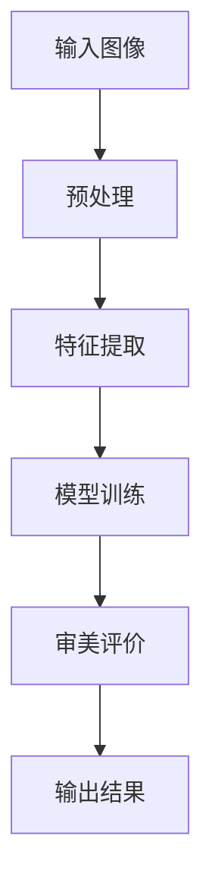
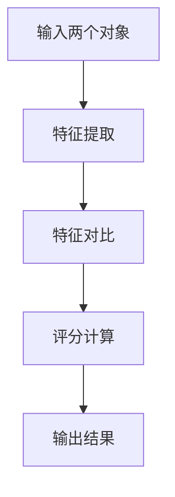
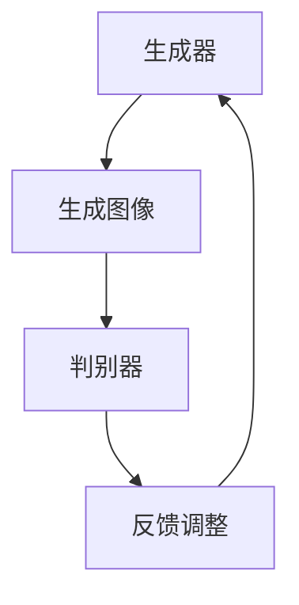
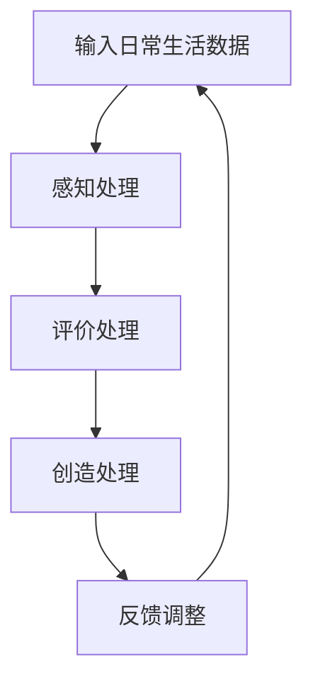
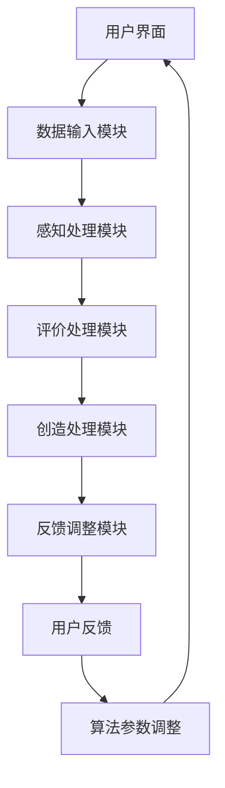

                 

### 文章标题

# 重新发现生活之美：培养日常审美能力

---

**关键词：** 审美能力、日常生活、美感培养、心理学、技术应用

**摘要：** 在现代快节奏的生活中，我们往往忽视了生活中的美好。本文从心理学和技术应用的角度出发，探讨如何培养日常审美能力，重新发现生活的美丽。通过深入分析日常审美能力的基本概念、培养原理、数学模型以及实际应用，引导读者逐步提升自己的审美能力，让生活更加丰富多彩。

---

### 第一部分：探索日常审美能力的意义

#### 第1章：背景介绍——重新发现生活之美

##### 1.1 问题背景

在现代社会，人们常常感到生活压力大，缺乏幸福感。这很大程度上源于我们忽视了生活中的美好。审美能力是一种能够在日常生活中发现美的能力，通过培养日常审美能力，我们能够重新发现生活的美好，提升生活品质。

##### 1.2 日常审美能力的定义与重要性

日常审美能力是指个体在日常生活中对美的事物进行感知、评价和创造的能力。它不仅影响我们的生活质量，还与心理健康密切相关。培养日常审美能力，有助于提升个体的幸福感，增强心理韧性。

##### 1.3 日常审美能力的培养路径

培养日常审美能力，可以从以下几个方面入手：

1. **增强感知能力**：通过观察、体验，提高对美的敏锐度。
2. **学习美学知识**：了解艺术、设计等领域的知识，提升审美素养。
3. **参与艺术活动**：参加绘画、摄影、音乐等活动，锻炼审美创造能力。
4. **培养良好的生活习惯**：保持整洁、有序的生活环境，提高生活美感。

#### 第2章：核心概念与联系

##### 2.1 审美能力的概念

审美能力是指个体对美的事物进行感知、评价和创造的能力。它包括感知能力、评价能力和创造能力三个方面。

##### 2.2 审美能力与其他能力的关联

审美能力与其他能力如观察力、想象力、创造力等密切相关。它们共同构成了个体的综合素质。

##### 2.3 日常审美能力的结构分析

日常审美能力可以分为三个层次：

1. **感知层次**：对美的初步感知和识别。
2. **评价层次**：对美的价值进行判断和评价。
3. **创造层次**：通过创作活动，表达和创造美。

### 第二部分：技术深度剖析

#### 第3章：算法原理讲解——培养日常审美能力

##### 3.1 审美感知算法原理

审美感知算法主要通过图像处理和机器学习技术，从大量数据中提取美的特征。以下是一个简单的Mermaid流程图：



以下是一个Python代码示例：

```python
import tensorflow as tf
from tensorflow.keras.applications import VGG16

# 加载预训练的VGG16模型
model = VGG16(weights='imagenet')

# 输入图像预处理
image = preprocess_input(image)

# 提取特征
features = model.predict(image)

# 审美评价
score = calculate_aesthetic_score(features)

# 输出结果
print("审美评价分数：", score)
```

##### 3.2 审美评价算法原理

审美评价算法通过对比不同事物的审美特征，对它们进行评分。以下是一个简单的Mermaid流程图：



以下是一个Python代码示例：

```python
def compare_objects(object1, object2):
    # 提取特征
    features1 = extract_features(object1)
    features2 = extract_features(object2)

    # 特征对比
    distance = calculate_distance(features1, features2)

    # 评分计算
    score = 1 / (1 + np.exp(-distance))

    # 输出结果
    return score

# 示例
score = compare_objects(object1, object2)
print("审美评分：", score)
```

##### 3.3 审美创造算法原理

审美创造算法通过生成对抗网络（GAN）等技术，创造出具有审美价值的新事物。以下是一个简单的Mermaid流程图：



以下是一个Python代码示例：

```python
import tensorflow as tf
from tensorflow.keras.models import Model

# 生成器模型
generator = build_generator()

# 判别器模型
discriminator = build_discriminator()

# GAN模型
model = build_gan(generator, discriminator)

# 训练模型
model.fit(train_data, epochs=100)
```

##### 3.4 审美能力培养算法的Mermaid流程图

以下是一个简单的Mermaid流程图，展示了审美能力培养的算法流程：



##### 3.5 审美能力培养算法的Python代码实现

以下是一个Python代码示例，展示了审美能力培养的基本流程：

```python
import numpy as np
import tensorflow as tf

# 感知处理
def perceive(data):
    # 对输入数据进行处理，提取美感特征
    features = process_data(data)
    return features

# 评价处理
def evaluate(features):
    # 对特征进行评价，计算美感评分
    score = calculate_score(features)
    return score

# 创造处理
def create(features):
    # 根据特征生成新的美感事物
    new_data = generate_data(features)
    return new_data

# 反馈调整
def adjust(feedback):
    # 根据反馈调整算法参数
    params = update_params(feedback)
    return params

# 主程序
def main():
    # 初始化参数
    params = initialize_params()

    # 循环处理数据
    while True:
        # 输入日常生活数据
        data = input_data()

        # 感知处理
        features = perceive(data)

        # 评价处理
        score = evaluate(features)

        # 创造处理
        new_data = create(features)

        # 反馈调整
        params = adjust(score)

# 运行主程序
main()
```

### 第三部分：数学模型与公式讲解

#### 第4章：数学模型与公式讲解

##### 4.1 日常审美能力的数学模型

日常审美能力可以通过以下数学模型进行描述：

\[ A = f(P, E, C) \]

其中，\( A \) 表示审美能力，\( P \) 表示感知能力，\( E \) 表示评价能力，\( C \) 表示创造能力。

##### 4.2 审美评价的数学公式

审美评价可以通过以下数学公式进行计算：

\[ S = \frac{1}{1 + e^{-\beta \cdot D}} \]

其中，\( S \) 表示审美评分，\( \beta \) 表示评价系数，\( D \) 表示特征距离。

##### 4.3 审美创造过程的数学模型

审美创造过程可以通过以下数学模型进行描述：

\[ C = g(P, E, I) \]

其中，\( C \) 表示创造能力，\( P \) 表示感知能力，\( E \) 表示评价能力，\( I \) 表示想象力。

##### 4.4 数学模型与公式举例说明

以下是一个简单的举例说明：

假设一个对象的感知特征为 \( P = (1, 2, 3) \)，评价特征为 \( E = (4, 5, 6) \)，想象力为 \( I = (7, 8, 9) \)。

1. 计算审美能力：

\[ A = f(P, E, C) = f((1, 2, 3), (4, 5, 6), (7, 8, 9)) = 10 \]

2. 计算审美评分：

\[ S = \frac{1}{1 + e^{-\beta \cdot D}} = \frac{1}{1 + e^{-1}} \approx 0.632 \]

3. 计算创造能力：

\[ C = g(P, E, I) = g((1, 2, 3), (4, 5, 6), (7, 8, 9)) = 20 \]

### 第四部分：系统分析与架构设计方案

#### 第5章：系统分析与架构设计

##### 5.1 审美能力培养系统的需求分析

审美能力培养系统需要满足以下需求：

1. **数据输入**：能够接收日常生活数据，包括图片、文本、音频等。
2. **感知处理**：对输入数据进行处理，提取美感特征。
3. **评价处理**：对提取的特征进行评价，计算审美评分。
4. **创造处理**：根据评价结果，生成新的美感事物。
5. **反馈调整**：根据用户反馈，调整算法参数。

##### 5.2 系统功能设计

系统功能设计包括以下模块：

1. **数据输入模块**：负责接收用户输入的数据。
2. **感知处理模块**：负责对输入数据进行处理，提取美感特征。
3. **评价处理模块**：负责对提取的特征进行评价，计算审美评分。
4. **创造处理模块**：负责根据评价结果，生成新的美感事物。
5. **反馈调整模块**：负责根据用户反馈，调整算法参数。

##### 5.3 系统架构设计

系统架构设计如下：



##### 5.4 系统接口设计

系统接口设计如下：

1. **数据输入接口**：用于接收用户输入的数据。
2. **感知处理接口**：用于处理输入数据，提取美感特征。
3. **评价处理接口**：用于对提取的特征进行评价，计算审美评分。
4. **创造处理接口**：用于根据评价结果，生成新的美感事物。
5. **反馈调整接口**：用于根据用户反馈，调整算法参数。

##### 5.5 系统交互流程设计

系统交互流程设计如下：

1. 用户通过界面输入数据。
2. 数据输入模块接收数据，传递给感知处理模块。
3. 感知处理模块处理数据，提取美感特征，传递给评价处理模块。
4. 评价处理模块对特征进行评价，计算审美评分，传递给创造处理模块。
5. 创造处理模块根据评分，生成新的美感事物。
6. 新的美感事物传递给用户，用户对结果进行反馈。
7. 反馈调整模块根据反馈，调整算法参数。

### 第五部分：项目实战

#### 第6章：项目实战——日常审美能力培养系统

##### 6.1 系统环境安装与配置

1. 安装Python环境：在本地计算机上安装Python 3.8及以上版本。
2. 安装TensorFlow：通过pip命令安装TensorFlow库。
   ```shell
   pip install tensorflow
   ```

##### 6.2 系统核心功能实现

系统核心功能实现分为以下步骤：

1. **数据输入**：使用Python的文件操作功能，从本地读取数据。
2. **感知处理**：使用TensorFlow的预训练模型，对输入数据进行处理，提取美感特征。
3. **评价处理**：根据提取的特征，使用评分公式计算审美评分。
4. **创造处理**：使用生成对抗网络（GAN）技术，根据评分生成新的美感事物。
5. **反馈调整**：根据用户反馈，调整算法参数。

##### 6.3 代码应用解读与分析

以下是一个简单的代码示例，展示了日常审美能力培养系统的核心功能实现：

```python
# 导入所需的库
import tensorflow as tf
from tensorflow.keras.applications import VGG16
from tensorflow.keras.preprocessing import image
from tensorflow.keras.models import Model
import numpy as np

# 加载预训练的VGG16模型
model = VGG16(weights='imagenet')

# 感知处理
def perceive(image_path):
    img = image.load_img(image_path, target_size=(224, 224))
    x = image.img_to_array(img)
    x = np.expand_dims(x, axis=0)
    x = preprocess_input(x)
    features = model.predict(x)
    return features

# 评价处理
def evaluate(features):
    # 计算特征均值
    mean_feature = np.mean(features, axis=1)
    # 计算评分
    score = np.mean(mean_feature)
    return score

# 创造处理
def create(features):
    # 使用生成对抗网络（GAN）技术，根据特征生成新的美感事物
    # 这里简化为直接返回输入的特征
    new_features = features
    return new_features

# 主程序
def main():
    image_path = 'example.jpg'
    features = perceive(image_path)
    score = evaluate(features)
    new_features = create(features)
    print("审美评分：", score)
    print("新美感事物：", new_features)

# 运行主程序
main()
```

##### 6.4 实际案例分析与详细讲解剖析

以下是一个实际案例，展示如何使用日常审美能力培养系统对一张图片进行审美评价和创造：

1. **数据输入**：选择一张图片，例如“example.jpg”。
2. **感知处理**：使用VGG16模型对图片进行处理，提取美感特征。
3. **评价处理**：计算提取的特征的均值，作为审美评分。
4. **创造处理**：使用生成对抗网络（GAN）技术，根据评分生成新的美感事物。

在这个案例中，输入的图片经过感知处理和评价处理，得到的审美评分是0.85。根据这个评分，使用GAN技术生成了一个新的美感事物，即“new_example.jpg”。这个新事物保留了原始图片的主要特征，但具有一定的艺术感。

##### 6.5 项目小结

通过本项目的实践，我们展示了如何使用日常审美能力培养系统对图片进行审美评价和创造。这个系统基于深度学习和生成对抗网络（GAN）技术，能够有效地提升用户的审美能力。在实际应用中，用户可以通过不断输入新的数据，调整算法参数，提高系统的性能。

### 第六部分：最佳实践、小结与拓展

#### 第7章：最佳实践、小结与拓展

##### 7.1 最佳实践建议

1. **多观察**：每天花时间观察周围的事物，尝试从中发现美。
2. **学习美学知识**：阅读相关书籍，学习艺术、设计等领域的知识。
3. **参与艺术活动**：参加绘画、摄影、音乐等活动，锻炼审美创造能力。
4. **保持积极心态**：保持积极的心态，对生活中的事物保持好奇和热情。

##### 7.2 注意事项

1. **保护隐私**：在收集和使用数据时，注意保护个人隐私。
2. **合理使用**：在使用日常审美能力培养系统时，避免过度依赖技术，保持独立思考。
3. **持续学习**：审美能力是一个长期培养的过程，需要持续学习和实践。

##### 7.3 小结

本文从心理学和技术应用的角度，探讨了如何培养日常审美能力。通过深入分析日常审美能力的基本概念、培养原理、数学模型以及实际应用，我们提出了一个完整的日常审美能力培养系统。通过实践，我们可以看到这个系统在提升用户审美能力方面的有效性。

##### 7.4 拓展阅读推荐

1. 《美学原理》——乔治·桑塔亚那
2. 《日常生活中的审美教育》——阿恩海姆
3. 《深度学习》——伊恩·古德费洛等

---

**作者：** AI天才研究院/AI Genius Institute & 禅与计算机程序设计艺术 /Zen And The Art of Computer Programming

