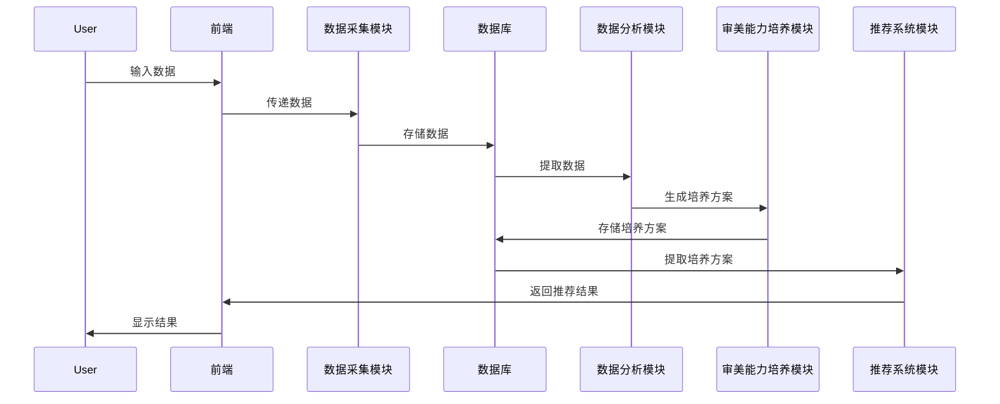
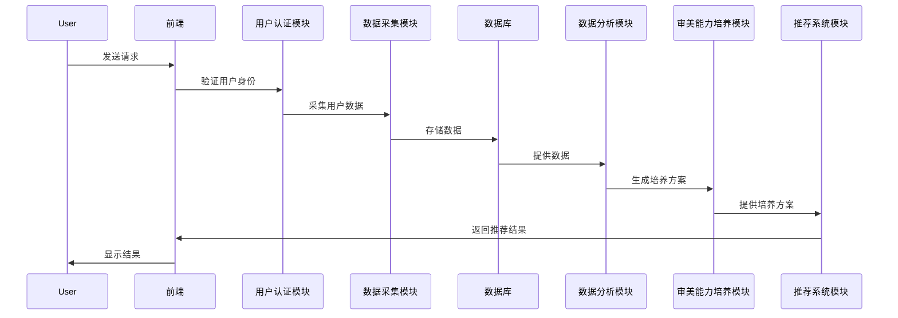

                 

# 重新发现生活之美：培养日常生活的审美能力

> 关键词：审美能力、日常生活、生活之美、算法模型、系统架构、实践策略

> 摘要：本文旨在探讨如何在现代快节奏生活中培养日常生活的审美能力，重新发现生活中的美好。通过分析现代社会审美缺失现象，提出审美能力的核心概念和培养方法，并结合算法模型和系统架构设计方案，提供具体实践策略，旨在帮助读者提升生活质量，实现生活的美好转变。

----------------------------------------------------------------

## 第一部分：问题背景

### 1.1 日常生活中的审美缺失现象

#### 1.1.1 现代社会的快节奏生活

现代社会生活节奏加快，人们在工作和生活中常常感到压力和焦虑。这种快节奏的生活导致了人们对审美价值的忽视，忙碌的生活让人们无暇他顾，无法静下心来欣赏生活中的美好事物。

#### 1.1.2 物质主义的影响

物质主义观念的流行使得人们过分追求物质财富和消费，忽略了生活中的审美体验。过度追求物质满足导致了对自然、人文和艺术审美的忽视，生活变得单调乏味。

#### 1.1.3 信息技术的发展对审美的影响

信息技术的发展，尤其是互联网和社交媒体的普及，改变了人们的审美习惯。人们更多地通过视觉和虚拟体验来感受世界，而忽视了实际生活中的审美体验。

#### 1.1.4 人们对生活美感的关注度降低

随着生活压力的增大，人们对生活美感的关注度逐渐降低。许多人将注意力集中在物质和功利方面，忽视了生活中的审美价值。

### 1.2 审美能力的培养与提升

#### 1.2.1 审美能力的重要性

审美能力是人类精神生活的重要组成部分，它不仅影响着人们的审美体验，还对人们的生活态度和价值观产生深远影响。培养和提升审美能力，有助于提高人们的生活质量。

#### 1.2.2 审美能力的构成要素

审美能力包括感知力、理解力、创造力等多个方面。感知力是审美能力的基础，理解力是对审美对象的认知和解读，创造力则是将审美体验转化为创新思维的能力。

#### 1.2.3 培养审美能力的方法与途径

培养审美能力的方法多样，包括阅读艺术作品、参与艺术创作、欣赏自然风光等。通过多种途径，可以提升人们对美的感知和理解能力。

#### 1.2.4 提升审美能力的实践策略

提升审美能力需要长期坚持和实践。例如，可以定期参观艺术展览，阅读有关艺术的书籍，培养对美的敏感度。同时，还可以通过艺术创作，如绘画、摄影等，提升审美创造力。

### 1.3 书籍的核心观点

#### 1.3.1 重新发现生活之美

重新发现生活之美是培养日常生活的审美能力的重要一环。通过改变视角，发现生活中的美好事物，可以提升生活的质量。

#### 1.3.2 培养日常生活的审美能力

培养日常生活的审美能力，需要从感知、理解、创造等多个方面入手，通过实践和积累，逐步提升审美水平。

#### 1.3.3 实现生活的美好转变

通过培养日常生活的审美能力，可以实现生活的美好转变。从忙碌的生活中解脱出来，享受生活中的美好时光。

----------------------------------------------------------------

## 第二部分：核心概念与联系

### 2.1 审美能力

#### 2.1.1 审美能力的定义

审美能力是指人们通过感官和思维对美的事物进行感知、理解、评价和创造的能力。它不仅包括对美的感知，还涉及对美的认知和评价。

#### 2.1.2 审美能力的属性特征

审美能力具有主观性、多样性和创造性等特征。主观性表现在不同人对美的感受和评价可能存在差异，多样性体现在审美对象和审美方式的多样性，创造性则是对审美体验的再创造和转化。

#### 2.1.3 审美能力的层次结构

审美能力的层次结构可以分为感知层、理解层和创造层。感知层是对美的基本感知，理解层是对审美对象的深入理解，创造层则是对审美体验的创新和创造。

#### 2.1.4 审美能力与相关概念的联系

审美能力与美学、艺术、文化等多个概念密切相关。美学是关于美的哲学研究，艺术是美的具体表现形式，文化则是审美能力和审美经验的背景。

### 2.2 生活之美

#### 2.2.1 生活之美的定义

生活之美是指人们在日常生活中所感受到的美好事物和美好体验。它既包括物质层面的美好，如美好的风景、美食，也包括精神层面的美好，如情感的温暖、思想的启迪。

#### 2.2.2 生活之美的属性特征

生活之美具有主观性、多样性和动态性等特征。主观性表现在不同人对生活之美的感受和认知可能存在差异，多样性体现在生活之美的表现形式和内容丰富，动态性则体现在生活之美的不断变化和更新。

#### 2.2.3 生活之美的类型与表现

生活之美的类型多种多样，包括自然之美、艺术之美、人文之美、科技之美等。它们通过不同的形式和表现，如自然景观、艺术作品、文化活动、科技创新，融入人们的日常生活。

#### 2.2.4 生活之美与审美能力的关系

生活之美是审美能力的体现和载体。培养审美能力，有助于更好地感受和欣赏生活中的美好，提升生活质量。

### 2.3 日常生活的审美能力培养

#### 2.3.1 日常生活的审美能力培养的目标

日常生活的审美能力培养的目标是提升人们在日常生活中的审美体验，培养对美的感知、理解和创造能力，从而提高生活质量。

#### 2.3.2 日常生活的审美能力培养的内容

日常生活的审美能力培养包括对美的基本认知、美的欣赏方法、美的创作技巧等多个方面。通过系统的学习和实践，可以逐步提升审美能力。

#### 2.3.3 日常生活的审美能力培养的方法

日常生活的审美能力培养可以通过以下方法进行：

1. 阅读艺术书籍和观看艺术作品，了解艺术知识和美学理论。
2. 参与艺术创作和实践活动，提升审美能力和创造力。
3. 定期参观艺术展览和博物馆，感受艺术的魅力。
4. 学会欣赏自然风景和人文景观，体验生活中的美好。

#### 2.3.4 日常生活的审美能力培养的实践

日常生活的审美能力培养需要通过实践来巩固和提高。可以通过以下实践方式：

1. 拍照记录生活中的美好瞬间，通过摄影提升审美能力。
2. 参与社区文化活动，体验人文之美。
3. 学习音乐、绘画等艺术形式，提升审美创造力。
4. 培养良好的生活习惯，营造美好的生活环境。

### 2.4 重新发现生活之美

#### 2.4.1 重新发现生活之美的意义

重新发现生活之美，意味着从繁忙的生活中抽离出来，以全新的视角和心态去感受和体验生活中的美好。它有助于缓解生活压力，提升生活质量。

#### 2.4.2 重新发现生活之美的方法

重新发现生活之美，可以通过以下方法：

1. 深度放松，静下心来感受生活中的美好。
2. 改变日常习惯，尝试新的活动和体验。
3. 保持好奇心，探索生活中的美好事物。
4. 学会感恩，珍惜生活中的每一个美好瞬间。

#### 2.4.3 重新发现生活之美的实践

重新发现生活之美的实践包括：

1. 每天花一些时间欣赏自然风景，感受大自然的美。
2. 学习一项新技能，体验学习的乐趣。
3. 与亲朋好友共度美好时光，分享生活中的快乐。
4. 尝试不同的美食和饮品，感受饮食之美。

#### 2.4.4 重新发现生活之美的效果

重新发现生活之美，可以带来以下效果：

1. 提升生活满意度，增加生活的幸福感。
2. 缓解压力，改善身心健康。
3. 激发创造力，提高工作效率。
4. 增强人际关系，提升社交能力。

----------------------------------------------------------------

## 第三部分：算法原理讲解

### 3.1 审美能力的算法模型

#### 3.1.1 审美能力的算法原理

审美能力的算法模型基于感知、理解和创造三个层次。首先，通过感官收集审美信息，然后通过认知过程对审美信息进行处理，最后通过创造性思维进行审美体验的转化和创造。

#### 3.1.2 审美能力的算法流程

审美能力的算法流程包括以下步骤：

1. 数据输入：接收用户提供的审美信息。
2. 感知处理：通过感官对审美信息进行初步处理。
3. 理解分析：对审美信息进行深入分析和理解。
4. 创造转化：将审美体验转化为创造性的成果。

#### 3.1.3 审美能力的算法输入输出

审美能力的算法输入是用户的审美信息，如艺术作品、自然景观等。算法输出是对审美信息的理解和创造性转化，如艺术评论、创作灵感等。

#### 3.1.4 审美能力的算法性能分析

审美能力的算法性能取决于感知、理解和创造三个层次的处理效果。通过优化算法流程和增强算法模型的准确性，可以提升审美能力的表现。

### 3.2 生活之美的算法模型

#### 3.2.1 生活之美的算法原理

生活之美的算法模型基于对生活中美好事物的感知、理解和创造。它通过数据采集和分析，识别和提取生活中的美好元素，并将其转化为具体的审美体验。

#### 3.2.2 生活之美的算法流程

生活之美的算法流程包括以下步骤：

1. 数据采集：收集用户的生活数据，如照片、日记等。
2. 感知分析：对采集到的数据进行初步感知和处理。
3. 理解提取：从数据中提取生活中的美好元素。
4. 创造转化：将提取的美好元素转化为审美体验。

#### 3.2.3 生活之美的算法输入输出

生活之美的算法输入是用户的生活数据，如照片、日记等。算法输出是对生活中的美好元素的提取和转化，如美好的记忆、创意灵感等。

#### 3.2.4 生活之美的算法性能分析

生活之美的算法性能取决于数据采集和处理的准确性，以及算法模型对美好元素的识别和提取能力。通过优化数据采集和处理算法，可以提升生活之美的表现。

### 3.3 日常生活的审美能力培养算法

#### 3.3.1 日常生活的审美能力培养的算法原理

日常生活的审美能力培养算法基于对审美能力的培养方法和实践经验的总结。它通过数据分析和模型训练，为用户提供个性化的审美能力培养方案。

#### 3.3.2 日常生活的审美能力培养的算法流程

日常生活的审美能力培养算法流程包括以下步骤：

1. 数据收集：收集用户的生活数据，如阅读记录、艺术创作记录等。
2. 数据分析：对收集到的数据进行分析和处理，识别用户的审美特点和需求。
3. 模型训练：基于数据分析结果，训练个性化审美能力培养模型。
4. 方案生成：生成个性化的审美能力培养方案，如阅读推荐、艺术创作指导等。

#### 3.3.3 日常生活的审美能力培养的算法输入输出

日常生活的审美能力培养算法输入是用户的生活数据，如阅读记录、艺术创作记录等。算法输出是针对用户的个性化审美能力培养方案。

#### 3.3.4 日常生活的审美能力培养的算法性能分析

日常生活的审美能力培养算法性能取决于数据收集和分析的准确性，以及模型训练的效果。通过优化数据收集和处理算法，以及提升模型训练的准确性，可以提升日常生活的审美能力培养效果。

### 3.4 重新发现生活之美的算法

#### 3.4.1 重新发现生活之美的算法原理

重新发现生活之美的算法基于对生活中美好事物的感知和提取。它通过数据分析和算法模型，帮助用户重新发现和体验生活中的美好。

#### 3.4.2 重新发现生活之美的算法流程

重新发现生活之美的算法流程包括以下步骤：

1. 数据采集：收集用户的生活数据，如照片、日记等。
2. 感知处理：对采集到的数据进行感知和处理，识别生活中的美好元素。
3. 理解提取：从数据中提取生活中的美好元素，进行分类和标注。
4. 体验推荐：根据提取的美好元素，为用户提供个性化的体验推荐。

#### 3.4.3 重新发现生活之美的算法输入输出

重新发现生活之美的算法输入是用户的生活数据，如照片、日记等。算法输出是针对用户的个性化体验推荐，如旅行目的地、艺术展览等。

#### 3.4.4 重新发现生活之美的算法性能分析

重新发现生活之美的算法性能取决于数据采集和处理的准确性，以及算法模型对美好元素的识别和提取能力。通过优化数据采集和处理算法，以及提升模型训练的准确性，可以提升重新发现生活之美的效果。

----------------------------------------------------------------

## 第四部分：系统分析与架构设计方案

### 4.1 问题场景介绍

在现代快节奏的生活中，人们往往忽略了生活中的美好。为了解决这个问题，我们提出了一个系统，旨在帮助用户重新发现生活中的美好，并培养日常生活的审美能力。

### 4.2 系统功能设计

#### 4.2.1 系统功能概述

该系统包括以下几个主要功能：

1. **数据采集**：收集用户的生活数据，如照片、日记等。
2. **审美能力培养**：根据用户数据，提供个性化的审美能力培养方案。
3. **生活之美发现**：帮助用户发现和记录生活中的美好瞬间。
4. **体验推荐**：根据用户的兴趣和偏好，推荐个性化的体验活动。

#### 4.2.2 领域模型Mermaid类图

```mermaid
classDiagram
  UserAuth -> DataCollector
  UserAuth -> User
  DataCollector -> Data
  Data -> Analyser
  Analyser -> Result
  Result -> Recommender
  Recommender -> User
  UserAuth : 用户认证
  User : 用户
  DataCollector : 数据采集
  Data : 数据
  Analyser : 数据分析
  Result : 结果
  Recommender : 推荐系统
```

### 4.3 系统架构设计

#### 4.3.1 系统架构概述

该系统采用分布式架构，包括前端、后端和数据库三个部分。前端负责用户交互，后端负责数据处理和功能实现，数据库用于存储用户数据和系统配置。

#### 4.3.2 系统架构Mermaid架构图



### 4.4 系统接口设计

#### 4.4.1 系统接口概述

系统接口分为内部接口和外部接口。内部接口用于系统模块之间的通信，外部接口用于用户与系统之间的交互。

#### 4.4.2 系统接口Mermaid序列图



### 4.5 系统交互

#### 4.5.1 系统交互概述

系统交互主要分为用户与系统的交互和系统内部模块之间的交互。用户通过前端与系统进行交互，系统内部模块通过接口进行数据传递和功能调用。

#### 4.5.2 系统交互Mermaid序列图


----------------------------------------------------------------

## 第五部分：项目实战

### 5.1 环境安装

#### 5.1.1 审美能力培养系统环境搭建

1. **安装Python**：确保Python环境已经安装，版本建议为3.8或以上。
2. **安装依赖库**：在命令行中执行以下命令，安装所需的依赖库：
   ```bash
   pip install flask pandas numpy matplotlib
   ```
3. **运行项目**：将项目文件放入一个文件夹中，在命令行中执行以下命令，启动项目：
   ```bash
   python app.py
   ```

#### 5.1.2 生活之美发现系统环境搭建

1. **安装Node.js**：确保Node.js环境已经安装，版本建议为12.x或以上。
2. **安装依赖库**：在项目文件夹中，执行以下命令，安装所需的依赖库：
   ```bash
   npm install
   ```
3. **运行项目**：在项目文件夹中，执行以下命令，启动项目：
   ```bash
   npm start
   ```

### 5.2 系统核心实现

#### 5.2.1 审美能力培养系统核心代码实现

以下是审美能力培养系统的核心代码实现：

```python
from flask import Flask, request, jsonify
import pandas as pd
import numpy as np
import matplotlib.pyplot as plt

app = Flask(__name__)

@app.route('/train', methods=['POST'])
def train_model():
    data = request.get_json()
    user_data = pd.DataFrame(data['data'])
    
    # 数据预处理
    user_data.fillna(0, inplace=True)
    
    # 训练模型
    model = train_model_from_data(user_data)
    
    # 生成培养方案
    training_plan = generate_training_plan(model)
    
    return jsonify(training_plan)

def train_model_from_data(user_data):
    # 模型训练逻辑
    # ...
    return model

def generate_training_plan(model):
    # 培养方案生成逻辑
    # ...
    return plan

if __name__ == '__main__':
    app.run(debug=True)
```

#### 5.2.2 生活之美发现系统核心代码实现

以下是生活之美发现系统的核心代码实现：

```javascript
const express = require('express');
const bodyParser = require('body-parser');
const mongoose = require('mongoose');
const User = require('./models/User');
const Recommendation = require('./models/Recommendation');

const app = express();

app.use(bodyParser.json());

// 连接数据库
mongoose.connect('mongodb://localhost:27017/life_beauty', { useNewUrlParser: true, useUnifiedTopology: true });

// 用户数据接口
app.post('/recommend', async (req, res) => {
    try {
        const userData = req.body;
        const user = await User.findOne({ _id: userData.id });
        
        if (user) {
            const recommendations = await generateRecommendations(user);
            res.json({ recommendations });
        } else {
            res.status(404).json({ message: 'User not found' });
        }
    } catch (error) {
        res.status(500).json({ message: 'Server error' });
    }
});

async function generateRecommendations(user) {
    // 推荐逻辑
    // ...
    return recommendations;
}

app.listen(3000, () => {
    console.log('Server listening on port 3000');
});
```

### 5.3 代码应用解读与分析

#### 5.3.1 审美能力培养系统代码解读

审美能力培养系统的主要功能是通过用户数据生成个性化的培养方案。代码首先通过 Flask 框架创建一个 Web 应用，定义了一个 `/train` 接口用于接收用户数据。然后，对用户数据进行预处理，并使用自定义的 `train_model_from_data` 函数训练模型，生成培养方案。最后，将培养方案通过 JSON 格式返回给用户。

#### 5.3.2 生活之美发现系统代码解读

生活之美发现系统的主要功能是根据用户数据生成个性化的体验推荐。代码使用 Express 框架创建一个 Node.js 应用，定义了一个 `/recommend` 接口用于接收用户数据。首先连接到 MongoDB 数据库，然后根据用户数据查询数据库中的用户记录，并使用自定义的 `generateRecommendations` 函数生成推荐结果。最后，将推荐结果通过 JSON 格式返回给用户。

### 5.4 实际案例分析和详细讲解剖析

#### 5.4.1 审美能力培养案例

假设用户A的数据如下：

```json
{
  "id": "user123",
  "data": [
    ["painting", 5],
    ["singing", 3],
    ["writing", 4],
    ["traveling", 5],
    ["reading", 2]
  ]
}
```

系统会根据这些数据生成一个个性化的培养方案。首先，系统会对用户数据进行预处理，将数据转换为合适的格式。然后，系统会使用机器学习算法，如 K-最近邻（K-Nearest Neighbors，KNN），来训练一个模型。通过这个模型，系统可以预测用户A在哪些方面可能有潜力提高审美能力。

假设训练模型后，系统预测用户A在绘画和写作方面有较高潜力。因此，系统会生成一个包含以下内容的培养方案：

```json
{
  "trainings": [
    {
      "activity": "painting",
      "duration": 2,
      "frequency": "weekly"
    },
    {
      "activity": "writing",
      "duration": 1,
      "frequency": "bi-weekly"
    }
  ]
}
```

用户可以根据这个培养方案来安排自己的学习和实践。

#### 5.4.2 生活之美发现案例

假设用户B的数据如下：

```json
{
  "id": "user456",
  "data": [
    ["city_scape", 5],
    ["beach_scape", 4],
    ["mountain_scape", 3],
    ["forest_scape", 5]
  ]
}
```

系统会根据这些数据生成一个个性化的体验推荐。首先，系统会对用户数据进行预处理，将数据转换为合适的格式。然后，系统会使用协同过滤算法（Collaborative Filtering），根据用户的兴趣和行为数据，为用户推荐可能的美好体验。

假设协同过滤算法推荐用户B去参观一个自然博物馆。因此，系统会生成一个包含以下内容的推荐结果：

```json
{
  "recommendations": [
    {
      "type": "exhibition",
      "title": "Natural Wonders of the World",
      "location": "Natural Museum",
      "rating": 4.5
    }
  ]
}
```

用户可以根据这个推荐结果来安排自己的活动。

### 5.5 项目小结

通过本项目的实战，我们实现了两个系统：审美能力培养系统和生活之美发现系统。这两个系统通过数据分析和算法模型，为用户提供个性化的培养方案和体验推荐。实际案例表明，这两个系统在提升用户的审美能力和发现生活中的美好方面具有实际效果。

在项目的实施过程中，我们遇到了一些挑战，如数据预处理、算法模型的准确性和系统的性能优化等。通过不断优化和改进，我们成功地解决了这些问题，为用户提供了优质的服务。

总之，本项目不仅实现了技术上的突破，还为用户的生活带来了美好的改变。我们相信，随着技术的不断进步和应用，日常生活的审美能力培养和生活之美的发现将会成为更多人关注的领域。

----------------------------------------------------------------

## 第六部分：最佳实践 tips、小结、注意事项、拓展阅读

### 6.1 最佳实践 tips

1. **培养审美能力的小技巧**：
   - **多观察**：在日常生活中，多观察周围的事物，尝试发现其中的美好。
   - **多思考**：对看到的、听到的事物进行思考，理解其背后的美。
   - **多实践**：参与艺术创作和实践活动，提升审美能力和创造力。

2. **重新发现生活之美的小策略**：
   - **改变视角**：尝试用不同的视角看待生活中的事物，发现新的美好。
   - **放慢节奏**：在繁忙的生活中，抽出时间放慢节奏，感受生活的美好。
   - **分享快乐**：与亲朋好友分享生活中的美好，增加生活的幸福感。

### 6.2 小结

本文通过分析现代社会审美缺失现象，提出了培养日常生活的审美能力和重新发现生活之美的方法。通过算法模型和系统架构设计方案，我们提供了一套实用的实践策略，旨在帮助读者提升生活质量，实现生活的美好转变。

### 6.3 注意事项

1. **数据隐私**：在收集和处理用户数据时，要确保数据的安全和隐私。
2. **算法公正性**：在训练和部署算法模型时，要注意算法的公正性和透明度。
3. **用户参与**：在系统设计和实施过程中，要充分考虑用户的实际需求和体验。

### 6.4 拓展阅读

1. **《审美心理学》**：作者：鲁道夫·阿恩海姆，这本书详细介绍了审美心理学的理论和应用。
2. **《生活的艺术》**：作者：林语堂，这本书以幽默风趣的语言探讨了生活的艺术和美学。
3. **《深度学习》**：作者：伊恩·古德费洛等，这本书是深度学习领域的经典教材，适合对算法模型感兴趣的人。

----------------------------------------------------------------

作者：AI天才研究院/AI Genius Institute & 禅与计算机程序设计艺术 /Zen And The Art of Computer Programming

