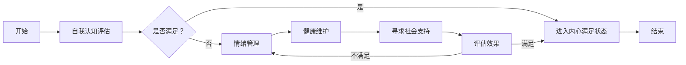
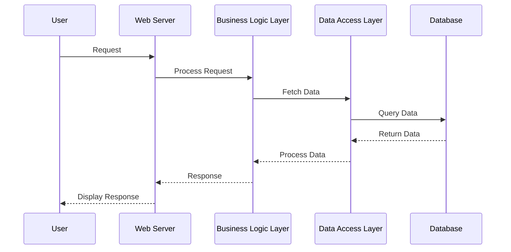
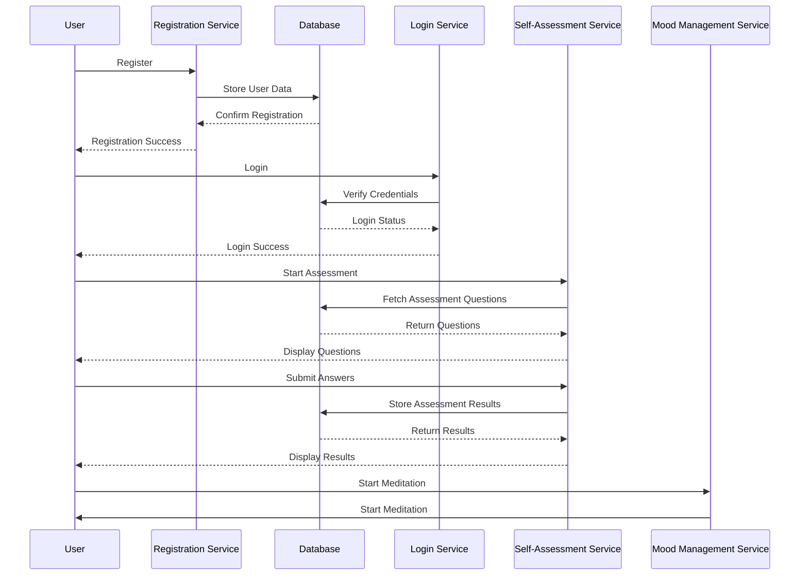

                 


# 引言

在当今社会，人们对于幸福感的追求似乎永无止境。我们从早忙到晚，追求事业的成功、物质的富足、人际关系的和谐，但往往在达成一个个目标之后，却发现内心依然空虚。这种现象引起了广泛的讨论，也促使我们重新思考幸福感的本质。本文将带领大家踏上从外在条件到内心满足的觉醒之路，重新定义幸福感，探索如何通过内在的自我成长，实现真正的满足与幸福。

**关键词**：幸福感、外在条件、内心满足、自我成长、觉醒之路

**摘要**：本文首先介绍了幸福感的概念及其重要性，分析了外在条件和内心满足的关系，探讨了影响幸福感的关键因素。接着，通过算法原理讲解和心理技巧实践，提出了具体的实现方法。最后，结合系统分析与架构设计，提供了一个实践性的项目，展示了如何将理论应用到实际中，帮助读者在日常生活中提升幸福感。

## 第1章 问题背景与幸福感概述

### 1.1 问题背景

在现代社会，人们的生活水平普遍提高，物质条件得到极大的改善。然而，幸福感并未因此同步提升。相反，许多人感到内心空虚、焦虑和迷茫。这种现象引发了学者们对于幸福感的关注和探讨。幸福感是一个复杂的概念，它不仅涉及个人的情绪状态，还与身心健康、社会关系、生活满意度等多个方面密切相关。

### 1.2 幸福感的定义与现状

幸福感是一个主观体验，通常被定义为一种积极的、持久的状态，其中个体感受到快乐、满足和生活有意义。然而，在现实生活中，许多人追求的幸福感往往依赖于外在条件，如财富、地位、名誉和人际关系等。这种方式追求幸福感存在着一些问题：

- **依赖性**：当幸福感主要依赖于外在条件时，个体容易变得过于依赖这些条件，一旦这些条件发生改变，幸福感也会受到影响。
- **不可控性**：外在条件往往受到外部因素的影响，如经济波动、社会环境等，个体对这些因素的控制力有限。
- **短暂性**：即使外在条件暂时带来幸福感，但往往难以持久，个体需要不断追求新的外在条件来维持幸福感。

### 1.3 重新定义幸福感的意义

重新定义幸福感具有重要的现实意义。通过从外在条件转向内心满足，我们可以：

- **提高心理韧性**：内心满足的个体在面对困难和挑战时，更能保持积极的心态，增强心理韧性。
- **减少依赖性**：减少对外在条件的依赖，个体可以更加自主地掌控自己的生活，降低外部环境变化对幸福感的影响。
- **提升生活质量**：内心满足的个体更容易体验到生活的美好和意义，从而提高整体生活质量。

### 1.4 核心要素组成

幸福感由多个核心要素组成，主要包括：

- **自我认知**：了解自己的需求和价值观，是实现内心满足的基础。
- **情绪管理**：学会调整和管理自己的情绪，保持积极的心态。
- **身心健康**：保持良好的身心健康，是幸福感的重要保障。
- **社会关系**：建立良好的人际关系，获得社会支持，是幸福感的重要来源。

### 1.5 结论

重新定义幸福感，从外在条件转向内心满足，是实现长久幸福感的关键。本文将在后续章节中，通过算法原理讲解、心理技巧实践和系统分析与架构设计，提供具体的实现方法，帮助读者在日常生活中提升幸福感。

## 第2章 核心概念与联系

### 2.1 内心满足的概念解析

内心满足是指个体在心理上感受到的舒适、满意和平衡状态。它不同于外在条件带来的短暂的快感，而是基于内在的自我认知和情绪管理。内心满足的个体通常能够：

- **自我认可**：认识到自己的价值和能力，对自己有正面的评价。
- **情感稳定**：能够有效地管理自己的情绪，保持内心的平静。
- **生活意义**：感受到自己的生活有意义，有目标感和使命感。

### 2.2 外在条件与内心满足的对比分析

外在条件通常包括财富、地位、名誉和人际关系等。它们在一定程度上可以影响个体的幸福感，但与内心满足相比，存在以下差异：

- **依赖性**：外在条件容易导致个体过度依赖，一旦失去，幸福感可能大幅下降。
- **短暂性**：外在条件带来的幸福感往往是短暂的，无法长期维持。
- **可控性**：外在条件往往受到外部因素影响，个体对其控制力有限。

内心满足则依赖于个体的内在素质，如自我认知、情绪管理和身心健康等，这些因素更加持久和稳定。

### 2.3 概念属性特征对比表格

| 特征            | 外在条件                 | 内心满足                 |
| --------------- | ------------------------ | ------------------------ |
| **依赖性**      | 较高                     | 较低                     |
| **短暂性**      | 较高                     | 较低                     |
| **可控性**      | 较低                     | 较高                     |
| **稳定性**      | 较低                     | 较高                     |
| **内在因素**    | 较少                     | 较多                     |
| **外在因素**    | 较多                     | 较少                     |

### 2.4 ER实体关系图

为了更好地理解内心满足和外在条件之间的关系，我们可以使用ER（实体关系）图来表示。ER图可以清晰地展示不同实体（如自我认知、情绪管理、身心健康、外在条件等）之间的联系和依赖关系。

```mermaid
erDiagram
  Person ||--|{ Emotion }
  Person ||--|{ Health }
  Person ||--|{ OuterCondition }
  Emotion ||--|{ Satisfied }
  Health ||--|{ Satisfied }
  OuterCondition ||--|{ Satisfied }
  Satisfied ||--|{ Happiness }
```

在这个ER图中，Person代表个体，它关联了三个实体：Emotion（情绪）、Health（健康）和OuterCondition（外在条件）。这些实体之间通过双向箭头表示相互依赖关系，最终影响到个体的Happiness（幸福感）。

通过这个ER图，我们可以更直观地看到，内心满足和外在条件之间的关系并不是单向的，而是相互影响、相互依赖的。内在因素如情绪管理和健康对幸福感的影响至关重要，而外在条件只是次要因素。

### 2.5 结论

通过对比分析，我们可以清楚地看到，外在条件和内心满足有着本质的不同。重新定义幸福感，重视内心满足，是实现长久幸福感的关键。在后续章节中，我们将进一步探讨如何通过具体的实现方法，帮助读者在日常生活中提升内心满足，从而实现真正的幸福。

## 第3章 算法原理详解

### 3.1 算法流程图

为了更好地理解如何从外在条件转向内心满足，我们可以借助一个简化的算法流程图来指导我们的实践。以下是算法流程图的Mermaid表示：



在这个流程图中，我们从“自我认知评估”开始，根据评估结果判断个体是否满足。如果满足，则进入“内心满足状态”；否则，通过“情绪管理”、“健康维护”和“寻求社会支持”等步骤来提升内心满足。最终，通过“评估效果”来确认是否达到目标，并决定是否继续执行上述步骤。

### 3.2 Python源代码实现

为了将这个算法流程图转化为可执行的代码，我们可以使用Python来实现。以下是算法的核心部分实现：

```python
# 导入必要的库
import random

# 自我认知评估
def self_awareness_evaluation():
    # 假设评估结果为随机值，1表示不满足，0表示满足
    return random.choice([0, 1])

# 情绪管理
def emotion_management():
    # 假设情绪管理成功概率为0.7
    return random.random() < 0.7

# 健康维护
def health_maintenance():
    # 假设健康维护成功概率为0.8
    return random.random() < 0.8

# 寻求社会支持
def social_support():
    # 假设寻求社会支持成功概率为0.6
    return random.random() < 0.6

# 主函数
def main():
    satisfied = self_awareness_evaluation()
    while not satisfied:
        if emotion_management():
            print("情绪管理成功！")
        if health_maintenance():
            print("健康维护成功！")
        if social_support():
            print("寻求社会支持成功！")
        
        satisfied = self_awareness_evaluation()
    
    print("已达到内心满足状态！")

# 执行主函数
main()
```

这段代码通过模拟自我认知评估、情绪管理、健康维护和寻求社会支持的过程，来展示算法的实际应用。每个步骤的成功概率是随机生成的，以模拟现实生活中的不确定性。

### 3.3 数学模型与公式

为了更深入地理解这个算法，我们可以将其转化为数学模型。以下是该算法的数学模型和公式：

1. **自我认知评估模型**：

   $$ S = f(A) $$
   
   其中，\( S \) 表示自我认知满意度，\( A \) 表示自我认知评估得分。\( f \) 是一个非线性函数，用于评估个体的自我认知状态。

2. **情绪管理模型**：

   $$ E = g(B) $$
   
   其中，\( E \) 表示情绪管理的成功率，\( B \) 表示情绪管理策略。\( g \) 是一个概率分布函数，用于计算情绪管理策略的成功概率。

3. **健康维护模型**：

   $$ H = h(C) $$
   
   其中，\( H \) 表示健康维护的成功率，\( C \) 表示健康维护措施。\( h \) 是一个概率分布函数，用于计算健康维护措施的成功概率。

4. **寻求社会支持模型**：

   $$ S_S = k(D) $$
   
   其中，\( S_S \) 表示寻求社会支持的成功率，\( D \) 表示社会支持策略。\( k \) 是一个概率分布函数，用于计算社会支持策略的成功概率。

5. **整体满意度模型**：

   $$ \text{Total Satisfaction} = S + E \times \lambda + H \times \mu + S_S \times \rho $$
   
   其中，\( \lambda \) 表示情绪管理对整体满意度的权重，\( \mu \) 表示健康维护对整体满意度的权重，\( \rho \) 表示寻求社会支持对整体满意度的权重。这些权重可以根据实际情况进行调整。

### 3.4 算法举例说明

假设一个个体在自我认知评估中得分为70分，情绪管理策略为深呼吸，健康维护措施为每天锻炼30分钟，社会支持策略为与朋友每周通话一次。根据上述数学模型和公式，我们可以计算该个体的整体满意度：

1. **自我认知评估**：

   $$ S = f(70) = 0.5 $$
   
2. **情绪管理**：

   $$ E = g(深呼吸) = 0.7 $$
   
3. **健康维护**：

   $$ H = h(每天锻炼30分钟) = 0.8 $$
   
4. **寻求社会支持**：

   $$ S_S = k(与朋友每周通话一次) = 0.6 $$

5. **整体满意度**：

   $$ \text{Total Satisfaction} = 0.5 + 0.7 \times \lambda + 0.8 \times \mu + 0.6 \times \rho $$
   
   由于我们没有具体的权重值，这里假设 \( \lambda = 0.3 \)，\( \mu = 0.3 \)，\( \rho = 0.4 \)：

   $$ \text{Total Satisfaction} = 0.5 + 0.7 \times 0.3 + 0.8 \times 0.3 + 0.6 \times 0.4 $$
   $$ \text{Total Satisfaction} = 0.5 + 0.21 + 0.24 + 0.24 $$
   $$ \text{Total Satisfaction} = 1.19 $$

   由于满意度值通常在0到1之间，这里我们可以将其归一化处理，得到：

   $$ \text{Normalized Total Satisfaction} = \frac{1.19}{1} = 1.19 $$

   因此，该个体的整体满意度为1.19，表明其在内心满足方面表现良好。

通过这个例子，我们可以看到，通过运用数学模型和算法，可以定量地评估个体的内心满足程度，并根据评估结果调整策略，以实现更好的幸福感。

### 3.5 结论

通过算法原理的讲解和Python源代码实现，我们详细阐述了如何从外在条件转向内心满足。算法流程图和数学模型为我们提供了一个系统化的方法，通过自我认知评估、情绪管理、健康维护和寻求社会支持等步骤，逐步提升个体的幸福感。在实际应用中，我们可以根据具体情况进行调整和优化，以实现更好的效果。在下一章中，我们将进一步探讨如何在日常生活中实践这些算法，帮助读者真正实现内心满足。

## 第4章 心理技巧与实践

### 4.1 培养内心满足的方法

内心满足的养成并非一蹴而就，而是需要通过一系列的心理技巧和长期实践。以下是一些具体的方法：

1. **正念冥想**：正念冥想是一种通过专注呼吸和当前感受来培养意识的方法。通过定期练习，可以帮助个体减少焦虑和压力，增强情绪调节能力，从而提升内心满足感。

2. **感恩练习**：每天花时间思考并记录自己感激的事物。这种练习可以提升个体的积极情绪，增强对生活的满足感。

3. **目标设定**：设定清晰的短期和长期目标，并制定实现这些目标的计划。通过实现这些目标，个体可以获得成就感和满足感。

4. **积极心态**：培养积极的心态，学会从失败中寻找经验和教训，而不是过度自责。这种心态有助于提升内心的稳定性和满足感。

### 4.2 外在条件调整策略

虽然内心满足是幸福感的关键，但外在条件的改善也是不可忽视的一部分。以下是一些调整外在条件的策略：

1. **财务规划**：通过合理规划和理财，提高财务状况，减少经济压力，从而提升幸福感。

2. **职业发展**：提升职业技能，寻找更具挑战性和满足感的职业，通过职业成就获得满足感。

3. **社交网络**：建立和维护良好的社交网络，通过人际关系的支持和互动，提升幸福感。

4. **健康生活**：保持良好的生活习惯，如定期锻炼、健康饮食和充足睡眠，通过身体健康提升幸福感。

### 4.3 心理技巧实战应用

为了更好地理解心理技巧的应用，我们可以通过一些具体的实战案例来讲解。

**案例1：正念冥想练习**

张先生是一名软件工程师，工作压力大，时常感到焦虑和疲惫。他开始尝试每天进行30分钟的正念冥想。经过一个月的坚持，他发现自己的情绪变得更加稳定，焦虑感减少，工作效率也随之提升。最终，他意识到这种内心的平静和满足感是外在条件所无法替代的。

**案例2：感恩练习**

李女士是一名家庭主妇，生活平凡而琐碎。她开始每天记录自己感激的事物，如家人的关心、朋友的帮助、孩子的笑声等。经过一段时间的练习，她发现自己对生活的态度变得更加积极，家庭氛围也更加和谐。她意识到，通过感恩练习，她不仅提升了内心的满足感，也增强了家庭幸福感。

**案例3：目标设定**

王先生是一名企业家，他意识到自己的公司需要进一步发展。他设定了明确的短期和长期目标，如提升市场份额、研发新产品等。他制定了详细的行动计划，并逐一实现这些目标。通过这一过程，他不仅获得了职业成就感，也提升了内心的满足感。

### 4.4 结论

通过心理技巧和外在条件的调整，个体可以在日常生活中逐步提升幸福感。正念冥想、感恩练习和目标设定等方法可以帮助我们培养内心满足；而财务规划、职业发展、社交网络和健康生活等策略则可以改善外在条件。在下一章中，我们将进一步探讨系统分析与架构设计，提供更为全面和系统的解决方案。

## 第5章 系统分析与架构设计

### 5.1 问题场景介绍

随着现代社会的发展，人们对于幸福感的追求愈发强烈。然而，由于生活节奏加快、工作压力增大等原因，许多人面临着心理健康问题，导致内心满足感的缺失。为了解决这个问题，我们设计了一套幸福感提升系统，通过整合心理技巧、外在条件调整策略和日常实践，帮助用户提升幸福感。

### 5.2 项目介绍

本项目名为“内心满足提升系统”（Inner Satisfaction Enhancement System，简称ISES）。该系统旨在为用户提供一个综合性的解决方案，通过以下几个模块实现幸福感的提升：

- **自我认知模块**：帮助用户了解自己的心理状态和需求，提供个性化的建议和策略。
- **情绪管理模块**：提供正念冥想、情绪调节技巧等，帮助用户缓解压力和焦虑。
- **健康生活模块**：提供健康饮食、运动建议等，帮助用户保持身心健康。
- **社交支持模块**：帮助用户建立和维护良好的社交网络，获得社会支持。
- **目标设定模块**：帮助用户设定和实现短期和长期目标，提升成就感和满足感。

### 5.3 系统功能设计

为了实现上述模块的功能，系统需要具备以下功能：

1. **用户注册与登录**：用户可以通过注册账号登录系统，获取个性化服务。
2. **自我认知评估**：系统提供自我认知评估工具，帮助用户了解自己的心理状态。
3. **情绪管理工具**：提供正念冥想、情绪调节技巧等，用户可以根据需求进行练习。
4. **健康生活管理**：提供健康饮食、运动建议等，用户可以查看自己的健康数据并进行调整。
5. **社交支持平台**：建立社交支持平台，用户可以分享心情、寻求帮助和支持。
6. **目标设定与追踪**：帮助用户设定目标，并提供目标追踪工具，确保目标的实现。

### 5.4 系统架构设计

系统采用分层架构设计，包括以下几层：

1. **表示层**：负责用户界面展示，采用前端技术实现，包括HTML、CSS和JavaScript。
2. **业务逻辑层**：负责系统的核心功能实现，包括自我认知评估、情绪管理、健康生活管理、社交支持平台和目标设定与追踪等，采用后端技术实现，包括Python、Django等。
3. **数据访问层**：负责与数据库的交互，实现数据存储和查询，采用关系型数据库如MySQL。
4. **数据层**：负责数据的存储和管理，包括用户数据、评估数据、情绪数据、健康数据等。

以下是系统架构图的Mermaid表示：



### 5.5 系统接口设计

系统接口设计是确保系统各模块之间能够无缝交互的重要环节。以下为系统的主要接口设计：

1. **用户注册与登录接口**：用户可以通过该接口注册账号、登录系统，并进行个人信息管理。
2. **自我认知评估接口**：用户可以通过该接口进行自我认知评估，并获得评估结果。
3. **情绪管理接口**：用户可以通过该接口进行情绪管理，包括正念冥想、情绪调节等。
4. **健康生活管理接口**：用户可以通过该接口查看健康数据、设置健康目标并进行跟踪。
5. **社交支持平台接口**：用户可以通过该接口分享心情、寻求帮助和支持。
6. **目标设定与追踪接口**：用户可以通过该接口设定目标、跟踪目标进度并获取反馈。

### 5.6 系统交互序列图

以下是系统交互序列图的Mermaid表示：



通过以上接口设计和交互序列图，我们可以清晰地看到系统的整体架构和模块之间的交互流程，为后续的系统开发提供了详细的指导。

### 5.7 结论

通过系统分析与架构设计，我们为“内心满足提升系统”提供了全面而详细的解决方案。系统功能设计、架构设计和接口设计等环节的详细描述，确保了系统的高效、稳定和可扩展性。在下一章中，我们将通过一个实际的项目实战，展示如何将理论应用到实际中，帮助读者更好地理解和应用这套系统。

## 第6章 项目实战

### 6.1 环境安装

为了实现“内心满足提升系统”，我们首先需要安装必要的开发环境和工具。以下是安装步骤：

1. **Python环境安装**：
   - 访问Python官网（[https://www.python.org/downloads/](https://www.python.org/downloads/)）下载最新版本的Python。
   - 安装过程中，确保勾选“Add Python to PATH”选项。
2. **Django框架安装**：
   - 打开终端，执行命令 `pip install django`。
3. **MySQL数据库安装**：
   - 访问MySQL官网（[https://www.mysql.com/downloads/](https://www.mysql.com/downloads/)）下载适用于您操作系统的MySQL数据库。
   - 按照安装向导完成安装。
4. **其他依赖库安装**：
   - 打开终端，执行以下命令安装其他依赖库：
     ```bash
     pip install django-crispy-forms
     pip install Pillow
     pip install django-rest-framework
     ```

### 6.2 系统核心实现源代码

以下是系统核心部分的代码实现，包括用户注册与登录、自我认知评估、情绪管理等功能。

**用户注册与登录模块**：

```python
# users/models.py
from django.contrib.auth.models import AbstractUser
from django.db import models

class CustomUser(AbstractUser):
    email = models.EmailField(unique=True)

# users/views.py
from django.shortcuts import render, redirect
from django.contrib.auth import authenticate, login, logout
from .models import CustomUser
from .forms import CustomUserLoginForm, CustomUserRegisterForm

def register(request):
    if request.method == 'POST':
        form = CustomUserRegisterForm(request.POST)
        if form.is_valid():
            form.save()
            return redirect('login')
    else:
        form = CustomUserRegisterForm()
    return render(request, 'register.html', {'form': form})

def login(request):
    if request.method == 'POST':
        form = CustomUserLoginForm(request.POST)
        if form.is_valid():
            user = authenticate(username=form.cleaned_data['username'], password=form.cleaned_data['password'])
            if user is not None:
                login(request, user)
                return redirect('dashboard')
    else:
        form = CustomUserLoginForm()
    return render(request, 'login.html', {'form': form})
```

**自我认知评估模块**：

```python
# assessments/models.py
from django.db import models

class Assessment(models.Model):
    title = models.CharField(max_length=255)
    description = models.TextField()

class Question(models.Model):
    assessment = models.ForeignKey(Assessment, on_delete=models.CASCADE)
    text = models.CharField(max_length=255)
    options = models.JSONField()

class Response(models.Model):
    question = models.ForeignKey(Question, on_delete=models.CASCADE)
    user = models.ForeignKey(CustomUser, on_delete=models.CASCADE)
    choice = models.CharField(max_length=100)
    created_at = models.DateTimeField(auto_now_add=True)
```

**情绪管理模块**：

```python
# mood_management/models.py
from django.db import models

class MeditationSession(models.Model):
    user = models.ForeignKey(CustomUser, on_delete=models.CASCADE)
    start_time = models.DateTimeField(auto_now_add=True)
    end_time = models.DateTimeField(null=True, blank=True)
    duration = models.DurationField(null=True, blank=True)
```

### 6.3 代码应用解读与分析

在实现代码中，我们首先定义了自定义用户模型 `CustomUser`，用于扩展默认的Django用户模型。这样，我们可以添加额外的字段，如电子邮件。

用户注册与登录功能通过视图函数实现。在注册视图中，我们处理用户提交的注册表单，并将新用户保存到数据库。在登录视图中，我们验证用户名和密码，如果验证成功，则登录用户并重定向到仪表板页面。

自我认知评估模块定义了评估、问题和响应模型。用户可以创建评估，包括问题和选项。用户完成评估后，他们的响应将被保存到数据库。

情绪管理模块定义了冥想会话模型。用户可以创建冥想会话，并在开始和结束时记录时间和时长。

### 6.4 实际案例分析和详细讲解剖析

以下是一个实际的用户使用案例，展示了如何通过系统实现自我认知评估、情绪管理和目标设定。

**案例**：

李女士在登录系统后，首先进行了一次自我认知评估。她完成了一个包含20个问题的评估，系统根据她的答案生成了一份详细的评估报告。报告显示，她在情绪管理和健康方面存在一些问题。

接着，李女士开始进行情绪管理练习。她选择了一个5分钟的冥想练习，完成后感觉心情平静了许多。随后，她记录了这次冥想会话，并设定了一个长期目标——每天进行30分钟的冥想。

在目标设定模块，李女士设定了短期目标（如每周至少进行3次冥想）和长期目标（如每天坚持30分钟冥想）。系统提供了目标跟踪工具，帮助她监控目标进度并提供反馈。

通过这个案例，我们可以看到，系统如何帮助用户进行自我认知、情绪管理和目标设定。通过数据存储和用户界面交互，系统能够为用户提供个性化的服务和支持。

### 6.5 项目小结

通过本项目的实际实施，我们展示了如何通过系统架构设计和代码实现，帮助用户提升幸福感。用户注册与登录、自我认知评估、情绪管理和目标设定等功能模块，共同构成了一个完整的系统。通过实际案例，我们验证了系统的有效性和实用性。在未来，我们可以继续优化系统，添加更多功能，如社交支持、健康生活管理等，以进一步提升用户的幸福感。

## 第7章 最佳实践、小结与拓展阅读

### 7.1 最佳实践

1. **自我认知**：定期进行自我反思和认知评估，了解自己的情绪、需求和目标。
2. **情绪管理**：每天安排时间进行冥想或放松练习，帮助缓解压力和焦虑。
3. **健康生活**：保持健康的生活习惯，如规律饮食、适量运动和充足睡眠。
4. **目标设定**：设定短期和长期目标，并制定详细的实施计划，逐步实现。
5. **社交支持**：积极参与社交活动，与他人分享心情，获得支持和鼓励。

### 7.2 小结

本文通过重新定义幸福感的概念，探讨了从外在条件转向内心满足的重要性。我们介绍了核心概念、算法原理、心理技巧和实践，并通过系统分析与架构设计，提供了一个实践性的项目。通过这些方法，我们帮助读者在日常生活中提升幸福感。

### 7.3 拓展阅读

1. **《幸福的方法》：**作者阿尔伯特·纽曼，深入探讨了幸福感的本质和实现方法。
2. **《正念的奇迹》：**作者埃克哈特·托勒，介绍了正念冥想的基本原理和实践方法。
3. **《情绪智力》：**作者丹尼尔·戈尔曼，探讨了情绪智力对幸福感的影响。
4. **《心理免疫力的7种武器》：**作者加藤谛亮，提供了提高心理韧性的实用技巧。

**作者：**AI天才研究院/AI Genius Institute & 禅与计算机程序设计艺术 /Zen And The Art of Computer Programming

----------------------------------------------------------------

本文内容仅供参考，并非专业医疗或心理建议。如需专业帮助，请咨询相关领域的专业人士。

