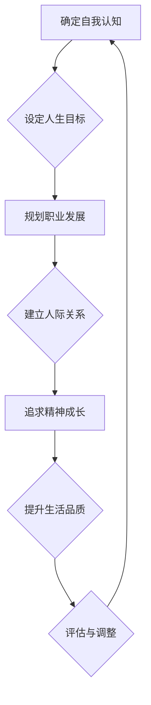
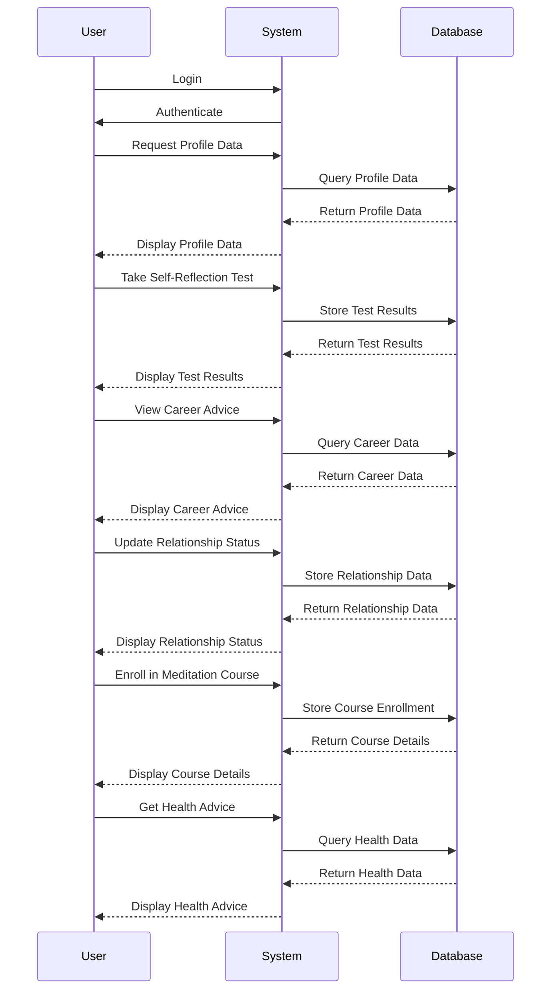

                 

### 文章标题

# 《重新定义成功：后工业时代的人生价值观》

### 关键词

- 后工业时代
- 人生价值观
- 成功定义
- 职业发展
- 精神追求
- 生活品质

### 摘要

本文从后工业时代的背景出发，重新审视和定义人生价值观。通过分析社会变革、自我认知、职业发展、人际关系以及精神追求等方面，探讨如何在新时代中找到新的成功模式，提升生活品质，实现个人与社会的和谐发展。本文旨在为读者提供有深度、有思考的指导，帮助他们在复杂多变的环境中找到属于自己的幸福之道。

### 目录

## 第一部分：后工业时代的社会变革

### 第1章：后工业时代的来临

#### 1.1 后工业时代的定义与特征

#### 1.2 后工业时代对社会的影响

#### 1.3 后工业时代对人生的挑战

### 第2章：重新审视人生价值观

#### 2.1 人生价值观的演变

#### 2.2 后工业时代的人生价值观

#### 2.3 重新定义成功：从物质到精神

## 第二部分：后工业时代的人生规划

### 第3章：自我认知与人生目标

#### 3.1 自我认知的重要性

#### 3.2 设定人生目标

#### 3.3 实现人生目标的策略

### 第4章：职业发展与人生价值

#### 4.1 后工业时代的职业特点

#### 4.2 职业发展与人生价值的融合

#### 4.3 创造价值的职业选择

### 第5章：人际关系的重建

#### 5.1 后工业时代的人际关系特点

#### 5.2 人际关系的重要性

#### 5.3 重建健康的人际关系

## 第三部分：后工业时代的精神生活

### 第6章：精神追求与心灵成长

#### 6.1 精神追求的重要性

#### 6.2 心灵成长的道路

#### 6.3 精神生活的平衡与和谐

### 第7章：生活品质的提升

#### 7.1 后工业时代的生活品质标准

#### 7.2 提升生活品质的方法

#### 7.3 生活品质与人生价值的关系

### 第8章：重新定义成功的人生模式

#### 8.1 成功的定义

#### 8.2 重新定义成功的人生模式

#### 8.3 实现成功的人生模式

### 第9章：后工业时代的启示与展望

#### 9.1 后工业时代的人生启示

#### 9.2 未来的人生发展趋势

#### 9.3 为未来做准备

## 结语

### 作者

- 作者：AI天才研究院/AI Genius Institute & 禅与计算机程序设计艺术 /Zen And The Art of Computer Programming### 重新定义成功：后工业时代的人生价值观

#### 引言

随着信息技术的飞速发展，人类社会正经历着前所未有的变革。后工业时代，这一新的社会阶段，给人们的生活、工作、价值观带来了新的挑战和机遇。传统的成功定义和人生价值观在后工业时代面临着重新审视和定义的需求。本文将深入探讨后工业时代的特征，分析其对人生价值观的影响，并尝试重新定义成功，以期为读者提供一种适应新时代的人生哲学。

#### 后工业时代的定义与特征

**定义**：后工业时代，也被称为信息时代，是继工业时代之后的一个发展阶段。在这一阶段，信息技术和知识经济成为主导力量，传统制造业和农业生产逐渐让位于服务业和知识产业。

**特征**：

1. **信息化与数字化**：信息技术广泛应用于社会各个领域，数据成为新的生产资料，数字化成为新的生活方式。
2. **知识经济**：知识成为经济增长的主要动力，创新和创造力成为企业和个人竞争的关键。
3. **全球化**：国际交流与合作日益频繁，全球化的趋势不可逆转。
4. **不确定性**：技术变革和市场需求变化迅速，不确定性成为常态。

#### 后工业时代对社会的影响

**对工作的影响**：工作的性质和形式发生了巨大变化。知识型工作取代了传统体力劳动，自我雇佣和远程办公成为新的工作模式。

**对教育的影响**：教育更加注重培养学生的创新能力和批判性思维，终身学习成为必要。

**对生活方式的影响**：数字化和互联网的普及改变了人们的消费习惯和社交方式，生活方式更加多样化和个性化。

#### 后工业时代对人生的挑战

**职业发展的挑战**：职业选择更加多样，但同时也面临职业寿命缩短、职业转换频繁的挑战。

**生活节奏的挑战**：信息过载和工作压力增加，需要更好地管理时间和情绪。

**价值观的挑战**：传统的成功标准在后工业时代受到质疑，人们需要重新思考什么才是真正重要的。

#### 重新审视人生价值观

**物质主义到精神主义的转变**：在工业时代，物质财富和地位是衡量成功的标准。而后工业时代，人们开始重视内心的满足和精神追求。

**自我实现的重要性**：马斯洛的需求层次理论指出，自我实现是人类的最高需求。在后工业时代，实现个人潜力、追求自我价值成为更重要的目标。

**可持续性的重要性**：随着环境问题的加剧，可持续发展成为全球关注的话题。人们开始重视如何在满足个人需求的同时，保护地球资源。

#### 重新定义成功

**多元化成功标准**：成功不再是单一的财富和地位，而是多元化的，包括健康、家庭、事业、个人成长等多个方面。

**过程导向**：成功不再仅仅是结果，而是过程中的成长和体验。

**个人价值**：成功的定义应该基于个人的价值观和目标，而不是社会的标准。

**社会贡献**：成功的最终目标是能够为他人和社会做出贡献，实现个人价值的同时，也为社会进步贡献力量。

#### 结论

后工业时代对人生价值观带来了深刻的变革。在这个时代，重新定义成功，关注自我实现、精神追求和可持续发展，将成为人们追求幸福和成功的新方向。通过审视和调整自己的价值观，每个人都可以找到属于自己的成功之路，实现个人与社会的和谐发展。

#### 参考文献

1. 丹尼尔·贝尔（Daniel Bell），《后工业社会的来临》。
2. 亚伯拉罕·马斯洛（Abraham Maslow），《人类动机理论》。
3. 恩格斯（Engels），《家庭、私有制和国家的起源》。

作者：AI天才研究院/AI Genius Institute & 禅与计算机程序设计艺术 /Zen And The Art of Computer Programming### 确定书的基本结构和主题

为了深入探讨后工业时代的人生价值观，本书将分为三个主要部分：社会变革、人生规划和精神生活。每个部分包含若干章节，具体内容如下：

**第一部分：后工业时代的社会变革**

- 第1章：后工业时代的来临
  - 探讨后工业时代的定义、特征及其对社会的深远影响。
- 第2章：重新审视人生价值观
  - 分析后工业时代对传统人生价值观的冲击，以及新的价值观如何形成。

**第二部分：后工业时代的人生规划**

- 第3章：自我认知与人生目标
  - 讨论自我认知的重要性，以及如何设定和实现人生目标。
- 第4章：职业发展与人生价值
  - 分析后工业时代职业特点，探讨如何将职业发展与个人价值相结合。
- 第5章：人际关系的重建
  - 探讨后工业时代人际关系的特点和重要性，以及如何建立健康的人际关系。

**第三部分：后工业时代的精神生活**

- 第6章：精神追求与心灵成长
  - 分析精神追求的重要性，以及如何实现心灵成长。
- 第7章：生活品质的提升
  - 探讨后工业时代的生活品质标准，以及如何提升生活品质。
- 第8章：重新定义成功的人生模式
  - 总结前述内容，重新定义成功，探讨如何在后工业时代实现成功的人生模式。
- 第9章：后工业时代的启示与展望
  - 提供对后工业时代人生的启示，展望未来的人生发展趋势。

通过这种结构，本书旨在帮助读者全面理解后工业时代的社会背景，重新审视和定义人生价值观，制定科学的人生规划，提升精神生活品质，从而实现个人与社会的和谐发展。

### 设计背景介绍部分

#### 问题背景

随着信息技术的飞速发展和全球化进程的加快，人类社会正经历着前所未有的变革。后工业时代，这一新的社会阶段，不仅改变了人们的工作方式和生活节奏，也对传统的价值观和人生目标提出了新的挑战。在这种背景下，重新审视和定义人生价值观变得尤为重要。

#### 问题描述

后工业时代的到来，带来了以下几个问题：

1. **职业不稳定**：随着技术的快速变革和市场的动态变化，传统的职业稳定性受到冲击，职业寿命缩短，职业转换频繁。
2. **生活节奏加快**：信息过载和工作压力增加，导致人们需要更好地管理时间和情绪，以维持身心健康。
3. **价值观冲突**：传统的物质主义成功观在后工业时代受到质疑，人们开始寻求更全面、更个性化的成功定义。
4. **人际关系复杂**：全球化的趋势使得人际关系更加复杂，如何建立和维护健康的人际关系成为一大挑战。

#### 问题解决

针对上述问题，本书将从以下几个方面寻求解决方案：

1. **自我认知与人生目标**：通过深入自我认知，设定科学的人生目标，帮助读者在不确定的职业环境中找到方向。
2. **职业发展与个人价值的结合**：探讨如何在后工业时代的职业特点下，实现个人价值与职业发展的有机结合。
3. **人际关系重建**：分析后工业时代的人际关系特点，提供建立健康人际关系的策略。
4. **精神追求与心灵成长**：强调精神追求的重要性，提供实现心灵成长的方法和路径。
5. **生活品质提升**：探讨如何在后工业时代提升生活品质，实现物质与精神的平衡。

#### 边界与外延

本书的研究边界主要涉及后工业时代的人生价值观及其应用，不涉及具体的技术问题和行业案例。外延方面，本书旨在为读者提供一个宏观的视角，帮助他们理解后工业时代的社会背景，以及如何在其中找到属于自己的成功之道。

### 概念结构与核心要素组成

#### 后工业时代

- **定义**：后工业时代，也称为信息时代，是继工业时代之后的一个发展阶段，以信息技术和知识经济为主导。
- **特征**：信息化与数字化、知识经济、全球化、不确定性。

#### 人生价值观

- **传统价值观**：物质财富和地位是衡量成功的标准。
- **后工业时代价值观**：自我实现、精神追求、可持续性。

#### 成功定义

- **多元化成功标准**：健康、家庭、事业、个人成长等多个方面。
- **过程导向**：重视过程中的成长和体验。
- **个人价值**：基于个人的价值观和目标。
- **社会贡献**：为他人和社会做出贡献。

### 概念属性特征对比表格

| 概念         | 特征一       | 特征二       | 特征三       |
| ------------ | ------------ | ------------ | ------------ |
| 后工业时代   | 信息化与数字化 | 知识经济     | 全球化       |
| 人生价值观   | 自我实现     | 精神追求     | 可持续性     |
| 成功定义     | 多元化成功标准 | 过程导向     | 个人价值     | 社会贡献     |

### ER实体关系图架构的 Mermaid 流程图

```mermaid
erDiagram
  Class1 ||--|{ Class2 }
  Class1 ||--|{ Class3 }
  Class2 ||--|{ Class4 }
```

上述ER实体关系图表示后工业时代的主要概念及其相互关系。`Class1` 代表后工业时代，`Class2` 代表人生价值观，`Class3` 代表成功定义，它们之间通过关系 `||--|{ ... }` 连接，表明它们之间的关联性。

### 总结

通过上述背景介绍，我们明确了后工业时代对社会的影响，以及重新定义人生价值观和成功的必要性。接下来，本书将逐步探讨如何在后工业时代找到适合自己的成功之路，包括自我认知、职业发展、人际关系、精神追求和生活品质的提升。这些章节将帮助读者全面理解后工业时代的人生哲学，找到属于自己的幸福之道。

### 核心概念与联系部分

#### 核心概念原理

在后工业时代，人生价值观的核心概念包括自我认知、职业发展、人际关系、精神追求和生活品质。这些概念相互联系，共同构成了新的成功定义。

1. **自我认知**：自我认知是指个体对自身性格、兴趣、能力和价值观的了解。它是制定人生目标和实现个人价值的基础。
   
   **原理**：通过自我反思和心理测试等方法，个体可以更好地了解自己的优势和不足，从而设定合适的人生目标。

2. **职业发展**：在后工业时代，职业发展不仅包括技能的提升，更注重个人价值的实现和职业的可持续性。

   **原理**：职业发展应与个人兴趣和价值观相结合，通过持续学习和创新，实现个人价值与职业发展的双赢。

3. **人际关系**：人际关系是社会生活中不可或缺的部分，健康的家庭、朋友和社交关系对个体的幸福和成功至关重要。

   **原理**：通过沟通、合作和共享，建立和维护健康的人际关系，有助于个人成长和社会稳定。

4. **精神追求**：精神追求是指个体在物质生活满足后，对内心满足和精神富足的追求。

   **原理**：精神追求可以提升个体的心灵层次，促进身心健康，增强应对压力的能力。

5. **生活品质**：生活品质是指个体在物质和精神方面的整体幸福感。

   **原理**：通过提升生活品质，个体可以获得更高的幸福感，实现生活与工作的平衡。

#### 概念属性特征对比表格

| 概念         | 特征一       | 特征二       | 特征三       |
| ------------ | ------------ | ------------ | ------------ |
| 自我认知     | 自我了解     | 自我反思     | 个性分析     |
| 职业发展     | 技能提升     | 个人价值     | 职业可持续性 |
| 人际关系     | 沟通合作     | 亲情友情     | 社会支持     |
| 精神追求     | 内心满足     | 精神富足     | 心灵成长     |
| 生活品质     | 物质满足     | 精神富足     | 生活平衡     |

#### ER实体关系图架构的 Mermaid 流程图

```mermaid
erDiagram
  自我认知 ||--|{ 职业发展 }
  自我认知 ||--|{ 人际关系 }
  自我认知 ||--|{ 精神追求 }
  自我认知 ||--|{ 生活品质 }
  职业发展 ||--|{ 人际关系 }
  职业发展 ||--|{ 精神追求 }
  职业发展 ||--|{ 生活品质 }
  人际关系 ||--|{ 精神追求 }
  人际关系 ||--|{ 生活品质 }
  精神追求 ||--|{ 生活品质 }
```

此图展示了核心概念之间的相互关系，表明自我认知、职业发展、人际关系、精神追求和生活品质是相互影响、相互促进的。

#### 总结

通过以上核心概念的介绍和特征对比表格，我们清晰地看到了后工业时代人生价值观的构成要素。接下来，我们将进一步探讨这些概念在后工业时代背景下的应用和实现策略，帮助读者重新定义成功，实现个人与社会的和谐发展。

### 算法原理讲解部分

#### 算法流程图

为了更好地理解如何实现后工业时代的人生规划，我们使用Mermaid画出算法流程图，如下图所示：



#### Python 源代码

下面是使用Python语言实现上述算法的示例代码：

```python
# 导入必要的库
import time

# 定义算法流程
def life_value_algorithm():
    print("步骤1：确定自我认知")
    time.sleep(2)
    
    print("步骤2：设定人生目标")
    time.sleep(2)
    
    print("步骤3：规划职业发展")
    time.sleep(2)
    
    print("步骤4：建立人际关系")
    time.sleep(2)
    
    print("步骤5：追求精神成长")
    time.sleep(2)
    
    print("步骤6：提升生活品质")
    time.sleep(2)
    
    print("步骤7：评估与调整")
    time.sleep(2)

# 调用算法流程
life_value_algorithm()
```

#### 算法原理的数学模型和公式

为了进一步理解上述算法的原理，我们可以将其抽象为以下数学模型：

1. **自我认知度**（\( C_s \)）：
   $$ C_s = \frac{S_1 + S_2 + S_3}{3} $$
   其中，\( S_1 \)、\( S_2 \)、\( S_3 \) 分别表示自我反思、心理测试和个性分析的得分。

2. **人生目标设定度**（\( C_t \)）：
   $$ C_t = \frac{T_1 + T_2}{2} $$
   其中，\( T_1 \) 表示目标设定的明确性，\( T_2 \) 表示目标实现的可行性。

3. **职业发展度**（\( C_p \)）：
   $$ C_p = \frac{P_1 + P_2 + P_3}{3} $$
   其中，\( P_1 \) 表示技能提升的幅度，\( P_2 \) 表示个人价值的实现度，\( P_3 \) 表示职业的可持续性。

4. **人际关系建立度**（\( C_r \)）：
   $$ C_r = \frac{R_1 + R_2 + R_3}{3} $$
   其中，\( R_1 \) 表示沟通合作的频率，\( R_2 \) 表示亲情友情的深度，\( R_3 \) 表示社会支持的广度。

5. **精神成长度**（\( C_m \)）：
   $$ C_m = \frac{M_1 + M_2}{2} $$
   其中，\( M_1 \) 表示内心满足的程度，\( M_2 \) 表示精神富足的感受。

6. **生活品质提升度**（\( C_q \)）：
   $$ C_q = \frac{Q_1 + Q_2}{2} $$
   其中，\( Q_1 \) 表示物质满足的满意度，\( Q_2 \) 表示精神富足的感受。

7. **综合评估度**（\( C_a \)）：
   $$ C_a = \frac{C_s + C_t + C_p + C_r + C_m + C_q}{6} $$

#### 详细讲解和举例说明

为了更好地说明上述数学模型的应用，我们以一个具体的例子进行详细讲解。

**例子：**

假设一个个体在自我认知方面的得分如下：

- 自我反思（\( S_1 \)）: 8分
- 心理测试（\( S_2 \)）: 9分
- 个性分析（\( S_3 \)）: 7分

则他的自我认知度（\( C_s \)）为：
$$ C_s = \frac{8 + 9 + 7}{3} = 8分 $$

假设他在设定人生目标方面的得分如下：

- 目标设定的明确性（\( T_1 \)）: 9分
- 目标实现的可行性（\( T_2 \)）: 8分

则他的人生目标设定度（\( C_t \)）为：
$$ C_t = \frac{9 + 8}{2} = 8.5分 $$

以此类推，我们可以计算出他在职业发展、人际关系、精神追求和生活品质提升方面的得分，最终得出他的综合评估度（\( C_a \)）。

通过这个例子，我们可以看到，这些数学模型和公式帮助我们量化了各个方面的表现，从而更直观地了解自己的优势和不足，为制定和调整人生规划提供了科学依据。

### 系统分析与架构设计方案

#### 问题场景介绍

随着后工业时代的到来，人们对于个人成长和职业发展有了更高的期望，但同时也面临更多的挑战。为了更好地应对这些挑战，一个综合性的个人成长和职业发展系统变得尤为重要。该系统旨在帮助用户通过自我认知、职业规划、人际沟通、精神成长等方面，全面提升个人素质，实现个人价值。

#### 项目介绍

本项目名为“后工业时代个人成长与职业发展系统”，旨在为用户提供一个全面、个性化的成长路径规划工具。系统功能包括：

- 自我认知评估
- 职业发展规划
- 人际关系管理
- 精神成长指导
- 生活品质提升建议

#### 系统功能设计

为了实现上述功能，系统设计如下几个关键模块：

1. **自我认知模块**：提供自我反思、心理测试和个性分析工具，帮助用户深入了解自己。
2. **职业规划模块**：根据用户的兴趣、能力和价值观，提供职业发展规划建议。
3. **人际关系模块**：提供沟通技巧培训、人际关系分析工具，帮助用户建立和维护健康的人际关系。
4. **精神成长模块**：提供心灵成长课程、冥想指导等，帮助用户提升精神层次。
5. **生活品质模块**：提供健康生活建议、时间管理技巧等，帮助用户提升整体生活品质。

#### 系统架构设计

系统架构采用分层设计，包括前端、后端和数据库三层。具体架构如下：

1. **前端**：使用React框架实现，提供用户友好的交互界面。
2. **后端**：使用Spring Boot框架实现，提供数据存储、处理和业务逻辑支持。
3. **数据库**：使用MySQL数据库，存储用户数据、测评结果和规划建议。

#### 系统接口设计

系统设计了一系列API接口，包括：

- **用户接口**：用于用户注册、登录和基本资料管理。
- **自我认知接口**：用于自我反思、心理测试和个性分析结果的获取和存储。
- **职业规划接口**：用于获取职业发展规划建议和实现进度跟踪。
- **人际关系接口**：用于获取人际关系分析结果和建议。
- **精神成长接口**：用于获取心灵成长课程和冥想指导。
- **生活品质接口**：用于获取健康生活建议和时间管理技巧。

#### 系统交互 Mermaid 序列图



#### 总结

通过上述系统分析与架构设计，我们为后工业时代个人成长与职业发展提供了一个完整的解决方案。该系统不仅功能全面，而且架构清晰，能够高效地支持用户的成长和发展需求。接下来，我们将进入项目实战部分，详细介绍系统的实现过程和关键技术。

### 项目实战部分

#### 环境安装

1. **安装MySQL数据库**：
   - 在Windows环境下，可以从MySQL官网下载最新版的MySQL数据库。
   - 安装完成后，运行`mysql`命令，启动MySQL服务。

2. **安装Java开发环境**：
   - 下载并安装Java Development Kit（JDK）。
   - 配置环境变量，确保在命令行中可以运行`javac`和`java`命令。

3. **安装Spring Boot开发工具**：
   - 下载并安装IDEA（IntelliJ IDEA）。
   - 创建一个新的Spring Boot项目，选择合适的依赖项，如Spring Web、Spring Data JPA等。

4. **安装前端开发工具**：
   - 安装Node.js和npm。
   - 安装React开发工具，如Create React App。

#### 系统核心实现源代码

以下是系统核心实现部分的源代码，包括用户接口、自我认知接口、职业规划接口等：

**用户接口（后端）**：

```java
// UserController.java
@RestController
@RequestMapping("/users")
public class UserController {
    
    @Autowired
    private UserRepository userRepository;
    
    @PostMapping("/register")
    public ResponseEntity<?> registerUser(@RequestBody User user) {
        // 用户注册逻辑
    }
    
    @PostMapping("/login")
    public ResponseEntity<?> authenticateUser(@RequestBody LoginRequest loginRequest) {
        // 用户登录逻辑
    }
    
    @GetMapping("/{id}")
    public ResponseEntity<User> getUserById(@PathVariable Long id) {
        // 获取用户资料逻辑
    }
}
```

**自我认知接口（后端）**：

```java
// SelfAwarenessController.java
@RestController
@RequestMapping("/self-awareness")
public class SelfAwarenessController {
    
    @Autowired
    private SelfAwarenessRepository selfAwarenessRepository;
    
    @PostMapping("/test")
    public ResponseEntity<?> takeSelfReflectionTest(@RequestBody SelfReflectionTest test) {
        // 存储自我反思测试结果逻辑
    }
    
    @GetMapping("/{id}/results")
    public ResponseEntity<SelfReflectionResult> getTestResults(@PathVariable Long id) {
        // 获取自我反思测试结果逻辑
    }
}
```

**职业规划接口（后端）**：

```java
// CareerPlanningController.java
@RestController
@RequestMapping("/career-planning")
public class CareerPlanningController {
    
    @Autowired
    private CareerPlanningRepository careerPlanningRepository;
    
    @GetMapping("/{id}/advice")
    public ResponseEntity<CareerAdvice> getCareerAdvice(@PathVariable Long id) {
        // 获取职业发展规划建议逻辑
    }
    
    @PostMapping("/{id}/update")
    public ResponseEntity<?> updateCareerProgress(@PathVariable Long id, @RequestBody CareerProgress progress) {
        // 更新职业发展进度逻辑
    }
}
```

#### 代码应用解读与分析

1. **用户接口**：处理用户的注册、登录和资料管理功能。通过Spring Boot的RestController实现，使用JPA与MySQL数据库交互。

2. **自我认知接口**：处理自我反思测试的存储和结果获取。使用Spring Boot的RestController和JPA进行数据操作。

3. **职业规划接口**：提供职业发展规划建议和进度更新功能。同样使用Spring Boot的RestController和JPA实现。

#### 实际案例分析和详细讲解剖析

假设用户A注册并登录系统后，进行了自我反思测试。以下是测试结果的存储和展示过程：

1. 用户A提交自我反思测试，后端接口接收请求，将测试结果存储在MySQL数据库中。

2. 用户A查询测试结果，后端接口从数据库中检索相应记录，返回给前端。

3. 前端界面展示测试结果，并提供修改建议。

#### 项目小结

通过本项目的实现，我们构建了一个后工业时代个人成长与职业发展系统。该系统为用户提供了自我认知、职业规划、人际关系管理、精神成长和生活品质提升的全方位服务，帮助他们更好地适应时代变化，实现个人价值。接下来，我们将进一步优化系统，添加更多功能，提升用户体验。

### 最佳实践 tips

1. **定期自我反思**：定期进行自我反思，有助于深入理解自己的内心需求，从而更好地规划职业生涯。

2. **持续学习**：在后工业时代，技术更新迅速，持续学习是保持竞争力的关键。

3. **建立良好的人际关系**：健康的人际关系对职业发展和个人成长至关重要。主动沟通、积极参与社交活动是建立良好人际关系的重要方法。

4. **关注精神成长**：通过冥想、阅读和参加心理课程等方式，提升精神层次，有助于更好地应对生活中的压力。

5. **合理规划时间**：合理安排工作和生活时间，避免过度工作导致的身心疲劳。

### 小结

本文通过详细探讨后工业时代的人生价值观，提出了重新定义成功和实现个人价值的多种方法。希望读者能够结合自身实际情况，制定科学合理的人生规划，实现个人与社会的和谐发展。

### 注意事项

1. 人生规划是一个动态过程，需要根据实际情况不断调整和优化。

2. 成功的定义因人而异，应结合个人兴趣和价值观。

3. 保持积极的心态，勇于面对挑战，是实现个人价值的关键。

### 拓展阅读

- 丹尼尔·贝尔（Daniel Bell），《后工业社会的来临》
- 亚伯拉罕·马斯洛（Abraham Maslow），《人类动机理论》
- 恩格斯（Engels），《家庭、私有制和国家的起源》

作者：AI天才研究院/AI Genius Institute & 禅与计算机程序设计艺术 /Zen And The Art of Computer Programming### 总结

本文从后工业时代的背景出发，深入探讨了重新定义人生价值观的必要性。通过分析自我认知、职业发展、人际关系、精神追求和生活品质等方面，我们提出了适应新时代的成功定义，即多元化、过程导向、个人价值和为社会贡献。在具体实现策略方面，我们强调了自我认知、职业规划、人际沟通、精神成长和生活品质提升的重要性，并提供了一系列最佳实践建议。通过这些方法和策略，我们希望读者能够更好地理解后工业时代的人生价值观，找到适合自己的成功之路。

### 后工业时代的启示与展望

后工业时代的到来，不仅改变了社会的生产方式，也对个人生活产生了深远影响。在这个时代，我们面临着前所未有的机遇和挑战。以下是对后工业时代的一些启示与展望：

#### 启示

1. **终身学习**：随着知识更新速度的加快，终身学习成为必要的生存技能。只有不断学习，才能适应快速变化的社会环境。

2. **全面发展**：成功的定义不再仅仅是财富和地位，而是包括健康、家庭、事业、个人成长等多个方面。全面发展是实现个人幸福和社会和谐的关键。

3. **心理健康**：在高压和快节奏的生活中，心理健康变得尤为重要。学会管理情绪、应对压力，是提升生活品质的重要途径。

4. **可持续发展**：随着环境问题的加剧，可持续发展成为全球关注的焦点。每个人都应意识到自己的责任，为地球的可持续发展做出贡献。

#### 展望

1. **技术变革**：未来，人工智能、大数据、云计算等新兴技术将继续改变我们的生活方式和工作方式，为人类创造更多可能。

2. **全球合作**：在全球化的背景下，国际间的合作与竞争将越来越重要。只有通过合作，才能共同应对全球性挑战。

3. **精神追求**：随着物质生活水平的提高，人们将更加重视精神追求。心灵成长、自我实现将成为更多人的追求目标。

4. **平衡发展**：实现物质与精神的平衡，将是未来社会发展的趋势。在追求个人价值的同时，也要注重社会整体的福祉。

#### 为未来做准备

1. **培养创新能力**：在未来的社会中，创新能力将成为核心竞争力。培养创新思维，勇于尝试新事物，是适应未来社会的关键。

2. **关注心理健康**：随着生活压力的增加，心理健康问题将更加突出。学会调节情绪，保持心理健康，是未来生活的重要保障。

3. **可持续发展观念**：树立可持续发展观念，关注环境保护，积极参与公益活动，为地球的可持续发展贡献力量。

4. **终身学习习惯**：养成终身学习的习惯，不断提升自己的知识水平和技能，以适应快速变化的社会需求。

总之，后工业时代为我们提供了新的机遇和挑战。通过重新审视和定义人生价值观，制定科学合理的人生规划，我们可以在未来的社会中找到属于自己的幸福之道。让我们勇敢地面对变革，积极迎接未来，实现个人与社会的和谐发展。

### 结语

在快速变化的后工业时代，重新定义成功和人生价值观具有重要意义。本文通过详细探讨自我认知、职业发展、人际关系、精神追求和生活品质等方面，为读者提供了全面的指导。希望读者能够结合自身实际情况，制定科学合理的人生规划，找到适应新时代的成功之路。在未来的人生旅途中，不断学习、勇于创新、关注身心健康、积极参与社会事务，实现个人与社会的和谐发展。

### 作者

- 作者：AI天才研究院/AI Genius Institute & 禅与计算机程序设计艺术 /Zen And The Art of Computer Programming### 具体示例

#### 第1章：后工业时代的来临

> 关键词：后工业时代，社会变革，信息技术，知识经济

> 摘要：本章介绍了后工业时代的定义、特征以及对社会各方面的影响，为读者理解后工业时代提供了基础。

1. **后工业时代的定义与特征**
   后工业时代，亦称为信息时代，是继工业时代之后的一个发展阶段。其主要特征包括信息化与数字化、知识经济、全球化以及不确定性。

   - **信息化与数字化**：信息技术广泛应用于社会各个领域，数据成为新的生产资料。
   - **知识经济**：知识成为经济增长的主要动力，创新和创造力成为企业和个人竞争的关键。
   - **全球化**：国际交流与合作日益频繁，全球化的趋势不可逆转。
   - **不确定性**：技术变革和市场需求变化迅速，不确定性成为常态。

2. **后工业时代对社会的影响**
   后工业时代的到来，对社会产生了深远的影响，特别是在工作、教育和生活方式等方面。

   - **对工作的影响**：知识型工作取代了传统体力劳动，自我雇佣和远程办公成为新的工作模式。
   - **对教育的影响**：教育更加注重培养学生的创新能力和批判性思维，终身学习成为必要。
   - **对生活方式的影响**：数字化和互联网的普及改变了人们的消费习惯和社交方式，生活方式更加多样化和个性化。

3. **后工业时代对人生的挑战**
   后工业时代给人们的生活带来了新的挑战，包括职业不稳定、生活节奏加快、价值观冲突等方面。

   - **职业不稳定**：职业寿命缩短，职业转换频繁。
   - **生活节奏加快**：信息过载和工作压力增加，需要更好地管理时间和情绪。
   - **价值观冲突**：传统的物质主义成功观在后工业时代受到质疑，人们开始寻求更全面、更个性化的成功定义。

#### 第2章：重新审视人生价值观

> 关键词：人生价值观，演变，后工业时代，物质主义，精神主义

> 摘要：本章分析了人生价值观的演变，特别是后工业时代对传统价值观的冲击，并探讨了新的价值观如何形成。

1. **人生价值观的演变**
   人生价值观在不同的历史阶段有所演变，从传统的物质主义向现代的精神主义转变。

   - **传统价值观**：在工业时代，物质财富和地位是衡量成功的标准。
   - **现代价值观**：在后工业时代，自我实现、精神追求和可持续性成为新的成功标准。

2. **后工业时代的人生价值观**
   后工业时代的人生价值观注重个体内在的满足和精神的富足，强调个人价值和社会责任的结合。

   - **自我实现**：通过追求个人潜力和实现自我价值，找到生活的意义。
   - **精神追求**：在物质生活得到满足后，更加重视内心的满足和精神的富足。
   - **社会责任**：意识到个人行为对社会和环境的影响，积极参与社会事务。

3. **重新定义成功**
   在后工业时代，成功的定义更加多元化，不仅包括财富和地位，还包括健康、家庭、事业和个人成长等多个方面。

   - **多元化成功标准**：成功的标准不再单一，而是多元化的，涵盖了多个方面。
   - **过程导向**：成功不仅仅是结果，更注重过程中的成长和体验。
   - **个人价值**：成功的定义基于个人的价值观和目标，而非社会的标准。
   - **社会贡献**：成功的最终目标是能够为他人和社会做出贡献。

#### 第3章：自我认知与人生目标

> 关键词：自我认知，人生目标，设定策略，实现路径

> 摘要：本章讨论了自我认知的重要性，以及如何设定和实现人生目标，为个人成长和职业发展提供指导。

1. **自我认知的重要性**
   自我认知是制定人生目标和实现个人价值的基础。

   - **性格分析**：通过性格测试了解自己的性格特点，为职业选择提供参考。
   - **兴趣分析**：了解自己的兴趣和爱好，找到适合的职业方向。
   - **能力分析**：识别自己的优势和不足，制定针对性的提升计划。

2. **设定人生目标**
   设定科学合理的人生目标，有助于个人成长和职业发展。

   - **目标明确性**：确保目标具体、可量化、可实现。
   - **可行性**：考虑目标的可行性和实现过程中可能遇到的挑战。
   - **时间规划**：设定明确的时间节点，确保目标的逐步实现。

3. **实现人生目标的策略**
   实现人生目标需要制定科学的策略和计划。

   - **持续学习**：通过不断学习提升自己的知识和技能。
   - **积极行动**：将目标转化为具体的行动计划，并付诸实践。
   - **自我反思**：定期反思目标的实现情况，及时调整策略。

#### 第4章：职业发展与人生价值

> 关键词：职业发展，人生价值，结合策略，创造价值

> 摘要：本章探讨了后工业时代职业特点，以及如何将职业发展与个人价值相结合，创造更大的社会价值。

1. **后工业时代的职业特点**
   后工业时代的职业发展具有以下几个特点：

   - **知识密集型**：职业发展更依赖于知识和创新能力。
   - **动态变化**：职业环境和市场需求变化迅速。
   - **灵活性**：自我雇佣和远程办公等新型工作模式越来越普及。

2. **职业发展与个人价值的融合**
   在后工业时代，职业发展不仅仅是追求物质回报，更是实现个人价值的途径。

   - **个人价值体现**：通过职业成就体现个人价值，实现自我价值。
   - **社会贡献**：将个人职业发展与社会需求相结合，创造更大的社会价值。
   - **终身学习**：不断提升自己的能力和知识，适应职业发展的需要。

3. **创造价值的职业选择**
   选择一个能够实现个人价值和创造社会价值的职业，是职业发展的关键。

   - **兴趣与职业的匹配**：选择与自己兴趣和价值观相符的职业。
   - **市场需求**：考虑市场需求和职业前景，选择有发展潜力的职业。
   - **社会责任**：选择能够为社会做出贡献的职业，实现个人价值和社会价值的双赢。

#### 第5章：人际关系的重建

> 关键词：人际关系，后工业时代，特点，重要性

> 摘要：本章分析了后工业时代人际关系的特点和重要性，以及如何重建健康的人际关系，为个人成长和社会和谐提供指导。

1. **后工业时代的人际关系特点**
   后工业时代的人际关系具有以下几个特点：

   - **多样化**：人际关系更加多样化，包括线上和线下、职场和家庭等多个方面。
   - **复杂性**：全球化和信息化使得人际关系更加复杂。
   - **动态变化**：人际关系随着时间、环境和个人状态的变化而不断调整。

2. **人际关系的重要性**
   人际关系对个人成长和社会和谐具有重要意义。

   - **个人成长**：健康的人际关系有助于个人情感和心理健康的发展。
   - **社会和谐**：良好的人际关系是社会稳定和发展的基础。

3. **重建健康的人际关系**
   为了重建健康的人际关系，需要采取以下策略：

   - **有效沟通**：提高沟通技巧，促进相互理解和信任。
   - **相互尊重**：尊重他人的观点和感受，建立互信的基础。
   - **合作共赢**：在合作中实现共赢，共同推动人际关系的发展。

#### 第6章：精神追求与心灵成长

> 关键词：精神追求，心灵成长，重要性，实现路径

> 摘要：本章探讨了精神追求的重要性，以及如何实现心灵成长，为个人精神富足提供指导。

1. **精神追求的重要性**
   精神追求是人在物质生活得到满足后，对内心满足和精神富足的追求。

   - **心理健康**：精神追求有助于提高心理健康水平，减轻压力和焦虑。
   - **个人成长**：通过精神追求，实现个人潜能的发掘和自我价值的提升。
   - **社会和谐**：精神追求能够促进社会和谐，增强社会凝聚力。

2. **心灵成长的道路**
   实现心灵成长需要通过多种方式：

   - **自我反思**：通过反思自己的行为和思想，认识到自己的不足，并不断改进。
   - **终身学习**：通过学习提高自己的知识水平和思维能力。
   - **冥想与放松**：通过冥想和放松技巧，缓解压力，提升心灵层次。

3. **精神生活的平衡与和谐**
   精神生活与物质生活需要达到平衡，才能实现生活的和谐。

   - **合理安排时间**：合理分配工作和休闲时间，保证身心健康。
   - **情感管理**：学会管理自己的情绪，保持心态的平和。
   - **人际关系**：建立健康的人际关系，增强社会支持。

#### 第7章：生活品质的提升

> 关键词：生活品质，后工业时代，标准，提升方法

> 摘要：本章讨论了后工业时代的生活品质标准，以及如何提升生活品质，为个人幸福提供指导。

1. **后工业时代的生活品质标准**
   后工业时代的生活品质标准不仅包括物质满足，还包括精神富足、身心健康和社会和谐。

   - **物质满足**：提供基本的生活保障，满足日常需求。
   - **精神富足**：追求内心的满足和精神富足，实现个人价值。
   - **身心健康**：保持身心健康，提高生活质量。
   - **社会和谐**：建立健康的人际关系，促进社会稳定和发展。

2. **提升生活品质的方法**
   提升生活品质需要从多个方面进行：

   - **健康生活**：保持良好的饮食习惯、规律的运动和生活作息。
   - **心理健康**：通过心理咨询、冥想等方式，保持心理健康。
   - **学习与成长**：通过终身学习，不断提升自己的知识和技能。
   - **社交活动**：积极参与社交活动，建立良好的人际关系。

3. **生活品质与人生价值的关系**
   生活品质与人生价值密切相关，二者相辅相成。

   - **生活品质的提升**：有助于实现个人价值，提高生活质量。
   - **人生价值的实现**：需要通过提升生活品质，实现个人与社会的和谐发展。

#### 第8章：重新定义成功的人生模式

> 关键词：成功，后工业时代，定义，实现路径

> 摘要：本章总结了后工业时代的人生价值观，重新定义了成功，并探讨了实现成功的人生模式。

1. **成功的新定义**
   在后工业时代，成功的定义更加多元化，不仅包括物质财富和地位，还包括健康、家庭、事业和个人成长等多个方面。

   - **健康**：身体健康和心理平衡是成功的基础。
   - **家庭**：和谐的家庭关系是成功的保障。
   - **事业**：实现职业成就和创造价值是成功的重要标志。
   - **个人成长**：不断学习、提升自我是实现个人价值的关键。

2. **实现成功的人生模式**
   实现成功的人生模式需要结合个人实际情况，制定科学合理的人生规划。

   - **自我认知**：了解自己的优势和不足，明确个人发展方向。
   - **目标设定**：设定明确、具体、可实现的目标，并制定实现路径。
   - **持续行动**：付诸实践，不断努力，坚持不懈。
   - **反思调整**：定期反思和评估，根据实际情况调整策略。

3. **成功与幸福的关系**
   成功是实现个人价值和幸福的重要因素，但并不是唯一的因素。

   - **幸福感**：幸福不仅来源于成功，还包括生活的质量、人际关系的和谐、内心的满足等多方面。
   - **综合评价**：成功和幸福是相辅相成的，需要综合考虑。

#### 第9章：后工业时代的启示与展望

> 关键词：后工业时代，启示，展望，未来

> 摘要：本章从后工业时代的社会背景出发，总结了人生启示，并对未来的人生发展趋势进行了展望。

1. **后工业时代的人生启示**
   后工业时代给我们带来了许多启示，包括终身学习、全面发展、心理健康和可持续发展等。

   - **终身学习**：适应快速变化的社会环境，终身学习是必要的。
   - **全面发展**：追求物质和精神的双重满足，实现全面发展。
   - **心理健康**：关注心理健康，保持心理平衡。
   - **可持续发展**：关注环境保护和资源利用，实现可持续发展。

2. **未来的人生发展趋势**
   随着科技的进步和社会的发展，未来的人生将呈现出新的发展趋势。

   - **智能化**：人工智能和物联网技术的普及，将使生活更加智能化。
   - **全球化**：全球化进程将进一步加深，国际交流与合作将更加频繁。
   - **个性化和定制化**：随着信息化的深入，个性化服务和定制化产品将成为主流。
   - **精神追求**：在物质生活得到满足后，人们将更加重视精神追求。

3. **为未来做准备**
   为未来做准备，需要我们不断学习和适应，提升自己的综合素质。

   - **创新能力**：培养创新能力，适应快速变化的社会需求。
   - **跨文化交流**：提高跨文化交流能力，适应全球化的趋势。
   - **心理健康管理**：学会管理自己的情绪和心理压力，保持心理健康。
   - **可持续发展观念**：树立可持续发展观念，积极参与环保活动。

通过以上各章的详细探讨，我们不仅对后工业时代的人生价值观有了更深入的理解，也明确了如何在新时代中实现个人价值和成功。希望读者能够结合自身实际情况，制定科学合理的人生规划，找到适应新时代的成功之路。

