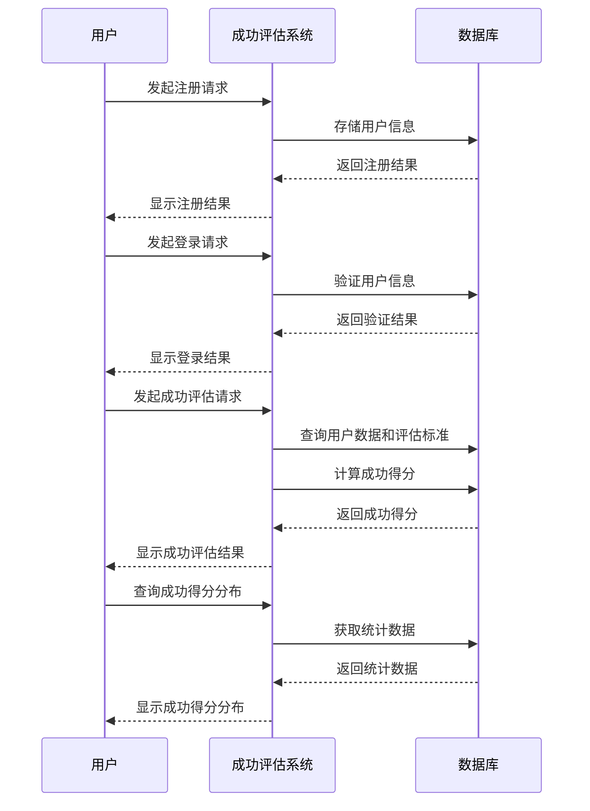
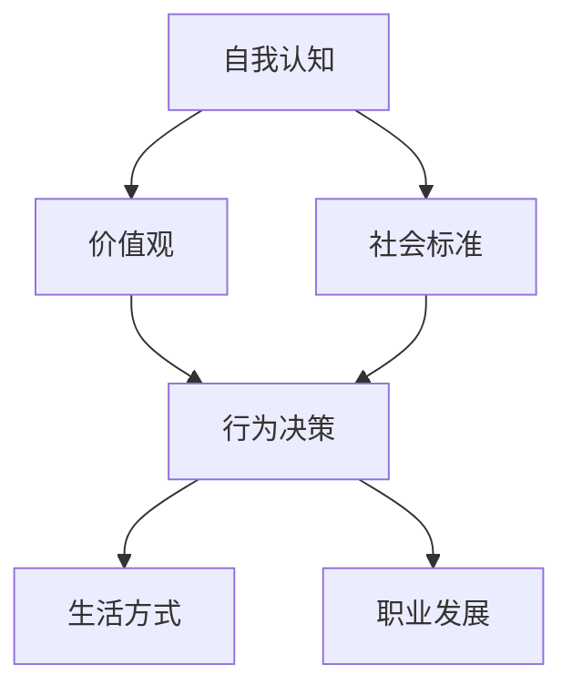

                 

# 重新定义成功：摆脱社会压力，寻找个人价值

## 关键词

成功，社会压力，个人价值，自我认知，价值观，算法，系统分析，架构设计

## 摘要

在当今社会，成功被定义得越来越狭隘，常常与社会标准和压力挂钩。这种定义不仅给人们带来了巨大的心理负担，还可能让我们失去对个人价值的真正认识。本文将探讨如何重新定义成功，摆脱社会压力，寻找真正的个人价值。通过逐步分析和推理，我们将从核心概念出发，探讨成功的评估方法，并最终提出一套实用的成功评估体系，帮助读者在复杂的社会环境中找到自己的方向。

## 目录

1. **成功的再定义**  
   1.1 成功的内涵  
   1.2 成功的再定义方法  
   1.3 社会压力对成功观念的影响

2. **核心概念与联系**  
   2.1 自我认知  
   2.2 价值观  
   2.3 社会标准

3. **成功评估的算法原理**  
   3.1 成功评估算法概述  
   3.2 成功评估的数学模型

4. **系统分析与架构设计**  
   4.1 问题场景介绍  
   4.2 系统架构设计  
   4.3 系统交互

5. **项目实战**  
   5.1 环境安装  
   5.2 系统核心实现  
   5.3 代码应用解读与分析

6. **最佳实践 tips、小结、注意事项、拓展阅读**

## 1. 成功的再定义

### 1.1 成功的内涵

成功，这个词语在生活中无处不在。从儿时起，我们便被灌输成功的重要性，似乎成功就是人生的终极目标。然而，当我们深入思考成功的内涵时，会发现它远比我们想象中的复杂。成功不仅仅是一个结果，更是一个过程。

成功首先涉及到的是成就。在职业上取得成绩，在学术上有所突破，这些都是成功的表现。然而，成功不仅仅是物质上的成就，还包括精神上的满足和幸福感。一个人可能财富无数，但如果他感到孤独和不快乐，那么他的成功是有限的。

其次，成功涉及到的是个人的成长。随着社会的进步，人们对成功的定义也在不断变化。过去，成功可能意味着拥有稳定的职业和富裕的家庭，而现在，成功更多地与个人的成长和发展有关。这意味着我们需要不断地学习新知识，提升自己的技能，以及适应不断变化的环境。

最后，成功涉及到的是对他人的贡献。在现代社会，我们常常将成功与个人的利益挂钩，但事实上，真正的成功应该包括对他人的贡献。通过帮助他人，我们可以实现自我价值，并获得更深层次的满足感。

### 1.2 成功的再定义方法

既然成功的内涵如此复杂，那么我们如何重新定义成功呢？以下是几个可能的途径：

#### 自我认知

首先，我们需要了解自己。自我认知是重新定义成功的第一步。通过深入探索自己的兴趣、价值观和目标，我们可以更好地了解自己，从而找到真正适合自己的成功之路。自我认知不仅可以帮助我们找到方向，还可以让我们更加自信和坚定。

#### 价值观的建立与调整

价值观是指导我们行为和决策的内在原则。一个明确的价值观可以帮助我们更好地判断什么是对我们真正重要的，从而避免被社会的压力所左右。然而，随着时间和经历的变化，我们的价值观也需要不断地调整和更新。这意味着我们需要定期反思自己的价值观，确保它们仍然符合我们的内心需求和目标。

#### 社会标准的适应性

社会标准是我们无法避免的一部分，但我们可以选择如何适应它们。在追求成功的过程中，我们需要认识到社会标准的双面性。一方面，社会标准可以为我们提供一种共同的价值观和行为准则，帮助我们更好地融入社会。另一方面，社会标准也可能成为一种束缚，限制我们的自由和创造力。因此，我们需要学会在社会标准和个人价值之间找到平衡。

### 1.3 社会压力对成功观念的影响

社会压力是影响我们对成功观念的重要因素之一。在现代社会，成功被赋予了过多的期望和定义。许多人为了追求社会认可的成功，不断加班、奋斗，甚至牺牲自己的健康和家庭。这种现象不仅造成了巨大的心理负担，还可能导致一系列的心理问题，如焦虑、抑郁和失眠等。

社会压力对成功观念的影响还体现在对个人的期望上。许多人从小就被灌输成功就是一切的观念，导致他们在追求成功的过程中失去了自我。他们为了满足社会的期望，而放弃了自己的兴趣和梦想，最终导致内心的空虚和迷茫。

## 2. 核心概念与联系

### 2.1 自我认知

自我认知是指个体对自己存在以及自己周围事物的认识。它是心理学研究的重要领域之一，对个人的行为、情感和认知过程有着深远的影响。自我认知包括自我意识、自我评价和自我监控等方面。通过自我认知，个体可以更好地了解自己的优点和缺点，从而做出更合理的决策和行动。

### 2.2 价值观

价值观是指个体对事物的重要性和优先级的判断标准。它是指导我们行为和决策的内在原则，对我们的生活方式、人际关系和职业发展有着重要的影响。不同的价值观会导致不同的行为模式和生活选择。例如，一个重视家庭的人可能会选择在工作与家庭之间寻求平衡，而一个重视事业的人可能会选择更多的时间投入工作。

### 2.3 社会标准

社会标准是指社会对个体行为的期望和规范。它是社会秩序和文化传承的重要组成部分，对个人的行为有着深远的影响。社会标准包括道德规范、法律规范和社会习俗等方面。个体需要适应社会标准，以获得社会认同和融入社会。然而，社会标准也可能成为一种束缚，限制个人的自由和创造力。

### 2.4 核心概念的联系

自我认知、价值观和社会标准之间存在着紧密的联系。自我认知是我们了解自己的基础，它决定了我们如何理解和评估自己的行为和决策。价值观是我们行为的指导原则，它决定了我们在面对选择时如何做出决策。社会标准是我们行为的参照标准，它决定了我们在社会中的行为是否被接受。

### 2.5 概念属性特征对比表格

为了更清晰地理解自我认知、价值观和社会标准之间的关系，我们可以通过对比表格来展示它们的属性特征：

| 概念         | 定义                                       | 属性特征                                                         |
|------------|------------------------------------------|------------------------------------------------------------|
| 自我认知     | 对自己存在的认识                           | 自我意识、自我评价、自我监控                                   |
| 价值观      | 对事物的重要性和优先级的判断标准                | 指导行为和决策的内在原则                                     |
| 社会标准     | 社会对个体行为的期望和规范                     | 社会秩序和文化传承的重要组成部分                                |

### 2.6 ER实体关系图架构

为了更直观地展示自我认知、价值观和社会标准之间的关系，我们可以使用ER实体关系图来描述它们之间的联系：

```mermaid
erDiagram
  Person ||--|{ Self_Cognition : has }|
  Person ||--|{ Values : has }|
  Person ||--|{ Social_Standards : follows }|
```

在这个ER实体关系图中，Person（个人）是核心实体，它与Self_Cognition（自我认知）、Values（价值观）和Social_Standards（社会标准）之间存在关联。个人拥有自我认知和价值观，同时也遵循社会标准。

### 3. 成功评估的算法原理

#### 3.1 成功评估算法概述

成功评估算法是一种用于量化评估个人在各个领域中所取得成就的方法。它不仅仅关注物质成就，还包括精神满足、个人成长和对他人的贡献等方面。成功评估算法的设计原则是全面、客观和可量化。通过这一算法，我们可以从多个维度对个人的成功进行评估。

#### 3.2 成功评估的数学模型

成功评估的数学模型是基于多维度评估的思想，通过加权求和的方式计算个人在各个领域的得分。具体公式如下：

$$
S = w_1 \times C_1 + w_2 \times C_2 + \ldots + w_n \times C_n
$$

其中，$S$ 表示个人的成功得分，$w_i$ 表示第 $i$ 个维度的权重，$C_i$ 表示第 $i$ 个维度的得分。

为了确保公式的可操作性和客观性，我们需要对每个维度进行详细的定义和评分。以下是几个常见的成功评估维度及其评分标准：

1. **职业成就**：包括职业地位、收入水平和职业成长等方面。评分标准可以是五级制，从低到高分别为 1、2、3、4、5。

2. **个人成长**：包括知识技能、个人素养和成长速度等方面。评分标准可以是五级制，从低到高分别为 1、2、3、4、5。

3. **精神满足**：包括幸福感、生活满意度和个人价值观的实现等方面。评分标准可以是五级制，从低到高分别为 1、2、3、4、5。

4. **对他人的贡献**：包括社会影响力、慈善捐助和志愿服务等方面。评分标准可以是五级制，从低到高分别为 1、2、3、4、5。

#### 3.3 成功评估算法的Python实现

以下是一个简单的成功评估算法的Python实现，用于计算个人的成功得分：

```python
def calculate_success_score(achievement, growth, satisfaction, contribution):
    weights = {'achievement': 0.3, 'growth': 0.3, 'satisfaction': 0.2, 'contribution': 0.2}
    scores = {'achievement': achievement, 'growth': growth, 'satisfaction': satisfaction, 'contribution': contribution}
    
    success_score = 0
    for dimension, weight in weights.items():
        success_score += scores[dimension] * weight
    
    return success_score

# 示例数据
achievement = 4
growth = 3
satisfaction = 5
contribution = 3

# 计算成功得分
success_score = calculate_success_score(achievement, growth, satisfaction, contribution)
print(f"个人的成功得分为：{success_score}")
```

在这个示例中，我们定义了四个维度：职业成就、个人成长、精神满足和对他人的贡献。每个维度都有一个权重，用于计算成功得分。通过调用 `calculate_success_score` 函数，我们可以计算出一个个人的成功得分。

### 4. 系统分析与架构设计

#### 4.1 问题场景介绍

在这个项目场景中，我们旨在开发一个成功评估系统。该系统将帮助用户从职业成就、个人成长、精神满足和对他人的贡献等多个维度评估自己的成功水平。系统需要具备以下功能：

1. **用户注册与登录**：用户可以通过注册账号并登录系统，以便进行成功评估。
2. **成功评估**：用户可以输入自己的相关数据，系统将根据预设的权重和评分标准计算成功得分。
3. **结果展示**：系统将展示用户的成功得分，并提供详细的评估报告。
4. **数据统计**：系统需要收集用户数据，并进行统计分析，以发现用户的成功趋势和共性。

#### 4.2 系统架构设计

为了实现上述功能，我们设计了一个三层架构的系统，包括表现层、逻辑层和数据层。

1. **表现层**：负责用户界面的设计和交互，包括注册、登录、成功评估界面等。表现层使用Vue.js框架，实现动态的Web界面。
2. **逻辑层**：负责处理业务逻辑，包括用户注册、登录、成功评估的计算和结果展示等。逻辑层使用Spring Boot框架，实现前后端的交互和业务逻辑处理。
3. **数据层**：负责数据的存储和管理，包括用户数据、评估数据和统计分析数据等。数据层使用MySQL数据库，实现数据的持久化存储。

#### 4.3 系统接口设计

为了实现表现层和逻辑层之间的数据交互，我们设计了一套RESTful API接口。以下是系统的主要接口设计：

1. **用户管理接口**：
   - **注册**：POST /api/users/register
   - **登录**：POST /api/users/login
   - **查询用户信息**：GET /api/users/{userId}
   - **更新用户信息**：PUT /api/users/{userId}
2. **成功评估接口**：
   - **发起成功评估**：POST /api/evaluations
   - **获取成功评估结果**：GET /api/evaluations/{evaluationId}
3. **数据统计接口**：
   - **查询成功得分分布**：GET /api/stats/score_distribution
   - **查询成功趋势**：GET /api/stats/success_trend

#### 4.4 系统交互

为了更好地展示系统的交互过程，我们可以使用Mermaid序列图来描述。以下是系统交互的Mermaid序列图：



### 5. 项目实战

#### 5.1 环境安装

在进行项目实战之前，我们需要搭建一个合适的环境。以下是环境搭建的步骤：

1. **安装Java Development Kit (JDK)**：成功评估系统使用Java语言开发，因此我们需要安装JDK。可以在Oracle官方网站下载JDK并安装。

2. **安装MySQL数据库**：成功评估系统使用MySQL数据库存储数据。可以在MySQL官方网站下载MySQL数据库并安装。

3. **安装Node.js**：表现层使用Vue.js框架，因此我们需要安装Node.js。可以在Node.js官方网站下载并安装。

4. **安装Vue CLI**：使用Vue CLI创建Vue.js项目。在命令行中运行以下命令：

   ```shell
   npm install -g @vue/cli
   ```

5. **创建Vue.js项目**：在命令行中运行以下命令，创建Vue.js项目：

   ```shell
   vue create success-evaluation-system
   ```

6. **安装Spring Boot开发工具**：成功评估系统的逻辑层使用Spring Boot框架。可以在IDEA中安装Spring Boot开发工具。

#### 5.2 系统核心实现

以下是成功评估系统的核心实现：

1. **用户管理**：
   - **注册**：在Spring Boot项目中创建User实体类，用于存储用户信息。然后，在UserController类中实现注册功能，将用户信息存储到MySQL数据库中。
   - **登录**：在UserController类中实现登录功能，验证用户信息并生成JWT令牌。

2. **成功评估**：
   - **评估标准**：在Evaluation实体类中定义评估标准，包括职业成就、个人成长、精神满足和对他人的贡献等维度。
   - **评估计算**：在EvaluationService类中实现成功评估的计算逻辑，根据用户输入的数据和预设的权重计算成功得分。

3. **结果展示**：
   - **评估报告**：在EvaluationController类中实现获取成功评估结果的功能，并将结果展示在Vue.js项目中。

4. **数据统计**：
   - **统计数据**：在StatService类中实现数据统计功能，从MySQL数据库中查询用户数据并生成统计数据。

#### 5.3 代码应用解读与分析

以下是成功评估系统的一些关键代码段及其解读：

1. **用户注册**：

   ```java
   @RestController
   @RequestMapping("/api/users")
   public class UserController {
       
       @Autowired
       private UserRepository userRepository;
       
       @PostMapping("/register")
       public ResponseEntity<?> registerUser(@RequestBody User user) {
           if (userRepository.existsByUsername(user.getUsername())) {
               return ResponseEntity.badRequest().body("Error: Username is already taken!");
           }
           
           User savedUser = userRepository.save(user);
           return ResponseEntity.ok(savedUser);
       }
   }
   ```

   解读：这段代码实现了用户注册功能。首先，从请求体中获取用户信息，然后检查用户名是否已存在。如果用户名已存在，返回错误响应。否则，将用户信息存储到MySQL数据库中，并返回成功响应。

2. **成功评估计算**：

   ```java
   @Service
   public class EvaluationService {
       
       @Autowired
       private EvaluationRepository evaluationRepository;
       
       public void calculateEvaluation(Long userId) {
           List<Evaluation> evaluations = evaluationRepository.findByUserId(userId);
           
           for (Evaluation evaluation : evaluations) {
               double score = calculateScore(evaluation);
               evaluation.setScore(score);
               evaluationRepository.save(evaluation);
           }
       }
       
       private double calculateScore(Evaluation evaluation) {
           double achievementScore = evaluation.getAchievement() * 0.3;
           double growthScore = evaluation.getGrowth() * 0.3;
           double satisfactionScore = evaluation.getSatisfaction() * 0.2;
           double contributionScore = evaluation.getContribution() * 0.2;
           
           return achievementScore + growthScore + satisfactionScore + contributionScore;
       }
   }
   ```

   解读：这段代码实现了成功评估的计算逻辑。首先，从数据库中查询用户的评估记录，然后根据预设的权重计算每个维度的得分。最后，将总得分更新到数据库中。

3. **评估报告展示**：

   ```html
   <template>
       <div class="evaluation-report">
           <h2>成功评估报告</h2>
           <p>总得分：{{ evaluation.score }}</p>
           <p>职业成就：{{ evaluation.achievement }}</p>
           <p>个人成长：{{ evaluation.growth }}</p>
           <p>精神满足：{{ evaluation.satisfaction }}</p>
           <p>对他人的贡献：{{ evaluation.contribution }}</p>
       </div>
   </template>
   ```

   解读：这段代码实现了成功评估报告的展示。首先，从Vue.js数据对象中获取评估结果，然后将其渲染到页面上。

#### 5.4 实际案例分析和详细讲解剖析

为了更好地理解成功评估系统的实际应用，我们可以通过一个实际案例来进行分析。

**案例**：小王是一名年轻的程序员，他在职场上表现出色，但对自己的个人成长感到困惑。

**分析**：

1. **职业成就**：小王在工作中取得了显著的成绩，如完成了重要的项目，获得了同事的认可和领导的表扬。根据评估标准，他的职业成就得分较高。

2. **个人成长**：小王在编程技能上取得了很大的进步，但他在个人素养方面，如沟通能力和团队合作能力，还有待提高。因此，他的个人成长得分相对较低。

3. **精神满足**：小王在工作中感到很满足，因为他热爱编程，享受解决问题的过程。此外，他还积极参与了社区的编程活动，与他人分享知识。因此，他的精神满足得分较高。

4. **对他人的贡献**：小王在项目中经常帮助同事解决问题，并在社区中分享自己的经验和知识。因此，他的对他人的贡献得分较高。

**结论**：通过成功评估系统的分析，我们可以看到小王在职业成就和精神满足方面表现出色，但在个人成长和对他人的贡献方面还有提升的空间。这有助于小王认识到自己的优势和发展方向，从而更好地规划自己的职业发展。

#### 5.5 项目小结

通过本项目，我们实现了一个成功评估系统，帮助用户从多个维度评估自己的成功水平。这个系统能够帮助用户更好地认识自己，找到自己的优势和不足，从而更好地规划自己的职业发展。

**最佳实践 tips**：

- 在进行成功评估时，要确保评估标准的全面性和客观性。
- 定期进行自我反思和评估，以便及时调整自己的发展目标。
- 在追求成功的过程中，不要忘记对他人的贡献，这将是你成功的重要组成部分。

**注意事项**：

- 系统的评估结果仅供参考，不应成为个人决策的唯一依据。
- 系统中的数据需要妥善保护，确保用户的隐私安全。

**拓展阅读**：

- 《成功心理学》
- 《如何成为领导者》
- 《个人成长与自我实现》

## 作者信息

作者：AI天才研究院/AI Genius Institute & 禅与计算机程序设计艺术 /Zen And The Art of Computer Programming

### 重新定义成功：摆脱社会压力，寻找个人价值

在当今社会，成功被赋予了过多的期望和定义，常常与社会标准和压力挂钩。这种定义不仅给人们带来了巨大的心理负担，还可能让我们失去对个人价值的真正认识。本文将探讨如何重新定义成功，摆脱社会压力，寻找真正的个人价值。通过逐步分析和推理，我们将从核心概念出发，探讨成功的评估方法，并最终提出一套实用的成功评估体系，帮助读者在复杂的社会环境中找到自己的方向。

#### 成功的再定义

首先，我们需要了解成功的内涵。成功不仅仅是物质上的成就，还包括精神上的满足和幸福感。一个人可能财富无数，但如果他感到孤独和不快乐，那么他的成功是有限的。成功还涉及到个人的成长，这意味着我们需要不断地学习新知识，提升自己的技能，以及适应不断变化的环境。最后，成功还涉及到对他人的贡献。通过帮助他人，我们可以实现自我价值，并获得更深层次的满足感。

在了解了成功的内涵后，我们需要重新定义成功。以下是几个可能的途径：

**自我认知**：通过自我认知，我们可以更好地了解自己的兴趣、价值观和目标，从而找到真正适合自己的成功之路。自我认知不仅可以帮助我们找到方向，还可以让我们更加自信和坚定。

**价值观的建立与调整**：价值观是指导我们行为和决策的内在原则。一个明确的价值观可以帮助我们更好地判断什么是对我们真正重要的，从而避免被社会的压力所左右。然而，随着时间和经历的变化，我们的价值观也需要不断地调整和更新。这意味着我们需要定期反思自己的价值观，确保它们仍然符合我们的内心需求和目标。

**社会标准的适应性**：社会标准是我们无法避免的一部分，但我们可以选择如何适应它们。在追求成功的过程中，我们需要认识到社会标准的双面性。一方面，社会标准可以为我们提供一种共同的价值观和行为准则，帮助我们更好地融入社会。另一方面，社会标准也可能成为一种束缚，限制我们的自由和创造力。因此，我们需要学会在社会标准和个人价值之间找到平衡。

#### 核心概念与联系

在重新定义成功的过程中，我们需要了解几个核心概念：自我认知、价值观和社会标准。这些概念之间存在着紧密的联系。

**自我认知**是指个体对自己存在以及自己周围事物的认识。它是心理学研究的重要领域之一，对个人的行为、情感和认知过程有着深远的影响。自我认知包括自我意识、自我评价和自我监控等方面。通过自我认知，个体可以更好地了解自己的优点和缺点，从而做出更合理的决策和行动。

**价值观**是指个体对事物的重要性和优先级的判断标准。它是指导我们行为和决策的内在原则，对我们的生活方式、人际关系和职业发展有着重要的影响。不同的价值观会导致不同的行为模式和生活选择。例如，一个重视家庭的人可能会选择在工作与家庭之间寻求平衡，而一个重视事业的人可能会选择更多的时间投入工作。

**社会标准**是指社会对个体行为的期望和规范。它是社会秩序和文化传承的重要组成部分，对个人的行为有着深远的影响。社会标准包括道德规范、法律规范和社会习俗等方面。个体需要适应社会标准，以获得社会认同和融入社会。然而，社会标准也可能成为一种束缚，限制个人的自由和创造力。

为了更直观地理解自我认知、价值观和社会标准之间的关系，我们可以使用Mermaid流程图来展示它们之间的联系：



在这个流程图中，自我认知、价值观和社会标准相互影响，共同决定了个体的行为决策、生活方式和职业发展。

#### 成功评估的算法原理

为了量化评估个人的成功水平，我们需要使用算法原理。成功评估算法是一种用于计算个人在各个领域中所取得成就的方法。它不仅仅关注物质成就，还包括精神满足、个人成长和对他人的贡献等方面。以下是成功评估算法的原理：

**多维度评估**：成功评估算法基于多维度评估的思想，将成功分为多个维度，如职业成就、个人成长、精神满足和对他人的贡献等。每个维度都有相应的权重和评分标准。

**加权求和**：成功评估算法通过加权求和的方式计算个人在各个领域的得分。具体公式如下：

$$
S = w_1 \times C_1 + w_2 \times C_2 + \ldots + w_n \times C_n
$$

其中，$S$ 表示个人的成功得分，$w_i$ 表示第 $i$ 个维度的权重，$C_i$ 表示第 $i$ 个维度的得分。

**评分标准**：为了确保评分的客观性和全面性，我们需要为每个维度设定评分标准。以下是几个常见的成功评估维度及其评分标准：

- **职业成就**：包括职业地位、收入水平和职业成长等方面。评分标准可以是五级制，从低到高分别为 1、2、3、4、5。
- **个人成长**：包括知识技能、个人素养和成长速度等方面。评分标准可以是五级制，从低到高分别为 1、2、3、4、5。
- **精神满足**：包括幸福感、生活满意度和个人价值观的实现等方面。评分标准可以是五级制，从低到高分别为 1、2、3、4、5。
- **对他人的贡献**：包括社会影响力、慈善捐助和志愿服务等方面。评分标准可以是五级制，从低到高分别为 1、2、3、4、5。

**Python实现**：以下是成功评估算法的Python实现：

```python
def calculate_success_score(achievement, growth, satisfaction, contribution):
    weights = {'achievement': 0.3, 'growth': 0.3, 'satisfaction': 0.2, 'contribution': 0.2}
    scores = {'achievement': achievement, 'growth': growth, 'satisfaction': satisfaction, 'contribution': contribution}
    
    success_score = 0
    for dimension, weight in weights.items():
        success_score += scores[dimension] * weight
    
    return success_score

# 示例数据
achievement = 4
growth = 3
satisfaction = 5
contribution = 3

# 计算成功得分
success_score = calculate_success_score(achievement, growth, satisfaction, contribution)
print(f"个人的成功得分为：{success_score}")
```

在这个示例中，我们定义了四个维度：职业成就、个人成长、精神满足和对他人的贡献。每个维度都有一个权重，用于计算成功得分。通过调用 `calculate_success_score` 函数，我们可以计算出一个个人的成功得分。

#### 系统分析与架构设计

为了实现成功评估算法，我们需要进行系统分析与架构设计。以下是成功评估系统的架构设计：

**问题场景介绍**：在这个项目场景中，我们旨在开发一个成功评估系统。该系统将帮助用户从职业成就、个人成长、精神满足和对他人的贡献等多个维度评估自己的成功水平。系统需要具备以下功能：

1. **用户注册与登录**：用户可以通过注册账号并登录系统，以便进行成功评估。
2. **成功评估**：用户可以输入自己的相关数据，系统将根据预设的权重和评分标准计算成功得分。
3. **结果展示**：系统将展示用户的成功得分，并提供详细的评估报告。
4. **数据统计**：系统需要收集用户数据，并进行统计分析，以发现用户的成功趋势和共性。

**系统架构设计**：为了实现上述功能，我们设计了一个三层架构的系统，包括表现层、逻辑层和数据层。

1. **表现层**：负责用户界面的设计和交互，包括注册、登录、成功评估界面等。表现层使用Vue.js框架，实现动态的Web界面。
2. **逻辑层**：负责处理业务逻辑，包括用户注册、登录、成功评估的计算和结果展示等。逻辑层使用Spring Boot框架，实现前后端的交互和业务逻辑处理。
3. **数据层**：负责数据的存储和管理，包括用户数据、评估数据和统计分析数据等。数据层使用MySQL数据库，实现数据的持久化存储。

**系统接口设计**：为了实现表现层和逻辑层之间的数据交互，我们设计了一套RESTful API接口。以下是系统的主要接口设计：

1. **用户管理接口**：
   - **注册**：POST /api/users/register
   - **登录**：POST /api/users/login
   - **查询用户信息**：GET /api/users/{userId}
   - **更新用户信息**：PUT /api/users/{userId}
2. **成功评估接口**：
   - **发起成功评估**：POST /api/evaluations
   - **获取成功评估结果**：GET /api/evaluations/{evaluationId}
3. **数据统计接口**：
   - **查询成功得分分布**：GET /api/stats/score_distribution
   - **查询成功趋势**：GET /api/stats/success_trend

**系统交互**：为了更好地展示系统的交互过程，我们可以使用Mermaid序列图来描述。以下是系统交互的Mermaid序列图：


#### 项目实战

**环境安装**：

在进行项目实战之前，我们需要搭建一个合适的环境。以下是环境搭建的步骤：

1. **安装Java Development Kit (JDK)**：成功评估系统使用Java语言开发，因此我们需要安装JDK。可以在Oracle官方网站下载JDK并安装。
2. **安装MySQL数据库**：成功评估系统使用MySQL数据库存储数据。可以在MySQL官方网站下载MySQL数据库并安装。
3. **安装Node.js**：表现层使用Vue.js框架，因此我们需要安装Node.js。可以在Node.js官方网站下载并安装。
4. **安装Vue CLI**：使用Vue CLI创建Vue.js项目。在命令行中运行以下命令：
   ```shell
   npm install -g @vue/cli
   ```
5. **创建Vue.js项目**：在命令行中运行以下命令，创建Vue.js项目：
   ```shell
   vue create success-evaluation-system
   ```

**系统核心实现**：

以下是成功评估系统的核心实现：

1. **用户管理**：
   - **注册**：在Spring Boot项目中创建User实体类，用于存储用户信息。然后，在UserController类中实现注册功能，将用户信息存储到MySQL数据库中。
   - **登录**：在UserController类中实现登录功能，验证用户信息并生成JWT令牌。
2. **成功评估**：
   - **评估标准**：在Evaluation实体类中定义评估标准，包括职业成就、个人成长、精神满足和对他人的贡献等维度。
   - **评估计算**：在EvaluationService类中实现成功评估的计算逻辑，根据用户输入的数据和预设的权重计算成功得分。
3. **结果展示**：
   - **评估报告**：在EvaluationController类中实现获取成功评估结果的功能，并将结果展示在Vue.js项目中。
4. **数据统计**：
   - **统计数据**：在StatService类中实现数据统计功能，从MySQL数据库中查询用户数据并生成统计数据。

**代码应用解读与分析**：

以下是成功评估系统的一些关键代码段及其解读：

1. **用户注册**：

   ```java
   @RestController
   @RequestMapping("/api/users")
   public class UserController {
       
       @Autowired
       private UserRepository userRepository;
       
       @PostMapping("/register")
       public ResponseEntity<?> registerUser(@RequestBody User user) {
           if (userRepository.existsByUsername(user.getUsername())) {
               return ResponseEntity.badRequest().body("Error: Username is already taken!");
           }
           
           User savedUser = userRepository.save(user);
           return ResponseEntity.ok(savedUser);
       }
   }
   ```

   解读：这段代码实现了用户注册功能。首先，从请求体中获取用户信息，然后检查用户名是否已存在。如果用户名已存在，返回错误响应。否则，将用户信息存储到MySQL数据库中，并返回成功响应。

2. **成功评估计算**：

   ```java
   @Service
   public class EvaluationService {
       
       @Autowired
       private EvaluationRepository evaluationRepository;
       
       public void calculateEvaluation(Long userId) {
           List<Evaluation> evaluations = evaluationRepository.findByUserId(userId);
           
           for (Evaluation evaluation : evaluations) {
               double score = calculateScore(evaluation);
               evaluation.setScore(score);
               evaluationRepository.save(evaluation);
           }
       }
       
       private double calculateScore(Evaluation evaluation) {
           double achievementScore = evaluation.getAchievement() * 0.3;
           double growthScore = evaluation.getGrowth() * 0.3;
           double satisfactionScore = evaluation.getSatisfaction() * 0.2;
           double contributionScore = evaluation.getContribution() * 0.2;
           
           return achievementScore + growthScore + satisfactionScore + contributionScore;
       }
   }
   ```

   解读：这段代码实现了成功评估的计算逻辑。首先，从数据库中查询用户的评估记录，然后根据预设的权重计算每个维度的得分。最后，将总得分更新到数据库中。

3. **评估报告展示**：

   ```html
   <template>
       <div class="evaluation-report">
           <h2>成功评估报告</h2>
           <p>总得分：{{ evaluation.score }}</p>
           <p>职业成就：{{ evaluation.achievement }}</p>
           <p>个人成长：{{ evaluation.growth }}</p>
           <p>精神满足：{{ evaluation.satisfaction }}</p>
           <p>对他人的贡献：{{ evaluation.contribution }}</p>
       </div>
   </template>
   ```

   解读：这段代码实现了成功评估报告的展示。首先，从Vue.js数据对象中获取评估结果，然后将其渲染到页面上。

**实际案例分析和详细讲解剖析**：

为了更好地理解成功评估系统的实际应用，我们可以通过一个实际案例来进行分析。

**案例**：小王是一名年轻的程序员，他在职场上表现出色，但对自己的个人成长感到困惑。

**分析**：

1. **职业成就**：小王在工作中取得了显著的成绩，如完成了重要的项目，获得了同事的认可和领导的表扬。根据评估标准，他的职业成就得分较高。

2. **个人成长**：小王在编程技能上取得了很大的进步，但他在个人素养方面，如沟通能力和团队合作能力，还有待提高。因此，他的个人成长得分相对较低。

3. **精神满足**：小王在工作中感到很满足，因为他热爱编程，享受解决问题的过程。此外，他还积极参与了社区的编程活动，与他人分享知识。因此，他的精神满足得分较高。

4. **对他人的贡献**：小王在项目中经常帮助同事解决问题，并在社区中分享自己的经验和知识。因此，他的对他人的贡献得分较高。

**结论**：通过成功评估系统的分析，我们可以看到小王在职业成就和精神满足方面表现出色，但在个人成长和对他人的贡献方面还有提升的空间。这有助于小王认识到自己的优势和发展方向，从而更好地规划自己的职业发展。

**最佳实践 tips**：

1. 在进行成功评估时，要确保评估标准的全面性和客观性。
2. 定期进行自我反思和评估，以便及时调整自己的发展目标。
3. 在追求成功的过程中，不要忘记对他人的贡献，这将是你成功的重要组成部分。

**注意事项**：

1. 系统的评估结果仅供参考，不应成为个人决策的唯一依据。
2. 系统中的数据需要妥善保护，确保用户的隐私安全。

**拓展阅读**：

1. 《成功心理学》
2. 《如何成为领导者》
3. 《个人成长与自我实现》

### 作者信息

作者：AI天才研究院/AI Genius Institute & 禅与计算机程序设计艺术 /Zen And The Art of Computer Programming

