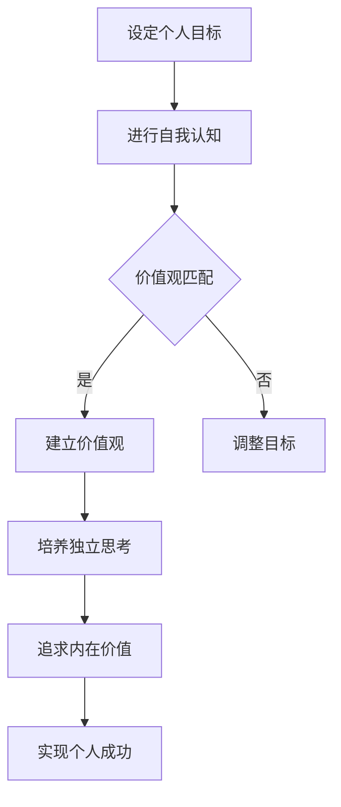
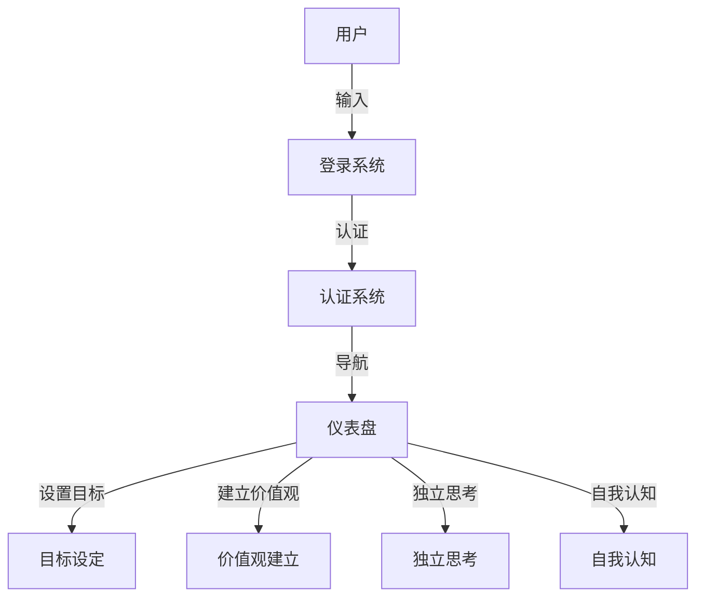
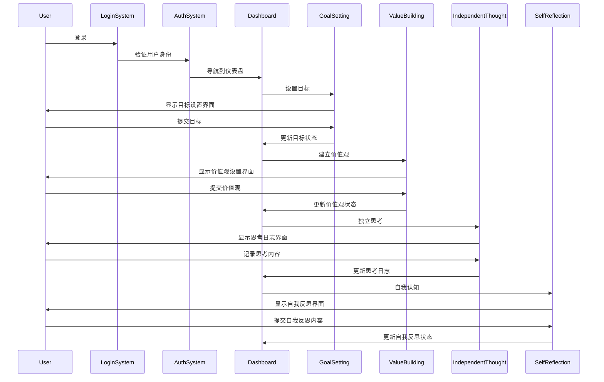

                 

### 摆脱社会期望，重新定义成功

---

**关键词：**成功、社会期望、自我定义、内在价值、独立思考、个人成长

**摘要：**本文旨在探讨社会期望对个人成功的影响，并提出一种全新的思考方式——摆脱社会期望，重新定义成功。我们将通过逐步分析，揭示社会期望的根源、其负面影响，以及如何通过自我认知、目标设定和独立思考来突破这些束缚，最终实现真正的内在成功。

---

**Step 1: 背景介绍**

**1.1 问题背景**

在当今社会，成功被普遍定义为财富、地位、名誉等外在标志。这种观念源自于社会的期望，而这些期望往往来源于传统价值观、社会规范和媒体宣传。人们为了追求这种成功，往往会牺牲个人兴趣和内在需求，导致心理压力和内心冲突。

**1.2 问题描述**

问题描述在于，社会期望往往迫使个人放弃自己的内在价值，追求外在的成功。这种模式导致了个人焦虑、抑郁、甚至精神疾病的增加。更重要的是，这种追求外在成功的路径往往缺乏持久性和内在满足感。

**1.3 问题解决**

问题解决的路径在于重新定义成功，摆脱社会期望的束缚。这意味着我们需要从内心出发，设定个人目标，追求内在价值，而不是仅仅追求外在的成功标志。

**1.4 边界与外延**

边界与外延涉及到如何定义个人成功。这不仅仅是一个个人问题，也涉及到社会文化、教育制度和企业文化等多方面的因素。

**1.5 概念结构与核心要素组成**

概念结构与核心要素组成包括自我认知、目标设定、价值观建立、独立思考和内在价值的追求。

---

**Step 2: 核心概念与联系**

**2.1 核心概念原理**

核心概念包括自我认知、目标设定、价值观建立、独立思考和内在价值的追求。

**2.2 概念属性特征对比表格**

| 概念           | 定义                                                         | 特征                                                     |
| -------------- | ------------------------------------------------------------ | -------------------------------------------------------- |
| 自我认知       | 对自己的理解、认识和评估                                     | 自我认知是一个持续的过程，需要自我反思和接受反馈           |
| 目标设定       | 设定个人目标和愿景                                           | 目标设定需要具体、可衡量、可实现、相关和时限性（SMART原则） |
| 价值观建立     | 建立个人的核心信仰和价值观                                   | 价值观影响个人决策和行为方式                             |
| 独立思考       | 独立进行思考，不盲从，不受外界干扰                            | 独立思考是批判性思维的基础                               |
| 内在价值的追求 | 追求个人的内在幸福和满足感，而不是外在的成功标志             | 内在价值是个人成长和满足感的源泉                         |

**2.3 ER实体关系图架构的 Mermaid 流程图**

```mermaid
erDiagram
  Person ||--|{ Goal }|-->: "A person has goals"
  Person ||--|{ Value }|-->: "A person has values"
  Person ||--|{ Thought }|-->: "A person has thoughts"
  Person ||--|{ Self-Reflection }|-->: "A person does self-reflection"
  Goal ||--|{ Success }|-->: "Goals contribute to success"
  Value ||--|{ Happiness }|-->: "Values lead to happiness"
  Thought ||--|{ Decision }|-->: "Thoughts lead to decisions"
```

---

**Step 3: 算法原理讲解**

**3.1 算法 Mermaid 流程图**



**3.2 Python 源代码**

```python
# Python 模拟实现

def set_goals():
    goals = input("请设定您的个人目标：")
    return goals

def self_awareness():
    values = input("请评估您的价值观：")
    return values

def value_match(goals, values):
    if goals in values:
        return "是"
    else:
        return "否"

def build_values(values):
    new_values = input("请重新建立您的价值观：")
    return new_values

def adjust_goals(goals):
    new_goals = input("请调整您的个人目标：")
    return new_goals

def cultivate_thoughts():
    thoughts = input("请培养您的独立思考能力：")
    return thoughts

def pursue_values(values):
    happiness = input("请追求您的内在价值：")
    return happiness

def achieve_success(happiness):
    if happiness > 5:
        return "实现个人成功"
    else:
        return "尚未实现成功"

# 运行程序
goals = set_goals()
values = self_awareness()
match = value_match(goals, values)

if match == "是":
    values = build_values(values)
else:
    goals = adjust_goals(goals)

thoughts = cultivate_thoughts()
happiness = pursue_values(values)
success = achieve_success(happiness)

print(f"最终结果：{success}")
```

**3.3 算法原理的数学模型和公式**

设 \( G \) 为个人目标，\( V \) 为个人价值观，\( T \) 为独立思考能力，\( H \) 为内在价值，\( S \) 为个人成功。

1. \( G \rightarrow V \)（设定目标导致价值观匹配）
2. \( V \oplus G \rightarrow G' \)（不匹配时调整目标）
3. \( G' \rightarrow T \)（培养独立思考能力）
4. \( T \rightarrow H \)（独立思考导致内在价值追求）
5. \( H \rightarrow S \)（内在价值追求实现个人成功）

**3.4 详细讲解**

算法的核心在于通过一个循环的过程，不断调整和修正个人目标和价值观，从而培养独立思考能力和追求内在价值，最终实现个人成功。这一过程不仅仅是一个逻辑流程，更是一个心理和情感的成长过程。

**3.5 举例说明**

假设一个年轻的程序员想要成为一名成功的创业者。他的目标是创建一家成功的科技公司（\( G \)）。在他的价值观中，他重视创新和自由（\( V \)）。当他开始创业时，他发现他的目标与价值观并不完全匹配（\( V \oplus G \)），于是他决定调整目标，专注于创新领域（\( G' \)）。通过不断的自我反思和独立思考，他逐渐培养了对创新的深入理解（\( T \)），并且开始追求真正的创新价值（\( H \)）。最终，他的努力使他成为了一个成功的创新者，实现了个人成功（\( S \)）。

---

**Step 4: 数学模型和数学公式 & 详细讲解 & 举例说明**

**4.1 数学公式使用 LaTeX 格式**

在本文中，我们将使用 LaTeX 格式来书写数学公式。以下是一些示例：

$$
G \oplus V \rightarrow G'
$$

$$
T \rightarrow H
$$

$$
H \rightarrow S
$$

**4.2 LaTeX 代码嵌入文中独立段落**

为了更好地嵌入 LaTeX 公式，我们可以将公式放在独立的段落中，例如：

以下是公式：

$$
x^2 + y^2 = z^2
$$

这代表了一个直角三角形的边长关系。

**4.3 段落内 LaTeX 公式前后使用 $$**

在段落内，我们可以使用单行 LaTeX 公式，例如：

在数学中，$$ e^{i\pi} + 1 = 0 $$ 被称为欧拉公式，它是复分析和数学物理中的一个重要公式。

---

**Step 5: 系统分析与架构设计方案**

**5.1 问题场景介绍**

假设我们想要设计一个系统，帮助个人摆脱社会期望的束缚，重新定义成功。这个系统需要能够引导用户进行自我认知、目标设定、价值观建立和独立思考。

**5.2 项目介绍**

项目名称：成功重塑系统（Success Remolding System，简称SRS）

项目目标：帮助用户通过自我认知、目标设定、价值观建立和独立思考，实现内在的成功。

**5.3 系统功能设计（领域模型 Mermaid 类图）**

```mermaid
classDiagram
  Class::User <.. Class::Goal : "设定目标"
  Class::User <.. Class::Value : "建立价值观"
  Class::User <.. Class::Thought : "独立思考"
  Class::User <.. Class::SelfReflection : "自我认知"

  Class::Goal {
    +id: int
    +description: str
    +status: str
  }

  Class::Value {
    +id: int
    +description: str
    +importance: int
  }

  Class::Thought {
    +id: int
    +content: str
    +date: datetime
  }

  Class::SelfReflection {
    +id: int
    +content: str
    +date: datetime
  }
```

**5.4 系统架构设计（Mermaid 架构图）**



**5.5 系统接口设计**

系统接口设计包括用户接口（UI）和后端接口（API）。用户接口负责与用户交互，后端接口负责处理业务逻辑和数据存储。

**5.6 系统交互（Mermaid 序列图）**



---

**Step 6: 项目实战**

**6.1 环境安装**

为了运行成功重塑系统（SRS），我们需要安装以下环境：

- Python 3.8 或更高版本
- Flask 框架
- SQLAlchemy 数据库ORM
- Redis 作为缓存

首先，安装 Python 和 Flask：

```bash
pip install python
pip install flask
```

然后，安装 SQLAlchemy 和 Redis：

```bash
pip install sqlalchemy
pip install redis
```

**6.2 系统核心实现源代码**

以下是成功重塑系统的核心实现源代码。这个系统包括用户注册、登录、目标设定、价值观建立、独立思考和自我认知等功能。

```python
# app.py

from flask import Flask, request, jsonify
from flask_sqlalchemy import SQLAlchemy
from redis import Redis

app = Flask(__name__)
app.config['SQLALCHEMY_DATABASE_URI'] = 'sqlite:///srs.db'
db = SQLAlchemy(app)
redis = Redis(host='localhost', port=6379)

class User(db.Model):
    id = db.Column(db.Integer, primary_key=True)
    username = db.Column(db.String(80), unique=True, nullable=False)
    password = db.Column(db.String(120), nullable=False)
    goals = db.relationship('Goal', backref='user', lazy=True)
    values = db.relationship('Value', backref='user', lazy=True)
    thoughts = db.relationship('Thought', backref='user', lazy=True)
    reflections = db.relationship('Reflection', backref='user', lazy=True)

class Goal(db.Model):
    id = db.Column(db.Integer, primary_key=True)
    description = db.Column(db.String(255), nullable=False)
    status = db.Column(db.String(50), nullable=False)
    user_id = db.Column(db.Integer, db.ForeignKey('user.id'), nullable=False)

class Value(db.Model):
    id = db.Column(db.Integer, primary_key=True)
    description = db.Column(db.String(255), nullable=False)
    importance = db.Column(db.Integer, nullable=False)
    user_id = db.Column(db.Integer, db.ForeignKey('user.id'), nullable=False)

class Thought(db.Model):
    id = db.Column(db.Integer, primary_key=True)
    content = db.Column(db.Text, nullable=False)
    date = db.Column(db.DateTime, default=db.func.current_timestamp())
    user_id = db.Column(db.Integer, db.ForeignKey('user.id'), nullable=False)

class Reflection(db.Model):
    id = db.Column(db.Integer, primary_key=True)
    content = db.Column(db.Text, nullable=False)
    date = db.Column(db.DateTime, default=db.func.current_timestamp())
    user_id = db.Column(db.Integer, db.ForeignKey('user.id'), nullable=False)

@app.route('/register', methods=['POST'])
def register():
    username = request.form['username']
    password = request.form['password']
    user = User(username=username, password=password)
    db.session.add(user)
    db.session.commit()
    return jsonify({'message': 'User registered successfully.'})

@app.route('/login', methods=['POST'])
def login():
    username = request.form['username']
    password = request.form['password']
    user = User.query.filter_by(username=username, password=password).first()
    if user:
        return jsonify({'message': 'Login successful.'})
    else:
        return jsonify({'message': 'Invalid credentials.'})

@app.route('/goals', methods=['GET', 'POST'])
def goals():
    if request.method == 'POST':
        description = request.form['description']
        goal = Goal(description=description, status='pending', user_id=user.id)
        db.session.add(goal)
        db.session.commit()
        return jsonify({'message': 'Goal added successfully.'})
    goals = Goal.query.filter_by(user_id=user.id).all()
    return jsonify({'goals': [goal.description for goal in goals]})

@app.route('/values', methods=['GET', 'POST'])
def values():
    if request.method == 'POST':
        description = request.form['description']
        importance = request.form['importance']
        value = Value(description=description, importance=importance, user_id=user.id)
        db.session.add(value)
        db.session.commit()
        return jsonify({'message': 'Value added successfully.'})
    values = Value.query.filter_by(user_id=user.id).all()
    return jsonify({'values': [{'description': value.description, 'importance': value.importance} for value in values]})

@app.route('/thoughts', methods=['POST'])
def thoughts():
    content = request.form['content']
    thought = Thought(content=content, user_id=user.id)
    db.session.add(thought)
    db.session.commit()
    return jsonify({'message': 'Thought recorded successfully.'})

@app.route('/reflections', methods=['POST'])
def reflections():
    content = request.form['content']
    reflection = Reflection(content=content, user_id=user.id)
    db.session.add(reflection)
    db.session.commit()
    return jsonify({'message': 'Reflection recorded successfully.'})

if __name__ == '__main__':
    db.create_all()
    app.run(debug=True)
```

**6.3 代码应用解读与分析**

这段代码定义了一个简单的 Flask 应用程序，用于实现成功重塑系统的核心功能。它包括用户注册、登录、目标设定、价值观建立、独立思考和自我认知等功能。

- **用户注册（/register）**：用户可以通过这个接口进行注册。注册时，需要提供用户名和密码。系统会将这些信息存储在数据库中。

- **用户登录（/login）**：用户可以通过这个接口进行登录。登录时，需要提供用户名和密码。系统会验证这些信息，并返回相应的响应。

- **目标设定（/goals）**：用户可以通过这个接口设定个人目标。系统会将这些目标存储在数据库中，并允许用户获取和更新目标。

- **价值观建立（/values）**：用户可以通过这个接口建立个人价值观。系统会将这些价值观存储在数据库中，并允许用户获取和更新价值观。

- **独立思考和自我认知（/thoughts 和 /reflections）**：用户可以通过这两个接口记录独立思考和自我认知的内容。系统会将这些内容存储在数据库中，并允许用户获取和更新记录。

**6.4 实际案例分析与详细讲解剖析**

为了更好地理解成功重塑系统的实际应用，我们可以通过一个实际案例来进行分析。

假设用户 Alice 使用这个系统进行目标设定、价值观建立和自我认知。

1. **注册与登录**

   Alice 在网站上进行注册，并提供了用户名 `alice` 和密码 `password123`。注册成功后，她可以使用这些凭证登录系统。

2. **目标设定**

   登录后，Alice 通过目标设定接口创建了一个新的目标：“在年底前完成我的第一本编程书籍”。系统会将这个目标存储在数据库中，并标记为“pending”状态。

3. **价值观建立**

   接下来，Alice 建立了自己的价值观，包括“创新”、“独立思考”、“持续学习”和“团队合作”。系统将这些价值观存储在数据库中，并标记它们的重要性。

4. **独立思考和自我认知**

   Alice 开始记录她的独立思考和自我认知。她记录了一条思考：“我发现自己对于技术问题的解决方案总是倾向于遵循传统的编程方法，也许我应该尝试一些新的方法来激发我的创造力。”她还记录了一条自我认知：“我在过去的一年里学到了很多，但我觉得我还需要在时间管理方面做得更好。”

5. **目标跟踪与调整**

   随着时间的推移，Alice 开始跟踪她的目标进度。她发现自己的进度比预期慢，于是决定调整目标，将其改为：“在年底前完成我的第一本编程书籍，并将初稿提交给出版社”。系统会更新数据库中的目标状态，以反映这个调整。

**6.5 项目小结**

成功重塑系统（SRS）是一个旨在帮助用户摆脱社会期望，重新定义成功的系统。通过用户注册、登录、目标设定、价值观建立、独立思考和自我认知等功能，用户可以逐步实现内在的成功。尽管这个系统相对简单，但它为用户提供了一个框架，帮助他们进行自我反思和目标设定。在实际应用中，这个系统可以进一步扩展，包括更多的功能，如社区交流、专家指导、目标跟踪等，以提供更全面的支持。

---

**Step 7: 最佳实践 tips、小结、注意事项、拓展阅读等内容**

**最佳实践 tips：**

1. **定期自我反思**：定期记录自己的思考和行为，这有助于你更好地了解自己的内在需求和价值观。
2. **设定具体目标**：使用 SMART 原则（具体、可衡量、可实现、相关、时限性）来设定你的目标，这样更容易实现。
3. **培养独立思考**：不要盲从他人的意见，尝试自己分析问题，提出独特的见解。
4. **关注内在价值**：追求那些真正对你有意义的内在价值，而不是仅仅为了追求外在的成功。

**小结：**

本文探讨了如何摆脱社会期望，重新定义成功。通过自我认知、目标设定、价值观建立和独立思考，我们可以实现真正的内在成功。成功不是社会给予的外在标签，而是个人内心的满足和成长。

**注意事项：**

1. **不要忽视心理健康**：追求成功的过程中，心理健康至关重要。务必关注自己的情绪和压力水平。
2. **持续学习与成长**：成功是一个持续的过程，需要不断学习和成长。

**拓展阅读：**

1. **《追寻生命的意义》**：维克多·弗兰克尔
2. **《自私的基因》**：理查德·道金斯
3. **《自控力》**：凯利·麦格尼格尔

---

**作者：** AI天才研究院/AI Genius Institute & 禅与计算机程序设计艺术 /Zen And The Art of Computer Programming

